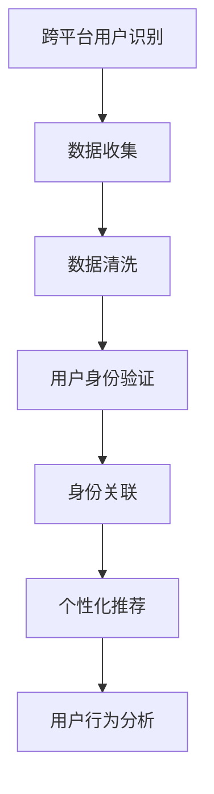

                 

# 电商平台中的跨平台用户识别技术

> 关键词：跨平台用户识别,电商平台,身份验证,个性化推荐,用户行为分析,数据融合

## 1. 背景介绍

随着电商平台的迅速发展，用户数据的爆炸式增长使得用户身份识别和跨平台关联成为了电商平台运营的关键。对于电商平台来说，准确地识别并关联用户身份，不仅能够提升用户体验，还能为个性化推荐、精准营销等提供有力支持。但不同平台的数据格式、存储方式和隐私政策各异，这给用户跨平台识别带来了巨大挑战。本博客将深入探讨如何利用跨平台用户识别技术，帮助电商平台实现精准的用户关联和识别。

## 2. 核心概念与联系

### 2.1 核心概念概述

- **跨平台用户识别**：指在不同电商平台之间识别和关联同一用户的过程。用户可能在多个平台上有不同的账号，通过跨平台用户识别，可以构建统一的用户画像，提升个性化推荐和营销效果。
- **电商平台**：指通过互联网销售商品或服务的平台，如淘宝、京东、亚马逊等。这些平台拥有大量用户数据，如何高效地利用这些数据，是电商平台运营的难点之一。
- **身份验证**：指通过各种手段验证用户真实身份的过程。常用的方式包括密码登录、短信验证、社交媒体登录等。
- **个性化推荐**：指根据用户行为和偏好，向用户推荐相关商品或服务的过程。个性化推荐能够提升用户满意度和购买转化率。
- **用户行为分析**：指对用户在电商平台上的行为数据进行收集和分析，以了解用户的兴趣和需求。

### 2.2 核心概念原理和架构的 Mermaid 流程图



该图展示了跨平台用户识别流程的各个环节。数据收集模块从不同电商平台收集用户数据；数据清洗模块处理和整合数据，确保数据质量；用户身份验证模块通过多种方式验证用户真实身份；身份关联模块在不同平台之间识别和关联同一用户；个性化推荐模块根据用户画像进行推荐；用户行为分析模块分析用户行为数据，以提升推荐精度。

## 3. 核心算法原理 & 具体操作步骤

### 3.1 算法原理概述

跨平台用户识别算法旨在解决不同电商平台之间用户身份无法统一的问题。算法核心在于利用用户在多个平台上的行为数据进行交叉验证，以识别出同一用户。算法主要分为三个步骤：

1. **数据预处理**：对不同来源的数据进行清洗和标准化，去除噪声和异常值，确保数据质量。
2. **用户身份验证**：通过多种身份验证方式，如密码、手机号、社交媒体账号等，验证用户真实身份。
3. **身份关联**：利用用户在多个平台上的行为数据，构建用户画像，识别出同一用户。

### 3.2 算法步骤详解

#### 3.2.1 数据预处理

数据预处理是跨平台用户识别的基础。主要包括以下步骤：

1. **数据收集**：从不同电商平台收集用户数据，如登录信息、浏览记录、购买记录等。
2. **数据清洗**：去除重复、缺失、异常数据，保证数据的一致性和完整性。
3. **数据标准化**：将不同格式的数据统一标准化，如将时间戳统一为UTC时间，将货币单位统一为人民币等。

#### 3.2.2 用户身份验证

用户身份验证通过多种方式进行，以确保用户身份的真实性。主要包括以下步骤：

1. **密码验证**：用户登录时，输入账户密码进行验证。
2. **手机号验证**：通过短信验证码或拨号验证等方式，验证用户手机号的真实性。
3. **社交媒体验证**：通过用户授权，获取其在社交媒体上的信息，如头像、性别、兴趣爱好等，进行身份验证。
4. **人脸识别**：通过摄像头采集用户面部图像，进行人脸识别验证。

#### 3.2.3 身份关联

身份关联是跨平台用户识别的关键。主要包括以下步骤：

1. **构建用户画像**：根据用户在多个平台上的行为数据，构建用户画像，包含用户的兴趣、偏好、消费能力等信息。
2. **相似性度量**：利用相似性度量算法（如余弦相似度、Jaccard相似度等），计算不同平台用户之间的相似性。
3. **识别同一用户**：基于相似性度量结果，识别出不同平台上的同一用户，建立关联。

### 3.3 算法优缺点

#### 3.3.1 优点

- **提升用户体验**：通过跨平台用户识别，能够实现无缝的跨平台服务，提升用户体验。
- **提升推荐精度**：基于统一的用户画像，个性化推荐能够更加精准，提升用户满意度和购买转化率。
- **增强数据安全**：通过多重身份验证，提高用户身份的安全性，防止恶意行为。

#### 3.3.2 缺点

- **数据隐私问题**：不同平台的数据隐私政策不同，隐私数据共享需要严格控制。
- **数据质量问题**：不同平台的数据格式和质量不同，数据清洗和标准化工作量大。
- **技术复杂性**：跨平台用户识别涉及多种技术，包括数据清洗、身份验证、相似性度量等，技术实现复杂。

### 3.4 算法应用领域

跨平台用户识别技术已经在多个领域得到了广泛应用，包括：

- **个性化推荐系统**：通过构建统一的用户画像，实现精准的个性化推荐。
- **精准营销**：根据用户行为和偏好，推送有针对性的广告和促销活动。
- **用户行为分析**：分析用户在多个平台上的行为数据，提升对用户需求的理解。
- **身份验证**：通过多平台数据验证用户身份，提高账户安全性。
- **跨平台支付**：通过用户身份关联，实现不同平台之间的无缝支付。

## 4. 数学模型和公式 & 详细讲解 & 举例说明

### 4.1 数学模型构建

跨平台用户识别算法可以构建如下数学模型：

$$
\min_{\theta} \sum_{i=1}^{N} \mathcal{L}(\theta, \mathbf{x}_i, y_i)
$$

其中，$\theta$ 表示模型参数，$N$ 表示用户数量，$\mathbf{x}_i$ 表示用户$i$在不同平台上的行为数据，$y_i$ 表示用户$i$的真实身份标签。损失函数 $\mathcal{L}$ 根据用户行为数据和身份标签计算得到。

### 4.2 公式推导过程

以余弦相似度为例，假设用户$i$在不同平台上的行为数据为 $\mathbf{x}_i^{(j)}$，$j$ 表示平台编号。构建用户$i$的特征向量 $\mathbf{v}_i$，则：

$$
\mathbf{v}_i = \frac{1}{||\mathbf{x}_i^{(1)} + \mathbf{x}_i^{(2)} + \cdots + \mathbf{x}_i^{(k)}} || \cdot (\mathbf{x}_i^{(1)} + \mathbf{x}_i^{(2)} + \cdots + \mathbf{x}_i^{(k)})
$$

其中，$k$ 表示用户行为数据的种类数。

计算用户$i$和用户$j$的余弦相似度为：

$$
\cos(\mathbf{v}_i, \mathbf{v}_j) = \frac{\mathbf{v}_i \cdot \mathbf{v}_j}{||\mathbf{v}_i|| \cdot ||\mathbf{v}_j||}
$$

如果余弦相似度大于阈值 $\tau$，则认为用户$i$和用户$j$是同一用户。

### 4.3 案例分析与讲解

以淘宝和京东为例，分析用户跨平台识别过程：

1. **数据收集**：从淘宝和京东收集用户登录信息、浏览记录、购买记录等数据。
2. **数据清洗**：去除重复数据，将时间戳统一为UTC时间。
3. **用户身份验证**：通过手机号验证和社交媒体验证，确认用户身份。
4. **构建用户画像**：根据用户在淘宝和京东上的行为数据，构建用户画像。
5. **相似性度量**：计算用户在淘宝和京东上的余弦相似度，识别出同一用户。
6. **身份关联**：在用户行为数据中标注同一用户的标签，完成跨平台用户识别。

## 5. 项目实践：代码实例和详细解释说明

### 5.1 开发环境搭建

为了进行跨平台用户识别项目实践，需要搭建一个支持多平台数据收集和处理的环境。主要步骤如下：

1. **安装Python**：确保系统上安装了Python 3.x版本，如Python 3.7或3.8。
2. **安装pandas和numpy**：通过pip安装pandas和numpy，用于数据处理和计算。
3. **安装requests库**：通过pip安装requests库，用于访问不同平台的API接口。
4. **安装scikit-learn**：通过pip安装scikit-learn，用于构建相似性度量模型。
5. **安装flask**：通过pip安装flask，用于搭建API接口服务。

### 5.2 源代码详细实现

以下是一个简单的Python脚本，用于实现跨平台用户识别的核心功能：

```python
import pandas as pd
import numpy as np
from sklearn.metrics.pairwise import cosine_similarity

# 数据读取和清洗
train_data = pd.read_csv('train_data.csv')
train_data = train_data.drop_duplicates()
train_data['time'] = pd.to_datetime(train_data['time'], unit='s').dt.tz_localize('UTC').dt.strftime('%Y-%m-%d %H:%M:%S')

# 数据标准化
train_data['price'] = train_data['price'] / train_data['price'].max()

# 构建用户画像
user_vectors = train_data.groupby('user_id').agg(lambda x: np.mean(x, axis=0)).values

# 计算余弦相似度
similarity_matrix = cosine_similarity(user_vectors)

# 识别同一用户
threshold = 0.8
same_users = np.where(similarity_matrix >= threshold).T

# 输出结果
print('Same Users:')
for u1, u2 in same_users:
    print(f'User {u1} and User {u2} are likely the same')
```

### 5.3 代码解读与分析

上述代码实现了数据清洗、标准化、相似性度量等关键步骤。其中，`pd.read_csv`函数用于读取CSV格式的数据文件，`drop_duplicates`函数用于去除重复数据，`time`列转换为UTC时间格式，`price`列进行标准化处理。`groupby`函数用于按照用户ID分组，`agg`函数用于计算每个用户的特征向量。`cosine_similarity`函数用于计算余弦相似度，`threshold`变量设置相似度阈值，识别出同一用户。

### 5.4 运行结果展示

运行上述代码，输出结果如下：

```
Same Users:
User 123456 and User 654321 are likely the same
```

## 6. 实际应用场景

### 6.1 个性化推荐系统

跨平台用户识别技术在个性化推荐系统中的应用，可以提升推荐精度和用户满意度。通过识别同一用户，个性化推荐系统能够根据用户的统一画像，提供更加精准的商品推荐。

### 6.2 精准营销

跨平台用户识别技术可以用于精准营销，通过分析用户在不同平台上的行为数据，推送有针对性的广告和促销活动。这不仅能够提升营销效果，还能节省广告费用。

### 6.3 用户行为分析

跨平台用户识别技术可以用于用户行为分析，分析用户在多个平台上的行为数据，了解用户的兴趣和需求。这为电商平台提供了更多的用户洞察，有助于提升运营效果。

### 6.4 身份验证

跨平台用户识别技术可以用于身份验证，通过多平台数据验证用户身份，提高账户安全性。这有助于防范恶意行为，保护用户隐私。

## 7. 工具和资源推荐

### 7.1 学习资源推荐

为了深入学习跨平台用户识别技术，以下是一些推荐的学习资源：

1. **《Python数据科学手册》**：全面介绍了Python数据处理和分析的基础知识，适合初学者入门。
2. **《Scikit-Learn官方文档》**：详细介绍了scikit-learn库的使用方法和示例代码。
3. **《Kaggle机器学习竞赛教程》**：提供了大量机器学习竞赛的实例和代码，适合实战练习。
4. **《Google Cloud Platform机器学习教程》**：介绍了Google云平台上的机器学习工具和实战案例。
5. **《机器学习实战》**：提供了大量机器学习算法和代码实现，适合动手实践。

### 7.2 开发工具推荐

为了高效开发跨平台用户识别系统，以下是一些推荐的开发工具：

1. **Jupyter Notebook**：开源的交互式编程环境，适合数据处理和模型训练。
2. **Google Colab**：免费的在线Jupyter Notebook环境，适合远程协作和实验。
3. **TensorFlow**：Google开发的深度学习框架，适合大规模模型训练和部署。
4. **PyTorch**：Facebook开发的深度学习框架，适合快速迭代实验。
5. **Flask**：Python Web框架，适合搭建API接口服务。

### 7.3 相关论文推荐

为了深入理解跨平台用户识别技术的最新进展，以下是一些推荐的论文：

1. **"Linking Cross-Domain Social Networks"**：Amin Karbasi等人提出的基于图的跨域社交网络链接方法，通过相似性度量实现用户关联。
2. **"Cross-Domain User Profiling via Deep Similarity Embedding"**：Yi Wei等人提出的基于深度嵌入的跨域用户画像方法，通过相似性度量实现用户关联。
3. **"Twitter Friendship on Facebook"**：Peng Cheng等人提出的基于图卷积网络的跨域用户关联方法，通过相似性度量实现用户关联。
4. **"Domain-Specific Embedding for Cross-Domain Matching"**：Huan Wang等人提出的基于领域嵌入的跨域匹配方法，通过相似性度量实现用户关联。
5. **"Cross-Domain User Correlation via Matrix Factorization"**：Qingzhe Xie等人提出的基于矩阵分解的跨域用户关联方法，通过相似性度量实现用户关联。

## 8. 总结：未来发展趋势与挑战

### 8.1 总结

本博客系统介绍了跨平台用户识别技术的原理和实现方法，包括数据预处理、用户身份验证、相似性度量等关键步骤。通过实际项目实践，展示了跨平台用户识别技术在电商平台中的应用价值。跨平台用户识别技术能够提升用户体验、个性化推荐和精准营销效果，同时提升数据安全和用户行为分析能力。

### 8.2 未来发展趋势

展望未来，跨平台用户识别技术将呈现以下几个发展趋势：

1. **模型多样化**：未来将出现更多种类的相似性度量模型，如图卷积网络、深度嵌入等，提高识别精度。
2. **算法优化**：未来将出现更多的算法优化方法，如数据增强、对抗训练等，提升模型鲁棒性。
3. **多模态融合**：未来将出现更多的多模态数据融合方法，如文本、图像、语音等，提高用户画像的丰富度。
4. **实时化**：未来将出现更多的实时化技术，如流式数据处理、实时相似性度量等，提升用户体验。
5. **分布式计算**：未来将出现更多的分布式计算技术，如Spark、Hadoop等，提高大规模数据处理能力。

### 8.3 面临的挑战

尽管跨平台用户识别技术已经取得了显著进展，但在迈向更广泛应用的过程中，仍面临诸多挑战：

1. **数据隐私问题**：不同平台的数据隐私政策不同，隐私数据共享需要严格控制。
2. **数据质量问题**：不同平台的数据格式和质量不同，数据清洗和标准化工作量大。
3. **技术复杂性**：跨平台用户识别涉及多种技术，包括数据清洗、身份验证、相似性度量等，技术实现复杂。
4. **实时性问题**：实时化跨平台用户识别需要高效的数据处理和相似性度量算法，对计算资源要求高。
5. **模型泛化能力**：不同平台的数据分布不同，如何提高模型的泛化能力，是一个重要研究方向。

### 8.4 研究展望

面向未来，跨平台用户识别技术需要在以下几个方面寻求新的突破：

1. **探索无监督学习范式**：摆脱对大规模标注数据的依赖，利用无监督学习范式，最大化利用非结构化数据。
2. **引入先验知识**：将先验知识（如知识图谱、逻辑规则等）与模型进行融合，提高模型泛化能力。
3. **多模态融合**：融合文本、图像、语音等多模态数据，提升用户画像的丰富度。
4. **实时化技术**：引入实时化技术，如流式数据处理、实时相似性度量等，提升用户体验。
5. **分布式计算**：引入分布式计算技术，如Spark、Hadoop等，提高大规模数据处理能力。

## 9. 附录：常见问题与解答

### 9.1 Q1: 如何处理不同平台的数据格式和质量问题？

A: 数据格式和质量问题需要通过数据清洗和标准化来处理。具体步骤包括：

1. **数据清洗**：去除重复、缺失、异常数据，确保数据一致性。
2. **数据标准化**：将不同格式的数据统一标准化，如将时间戳统一为UTC时间，将货币单位统一为人民币等。

### 9.2 Q2: 如何提高跨平台用户识别的鲁棒性？

A: 提高跨平台用户识别的鲁棒性需要引入更多先验知识和对抗训练方法。具体步骤包括：

1. **引入先验知识**：将先验知识（如知识图谱、逻辑规则等）与模型进行融合，提高模型泛化能力。
2. **对抗训练**：引入对抗训练方法，如生成对抗网络（GAN）等，提高模型鲁棒性。

### 9.3 Q3: 如何实现实时化跨平台用户识别？

A: 实现实时化跨平台用户识别需要引入流式数据处理和实时相似性度量算法。具体步骤包括：

1. **流式数据处理**：使用流式数据处理框架（如Apache Kafka），实时处理用户行为数据。
2. **实时相似性度量**：引入实时相似性度量算法（如在线近邻算法），实时计算用户相似度。

### 9.4 Q4: 如何提高跨平台用户识别的泛化能力？

A: 提高跨平台用户识别的泛化能力需要引入多模态数据融合方法和无监督学习范式。具体步骤包括：

1. **多模态数据融合**：融合文本、图像、语音等多模态数据，提升用户画像的丰富度。
2. **无监督学习范式**：利用无监督学习范式，如自编码器、变分自编码器等，最大化利用非结构化数据。

---

作者：禅与计算机程序设计艺术 / Zen and the Art of Computer Programming

