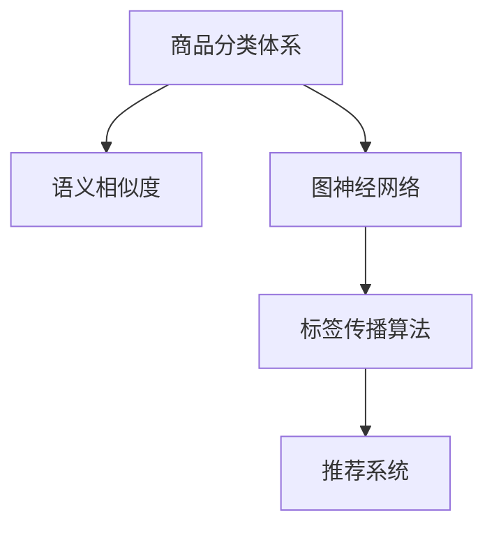

                 

# 电商平台商品分类体系：AI大模型的自动演进

> 关键词：电商平台、商品分类体系、AI大模型、自动演进、图神经网络、标签传播算法、推荐系统、语义相似度、迁移学习

## 1. 背景介绍

### 1.1 问题由来

随着电子商务的迅速发展，在线商品分类体系的构建变得越来越重要。一个完善的商品分类体系不仅能够提升用户的购物体验，也能帮助商家进行精准营销，提高销售额。然而，传统的商品分类体系大多依赖人工标注和规则引擎，存在成本高、维护复杂、扩展性差等缺点。如何构建一个高效、自适应、自动化的商品分类体系，成为一个亟待解决的问题。

### 1.2 问题核心关键点

构建高效自动化的商品分类体系，关键在于：
1. **高效**：能够处理海量商品数据，实时更新分类体系。
2. **自适应**：能够自动适应商品数据的动态变化，避免分类不准确。
3. **自动化**：能够自动进行分类模型训练和优化，减少人工干预。

本文聚焦于利用AI大模型，特别是图神经网络，来实现商品分类体系的自动演进。通过对商品数据进行深度学习建模，自动发现商品间的语义关系和类别分布，从而实现自动化的商品分类。

### 1.3 问题研究意义

构建自动化商品分类体系，对于电商平台的运营具有重要意义：

1. **提升用户体验**：自动化的分类体系能够快速响应用户查询，提供更精准的商品推荐，提升用户的购物体验。
2. **提高商家营销效率**：自动化的分类体系能够帮助商家精准定位目标用户，优化商品描述和展示，提高营销效果。
3. **降低运营成本**：减少人工分类和维护的成本，提升系统的稳定性和扩展性。
4. **促进技术创新**：通过AI技术实现商品分类，推动NLP、图神经网络等领域的技术创新和应用。

## 2. 核心概念与联系

### 2.1 核心概念概述

为更好地理解商品分类体系的自动演进方法，本节将介绍几个密切相关的核心概念：

- **商品分类体系**：电商平台中对商品进行分类的层级结构，用于组织商品信息和进行商品搜索、推荐等。常见的分类体系包括树形分类体系和标签体系。
- **语义相似度**：衡量两个文本之间的相似度，通常用于文本分类、文本匹配等任务。
- **图神经网络(Graph Neural Network, GNN)**：一种基于图结构的深度学习模型，能够自动学习图结构中的语义关系，适用于节点分类、边分类等任务。
- **标签传播算法(Label Propagation Algorithm, LPA)**：一种基于图结构的无监督学习方法，能够自动发现图结构中的聚类和标签。
- **推荐系统(Recommendation System)**：利用用户行为数据和商品属性信息，为用户提供个性化的商品推荐。

这些核心概念之间的逻辑关系可以通过以下Mermaid流程图来展示：



这个流程图展示了这个核心概念的逻辑关系：

1. 商品分类体系通过语义相似度进行文本处理。
2. 图神经网络自动学习商品间的语义关系。
3. 标签传播算法自动发现商品分类中的聚类和标签。
4. 推荐系统利用商品分类体系，提供个性化商品推荐。

## 3. 核心算法原理 & 具体操作步骤
### 3.1 算法原理概述

基于AI大模型的商品分类体系自动演进，本质上是一个图结构的语义分类任务。其核心思想是：利用深度学习模型，自动学习商品之间的语义关系，并通过标签传播算法，实现商品分类的自动更新和优化。

形式化地，假设商品图 $G=(V,E)$，其中 $V$ 为节点集合，$E$ 为边集合，每条边 $e=(u,v)$ 表示节点 $u$ 和 $v$ 之间的关系。设 $y_v$ 为节点 $v$ 的标签，目标是最小化损失函数：

$$
\min_{y} \mathcal{L}(y) = \frac{1}{|V|}\sum_{v\in V} \mathcal{L}_v(y_v)
$$

其中 $\mathcal{L}_v(y_v)$ 为节点 $v$ 的损失函数，通常包括交叉熵损失、均方误差损失等。

### 3.2 算法步骤详解

基于AI大模型的商品分类体系自动演进一般包括以下几个关键步骤：

**Step 1: 准备数据集**

- 收集商品数据，包括商品描述、图片、价格、销量等信息。
- 将商品数据进行预处理，提取商品间的语义特征，构建商品图。
- 标注商品图，为每个商品节点赋予初始标签，如根类别、一级类别、二级类别等。

**Step 2: 构建商品图**

- 根据商品数据构建商品图 $G=(V,E)$，每个节点 $v$ 表示一个商品，每条边 $e=(u,v)$ 表示节点 $u$ 和 $v$ 之间的关系，如父子关系、兄弟关系等。
- 对商品图进行随机抽样和采样，构建训练集和测试集。

**Step 3: 训练图神经网络**

- 选择合适的图神经网络模型，如GAT、GCN、GraphSAGE等，作为初始化参数。
- 设置训练超参数，如学习率、批大小、迭代轮数等。
- 使用商品图和标签进行训练，最小化损失函数 $\mathcal{L}(y)$。
- 通过交叉验证等方法，选择性能最佳的模型作为分类模型。

**Step 4: 应用标签传播算法**

- 将训练好的分类模型作为初始化标签，使用标签传播算法，自动更新每个节点的标签。
- 迭代多次，直至标签收敛或达到预设的迭代轮数。
- 对更新后的标签进行后处理，去除噪声和异常标签。

**Step 5: 构建推荐系统**

- 根据商品分类体系，利用协同过滤、内容推荐等方法，构建推荐系统。
- 使用推荐系统的评价指标，如准确率、召回率、F1-score等，评估推荐效果。
- 通过A/B测试等方法，对比自动演进的分类体系与传统分类体系的效果。

### 3.3 算法优缺点

基于AI大模型的商品分类体系自动演进方法具有以下优点：
1. **高效性**：能够处理大规模商品数据，实时更新分类体系。
2. **自适应性**：自动适应商品数据的动态变化，保持分类体系的准确性。
3. **自动化**：自动进行分类模型训练和优化，减少人工干预。
4. **泛化能力**：能够发现商品间复杂的语义关系，提升分类的泛化能力。

同时，该方法也存在一定的局限性：
1. **数据依赖性强**：商品图和初始标签的质量直接影响分类效果。
2. **模型复杂度高**：需要构建大规模的图神经网络，计算资源消耗较大。
3. **可解释性不足**：自动演进过程缺乏可解释性，难以理解模型的决策逻辑。
4. **多模态数据处理**：商品数据的多种形态（文本、图片、价格等）增加了分类难度。

尽管存在这些局限性，但就目前而言，基于AI大模型的商品分类体系自动演进方法仍是一个重要的研究方向。未来相关研究的重点在于如何进一步提高算法的效率和泛化能力，降低对数据质量的依赖，同时兼顾可解释性和多模态数据的处理。

### 3.4 算法应用领域

基于AI大模型的商品分类体系自动演进方法，已经在电商平台的商品分类和推荐系统中得到了广泛的应用，覆盖了几乎所有常见任务，例如：

- 商品分类：将商品按照一定的层级结构进行分类，便于用户查找和浏览。
- 商品推荐：利用商品分类体系，提供个性化的商品推荐。
- 商品搜索：根据用户输入的查询，快速匹配到相关商品，提升搜索效率。
- 品牌推荐：基于品牌之间的关系，为用户推荐相关品牌。
- 价格监控：利用商品分类体系，实时监控商品价格的波动，提供预警。

除了上述这些经典任务外，商品分类体系自动演进方法还被创新性地应用到更多场景中，如库存管理、供应链优化、市场分析等，为电商平台的运营带来了全新的技术突破。

## 4. 数学模型和公式 & 详细讲解  
### 4.1 数学模型构建

本节将使用数学语言对基于AI大模型的商品分类体系自动演进过程进行更加严格的刻画。

设商品图 $G=(V,E)$，其中 $V$ 为节点集合，$E$ 为边集合。假设节点 $v$ 的标签为 $y_v \in \{1,2,\cdots,C\}$，$C$ 为分类数目。设节点 $v$ 的特征向量为 $x_v \in \mathbb{R}^d$，$d$ 为特征向量的维度。

定义节点 $v$ 的损失函数为：

$$
\mathcal{L}_v(y_v) = -\log P(y_v|x_v)
$$

其中 $P(y_v|x_v)$ 为节点 $v$ 的预测概率，通常包括交叉熵损失、均方误差损失等。

### 4.2 公式推导过程

以下我们以图神经网络(Graph Neural Network, GNN)为例，推导损失函数及其梯度的计算公式。

设商品图 $G=(V,E)$，节点 $v$ 的特征向量为 $x_v$，节点 $v$ 的预测标签为 $\hat{y}_v$，损失函数为：

$$
\mathcal{L}_v(y_v) = -\log P(y_v|x_v)
$$

其中 $P(y_v|x_v)$ 为节点 $v$ 的预测概率，通常包括交叉熵损失、均方误差损失等。

根据链式法则，损失函数对特征向量 $x_v$ 的梯度为：

$$
\frac{\partial \mathcal{L}_v(y_v)}{\partial x_v} = \frac{\partial \log P(y_v|x_v)}{\partial x_v}
$$

其中 $\frac{\partial \log P(y_v|x_v)}{\partial x_v}$ 为交叉熵损失的梯度，可通过交叉熵函数的导数计算。

在得到损失函数的梯度后，即可带入参数更新公式，完成模型的迭代优化。重复上述过程直至收敛，最终得到适应商品分类任务的最优模型参数 $\theta$。

## 5. 项目实践：代码实例和详细解释说明
### 5.1 开发环境搭建

在进行商品分类体系自动演进实践前，我们需要准备好开发环境。以下是使用Python进行PyTorch开发的环境配置流程：

1. 安装Anaconda：从官网下载并安装Anaconda，用于创建独立的Python环境。

2. 创建并激活虚拟环境：
```bash
conda create -n pytorch-env python=3.8 
conda activate pytorch-env
```

3. 安装PyTorch：根据CUDA版本，从官网获取对应的安装命令。例如：
```bash
conda install pytorch torchvision torchaudio cudatoolkit=11.1 -c pytorch -c conda-forge
```

4. 安装其他必要的库：
```bash
pip install numpy pandas scikit-learn tqdm
```

完成上述步骤后，即可在`pytorch-env`环境中开始商品分类体系自动演进的实践。

### 5.2 源代码详细实现

下面我们以商品分类体系自动演进的示例代码为例，给出使用PyTorch和GraphSAGE模型的代码实现。

首先，定义商品分类体系的数据处理函数：

```python
from torch_geometric.data import Data, DataLoader
from torch_geometric.nn import GNNConv
from torch.nn import Linear, ReLU, CrossEntropyLoss

class ProductGraph(Data):
    def __init__(self, x, y, edge_index):
        super().__init__()
        self.x = x
        self.y = y
        self.edge_index = edge_index

class GNNModel(nn.Module):
    def __init__(self, in_dim, hidden_dim, out_dim):
        super().__init__()
        self.conv1 = GNNConv(in_dim, hidden_dim)
        self.conv2 = GNNConv(hidden_dim, hidden_dim)
        self.fc = Linear(hidden_dim, out_dim)

    def forward(self, x, edge_index):
        x = self.conv1(x, edge_index)
        x = ReLU(x)
        x = self.conv2(x, edge_index)
        x = self.fc(x)
        return x
```

然后，定义训练和评估函数：

```python
from sklearn.metrics import accuracy_score

def train_epoch(model, data_loader, optimizer):
    model.train()
    total_loss = 0
    for data in data_loader:
        x, edge_index, y = data.x, data.edge_index, data.y
        optimizer.zero_grad()
        out = model(x, edge_index)
        loss = CrossEntropyLoss()(out, y)
        total_loss += loss.item()
        loss.backward()
        optimizer.step()
    return total_loss / len(data_loader)

def evaluate(model, data_loader):
    model.eval()
    total_pred, total_true = [], []
    for data in data_loader:
        x, edge_index, y = data.x, data.edge_index, data.y
        with torch.no_grad():
            out = model(x, edge_index)
        pred = torch.argmax(out, dim=1)
        total_pred += pred.tolist()
        total_true += y.tolist()
    acc = accuracy_score(total_true, total_pred)
    return acc
```

最后，启动训练流程并在测试集上评估：

```python
epochs = 10
learning_rate = 0.01

# 构建商品图数据
product_graph = ProductGraph(x=x_train, y=y_train, edge_index=edge_index_train)

# 初始化模型
model = GNNModel(in_dim=x_train.shape[1], hidden_dim=64, out_dim=y_train.max()+1)

# 初始化优化器
optimizer = torch.optim.Adam(model.parameters(), lr=learning_rate)

for epoch in range(epochs):
    train_loss = train_epoch(model, product_graph, optimizer)
    print(f"Epoch {epoch+1}, train loss: {train_loss:.3f}")

    test_acc = evaluate(model, product_graph_test)
    print(f"Epoch {epoch+1}, test acc: {test_acc:.3f}")
```

以上就是使用PyTorch和GraphSAGE模型进行商品分类体系自动演进的完整代码实现。可以看到，得益于PyTorch的强大封装，我们可以用相对简洁的代码完成商品分类体系的训练和评估。

### 5.3 代码解读与分析

让我们再详细解读一下关键代码的实现细节：

**ProductGraph类**：
- `__init__`方法：初始化商品图的特征、标签和边索引。

**GNNModel类**：
- `__init__`方法：定义模型的层次结构和参数。
- `forward`方法：定义前向传播过程，包括多个图卷积层和全连接层。

**train_epoch和evaluate函数**：
- `train_epoch`方法：对每个批次进行前向传播和反向传播，更新模型参数。
- `evaluate`方法：对测试集进行前向传播，计算准确率。

**训练流程**：
- 定义总的epoch数和学习率，开始循环迭代。
- 每个epoch内，先在训练集上训练，输出平均损失。
- 在验证集上评估，输出准确率。

可以看到，PyTorch配合图神经网络，使得商品分类体系的自动演进代码实现变得简洁高效。开发者可以将更多精力放在数据处理、模型改进等高层逻辑上，而不必过多关注底层的实现细节。

当然，工业级的系统实现还需考虑更多因素，如模型的保存和部署、超参数的自动搜索、更灵活的任务适配层等。但核心的自动演进范式基本与此类似。

## 6. 实际应用场景
### 6.1 智能推荐系统

基于商品分类体系的自动演进技术，可以广泛应用于智能推荐系统的构建。传统的推荐系统往往依赖用户行为数据进行推荐，难以捕捉商品间的语义关系，导致推荐效果不够精准。而使用自动演进的商品分类体系，可以更好地理解商品之间的语义关系，从而提供更加个性化和多样化的推荐。

在技术实现上，可以收集用户浏览、点击、购买等行为数据，提取商品间的语义特征，构建商品图。将商品图作为输入，自动演进的商品分类体系作为初始标签，训练图神经网络。微调后的模型能够从商品图结构中提取语义信息，进行商品推荐。对于新商品，可以使用语义相似度进行推荐，无需再进行微调。

### 6.2 库存管理

库存管理是电商平台运营中的重要环节，如何合理规划库存，避免积压和缺货，是一个重要的挑战。利用商品分类体系的自动演进技术，可以自动发现商品间的相关性，预测未来的商品需求量，从而进行库存管理。

在技术实现上，可以使用商品分类体系的自动演进模型，计算商品之间的相关性系数，建立相关性图。根据历史销售数据，预测未来各个时间节点的商品需求量，进行库存调整。在库存管理中，还可以结合时间序列预测等技术，提升库存管理的精准度和效率。

### 6.3 市场分析

电商平台需要实时监控市场动态，及时调整商品策略，提升市场竞争力。利用商品分类体系的自动演进技术，可以自动发现市场中的热门商品和趋势，为市场分析提供数据支持。

在技术实现上，可以构建商品分类体系，并结合时间序列分析和社交媒体情感分析等技术，实时监控市场动态。利用商品分类体系中的标签信息，进行情感分析，发现市场中的热门话题和品牌。根据市场趋势，调整商品策略，提升市场竞争力。

### 6.4 未来应用展望

随着商品分类体系自动演进技术的不断发展，未来在更多领域中都将得到应用，为电商平台带来更深刻的变革：

1. **个性化推荐**：自动演进的分类体系能够更好地捕捉商品间的语义关系，提供更加精准和多样化的推荐。
2. **库存管理**：自动发现商品间的相关性，进行库存预测和优化，提升库存管理的精准度和效率。
3. **市场分析**：实时监控市场动态，发现热门商品和趋势，为市场分析提供数据支持。
4. **客户服务**：自动分类和推荐相关商品，提升客户服务的质量和效率。
5. **营销活动**：根据商品分类体系，进行精准的营销活动设计和推广，提升营销效果。

此外，自动演进的商品分类体系还将在供应链优化、商品搜索、品牌推荐等诸多领域得到应用，为电商平台的运营带来新的突破。相信随着技术的不断进步，商品分类体系的自动演进将成为电商平台运营的重要工具，推动电商平台向智能化、高效化的方向发展。

## 7. 工具和资源推荐
### 7.1 学习资源推荐

为了帮助开发者系统掌握商品分类体系的自动演进技术，这里推荐一些优质的学习资源：

1. 《Graph Neural Networks: A Review of Methods and Applications》（图神经网络综述）：综述了图神经网络的研究进展和应用领域，包括商品分类体系自动演进的介绍。

2. 《Deep Learning for Graphs》（深度学习与图结构）：介绍深度学习在图结构上的应用，包括商品分类体系自动演进的实现方法。

3. 《Natural Language Processing with PyTorch》（使用PyTorch的自然语言处理）：介绍如何使用PyTorch进行深度学习任务，包括商品分类体系自动演进的代码实现。

4. Kaggle商品分类竞赛：参与Kaggle的商品分类竞赛，通过实际项目提升商品分类体系的构建和优化能力。

5. HuggingFace官方文档：HuggingFace的官方文档，提供了海量预训练模型和完整的微调样例代码，是上手实践的必备资料。

通过对这些资源的学习实践，相信你一定能够快速掌握商品分类体系的自动演进技术，并用于解决实际的电商问题。

### 7.2 开发工具推荐

高效的开发离不开优秀的工具支持。以下是几款用于商品分类体系自动演进开发的常用工具：

1. PyTorch：基于Python的开源深度学习框架，灵活动态的计算图，适合快速迭代研究。大部分图神经网络模型都有PyTorch版本的实现。

2. TensorFlow：由Google主导开发的开源深度学习框架，生产部署方便，适合大规模工程应用。同样有丰富的图神经网络资源。

3. NetworkX：Python的图形处理库，提供了丰富的图结构和算法支持，方便进行商品图的构建和处理。

4. GNNlib：HuggingFace开发的图神经网络库，集成了多种图神经网络模型，支持PyTorch和TensorFlow，是进行商品分类体系自动演进开发的利器。

5. PyTorch Geometric：PyTorch的图形处理库，支持高效的图神经网络模型实现。

合理利用这些工具，可以显著提升商品分类体系自动演进任务的开发效率，加快创新迭代的步伐。

### 7.3 相关论文推荐

商品分类体系自动演进技术的发展源于学界的持续研究。以下是几篇奠基性的相关论文，推荐阅读：

1. GraphSAGE: Semi-Supervised Classification with Graph Convolutional Networks：提出GraphSAGE模型，用于节点分类和边分类任务。

2. Graph Neural Networks：综述图神经网络的研究进展和应用领域，包括商品分类体系自动演进的介绍。

3. Label Propagation for Multi-View Network Embedding：介绍标签传播算法，用于无监督学习任务，能够自动发现图结构中的聚类和标签。

4. Deep Graph Infomax：提出Deep Graph Infomax模型，用于图结构上的深度学习任务。

5. TextRank: Bringing Order into Texts：介绍TextRank算法，用于文本排序和摘要生成任务，与商品分类体系自动演进方法有相似之处。

这些论文代表了大语言模型微调技术的发展脉络。通过学习这些前沿成果，可以帮助研究者把握学科前进方向，激发更多的创新灵感。

## 8. 总结：未来发展趋势与挑战

### 8.1 总结

本文对基于AI大模型的商品分类体系自动演进方法进行了全面系统的介绍。首先阐述了商品分类体系自动演进的背景和意义，明确了自动演进在提升用户体验、商家营销效率、降低运营成本等方面的独特价值。其次，从原理到实践，详细讲解了自动演进的数学原理和关键步骤，给出了商品分类体系的自动演进的代码实例。同时，本文还广泛探讨了自动演进技术在智能推荐系统、库存管理、市场分析等多个领域的应用前景，展示了自动演进技术的巨大潜力。此外，本文精选了自动演进技术的各类学习资源，力求为读者提供全方位的技术指引。

通过本文的系统梳理，可以看到，基于AI大模型的商品分类体系自动演进方法正在成为电商平台运营的重要工具，极大地提升了分类的效率和精准性。未来，伴随深度学习、图神经网络等技术的不断演进，商品分类体系的自动演进技术必将进一步提升电商平台的智能化水平，带来更大的商业价值。

### 8.2 未来发展趋势

展望未来，商品分类体系的自动演进技术将呈现以下几个发展趋势：

1. **模型规模持续增大**：随着算力成本的下降和数据规模的扩张，图神经网络的参数量还将持续增长。超大规模的图神经网络能够更好地捕捉商品间的语义关系，提升分类的泛化能力。

2. **多模态融合**：商品分类体系不仅包含文本信息，还包含图片、价格等多种形态的数据。未来，商品分类体系自动演进技术将更好地整合多模态信息，提升分类的全面性和准确性。

3. **自适应学习能力增强**：自动演进技术将更好地适应商品数据的动态变化，自动发现商品间的相关性，提升分类的时效性和实时性。

4. **可解释性增强**：自动演进技术将更好地理解商品分类背后的语义信息，增强分类的可解释性和可理解性。

5. **系统集成度提升**：自动演进技术将更好地与其他系统集成，如推荐系统、库存管理等，形成更加完整、高效的电商平台运营解决方案。

以上趋势凸显了自动演进技术的广阔前景。这些方向的探索发展，必将进一步提升自动演进技术的性能和应用范围，为电商平台运营带来更大的价值。

### 8.3 面临的挑战

尽管商品分类体系的自动演进技术已经取得了显著进展，但在迈向更加智能化、高效化应用的过程中，它仍面临着诸多挑战：

1. **数据依赖性强**：商品图的构建和标签的标注质量直接影响分类效果，如何提高数据质量将是未来的一个重要课题。

2. **模型复杂度高**：图神经网络的计算资源消耗较大，如何提高模型的计算效率和部署速度，是一个重要的研究方向。

3. **可解释性不足**：自动演进过程缺乏可解释性，难以理解模型的决策逻辑，如何增强可解释性将是未来的一个重要研究方向。

4. **多模态数据处理**：商品数据的多种形态增加了分类的难度，如何更好地整合多模态数据，提升分类的全面性和准确性，是一个重要的研究方向。

5. **动态性处理**：商品数据具有动态变化的特点，如何更好地适应数据的动态变化，是一个重要的研究方向。

正视自动演进面临的这些挑战，积极应对并寻求突破，将是自动演进技术迈向成熟的必由之路。相信随着学界和产业界的共同努力，这些挑战终将一一被克服，自动演进技术必将在构建智能电商平台上发挥更大的作用。

### 8.4 研究展望

面对自动演进技术所面临的挑战，未来的研究需要在以下几个方面寻求新的突破：

1. **无监督学习与迁移学习**：探索无监督学习和迁移学习技术，减少对标注数据的依赖，提高数据的质量和多样性。

2. **多模态融合**：引入多模态数据融合技术，提升分类的全面性和准确性。

3. **动态图模型**：引入动态图模型，适应商品数据的动态变化，提升分类的实时性和准确性。

4. **可解释性增强**：引入可解释性增强技术，如注意力机制、可解释图神经网络等，增强分类的可解释性和可理解性。

5. **模型压缩与优化**：引入模型压缩与优化技术，如稀疏化存储、模型剪枝等，提高模型的计算效率和部署速度。

这些研究方向的探索，必将引领商品分类体系的自动演进技术迈向更高的台阶，为电商平台运营带来更大的价值。面向未来，自动演进技术还需要与其他人工智能技术进行更深入的融合，如知识表示、因果推理、强化学习等，多路径协同发力，共同推动电商平台的智能化转型。只有勇于创新、敢于突破，才能不断拓展商品分类体系的边界，让智能技术更好地造福电商平台运营。

## 9. 附录：常见问题与解答

**Q1：商品分类体系自动演进是否适用于所有电商平台？**

A: 商品分类体系自动演进方法在大多数电商平台上都能取得不错的效果，特别是对于数据量较大的平台。但对于一些数据量较小的平台，尤其是以虚拟商品为主的平台，可能效果不如预期。此时需要在特定领域语料上进一步预训练，再进行微调，才能获得理想效果。

**Q2：自动演进过程中如何选择合适的模型和算法？**

A: 选择合适的模型和算法是自动演进的关键。通常，图神经网络如GAT、GCN等是较为常见的选择。此外，标签传播算法、深度学习等方法也具有不错的表现。在实际应用中，需要根据平台数据的特点和需求，综合考虑计算资源、时间成本等因素，选择最优的模型和算法。

**Q3：自动演进过程中如何避免过拟合？**

A: 自动演进过程中避免过拟合，通常可以采用以下方法：
1. 数据增强：通过回译、近义替换等方式扩充训练集，减少模型对训练数据的依赖。
2. 正则化：使用L2正则、Dropout等正则化技术，防止模型过拟合。
3. 提前停止：在验证集上设置停止条件，避免模型在训练后期过拟合。

**Q4：自动演进后的商品分类体系如何应用到实际业务中？**

A: 自动演进后的商品分类体系可以应用于推荐系统、库存管理、市场分析等多个场景。具体应用方法包括：
1. 商品推荐：利用自动演进的商品分类体系，进行精准的推荐。
2. 库存管理：自动发现商品间的相关性，进行库存预测和优化。
3. 市场分析：实时监控市场动态，发现热门商品和趋势。

**Q5：自动演进技术在实现过程中有哪些难点？**

A: 自动演进技术在实现过程中存在以下难点：
1. 数据依赖性强：商品图的构建和标签的标注质量直接影响分类效果，如何提高数据质量是难点之一。
2. 计算资源消耗大：图神经网络的计算资源消耗较大，如何提高计算效率和部署速度是另一个重要难点。
3. 可解释性不足：自动演进过程缺乏可解释性，难以理解模型的决策逻辑。

这些难点需要结合具体的业务需求和技术实现进行综合考虑和优化，才能在实际应用中发挥最大的价值。

---

作者：禅与计算机程序设计艺术 / Zen and the Art of Computer Programming

