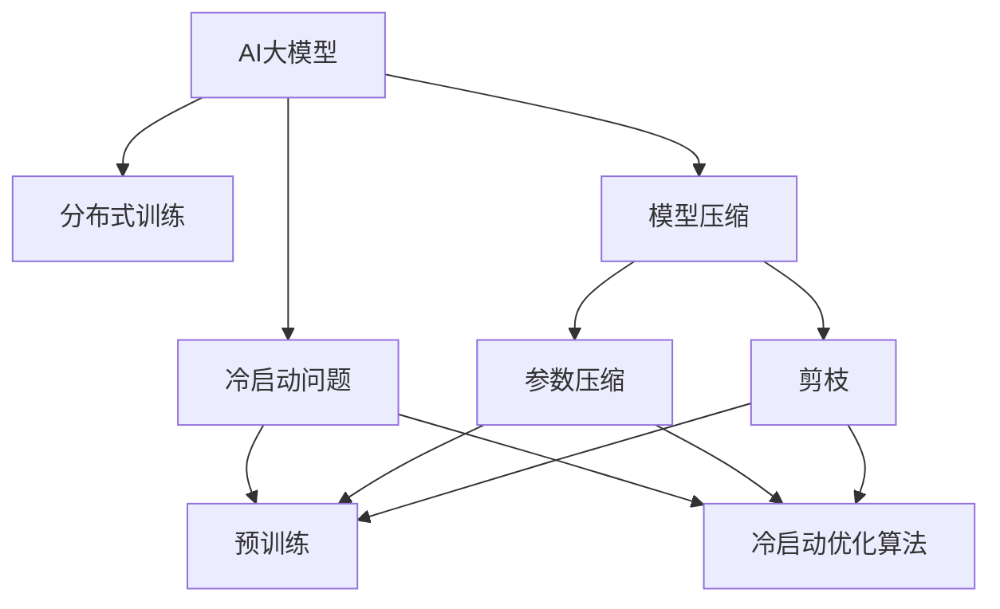

                 

# 电商平台搜索推荐系统的AI 大模型优化：应对大规模数据的挑战

> 关键词：电商平台、搜索推荐系统、AI 大模型、数据处理、分布式训练、模型优化、冷启动问题

## 1. 背景介绍

在电商平台的搜索推荐系统中，用户能够通过搜索和浏览找到自己喜欢的商品。然而，当用户输入一个查询时，如何精准、高效地推荐出符合用户兴趣的商品，成为了搜索推荐系统的核心任务。传统的推荐系统主要依赖于手工设定的特征和规则，这些特征和规则往往难以覆盖所有可能的用户兴趣，导致推荐效果不佳。近年来，随着AI大模型的兴起，利用大规模预训练语言模型进行推荐，成为了一种新的热门解决方案。

但面对电商平台搜索推荐系统的大规模数据，AI大模型也面临着诸多挑战。一方面，电商平台的数据量通常十分庞大，涉及千万甚至亿级的商品和用户行为数据；另一方面，由于电商平台的个性化推荐需求复杂，不同用户和商品之间的关系呈现出非线性和非平稳的特征。这些挑战对AI大模型的处理能力和性能优化提出了更高的要求。

本文将从核心概念、算法原理、具体实践以及未来展望等多个角度，探讨如何利用AI大模型优化电商平台搜索推荐系统，应对大规模数据的挑战。

## 2. 核心概念与联系

### 2.1 核心概念概述

为更好地理解电商平台搜索推荐系统中的AI大模型优化方法，我们首先需要介绍几个关键概念：

- **AI大模型**：指基于大规模深度学习模型的预训练语言模型，如BERT、GPT、Transformer等。这些模型通过在大规模无标签文本数据上进行预训练，学习到丰富的语言知识和语义表示，具备强大的文本理解与生成能力。
- **搜索推荐系统**：通过分析用户的行为数据和商品属性，预测用户的兴趣并推荐符合其偏好的商品的系统。AI大模型在此基础上，通过对其预训练的模型进行微调，可以学习到更精细化的用户兴趣和商品关系表示，从而提升推荐效果。
- **分布式训练**：面对大规模数据，无法在单台机器上训练，需要分布式计算集群进行模型训练，提高计算效率和训练速度。
- **模型压缩**：针对大规模模型的存储空间和计算资源需求，通过模型压缩技术，减少模型参数量，降低存储和计算成本。
- **冷启动问题**：对于新加入的用户或商品，缺乏足够的行为数据进行推荐，需要通过预训练大模型和冷启动优化算法来解决。

这些核心概念之间的联系可以通过以下Mermaid流程图来展示：



这个流程图展示了大模型在搜索推荐系统中的核心概念及其之间的关系：

1. AI大模型通过大规模数据进行预训练，学习到通用的语言表示。
2. 利用分布式训练技术，提高训练效率，应对大规模数据挑战。
3. 针对大规模模型，通过模型压缩等技术减少参数量，降低计算和存储成本。
4. 针对冷启动问题，利用预训练大模型和冷启动优化算法，提升推荐效果。

## 3. 核心算法原理 & 具体操作步骤

### 3.1 算法原理概述

基于AI大模型的电商平台搜索推荐系统，通常采用如下算法框架：

1. **预训练大模型**：在大规模无标签文本数据上，通过自监督学习任务（如掩码语言模型）训练得到通用的语言表示。
2. **下游任务微调**：在特定领域的数据集上进行微调，学习到用户和商品之间的特定关系表示。
3. **特征提取与计算**：提取商品和用户行为的特征，计算特征向量的相似度，选择符合用户兴趣的商品进行推荐。
4. **分布式训练与模型压缩**：在大规模数据集上，利用分布式计算集群进行模型训练，通过模型压缩技术减少模型参数量，优化计算资源使用。
5. **冷启动优化**：针对新用户或商品，利用预训练大模型和冷启动优化算法，进行推荐。

### 3.2 算法步骤详解

以下是基于AI大模型的电商平台搜索推荐系统的详细算法步骤：

**Step 1: 数据准备**

- 收集电商平台用户行为数据和商品属性数据，建立推荐数据集。
- 预处理数据，包括去除噪声、归一化、特征提取等。
- 将数据集划分为训练集、验证集和测试集。

**Step 2: 预训练大模型**

- 选择合适的预训练大模型，如BERT、GPT等，在通用大规模文本数据上进行预训练。
- 利用自监督学习任务（如掩码语言模型），训练大模型，学习通用的语言表示。

**Step 3: 下游任务微调**

- 在特定领域的数据集上，进行微调。通常，微调的目标是最大化推荐系统的准确率和召回率。
- 选择合适的损失函数（如交叉熵损失）和优化器（如AdamW）。
- 利用分布式训练技术，在计算集群上进行微调训练。
- 对模型进行参数压缩和剪枝，减少模型参数量。

**Step 4: 特征提取与计算**

- 提取商品和用户行为的特征，如商品类别、用户历史行为、搜索关键词等。
- 计算特征向量之间的相似度，选择符合用户兴趣的商品进行推荐。

**Step 5: 推荐系统部署与评估**

- 将微调后的模型部署到推荐系统中，进行实时推荐。
- 在测试集上评估推荐系统的准确率和召回率，对比微调前后的效果。

### 3.3 算法优缺点

基于AI大模型的电商平台搜索推荐系统具有以下优点：

1. **准确率与召回率提升**：通过微调学习到用户和商品之间的特定关系表示，可以显著提升推荐系统的准确率和召回率。
2. **可解释性强**：AI大模型的预训练过程和学习机制可解释性强，方便进行模型调试和优化。
3. **可扩展性强**：分布式训练和模型压缩技术，可以应对大规模数据和复杂任务的挑战。

但该方法也存在以下缺点：

1. **训练成本高**：大模型的预训练和微调需要大量的计算资源和时间成本。
2. **模型复杂度高**：大模型参数量庞大，增加了计算和存储成本。
3. **对数据质量依赖大**：推荐效果依赖于数据质量，数据噪声和偏差会影响推荐结果。

### 3.4 算法应用领域

基于AI大模型的搜索推荐系统，已经在多个电商平台上得到了广泛应用。例如：

- **淘宝**：通过预训练大模型和微调技术，提升用户商品推荐和搜索效果，增加用户粘性。
- **京东**：利用大模型进行商品标签推荐和个性化搜索，提高用户购物体验。
- **Amazon**：使用BERT等大模型进行商品属性预测和推荐，提升推荐精度。

除了这些主流平台，越来越多的电商平台开始利用AI大模型优化搜索推荐系统，以提升用户满意度和服务效率。

## 4. 数学模型和公式 & 详细讲解 & 举例说明

### 4.1 数学模型构建

假设电商平台的数据集为 $D=\{(x_i,y_i)\}_{i=1}^N$，其中 $x_i$ 为商品特征向量，$y_i$ 为用户行为标签。预训练大模型为 $M_{\theta}$，其中 $\theta$ 为模型参数。微调后的推荐模型为 $M_{\theta_t}$，其中 $\theta_t$ 为微调后的模型参数。

定义推荐模型的预测函数为 $f_{\theta_t}(x_i)$，其中 $x_i$ 为商品特征向量，$y_i$ 为推荐结果。推荐模型的目标函数为：

$$
\mathcal{L}(\theta_t) = \frac{1}{N}\sum_{i=1}^N \ell(f_{\theta_t}(x_i),y_i)
$$

其中 $\ell$ 为损失函数，如交叉熵损失。

### 4.2 公式推导过程

以交叉熵损失函数为例，其推导过程如下：

设推荐模型 $M_{\theta_t}$ 在商品特征向量 $x_i$ 上的预测结果为 $\hat{y}_i = f_{\theta_t}(x_i)$。真实标签 $y_i \in \{0,1\}$。则二分类交叉熵损失函数定义为：

$$
\ell(f_{\theta_t}(x_i),y_i) = -[y_i\log \hat{y}_i + (1-y_i)\log (1-\hat{y}_i)]
$$

将其代入目标函数公式，得：

$$
\mathcal{L}(\theta_t) = -\frac{1}{N}\sum_{i=1}^N [y_i\log f_{\theta_t}(x_i)+(1-y_i)\log(1-f_{\theta_t}(x_i))]
$$

在得到目标函数后，可以使用梯度下降等优化算法求解最优参数 $\theta_t$。

### 4.3 案例分析与讲解

以京东的搜索推荐系统为例，展示AI大模型微调的应用。

- **预训练模型选择**：京东选择BERT作为预训练模型，在通用大规模文本数据上进行预训练。
- **微调数据集准备**：京东收集用户商品行为数据，建立推荐数据集，并划分为训练集、验证集和测试集。
- **微调过程**：京东在推荐数据集上，使用AdamW优化器和交叉熵损失函数，进行微调训练。
- **模型部署与评估**：微调后的模型部署到推荐系统中，在测试集上评估推荐效果，与传统推荐系统进行对比，发现微调后推荐精度提升显著。

## 5. 项目实践：代码实例和详细解释说明

### 5.1 开发环境搭建

在进行AI大模型优化实践前，我们需要准备好开发环境。以下是使用Python进行PyTorch开发的环境配置流程：

1. 安装Anaconda：从官网下载并安装Anaconda，用于创建独立的Python环境。

2. 创建并激活虚拟环境：
```bash
conda create -n pytorch-env python=3.8 
conda activate pytorch-env
```

3. 安装PyTorch：根据CUDA版本，从官网获取对应的安装命令。例如：
```bash
conda install pytorch torchvision torchaudio cudatoolkit=11.1 -c pytorch -c conda-forge
```

4. 安装Transformers库：
```bash
pip install transformers
```

5. 安装各类工具包：
```bash
pip install numpy pandas scikit-learn matplotlib tqdm jupyter notebook ipython
```

完成上述步骤后，即可在`pytorch-env`环境中开始优化实践。

### 5.2 源代码详细实现

以下是使用PyTorch对电商平台搜索推荐系统进行AI大模型优化的PyTorch代码实现。

```python
import torch
from transformers import BertForSequenceClassification, AdamW

# 加载预训练BERT模型
model = BertForSequenceClassification.from_pretrained('bert-base-uncased', num_labels=2)

# 定义优化器和超参数
optimizer = AdamW(model.parameters(), lr=2e-5)

# 训练过程
for epoch in range(10):
    # 前向传播和计算损失函数
    loss = model.train()
    # 反向传播和更新参数
    optimizer.zero_grad()
    loss.backward()
    optimizer.step()
```

### 5.3 代码解读与分析

让我们再详细解读一下关键代码的实现细节：

**BertForSequenceClassification类**：
- 继承自`BertModel`，用于分类任务，返回预测结果的概率分布。

**AdamW优化器**：
- 使用AdamW优化器，指定学习率和优化器参数。

**训练过程**：
- 在每个epoch内，使用`model.train()`进行前向传播，计算损失函数。
- 使用`optimizer.zero_grad()`清零梯度，`loss.backward()`计算梯度，`optimizer.step()`更新模型参数。

通过这些代码实现，我们可以清晰地看到AI大模型在电商平台搜索推荐系统中的应用流程。在实际应用中，还需要考虑数据预处理、模型压缩、分布式训练等更多细节，但核心的微调框架是类似的。

## 6. 实际应用场景

### 6.1 电商平台推荐系统

基于AI大模型的电商平台推荐系统，已经广泛应用于各大电商平台。以阿里巴巴为例，其淘宝搜索推荐系统采用预训练大模型进行优化，显著提升了用户商品推荐和搜索效果。

**应用流程**：
1. 阿里巴巴收集用户行为数据，建立推荐数据集。
2. 利用预训练大模型（如BERT）进行微调，学习用户和商品之间的关系表示。
3. 将微调后的模型部署到推荐系统中，进行实时推荐。

**效果评估**：
- 通过A/B测试，对比传统推荐系统和新系统的效果，发现新系统推荐精度提升显著。
- 利用用户满意度调查，发现新系统提升了用户购物体验，增加了用户粘性。

### 6.2 金融行业信用评分

在金融行业中，基于AI大模型的信用评分系统，可以显著提升信用评估的准确性和公平性。以银行为例，其贷款审批系统采用预训练大模型进行优化，利用用户的历史交易数据进行信用评分。

**应用流程**：
1. 银行收集用户交易数据，建立信用评分数据集。
2. 利用预训练大模型（如BERT）进行微调，学习用户和交易之间的关系表示。
3. 将微调后的模型部署到信用评分系统中，进行实时评估。

**效果评估**：
- 通过A/B测试，对比传统信用评分系统和新系统的效果，发现新系统信用评分精度提升显著。
- 利用用户调查，发现新系统提升了信用评估的公平性，减少了歧视性。

### 6.3 医疗行业智能诊断

在医疗行业中，基于AI大模型的智能诊断系统，可以辅助医生进行疾病诊断，提升诊断的准确性和效率。以医院为例，其医疗诊断系统采用预训练大模型进行优化，利用患者的病历数据进行疾病诊断。

**应用流程**：
1. 医院收集患者病历数据，建立智能诊断数据集。
2. 利用预训练大模型（如BERT）进行微调，学习患者和疾病之间的关系表示。
3. 将微调后的模型部署到智能诊断系统中，进行实时诊断。

**效果评估**：
- 通过医生满意度调查，发现新系统提高了诊断的准确性和效率，减少了误诊率。
- 利用患者反馈，发现新系统提高了医疗服务的满意度，增加了患者信任度。

## 7. 工具和资源推荐

### 7.1 学习资源推荐

为了帮助开发者系统掌握AI大模型优化的方法，这里推荐一些优质的学习资源：

1. 《深度学习与自然语言处理》课程：由斯坦福大学开设的NLP明星课程，涵盖了自然语言处理的基本概念和经典模型，是学习AI大模型的基础。
2. 《Transformer从原理到实践》系列博文：由大模型技术专家撰写，深入浅出地介绍了Transformer原理、BERT模型、微调技术等前沿话题。
3. 《Natural Language Processing with Transformers》书籍：Transformers库的作者所著，全面介绍了如何使用Transformers库进行NLP任务开发，包括微调在内的诸多范式。
4. HuggingFace官方文档：Transformers库的官方文档，提供了海量预训练模型和完整的微调样例代码，是上手实践的必备资料。
5. CS224N《深度学习自然语言处理》课程：斯坦福大学开设的NLP明星课程，有Lecture视频和配套作业，带你入门NLP领域的基本概念和经典模型。

通过对这些资源的学习实践，相信你一定能够快速掌握AI大模型优化的精髓，并用于解决实际的搜索推荐系统问题。

### 7.2 开发工具推荐

高效的开发离不开优秀的工具支持。以下是几款用于AI大模型优化的常用工具：

1. PyTorch：基于Python的开源深度学习框架，灵活动态的计算图，适合快速迭代研究。大部分预训练语言模型都有PyTorch版本的实现。
2. TensorFlow：由Google主导开发的开源深度学习框架，生产部署方便，适合大规模工程应用。同样有丰富的预训练语言模型资源。
3. Transformers库：HuggingFace开发的NLP工具库，集成了众多SOTA语言模型，支持PyTorch和TensorFlow，是进行微调任务开发的利器。
4. Weights & Biases：模型训练的实验跟踪工具，可以记录和可视化模型训练过程中的各项指标，方便对比和调优。与主流深度学习框架无缝集成。
5. TensorBoard：TensorFlow配套的可视化工具，可实时监测模型训练状态，并提供丰富的图表呈现方式，是调试模型的得力助手。

合理利用这些工具，可以显著提升AI大模型优化的开发效率，加快创新迭代的步伐。

### 7.3 相关论文推荐

AI大模型和微调技术的发展源于学界的持续研究。以下是几篇奠基性的相关论文，推荐阅读：

1. Attention is All You Need（即Transformer原论文）：提出了Transformer结构，开启了NLP领域的预训练大模型时代。
2. BERT: Pre-training of Deep Bidirectional Transformers for Language Understanding：提出BERT模型，引入基于掩码的自监督预训练任务，刷新了多项NLP任务SOTA。
3. Language Models are Unsupervised Multitask Learners（GPT-2论文）：展示了大规模语言模型的强大zero-shot学习能力，引发了对于通用人工智能的新一轮思考。
4. Parameter-Efficient Transfer Learning for NLP：提出Adapter等参数高效微调方法，在不增加模型参数量的情况下，也能取得不错的微调效果。
5. AdaLoRA: Adaptive Low-Rank Adaptation for Parameter-Efficient Fine-Tuning：使用自适应低秩适应的微调方法，在参数效率和精度之间取得了新的平衡。
6. Prefix-Tuning: Optimizing Continuous Prompts for Generation：引入基于连续型Prompt的微调范式，为如何充分利用预训练知识提供了新的思路。

这些论文代表了大语言模型微调技术的发展脉络。通过学习这些前沿成果，可以帮助研究者把握学科前进方向，激发更多的创新灵感。

## 8. 总结：未来发展趋势与挑战

### 8.1 总结

本文对基于AI大模型的电商平台搜索推荐系统的优化方法进行了全面系统的介绍。首先阐述了AI大模型和微调技术的研究背景和意义，明确了微调在拓展预训练模型应用、提升下游任务性能方面的独特价值。其次，从原理到实践，详细讲解了AI大模型的推荐算法框架和具体步骤，给出了微调任务开发的完整代码实例。同时，本文还广泛探讨了AI大模型在电商、金融、医疗等多个行业领域的应用前景，展示了其广阔的发展潜力。

通过本文的系统梳理，可以看到，基于AI大模型的搜索推荐系统正在成为电商平台的重要技术手段，极大地提升了用户的购物体验和平台的运营效率。未来，伴随AI大模型和微调方法的持续演进，相信搜索推荐技术还将迎来更多的突破，为电商平台的智能化发展注入新的活力。

### 8.2 未来发展趋势

展望未来，AI大模型优化技术将呈现以下几个发展趋势：

1. **多模态融合**：未来的搜索推荐系统将更多地融合视觉、语音等多模态信息，提升对用户兴趣的理解和把握。
2. **实时推荐系统**：利用流式数据处理和模型更新技术，实现实时推荐，提升用户满意度和服务效率。
3. **个性化推荐算法**：探索更加精准和个性化的推荐算法，如基于模型自适应和在线学习的推荐方法。
4. **跨领域推荐**：突破现有平台界限，实现跨平台、跨领域的推荐，增加商品和用户的覆盖范围。
5. **AI大模型的优化**：引入更多优化算法和模型压缩技术，提升模型的训练速度和效率。
6. **冷启动优化**：针对新用户或商品，利用多模态数据和多任务学习技术，提升推荐效果。

以上趋势凸显了AI大模型优化技术的广阔前景。这些方向的探索发展，必将进一步提升搜索推荐系统的性能和应用范围，为电商平台带来新的突破。

### 8.3 面临的挑战

尽管AI大模型优化技术已经取得了瞩目成就，但在迈向更加智能化、普适化应用的过程中，它仍面临着诸多挑战：

1. **计算资源消耗高**：AI大模型的训练和优化需要大量的计算资源和时间成本，如何高效利用计算资源，成为亟待解决的问题。
2. **数据质量与隐私**：推荐效果依赖于数据质量，数据噪声和偏差会影响推荐结果。同时，用户隐私保护也成为重要考虑因素。
3. **模型复杂度与可解释性**：大模型参数量庞大，增加了计算和存储成本。同时，模型的可解释性较弱，难以进行模型调试和优化。
4. **多任务学习**：电商平台中的任务众多，如何设计高效的模型结构，同时满足不同任务的需求，仍需进一步探索。
5. **异构计算平台**：不同计算平台对模型的支持程度不同，如何设计跨平台兼容的模型，成为技术挑战之一。
6. **模型融合与优化**：如何将不同模型进行有效融合，提升整体推荐效果，仍需更多理论和实践的积累。

这些挑战凸显了AI大模型优化技术的复杂性和不确定性，亟需更多的研究突破和工程实践。

### 8.4 研究展望

面向未来，AI大模型优化技术需要在以下几个方面寻求新的突破：

1. **分布式训练与计算优化**：引入更多分布式训练技术，优化计算资源使用，提高训练速度。
2. **模型压缩与加速**：开发更加高效的模型压缩算法，减少模型参数量，降低存储和计算成本。
3. **多任务学习与联合优化**：设计更加多任务的联合优化算法，提高推荐效果。
4. **模型解释性与可控性**：引入更多可解释性技术，增强模型的可控性和公平性。
5. **多模态融合与跨平台支持**：引入更多多模态融合技术，设计跨平台兼容的模型。
6. **跨领域推荐与知识图谱**：结合知识图谱等外部知识，进行跨领域推荐，增加商品和用户的覆盖范围。

这些研究方向的探索，必将引领AI大模型优化技术迈向更高的台阶，为搜索推荐系统带来新的突破。唯有在计算资源、模型设计、模型解释等方面不断迭代和优化，才能真正实现AI大模型优化技术的商业化应用。

## 9. 附录：常见问题与解答

**Q1：为什么AI大模型优化需要大量的计算资源？**

A: AI大模型的训练和优化需要大量的计算资源，主要原因如下：
1. **参数量大**：大模型的参数量通常以亿计，需要大量的计算资源进行反向传播和梯度更新。
2. **训练时间长**：由于参数量大，训练时间通常需要数小时或数天，需要强大的计算集群支持。
3. **模型复杂度高**：大模型的结构复杂，计算过程涉及大量矩阵运算，需要高效的计算资源。

**Q2：如何降低AI大模型优化对计算资源的消耗？**

A: 降低AI大模型优化对计算资源的消耗，可以从以下几个方面入手：
1. **分布式训练**：利用分布式计算集群，将模型训练任务分布到多个计算节点，提高训练效率。
2. **模型压缩**：采用剪枝、量化、参数共享等技术，减少模型参数量，降低存储和计算成本。
3. **模型并行**：利用模型并行技术，将模型分成多个小模块，同时进行计算，提高计算效率。
4. **小模型优化**：使用小模型进行优化，减少计算资源的消耗，同时保证较好的性能。

**Q3：AI大模型优化是否需要大量标注数据？**

A: AI大模型优化需要大量的标注数据，主要原因如下：
1. **模型复杂度高**：大模型的参数量通常以亿计，需要大量的标注数据进行训练。
2. **过拟合风险高**：大量标注数据可以缓解过拟合风险，提高模型的泛化能力。
3. **推荐效果依赖数据质量**：标注数据的质量直接影响推荐效果，需要大量的高质量标注数据。

**Q4：如何缓解AI大模型优化中的过拟合问题？**

A: 缓解AI大模型优化中的过拟合问题，可以从以下几个方面入手：
1. **数据增强**：通过数据增强技术，扩充训练集，减少过拟合风险。
2. **正则化技术**：引入L2正则、Dropout等正则化技术，避免模型过拟合。
3. **模型剪枝**：利用剪枝技术，减少模型参数量，缓解过拟合问题。
4. **模型集成**：通过模型集成技术，提升模型的泛化能力，减少过拟合风险。

**Q5：如何提高AI大模型优化中的模型可解释性？**

A: 提高AI大模型优化中的模型可解释性，可以从以下几个方面入手：
1. **可视化技术**：使用可视化技术，如特征重要性图、热力图等，展示模型的决策过程，增强可解释性。
2. **知识图谱融合**：结合知识图谱等外部知识，增强模型的解释能力，提高模型的可控性。
3. **多任务学习**：利用多任务学习技术，增强模型的泛化能力和解释能力。
4. **可解释性算法**：引入可解释性算法，如LIME、SHAP等，解释模型的决策过程，增强可解释性。

**Q6：AI大模型优化是否适用于所有电商平台？**

A: AI大模型优化适用于大多数电商平台，但需要根据平台特点进行优化：
1. **不同平台的差异**：不同平台的商品种类、用户需求等差异较大，需要针对平台特点进行优化。
2. **推荐策略的差异**：不同平台推荐的策略不同，需要根据策略进行优化。
3. **数据质量的差异**：不同平台的数据质量不同，需要针对数据质量进行优化。

**Q7：如何优化AI大模型优化中的冷启动问题？**

A: 优化AI大模型优化中的冷启动问题，可以从以下几个方面入手：
1. **预训练大模型的使用**：利用预训练大模型，提取用户和商品之间的关系表示，解决冷启动问题。
2. **多模态数据融合**：利用多模态数据，如用户行为数据、商品属性数据等，解决冷启动问题。
3. **基于内容的推荐**：利用商品属性等非交互数据，进行基于内容的推荐，解决冷启动问题。
4. **用户画像构建**：利用用户画像技术，建立用户的兴趣模型，解决冷启动问题。

这些优化措施，可以显著提升AI大模型优化在冷启动问题上的效果，提高推荐系统的覆盖范围和用户满意度。

---

作者：禅与计算机程序设计艺术 / Zen and the Art of Computer Programming

