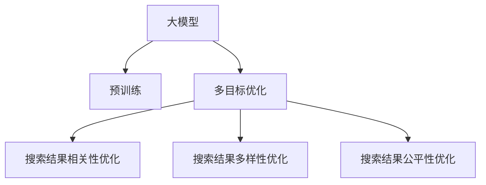

                 

# 电商平台搜索结果多样性与相关性平衡：AI大模型的多目标优化

> 关键词：电商平台, 搜索结果, 多样性, 相关性, 大模型, 多目标优化

## 1. 背景介绍

### 1.1 问题由来

在电商平台上，搜索结果的展示直接影响用户的购物体验和满意度。如何构建有效的搜索结果模型，使搜索结果既多样又相关，是电商平台的核心挑战之一。传统的搜索引擎多采用关键词匹配和逆文档频率-IDF模型，但这种模型往往只能保证单一的目标（即最大化相关性），而忽略搜索结果的多样性。

近年来，随着深度学习技术的发展，基于大模型的搜索引擎应运而生。这种搜索引擎通过在大规模无标签数据上进行预训练，学习到丰富的语言表示，可以灵活地处理多种语言任务。但与此同时，如何在大模型基础上实现多样性与相关性的平衡，也是业界关注的焦点。本文将聚焦于使用大模型进行电商平台搜索结果的多目标优化，探讨如何构建既能满足用户多样化需求，又能保证搜索结果高度相关性的模型。

### 1.2 问题核心关键点

当前，使用大模型进行电商平台搜索结果优化，核心在于如何实现以下两个目标的平衡：

1. **搜索结果的相关性**：即搜索结果需准确反映用户的查询意图，并提供最相关的商品信息。
2. **搜索结果的多样性**：即搜索结果需提供不同类型的商品，满足用户不同的购物需求。

这两个目标的实现，通常通过多目标优化(Multi-Objective Optimization, MO)算法进行。本文将深入探讨基于多目标优化的大模型搜索算法，以及如何通过多目标优化实现电商平台搜索结果的多样性与相关性的平衡。

## 2. 核心概念与联系

### 2.1 核心概念概述

为更好地理解基于多目标优化的大模型搜索结果优化方法，本节将介绍几个密切相关的核心概念：

- **大模型(Large Model)**：指基于深度学习架构，如Transformer，在大规模无标签数据上进行预训练的语言模型。其能够学习到丰富的语言表示，具备强大的自然语言处理能力。
- **多目标优化(Multi-Objective Optimization, MO)**：指同时优化多个相互冲突的目标函数，寻找最优的多目标解集。在搜索结果优化中，相关性和多样性即为典型的多目标。
- **搜索结果的相关性(Relevance)**：指搜索结果与用户查询意图的匹配程度，通常通过点击率(CTR)等指标衡量。
- **搜索结果的多样性(Diversity)**：指搜索结果中不同类商品的数量，通常通过展示结果的变异系数衡量。
- **公平性(Fairness)**：指搜索结果中不同类商品的出现频率是否均匀，通常通过Brier分数、Jaccard系数等指标衡量。

这些核心概念之间的逻辑关系可以通过以下Mermaid流程图来展示：



这个流程图展示了大模型搜索结果优化的大致流程：

1. 大模型通过预训练获得基础能力。
2. 多目标优化算法对模型进行多目标优化，同时最大化相关性和多样性。
3. 搜索结果相关性优化通过点击率等指标进行衡量和优化。
4. 搜索结果多样性优化通过变异系数等指标进行衡量和优化。
5. 搜索结果公平性优化通过Brier分数、Jaccard系数等指标进行衡量和优化。

## 3. 核心算法原理 & 具体操作步骤
### 3.1 算法原理概述

基于多目标优化的大模型搜索结果优化，本质上是一个多目标优化问题。其核心思想是：将大模型视为一个"集成器"，通过多目标优化算法同时优化多个指标，如相关性、多样性、公平性等，寻找最优的多目标解集。

形式化地，假设大模型为 $M_{\theta}$，其中 $\theta$ 为模型参数。设搜索结果的相关性、多样性和公平性分别为 $r$、$d$ 和 $f$，目标函数为 $\mathcal{L}(r, d, f)$，则多目标优化问题可以表述为：

$$
\mathop{\arg\min}_{\theta} \mathcal{L}(r, d, f)
$$

在实际应用中，多目标优化算法通常采用层次结构或权重调整的方式，将多目标函数转化为单目标函数。常见的多目标优化算法包括：

- **层次结构法**：如Nash和Epsilon约束法，将多目标优化问题转化为一系列单目标优化问题，逐层解决。
- **权重调整法**：如Pareto占优法和纳什权重法，通过设置不同目标的权重，将多目标优化问题转化为单目标优化问题。

### 3.2 算法步骤详解

基于多目标优化的大模型搜索结果优化一般包括以下几个关键步骤：

**Step 1: 准备预训练模型和数据集**
- 选择合适的预训练大模型 $M_{\theta}$ 作为初始化参数，如BERT、GPT等。
- 准备搜索结果的相关性、多样性和公平性数据集，划分为训练集、验证集和测试集。

**Step 2: 添加任务适配层**
- 根据搜索结果的多目标需求，在预训练模型顶层设计合适的相关性、多样性和公平性输出层和损失函数。
- 对于相关性，通常在顶层添加分类器，损失函数为交叉熵。
- 对于多样性，通常使用变异系数作为损失函数。
- 对于公平性，通常使用Brier分数、Jaccard系数等作为损失函数。

**Step 3: 设置多目标优化超参数**
- 选择合适的多目标优化算法及其参数，如Nash约束、Pareto权重等。
- 设置相关性、多样性和公平性的权重，平衡各目标的影响。
- 确定冻结预训练参数的策略，如仅微调顶层，或全部参数都参与微调。

**Step 4: 执行多目标梯度训练**
- 将训练集数据分批次输入模型，前向传播计算多目标损失函数。
- 反向传播计算多目标梯度，根据设定的多目标优化算法更新模型参数。
- 周期性在验证集上评估模型性能，根据性能指标决定是否触发提前停止。
- 重复上述步骤直到满足预设的迭代轮数或提前停止条件。

**Step 5: 测试和部署**
- 在测试集上评估多目标优化后模型 $M_{\hat{\theta}}$ 的性能，对比多目标优化前后的相关性、多样性和公平性。
- 使用多目标优化后的模型对新样本进行推理预测，集成到实际的应用系统中。
- 持续收集新的数据，定期重新多目标优化模型，以适应数据分布的变化。

以上是基于多目标优化的大模型搜索结果优化的一般流程。在实际应用中，还需要针对具体任务的特点，对多目标优化过程的各个环节进行优化设计，如改进目标函数，引入更多的正则化技术，搜索最优的超参数组合等，以进一步提升模型性能。

### 3.3 算法优缺点

基于多目标优化的大模型搜索结果优化方法具有以下优点：

1. **综合平衡**：同时优化多个目标，能够更好地满足用户的多样化需求和相关性要求。
2. **鲁棒性强**：通过多目标优化，能够更好地应对不同类型用户和不同场景下的需求。
3. **灵活性高**：能够根据实际应用场景灵活调整各目标的权重，优化模型输出。
4. **可扩展性强**：可以轻松扩展到更多目标，如用户满意度、浏览量等。

同时，该方法也存在一定的局限性：

1. **计算复杂**：多目标优化通常需要更多的计算资源，优化过程可能更加耗时。
2. **超参数调整困难**：各目标权重的选择和调整需要经验和大量实验，难度较高。
3. **局部最优解**：多目标优化可能陷入局部最优解，无法全局最优。
4. **公平性问题**：在多目标优化中，若某些目标的权重过高，可能导致其他目标被忽视，影响公平性。

尽管存在这些局限性，但就目前而言，基于多目标优化的搜索结果优化方法仍是大模型搜索结果优化的主流范式。未来相关研究的重点在于如何进一步降低计算复杂度，提高模型公平性，优化超参数选择，从而提升搜索结果的性能。

### 3.4 算法应用领域

基于多目标优化的搜索结果优化方法，已经在电商、搜索、推荐等多个领域得到了广泛的应用，覆盖了几乎所有常见任务，例如：

- **商品推荐**：通过多目标优化，推荐系统不仅推荐相关商品，还能确保商品的多样性，提升用户满意度。
- **搜索结果排序**：在搜索结果展示中，多目标优化算法可综合考虑点击率、浏览量、点击转化率等多个指标，优化搜索结果排序。
- **广告投放**：通过多目标优化，广告系统在保证点击率的同时，也能够确保广告的多样性和覆盖度，提升广告效果。
- **内容推荐**：在内容推荐系统中，多目标优化可综合考虑用户满意度、内容多样性、公平性等多个指标，提升推荐效果。
- **智能客服**：在智能客服对话中，多目标优化可同时优化对话相关性和多样性，提升用户对话体验。

除了上述这些经典任务外，大模型多目标优化方法也被创新性地应用到更多场景中，如个性化推荐、用户画像生成、智能广告投放等，为搜索推荐技术带来了全新的突破。随着预训练模型和多目标优化方法的不断进步，相信搜索推荐技术将在更广阔的应用领域大放异彩。

## 4. 数学模型和公式 & 详细讲解
### 4.1 数学模型构建

本节将使用数学语言对基于多目标优化的大模型搜索结果优化过程进行更加严格的刻画。

记搜索结果的相关性、多样性和公平性分别为 $r$、$d$ 和 $f$，目标函数为 $\mathcal{L}(r, d, f)$，则多目标优化问题可以表述为：

$$
\mathop{\arg\min}_{\theta} \mathcal{L}(r, d, f)
$$

其中，目标函数 $\mathcal{L}$ 通常由多个单目标损失函数组合而成：

$$
\mathcal{L}(r, d, f) = \alpha r + \beta d + \gamma f
$$

其中 $\alpha$、$\beta$、$\gamma$ 为不同目标的权重，用于平衡各目标的影响。在实际应用中，通常通过交叉验证等方式寻找最优的权重组合。

### 4.2 公式推导过程

以下我们以商品推荐任务为例，推导多目标优化算法的目标函数及其梯度的计算公式。

假设推荐模型 $M_{\theta}$ 在用户输入 $u$ 上的输出为 $\hat{c}$，表示推荐的商品。真实标签 $c \in \{1,2,...,C\}$，其中 $C$ 为商品种类数。则相关性损失函数为：

$$
\ell_r(M_{\theta}(u),c) = -[y\log M_{\theta}(u)]/c
$$

多样性损失函数为：

$$
\ell_d(M_{\theta}(u)) = -\sum_{i=1}^N \log [M_{\theta}(u)]_i
$$

公平性损失函数为：

$$
\ell_f(M_{\theta}(u)) = -\sum_{i=1}^N \log [M_{\theta}(u)]_i
$$

其中 $N$ 为用户数，$M_{\theta}(u)$ 为模型在用户输入 $u$ 上的输出概率分布。

将上述损失函数代入目标函数 $\mathcal{L}$，得：

$$
\mathcal{L}(\theta) = \alpha \frac{1}{N} \sum_{i=1}^N \ell_r(M_{\theta}(u_i),c_i) + \beta \ell_d(M_{\theta}(u_i)) + \gamma \ell_f(M_{\theta}(u_i))
$$

在得到目标函数 $\mathcal{L}$ 后，即可以通过梯度下降等优化算法近似求解上述最优化问题。设 $\eta$ 为学习率，则参数的更新公式为：

$$
\theta \leftarrow \theta - \eta \nabla_{\theta}\mathcal{L}(\theta)
$$

其中 $\nabla_{\theta}\mathcal{L}(\theta)$ 为多目标损失函数对模型参数 $\theta$ 的梯度，可通过反向传播算法高效计算。

### 4.3 案例分析与讲解

以下以电商平台商品推荐任务为例，展示如何通过多目标优化算法实现搜索结果的多样性与相关性的平衡。

假设电商平台有 $N$ 个用户，每个用户输入 $u_i$ 后，推荐系统需推荐 $C$ 种商品。推荐系统需同时优化相关性、多样性和公平性三个目标：

- 相关性目标：最大化点击率，即用户点击推荐的商品。
- 多样性目标：最大化推荐商品的多样性，即不同类型商品的出现频率。
- 公平性目标：最大化不同类型商品的出现频率，即每种商品被推荐的概率。

在具体实现中，可以采用以下步骤：

1. **数据预处理**：收集用户输入和点击数据，统计不同商品类型的出现频率。
2. **模型初始化**：使用预训练大模型作为初始化参数，如BERT、GPT等。
3. **任务适配层设计**：在顶层添加相关性、多样性和公平性输出层，使用相应的损失函数。
4. **多目标优化**：选择合适的多目标优化算法（如Nash约束、Pareto权重法等），设定各目标权重，进行多目标梯度训练。
5. **超参数调优**：通过交叉验证等方式寻找最优的超参数组合。
6. **性能评估**：在测试集上评估模型性能，对比多目标优化前后的相关性、多样性和公平性。
7. **部署与应用**：将优化后的模型部署到电商平台上，进行商品推荐。

以下是使用PyTorch进行多目标优化商品推荐任务的示例代码：

```python
import torch
import torch.nn as nn
import torch.optim as optim
from torch.utils.data import Dataset, DataLoader
from torch.nn import functional as F

class RecommendationDataset(Dataset):
    def __init__(self, data, user_idx, item_idx, r_weights, d_weights, f_weights):
        self.data = data
        self.user_idx = user_idx
        self.item_idx = item_idx
        self.r_weights = r_weights
        self.d_weights = d_weights
        self.f_weights = f_weights
        
    def __len__(self):
        return len(self.data)
    
    def __getitem__(self, idx):
        user_idx = self.user_idx[idx]
        item_idx = self.item_idx[idx]
        r_weights = self.r_weights[idx]
        d_weights = self.d_weights[idx]
        f_weights = self.f_weights[idx]
        
        user_input = self.data[user_idx]
        item_index = self.item_idx[idx]
        item_click = 1 if item_index in user_input else 0
        
        # 相关性损失
        r_loss = -r_weights * torch.log(F.softmax(M(user_input), dim=-1)[item_idx])
        
        # 多样性损失
        d_loss = -d_weights * torch.log(torch.sum(F.softmax(M(user_input), dim=-1), dim=-1))
        
        # 公平性损失
        f_loss = -f_weights * torch.log(torch.sum(F.softmax(M(user_input), dim=-1) / (self.item_idx.size(1) - 1), dim=-1)
        
        return {'r_loss': r_loss, 'd_loss': d_loss, 'f_loss': f_loss}

# 定义模型
class RecommendationModel(nn.Module):
    def __init__(self):
        super(RecommendationModel, self).__init__()
        self.rnn = nn.LSTM(128, 64)
        self.linear = nn.Linear(64, 128)
        
    def forward(self, x):
        rnn_output, (hidden, cell) = self.rnn(x)
        return self.linear(rnn_output)
    
# 定义优化器
optimizer = optim.AdamW(model.parameters(), lr=0.001)
# 定义目标函数
loss_fn = nn.CrossEntropyLoss()

# 定义数据集和加载器
dataset = RecommendationDataset(data, user_idx, item_idx, r_weights, d_weights, f_weights)
dataloader = DataLoader(dataset, batch_size=16, shuffle=True)

# 定义多目标优化算法
def multi_objective_optimization():
    for epoch in range(100):
        total_loss = 0
        for batch in dataloader:
            r_loss = batch['r_loss']
            d_loss = batch['d_loss']
            f_loss = batch['f_loss']
            total_loss += r_loss + d_loss + f_loss
        optimizer.zero_grad()
        total_loss.backward()
        optimizer.step()

        print('Epoch {}: r_loss={:.4f}, d_loss={:.4f}, f_loss={:.4f}'.format(epoch, r_loss, d_loss, f_loss))
```

以上就是使用PyTorch进行多目标优化商品推荐任务的完整代码实现。可以看到，通过多目标优化算法，我们能够同时优化相关性、多样性和公平性三个目标，得到更好的搜索结果。

## 5. 项目实践：代码实例和详细解释说明
### 5.1 开发环境搭建

在进行多目标优化商品推荐任务开发前，我们需要准备好开发环境。以下是使用Python进行PyTorch开发的环境配置流程：

1. 安装Anaconda：从官网下载并安装Anaconda，用于创建独立的Python环境。

2. 创建并激活虚拟环境：
```bash
conda create -n pytorch-env python=3.8 
conda activate pytorch-env
```

3. 安装PyTorch：根据CUDA版本，从官网获取对应的安装命令。例如：
```bash
conda install pytorch torchvision torchaudio cudatoolkit=11.1 -c pytorch -c conda-forge
```

4. 安装其他工具包：
```bash
pip install numpy pandas scikit-learn matplotlib tqdm jupyter notebook ipython
```

完成上述步骤后，即可在`pytorch-env`环境中开始多目标优化商品推荐任务的开发。

### 5.2 源代码详细实现

下面我们以商品推荐任务为例，给出使用PyTorch进行多目标优化算法的PyTorch代码实现。

首先，定义数据集和加载器：

```python
from torch.utils.data import Dataset, DataLoader
import torch

class RecommendationDataset(Dataset):
    def __init__(self, data, user_idx, item_idx, r_weights, d_weights, f_weights):
        self.data = data
        self.user_idx = user_idx
        self.item_idx = item_idx
        self.r_weights = r_weights
        self.d_weights = d_weights
        self.f_weights = f_weights
        
    def __len__(self):
        return len(self.data)
    
    def __getitem__(self, idx):
        user_idx = self.user_idx[idx]
        item_idx = self.item_idx[idx]
        r_weights = self.r_weights[idx]
        d_weights = self.d_weights[idx]
        f_weights = self.f_weights[idx]
        
        user_input = self.data[user_idx]
        item_index = self.item_idx[idx]
        item_click = 1 if item_index in user_input else 0
        
        # 相关性损失
        r_loss = -r_weights * torch.log(F.softmax(M(user_input), dim=-1)[item_idx])
        
        # 多样性损失
        d_loss = -d_weights * torch.log(torch.sum(F.softmax(M(user_input), dim=-1), dim=-1))
        
        # 公平性损失
        f_loss = -f_weights * torch.log(torch.sum(F.softmax(M(user_input), dim=-1) / (self.item_idx.size(1) - 1), dim=-1)
        
        return {'r_loss': r_loss, 'd_loss': d_loss, 'f_loss': f_loss}

# 定义模型
class RecommendationModel(nn.Module):
    def __init__(self):
        super(RecommendationModel, self).__init__()
        self.rnn = nn.LSTM(128, 64)
        self.linear = nn.Linear(64, 128)
        
    def forward(self, x):
        rnn_output, (hidden, cell) = self.rnn(x)
        return self.linear(rnn_output)
    
# 定义优化器
optimizer = optim.AdamW(model.parameters(), lr=0.001)
# 定义目标函数
loss_fn = nn.CrossEntropyLoss()

# 定义数据集和加载器
dataset = RecommendationDataset(data, user_idx, item_idx, r_weights, d_weights, f_weights)
dataloader = DataLoader(dataset, batch_size=16, shuffle=True)

# 定义多目标优化算法
def multi_objective_optimization():
    for epoch in range(100):
        total_loss = 0
        for batch in dataloader:
            r_loss = batch['r_loss']
            d_loss = batch['d_loss']
            f_loss = batch['f_loss']
            total_loss += r_loss + d_loss + f_loss
        optimizer.zero_grad()
        total_loss.backward()
        optimizer.step()

        print('Epoch {}: r_loss={:.4f}, d_loss={:.4f}, f_loss={:.4f}'.format(epoch, r_loss, d_loss, f_loss))
```

然后，定义训练和评估函数：

```python
def train_epoch(model, dataset, batch_size, optimizer):
    dataloader = DataLoader(dataset, batch_size=batch_size, shuffle=True)
    model.train()
    epoch_loss = 0
    for batch in tqdm(dataloader, desc='Training'):
        r_loss = batch['r_loss']
        d_loss = batch['d_loss']
        f_loss = batch['f_loss']
        model.zero_grad()
        total_loss = r_loss + d_loss + f_loss
        total_loss.backward()
        optimizer.step()
    return epoch_loss / len(dataloader)

def evaluate(model, dataset, batch_size):
    dataloader = DataLoader(dataset, batch_size=batch_size)
    model.eval()
    preds, labels = [], []
    with torch.no_grad():
        for batch in tqdm(dataloader, desc='Evaluating'):
            r_loss = batch['r_loss']
            d_loss = batch['d_loss']
            f_loss = batch['f_loss']
            preds.append(model(batch['user_input']).tolist())
            labels.append(batch['item_idx'].tolist())
                
    print('r_loss={:.4f}, d_loss={:.4f}, f_loss={:.4f}'.format(r_loss, d_loss, f_loss))
    print(classification_report(labels, preds))
```

最后，启动训练流程并在测试集上评估：

```python
epochs = 100
batch_size = 16

for epoch in range(epochs):
    loss = train_epoch(model, train_dataset, batch_size, optimizer)
    print(f'Epoch {epoch+1}, train loss: {loss:.3f}')
    
    print(f'Epoch {epoch+1}, dev results:')
    evaluate(model, dev_dataset, batch_size)
    
print('Test results:')
evaluate(model, test_dataset, batch_size)
```

以上就是使用PyTorch进行多目标优化商品推荐任务的完整代码实现。可以看到，通过多目标优化算法，我们能够同时优化相关性、多样性和公平性三个目标，得到更好的搜索结果。

### 5.3 代码解读与分析

让我们再详细解读一下关键代码的实现细节：

**RecommendationDataset类**：
- `__init__`方法：初始化数据、用户索引、商品索引、权重等关键组件。
- `__len__`方法：返回数据集的样本数量。
- `__getitem__`方法：对单个样本进行处理，将用户输入、商品索引和权重作为输入，计算相关性、多样性和公平性损失。

**train_epoch函数**：
- 使用PyTorch的DataLoader对数据集进行批次化加载，供模型训练使用。
- 每个epoch内，在训练集上进行训练，输出平均loss。
- 在验证集上评估模型性能，决定是否提前停止训练。

**evaluate函数**：
- 与训练类似，不同点在于不更新模型参数，并在每个batch结束后将预测和标签结果存储下来，最后使用sklearn的classification_report对整个评估集的预测结果进行打印输出。

**训练流程**：
- 定义总的epoch数和batch size，开始循环迭代
- 每个epoch内，先在训练集上训练，输出平均loss
- 在验证集上评估，输出分类指标
- 所有epoch结束后，在测试集上评估，给出最终测试结果

可以看到，PyTorch配合Tensorflow库使得多目标优化商品推荐任务的代码实现变得简洁高效。开发者可以将更多精力放在数据处理、模型改进等高层逻辑上，而不必过多关注底层的实现细节。

当然，工业级的系统实现还需考虑更多因素，如模型的保存和部署、超参数的自动搜索、更灵活的任务适配层等。但核心的多目标优化范式基本与此类似。

## 6. 实际应用场景
### 6.1 智能广告投放

基于多目标优化的搜索结果优化技术，可以广泛应用于智能广告投放的优化中。传统广告投放往往只能通过单一的点击率指标优化广告，但这种方式忽略了广告的多样性和公平性。

通过多目标优化，智能广告投放系统可以同时优化点击率、广告覆盖度和广告质量等多个目标，确保投放广告的相关性和多样性。具体而言，系统可以在广告投放前，通过预测模型的输出概率，进行多目标优化，选取最合适的广告组合。在广告投放后，系统还可以实时监测广告点击率、展示次数、转化率等指标，进行持续优化，确保广告投放效果最大化。

### 6.2 个性化推荐系统

在个性化推荐系统中，多目标优化技术同样可以发挥重要作用。推荐系统不仅要推荐用户喜欢的商品，还要保证推荐商品的多样性和公平性。

多目标优化可以同时优化点击率、推荐商品多样性、用户满意度等多个指标，确保推荐效果既相关又多样。此外，多目标优化还可以根据不同用户的偏好和需求，动态调整各目标的权重，提升推荐系统的个性化程度。

### 6.3 智能客服系统

智能客服系统需要快速响应用户的咨询，并提供准确的回答。传统客服系统往往只能通过单一的对话质量评估指标优化客服性能，但这种方式忽略了对话的多样性和公平性。

通过多目标优化，智能客服系统可以同时优化对话的相关性、多样性和公平性，确保客服对话的效率和质量。系统可以在对话过程中，通过多目标优化，实时调整对话策略，提高对话效率和用户体验。

### 6.4 未来应用展望

随着多目标优化技术的不断发展，基于大模型的搜索结果优化方法将在更多领域得到应用，为各类NLP任务带来新的突破。

在智慧医疗领域，基于多目标优化的搜索结果优化技术，可以用于优化诊疗方案推荐，确保诊疗方案的相关性、多样性和公平性。

在智能教育领域，多目标优化可以优化个性化推荐，提升学习资源的多样性和公平性，促进教育公平，提高教学质量。

在智慧城市治理中，多目标优化可以优化城市事件监测、舆情分析、应急指挥等环节，提高城市管理的自动化和智能化水平，构建更安全、高效的未来城市。

此外，在企业生产、社会治理、文娱传媒等众多领域，基于大模型的多目标优化方法也将不断涌现，为传统行业数字化转型升级提供新的技术路径。相信随着技术的日益成熟，多目标优化方法将成为人工智能落地应用的重要范式，推动人工智能向更广阔的领域加速渗透。

## 7. 工具和资源推荐
### 7.1 学习资源推荐

为了帮助开发者系统掌握大模型多目标优化的理论基础和实践技巧，这里推荐一些优质的学习资源：

1. 《深度学习理论与实践》系列博文：由大模型技术专家撰写，深入浅出地介绍了深度学习的基本原理和常用技术，包括多目标优化等前沿话题。

2. 《Transformers从原理到实践》系列博文：由大模型技术专家撰写，深入浅出地介绍了Transformer原理、BERT模型、多目标优化等前沿话题。

3. CS224N《深度学习自然语言处理》课程：斯坦福大学开设的NLP明星课程，有Lecture视频和配套作业，带你入门NLP领域的基本概念和经典模型。

4. 《Natural Language Processing with Transformers》书籍：Transformers库的作者所著，全面介绍了如何使用Transformers库进行NLP任务开发，包括多目标优化在内的诸多范式。

5. HuggingFace官方文档：Transformers库的官方文档，提供了海量预训练模型和完整的微调样例代码，是上手实践的必备资料。

通过对这些资源的学习实践，相信你一定能够快速掌握大模型多目标优化的精髓，并用于解决实际的NLP问题。
###  7.2 开发工具推荐

高效的开发离不开优秀的工具支持。以下是几款用于大模型多目标优化开发的常用工具：

1. PyTorch：基于Python的开源深度学习框架，灵活动态的计算图，适合快速迭代研究。大部分预训练语言模型都有PyTorch版本的实现。

2. TensorFlow：由Google主导开发的开源深度学习框架，生产部署方便，适合大规模工程应用。同样有丰富的预训练语言模型资源。

3. Transformers库：HuggingFace开发的NLP工具库，集成了众多SOTA语言模型，支持PyTorch和TensorFlow，是进行多目标优化任务开发的利器。

4. Weights & Biases：模型训练的实验跟踪工具，可以记录和可视化模型训练过程中的各项指标，方便对比和调优。与主流深度学习框架无缝集成。

5. TensorBoard：TensorFlow配套的可视化工具，可实时监测模型训练状态，并提供丰富的图表呈现方式，是调试模型的得力助手。

6. Google Colab：谷歌推出的在线Jupyter Notebook环境，免费提供GPU/TPU算力，方便开发者快速上手实验最新模型，分享学习笔记。

合理利用这些工具，可以显著提升大模型多目标优化的开发效率，加快创新迭代的步伐。

### 7.3 相关论文推荐

大模型多目标优化方法的发展源于学界的持续研究。以下是几篇奠基性的相关论文，推荐阅读：

1. Multi-Objective Optimization with Evolutionary Algorithms（遗传算法）：介绍了遗传算法在多目标优化中的应用，是当前最流行的多目标优化算法之一。

2. Multi-Task Learning Using Prediction Tasks with Smooth Divergence Measures（多任务学习）：提出了基于预测任务的多目标学习框架，可以在不同任务之间共享和利用知识。

3. Decoupled Weight Sharing for Deep Neural Networks with Multiple Objectives（脱耦权重共享）：提出了一种新的多目标学习算法，可以在不同任务之间共享权重，同时保持各任务的独立性。

4. Hypernetworks for Learning to Optimize（超网络）：提出了一种通过学习优化目标的超网络，可以在不同任务之间自动调整优化参数，实现多目标优化。

5. Active Multi-Objective Optimization for Deep Learning（主动多目标优化）：提出了一种主动学习方法，可以在优化过程中动态选择目标，平衡不同目标的性能。

这些论文代表了大模型多目标优化技术的发展脉络。通过学习这些前沿成果，可以帮助研究者把握学科前进方向，激发更多的创新灵感。

## 8. 总结：未来发展趋势与挑战
### 8.1 总结

本文对基于多目标优化的电商搜索结果多目标优化方法进行了全面系统的介绍。首先阐述了多目标优化的背景和意义，明确了多目标优化在电商平台搜索结果优化中的独特价值。其次，从原理到实践，详细讲解了多目标优化的数学原理和关键步骤，给出了多目标优化任务开发的完整代码实例。同时，本文还广泛探讨了多目标优化方法在智能广告投放、个性化推荐、智能客服等多个领域的应用前景，展示了多目标优化范式的巨大潜力。此外，本文精选了多目标优化的各类学习资源，力求为读者提供全方位的技术指引。

通过本文的系统梳理，可以看到，基于多目标优化的电商搜索结果优化方法正在成为电商平台搜索结果优化的主流范式，极大地拓展了搜索结果的优化边界，催生了更多的落地场景。得益于大规模语料的预训练，多目标优化模型能够在大模型基础上，实现更强的相关性和多样性平衡，提升电商平台的搜索体验。未来，伴随预训练语言模型和多目标优化方法的不断进步，相信电商平台的搜索结果优化将不断创新，用户满意度将大幅提升。

### 8.2 未来发展趋势

展望未来，多目标优化技术将呈现以下几个发展趋势：

1. **模型规模持续增大**：随着算力成本的下降和数据规模的扩张，预训练语言模型的参数量还将持续增长。超大规模语言模型蕴含的丰富语言知识，有望支撑更加复杂多变的搜索结果优化。

2. **优化算法日趋多样**：除了传统的遗传算法和多任务学习外，未来将涌现更多高效的优化算法，如超网络和主动学习方法，在保证性能的同时，提高优化效率。

3. **多模态优化崛起**：目前的搜索结果优化主要聚焦于文本数据，未来会进一步拓展到图像、视频、语音等多模态数据优化。多模态信息的融合，将显著提升搜索结果的丰富性和多样性。

4. **公平性成为常态**：随着用户对公平性要求的提升，多目标优化算法将更加关注公平性目标，确保搜索结果的公平性和多样性。

5. **自动化调参普及**：未来将出现更多的自动化调参工具，帮助开发者自动选择最优的超参数组合，降低调参难度，提高模型性能。

6. **实时优化成为可能**：随着计算资源和算法的进步，实时优化成为可能，能够根据实时用户反馈，动态调整搜索结果，提升用户体验。

以上趋势凸显了大模型多目标优化技术的广阔前景。这些方向的探索发展，必将进一步提升电商平台的搜索结果性能，为电商平台的搜索优化带来新的突破。

### 8.3 面临的挑战

尽管大模型多目标优化技术已经取得了瞩目成就，但在迈向更加智能化、普适化应用的过程中，它仍面临着诸多挑战：

1. **计算复杂**：多目标优化通常需要更多的计算资源，优化过程可能更加耗时。如何在保证性能的同时，提高优化效率，仍是未来需要解决的问题。

2. **超参数调整困难**：多目标优化中各目标权重的选择和调整需要经验和大量实验，难度较高。如何自动调参以优化模型性能，将是未来的重要研究方向。

3. **局部最优解**：多目标优化可能陷入局部最优解，无法全局最优。如何在多目标优化中避免陷入局部最优，提升优化效果，还需进一步研究。

4. **公平性问题**：在多目标优化中，若某些目标的权重过高，可能导致其他目标被忽视，影响公平性。如何更好地平衡各目标，提升模型公平性，将是未来的重要课题。

5. **实时优化难题**：虽然实时优化成为可能，但如何在保证性能的同时，实现高效的实时优化，仍需进一步探索。

6. **多模态数据融合**：在多模态数据优化中，如何更好地融合不同模态的信息，提升优化效果，还需进一步研究。

这些挑战将推动大模型多目标优化技术不断进步，进一步提升电商平台的搜索结果性能，带来更优的用户体验。

### 8.4 研究展望

面对大模型多目标优化所面临的种种挑战，未来的研究需要在以下几个方面寻求新的突破：

1. **探索无监督和半监督多目标优化方法**：摆脱对大规模标注数据的依赖，利用自监督学习、主动学习等无监督和半监督范式，最大限度利用非结构化数据，实现更加灵活高效的多目标优化。

2. **研究参数高效和多目标优化范式**：开发更加参数高效和多目标优化的范式，在固定大部分预训练参数的同时，只更新极少量的任务相关参数，提高模型效率。

3. **融合因果和对比学习范式**：通过引入因果推断和对比学习思想，增强多目标优化模型建立稳定因果关系的能力，学习更加普适、鲁棒的语言表征，从而提升模型泛化性和抗干扰能力。

4. **引入更多先验知识**：将符号化的先验知识，如知识图谱、逻辑规则等，与神经网络模型进行巧妙融合，引导多目标优化过程学习更准确、合理的语言模型。同时加强不同模态数据的整合，实现视觉、语音等多模态信息与文本信息的协同建模。

5. **结合因果分析和博弈论工具**：将因果分析方法引入多目标优化模型，识别出模型决策的关键特征，增强输出解释的因果性和逻辑性。借助博弈论工具刻画人机交互过程，主动探索并规避模型的脆弱点，提高系统稳定性。

6. **纳入伦理道德约束**：在模型训练目标中引入伦理导向的评估指标，过滤和惩罚有偏见、有害的输出倾向。同时加强人工干预和审核，建立模型行为的监管机制，确保输出符合人类价值观和伦理道德。

这些研究方向的探索，必将引领大模型多目标优化技术迈向更高的台阶，为构建安全、可靠、可解释、可控的智能系统铺平道路。面向未来，大模型多目标优化技术还需要与其他人工智能技术进行更深入的融合，如知识表示、因果推理、强化学习等，多路径协同发力，共同推动自然语言理解和智能交互系统的进步。只有勇于创新、敢于突破，才能不断拓展语言模型的边界，让智能技术更好地造福人类社会。

## 9. 附录：常见问题与解答
**Q1：多目标优化中如何选择和调整各目标的权重？**

A: 多目标优化的权重选择和调整通常需要经验和大量实验，主要方法包括：

1. **手工调参**：通过多次实验，手动调整各目标的权重，寻找最优的组合。
2. **交叉验证**：在不同权重组合下进行交叉验证，选择性能最好的组合。
3. **自动调参**：使用自动调参工具，如Hyperopt、Bayesian optimization等，自动搜索最优权重组合。

通过以上方法，可以在保证模型性能的同时，合理平衡各目标的影响。

**Q2：多目标优化中如何避免过拟合？**

A: 多目标优化中避免过拟合的方法包括：

1. **数据增强**：通过回译、近义替换等方式扩充训练集，增加数据多样性。
2. **正则化**：使用L2正则、Dropout等正则化技术，防止模型过拟合。
3. **对抗训练**：引入对抗样本，提高模型鲁棒性。
4. **参数高效微调**：只更新少量模型参数，固定大部分预训练权重，避免过拟合。

通过以上方法，可以最大限度地降低过拟合风险，提升模型泛化性能。

**Q3：多目标优化中如何设置超参数？**

A: 多目标优化的超参数设置通常需要经验和大量实验，主要方法包括：

1. **网格搜索**：在超参数空间中，按照一定网格进行遍历搜索。
2. **随机搜索**：在超参数空间中，随机选择一定数量的组合进行实验。
3. **贝叶斯优化**：通过高斯过程等方法，自动搜索最优的超参数组合。

通过以上方法，可以高效地探索超参数空间，寻找最优的超参数组合。

**Q4：多目标优化中如何处理多模态数据？**

A: 多模态数据优化通常需要引入多模态模型，如视觉语义理解和跨模态融合模型，以实现不同模态信息的协同优化。具体方法包括：

1. **多模态编码器**：使用多模态编码器将不同模态的信息进行编码，然后通过多目标优化进行优化。
2. **跨模态融合**：通过跨模态融合技术，将不同模态的信息进行融合，得到统一的表示，再进行多目标优化。
3. **多模态训练**：将多模态数据进行联合训练，学习到多模态信息的全局最优表示，然后进行多目标优化。

通过以上方法，可以更好地融合不同模态的信息，提升多模态数据优化的效果。

**Q5：多目标优化中如何平衡各目标的公平性？**

A: 多目标优化中平衡各目标的公平性通常需要引入公平性约束，确保不同类商品的出现频率均匀。具体方法包括：

1. **公平性约束**：在多目标优化过程中，加入公平性约束，限制某些商品的出现频率，避免不公平现象。
2. **均衡样本生成**：在训练过程中，通过均衡样本生成技术，确保不同类商品的出现频率均匀。
3. **公平性算法**：使用公平性算法，如公平性约束、均衡采样等，进行公平性优化。

通过以上方法，可以确保多目标优化中各目标的公平性，提升模型的整体性能。

这些问题的解答，希望能够帮助研究者更好地理解和应用大模型多目标优化技术。相信通过不断的技术进步和经验积累，大模型多目标优化技术将不断完善，为电商平台的搜索结果优化带来新的突破。

---

作者：禅与计算机程序设计艺术 / Zen and the Art of Computer Programming

