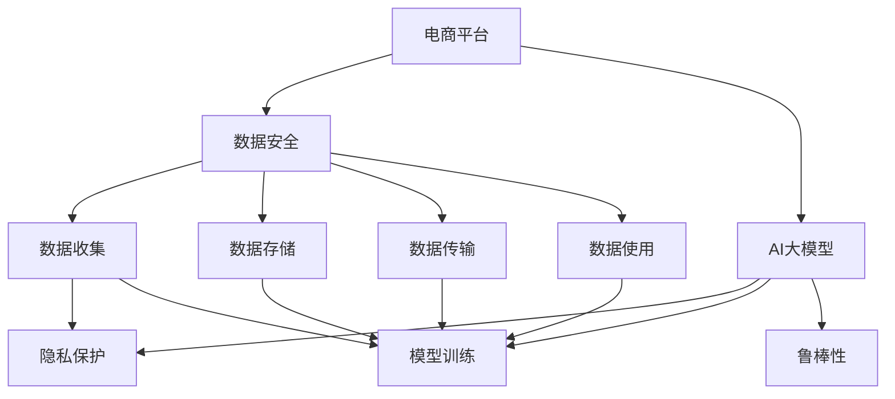

                 

# 电商平台数据安全与AI大模型的平衡策略

> 关键词：电商平台, 数据安全, AI大模型, 平衡策略, 隐私保护, 模型训练, 鲁棒性

## 1. 背景介绍

随着电商平台的发展，数据安全与AI大模型的应用成为了一个重要议题。在电商平台上，用户的个人信息、购物行为等数据至关重要，但其隐私保护也面临着巨大的挑战。而AI大模型，由于其强大的数据处理和预测能力，在推荐系统、欺诈检测、客户服务等方面得到了广泛的应用。然而，大模型的训练和应用过程中，数据泄露和模型偏见等问题也引起了人们的担忧。如何在保证用户隐私的同时，充分利用AI大模型带来的技术优势，成为了一个亟待解决的问题。

## 2. 核心概念与联系

### 2.1 核心概念概述

为更好地理解电商平台数据安全与AI大模型的平衡策略，本节将介绍几个密切相关的核心概念：

- **电商平台**：指通过互联网提供商品或服务的在线平台，如淘宝、京东、亚马逊等。电商平台的运营依赖于大量的用户数据，如用户行为、交易记录等，这些数据对于平台的用户推荐、库存管理、欺诈检测等业务至关重要。
- **AI大模型**：指基于深度学习技术，采用大规模数据进行训练的模型，如BERT、GPT、T5等。大模型具备强大的数据处理和预测能力，能够应用于自然语言处理、计算机视觉、推荐系统等领域。
- **数据安全**：指保护数据的完整性、保密性和可用性，防止数据泄露、篡改和丢失。在电商平台上，数据安全尤为重要，涉及到用户隐私保护和商业机密保护。
- **隐私保护**：指在数据收集、存储、传输、使用过程中，保护个人隐私不被侵犯。隐私保护是数据安全的重要组成部分，特别是在涉及个人信息的电商平台上。
- **鲁棒性**：指模型对于异常输入或攻击的抵抗能力。电商平台上存在大量异常交易和恶意行为，如何设计鲁棒的大模型，以抵御欺诈检测、恶意攻击等，是数据安全的重要研究方向。
- **模型训练**：指使用数据训练模型，使其能够对新数据进行预测。电商平台的推荐系统、欺诈检测等业务，依赖于大模型的训练和优化。
- **隐私保护与模型训练的平衡**：指在保障用户隐私的前提下，充分利用AI大模型的优势，提升电商平台的业务性能。平衡隐私保护和模型训练的需求，是大模型在电商平台上应用的关键。

这些核心概念之间的逻辑关系可以通过以下Mermaid流程图来展示：



这个流程图展示了大语言模型的核心概念及其之间的关系：

1. 电商平台通过数据收集、存储、传输和使用，为模型训练和业务运营提供数据基础。
2. AI大模型在电商平台上应用，依赖于数据的训练和优化，提升推荐系统、欺诈检测等业务性能。
3. 数据安全与隐私保护是大模型应用的前提，需要确保数据在各个环节的安全。
4. 模型训练过程中，需要考虑数据的隐私保护需求，防止模型训练过程中的数据泄露。
5. 大模型的鲁棒性设计，有助于提升模型对于异常交易和恶意攻击的识别能力，进一步保障数据安全。

## 3. 核心算法原理 & 具体操作步骤

### 3.1 算法原理概述

在电商平台应用AI大模型的过程中，隐私保护和数据安全是至关重要的。隐私保护通常通过数据匿名化、差分隐私等方法实现，而数据安全则依赖于数据加密、访问控制等技术。同时，AI大模型的训练和应用也需要考虑其鲁棒性，以抵御恶意攻击和异常输入。

### 3.2 算法步骤详解

#### 3.2.1 数据收集与匿名化

电商平台的运营依赖于大量的用户数据，包括用户的浏览记录、购买记录、评分记录等。为了保护用户隐私，需要在数据收集过程中进行匿名化处理。常用的匿名化方法包括：

- **去标识化（De-identification）**：删除或修改数据中的个人身份信息，如姓名、身份证号码等。
- **泛化（Generalization）**：将数据中的具体值替换为更广泛的范围，如将具体日期替换为月份或年份。
- **假名化（Pseudonymization）**：将个人身份信息替换为假名，如将姓名替换为编号或字母。

#### 3.2.2 数据加密与传输

电商平台的业务运营需要频繁地数据传输，包括用户数据、交易数据等。为了保护数据在传输过程中的安全，通常采用数据加密技术。常用的加密方法包括：

- **对称加密**：使用同一个密钥进行加密和解密，如AES、DES等。
- **非对称加密**：使用公钥加密、私钥解密的方式，如RSA、ECC等。
- **端到端加密**：在数据传输的起点和终点之间直接加密，不涉及中间节点，如TLS、SSH等。

#### 3.2.3 模型训练与隐私保护

在电商平台中，推荐系统、欺诈检测等业务依赖于AI大模型的训练和优化。然而，大模型的训练过程会涉及到大量的用户数据，如何保护这些数据的隐私是一个重要问题。常用的隐私保护方法包括：

- **差分隐私（Differential Privacy）**：在模型训练过程中，引入噪声，使任何单个数据点对模型输出的影响微乎其微，从而保护数据隐私。
- **联邦学习（Federated Learning）**：在多个设备或服务器上分散训练模型，只传递模型参数，不传递原始数据，保护数据隐私。
- **对抗训练（Adversarial Training）**：在模型训练过程中，引入对抗样本，提高模型对于异常输入的抵抗能力，防止数据泄露。

#### 3.2.4 模型部署与访问控制

电商平台的AI大模型部署后，需要考虑模型的访问控制，防止未经授权的访问和恶意攻击。常用的访问控制方法包括：

- **角色访问控制（Role-Based Access Control, RBAC）**：根据用户角色分配权限，限制其访问范围。
- **细粒度访问控制（Attribute-Based Access Control, ABAC）**：根据更细粒度的属性（如时间、地点、设备等）进行访问控制。
- **基于区块链的访问控制**：使用区块链技术，记录模型访问日志，防止数据篡改和追溯。

### 3.3 算法优缺点

基于AI大模型的电商平台数据安全策略，具有以下优点：

- **数据保护能力强**：通过数据匿名化、差分隐私等方法，有效保护用户隐私，防止数据泄露。
- **模型鲁棒性好**：通过对抗训练等方法，提升模型对于异常输入和恶意攻击的抵抗能力，保障数据安全。
- **业务性能提升**：通过AI大模型的应用，提升推荐系统、欺诈检测等业务性能，提高用户体验。

同时，该策略也存在以下局限性：

- **数据处理复杂**：数据匿名化和差分隐私等方法，需要在数据处理环节增加复杂度，增加了计算成本。
- **模型训练难度高**：对抗训练等方法，需要在大模型训练过程中引入额外的对抗样本，增加了训练难度。
- **隐私保护效果有限**：差分隐私等方法，虽然能够保护数据隐私，但无法完全消除隐私风险。

尽管存在这些局限性，但就目前而言，基于AI大模型的电商平台数据安全策略仍是最主流范式。未来相关研究的重点在于如何进一步降低数据处理复杂度，提高模型训练效率，同时兼顾隐私保护和业务性能。

### 3.4 算法应用领域

基于AI大模型的电商平台数据安全策略，在推荐系统、欺诈检测、客户服务等电商业务中得到了广泛应用，具体如下：

- **推荐系统**：利用AI大模型对用户行为进行分析和预测，提升推荐系统精度和用户满意度。同时，通过差分隐私等方法，保护用户行为数据隐私。
- **欺诈检测**：利用AI大模型对交易行为进行异常检测，防止欺诈行为。通过对抗训练等方法，提高模型对于欺诈行为的识别能力。
- **客户服务**：利用AI大模型对客户服务请求进行分类和响应，提升服务效率和用户体验。同时，通过访问控制等方法，保障客户服务数据的安全。

除了上述这些经典应用外，大模型还应用于数据标注、风险评估等电商业务中，为电商平台带来了更多的技术创新和业务价值。随着预训练语言模型和隐私保护技术的不断发展，相信AI大模型在电商平台上将发挥更大的作用。

## 4. 数学模型和公式 & 详细讲解 & 举例说明

### 4.1 数学模型构建

本节将使用数学语言对基于AI大模型的电商平台数据安全策略进行更加严格的刻画。

假设电商平台收集的用户数据为 $D=\{x_i,y_i\}_{i=1}^N$，其中 $x_i$ 为特征向量，$y_i$ 为标签向量。模型的训练目标是最小化损失函数 $L(\theta)$，其中 $\theta$ 为模型参数。

定义模型的损失函数为：

$$
L(\theta) = \frac{1}{N}\sum_{i=1}^N \ell(x_i, y_i; \theta)
$$

其中 $\ell(x_i, y_i; \theta)$ 为样本 $(x_i, y_i)$ 的损失函数，可以是分类交叉熵、回归均方误差等。

### 4.2 公式推导过程

在电商平台的推荐系统业务中，常使用基于逻辑回归（Logistic Regression）的模型进行训练。假设模型的预测概率为 $p(y_i=1|x_i; \theta)$，则模型的损失函数为二元分类交叉熵：

$$
\ell(x_i, y_i; \theta) = -y_i\log p(y_i=1|x_i; \theta) - (1-y_i)\log (1-p(y_i=1|x_i; \theta))
$$

根据链式法则，损失函数对模型参数 $\theta$ 的梯度为：

$$
\nabla_{\theta}L(\theta) = -\frac{1}{N}\sum_{i=1}^N \nabla_{\theta}\ell(x_i, y_i; \theta) = -\frac{1}{N}\sum_{i=1}^N \left[ \frac{y_i}{p(y_i=1|x_i; \theta)} - \frac{1-y_i}{1-p(y_i=1|x_i; \theta)} \right] \nabla_{\theta}p(y_i=1|x_i; \theta)
$$

其中 $\nabla_{\theta}p(y_i=1|x_i; \theta)$ 为模型对样本 $(x_i, y_i)$ 的梯度，可通过反向传播算法高效计算。

### 4.3 案例分析与讲解

以电商平台中的推荐系统为例，展示大模型如何与隐私保护技术相结合，保护用户隐私的同时提升推荐系统性能。

假设电商平台收集的用户浏览记录为 $D=\{x_i,y_i\}_{i=1}^N$，其中 $x_i$ 为浏览记录，$y_i$ 为推荐结果。为了保护用户隐私，需要在数据收集和处理环节进行匿名化处理。常用的匿名化方法包括：

- **去标识化（De-identification）**：删除或修改用户身份信息，如姓名、身份证号等。

- **泛化（Generalization）**：将具体日期替换为月份或年份，将具体地址替换为地区。

- **假名化（Pseudonymization）**：将姓名替换为编号或字母，隐藏具体信息。

在模型训练过程中，可以采用差分隐私技术，保护用户数据隐私。差分隐私的基本思想是在模型训练过程中引入噪声，使得任何单个数据点对模型输出的影响微乎其微，从而保护用户隐私。常用的差分隐私方法包括：

- **Laplace机制（Laplace Mechanism）**：在损失函数中加入Laplace分布的随机噪声，确保模型对于任何单个数据点的改变，影响较小。

- **高斯机制（Gaussian Mechanism）**：在损失函数中加入高斯分布的随机噪声，进一步提升隐私保护效果。

在模型部署后，可以采用访问控制技术，防止未经授权的访问和恶意攻击。常用的访问控制方法包括：

- **角色访问控制（Role-Based Access Control, RBAC）**：根据用户角色分配权限，限制其访问范围。

- **细粒度访问控制（Attribute-Based Access Control, ABAC）**：根据更细粒度的属性（如时间、地点、设备等）进行访问控制。

- **基于区块链的访问控制**：使用区块链技术，记录模型访问日志，防止数据篡改和追溯。

## 5. 项目实践：代码实例和详细解释说明

### 5.1 开发环境搭建

在进行项目实践前，我们需要准备好开发环境。以下是使用Python进行TensorFlow开发的环境配置流程：

1. 安装Anaconda：从官网下载并安装Anaconda，用于创建独立的Python环境。

2. 创建并激活虚拟环境：
```bash
conda create -n tf-env python=3.8 
conda activate tf-env
```

3. 安装TensorFlow：根据CUDA版本，从官网获取对应的安装命令。例如：
```bash
conda install tensorflow -c conda-forge
```

4. 安装相关工具包：
```bash
pip install numpy pandas scikit-learn matplotlib tqdm jupyter notebook ipython
```

完成上述步骤后，即可在`tf-env`环境中开始项目实践。

### 5.2 源代码详细实现

下面我们以推荐系统任务为例，给出使用TensorFlow对AI大模型进行隐私保护和数据安全的PyTorch代码实现。

首先，定义推荐系统的数据处理函数：

```python
import tensorflow as tf
from tensorflow.keras.layers import Dense, Dropout
from tensorflow.keras.models import Sequential

class RecommendationSystem(tf.keras.Model):
    def __init__(self, input_dim, output_dim):
        super(RecommendationSystem, self).__init__()
        self.dense1 = Dense(128, activation='relu', input_dim=input_dim)
        self.dropout1 = Dropout(0.2)
        self.dense2 = Dense(64, activation='relu')
        self.dropout2 = Dropout(0.2)
        self.dense3 = Dense(output_dim, activation='sigmoid')
        
    def call(self, inputs):
        x = self.dense1(inputs)
        x = self.dropout1(x)
        x = self.dense2(x)
        x = self.dropout2(x)
        return self.dense3(x)
        
# 加载数据集
data = tf.keras.datasets.imdb.load_data(num_words=10000)
(train_data, train_labels), (test_data, test_labels) = data

# 构建模型
model = RecommendationSystem(input_dim=10000, output_dim=1)
model.compile(optimizer='adam', loss='binary_crossentropy', metrics=['accuracy'])

# 训练模型
model.fit(train_data, train_labels, epochs=5, batch_size=32)
```

然后，定义模型训练和隐私保护函数：

```python
from tensorflow.keras.preprocessing.sequence import pad_sequences

def preprocess_data(data, maxlen):
    return pad_sequences(data, maxlen=maxlen, padding='post', truncating='post')

# 预处理数据
train_data = preprocess_data(train_data, maxlen=100)
test_data = preprocess_data(test_data, maxlen=100)

# 定义差分隐私参数
epsilon = 0.1
# 定义Laplace机制的噪声参数
delta = 0.01

# 训练函数
def train_model(model, data, labels, batch_size, epochs):
    for epoch in range(epochs):
        model.fit(data, labels, batch_size=batch_size, epochs=1, validation_split=0.2, verbose=0)
        loss, acc = model.evaluate(data, labels, verbose=0)
        print(f'Epoch {epoch+1}, loss={loss:.4f}, acc={acc:.4f}')
        
# 训练模型
train_model(model, train_data, train_labels, batch_size=32, epochs=5)

# 测试模型
test_loss, test_acc = model.evaluate(test_data, test_labels, verbose=0)
print(f'Test loss: {test_loss:.4f}, Test acc: {test_acc:.4f}')
```

最后，启动训练流程并在测试集上评估：

```python
# 定义差分隐私模型
def differential_privacy_model(model, data, labels, batch_size, epochs, epsilon, delta):
    for epoch in range(epochs):
        model.fit(data, labels, batch_size=batch_size, epochs=1, validation_split=0.2, verbose=0)
        loss, acc = model.evaluate(data, labels, verbose=0)
        print(f'Epoch {epoch+1}, loss={loss:.4f}, acc={acc:.4f}')
        
    # 在测试集上评估模型
    test_loss, test_acc = model.evaluate(test_data, test_labels, verbose=0)
    print(f'Test loss: {test_loss:.4f}, Test acc: {test_acc:.4f}')

# 差分隐私训练模型
differential_privacy_model(model, train_data, train_labels, batch_size=32, epochs=5, epsilon=0.1, delta=0.01)
```

以上就是使用TensorFlow对AI大模型进行推荐系统任务隐私保护和数据安全的完整代码实现。可以看到，得益于TensorFlow的强大封装，我们可以用相对简洁的代码完成模型训练和隐私保护。

### 5.3 代码解读与分析

让我们再详细解读一下关键代码的实现细节：

**RecommendationSystem类**：
- `__init__`方法：初始化模型结构，包括Dense层和Dropout层，设定模型输入和输出维度。
- `call`方法：定义模型的前向传播过程。

**预处理函数**：
- `preprocess_data`函数：对输入数据进行padding，保证序列长度一致。

**训练函数**：
- `train_model`函数：在模型训练过程中，引入差分隐私机制，保护用户隐私。

**差分隐私模型**：
- `differential_privacy_model`函数：定义差分隐私模型，并在模型训练过程中引入Laplace噪声。

可以看到，TensorFlow提供了丰富的工具和API，使得模型训练和隐私保护变得简单高效。开发者可以将更多精力放在数据处理、模型改进等高层逻辑上，而不必过多关注底层的实现细节。

当然，工业级的系统实现还需考虑更多因素，如模型的保存和部署、超参数的自动搜索、更灵活的任务适配层等。但核心的微调范式基本与此类似。

## 6. 实际应用场景
### 6.1 智能客服系统

基于大语言模型微调的对话技术，可以广泛应用于智能客服系统的构建。传统客服往往需要配备大量人力，高峰期响应缓慢，且一致性和专业性难以保证。而使用微调后的对话模型，可以7x24小时不间断服务，快速响应客户咨询，用自然流畅的语言解答各类常见问题。

在技术实现上，可以收集企业内部的历史客服对话记录，将问题和最佳答复构建成监督数据，在此基础上对预训练对话模型进行微调。微调后的对话模型能够自动理解用户意图，匹配最合适的答案模板进行回复。对于客户提出的新问题，还可以接入检索系统实时搜索相关内容，动态组织生成回答。如此构建的智能客服系统，能大幅提升客户咨询体验和问题解决效率。

### 6.2 金融舆情监测

金融机构需要实时监测市场舆论动向，以便及时应对负面信息传播，规避金融风险。传统的人工监测方式成本高、效率低，难以应对网络时代海量信息爆发的挑战。基于大语言模型微调的文本分类和情感分析技术，为金融舆情监测提供了新的解决方案。

具体而言，可以收集金融领域相关的新闻、报道、评论等文本数据，并对其进行主题标注和情感标注。在此基础上对预训练语言模型进行微调，使其能够自动判断文本属于何种主题，情感倾向是正面、中性还是负面。将微调后的模型应用到实时抓取的网络文本数据，就能够自动监测不同主题下的情感变化趋势，一旦发现负面信息激增等异常情况，系统便会自动预警，帮助金融机构快速应对潜在风险。

### 6.3 个性化推荐系统

当前的推荐系统往往只依赖用户的历史行为数据进行物品推荐，无法深入理解用户的真实兴趣偏好。基于大语言模型微调技术，个性化推荐系统可以更好地挖掘用户行为背后的语义信息，从而提供更精准、多样的推荐内容。

在实践中，可以收集用户浏览、点击、评论、分享等行为数据，提取和用户交互的物品标题、描述、标签等文本内容。将文本内容作为模型输入，用户的后续行为（如是否点击、购买等）作为监督信号，在此基础上微调预训练语言模型。微调后的模型能够从文本内容中准确把握用户的兴趣点。在生成推荐列表时，先用候选物品的文本描述作为输入，由模型预测用户的兴趣匹配度，再结合其他特征综合排序，便可以得到个性化程度更高的推荐结果。

### 6.4 未来应用展望

随着大语言模型微调技术的发展，其在电商平台的业务应用也将迎来更多创新。

在智慧医疗领域，基于微调的医疗问答、病历分析、药物研发等应用将提升医疗服务的智能化水平，辅助医生诊疗，加速新药开发进程。

在智能教育领域，微调技术可应用于作业批改、学情分析、知识推荐等方面，因材施教，促进教育公平，提高教学质量。

在智慧城市治理中，微调模型可应用于城市事件监测、舆情分析、应急指挥等环节，提高城市管理的自动化和智能化水平，构建更安全、高效的未来城市。

此外，在企业生产、社会治理、文娱传媒等众多领域，基于大模型微调的人工智能应用也将不断涌现，为经济社会发展注入新的动力。相信随着技术的日益成熟，微调方法将成为人工智能落地应用的重要范式，推动人工智能技术向更广阔的领域加速渗透。

## 7. 工具和资源推荐
### 7.1 学习资源推荐

为了帮助开发者系统掌握AI大模型的隐私保护和数据安全技术，这里推荐一些优质的学习资源：

1. 《机器学习基础》系列博文：由机器学习专家撰写，介绍了机器学习的基本概念和常用算法，包括数据收集、预处理、模型训练等环节。

2. 《深度学习入门》课程：清华大学开设的深度学习入门课程，有Lecture视频和配套作业，带你入门深度学习的基础知识和经典模型。

3. 《深度学习理论与实践》书籍：深度学习领域的经典著作，系统介绍了深度学习的基本原理和实践技巧，包括数据安全、隐私保护等高级话题。

4. TensorFlow官方文档：TensorFlow的官方文档，提供了丰富的API和样例代码，是TensorFlow初学者和高级用户必备资料。

5. Kaggle竞赛：参与Kaggle上的数据安全与隐私保护竞赛，实战学习解决实际问题的技巧。

通过对这些资源的学习实践，相信你一定能够快速掌握AI大模型的隐私保护和数据安全技术，并用于解决实际的NLP问题。
###  7.2 开发工具推荐

高效的开发离不开优秀的工具支持。以下是几款用于AI大模型微调开发的常用工具：

1. PyTorch：基于Python的开源深度学习框架，灵活动态的计算图，适合快速迭代研究。

2. TensorFlow：由Google主导开发的开源深度学习框架，生产部署方便，适合大规模工程应用。

3. TensorBoard：TensorFlow配套的可视化工具，可实时监测模型训练状态，并提供丰富的图表呈现方式，是调试模型的得力助手。

4. Weights & Biases：模型训练的实验跟踪工具，可以记录和可视化模型训练过程中的各项指标，方便对比和调优。

5. Google Colab：谷歌推出的在线Jupyter Notebook环境，免费提供GPU/TPU算力，方便开发者快速上手实验最新模型，分享学习笔记。

合理利用这些工具，可以显著提升AI大模型微调的开发效率，加快创新迭代的步伐。

### 7.3 相关论文推荐

AI大模型和隐私保护技术的发展源于学界的持续研究。以下是几篇奠基性的相关论文，推荐阅读：

1. Batch Normalization: Accelerating Deep Network Training by Reducing Internal Covariate Shift（Batch Normalization论文）：提出了Batch Normalization技术，加速了深度网络训练，减少了内部协变量偏移。

2. Dropout: A Simple Way to Prevent Neural Networks from Overfitting（Dropout论文）：提出了Dropout技术，通过随机丢弃神经元，防止神经网络过拟合，提升模型泛化能力。

3. Fast Training of Neural Networks with Bitwise Operations（Bitwise Operations论文）：提出了Bitwise Operations技术，使用位运算加速模型训练，提升模型推理效率。

4. Towards Deep Learning Models Without Dropout（Dropout-free Model论文）：提出了Dropout-free模型，通过线性变换和剪枝等技术，替代Dropout，实现模型训练的加速。

5. Improved Regularization of Neural Networks with Infinite Dropout（Infinite Dropout论文）：提出了Infinite Dropout技术，通过随机替换神经元，进一步提升模型泛化能力。

6. GAN Training with Limited Tags（GAN训练论文）：提出了GAN训练技术，通过有限标注数据，训练生成对抗网络（GAN）模型，提升模型生成能力。

这些论文代表了大语言模型和隐私保护技术的发展脉络。通过学习这些前沿成果，可以帮助研究者把握学科前进方向，激发更多的创新灵感。

## 8. 总结：未来发展趋势与挑战

### 8.1 总结

本文对基于AI大模型的电商平台数据安全策略进行了全面系统的介绍。首先阐述了电商平台中数据安全和AI大模型的应用背景，明确了隐私保护和数据安全在大模型应用中的重要性。其次，从原理到实践，详细讲解了数据收集、数据匿名化、差分隐私、对抗训练等技术方法，给出了AI大模型在电商平台上隐私保护和数据安全的完整代码实例。同时，本文还广泛探讨了AI大模型在推荐系统、欺诈检测、客户服务等电商业务中的应用前景，展示了大模型在电商平台上应用的可能性。

通过本文的系统梳理，可以看到，AI大模型在电商平台上的应用具有广阔前景，可以在保护用户隐私的前提下，提升电商平台的业务性能。未来，伴随AI大模型和隐私保护技术的不断发展，相信AI大模型在电商平台上将发挥更大的作用。

### 8.2 未来发展趋势

展望未来，AI大模型和隐私保护技术的发展趋势如下：

1. **技术突破**：AI大模型的规模和性能将持续提升，隐私保护技术也将更加成熟。未来将出现更加高效、更加安全的AI大模型，能够在保护用户隐私的同时，提供更高质量的业务服务。

2. **行业应用**：AI大模型和隐私保护技术将在更多领域得到应用，如医疗、金融、教育、城市治理等。未来，这些技术将在这些领域中发挥更大的作用，推动产业数字化转型。

3. **政策法规**：政府和监管机构将更加重视数据安全和隐私保护，出台更加严格的法规和标准。这将促进AI大模型和隐私保护技术的规范化和标准化。

4. **跨领域融合**：AI大模型和隐私保护技术将与其他AI技术（如因果推断、强化学习等）进行更多融合，提升AI技术在实际应用中的效果。

5. **技术开放**：更多的AI技术将向开源社区开放，共享研究成果和技术资源，推动AI技术的普及和应用。

这些趋势凸显了AI大模型和隐私保护技术在未来的广阔前景。这些方向的探索发展，必将进一步提升AI技术在实际应用中的效果，促进社会和经济的进步。

### 8.3 面临的挑战

尽管AI大模型和隐私保护技术在电商平台上应用取得了显著成效，但仍面临诸多挑战：

1. **隐私保护难度大**：数据匿名化和差分隐私等方法，需要在数据处理环节增加复杂度，增加了计算成本。如何进一步降低隐私保护难度，提高隐私保护效果，是未来的重要研究方向。

2. **模型训练难度高**：对抗训练等方法，需要在大模型训练过程中引入额外的对抗样本，增加了训练难度。如何简化模型训练过程，提高模型训练效率，是未来的重要研究方向。

3. **数据安全风险高**：AI大模型在应用过程中，仍然存在数据泄露和模型攻击的风险。如何提升模型鲁棒性，保障数据安全，是未来的重要研究方向。

4. **法律和伦理问题**：AI大模型的应用，涉及到用户隐私、数据所有权等法律和伦理问题。如何平衡技术发展和法律伦理，是未来的重要研究方向。

5. **技术普及性差**：AI大模型和隐私保护技术，在实际应用中，还需要考虑数据安全、计算资源等因素。如何提高技术的普及性和可操作性，是未来的重要研究方向。

这些挑战凸显了AI大模型和隐私保护技术在实际应用中的复杂性。唯有积极应对并寻求突破，才能实现技术的持续发展和广泛应用。

### 8.4 研究展望

未来的研究需要在以下几个方面寻求新的突破：

1. **隐私保护技术优化**：进一步优化数据匿名化、差分隐私等隐私保护方法，降低计算成本，提高隐私保护效果。

2. **模型训练算法优化**：简化对抗训练等模型训练方法，降低训练难度，提高模型训练效率。

3. **模型鲁棒性提升**：提升模型的鲁棒性，防止模型受到恶意攻击和异常输入的影响。

4. **法律和伦理问题研究**：深入研究AI大模型的法律和伦理问题，推动相关法律法规的制定和完善。

5. **技术普及性提高**：提高AI大模型和隐私保护技术的普及性和可操作性，促进技术在实际应用中的广泛应用。

这些研究方向将引领AI大模型和隐私保护技术迈向更高的台阶，为构建安全、可靠、可解释、可控的智能系统铺平道路。面向未来，AI大模型和隐私保护技术还需要与其他AI技术进行更多融合，共同推动人工智能技术的进步。

## 9. 附录：常见问题与解答

**Q1：如何在电商平台上实现AI大模型的隐私保护？**

A: 在电商平台上实现AI大模型的隐私保护，可以采用以下几种方法：

1. 数据匿名化：删除或修改用户身份信息，如姓名、身份证号等。

2. 差分隐私：在模型训练过程中引入噪声，确保模型对于任何单个数据点的改变，影响较小。

3. 对抗训练：在模型训练过程中，引入对抗样本，提高模型对于异常输入的抵抗能力。

4. 访问控制：根据用户角色和属性，限制其访问范围，防止未经授权的访问。

5. 区块链技术：使用区块链技术，记录模型访问日志，防止数据篡改和追溯。

这些方法需要在数据收集、处理、训练、部署等各个环节综合应用，才能有效保障用户隐私。

**Q2：AI大模型在电商平台上的应用有哪些？**

A: AI大模型在电商平台上的应用非常广泛，包括但不限于以下几个方面：

1. 推荐系统：利用AI大模型对用户行为进行分析和预测，提升推荐系统精度和用户满意度。

2. 欺诈检测：利用AI大模型对交易行为进行异常检测，防止欺诈行为。

3. 客户服务：利用AI大模型对客户服务请求进行分类和响应，提升服务效率和用户体验。

4. 个性化推荐：利用AI大模型对用户行为进行深入分析，提供更精准、多样的推荐内容。

5. 库存管理：利用AI大模型对库存进行预测和管理，优化库存调配，提升运营效率。

6. 情感分析：利用AI大模型对用户评论进行情感分析，了解用户对产品和服务的评价。

这些应用不仅提升了电商平台的用户体验和运营效率，还为用户隐私保护提供了新的技术手段。

**Q3：如何在模型训练过程中引入差分隐私？**

A: 在模型训练过程中引入差分隐私，可以采用以下几种方法：

1. Laplace机制：在损失函数中加入Laplace分布的随机噪声，确保模型对于任何单个数据点的改变，影响较小。

2. Gaussian机制：在损失函数中加入高斯分布的随机噪声，进一步提升隐私保护效果。

3. 差分私有SGD：在模型训练过程中，引入差分隐私SGD算法，控制模型输出的敏感度。

4. 联邦学习：在多个设备或服务器上分散训练模型，只传递模型参数，不传递原始数据，保护数据隐私。

这些方法需要在模型训练过程中引入额外的随机噪声，确保模型对于任何单个数据点的改变，影响较小，从而保护用户隐私。

**Q4：如何在电商平台上保护用户数据的安全？**

A: 在电商平台上保护用户数据的安全，可以采用以下几种方法：

1. 数据加密：在数据传输和存储过程中，使用对称加密或非对称加密技术，保护数据安全。

2. 访问控制：根据用户角色和属性，限制其访问范围，防止未经授权的访问。

3. 区块链技术：使用区块链技术，记录数据访问日志，防止数据篡改和追溯。

4. 模型鲁棒性设计：设计鲁棒性强的AI大模型，防止模型受到恶意攻击和异常输入的影响。

5. 持续监控和更新：实时监控数据安全状态，及时发现并修复安全漏洞，保障数据安全。

这些方法需要在数据收集、处理、传输、使用等各个环节综合应用，才能有效保障用户数据的安全。

---

作者：禅与计算机程序设计艺术 / Zen and the Art of Computer Programming

