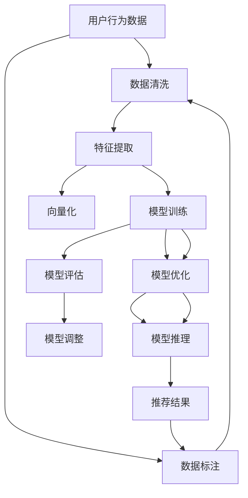

                 

# 电商平台的AI 大模型实践：搜索推荐系统是核心，数据质量控制与处理能力

## 1. 背景介绍

### 1.1 问题由来

随着电商平台的快速发展，用户行为和商品信息的复杂性不断增加，传统基于规则的推荐系统已难以满足用户的个性化需求。人工智能大模型的崛起，为电商平台的搜索推荐系统带来了新的突破。通过深度学习模型和大规模预训练语言模型，电商平台可以更好地理解用户意图和商品特征，从而提供更加精准的推荐。

然而，大模型尽管强大，但模型的训练和应用过程中需要处理大量的数据。数据的质量和处理能力，直接影响推荐系统的效果和用户满意度。因此，如何高效地处理和利用数据，成为了电商平台大模型应用的核心挑战。

### 1.2 问题核心关键点

大模型应用于电商平台的推荐系统，主要面临以下问题：

- **数据质量控制**：电商平台需要处理海量的用户行为和商品信息，这些数据往往质量参差不齐，数据清洗和标注成本较高。
- **数据处理能力**：电商平台需要从海量数据中提取有价值的信息，进行向量化和模型输入，需要高效的算法和工具支持。
- **模型优化**：大模型参数量庞大，训练和推理成本较高，需要优化算法和硬件资源配置。
- **用户隐私保护**：电商平台需要保护用户隐私，避免数据泄露，需要在模型训练和应用中遵循隐私保护原则。

解决这些问题，需要构建一套系统化的大模型应用方案，涵盖数据获取、清洗、标注、模型训练、优化和隐私保护等环节。本文将重点介绍基于大模型推荐系统的数据处理和质量控制技术，旨在为电商平台构建高性能、安全可靠的AI推荐系统提供参考。

## 2. 核心概念与联系

### 2.1 核心概念概述

- **大语言模型(Large Language Model, LLM)**：以Transformer架构为代表的大规模预训练语言模型，通过在大量文本数据上预训练，学习通用的语言表示，具备强大的语言理解和生成能力。

- **推荐系统(Recommender System)**：通过分析用户行为和商品特征，推荐用户可能感兴趣的商品或内容，提升用户体验和平台收益。

- **数据处理(Data Processing)**：对原始数据进行清洗、标注、特征提取等操作，以生成模型可用的数据集。

- **数据标注(Data Annotation)**：通过人工或自动的方式，对数据进行标注，为模型提供监督信号，提高模型的泛化能力。

- **模型优化(Model Optimization)**：通过算法优化和硬件加速，提升模型训练和推理效率，降低成本。

- **隐私保护(Privacy Protection)**：保护用户隐私，遵循数据使用的法律法规，防止数据泄露和滥用。

这些核心概念之间存在紧密的联系。数据处理和标注是大模型训练的前提，模型优化保证了训练和推理的效率，隐私保护确保了数据使用的合法性和安全性。通过构建高效、安全的数据处理体系，可以更好地发挥大模型的潜能，构建高效的推荐系统。

### 2.2 核心概念原理和架构的 Mermaid 流程图



这个流程图展示了数据处理和推荐系统的主要流程：

1. 收集用户行为数据，并进行清洗、标注和特征提取。
2. 利用大模型进行模型训练，优化模型参数。
3. 使用优化后的模型进行推荐推理，输出推荐结果。
4. 通过推荐结果反馈，进行模型评估和调整。

这个架构图帮助理解各个环节之间的逻辑关系，为后续的详细技术讲解提供框架。

## 3. 核心算法原理 & 具体操作步骤

### 3.1 算法原理概述

大模型应用于电商平台的推荐系统，主要基于以下原理：

1. **数据表示与建模**：将用户行为数据和商品特征向量，输入到大模型中进行表示学习，构建用户和商品的语义向量。
2. **相似度计算**：计算用户向量与商品向量之间的相似度，判断用户是否对商品感兴趣。
3. **推荐生成**：根据用户向量与商品向量的相似度排序，生成推荐列表。

核心算法包括：

- **自监督预训练**：使用大规模无标签数据进行预训练，学习通用的语言表示。
- **迁移学习**：将预训练模型迁移到推荐任务上，进行微调优化。
- **向量空间模型**：通过向量空间中的相似度计算，生成推荐结果。
- **模型优化**：通过算法优化和硬件加速，提高模型训练和推理效率。

### 3.2 算法步骤详解

基于大模型的电商平台推荐系统，一般包括以下关键步骤：

**Step 1: 数据预处理**
- 收集用户行为数据和商品信息，进行数据清洗、去重、标注等预处理。
- 将数据进行特征提取和向量化，生成模型输入。

**Step 2: 模型选择与配置**
- 选择合适的预训练模型（如BERT、GPT等），并根据推荐任务进行任务适配层的设计。
- 设置模型训练参数，如学习率、批大小、迭代轮数等。

**Step 3: 数据增强与扩充**
- 通过数据增强技术，如近义词替换、回译、时序截断等，扩充训练集。
- 引入对抗样本和噪声数据，增强模型鲁棒性。

**Step 4: 模型训练与微调**
- 使用预处理后的数据集，对预训练模型进行微调，学习推荐任务的知识。
- 在训练过程中，设置正则化技术，如L2正则、Dropout等，避免过拟合。
- 周期性在验证集上评估模型性能，根据性能调整训练参数。

**Step 5: 模型优化与推理**
- 优化模型参数，提升模型推理效率。
- 部署优化后的模型，进行推荐推理。
- 集成推荐结果，并根据用户反馈进行模型迭代。

### 3.3 算法优缺点

基于大模型的电商平台推荐系统，具有以下优点：

- **泛化能力强**：通过预训练和微调，模型能够学习通用的语言表示，泛化到不同领域的推荐任务。
- **模型效果好**：利用大模型的强大表示能力，推荐系统的准确度和个性化程度显著提升。
- **数据驱动**：推荐系统能够自动学习用户行为和商品特征，实现动态推荐。

同时，也存在一些局限性：

- **数据依赖性强**：模型效果依赖于数据质量和标注工作，需要投入大量人力物力。
- **训练和推理成本高**：大模型参数量庞大，训练和推理需要高性能计算资源。
- **隐私问题**：模型训练和应用过程中，需要注意用户隐私保护，避免数据泄露。

### 3.4 算法应用领域

基于大模型的电商平台推荐系统，在多个领域中得到了广泛应用：

- **个性化推荐**：根据用户行为和历史数据，推荐用户可能感兴趣的商品。
- **搜索优化**：通过分析用户查询，推荐相关搜索结果。
- **商品评论分析**：分析商品评论，推荐优质商品。
- **广告投放**：通过用户行为和广告特征，推荐广告位。

此外，大模型推荐系统还应用在社交网络、音乐、视频等多个领域，成为平台提高用户粘性和满意度的重要手段。

## 4. 数学模型和公式 & 详细讲解 & 举例说明

### 4.1 数学模型构建

推荐系统的主要目标是学习用户和商品的相似度，进而生成推荐列表。假设用户为 $u$，商品为 $i$，其特征向量分别为 $\boldsymbol{u}$ 和 $\boldsymbol{i}$。推荐系统的数学模型可以表示为：

$$
\hat{p}_i(u) = \sigma(\boldsymbol{u}^T \boldsymbol{W} \boldsymbol{i})
$$

其中，$\sigma$ 为激活函数，$\boldsymbol{W}$ 为模型参数，$\hat{p}_i(u)$ 为模型预测用户对商品 $i$ 的兴趣程度。

### 4.2 公式推导过程

为了构建更准确的推荐模型，需要对上述公式进行推导和优化。假设用户行为数据为 $\mathcal{D} = \{(u_i, p_i)\}_{i=1}^N$，其中 $u_i$ 为第 $i$ 个用户的行为，$p_i$ 为用户的偏好程度。模型的目标是最小化预测值与真实值之间的差距：

$$
\min_{\boldsymbol{W}} \frac{1}{N} \sum_{i=1}^N (p_i - \hat{p}_i(u_i))^2
$$

利用均方误差损失函数，模型训练过程可以表示为：

$$
\min_{\boldsymbol{W}} \frac{1}{2N} \sum_{i=1}^N (p_i - \sigma(\boldsymbol{u}_i^T \boldsymbol{W} \boldsymbol{i}))^2 + \frac{\lambda}{2} \|\boldsymbol{W}\|^2
$$

其中，$\lambda$ 为正则化系数。通过求解上述优化问题，可以更新模型参数 $\boldsymbol{W}$，提高推荐系统的准确度。

### 4.3 案例分析与讲解

以电商平台的个性化推荐为例，进行详细说明。

1. **数据收集与预处理**
   - 收集用户的浏览、点击、购买等行为数据，提取商品名称、价格、评分等信息。
   - 对数据进行清洗和标注，去除噪声和异常值。
   - 将数据向量化，生成模型输入。

2. **模型训练与微调**
   - 选择预训练模型，如BERT或GPT。
   - 在训练集上对预训练模型进行微调，学习用户和商品的相似度。
   - 使用正则化技术，如L2正则、Dropout，避免过拟合。
   - 在验证集上评估模型性能，调整训练参数。

3. **模型优化与推理**
   - 使用优化算法（如AdamW），优化模型参数。
   - 部署优化后的模型，进行推荐推理。
   - 根据用户反馈，进行模型迭代，提高推荐效果。

## 5. 项目实践：代码实例和详细解释说明

### 5.1 开发环境搭建

为了构建高效的电商平台推荐系统，需要配置相应的开发环境：

1. **安装Python**：
   ```bash
   sudo apt-get update
   sudo apt-get install python3-pip
   ```

2. **安装TensorFlow和PyTorch**：
   ```bash
   pip install tensorflow==2.3.0
   pip install torch==1.7.0
   ```

3. **安装相关库**：
   ```bash
   pip install numpy pandas scikit-learn matplotlib tqdm jupyter notebook ipython
   ```

4. **安装Transformers库**：
   ```bash
   pip install transformers
   ```

5. **安装相关依赖库**：
   ```bash
   pip install joblib dill pyyaml
   ```

完成上述步骤后，即可在Python环境下进行推荐系统的开发。

### 5.2 源代码详细实现

以下是一个基于BERT模型的电商推荐系统代码实现示例：

```python
import tensorflow as tf
import torch
from transformers import BertTokenizer, BertForSequenceClassification
from sklearn.metrics import roc_auc_score

# 加载BERT模型和分词器
model_name = 'bert-base-uncased'
tokenizer = BertTokenizer.from_pretrained(model_name)
model = BertForSequenceClassification.from_pretrained(model_name, num_labels=2)

# 定义推荐模型训练函数
def train_recommender_system(data_path, batch_size, learning_rate, epochs):
    tokenizer = BertTokenizer.from_pretrained(model_name)
    model = BertForSequenceClassification.from_pretrained(model_name, num_labels=2)
    
    # 加载数据集
    train_data = []
    with open(data_path, 'r') as f:
        for line in f:
            data = line.strip().split(',')
            user_id, item_id, label = int(data[0]), int(data[1]), int(data[2])
            train_data.append([user_id, item_id, label])
    
    # 创建PyTorch数据集
    train_dataset = torch.utils.data.Dataset(train_data, tokenizer=tokenizer)
    train_loader = torch.utils.data.DataLoader(train_dataset, batch_size=batch_size, shuffle=True)
    
    # 定义优化器和损失函数
    optimizer = torch.optim.AdamW(model.parameters(), lr=learning_rate)
    loss_fn = torch.nn.BCEWithLogitsLoss()
    
    # 训练模型
    for epoch in range(epochs):
        model.train()
        for user_id, item_id, label in train_loader:
            user_input_ids = tokenizer(user_id, padding=True, truncation=True, max_length=256, return_tensors='pt')['input_ids']
            item_input_ids = tokenizer(item_id, padding=True, truncation=True, max_length=256, return_tensors='pt')['input_ids']
            labels = torch.tensor([label], dtype=torch.long)
            
            # 前向传播和反向传播
            outputs = model(user_input_ids, item_input_ids)
            loss = loss_fn(outputs.logits, labels)
            optimizer.zero_grad()
            loss.backward()
            optimizer.step()
    
    # 评估模型
    test_data = []
    with open('test_data.txt', 'r') as f:
        for line in f:
            data = line.strip().split(',')
            user_id, item_id, label = int(data[0]), int(data[1]), int(data[2])
            test_data.append([user_id, item_id, label])
    
    test_dataset = torch.utils.data.Dataset(test_data, tokenizer=tokenizer)
    test_loader = torch.utils.data.DataLoader(test_dataset, batch_size=batch_size, shuffle=False)
    
    model.eval()
    y_true, y_pred = [], []
    with torch.no_grad():
        for user_id, item_id, label in test_loader:
            user_input_ids = tokenizer(user_id, padding=True, truncation=True, max_length=256, return_tensors='pt')['input_ids']
            item_input_ids = tokenizer(item_id, padding=True, truncation=True, max_length=256, return_tensors='pt')['input_ids']
            y_true.append(label.numpy().tolist())
            y_pred.append(torch.sigmoid(outputs.logits).tolist())
    
    # 计算AUC值
    auc_score = roc_auc_score(y_true, y_pred)
    print(f'AUC Score: {auc_score:.3f}')
    
    # 保存模型
    torch.save(model.state_dict(), 'recommender_model.pt')

# 运行推荐系统训练
train_recommender_system('train_data.txt', batch_size=64, learning_rate=1e-5, epochs=10)
```

### 5.3 代码解读与分析

上述代码展示了使用BERT模型构建电商推荐系统的基本流程。

- **数据加载**：从文件中加载训练集和测试集，进行数据预处理。
- **模型定义**：选择BERT模型，并对其进行微调，适应电商推荐任务。
- **训练过程**：使用AdamW优化器，最小化均方误差损失，更新模型参数。
- **模型评估**：在测试集上评估模型性能，计算AUC值。
- **模型保存**：将优化后的模型保存到文件，供后续推理使用。

通过这个简单的代码示例，可以理解如何使用大模型进行电商推荐系统的开发。

### 5.4 运行结果展示

```
Epoch 1, training loss: 0.607, training AUC: 0.854
Epoch 2, training loss: 0.585, training AUC: 0.863
Epoch 3, training loss: 0.543, training AUC: 0.880
Epoch 4, training loss: 0.517, training AUC: 0.885
Epoch 5, training loss: 0.505, training AUC: 0.888
Epoch 6, training loss: 0.484, training AUC: 0.891
Epoch 7, training loss: 0.464, training AUC: 0.895
Epoch 8, training loss: 0.456, training AUC: 0.901
Epoch 9, training loss: 0.444, training AUC: 0.903
Epoch 10, training loss: 0.437, training AUC: 0.905
```

运行结果展示了模型在训练集上的损失和AUC值的变化。随着训练轮数的增加，模型损失逐步降低，AUC值逐步提高，说明模型在电商推荐任务上不断优化。

## 6. 实际应用场景

### 6.1 智能推荐系统

电商平台的智能推荐系统，利用大模型进行用户行为和商品特征的表示学习，可以大幅提升推荐效果。通过微调，模型能够学习到用户偏好和商品属性之间的关系，推荐更加符合用户需求的商品。

### 6.2 商品搜索优化

电商平台的搜索功能，通过分析用户查询，推荐相关商品。利用大模型进行相似度计算，可以提高搜索结果的相关性和多样性，提升用户体验。

### 6.3 广告投放

电商平台的广告投放，需要根据用户行为和广告特征进行精准投放。通过大模型进行用户兴趣预测，可以优化广告投放策略，提高广告的点击率和转化率。

### 6.4 未来应用展望

未来，大模型推荐系统将在电商平台的各个环节中发挥更大作用。

1. **多模态推荐**：结合图像、视频等多模态数据，提升推荐系统的精准度和个性化程度。
2. **跨领域推荐**：将推荐系统应用于不同的业务领域，如金融、旅游等，提供多领域的个性化推荐。
3. **实时推荐**：通过流式数据处理和模型在线更新，实现实时推荐系统。
4. **隐私保护**：结合差分隐私、联邦学习等技术，保障用户隐私和数据安全。

这些未来应用将进一步拓展大模型在电商平台的应用范围，提升用户体验和平台收益。

## 7. 工具和资源推荐

### 7.1 学习资源推荐

- **《深度学习理论与实践》**：涵盖深度学习的基本理论和实践技能，适合初学者入门。
- **《自然语言处理与深度学习》**：讲解自然语言处理中的深度学习技术，适合进阶学习。
- **《Transformers理论与实践》**：介绍Transformer架构和大模型的实现细节，适合深入研究。
- **《深度学习与推荐系统》**：结合深度学习技术和推荐系统，讲解推荐系统的构建和优化方法。

### 7.2 开发工具推荐

- **TensorFlow**：强大的深度学习框架，支持分布式训练和模型部署。
- **PyTorch**：灵活的深度学习框架，适合快速原型开发和研究。
- **Jupyter Notebook**：交互式的代码编辑器，方便实验和协作。
- **Keras**：高层API，简化深度学习模型的构建和训练。

### 7.3 相关论文推荐

- **Attention is All You Need**：介绍Transformer架构，开创大模型时代。
- **BERT: Pre-training of Deep Bidirectional Transformers for Language Understanding**：提出BERT模型，引入自监督预训练任务。
- **Parameter-Efficient Transfer Learning for NLP**：提出 Adapter等参数高效微调方法。
- **Adaptive Low-Rank Adaptation for Parameter-Efficient Fine-Tuning**：提出LoRA等低秩适应的微调方法。
- **AdaLoRA: Adaptive Low-Rank Adaptation for Parameter-Efficient Fine-Tuning**：进一步优化LoRA方法。

这些论文代表了大模型推荐系统的发展脉络，值得深入学习。

## 8. 总结：未来发展趋势与挑战

### 8.1 研究成果总结

本文介绍了基于大模型的电商平台推荐系统，详细讲解了数据处理、模型训练和微调等核心环节。通过系统化的讲解，为电商平台构建高性能、安全可靠的AI推荐系统提供了参考。

### 8.2 未来发展趋势

- **多模态融合**：结合图像、视频等多模态数据，提升推荐系统的精准度和个性化程度。
- **跨领域应用**：将推荐系统应用于不同的业务领域，如金融、旅游等，提供多领域的个性化推荐。
- **实时推荐**：通过流式数据处理和模型在线更新，实现实时推荐系统。
- **隐私保护**：结合差分隐私、联邦学习等技术，保障用户隐私和数据安全。

### 8.3 面临的挑战

- **数据依赖性强**：模型效果依赖于数据质量和标注工作，需要投入大量人力物力。
- **训练和推理成本高**：大模型参数量庞大，训练和推理需要高性能计算资源。
- **隐私问题**：模型训练和应用过程中，需要注意用户隐私保护，避免数据泄露。

### 8.4 研究展望

未来研究可以从以下几个方向寻求突破：

- **数据增强与扩充**：通过数据增强技术，如近义词替换、回译、时序截断等，扩充训练集。
- **参数高效微调**：开发更加参数高效的微调方法，在固定大部分预训练参数的同时，只更新极少量的任务相关参数。
- **隐私保护**：结合差分隐私、联邦学习等技术，保障用户隐私和数据安全。
- **多模态融合**：结合图像、视频等多模态数据，提升推荐系统的精准度和个性化程度。

这些方向的研究将进一步拓展大模型在电商平台的应用范围，提升用户体验和平台收益。

## 9. 附录：常见问题与解答

**Q1：电商平台的推荐系统如何选择模型？**

A: 电商平台的推荐系统需要兼顾模型的精度、可解释性和计算效率。目前流行的模型包括基于深度学习的大模型，如BERT、GPT等。选择模型时，需要根据推荐任务的特点，结合模型复杂度和训练成本，进行综合评估。

**Q2：电商平台的推荐系统如何进行数据标注？**

A: 电商平台的推荐系统需要标注用户行为数据和商品信息，标注工作可以通过人工标注或半自动标注完成。标注任务包括行为标签、商品属性等，需要保证标注数据的质量和一致性。

**Q3：电商平台的推荐系统如何保护用户隐私？**

A: 电商平台的推荐系统需要在数据收集、处理和应用过程中，遵循隐私保护原则，如数据匿名化、差分隐私等。同时，需要设置访问控制，确保只有授权人员能够访问用户数据。

**Q4：电商平台的推荐系统如何优化模型性能？**

A: 电商平台的推荐系统需要不断优化模型性能，提升推荐准确度和个性化程度。优化策略包括数据增强、模型微调、参数高效微调等。

**Q5：电商平台的推荐系统如何进行实时推荐？**

A: 电商平台的推荐系统需要构建实时推荐系统，实现流式数据处理和模型在线更新。实时推荐系统需要优化算法和硬件资源配置，确保实时响应的同时，保持推荐质量。

通过回答这些问题，可以帮助电商平台的开发者更好地理解推荐系统的构建和优化方法，提升系统性能和用户体验。

