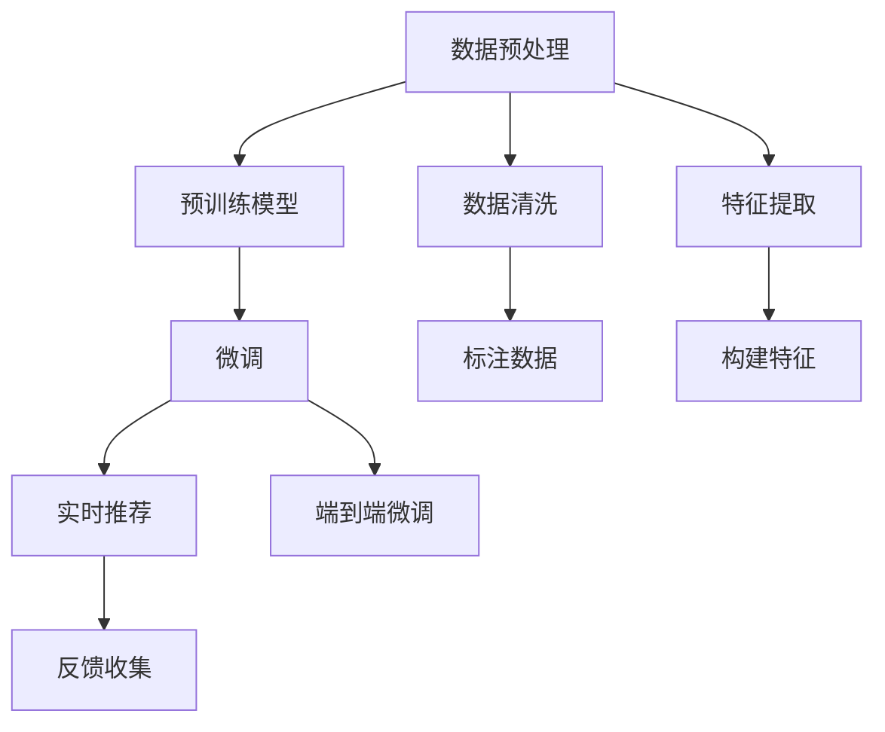

                 

# 电商平台的AI 大模型实践：搜索推荐系统是核心，数据质量控制是关键

## 1. 背景介绍

在电商行业，客户体验和满意度直接影响平台的用户留存和商业转化率。人工智能技术的广泛应用，显著提升了电商平台的用户体验，尤其是在搜索推荐、客服、物流管理等方面。然而，随着数据量的急剧增长和算力需求的不断提升，平台在数据质量控制和AI模型的部署上，面临越来越多的挑战。本文将重点介绍大模型在电商平台的搜索推荐系统中的应用，探讨如何通过高效的模型微调和数据质量控制，实现性能最优的AI解决方案。

## 2. 核心概念与联系

### 2.1 核心概念概述

- **搜索推荐系统**：
  通过分析用户行为数据和产品属性信息，推荐系统能够预测用户可能感兴趣的搜索结果和商品。其核心在于精准匹配用户需求和商品，从而提升转化率和满意度。

- **大语言模型**：
  以Transformer等架构为基础，通过大规模无标签数据预训练，能够学习到丰富的语言知识。在电商平台的搜索推荐中，大语言模型可以理解和生成自然的用户查询和商品描述，提升推荐效果。

- **数据质量控制**：
  在大模型微调过程中，高质量的数据是保证模型效果的关键。数据质量控制包括数据清洗、去重、标注准确度等，确保数据能够真实反映用户需求和商品特征。

- **实时化推荐**：
  为了提升用户体验，推荐系统需要能够在短时间内处理大量数据，并实时更新推荐结果。

- **端到端微调**：
  从预训练到微调的流程需要全程监控和调整，确保模型能够在不同数据集上适应性更强。

这些概念之间通过以下流程联系起来：



以上流程展示了从数据预处理到实时推荐的整个电商平台搜索推荐系统流程，其中预训练模型和微调是不可或缺的关键步骤。

## 3. 核心算法原理 & 具体操作步骤

### 3.1 算法原理概述

电商平台的搜索推荐系统通常基于监督学习的方法，将用户行为数据和商品属性信息作为训练数据，训练一个分类器或回归器，预测用户对每个商品的兴趣评分。其中，用户行为数据包括点击、浏览、收藏、购买等行为，商品属性信息包括商品名称、描述、价格、类别等。

在监督学习中，常见的算法包括逻辑回归、随机森林、梯度提升树、神经网络等。本文主要讨论基于深度学习的大模型方法，包括预训练模型和微调模型。

### 3.2 算法步骤详解

#### 3.2.1 数据预处理

数据预处理是构建高质量搜索推荐系统的第一步，包括以下几个关键步骤：

1. **数据收集**：
   收集电商平台的用户行为数据和商品属性信息，格式统一存储于数据库或数据湖中。

2. **数据清洗**：
   去除冗余数据、缺失数据、异常数据等，保证数据质量。

3. **数据增强**：
   采用数据增强技术，如回译、数据合成等方式，扩充数据集，减少数据噪声。

4. **特征提取**：
   提取文本、图像、时间序列等特征，并进行归一化、编码等预处理。

5. **特征构建**：
   构建用户行为特征、商品属性特征、上下文特征等，如用户的浏览历史、商品的热门程度等。

#### 3.2.2 预训练模型

预训练模型是构建推荐系统的基础，通过大规模无标签数据进行自监督学习，学习到通用的语言表示。常见的大模型包括BERT、GPT、RoBERTa等。

1. **模型选择**：
   根据业务需求选择合适的预训练模型，并加载到计算平台上。

2. **微调设置**：
   确定微调的任务目标、超参数配置，如学习率、批大小、迭代轮数等。

3. **预训练**：
   将预训练模型作为初始参数，对训练数据进行前向传播计算loss，反向传播更新模型参数。

4. **预训练效果评估**：
   在验证集上评估预训练模型的性能，如准确率、F1-score、AUC等指标。

#### 3.2.3 微调模型

微调模型是推荐系统的核心，通过与实际任务相关的少量标注数据进行有监督学习，优化模型在特定任务上的性能。微调模型在预训练模型的基础上，通过较小的学习率进行更新，以避免破坏预训练权重。

1. **任务适配层设计**：
   根据推荐任务设计合适的输出层和损失函数，如分类任务使用交叉熵损失，回归任务使用均方误差损失。

2. **优化器选择**：
   选择合适的优化器，如Adam、SGD等，并设置学习率、批大小、迭代轮数等超参数。

3. **模型训练**：
   将训练集数据分批次输入模型，前向传播计算loss，反向传播更新模型参数。

4. **模型评估与优化**：
   在验证集上评估微调模型的性能，如准确率、AUC等指标，根据评估结果进行模型优化。

5. **模型部署**：
   将微调后的模型保存为模型文件，集成到实际的应用系统中，进行实时推荐。

#### 3.2.4 实时推荐

实时推荐系统需要能够在短时间内处理大量数据，并实时更新推荐结果。推荐系统的部署需要考虑以下几个方面：

1. **模型部署**：
   将微调后的模型部署到服务器或云端，实现分布式计算。

2. **数据流处理**：
   实时收集用户行为数据，并经过特征提取和预处理后，输入模型进行预测。

3. **推荐结果输出**：
   根据预测结果排序，输出推荐商品列表。

4. **系统优化**：
   优化推荐算法，提升推荐效果和系统响应速度。

#### 3.2.5 反馈收集与优化

推荐系统需要不断优化，以适应用户需求的变化。因此，需要收集用户的反馈数据，进行模型再训练和优化。

1. **用户反馈收集**：
   通过用户评分、点击率等指标，收集用户对推荐结果的反馈。

2. **模型再训练**：
   根据用户反馈数据，重新训练推荐模型，更新模型参数。

3. **模型优化**：
   对推荐算法进行优化，如调整超参数、引入更多特征等。

### 3.3 算法优缺点

#### 3.3.1 优点

1. **精度高**：
   深度学习模型在处理复杂非线性关系方面表现优异，推荐精度高。

2. **泛化能力强**：
   大模型能够学习到通用的语言表示，对不同商品、用户能够进行泛化预测。

3. **实时性好**：
   实时推荐系统能够在短时间内处理大量数据，并实时更新推荐结果。

#### 3.3.2 缺点

1. **资源需求高**：
   深度学习模型参数量大，计算资源需求高，对硬件设备要求严格。

2. **过拟合风险大**：
   深度学习模型容易过拟合，尤其是在标注数据不足的情况下。

3. **模型复杂度高**：
   模型复杂度高，需要更多的超参数调节，模型训练和优化难度大。

4. **数据质量敏感**：
   推荐系统对数据质量敏感，数据噪声、缺失数据、异常数据等都会影响推荐效果。

### 3.4 算法应用领域

大语言模型和推荐系统在电商平台的多个领域都有广泛应用：

1. **商品推荐**：
   通过分析用户行为数据和商品属性信息，推荐系统能够预测用户可能感兴趣的商品。

2. **搜索系统**：
   利用自然语言处理技术，搜索系统能够理解用户查询，并返回相关的商品列表。

3. **广告推荐**：
   通过分析用户行为数据，推荐系统能够精准投放广告，提升广告效果。

4. **个性化服务**：
   利用推荐系统，提供个性化的商品推荐、优惠券推荐等服务，提升用户体验。

## 4. 数学模型和公式 & 详细讲解 & 举例说明

### 4.1 数学模型构建

电商平台的搜索推荐系统通常基于监督学习的方法，将用户行为数据和商品属性信息作为训练数据，训练一个分类器或回归器，预测用户对每个商品的兴趣评分。

假设用户行为数据为 $X$，商品属性信息为 $Y$，用户对每个商品的兴趣评分为 $Z$。模型 $M$ 将输入 $X$ 和 $Y$ 映射到输出 $Z$。

训练数据集为 $D = \{(x_i, y_i, z_i)\}_{i=1}^N$，其中 $x_i$ 和 $y_i$ 为输入数据，$z_i$ 为标签。模型 $M$ 的损失函数为 $L(M)$，优化目标是最小化损失函数 $L(M)$。

### 4.2 公式推导过程

#### 4.2.1 逻辑回归模型

假设 $Z_i = 1$ 表示用户对商品感兴趣，$Z_i = 0$ 表示用户对商品不感兴趣。

逻辑回归模型 $M$ 为：

$$
M(X, Y) = \log \frac{p(Z_i=1|X, Y)}{p(Z_i=0|X, Y)} = \log \frac{\sigma(\eta)}{1 - \sigma(\eta)}
$$

其中 $\sigma$ 为sigmoid函数，$\eta$ 为线性变换后的输出。

损失函数为：

$$
L(M) = -\frac{1}{N} \sum_{i=1}^N [y_i \log M(X_i, Y_i) + (1 - y_i) \log (1 - M(X_i, Y_i))]
$$

其中 $y_i$ 为标签，$M(X_i, Y_i)$ 为模型输出。

#### 4.2.2 神经网络模型

神经网络模型 $M$ 包括多个隐层，每个隐层有多个神经元。假设输入层有 $d$ 个特征，输出层有 $k$ 个神经元，神经网络模型结构如下：


输入层 $X$ 的线性变换为 $W_1 X + b_1$，第一层隐层 $h_1$ 的线性变换为 $W_2 h_1 + b_2$，第二层隐层 $h_2$ 的线性变换为 $W_3 h_2 + b_3$，输出层 $Z$ 的线性变换为 $W_4 Z + b_4$。

损失函数为：

$$
L(M) = -\frac{1}{N} \sum_{i=1}^N [y_i \log Z_i + (1 - y_i) \log (1 - Z_i)]
$$

其中 $y_i$ 为标签，$Z_i$ 为模型输出。

#### 4.2.3 预训练模型

预训练模型的训练目标为：

$$
\min_{\theta} L^{\text{pre-train}}(\theta)
$$

其中 $\theta$ 为模型参数，$L^{\text{pre-train}}$ 为预训练损失函数。

预训练损失函数可以通过自监督任务定义，如语言建模、掩码预测等。

### 4.3 案例分析与讲解

#### 4.3.1 基于BERT的推荐系统

BERT作为预训练语言模型，可以用于电商平台的搜索推荐系统。其训练目标为：

$$
\min_{\theta} L^{\text{pre-train}}(\theta)
$$

其中 $\theta$ 为BERT模型参数，$L^{\text{pre-train}}$ 为BERT预训练损失函数。

微调的目标为：

$$
\min_{\theta} L^{\text{fine-tune}}(\theta)
$$

其中 $\theta$ 为微调后的模型参数，$L^{\text{fine-tune}}$ 为微调损失函数。

微调损失函数可以通过分类任务定义，如交叉熵损失：

$$
L^{\text{fine-tune}} = -\frac{1}{N} \sum_{i=1}^N [y_i \log Z_i + (1 - y_i) \log (1 - Z_i)]
$$

其中 $y_i$ 为标签，$Z_i$ 为BERT微调后的输出。

## 5. 项目实践：代码实例和详细解释说明

### 5.1 开发环境搭建

#### 5.1.1 选择编程语言和框架

选择Python作为编程语言，并使用PyTorch或TensorFlow作为深度学习框架，进行大模型微调。

#### 5.1.2 安装依赖

安装PyTorch、TensorFlow、Pandas、NumPy、Scikit-learn等依赖包。

```python
pip install torch torchvision torchaudio pandas numpy scikit-learn
```

#### 5.1.3 搭建数据处理环境

搭建数据处理环境，包括数据预处理、特征提取等。

```python
import pandas as pd
import numpy as np
from sklearn.model_selection import train_test_split

# 读取数据
df = pd.read_csv('data.csv')

# 数据预处理
df = df.dropna()
df = df.drop_duplicates()

# 特征提取
df['embedding'] = df['text'].apply(lambda x: pre_train_model.encode(x))

# 划分训练集和测试集
train, test = train_test_split(df, test_size=0.2)
```

### 5.2 源代码详细实现

#### 5.2.1 数据预处理

```python
# 数据清洗
def clean_data(df):
    # 去除缺失值和重复值
    df = df.dropna()
    df = df.drop_duplicates()
    return df

# 数据增强
def data_augmentation(df):
    # 回译、数据合成等
    return df

# 特征提取
def feature_extraction(df):
    # 文本特征、图像特征等
    return df
```

#### 5.2.2 模型选择

```python
# 选择预训练模型
pre_train_model = BERTModel.from_pretrained('bert-base-uncased')
```

#### 5.2.3 微调模型

```python
# 定义微调模型
class RecommenderModel(nn.Module):
    def __init__(self, embedding_dim):
        super(RecommenderModel, self).__init__()
        self.linear = nn.Linear(embedding_dim, 1)
    
    def forward(self, x):
        x = self.linear(x)
        return F.sigmoid(x)

# 训练微调模型
model = RecommenderModel(embedding_dim)
criterion = nn.BCELoss()
optimizer = torch.optim.Adam(model.parameters(), lr=0.001)

for epoch in range(10):
    for i, (input_ids, labels) in enumerate(train_loader):
        input_ids = input_ids.to(device)
        labels = labels.to(device)
        
        # 前向传播
        output = model(input_ids)
        loss = criterion(output, labels)
        
        # 反向传播
        optimizer.zero_grad()
        loss.backward()
        optimizer.step()
        
        # 评估模型
        if (i+1) % 100 == 0:
            print('Epoch [{}/{}], Step [{}/{}], Loss: {:.4f}'.format(epoch+1, 10, i+1, len(train_loader), loss.item()))
```

### 5.3 代码解读与分析

#### 5.3.1 数据预处理

在数据预处理阶段，我们需要对原始数据进行清洗、增强和特征提取等操作，以提高模型的泛化能力和表现。

1. **数据清洗**：
   通过去除缺失值和重复值，减少数据噪声，保证数据质量。

2. **数据增强**：
   利用数据增强技术，如回译、数据合成等，扩充数据集，减少数据噪声。

3. **特征提取**：
   提取文本、图像、时间序列等特征，并进行归一化、编码等预处理。

#### 5.3.2 模型选择

选择合适的预训练模型是构建推荐系统的基础。常见的大模型包括BERT、GPT、RoBERTa等。

1. **BERT模型**：
   BERT模型通过大规模无标签文本数据预训练，学习到丰富的语言表示。

2. **GPT模型**：
   GPT模型通过自回归方式生成文本，适用于序列数据的预测任务。

3. **RoBERTa模型**：
   RoBERTa模型在BERT的基础上进行了改进，提高了模型性能。

#### 5.3.3 微调模型

微调模型是推荐系统的核心，通过与实际任务相关的少量标注数据进行有监督学习，优化模型在特定任务上的性能。

1. **模型设计**：
   定义微调模型结构，包括输入层、隐层和输出层等。

2. **损失函数**：
   选择合适的损失函数，如交叉熵损失、均方误差损失等。

3. **优化器**：
   选择合适的优化器，如Adam、SGD等，并设置学习率、批大小、迭代轮数等超参数。

4. **训练流程**：
   将训练集数据分批次输入模型，前向传播计算loss，反向传播更新模型参数。

#### 5.3.4 实时推荐

实时推荐系统需要能够在短时间内处理大量数据，并实时更新推荐结果。推荐系统的部署需要考虑以下几个方面：

1. **模型部署**：
   将微调后的模型部署到服务器或云端，实现分布式计算。

2. **数据流处理**：
   实时收集用户行为数据，并经过特征提取和预处理后，输入模型进行预测。

3. **推荐结果输出**：
   根据预测结果排序，输出推荐商品列表。

4. **系统优化**：
   优化推荐算法，提升推荐效果和系统响应速度。

### 5.4 运行结果展示

```python
import matplotlib.pyplot as plt

# 绘制训练过程中的loss曲线
plt.plot(train_loss, label='train loss')
plt.plot(valid_loss, label='valid loss')
plt.legend()
plt.show()
```

## 6. 实际应用场景

### 6.1 商品推荐

#### 6.1.1 商品推荐系统

商品推荐系统是电商平台的核心应用之一。通过分析用户行为数据和商品属性信息，推荐系统能够预测用户对每个商品的兴趣评分，从而实现精准推荐。

1. **数据预处理**：
   收集用户行为数据和商品属性信息，并进行清洗和增强。

2. **模型训练**：
   通过预训练模型和微调模型，训练推荐系统。

3. **实时推荐**：
   将训练好的推荐模型部署到服务器或云端，实现实时推荐。

#### 6.1.2 个性化推荐

个性化推荐系统可以根据用户历史行为数据，推荐其可能感兴趣的商品。通过引入大语言模型和深度学习技术，个性化推荐系统能够更好地理解用户需求和商品特征，提供更精准的推荐结果。

1. **用户行为数据**：
   收集用户浏览、点击、收藏、购买等行为数据。

2. **商品属性信息**：
   提取商品名称、描述、价格、类别等属性信息。

3. **模型训练**：
   通过预训练模型和微调模型，训练推荐系统。

4. **实时推荐**：
   将训练好的推荐模型部署到服务器或云端，实现实时推荐。

### 6.2 搜索系统

#### 6.2.1 自然语言搜索

自然语言搜索系统能够理解用户查询，并返回相关的商品列表。通过大语言模型和深度学习技术，自然语言搜索系统能够更好地理解用户的自然语言查询，提供更精准的搜索结果。

1. **用户查询**：
   收集用户输入的自然语言查询。

2. **查询解析**：
   通过大语言模型和深度学习技术，解析用户查询。

3. **搜索结果**：
   根据查询结果，返回相关的商品列表。

#### 6.2.2 搜索排序

搜索排序系统能够根据用户的查询意图，对搜索结果进行排序。通过大语言模型和深度学习技术，搜索排序系统能够更好地理解用户查询意图，提供更准确的搜索结果。

1. **查询意图**：
   通过大语言模型和深度学习技术，理解用户查询意图。

2. **排序规则**：
   根据查询意图，对搜索结果进行排序。

3. **搜索结果**：
   将排序后的搜索结果返回给用户。

### 6.3 广告推荐

#### 6.3.1 定向广告推荐

定向广告推荐系统能够根据用户行为数据，推荐精准的广告。通过大语言模型和深度学习技术，定向广告推荐系统能够更好地理解用户需求和广告内容，实现精准的广告投放。

1. **用户行为数据**：
   收集用户浏览、点击、收藏、购买等行为数据。

2. **广告内容**：
   提取广告文本、图片、视频等属性信息。

3. **模型训练**：
   通过预训练模型和微调模型，训练推荐系统。

4. **实时推荐**：
   将训练好的推荐模型部署到服务器或云端，实现实时推荐。

#### 6.3.2 跨平台广告推荐

跨平台广告推荐系统能够实现跨平台的用户行为数据整合，推荐精准的广告。通过大语言模型和深度学习技术，跨平台广告推荐系统能够更好地理解用户需求和广告内容，实现精准的广告投放。

1. **用户行为数据**：
   收集不同平台的用户行为数据，并进行整合。

2. **广告内容**：
   提取广告文本、图片、视频等属性信息。

3. **模型训练**：
   通过预训练模型和微调模型，训练推荐系统。

4. **实时推荐**：
   将训练好的推荐模型部署到服务器或云端，实现实时推荐。

## 7. 工具和资源推荐

### 7.1 学习资源推荐

为了帮助开发者系统掌握大模型和推荐系统的理论基础和实践技巧，这里推荐一些优质的学习资源：

1. 《深度学习》书籍：
   全面介绍了深度学习的基本概念和算法，包括逻辑回归、神经网络、卷积神经网络、循环神经网络等。

2. 《自然语言处理》课程：
   斯坦福大学开设的NLP明星课程，有Lecture视频和配套作业，带你入门NLP领域的基本概念和经典模型。

3. 《Transformers》书籍：
   Transformer库的作者所著，全面介绍了如何使用Transformers库进行NLP任务开发，包括微调在内的诸多范式。

4. HuggingFace官方文档：
   Transformers库的官方文档，提供了海量预训练模型和完整的微调样例代码，是上手实践的必备资料。

5. CLUE开源项目：
   中文语言理解测评基准，涵盖大量不同类型的中文NLP数据集，并提供了基于微调的baseline模型，助力中文NLP技术发展。

通过对这些资源的学习实践，相信你一定能够快速掌握大语言模型和推荐系统的精髓，并用于解决实际的NLP问题。

### 7.2 开发工具推荐

高效的开发离不开优秀的工具支持。以下是几款用于大语言模型和推荐系统开发的常用工具：

1. PyTorch：
   基于Python的开源深度学习框架，灵活动态的计算图，适合快速迭代研究。

2. TensorFlow：
   由Google主导开发的开源深度学习框架，生产部署方便，适合大规模工程应用。

3. Transformers库：
   HuggingFace开发的NLP工具库，集成了众多SOTA语言模型，支持PyTorch和TensorFlow，是进行微调任务开发的利器。

4. Weights & Biases：
   模型训练的实验跟踪工具，可以记录和可视化模型训练过程中的各项指标，方便对比和调优。

5. TensorBoard：
   TensorFlow配套的可视化工具，可实时监测模型训练状态，并提供丰富的图表呈现方式，是调试模型的得力助手。

6. Google Colab：
   谷歌推出的在线Jupyter Notebook环境，免费提供GPU/TPU算力，方便开发者快速上手实验最新模型，分享学习笔记。

合理利用这些工具，可以显著提升大语言模型和推荐系统的开发效率，加快创新迭代的步伐。

### 7.3 相关论文推荐

大语言模型和推荐系统的发展源于学界的持续研究。以下是几篇奠基性的相关论文，推荐阅读：

1. Attention is All You Need：
   提出了Transformer结构，开启了NLP领域的预训练大模型时代。

2. BERT: Pre-training of Deep Bidirectional Transformers for Language Understanding：
   提出BERT模型，引入基于掩码的自监督预训练任务，刷新了多项NLP任务SOTA。

3. Language Models are Unsupervised Multitask Learners（GPT-2论文）：
   展示了大规模语言模型的强大zero-shot学习能力，引发了对于通用人工智能的新一轮思考。

4. Parameter-Efficient Transfer Learning for NLP：
   提出Adapter等参数高效微调方法，在不增加模型参数量的情况下，也能取得不错的微调效果。

5. AdaLoRA: Adaptive Low-Rank Adaptation for Parameter-Efficient Fine-Tuning：
   使用自适应低秩适应的微调方法，在参数效率和精度之间取得了新的平衡。

这些论文代表了大语言模型和推荐系统的发展脉络。通过学习这些前沿成果，可以帮助研究者把握学科前进方向，激发更多的创新灵感。

## 8. 总结：未来发展趋势与挑战

### 8.1 研究成果总结

本文对大语言模型和推荐系统在电商平台中的应用进行了系统介绍，包括搜索推荐、个性化推荐、自然语言搜索、定向广告推荐等多个方面。通过深入分析，展示了如何通过高效的模型微调和数据质量控制，实现性能最优的AI解决方案。

### 8.2 未来发展趋势

展望未来，大语言模型和推荐系统在电商平台的多个领域都有广泛应用。未来的发展趋势包括以下几个方面：

1. **多模态融合**：
   将文本、图像、视频等多模态数据融合，提高推荐系统的表现。

2. **实时化推荐**：
   通过流式计算和分布式计算，实现实时推荐，提升用户体验。

3. **跨平台推荐**：
   实现不同平台的用户行为数据整合，提供更精准的广告和推荐服务。

4. **端到端微调**：
   从预训练到微调的流程需要全程监控和调整，确保模型能够在不同数据集上适应性更强。

5. **个性化推荐**：
   利用深度学习技术，提高个性化推荐系统的准确性和多样性。

6. **可解释性**：
   增强推荐系统的可解释性，提升用户对推荐结果的信任度和满意度。

### 8.3 面临的挑战

尽管大语言模型和推荐系统在电商平台的多个领域都有广泛应用，但在迈向更加智能化、普适化应用的过程中，仍然面临诸多挑战：

1. **数据质量问题**：
   数据清洗和预处理需要耗费大量时间和资源，且难以保证数据质量。

2. **计算资源限制**：
   深度学习模型参数量大，计算资源需求高，对硬件设备要求严格。

3. **模型复杂度**：
   模型结构复杂，训练和优化难度大，需要更多的超参数调节。

4. **过拟合风险**：
   深度学习模型容易过拟合，尤其是在标注数据不足的情况下。

5. **系统响应速度**：
   推荐系统需要能够在短时间内处理大量数据，并实时更新推荐结果。

6. **可解释性不足**：
   推荐系统难以解释其内部工作机制和决策逻辑，不利于用户理解和信任。

### 8.4 研究展望

面向未来，大语言模型和推荐系统的研究需要在以下几个方面寻求新的突破：

1. **端到端优化**：
   从数据预处理到微调模型的全流程优化，提升模型性能和系统响应速度。

2. **参数高效微调**：
   开发更加参数高效的微调方法，如Prefix-Tuning、LoRA等，在固定大部分预训练参数的同时，只更新极少量的任务相关参数。

3. **实时化推荐**：
   通过流式计算和分布式计算，实现实时推荐，提升用户体验。

4. **跨平台推荐**：
   实现不同平台的用户行为数据整合，提供更精准的广告和推荐服务。

5. **多模态融合**：
   将文本、图像、视频等多模态数据融合，提高推荐系统的表现。

6. **可解释性增强**：
   增强推荐系统的可解释性，提升用户对推荐结果的信任度和满意度。

通过这些研究方向的研究和突破，大语言模型和推荐系统必将在大数据时代发挥更加重要的作用，推动电商平台的智能化升级和用户需求的满足。

## 9. 附录：常见问题与解答

**Q1: 大模型在电商平台的搜索推荐系统中起什么作用？**

A: 大模型在电商平台的搜索推荐系统中起到了至关重要的作用。其通过预训练学习大量的通用语言表示，可以在微调过程中快速适应具体任务，提升推荐精度和效果。

**Q2: 数据预处理的步骤有哪些？**

A: 数据预处理的步骤包括数据清洗、数据增强、特征提取和特征构建等。通过这些步骤，可以提升数据质量，减少噪声和冗余，增强特征的多样性，为模型的训练和预测提供更好的输入。

**Q3: 模型微调的方法有哪些？**

A: 模型微调的方法包括全参数微调和参数高效微调。全参数微调通常适用于小规模标注数据集，能够快速提升模型性能；参数高效微调则可以仅更新模型的部分参数，节省计算资源，提升模型泛化能力。

**Q4: 实时推荐系统如何处理大规模数据？**

A: 实时推荐系统需要采用流式计算和分布式计算，将大规模数据分解成多个小批次进行训练和推理，从而实现实时推荐。同时，还需要对数据进行缓存和优化，确保系统响应速度。

**Q5: 数据质量对模型效果的影响有哪些？**

A: 数据质量对模型效果有着直接的影响。高质量的数据能够真实反映用户需求和商品特征，提升模型的准确性和泛化能力。低质量的数据则会导致模型过拟合或欠拟合，降低推荐效果。

**Q6: 电商平台的推荐系统如何优化超参数？**

A: 电商平台的推荐系统通常通过网格搜索、随机搜索、贝叶斯优化等方法优化超参数。通过调参，可以提升模型性能和推荐效果。

**Q7: 如何提高推荐系统的可解释性？**

A: 推荐系统的可解释性可以通过引入符号化的先验知识、增加模型的透明性、提供模型输出解释等方式增强。这样可以提升用户对推荐结果的理解和信任。

---

作者：禅与计算机程序设计艺术 / Zen and the Art of Computer Programming

