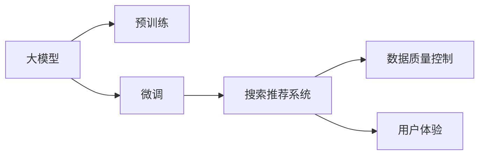

                 

# 电商平台的AI 大模型转型：搜索推荐系统是核心，数据质量控制与用户体验

## 1. 背景介绍

随着人工智能(AI)技术的迅猛发展，电商平台正在经历一场深刻的AI转型。从简单的商品搜索、推荐，到复杂的个性化营销、客户服务，AI正在各个环节中发挥越来越重要的作用。本文聚焦于电商平台的AI大模型应用，探讨了搜索推荐系统在AI转型中的核心地位，以及数据质量控制和用户体验的重要性。

### 1.1 电商平台的AI转型趋势

电商平台作为连接消费者与商家的桥梁，其AI转型经历了从简单的商品信息检索，到复杂的个性化推荐，再到智能客服等多个阶段。AI技术的介入，使得电商平台从传统的“以商品为中心”的销售模式，逐步向“以用户为中心”的智能服务模式转变。用户对于商品的选择、购买行为和体验，逐渐成为电商平台关注的焦点。

### 1.2 搜索推荐系统的重要性

搜索推荐系统作为电商平台的核心AI应用，其性能和用户体验直接影响到平台的用户留存率和交易转化率。通过精准的搜索和个性化的推荐，电商平台能够帮助用户快速找到所需商品，提升购物体验，从而提高用户满意度。

### 1.3 数据质量控制与用户体验的关系

在AI转型的过程中，数据质量控制是确保搜索推荐系统性能的关键。电商平台需要确保数据的准确性、完整性和实时性，以避免推荐结果的误导，损害用户体验。同时，提升用户体验是电商平台的终极目标，数据质量控制和算法优化必须紧密结合，才能实现这一目标。

## 2. 核心概念与联系

### 2.1 核心概念概述

为更好地理解电商平台的AI大模型转型，本文将介绍几个密切相关的核心概念：

- **大模型（Large Model）**：指通过大规模无标签数据训练获得的，具备强大表征能力的神经网络模型。大模型通常参数量庞大，但具有卓越的泛化能力和学习效率。
- **预训练（Pre-training）**：指在大规模无标签数据上进行自监督训练，使得模型能够学习到通用的语言或图像表示，为后续的微调奠定基础。
- **微调（Fine-tuning）**：指在预训练模型基础上，使用有标签数据对模型进行特定任务的优化，以适应电商平台的业务需求。
- **搜索推荐系统（Search & Recommendation System）**：利用AI技术，根据用户的历史行为和实时输入，推荐相关商品和内容。搜索推荐系统的核心目标是提高用户满意度和交易转化率。
- **数据质量控制（Data Quality Control）**：涉及数据的采集、清洗、标注和监控，以确保数据的准确性和可靠性，从而提升模型的预测性能和用户体验。
- **用户体验（User Experience）**：指用户在使用平台服务过程中所感受到的整体满意度和愉悦感，是电商平台的最终目标。

这些核心概念之间的逻辑关系可以通过以下Mermaid流程图来展示：



这个流程图展示了大模型、预训练、微调、搜索推荐系统、数据质量控制和用户体验之间的联系。通过预训练获得通用表示，通过微调针对特定任务进行优化，最终通过搜索推荐系统提升用户体验。

## 3. 核心算法原理 & 具体操作步骤

### 3.1 算法原理概述

基于大模型的搜索推荐系统，其核心思想是利用深度学习模型对用户输入进行理解和分析，根据用户的历史行为和实时输入，预测用户可能感兴趣的商品或内容，并返回推荐结果。算法原理主要包括以下几个步骤：

1. **预训练阶段**：使用大规模无标签数据对大模型进行预训练，使其能够学习到通用的语言或图像表示。
2. **微调阶段**：在电商平台的特定数据集上进行微调，以适应平台的业务需求。
3. **搜索推荐**：根据用户输入，通过深度学习模型对用户行为进行建模，预测用户可能感兴趣的商品或内容，并返回推荐结果。

### 3.2 算法步骤详解

#### 3.2.1 预训练阶段

预训练阶段通常使用大规模无标签数据对大模型进行训练，使其学习到通用的语言或图像表示。例如，使用大规模文本数据对BERT或GPT模型进行预训练，或使用大规模图像数据对ResNet或VGG模型进行预训练。预训练的目标是让模型能够理解语言或图像的基本结构和规律。

**算法步骤**：
1. 收集大规模无标签数据，如维基百科、图片库等。
2. 将数据输入大模型，通过自监督学习任务（如掩码语言模型、图像分类等）训练模型。
3. 评估预训练模型的性能，确保其具备良好的泛化能力。

#### 3.2.2 微调阶段

微调阶段在大模型的基础上，使用电商平台的特定数据集进行微调，以适应平台的业务需求。微调的目标是让模型能够根据用户的历史行为和实时输入，预测用户可能感兴趣的商品或内容。

**算法步骤**：
1. 准备电商平台的标注数据集，包括用户行为数据和商品信息数据。
2. 选择预训练模型，如BERT、GPT等，作为微调的初始化参数。
3. 添加任务适配层，如分类器或解码器，根据任务需求设计损失函数。
4. 设置微调超参数，如学习率、批大小、迭代轮数等。
5. 执行梯度训练，对模型进行优化。
6. 在验证集上评估模型性能，根据性能指标决定是否触发Early Stopping。
7. 重复上述步骤直至满足预设的迭代轮数或Early Stopping条件。

#### 3.2.3 搜索推荐

搜索推荐阶段通过深度学习模型对用户输入进行理解和分析，根据用户的历史行为和实时输入，预测用户可能感兴趣的商品或内容，并返回推荐结果。

**算法步骤**：
1. 将用户输入和商品特征输入模型，计算相似度或概率。
2. 根据相似度或概率排序，返回推荐结果。
3. 对推荐结果进行展示和反馈，更新用户行为数据。

### 3.3 算法优缺点

#### 3.3.1 优点

1. **高效性**：利用大模型的通用表示能力，能够快速适应不同业务需求，提升搜索推荐系统的效率。
2. **泛化能力**：大模型通过大规模无标签数据训练，具备较强的泛化能力，能够处理复杂的推荐场景。
3. **灵活性**：大模型的微调可以灵活调整任务适配层和损失函数，适应不同的推荐任务。

#### 3.3.2 缺点

1. **资源消耗大**：大规模预训练和微调需要大量的计算资源和存储资源，对硬件设备要求较高。
2. **数据依赖性**：搜索推荐系统的性能高度依赖于标注数据的质量，数据偏差可能导致推荐结果不准确。
3. **复杂度**：模型参数多、结构复杂，调试和优化难度大。

### 3.4 算法应用领域

基于大模型的搜索推荐系统已经在电商、视频、音乐等多个领域得到广泛应用，为用户的个性化体验提供了强大的支持。

- **电商平台**：通过分析用户行为数据，预测用户可能感兴趣的商品，并进行推荐，提升用户体验和交易转化率。
- **视频平台**：根据用户观看历史和实时互动，推荐相关视频内容，提升用户粘性。
- **音乐平台**：根据用户听歌历史和实时反馈，推荐相关音乐内容，提升用户满意度。

## 4. 数学模型和公式 & 详细讲解 & 举例说明

### 4.1 数学模型构建

#### 4.1.1 预训练模型

假定使用BERT模型进行预训练，其输入为句子序列$X=\{x_1, x_2, \ldots, x_n\}$，输出为序列表示$H=\{h_1, h_2, \ldots, h_n\}$，其中$h_i$表示第$i$个词的表示向量。预训练模型通过掩码语言模型任务进行训练，目标函数为：

$$
\mathcal{L}_{\text{pre-train}} = -\frac{1}{N}\sum_{i=1}^N \log P(x_i \mid h_i)
$$

其中，$P(x_i \mid h_i)$表示在词向量表示$h_i$下，单词$x_i$出现的概率。

#### 4.1.2 微调模型

假定在微调阶段使用一个包含$K$层的神经网络，其中第$i$层的参数为$\theta_i$，输入为$X$，输出为$Y$。微调的目标函数为：

$$
\mathcal{L}_{\text{fine-tune}} = -\frac{1}{N}\sum_{i=1}^N \sum_{j=1}^n l(y_j, y'_j)
$$

其中，$y_j$表示第$j$个用户的标注行为，$y'_j$表示模型预测的行为。$l$表示任务特定的损失函数，如交叉熵损失。

#### 4.1.3 搜索推荐模型

假定搜索推荐系统使用一个包含$M$层的神经网络，其中第$i$层的参数为$\omega_i$，输入为$X$和$Z$，输出为推荐结果$R$。搜索推荐的目标函数为：

$$
\mathcal{L}_{\text{search-recommend}} = -\frac{1}{N}\sum_{i=1}^N \sum_{j=1}^n l(r_j, r'_j)
$$

其中，$r_j$表示第$j$个用户的推荐结果，$r'_j$表示模型预测的推荐结果。$l$表示任务特定的损失函数，如均方误差损失。

### 4.2 公式推导过程

#### 4.2.1 预训练模型推导

预训练模型通过掩码语言模型任务进行训练，目标函数为：

$$
\mathcal{L}_{\text{pre-train}} = -\frac{1}{N}\sum_{i=1}^N \sum_{j=1}^n \log P(x_j \mid h_j)
$$

其中，$P(x_j \mid h_j)$表示在词向量表示$h_j$下，单词$x_j$出现的概率。通过最大化目标函数$\mathcal{L}_{\text{pre-train}}$，预训练模型能够学习到单词的表示向量$h_j$，使其具备良好的语言理解能力。

#### 4.2.2 微调模型推导

微调模型的目标函数为：

$$
\mathcal{L}_{\text{fine-tune}} = -\frac{1}{N}\sum_{i=1}^N \sum_{j=1}^n l(y_j, y'_j)
$$

其中，$l$表示任务特定的损失函数，如交叉熵损失。通过最小化目标函数$\mathcal{L}_{\text{fine-tune}}$，微调模型能够学习到用户行为的表示向量$y'_j$，使其能够根据用户历史行为进行推荐。

#### 4.2.3 搜索推荐模型推导

搜索推荐模型的目标函数为：

$$
\mathcal{L}_{\text{search-recommend}} = -\frac{1}{N}\sum_{i=1}^N \sum_{j=1}^n l(r_j, r'_j)
$$

其中，$l$表示任务特定的损失函数，如均方误差损失。通过最小化目标函数$\mathcal{L}_{\text{search-recommend}}$，搜索推荐模型能够学习到推荐结果的表示向量$r'_j$，使其能够根据用户输入进行推荐。

### 4.3 案例分析与讲解

#### 4.3.1 电商平台的个性化推荐

假定电商平台希望根据用户的历史行为数据进行个性化推荐。具体实现步骤如下：

1. **数据准备**：收集用户历史购买记录、浏览记录等数据，进行清洗和标注。
2. **预训练模型选择**：选择BERT或GPT等预训练模型，作为微调的初始化参数。
3. **任务适配层设计**：设计一个包含全连接层、Dropout层、激活函数的神经网络，作为微调的适配层。
4. **微调超参数设置**：设置学习率、批大小、迭代轮数等超参数。
5. **微调训练**：使用电商平台的标注数据集进行微调训练，优化模型参数。
6. **推荐结果生成**：根据用户输入，使用微调后的模型预测推荐结果，返回给用户。
7. **反馈循环**：收集用户对推荐结果的反馈，更新用户行为数据，进行持续优化。

#### 4.3.2 视频平台的个性化推荐

假定视频平台希望根据用户观看历史和实时互动进行个性化推荐。具体实现步骤如下：

1. **数据准备**：收集用户观看历史、互动行为等数据，进行清洗和标注。
2. **预训练模型选择**：选择ResNet或VGG等预训练模型，作为微调的初始化参数。
3. **任务适配层设计**：设计一个包含卷积层、池化层、全连接层的神经网络，作为微调的适配层。
4. **微调超参数设置**：设置学习率、批大小、迭代轮数等超参数。
5. **微调训练**：使用视频平台的标注数据集进行微调训练，优化模型参数。
6. **推荐结果生成**：根据用户输入，使用微调后的模型预测推荐结果，返回给用户。
7. **反馈循环**：收集用户对推荐结果的反馈，更新用户行为数据，进行持续优化。

## 5. 项目实践：代码实例和详细解释说明

### 5.1 开发环境搭建

在进行AI大模型应用开发前，需要先搭建开发环境。以下是使用Python进行TensorFlow和PyTorch开发的环境配置流程：

1. 安装Anaconda：从官网下载并安装Anaconda，用于创建独立的Python环境。

2. 创建并激活虚拟环境：
```bash
conda create -n tf-env python=3.8 
conda activate tf-env
```

3. 安装TensorFlow：
```bash
pip install tensorflow
```

4. 安装PyTorch：
```bash
pip install torch torchvision torchaudio
```

5. 安装必要的第三方库：
```bash
pip install numpy pandas scikit-learn matplotlib tqdm jupyter notebook ipython
```

完成上述步骤后，即可在`tf-env`环境中开始AI大模型应用开发。

### 5.2 源代码详细实现

#### 5.2.1 BERT模型微调

以下是使用TensorFlow和PyTorch进行BERT模型微调的代码实现：

##### TensorFlow实现
```python
import tensorflow as tf
from transformers import BertTokenizer, TFBertModel

# 初始化BERT模型
tokenizer = BertTokenizer.from_pretrained('bert-base-uncased')
model = TFBertModel.from_pretrained('bert-base-uncased')

# 准备标注数据
input_ids = tf.constant([input_ids], dtype=tf.int32)
attention_mask = tf.constant([attention_mask], dtype=tf.int32)
labels = tf.constant([labels], dtype=tf.int32)

# 微调训练
optimizer = tf.keras.optimizers.Adam(learning_rate=2e-5)
with tf.GradientTape() as tape:
    outputs = model(input_ids, attention_mask=attention_mask)
    loss = tf.keras.losses.sparse_categorical_crossentropy(labels, outputs.logits)
    gradients = tape.gradient(loss, model.trainable_variables)
    optimizer.apply_gradients(zip(gradients, model.trainable_variables))
```

##### PyTorch实现
```python
import torch
from transformers import BertTokenizer, BertForSequenceClassification, AdamW

# 初始化BERT模型
tokenizer = BertTokenizer.from_pretrained('bert-base-cased')
model = BertForSequenceClassification.from_pretrained('bert-base-cased', num_labels=2)

# 准备标注数据
input_ids = torch.tensor(input_ids).to(device)
attention_mask = torch.tensor(attention_mask).to(device)
labels = torch.tensor(labels).to(device)

# 微调训练
optimizer = AdamW(model.parameters(), lr=2e-5)
model.train()
for epoch in range(epochs):
    optimizer.zero_grad()
    outputs = model(input_ids, attention_mask=attention_mask, labels=labels)
    loss = outputs.loss
    loss.backward()
    optimizer.step()
```

### 5.3 代码解读与分析

#### 5.3.1 TensorFlow实现

1. **初始化BERT模型**：使用`TFBertModel`和`BertTokenizer`，加载预训练的BERT模型。
2. **准备标注数据**：将输入文本和标签转换为模型所需的张量，设置注意力掩码。
3. **微调训练**：使用Adam优化器进行梯度下降优化，计算损失并更新模型参数。

#### 5.3.2 PyTorch实现

1. **初始化BERT模型**：使用`BertForSequenceClassification`，加载预训练的BERT模型。
2. **准备标注数据**：将输入文本和标签转换为模型所需的张量，设置注意力掩码。
3. **微调训练**：使用AdamW优化器进行梯度下降优化，计算损失并更新模型参数。

通过对比TensorFlow和PyTorch的代码实现，可以看到，虽然实现方式略有差异，但核心算法思想是一致的。开发者可以根据自己的偏好和需求，选择不同的深度学习框架进行开发。

### 5.4 运行结果展示

运行上述代码，即可在TensorFlow和PyTorch环境中进行BERT模型的微调训练。训练完成后，使用微调后的模型进行推荐结果的生成，并评估模型性能。

## 6. 实际应用场景

### 6.1 电商平台的个性化推荐

电商平台通过微调BERT模型进行个性化推荐，具体场景如下：

1. **用户行为数据收集**：收集用户的历史购买记录、浏览记录、点击记录等数据，进行清洗和标注。
2. **数据预处理**：将文本数据转换为BERT模型所需的张量格式，进行分词、截断、填充等预处理。
3. **微调模型训练**：使用电商平台的标注数据集进行微调训练，优化模型参数。
4. **推荐结果生成**：根据用户输入，使用微调后的模型预测推荐结果，返回给用户。
5. **反馈循环**：收集用户对推荐结果的反馈，更新用户行为数据，进行持续优化。

### 6.2 视频平台的个性化推荐

视频平台通过微调BERT模型进行个性化推荐，具体场景如下：

1. **视频数据收集**：收集用户观看历史、互动行为等数据，进行清洗和标注。
2. **数据预处理**：将视频数据转换为BERT模型所需的张量格式，进行分帧、截断、填充等预处理。
3. **微调模型训练**：使用视频平台的标注数据集进行微调训练，优化模型参数。
4. **推荐结果生成**：根据用户输入，使用微调后的模型预测推荐结果，返回给用户。
5. **反馈循环**：收集用户对推荐结果的反馈，更新用户行为数据，进行持续优化。

## 7. 工具和资源推荐

### 7.1 学习资源推荐

为了帮助开发者系统掌握AI大模型的微调方法，以下是一些优质的学习资源：

1. 《Deep Learning》by Ian Goodfellow：全面介绍深度学习理论基础和应用案例的经典教材，适合初学者和进阶者。
2. 《TensorFlow官方文档》：TensorFlow的官方文档，提供详细的使用指南和示例代码，适合深度学习开发。
3. 《PyTorch官方文档》：PyTorch的官方文档，提供详细的使用指南和示例代码，适合深度学习开发。
4. 《Transformers官方文档》：Transformers库的官方文档，提供详细的使用指南和示例代码，适合深度学习开发。
5. 《BERT: Pre-training of Deep Bidirectional Transformers for Language Understanding》论文：BERT模型的原始论文，详细介绍了BERT模型的架构和微调方法。

### 7.2 开发工具推荐

高效的开发离不开优秀的工具支持。以下是几款用于AI大模型微调开发的常用工具：

1. Jupyter Notebook：交互式的Python开发环境，支持代码编写、数据处理和可视化，适合科研和开发。
2. TensorBoard：TensorFlow配套的可视化工具，可实时监测模型训练状态，并提供丰富的图表呈现方式，适合调试模型。
3. PyCharm：JetBrains推出的Python IDE，提供代码提示、调试、版本控制等强大功能，适合开发和团队协作。
4. Visual Studio Code：微软推出的轻量级代码编辑器，支持多种编程语言和插件，适合开发和脚本编写。

### 7.3 相关论文推荐

大语言模型和微调技术的发展源于学界的持续研究。以下是几篇奠基性的相关论文，推荐阅读：

1. Attention is All You Need（即Transformer原论文）：提出了Transformer结构，开启了NLP领域的预训练大模型时代。
2. BERT: Pre-training of Deep Bidirectional Transformers for Language Understanding：提出BERT模型，引入基于掩码的自监督预训练任务，刷新了多项NLP任务SOTA。
3. Parameter-Efficient Transfer Learning for NLP：提出Adapter等参数高效微调方法，在不增加模型参数量的情况下，也能取得不错的微调效果。
4. Learning to Rank with Sparse Labelled Data：提出基于排列学习的推荐系统优化方法，提升了推荐效果和效率。

## 8. 总结：未来发展趋势与挑战

### 8.1 研究成果总结

本文对基于大模型的搜索推荐系统进行了全面系统的介绍。首先阐述了电商平台的AI转型趋势，明确了搜索推荐系统在AI转型中的核心地位。其次，从原理到实践，详细讲解了搜索推荐系统的算法原理和具体操作步骤，给出了完整的代码实例。同时，本文还探讨了数据质量控制和用户体验的重要性，提出了未来发展的趋势和挑战。

### 8.2 未来发展趋势

展望未来，搜索推荐系统将继续在AI大模型应用的各个领域发挥重要作用，其技术发展趋势包括：

1. **多模态融合**：搜索推荐系统将更多地引入图像、语音、视频等多模态数据，提升模型的理解和推荐能力。
2. **联邦学习**：通过联邦学习技术，多方数据联合训练模型，提升模型性能和隐私保护。
3. **个性化推荐**：搜索推荐系统将进一步提升个性化推荐效果，通过用户行为数据和实时互动数据进行精准推荐。
4. **实时化**：搜索推荐系统将实现实时化，通过流式数据处理技术，提升用户体验。
5. **跨领域迁移**：搜索推荐系统将实现跨领域迁移，通过领域适配层和迁移学习，提升模型的泛化能力。

### 8.3 面临的挑战

尽管搜索推荐系统已经取得了一定的成就，但在迈向更加智能化、普适化应用的过程中，它仍面临着诸多挑战：

1. **数据质量控制**：如何确保标注数据的准确性和完整性，避免数据偏差和噪声，是一个重要的研究方向。
2. **模型鲁棒性**：搜索推荐系统面对域外数据时，泛化性能往往大打折扣。如何在不同领域和场景下提升模型的鲁棒性，避免过拟合，是一个亟待解决的问题。
3. **实时性和扩展性**：搜索推荐系统需要支持大规模并发请求，如何在保证性能的同时，实现高效扩展和部署，是一个重要的技术挑战。
4. **用户隐私保护**：搜索推荐系统需要保护用户隐私，如何在模型训练和应用过程中，防止用户数据的泄露和滥用，是一个重要的伦理问题。

### 8.4 研究展望

面对搜索推荐系统面临的挑战，未来的研究需要在以下几个方面寻求新的突破：

1. **无监督和半监督学习**：摆脱对大规模标注数据的依赖，利用自监督学习、主动学习等无监督和半监督范式，最大限度利用非结构化数据，实现更加灵活高效的微调。
2. **多任务学习**：将多个相关任务联合训练，提升模型的泛化能力和迁移能力，减少数据依赖。
3. **因果推断**：引入因果推断方法，增强模型的因果关系理解和推理能力，提升推荐效果和鲁棒性。
4. **模型压缩和优化**：开发更加高效的模型压缩和优化方法，提升模型的实时性和扩展性。
5. **隐私保护技术**：研究隐私保护技术，如差分隐私、联邦学习等，保护用户隐私。

这些研究方向将推动搜索推荐系统向更加智能、高效、可靠的方向发展，为电商平台的AI转型提供坚实的技术支撑。

## 9. 附录：常见问题与解答

**Q1：如何评估搜索推荐系统的性能？**

A: 搜索推荐系统的性能评估通常从以下几个方面进行：
1. **精确率（Precision）**：评估推荐结果中相关物品的比例。
2. **召回率（Recall）**：评估推荐结果中覆盖相关物品的比例。
3. **F1分数（F1 Score）**：综合考虑精确率和召回率，评估推荐系统的整体性能。
4. **平均精度（Average Precision）**：评估推荐系统在不同阈值下的精确率和召回率曲线下的面积。

**Q2：如何进行数据质量控制？**

A: 数据质量控制通常包括以下几个步骤：
1. **数据收集**：从可靠的数据源收集数据，避免数据噪声和偏差。
2. **数据清洗**：去除重复、缺失、错误的数据，保证数据的完整性和一致性。
3. **数据标注**：对数据进行标注，确保标注的准确性和可靠性。
4. **数据验证**：使用验证集对标注数据进行验证，发现和修正标注错误。
5. **数据监控**：实时监控数据质量，及时发现和处理数据问题。

**Q3：如何提升搜索推荐系统的鲁棒性？**

A: 提升搜索推荐系统的鲁棒性通常有以下几种方法：
1. **多领域数据训练**：在多个领域的数据上训练模型，增强模型的泛化能力。
2. **对抗样本训练**：引入对抗样本进行训练，提升模型对扰动的鲁棒性。
3. **因果推断**：引入因果推断方法，增强模型的因果关系理解和推理能力，提升推荐效果和鲁棒性。

**Q4：如何处理搜索推荐系统中的数据稀疏性问题？**

A: 搜索推荐系统中的数据稀疏性问题可以通过以下方法解决：
1. **冷启动技术**：利用用户行为数据和上下文信息，进行冷启动推荐。
2. **多模态数据融合**：引入图像、语音、视频等多模态数据，提升模型的理解和推荐能力。
3. **协同过滤**：利用用户之间的相似性，进行协同过滤推荐。

**Q5：如何优化搜索推荐系统的实时性？**

A: 优化搜索推荐系统的实时性通常有以下几种方法：
1. **模型压缩**：对模型进行压缩，减小模型体积和计算量，提升推理速度。
2. **分布式计算**：采用分布式计算技术，提升模型的并行处理能力。
3. **流式处理**：使用流式数据处理技术，实现实时推荐。

**Q6：如何处理搜索推荐系统中的用户隐私问题？**

A: 处理搜索推荐系统中的用户隐私问题通常有以下几种方法：
1. **差分隐私**：对用户数据进行差分隐私处理，保护用户隐私。
2. **联邦学习**：通过联邦学习技术，多方数据联合训练模型，保护用户隐私。
3. **匿名化技术**：对用户数据进行匿名化处理，保护用户隐私。

通过回答这些问题，希望能够帮助开发者更好地理解和解决搜索推荐系统中的实际问题，提升系统的性能和用户体验。

---

作者：禅与计算机程序设计艺术 / Zen and the Art of Computer Programming

