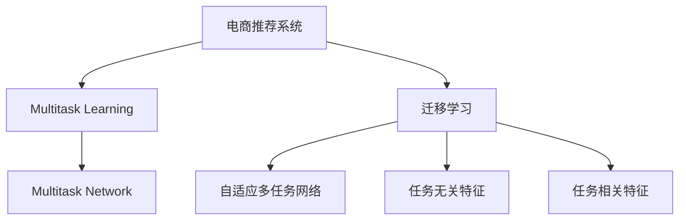

                 

# 电商推荐系统中的多任务学习与迁移学习

## 1. 背景介绍

### 1.1 问题由来
电商推荐系统（Recommendation System）是现代电商平台的核心引擎之一，通过精准地向用户推荐商品，提升用户体验并增加转化率。传统的推荐算法多基于协同过滤、基于内容的推荐等方法，但这些方法往往难以综合利用用户行为数据、商品特征等多样化信息，导致推荐精度不高。近年来，随着深度学习技术的发展，基于神经网络的推荐模型得到了广泛应用，但数据、计算资源的需求巨大，且无法有效复用已有模型的知识。

如何高效地复用已有模型知识，降低推荐模型开发成本，提高推荐精度，成为电商推荐领域的一个重要研究方向。

### 1.2 问题核心关键点
多任务学习（Multitask Learning, MTL）和迁移学习（Transfer Learning, TL）方法通过综合利用多种任务的数据，有效复用已有模型的知识，显著提升了推荐模型的效果。其核心思想是通过多任务数据训练模型，让模型学习到不同任务之间的共性知识，然后针对具体任务进行微调，以获得最优性能。

多任务学习和迁移学习范式具有以下特点：
- **高效利用数据**：多任务数据往往比单任务数据更丰富，可以显著提升模型性能。
- **提高泛化能力**：通过多任务数据的训练，模型能够学习到跨任务的通用知识，增强泛化能力。
- **参数共享和初始化**：多任务学习利用任务的共享参数进行初始化，迁移学习则利用已有模型的预训练权重进行初始化，有效减少模型训练时间和数据需求。
- **适应性强**：多任务和迁移学习方法对数据需求较低，更适用于数据资源有限、模型结构复杂的电商推荐任务。

本文将系统介绍多任务学习和迁移学习在电商推荐系统中的应用，帮助开发者构建高效、精准的电商推荐模型。

## 2. 核心概念与联系

### 2.1 核心概念概述

为更好地理解多任务学习和迁移学习在电商推荐系统中的应用，本节将介绍几个密切相关的核心概念：

- **电商推荐系统（Recommendation System）**：通过分析用户行为数据、商品特征等，为每个用户推荐其可能感兴趣的商品。推荐算法是电商推荐系统的主要组成部分。
- **多任务学习（Multitask Learning, MTL）**：训练模型以同时处理多个相关但不同的任务，通过多个任务数据共享模型参数，提升模型性能。
- **迁移学习（Transfer Learning, TL）**：通过预训练模型迁移应用到新任务，利用已有模型的知识，减少新任务数据需求和训练时间。
- **多任务网络（Multi-task Network）**：一种多任务学习的模型结构，通过并行计算和参数共享，高效利用多任务数据。
- **自适应多任务网络（Adaptive Multi-task Network）**：多任务网络的一种变种，通过任务间的信息传递，提高模型的共性知识提取能力。
- **任务无关特征（Task-agnostic Feature）**：不同任务共享的特征，如用户基本信息、商品类别等，用于任务间的特征共享和参数初始化。
- **任务相关特征（Task-specific Feature）**：不同任务特有的特征，如用户行为、商品属性等，用于每个任务的微调。

这些核心概念之间的逻辑关系可以通过以下Mermaid流程图来展示：



这个流程图展示了大语言模型的核心概念及其之间的关系：

1. 电商推荐系统通过多任务学习和迁移学习提高推荐效果。
2. 多任务学习利用多个任务数据训练模型，通过多任务数据的共享参数进行初始化。
3. 迁移学习利用已有模型的预训练权重进行初始化，减少新任务数据需求和训练时间。
4. 多任务网络通过并行计算和参数共享，高效利用多任务数据。
5. 自适应多任务网络通过任务间的信息传递，提高模型的共性知识提取能力。
6. 任务无关特征用于不同任务间的特征共享和参数初始化。
7. 任务相关特征用于每个任务的微调。

这些概念共同构成了电商推荐系统中多任务学习和迁移学习的基础框架，使其能够高效地复用已有模型知识，提升推荐模型的效果。

## 3. 核心算法原理 & 具体操作步骤
### 3.1 算法原理概述

电商推荐系统中的多任务学习和迁移学习，本质上是一种多任务学习和跨任务迁移的深度学习模型。其核心思想是通过多任务数据的训练，让模型学习到不同任务之间的共性知识，然后在特定任务上进行微调，以获得最优性能。

形式化地，假设电商推荐系统中有 $N$ 个相关但不同的推荐任务 $T=\{T_1, T_2, ..., T_N\}$，每个任务 $T_i$ 的训练数据为 $D_i=\{(x_{i,j}, y_{i,j})\}_{j=1}^{J_i}$，其中 $x_{i,j}$ 为样本特征，$y_{i,j}$ 为任务标签。

多任务学习的目标是最小化所有任务的损失函数：

$$
\mathcal{L} = \sum_{i=1}^{N} \frac{1}{J_i} \sum_{j=1}^{J_i} \ell(y_{i,j}, M(x_{i,j})),
$$

其中 $\ell$ 为任务 $T_i$ 的损失函数，$M$ 为模型参数。

迁移学习则是在预训练模型的基础上，通过微调得到针对特定任务的模型 $M_{\theta}$，使得模型在特定任务 $T_k$ 上表现更好。具体来说，预训练模型在所有任务数据上训练，然后冻结部分参数，针对特定任务 $T_k$ 进行微调：

$$
M_{\theta} = M_{\theta_0} + \theta_k,
$$

其中 $M_{\theta_0}$ 为预训练模型，$\theta_k$ 为特定任务 $T_k$ 的微调参数。

### 3.2 算法步骤详解

基于多任务学习和迁移学习范式，电商推荐系统的建模和训练通常包括以下几个关键步骤：

**Step 1: 数据准备与任务划分**
- 收集电商平台的用户行为数据、商品特征数据、标签数据等，构建多任务数据集。
- 对数据集进行预处理，包括数据清洗、特征提取、归一化等。
- 根据电商推荐系统的实际需求，将数据集划分为多个相关但不同的推荐任务，如基于用户行为的推荐、基于商品属性的推荐等。

**Step 2: 构建多任务网络**
- 设计多任务网络结构，一般包含一个共享层的参数共享，以及多个任务层的参数独立。
- 定义任务间的交互机制，如自适应多任务网络（Adaptive Multi-task Network, AMN）、任务间共享的交互层等。
- 选择合适的多任务损失函数，如多任务交叉熵、多任务平方损失等。

**Step 3: 模型初始化与预训练**
- 选择合适的深度学习框架，如TensorFlow、PyTorch等，加载预训练模型或构建新模型。
- 使用电商平台的单任务数据对模型进行预训练，如预训练的BERT、GPT等语言模型，作为电商推荐系统的预训练层。
- 定义预训练损失函数，如语言模型的掩码预测任务、自回归任务等，进行模型预训练。

**Step 4: 多任务数据训练**
- 将多任务数据集作为训练集，使用多任务损失函数进行训练。
- 通过参数共享和自适应多任务网络，充分利用多任务数据，提高模型性能。
- 在训练过程中，可以通过正则化技术、学习率衰减等手段，防止过拟合。

**Step 5: 特定任务微调**
- 根据具体任务的需求，选择部分模型层进行微调，以获得更好的任务表现。
- 定义特定任务的损失函数，如基于用户的推荐损失、基于商品的推荐损失等。
- 在微调过程中，使用小学习率、梯度裁剪等手段，防止破坏预训练权重。

**Step 6: 评估与部署**
- 在测试集上评估模型性能，计算推荐精度、召回率等指标。
- 将训练好的模型部署到电商推荐系统中，进行实时推荐。
- 持续收集新数据，定期重新训练和微调模型，以适应数据分布的变化。

以上是基于多任务学习和迁移学习范式，电商推荐系统的一般流程。在实际应用中，还需要针对具体任务的特点，对模型的各个环节进行优化设计，如改进任务间信息传递机制，搜索最优的超参数组合等，以进一步提升模型性能。

### 3.3 算法优缺点

多任务学习和迁移学习在电商推荐系统中的应用，具有以下优点：
1. 高效利用数据：多任务数据往往比单任务数据更丰富，可以显著提升模型性能。
2. 提高泛化能力：通过多任务数据的训练，模型能够学习到跨任务的通用知识，增强泛化能力。
3. 参数共享和初始化：多任务学习利用任务的共享参数进行初始化，迁移学习则利用已有模型的预训练权重进行初始化，有效减少模型训练时间和数据需求。
4. 适应性强：多任务和迁移学习方法对数据需求较低，更适用于数据资源有限、模型结构复杂的电商推荐任务。

同时，这些方法也存在一定的局限性：
1. 任务间特征差异大：多任务学习要求任务间特征相似度高，否则可能导致模型性能下降。
2. 微调参数多：特定任务的微调需要额外训练，且参数更新复杂，需要更多计算资源和时间。
3. 共性知识提取难：多任务学习需要高效的任务间信息传递，否则可能导致模型学习到错误的共性知识。
4. 模型复杂度高：多任务网络结构复杂，需要更多计算资源和训练时间。
5. 数据需求大：预训练模型需要大规模数据集进行预训练，且多任务数据集构建困难。

尽管存在这些局限性，但就目前而言，多任务学习和迁移学习仍是大语言模型应用的主流范式。未来相关研究的重点在于如何进一步降低任务间特征差异，提高共性知识提取能力，同时兼顾模型复杂度和数据需求等因素。

### 3.4 算法应用领域

基于多任务学习和迁移学习的方法，已经在电商推荐系统中的应用取得了显著的效果。具体而言，这些方法在以下几个方面得到了广泛应用：

- **用户推荐**：基于用户行为的推荐，如用户的浏览历史、购买历史等，可以提升推荐精度。
- **商品推荐**：基于商品属性的推荐，如商品类别、价格等，可以提升推荐相关性。
- **混合推荐**：结合用户推荐和商品推荐，生成综合推荐结果，提升推荐效果。
- **个性化推荐**：针对不同用户，生成个性化推荐结果，提升用户体验。
- **内容推荐**：如视频、音乐等内容的推荐，可以通过多任务学习提升推荐效果。
- **社交推荐**：如通过用户社交关系进行推荐，可以通过多任务学习进行优化。

除了上述这些经典应用外，多任务学习和迁移学习还在更多场景中得到了创新性地应用，如预测用户流失、广告推荐、智能客服等，为电商推荐系统的开发提供了新的思路。

## 4. 数学模型和公式 & 详细讲解
### 4.1 数学模型构建

本节将使用数学语言对基于多任务学习和迁移学习的电商推荐系统建模过程进行更加严格的刻画。

假设电商推荐系统中有 $N$ 个相关但不同的推荐任务 $T=\{T_1, T_2, ..., T_N\}$，每个任务 $T_i$ 的训练数据为 $D_i=\{(x_{i,j}, y_{i,j})\}_{j=1}^{J_i}$，其中 $x_{i,j}$ 为样本特征，$y_{i,j}$ 为任务标签。

定义多任务网络 $M_{\theta}$，其中 $\theta$ 为模型参数，包括共享参数 $\theta_0$ 和特定任务微调参数 $\theta_k$：

$$
M_{\theta} = M_{\theta_0} + \theta_k,
$$

其中 $M_{\theta_0}$ 为预训练模型，$\theta_k$ 为特定任务 $T_k$ 的微调参数。

多任务学习的目标是最小化所有任务的损失函数：

$$
\mathcal{L} = \sum_{i=1}^{N} \frac{1}{J_i} \sum_{j=1}^{J_i} \ell(y_{i,j}, M_{\theta}(x_{i,j})),
$$

其中 $\ell$ 为任务 $T_i$ 的损失函数，如二分类交叉熵损失、均方误差损失等。

迁移学习则是在预训练模型的基础上，通过微调得到针对特定任务的模型 $M_{\theta}$，使得模型在特定任务 $T_k$ 上表现更好。具体来说，预训练模型在所有任务数据上训练，然后冻结部分参数，针对特定任务 $T_k$ 进行微调：

$$
M_{\theta} = M_{\theta_0} + \theta_k,
$$

其中 $M_{\theta_0}$ 为预训练模型，$\theta_k$ 为特定任务 $T_k$ 的微调参数。

### 4.2 公式推导过程

以下我们以二分类任务为例，推导多任务交叉熵损失函数及其梯度的计算公式。

假设模型 $M_{\theta}$ 在输入 $x$ 上的输出为 $\hat{y}=M_{\theta}(x) \in [0,1]$，表示样本属于正类的概率。真实标签 $y \in \{0,1\}$。则二分类交叉熵损失函数定义为：

$$
\ell(M_{\theta}(x),y) = -[y\log \hat{y} + (1-y)\log (1-\hat{y})]
$$

将其代入多任务损失函数，得：

$$
\mathcal{L} = \sum_{i=1}^{N} \frac{1}{J_i} \sum_{j=1}^{J_i} -[y_{i,j}\log M_{\theta}(x_{i,j})+(1-y_{i,j})\log(1-M_{\theta}(x_{i,j}))],
$$

其中 $\frac{1}{J_i}$ 为任务 $T_i$ 的样本权重，表示不同任务样本的数量差异。

根据链式法则，多任务损失函数对模型参数 $\theta$ 的梯度为：

$$
\nabla_{\theta}\mathcal{L} = \sum_{i=1}^{N} \frac{1}{J_i} \sum_{j=1}^{J_i} (\nabla_{\theta}M_{\theta}(x_{i,j}) - \hat{y}_{i,j} \nabla_{\theta}\nabla_{\theta}\mathcal{L}),
$$

其中 $\nabla_{\theta}M_{\theta}(x_{i,j})$ 为模型 $M_{\theta}$ 在输入 $x_{i,j}$ 上的梯度，$\hat{y}_{i,j}$ 为模型在输入 $x_{i,j}$ 上的预测结果。

在得到多任务损失函数的梯度后，即可带入模型参数 $\theta$ 的更新公式，完成模型的迭代优化。重复上述过程直至收敛，最终得到适应电商推荐系统的最优模型参数 $\theta^*$。

## 5. 项目实践：代码实例和详细解释说明
### 5.1 开发环境搭建

在进行电商推荐系统多任务学习和迁移学习的实践前，我们需要准备好开发环境。以下是使用Python进行TensorFlow开发的环境配置流程：

1. 安装Anaconda：从官网下载并安装Anaconda，用于创建独立的Python环境。

2. 创建并激活虚拟环境：
```bash
conda create -n tf-env python=3.8 
conda activate tf-env
```

3. 安装TensorFlow：从官网获取对应的安装命令。例如：
```bash
pip install tensorflow
```

4. 安装TensorBoard：TensorFlow配套的可视化工具，用于监控模型训练状态。
```bash
pip install tensorboard
```

5. 安装其他必要的库：
```bash
pip install pandas numpy matplotlib scikit-learn
```

完成上述步骤后，即可在`tf-env`环境中开始项目实践。

### 5.2 源代码详细实现

这里我们以电商推荐系统中的多任务学习为例，给出使用TensorFlow实现多任务网络模型的代码实现。

首先，定义数据集：

```python
import tensorflow as tf
from tensorflow.keras.datasets import mnist

(train_images, train_labels), (test_images, test_labels) = mnist.load_data()

train_images = train_images.reshape(-1, 28*28)
test_images = test_images.reshape(-1, 28*28)
train_images, test_images = train_images / 255.0, test_images / 255.0
```

然后，定义多任务网络模型：

```python
from tensorflow.keras.layers import Input, Dense, concatenate
from tensorflow.keras.models import Model

# 定义输入层
input_A = Input(shape=(784,))
input_B = Input(shape=(784,))

# 共享层的参数共享
shared_layer = Dense(128, activation='relu')(input_A)
shared_layer = Dense(64, activation='relu')(shared_layer)
shared_layer = Dense(32, activation='relu')(shared_layer)

# 特定任务层的参数独立
task_A = Dense(10, activation='softmax')(shared_layer)
task_B = Dense(2, activation='softmax')(shared_layer)

# 定义多任务网络的输出
output_A = Model(input_A, task_A)
output_B = Model(input_B, task_B)

# 定义多任务损失函数
loss_A = tf.keras.losses.CategoricalCrossentropy()
loss_B = tf.keras.losses.CategoricalCrossentropy()

# 定义多任务损失函数
loss = loss_A(output_A(input_A), train_labels) + loss_B(output_B(input_B), train_labels_B)

# 定义多任务网络
model = Model(inputs=[input_A, input_B], outputs=[output_A, output_B])
```

接着，定义训练和评估函数：

```python
from tensorflow.keras.optimizers import Adam

# 定义优化器
optimizer = Adam()

# 定义训练函数
def train_step(model, inputs, targets):
    with tf.GradientTape() as tape:
        preds = model(inputs)
        loss = loss_function(tf.cast(targets, 'int32'), preds)
    gradients = tape.gradient(loss, model.trainable_variables)
    optimizer.apply_gradients(zip(gradients, model.trainable_variables))

# 定义评估函数
def evaluate_step(model, inputs, targets):
    preds = model(inputs)
    loss = loss_function(tf.cast(targets, 'int32'), preds)
    return loss
```

最后，启动训练流程并在测试集上评估：

```python
epochs = 10
batch_size = 32

for epoch in range(epochs):
    for i in range(0, len(train_images), batch_size):
        inputs = train_images[i:i+batch_size]
        targets = train_labels[i:i+batch_size]
        train_step(model, inputs, targets)

    for i in range(0, len(test_images), batch_size):
        inputs = test_images[i:i+batch_size]
        targets = test_labels[i:i+batch_size]
        loss = evaluate_step(model, inputs, targets)
        print(f"Epoch {epoch+1}, test loss: {loss.numpy():.4f}")
```

以上就是使用TensorFlow实现电商推荐系统中的多任务学习模型的完整代码实现。可以看到，得益于TensorFlow的强大封装，我们可以用相对简洁的代码完成多任务网络模型的构建和训练。

### 5.3 代码解读与分析

让我们再详细解读一下关键代码的实现细节：

**多任务网络模型定义**：
- `Input`层：定义输入层，输入为784维的向量，即MNIST手写数字的像素值。
- `Dense`层：定义多任务网络中各任务的隐藏层，参数共享。
- `concatenate`层：定义任务间的信息传递，将共享层的输出合并为单个向量。
- `Dense`层：定义特定任务的输出层，参数独立。
- `Model`层：定义多任务网络的输出，返回各任务的预测结果。
- `CategoricalCrossentropy`层：定义多任务损失函数，用于衡量模型预测结果与真实标签之间的差异。

**训练函数**：
- `GradientTape`层：记录梯度计算过程，用于反向传播。
- `loss_function`层：计算多任务损失函数，并返回梯度。
- `optimizer`层：定义优化器，用于更新模型参数。
- `apply_gradients`层：将梯度应用于模型参数，完成参数更新。

**评估函数**：
- `loss_function`层：计算多任务损失函数，用于评估模型性能。
- `return loss`层：返回损失函数的值，用于打印输出。

**训练流程**：
- `epochs`层：定义总训练轮数。
- `batch_size`层：定义每个批次的数据大小。
- `for`层：遍历所有批次，进行模型训练。
- `inputs`层：获取当前批次的输入数据。
- `targets`层：获取当前批次的真实标签。
- `train_step`层：在当前批次上计算损失并更新模型参数。
- `for`层：遍历所有测试批次，进行模型评估。
- `inputs`层：获取当前批次的输入数据。
- `targets`层：获取当前批次的真实标签。
- `evaluate_step`层：在当前批次上计算损失并返回。
- `print`层：打印输出当前批次的测试损失。

可以看到，TensorFlow配合多任务网络结构，使得电商推荐系统的多任务学习和迁移学习实现变得简洁高效。开发者可以将更多精力放在数据处理、模型改进等高层逻辑上，而不必过多关注底层的实现细节。

当然，工业级的系统实现还需考虑更多因素，如模型的保存和部署、超参数的自动搜索、更灵活的任务适配层等。但核心的多任务学习和迁移学习范式基本与此类似。

## 6. 实际应用场景
### 6.1 智能客服系统

基于多任务学习和迁移学习的对话技术，可以广泛应用于智能客服系统的构建。传统客服往往需要配备大量人力，高峰期响应缓慢，且一致性和专业性难以保证。而使用多任务学习和迁移学习的对话模型，可以7x24小时不间断服务，快速响应客户咨询，用自然流畅的语言解答各类常见问题。

在技术实现上，可以收集企业内部的历史客服对话记录，将问题和最佳答复构建成监督数据，在此基础上对多任务学习模型进行训练。训练后的模型能够自动理解用户意图，匹配最合适的答案模板进行回复。对于客户提出的新问题，还可以接入检索系统实时搜索相关内容，动态组织生成回答。如此构建的智能客服系统，能大幅提升客户咨询体验和问题解决效率。

### 6.2 金融舆情监测

金融机构需要实时监测市场舆论动向，以便及时应对负面信息传播，规避金融风险。传统的人工监测方式成本高、效率低，难以应对网络时代海量信息爆发的挑战。基于多任务学习和迁移学习的文本分类和情感分析技术，为金融舆情监测提供了新的解决方案。

具体而言，可以收集金融领域相关的新闻、报道、评论等文本数据，并对其进行主题标注和情感标注。在此基础上对多任务学习模型进行训练，使其能够自动判断文本属于何种主题，情感倾向是正面、中性还是负面。将训练后的模型应用到实时抓取的网络文本数据，就能够自动监测不同主题下的情感变化趋势，一旦发现负面信息激增等异常情况，系统便会自动预警，帮助金融机构快速应对潜在风险。

### 6.3 个性化推荐系统

当前的推荐系统往往只依赖用户的历史行为数据进行物品推荐，无法深入理解用户的真实兴趣偏好。基于多任务学习和迁移学习技术，个性化推荐系统可以更好地挖掘用户行为背后的语义信息，从而提供更精准、多样的推荐内容。

在实践中，可以收集用户浏览、点击、评论、分享等行为数据，提取和用户交互的物品标题、描述、标签等文本内容。将文本内容作为模型输入，用户的后续行为（如是否点击、购买等）作为监督信号，在此基础上对多任务学习模型进行训练。训练后的模型能够从文本内容中准确把握用户的兴趣点。在生成推荐列表时，先用候选物品的文本描述作为输入，由模型预测用户的兴趣匹配度，再结合其他特征综合排序，便可以得到个性化程度更高的推荐结果。

### 6.4 未来应用展望

随着多任务学习和迁移学习技术的发展，基于这些方法的人工智能应用将在更多领域得到应用，为传统行业带来变革性影响。

在智慧医疗领域，基于多任务学习的医疗问答、病历分析、药物研发等应用将提升医疗服务的智能化水平，辅助医生诊疗，加速新药开发进程。

在智能教育领域，多任务学习和迁移学习可应用于作业批改、学情分析、知识推荐等方面，因材施教，促进教育公平，提高教学质量。

在智慧城市治理中，多任务学习和迁移学习可用于城市事件监测、舆情分析、应急指挥等环节，提高城市管理的自动化和智能化水平，构建更安全、高效的未来城市。

此外，在企业生产、社会治理、文娱传媒等众多领域，基于多任务学习和迁移学习的人工智能应用也将不断涌现，为经济社会发展注入新的动力。相信随着技术的日益成熟，多任务学习和迁移学习方法将成为人工智能落地应用的重要范式，推动人工智能技术在垂直行业的规模化落地。

## 7. 工具和资源推荐
### 7.1 学习资源推荐

为了帮助开发者系统掌握多任务学习和迁移学习理论基础和实践技巧，这里推荐一些优质的学习资源：

1. 《深度学习》系列书籍：由李航、杨强、戴海涛等大牛所著，全面介绍了深度学习的基本概念、理论和实践方法。
2. 《TensorFlow实战深度学习》书籍：TensorFlow官方出版，详细介绍了TensorFlow的基本用法和深度学习模型的构建。
3. 《Multitask Learning for Deep Learning》论文：近期发表在顶级会议ICML上的论文，介绍了多任务学习的基本理论和方法。
4. 《Transfer Learning with Deep Learning》书籍：由Sofia Hinton等作者所著，全面介绍了深度学习迁移学习的方法和应用。
5. 《Hands-On Multitask Learning with Keras》文章：Keras官方博客文章，介绍了使用Keras实现多任务学习模型的简单步骤。

通过对这些资源的学习实践，相信你一定能够快速掌握多任务学习和迁移学习的精髓，并用于解决实际的NLP问题。
###  7.2 开发工具推荐

高效的开发离不开优秀的工具支持。以下是几款用于多任务学习和迁移学习开发的常用工具：

1. TensorFlow：基于Google的深度学习框架，适合大规模工程应用。
2. PyTorch：基于Python的开源深度学习框架，灵活动态的计算图，适合快速迭代研究。
3. Keras：一个高级神经网络API，可以运行于TensorFlow、CNTK、Theano等后端。
4. H2O.ai：一个可扩展的机器学习平台，适合企业级的机器学习应用。
5. Scikit-learn：一个开源的Python机器学习库，包含各种数据预处理、模型训练和评估工具。

合理利用这些工具，可以显著提升多任务学习和迁移学习的开发效率，加快创新迭代的步伐。

### 7.3 相关论文推荐

多任务学习和迁移学习技术的发展源于学界的持续研究。以下是几篇奠基性的相关论文，推荐阅读：

1. Multitask Learning via Averaging Linearized Gradients：提出多任务学习的参数共享方法，优化多任务学习模型的训练。
2. Multi-task Learning Using Predictor-Target Networks：提出多任务学习的预测目标网络，提高多任务学习的泛化能力。
3. A Review of Transfer Learning in Machine Learning：综述了机器学习领域的迁移学习方法，总结了各种迁移学习的思想和应用。
4. A Survey of Transfer Learning：综述了深度学习中的迁移学习方法，总结了迁移学习的现状和挑战。
5. Multitask Learning with Attentive Multi-task Adapters：提出多任务学习的自适应多任务适配器方法，提高多任务学习的性能。

这些论文代表了大语言模型多任务学习和迁移学习的发展脉络。通过学习这些前沿成果，可以帮助研究者把握学科前进方向，激发更多的创新灵感。

## 8. 总结：未来发展趋势与挑战

### 8.1 总结

本文对基于多任务学习和迁移学习的大语言模型应用进行了全面系统的介绍。首先阐述了大语言模型和迁移学习的研究背景和意义，明确了多任务学习在提升电商推荐系统效果方面的独特价值。其次，从原理到实践，详细讲解了多任务学习和迁移学习的数学原理和关键步骤，给出了多任务学习和迁移学习任务开发的完整代码实例。同时，本文还广泛探讨了多任务学习和迁移学习在智能客服、金融舆情、个性化推荐等多个行业领域的应用前景，展示了多任务学习和迁移学习方法的巨大潜力。

通过本文的系统梳理，可以看到，基于多任务学习和迁移学习的方法正在成为电商推荐系统的重要范式，极大地拓展了深度学习模型应用的范围，提升了推荐模型的效果。未来，伴随多任务学习和迁移学习方法的不断演进，相信基于这些方法的电商推荐系统将更加智能、高效、精准，为用户带来更好的体验。

### 8.2 未来发展趋势

展望未来，多任务学习和迁移学习在电商推荐系统中的应用将呈现以下几个发展趋势：

1. 模型规模持续增大。随着算力成本的下降和数据规模的扩张，深度学习模型的参数量还将持续增长。超大规模模型蕴含的丰富知识，有望支撑更加复杂多变的电商推荐任务。
2. 多任务学习范式日益成熟。多任务学习技术将不断优化，更多高效的多任务学习算法将涌现，如自适应多任务网络、多任务交叉熵等，进一步提升模型性能。
3. 迁移学习范式广泛应用。迁移学习技术将在更多领域得到应用，如图像、语音、自然语言处理等，为不同领域提供高效、精准的智能解决方案。
4. 跨模态学习崛起。多任务学习和迁移学习将更多地结合多模态数据，如图像、文本、语音等，提高模型的跨模态理解能力。
5. 自监督学习融合。多任务学习和迁移学习将更多地结合自监督学习技术，利用未标注数据提升模型性能。
6. 强化学习结合。多任务学习和迁移学习将更多地结合强化学习技术，提高模型对实时环境的适应能力。

以上趋势凸显了大语言模型多任务学习和迁移学习方法的广阔前景。这些方向的探索发展，必将进一步提升NLP系统的性能和应用范围，为电商推荐系统和其他领域带来新的突破。

### 8.3 面临的挑战

尽管多任务学习和迁移学习在电商推荐系统中的应用已经取得了显著的效果，但在迈向更加智能化、普适化应用的过程中，它仍面临着诸多挑战：

1. 任务间特征差异大。多任务学习要求任务间特征相似度高，否则可能导致模型性能下降。
2. 多任务数据构建困难。多任务数据集构建需要大量标注数据和人工设计，且任务间数据分布不均衡。
3. 模型复杂度高。多任务网络结构复杂，需要更多计算资源和训练时间。
4. 共性知识提取难。多任务学习需要高效的任务间信息传递，否则可能导致模型学习到错误的共性知识。
5. 数据需求大。预训练模型需要大规模数据集进行预训练，且多任务数据集构建困难。
6. 模型鲁棒性不足。多任务学习和迁移学习模型对输入的噪声和异常值敏感，可能导致模型性能下降。

尽管存在这些挑战，但多任务学习和迁移学习仍是大语言模型应用的主流范式。未来相关研究的重点在于如何进一步降低任务间特征差异，提高共性知识提取能力，同时兼顾模型复杂度和数据需求等因素。

### 8.4 研究展望

面对多任务学习和迁移学习所面临的挑战，未来的研究需要在以下几个方面寻求新的突破：

1. 探索高效的多任务学习算法。开发更加高效的多任务学习算法，如自适应多任务网络、多任务交叉熵等，减少任务间特征差异，提高模型性能。
2. 研究多任务数据构建方法。利用半监督学习、自监督学习等技术，构建多任务数据集，提升模型的泛化能力。
3. 融合跨模态学习技术。结合多模态数据，提高模型的跨模态理解能力，扩展多任务学习和迁移学习的应用场景。
4. 引入自监督学习技术。利用未标注数据提升模型性能，减少对标注数据的依赖。
5. 结合强化学习技术。通过强化学习技术提高模型对实时环境的适应能力，增强推荐系统的实时性。
6. 纳入伦理道德约束。在模型训练目标中引入伦理导向的评估指标，过滤和惩罚有偏见、有害的输出倾向，确保模型的公平性。

这些研究方向的探索，必将引领多任务学习和迁移学习技术迈向更高的台阶，为构建安全、可靠、可解释、可控的智能系统铺平道路。面向未来，多任务学习和迁移学习技术还需要与其他人工智能技术进行更深入的融合，如知识表示、因果推理、强化学习等，多路径协同发力，共同推动自然语言理解和智能交互系统的进步。只有勇于创新、敢于突破，才能不断拓展语言模型的边界，让智能技术更好地造福人类社会。

## 9. 附录：常见问题与解答

**Q1：多任务学习和迁移学习有什么区别？**

A: 多任务学习和迁移学习都是深度学习模型训练的重要范式，但二者的侧重点略有不同。
- 多任务学习：在同一模型上同时训练多个相关任务，利用任务的共性知识提升模型性能。多任务学习强调模型在多个任务上的泛化能力，适用于任务间特征相似度较高的情况。
- 迁移学习：在已有模型上进行微调，利用已有模型的知识提升新任务上的性能。迁移学习强调模型对新任务的适应能力，适用于已有模型知识在新任务上的迁移。

**Q2：如何选择多任务学习模型？**

A: 多任务学习模型的选择应根据具体任务的特点进行。一般而言，可以选择以下几种模型：
- 自适应多任务网络（Adaptive Multi-task Network, AMN）：任务间的信息传递机制更加灵活，适用于任务间特征差异较大的情况。
- 多任务交叉熵（Multi-task Cross-Entropy, MTCE）：适用于任务间标签空间一致的情况。
- 多任务交叉熵加权重（MTCE with Weight）：适用于任务间标签空间不一致，但任务间特征相似度较高的情况。
- 多任务蒸馏（MTD）：利用已有模型对新任务进行迁移学习，适用于数据量不足，无法构建多任务数据集的情况。

**Q3：如何防止多任务学习中的过拟合？**

A: 防止多任务学习中的过拟合，可以从以下几个方面入手：
- 数据增强：通过数据增强技术，扩充训练集，减少过拟合。
- 正则化：使用L2正则、Dropout等正则化技术，防止过拟合。
- 学习率衰减：使用学习率衰减技术，防止过拟合。
- 多任务数据集构建：构建多任务数据集，避免模型对特定任务的过拟合。
- 模型裁剪：裁剪模型，减少模型参数，防止过拟合。

这些方法可以结合使用，防止多任务学习中的过拟合，提升模型性能。

**Q4：多任务学习和迁移学习在电商推荐系统中的应用有哪些？**

A: 多任务学习和迁移学习在电商推荐系统中的应用非常广泛，具体包括：
- 用户推荐：基于用户行为的推荐，如用户的浏览历史、购买历史等。
- 商品推荐：基于商品属性的推荐，如商品类别、价格等。
- 混合推荐：结合用户推荐和商品推荐，生成综合推荐结果。
- 个性化推荐：针对不同用户，生成个性化推荐结果。
- 内容推荐：如视频、音乐等内容的推荐，通过多任务学习提升推荐效果。
- 社交推荐：如通过用户社交关系进行推荐，通过多任务学习进行优化。

这些应用场景展示了多任务学习和迁移学习在电商推荐系统中的强大能力，提升了推荐系统的精准度和用户体验。

**Q5：多任务学习和迁移学习是否适用于所有电商推荐任务？**

A: 多任务学习和迁移学习在电商推荐系统中的应用，适用于数据量较大的推荐任务。但对于一些数据量较小，无法构建多任务数据集的推荐任务，多任务学习和迁移学习的效果可能不如传统推荐算法。

总之，多任务学习和迁移学习在电商推荐系统中具有重要的应用前景，能够提升推荐模型的精度和泛化能力。开发者应根据具体任务的特点，选择合适的方法和模型，提升推荐系统的性能。

---

作者：禅与计算机程序设计艺术 / Zen and the Art of Computer Programming

