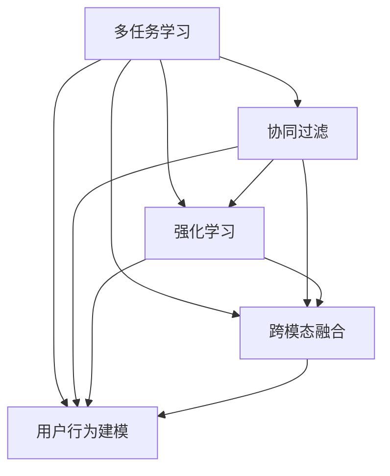

                 

# 电商推荐系统中的多任务学习框架

> 关键词：多任务学习, 电商推荐系统, 深度学习, 协同过滤, 强化学习, 用户行为建模, 跨模态融合

## 1. 背景介绍

### 1.1 问题由来

在电商推荐系统中，如何为用户推荐最合适的商品，是一个经典且复杂的问题。传统的推荐系统通常采用基于协同过滤和内容匹配的方法，但面临诸多局限：

- 数据稀疏性：用户-商品评分矩阵往往非常稀疏，难以捕捉用户真实偏好。
- 用户行为变化：用户偏好随时间变化，推荐模型难以适应。
- 商品多样性：商品种类繁多，冷门商品难以获得足够曝光。
- 个性化需求：不同用户有不同需求，个性化推荐挑战巨大。

为了解决这些问题，研究者们引入了深度学习和多任务学习（Multi-task Learning, MTL）的方法，希望通过多任务协同学习，提高推荐系统的效果。多任务学习利用共享的知识、特征和结构，提升模型泛化能力和迁移学习能力，有望应对电商推荐系统中的复杂需求。

### 1.2 问题核心关键点

电商推荐系统中的多任务学习框架，旨在通过同时优化多个相关的任务，共享中间知识和参数，实现更好的推荐效果。其核心点包括：

- **多任务优化目标**：定义多个相互关联的优化目标，如点击率预测、转化率预测等。
- **共享特征**：利用共享的特征表示，减少模型复杂度，提升泛化能力。
- **结构化参数**：设计有结构的模型参数，通过分割参数向量，实现不同任务之间的灵活组合。
- **协同训练**：通过联合训练不同任务，共享优化信号，提高模型的联合性能。

这些关键点将帮助电商推荐系统在多个任务上获得性能提升，同时避免过拟合，提升模型泛化能力和迁移学习能力。

## 2. 核心概念与联系

### 2.1 核心概念概述

电商推荐系统中的多任务学习框架，通过同时优化多个相关任务，共享中间知识和参数，提升模型的泛化能力和迁移学习能力。其核心概念包括：

- **多任务学习**：在多个相关任务间共享知识，提升模型泛化能力和迁移学习能力。
- **协同过滤**：利用用户行为和商品特征进行推荐。
- **强化学习**：通过用户行为反馈，不断调整推荐策略。
- **跨模态融合**：将文本、图像、语音等多种数据模态融合，提升推荐系统表现。
- **用户行为建模**：通过历史行为数据，构建用户兴趣和商品属性之间的关联。

这些概念之间存在紧密的联系，通过多任务学习框架将这些技术有机结合，可以构建更加高效、智能的电商推荐系统。

### 2.2 核心概念原理和架构的 Mermaid 流程图



这个流程图展示了多任务学习框架中各个关键概念之间的关系。通过多任务学习，协同过滤、强化学习、跨模态融合和用户行为建模技术相互配合，形成电商推荐系统的完整架构。

## 3. 核心算法原理 & 具体操作步骤

### 3.1 算法原理概述

电商推荐系统中的多任务学习框架，主要基于深度学习模型，通过优化多个相关任务，共享特征和结构，实现更好的推荐效果。核心算法包括：

- **多任务优化目标**：定义多个任务，如点击率预测、转化率预测、满意度评分等。
- **共享特征**：利用共享的特征表示，减少模型复杂度，提升泛化能力。
- **结构化参数**：设计有结构的模型参数，通过分割参数向量，实现不同任务之间的灵活组合。
- **协同训练**：通过联合训练不同任务，共享优化信号，提高模型的联合性能。

### 3.2 算法步骤详解

基于深度学习的多任务学习框架通常包括以下步骤：

**Step 1: 数据准备与预处理**
- 收集电商平台的各项数据，如用户行为数据、商品信息、评分数据等。
- 对数据进行清洗、归一化、特征工程等预处理操作，构建多任务学习所需的数据集。

**Step 2: 模型定义与初始化**
- 定义多任务学习模型的结构，包括共享特征层和任务层。
- 初始化模型参数，一般使用随机初始化或预训练初始化。

**Step 3: 损失函数定义**
- 定义多个任务的损失函数，如均方误差、交叉熵等。
- 设计联合损失函数，通过权重调整，平衡不同任务的重要性。

**Step 4: 优化算法选择与参数设置**
- 选择合适的优化算法，如SGD、Adam等，并设置学习率、批大小等超参数。
- 考虑使用联合优化算法，如Proximal ADMM等，联合优化不同任务。

**Step 5: 模型训练与评估**
- 使用多任务学习框架对模型进行训练，联合优化不同任务。
- 在训练过程中，监控每个任务的性能指标，定期评估模型效果。
- 使用验证集进行超参数调优，选择最佳模型。

**Step 6: 模型部署与迭代优化**
- 将训练好的模型部署到生产环境，进行实时推荐。
- 持续收集用户反馈，迭代优化模型，提升推荐效果。

### 3.3 算法优缺点

基于深度学习的多任务学习框架，具有以下优点：

- **泛化能力强**：通过共享知识，提高模型的泛化能力，能够更好地适应新的数据。
- **迁移能力好**：多个任务间的共享特征，增强了模型的迁移学习能力，能快速适应新任务。
- **提升推荐效果**：通过多任务协同学习，提升推荐系统的效果，满足用户的个性化需求。

同时，也存在一些缺点：

- **模型复杂度增加**：多任务学习增加了模型的复杂度，对计算资源和存储空间提出了更高要求。
- **训练时间延长**：多任务学习需要同时优化多个任务，训练时间可能延长。
- **参数优化困难**：多任务学习中的联合优化，需要选择合适的超参数，调整不同任务的权重，较为复杂。

### 3.4 算法应用领域

多任务学习框架在电商推荐系统中有着广泛的应用，覆盖了多个关键领域，例如：

- **点击率预测**：通过多任务学习，优化点击率预测任务，提升广告投放效果。
- **转化率预测**：预测用户完成购买的概率，提高电商平台的销售转化率。
- **满意度评分**：通过用户反馈，预测用户对商品的满意度评分，优化商品质量和服务。
- **商品推荐**：通过多任务学习，综合考虑用户历史行为和商品属性，生成个性化推荐。
- **用户画像构建**：通过多任务学习，构建更全面、准确的用户画像，提升用户互动体验。

## 4. 数学模型和公式 & 详细讲解

### 4.1 数学模型构建

电商推荐系统中的多任务学习框架，通常基于深度学习模型，通过联合优化多个任务，共享特征表示，提升模型的泛化能力和迁移学习能力。假设电商平台有 $N$ 个用户，每个用户有 $M$ 个历史行为，每个行为对应一个商品 $C$，共 $P$ 个商品。定义多任务学习框架的目标为：

$$
\min_{\theta} \sum_{n=1}^{N} \sum_{m=1}^{M} \sum_{p=1}^{P} \ell_n(f_{n,m,p}(\theta))
$$

其中 $\ell_n(f_{n,m,p}(\theta))$ 表示用户 $n$ 在时间 $m$ 购买商品 $p$ 的损失函数，$f_{n,m,p}(\theta)$ 表示用户 $n$ 在时间 $m$ 购买商品 $p$ 的预测模型，$\theta$ 为模型参数。

### 4.2 公式推导过程

多任务学习框架的联合损失函数可以通过加权平均的方式表示：

$$
L(\theta) = \frac{1}{N} \sum_{n=1}^{N} \alpha_n L_n(\theta)
$$

其中 $L_n(\theta)$ 为任务 $n$ 的损失函数，$\alpha_n$ 为任务 $n$ 的权重。通过优化联合损失函数 $L(\theta)$，可以同时优化多个任务。

### 4.3 案例分析与讲解

假设电商平台的推荐任务包括点击率预测（$R_{CTR}$）、转化率预测（$R_{CVR}$）和满意度评分预测（$R_{Rating}$），分别定义如下：

- 点击率预测：$R_{CTR}(n,m,p) = \hat{y}_{CTR}(n,m,p) = \sigma(f_{CTR}(n,m,p))$
- 转化率预测：$R_{CVR}(n,m,p) = \hat{y}_{CVR}(n,m,p) = \sigma(f_{CVR}(n,m,p))$
- 满意度评分预测：$R_{Rating}(n,m,p) = \hat{y}_{Rating}(n,m,p) = \sigma(f_{Rating}(n,m,p))$

其中 $f_{CTR}(n,m,p)$、$f_{CVR}(n,m,p)$、$f_{Rating}(n,m,p)$ 分别为点击率、转化率和满意度评分的预测模型，$\sigma$ 为sigmoid函数。

通过定义多任务学习框架的目标函数，可以联合优化不同任务：

$$
\min_{\theta} \sum_{n=1}^{N} \sum_{m=1}^{M} \sum_{p=1}^{P} [\alpha_{CTR} \ell_{CTR}(\hat{y}_{CTR}(n,m,p)) + \alpha_{CVR} \ell_{CVR}(\hat{y}_{CVR}(n,m,p)) + \alpha_{Rating} \ell_{Rating}(\hat{y}_{Rating}(n,m,p))]
$$

其中 $\ell_{CTR}$、$\ell_{CVR}$、$\ell_{Rating}$ 分别为点击率、转化率和满意度评分的损失函数。通过权重 $\alpha_{CTR}$、$\alpha_{CVR}$、$\alpha_{Rating}$ 可以平衡不同任务的重要性。

## 5. 项目实践：代码实例和详细解释说明

### 5.1 开发环境搭建

在进行多任务学习框架的实践前，需要先准备好开发环境。以下是使用Python进行TensorFlow开发的环境配置流程：

1. 安装Anaconda：从官网下载并安装Anaconda，用于创建独立的Python环境。

2. 创建并激活虚拟环境：
```bash
conda create -n mtl-env python=3.8 
conda activate mtl-env
```

3. 安装TensorFlow：根据CUDA版本，从官网获取对应的安装命令。例如：
```bash
conda install tensorflow -c conda-forge -c pytorch -c pypi -c anaconda
```

4. 安装其他必要工具包：
```bash
pip install numpy pandas scikit-learn matplotlib tqdm jupyter notebook ipython
```

完成上述步骤后，即可在`mtl-env`环境中开始多任务学习框架的实践。

### 5.2 源代码详细实现

下面我们以电商推荐系统为例，给出使用TensorFlow实现的多任务学习框架的代码实现。

首先，定义多任务学习模型的数据结构和损失函数：

```python
import tensorflow as tf
from tensorflow.keras.layers import Dense, Input
from tensorflow.keras.models import Model

# 定义输入层
user_input = Input(shape=(num_features,), name='user')
item_input = Input(shape=(num_features,), name='item')
time_input = Input(shape=(num_features,), name='time')

# 共享特征层
shared_features = Dense(num_shared_features, activation='relu')(user_input)
shared_features = Dense(num_shared_features, activation='relu')(item_input)
shared_features = Dense(num_shared_features, activation='relu')(time_input)

# 任务层
click_rate_output = Dense(num_classes, activation='sigmoid')(shared_features)
conversion_rate_output = Dense(num_classes, activation='sigmoid')(shared_features)
rating_output = Dense(num_classes, activation='sigmoid')(shared_features)

# 定义损失函数
click_rate_loss = tf.keras.losses.BinaryCrossentropy()(click_rate_output, user_clicks)
conversion_rate_loss = tf.keras.losses.BinaryCrossentropy()(conversion_rate_output, user_conversions)
rating_loss = tf.keras.losses.MeanSquaredError()(rating_output, user_ratings)

# 定义联合损失函数
loss = alpha * click_rate_loss + beta * conversion_rate_loss + gamma * rating_loss

# 定义模型
model = Model(inputs=[user_input, item_input, time_input], outputs=[click_rate_output, conversion_rate_output, rating_output])
model.compile(optimizer='adam', loss=loss)
```

其中，用户输入、商品输入和时间输入分别作为模型的输入层，共享特征层通过多次密集层进行特征提取，任务层通过不同的输出层进行预测，损失函数定义了点击率预测、转化率预测和满意度评分预测的损失，联合损失函数通过权重因子平衡不同任务的重要性。

接下来，进行模型的训练和评估：

```python
# 训练模型
model.fit([user_train, item_train, time_train], [click_train, conversion_train, rating_train], epochs=num_epochs, batch_size=batch_size, validation_data=([user_val, item_val, time_val], [click_val, conversion_val, rating_val]))

# 评估模型
losses = model.evaluate([user_test, item_test, time_test], [click_test, conversion_test, rating_test])
print('Test Loss: ', losses)
```

训练过程中，需要根据具体任务和数据特点调整超参数，如学习率、批大小、优化器等。模型训练完毕后，在测试集上进行评估，输出测试损失。

### 5.3 代码解读与分析

**模型定义**：
- 输入层：用户、商品和时间作为模型的输入，分别用于表示用户的特征、商品的特征和时间特征。
- 共享特征层：通过多个密集层提取特征，减少模型复杂度。
- 任务层：通过不同的输出层进行预测，分别预测点击率、转化率和满意度评分。

**损失函数定义**：
- 点击率预测损失：采用二元交叉熵损失函数，预测用户是否点击商品。
- 转化率预测损失：同样采用二元交叉熵损失函数，预测用户是否完成购买。
- 满意度评分预测损失：采用均方误差损失函数，预测用户对商品的满意度评分。

**联合损失函数**：
- 通过权重因子 $\alpha$、$\beta$、$\gamma$ 平衡不同任务的重要性，提升模型的联合性能。

**模型训练与评估**：
- 通过TensorFlow的Model API定义模型结构，并使用compile方法指定优化器和损失函数。
- 使用fit方法对模型进行训练，在训练过程中不断调整超参数，获取最佳模型。
- 使用evaluate方法在测试集上进行评估，输出模型表现。

## 6. 实际应用场景

### 6.1 智能推荐系统

电商推荐系统中的多任务学习框架，通过同时优化多个相关任务，共享中间知识和参数，提升模型的泛化能力和迁移学习能力，从而实现更好的推荐效果。具体应用场景包括：

- **个性化推荐**：根据用户历史行为，预测用户对商品的兴趣，生成个性化推荐。
- **新商品推荐**：通过多任务学习，预测新商品的市场表现，提高新商品曝光率。
- **广告投放优化**：通过点击率预测，优化广告投放策略，提升广告转化率。

### 6.2 用户体验优化

电商推荐系统不仅关注商品推荐，还需要优化用户体验，提升用户满意度。多任务学习框架可以帮助实现这一目标，具体应用场景包括：

- **商品分类与排序**：通过满意度评分预测，优化商品分类和排序算法，提升用户购物体验。
- **用户行为分析**：通过用户行为数据，预测用户满意度，优化商品推荐策略，提升用户粘性。
- **实时反馈与调整**：通过满意度评分，实时调整推荐算法，提升用户满意度。

### 6.3 广告投放优化

电商推荐系统中的多任务学习框架，可以通过点击率预测、转化率预测和满意度评分预测，优化广告投放策略，提高广告投放效果。具体应用场景包括：

- **广告位置优化**：通过点击率预测，优化广告在商品页面上的位置，提升广告点击率。
- **广告内容优化**：通过转化率预测，优化广告内容，提高广告转化率。
- **广告预算优化**：通过满意度评分预测，优化广告预算分配，提升广告效果。

## 7. 工具和资源推荐

### 7.1 学习资源推荐

为了帮助开发者系统掌握多任务学习框架的理论基础和实践技巧，这里推荐一些优质的学习资源：

1. 《深度学习》系列博文：由深度学习领域的专家撰写，深入浅出地介绍了深度学习的基本概念和核心算法。
2. CS231n《卷积神经网络》课程：斯坦福大学开设的计算机视觉课程，内容涵盖深度学习在图像处理中的应用。
3. 《TensorFlow实战》书籍：TensorFlow官方文档的实用指南，帮助开发者快速上手TensorFlow，实现深度学习模型。
4. 《机器学习实战》书籍：作者详细介绍了机器学习算法的实现方法，包括协同过滤、推荐系统等。
5. Kaggle平台：全球最大的数据科学竞赛平台，提供丰富的数据集和算法挑战，帮助开发者实战提升。

通过对这些资源的学习实践，相信你一定能够快速掌握多任务学习框架的精髓，并用于解决实际的电商推荐系统问题。

### 7.2 开发工具推荐

高效的开发离不开优秀的工具支持。以下是几款用于电商推荐系统开发的多任务学习框架工具：

1. TensorFlow：基于Google的开源深度学习框架，灵活性和可扩展性极高，适合大规模工程应用。
2. PyTorch：基于Python的开源深度学习框架，动态计算图，适合快速迭代研究。
3. Keras：高层API，易于上手，适合初学者入门。
4. MXNet：高效的深度学习框架，支持多种编程语言，适合工业级应用。
5. Scikit-learn：基于Python的机器学习库，提供丰富的算法和工具，适合数据预处理和模型评估。

合理利用这些工具，可以显著提升电商推荐系统的开发效率，加快创新迭代的步伐。

### 7.3 相关论文推荐

多任务学习框架的研究源于学界的持续研究。以下是几篇奠基性的相关论文，推荐阅读：

1. Learning Multiple Tasks with a Multi-task Learning Framework：提出了多任务学习的框架，用于优化多个相关任务。
2. Multi-task Learning Using a Siamese Neural Network：使用Siamese神经网络实现多任务学习，提升模型的泛化能力。
3. Multi-task Learning for Intent Prediction：在电商推荐系统中，使用多任务学习优化用户意图预测任务。
4. Multi-task Learning with Self-paced Scheduling：提出自适应学习策略，优化多任务学习框架。
5. Multi-task Learning for Recommendation Systems：在电商推荐系统中，使用多任务学习提升推荐效果。

这些论文代表了大语言模型微调技术的发展脉络。通过学习这些前沿成果，可以帮助研究者把握学科前进方向，激发更多的创新灵感。

## 8. 总结：未来发展趋势与挑战

### 8.1 研究成果总结

本文对基于深度学习的多任务学习框架在电商推荐系统中的应用进行了全面系统的介绍。首先阐述了电商推荐系统面临的问题和挑战，明确了多任务学习在应对这些问题上的独特价值。其次，从原理到实践，详细讲解了多任务学习框架的数学原理和关键步骤，给出了多任务学习框架的完整代码实例。同时，本文还广泛探讨了多任务学习框架在智能推荐、用户体验优化、广告投放优化等多个电商推荐系统中的实际应用场景，展示了多任务学习框架的广泛应用前景。最后，本文精选了多任务学习框架的各类学习资源，力求为读者提供全方位的技术指引。

通过本文的系统梳理，可以看到，多任务学习框架在电商推荐系统中具有广阔的应用前景，极大地拓展了推荐系统的推荐效果和用户体验，是电商推荐系统迈向智能化的重要技术手段。

### 8.2 未来发展趋势

展望未来，多任务学习框架将呈现以下几个发展趋势：

1. **算法多样化**：随着深度学习的发展，将涌现更多多任务学习算法，如联合训练、跨模态融合等，提升推荐系统的性能。
2. **模型可解释性**：提高多任务学习模型的可解释性，通过可视化技术，帮助用户理解模型的决策过程，增强信任度。
3. **实时性优化**：提高多任务学习框架的实时性，优化推理速度，提升用户体验。
4. **数据融合能力**：通过跨模态融合技术，将多种数据模态融合，提升推荐系统的表现。
5. **分布式优化**：利用分布式优化技术，提高多任务学习框架的可扩展性，应对大规模数据和高并发访问。

这些趋势将推动多任务学习框架在电商推荐系统中的应用更加广泛和深入，为电商推荐系统带来新的突破。

### 8.3 面临的挑战

尽管多任务学习框架在电商推荐系统中取得了显著成效，但在迈向更加智能化、普适化应用的过程中，它仍面临诸多挑战：

1. **模型复杂度**：多任务学习框架增加了模型的复杂度，对计算资源和存储空间提出了更高要求。
2. **训练时间延长**：多任务学习框架需要同时优化多个任务，训练时间可能延长。
3. **参数优化困难**：多任务学习框架中的联合优化，需要选择合适的超参数，调整不同任务的权重，较为复杂。
4. **数据质量**：电商推荐系统需要大量高质量的标注数据，数据质量直接影响推荐效果。
5. **用户隐私保护**：电商推荐系统涉及用户隐私保护，如何保护用户数据安全是关键问题。

### 8.4 研究展望

面对多任务学习框架面临的挑战，未来的研究需要在以下几个方面寻求新的突破：

1. **轻量级模型**：开发更加轻量级的模型，提高推理速度，降低计算资源消耗。
2. **高效优化算法**：研究高效的多任务学习优化算法，提高训练速度和模型性能。
3. **模型压缩与稀疏化**：通过模型压缩和稀疏化技术，降低存储和计算开销。
4. **数据增强与清洗**：通过数据增强和清洗技术，提升数据质量和模型泛化能力。
5. **用户隐私保护**：研究隐私保护技术，保护用户数据安全，提升用户信任度。

这些研究方向的探索，必将推动多任务学习框架在电商推荐系统中的应用更加深入，为电商推荐系统带来新的突破，提升电商平台的竞争力和用户满意度。

## 9. 附录：常见问题与解答

**Q1：多任务学习框架适用于所有电商推荐任务吗？**

A: 多任务学习框架在电商推荐系统中有着广泛的应用，如点击率预测、转化率预测、满意度评分预测等。但对于一些特定的电商推荐任务，如用户画像构建、新商品推荐等，可能需要额外的技术手段进行优化，结合多任务学习框架，才能达到理想的效果。

**Q2：如何选择合适的权重因子？**

A: 多任务学习框架中的权重因子 $\alpha$、$\beta$、$\gamma$ 应根据具体任务的重要性和数据特点进行调整。一般建议通过交叉验证或网格搜索等方法，选择合适的权重因子，平衡不同任务的重要性。

**Q3：多任务学习框架在实际部署中需要注意哪些问题？**

A: 多任务学习框架在实际部署中，需要考虑模型的实时性、可扩展性、数据隐私等问题。合理设计模型结构和优化算法，提高模型的实时性和可扩展性。同时，通过数据加密和隐私保护技术，确保用户数据安全。

**Q4：多任务学习框架在电商推荐系统中的应用有哪些？**

A: 多任务学习框架在电商推荐系统中有着广泛的应用，如个性化推荐、新商品推荐、广告投放优化、用户行为分析等。通过多任务学习，可以同时优化多个相关任务，提升推荐系统的效果，满足用户的个性化需求。

**Q5：如何评估多任务学习框架的性能？**

A: 多任务学习框架的性能评估通常通过多种指标进行，如准确率、召回率、F1分数等。通过在测试集上评估模型表现，可以对比不同模型和参数组合的效果，选择最佳模型进行部署。

---

作者：禅与计算机程序设计艺术 / Zen and the Art of Computer Programming

