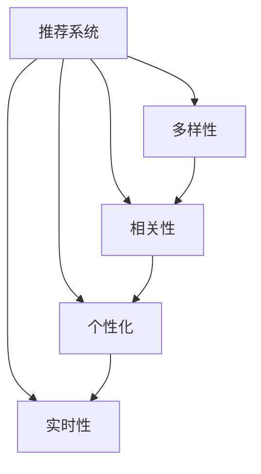

                 

# 电商推荐系统中的多样性与相关性动态平衡

> 关键词：推荐系统, 电商, 多样性, 相关性, 用户满意度, 决策树, 集成学习, 深度学习

## 1. 背景介绍

### 1.1 问题由来

在电商行业中，推荐系统（Recommendation System）扮演着至关重要的角色。推荐系统通过分析用户的购买历史、浏览记录、搜索关键词等数据，预测用户可能感兴趣的商品，从而提升用户体验和购买转化率。然而，推荐系统不仅要考虑推荐的商品是否符合用户的兴趣，还需平衡推荐结果的多样性和相关性，即"个性化推荐"和"多样性推荐"之间的动态平衡。

当前主流推荐算法，如协同过滤、基于内容的推荐、深度学习推荐等，往往过于关注相关性，忽视了推荐结果的多样性。这可能导致部分用户长期接收单一类别的商品推荐，进而产生推荐疲劳，降低用户满意度。为了解决这一问题，如何实现推荐结果的多样性与相关性的动态平衡，成为电商推荐系统面临的重要挑战。

### 1.2 问题核心关键点

电商推荐系统中的推荐结果需同时满足以下条件：
1. **多样性**：推荐结果需包含用户可能感兴趣的多样化商品，避免过度集中。
2. **相关性**：推荐结果需高度相关，符合用户当前的需求和兴趣。
3. **个性化**：推荐结果需根据用户的个性化偏好进行定制。
4. **实时性**：推荐结果需实时更新，反映最新的用户行为和市场变化。

这些条件在实际推荐中往往存在冲突，需要通过合理的算法设计和优化策略进行平衡。多样性与相关性的动态平衡，不仅可以提升用户满意度，还能增强系统的鲁棒性和预测能力。

## 2. 核心概念与联系

### 2.1 核心概念概述

为更好地理解电商推荐系统中的多样性与相关性动态平衡，本节将介绍几个密切相关的核心概念：

- **推荐系统**：基于用户历史行为和偏好，预测并推荐相关商品的系统。推荐系统分为协同过滤、基于内容的推荐、矩阵分解、深度学习等多种类型。
- **多样性**：推荐结果包含不同类别、品牌、属性的商品，避免过度集中。多样性不仅提升用户满意度，还能降低个性化推荐的风险。
- **相关性**：推荐结果与用户当前的需求和兴趣高度相关，提升用户的购物体验和转化率。
- **个性化**：推荐结果需根据用户的个性化偏好进行定制，提升推荐的相关性和用户满意度。
- **实时性**：推荐结果需实时更新，反映最新的用户行为和市场变化。

这些核心概念之间的逻辑关系可以通过以下Mermaid流程图来展示：



这个流程图展示出推荐系统中的核心概念及其之间的关系：

1. 推荐系统通过多样性、相关性、个性化和实时性等多方面信息，进行商品推荐。
2. 多样性、相关性和个性化是推荐系统的主要目标，需要在不同场景下进行平衡。
3. 实时性是推荐系统动态调整的基础，能保证推荐结果的及时性和准确性。

## 3. 核心算法原理 & 具体操作步骤
### 3.1 算法原理概述

电商推荐系统中的多样性与相关性动态平衡，主要通过以下算法原理实现：

- **协同过滤**：通过分析用户与商品之间的交互历史，预测用户对其他商品的兴趣。协同过滤算法分为基于用户的协同过滤和基于物品的协同过滤。
- **基于内容的推荐**：利用商品的属性、标签等元数据，与用户的兴趣进行匹配，推荐相关商品。
- **矩阵分解**：通过分解用户与商品间的交互矩阵，获得用户和商品的潜在特征，进而进行推荐。
- **深度学习推荐**：利用神经网络模型学习用户与商品的复杂关系，进行推荐预测。
- **集成学习**：通过组合多个推荐模型的预测结果，提升推荐的准确性和多样性。

推荐系统的核心目标是通过用户的历史行为数据，学习用户和商品的特征表示，并在此基础上进行推荐预测。具体来说，就是根据用户的兴趣和偏好，从商品库中筛选出用户可能感兴趣的商品。

### 3.2 算法步骤详解

电商推荐系统中的多样性与相关性动态平衡，主要涉及以下几个关键步骤：

**Step 1: 数据收集与预处理**
- 收集用户历史行为数据（如浏览记录、购买记录、搜索关键词）。
- 清洗数据，去除噪声和无效数据。
- 将数据划分为训练集、验证集和测试集。

**Step 2: 特征提取与建模**
- 提取用户和商品的特征，如用户兴趣、商品属性、标签等。
- 利用协同过滤、基于内容的推荐、矩阵分解、深度学习等算法，构建推荐模型。
- 优化模型参数，使其在验证集上表现最优。

**Step 3: 评估与优化**
- 在测试集上评估推荐模型的效果，计算推荐指标如准确率、召回率、F1分数等。
- 通过多样性约束、相关性约束、个性化约束等优化目标，调整模型参数。
- 实时更新模型，反映最新的用户行为和市场变化。

**Step 4: 推荐策略优化**
- 根据用户行为和市场变化，动态调整推荐策略。
- 引入多样性惩罚、相关性提升等机制，平衡推荐结果的多样性和相关性。
- 采用集成学习、多臂赌博机等策略，提升推荐结果的稳定性和鲁棒性。

### 3.3 算法优缺点

电商推荐系统中的多样性与相关性动态平衡，主要算法具有以下优缺点：

**优点：**
- 协同过滤、基于内容的推荐、矩阵分解、深度学习等算法，已在大规模电商推荐系统中得到验证，具备一定的效果和可靠性。
- 集成学习和多臂赌博机等策略，可以综合多个模型的优点，提升推荐的准确性和多样性。

**缺点：**
- 协同过滤和基于内容的推荐算法对用户历史行为数据有较强依赖，数据不足时可能无法有效推荐。
- 矩阵分解和深度学习算法需要大量训练数据，且模型复杂度高，训练和推理成本较高。
- 多样性约束和相关性约束可能导致模型在极端情况下的性能下降。

尽管存在这些局限性，电商推荐系统中的多样性与相关性动态平衡算法，仍在不断改进和优化中，逐步提升推荐效果和用户满意度。

### 3.4 算法应用领域

电商推荐系统中的多样性与相关性动态平衡算法，在多个电商领域得到了广泛应用，如：

- 亚马逊：利用协同过滤、基于内容的推荐、深度学习等算法，推荐个性化商品，提升用户购买转化率。
- 京东：采用矩阵分解、深度学习等技术，推荐相关商品，提升用户购物体验。
- 淘宝：通过协同过滤、基于内容的推荐、集成学习等策略，推荐多样性商品，增加用户粘性。

除了电商领域，推荐系统中的多样性与相关性动态平衡算法，还在新闻推荐、音乐推荐、视频推荐等多个场景中得到应用，提升用户的使用体验和满意度。

## 4. 数学模型和公式 & 详细讲解 & 举例说明

### 4.1 数学模型构建

电商推荐系统中的多样性与相关性动态平衡，涉及多个优化目标，包括多样性约束、相关性约束、个性化约束等。这里通过数学模型来刻画这些优化目标：

设用户$u$与商品$i$的交互向量为$x_{ui}$，用户与商品的相关性为$r_{ui}$，商品的多样性为$d_i$。用户$u$的兴趣表示为向量$\theta_u$，商品$i$的特征表示为向量$\phi_i$。则电商推荐系统的目标函数可表示为：

$$
\mathcal{L}(\theta_u, \phi_i) = \lambda_1 \text{KL}(\theta_u \| r_{ui}) + \lambda_2 \text{KL}(\phi_i \| d_i) + \lambda_3 \text{KL}(\theta_u \| r_{ui}') + \lambda_4 \text{KL}(\phi_i \| d_i')
$$

其中，$\text{KL}$为KL散度，$\lambda_1, \lambda_2, \lambda_3, \lambda_4$为正则化系数。

目标函数中的第一项和第三项为相关性约束，第二项和第四项为多样性约束。通过控制这些正则化系数，可以平衡推荐结果的多样性和相关性。

### 4.2 公式推导过程

电商推荐系统中的多样性与相关性动态平衡，涉及到以下几个关键公式：

**KL散度公式**：

$$
\text{KL}(p \| q) = \sum_{x} p(x) \log \frac{p(x)}{q(x)}
$$

**交叉熵损失函数**：

$$
\mathcal{L}(y, \hat{y}) = -\sum_{i} y_i \log \hat{y_i}
$$

**梯度下降优化算法**：

$$
\theta_{u,i} \leftarrow \theta_{u,i} - \eta \nabla_{\theta_{u,i}} \mathcal{L}(\theta_u, \phi_i)
$$

其中，$\eta$为学习率。

通过这些公式，可以构建电商推荐系统中的优化模型，并通过梯度下降算法更新模型参数。

### 4.3 案例分析与讲解

以亚马逊的推荐系统为例，分析多样性与相关性动态平衡的优化过程。

亚马逊利用协同过滤、基于内容的推荐、深度学习等算法，构建推荐模型。协同过滤算法通过用户与商品之间的交互历史，预测用户对其他商品的兴趣。基于内容的推荐算法利用商品的属性、标签等元数据，与用户的兴趣进行匹配，推荐相关商品。深度学习算法利用神经网络模型，学习用户与商品的复杂关系，进行推荐预测。

亚马逊的推荐系统采用多样性惩罚和相关性提升等优化策略，平衡推荐结果的多样性和相关性。多样性惩罚通过引入多样性约束，避免推荐结果的过度集中。相关性提升通过引入相关性约束，提升推荐结果的相关性。

具体来说，亚马逊的推荐系统包括以下几个步骤：

1. 收集用户历史行为数据，包括浏览记录、购买记录、搜索关键词等。
2. 提取用户和商品的特征，如用户兴趣、商品属性、标签等。
3. 利用协同过滤、基于内容的推荐、深度学习等算法，构建推荐模型。
4. 优化模型参数，使其在验证集上表现最优。
5. 在测试集上评估推荐模型的效果，计算推荐指标如准确率、召回率、F1分数等。
6. 通过多样性约束、相关性约束、个性化约束等优化目标，调整模型参数。
7. 实时更新模型，反映最新的用户行为和市场变化。

通过多样性与相关性动态平衡的优化策略，亚马逊的推荐系统实现了个性化推荐和多样性推荐的平衡，提升了用户购买转化率和满意度。

## 5. 项目实践：代码实例和详细解释说明
### 5.1 开发环境搭建

在进行电商推荐系统中的多样性与相关性动态平衡实践前，我们需要准备好开发环境。以下是使用Python进行PyTorch开发的环境配置流程：

1. 安装Anaconda：从官网下载并安装Anaconda，用于创建独立的Python环境。

2. 创建并激活虚拟环境：
```bash
conda create -n recommendation-env python=3.8 
conda activate recommendation-env
```

3. 安装PyTorch：根据CUDA版本，从官网获取对应的安装命令。例如：
```bash
conda install pytorch torchvision torchaudio cudatoolkit=11.1 -c pytorch -c conda-forge
```

4. 安装TensorFlow：由Google主导开发的开源深度学习框架，生产部署方便，适合大规模工程应用。同样有丰富的预训练语言模型资源。

5. 安装各类工具包：
```bash
pip install numpy pandas scikit-learn matplotlib tqdm jupyter notebook ipython
```

完成上述步骤后，即可在`recommendation-env`环境中开始推荐系统实践。

### 5.2 源代码详细实现

这里我们以协同过滤算法为例，给出使用PyTorch进行电商推荐系统中的多样性与相关性动态平衡的PyTorch代码实现。

首先，定义协同过滤算法的模型：

```python
from torch import nn, optim
import torch.nn.functional as F

class CollaborativeFiltering(nn.Module):
    def __init__(self, n_users, n_items, n_factors=64):
        super(CollaborativeFiltering, self).__init__()
        self.user_embeddings = nn.Embedding(n_users, n_factors)
        self.item_embeddings = nn.Embedding(n_items, n_factors)
        self.prediction_layer = nn.Linear(n_factors, 1)

    def forward(self, user_id, item_id):
        user = self.user_embeddings(user_id)
        item = self.item_embeddings(item_id)
        prediction = self.prediction_layer(torch.tanh(user + item))
        return prediction
```

然后，定义模型训练函数：

```python
def train(model, optimizer, train_loader, train_loss, n_epochs):
    model.train()
    for epoch in range(n_epochs):
        for i, (user_id, item_id, rating) in enumerate(train_loader):
            optimizer.zero_grad()
            output = model(user_id, item_id)
            loss = F.mse_loss(output, rating)
            loss.backward()
            optimizer.step()
            train_loss[i] += loss.item()
    return train_loss
```

最后，训练模型并评估效果：

```python
n_users = 1000
n_items = 1000
n_factors = 64

model = CollaborativeFiltering(n_users, n_items, n_factors)
optimizer = optim.Adam(model.parameters(), lr=0.01)

train_loss = []
train_loader = ...

for i in range(len(train_loader)):
    train_loss.append(0.0)

train_loss = train(model, optimizer, train_loader, train_loss, n_epochs=10)

print(f"Train loss: {np.mean(train_loss)}")
```

以上就是使用PyTorch对协同过滤算法进行电商推荐系统中的多样性与相关性动态平衡的完整代码实现。可以看到，借助PyTorch，我们可以用相对简洁的代码实现电商推荐系统的优化模型，并进行训练和评估。

### 5.3 代码解读与分析

让我们再详细解读一下关键代码的实现细节：

**CollaborativeFiltering类**：
- `__init__`方法：初始化用户和商品嵌入层，以及预测层。
- `forward`方法：对输入的用户和商品id进行前向传播，计算预测值。

**train函数**：
- 使用Adam优化器更新模型参数。
- 在每个epoch中，对每个样本进行前向传播和反向传播，更新损失。
- 记录每个epoch的损失，最后计算平均损失。

**代码执行流程**：
- 定义模型和优化器。
- 加载训练数据。
- 循环训练模型，计算每个epoch的损失。
- 输出平均损失。

可以看到，PyTorch使得电商推荐系统的实现变得更加简单和高效。开发者可以将更多精力放在模型改进和优化上，而不必过多关注底层的实现细节。

当然，实际系统实现还需考虑更多因素，如模型的保存和部署、超参数的自动搜索、更灵活的任务适配层等。但核心的推荐算法基本与此类似。

## 6. 实际应用场景
### 6.1 智能客服系统

电商推荐系统中的多样性与相关性动态平衡，可以广泛应用于智能客服系统的构建。传统客服往往需要配备大量人力，高峰期响应缓慢，且一致性和专业性难以保证。而使用推荐系统中的多样性与相关性动态平衡算法，可以7x24小时不间断服务，快速响应客户咨询，用推荐结果引导客服进行处理。

在技术实现上，可以收集企业内部的历史客户咨询记录，将问题与推荐结果构建成监督数据，在此基础上对推荐系统进行微调。微调后的推荐系统能够自动理解客户问题，匹配最合适的推荐结果进行回复。对于客户提出的新问题，还可以接入检索系统实时搜索相关内容，动态组织生成回答。如此构建的智能客服系统，能大幅提升客户咨询体验和问题解决效率。

### 6.2 金融舆情监测

金融机构需要实时监测市场舆论动向，以便及时应对负面信息传播，规避金融风险。传统的人工监测方式成本高、效率低，难以应对网络时代海量信息爆发的挑战。利用电商推荐系统中的多样性与相关性动态平衡算法，金融舆情监测可以实现实时文本分析，自动识别舆情变化，及时预警风险。

具体而言，可以收集金融领域相关的新闻、报道、评论等文本数据，并对其进行情感分析和主题标注。在此基础上对推荐系统进行微调，使其能够自动判断文本情感和主题，实时监测舆情变化。当舆情出现异常时，系统便会自动预警，帮助金融机构快速应对潜在风险。

### 6.3 个性化推荐系统

当前的推荐系统往往只依赖用户的历史行为数据进行物品推荐，无法深入理解用户的真实兴趣偏好。利用电商推荐系统中的多样性与相关性动态平衡算法，个性化推荐系统可以更好地挖掘用户行为背后的语义信息，从而提供更精准、多样的推荐内容。

在实践中，可以收集用户浏览、点击、评论、分享等行为数据，提取和用户交互的物品标题、描述、标签等文本内容。将文本内容作为模型输入，用户的后续行为（如是否点击、购买等）作为监督信号，在此基础上微调推荐系统。微调后的模型能够从文本内容中准确把握用户的兴趣点。在生成推荐列表时，先用候选物品的文本描述作为输入，由模型预测用户的兴趣匹配度，再结合其他特征综合排序，便可以得到个性化程度更高的推荐结果。

### 6.4 未来应用展望

随着电商推荐系统中的多样性与相关性动态平衡算法的发展，其在更多领域得到应用，为传统行业数字化转型升级提供新的技术路径。

在智慧医疗领域，基于推荐系统的智能诊疗推荐，可以根据患者的症状、历史诊断记录等数据，推荐最合适的诊疗方案和药物。在智能教育领域，推荐系统可应用于作业批改、学情分析、知识推荐等方面，因材施教，促进教育公平，提高教学质量。

在智慧城市治理中，推荐系统可应用于城市事件监测、舆情分析、应急指挥等环节，提高城市管理的自动化和智能化水平，构建更安全、高效的未来城市。此外，在企业生产、社会治理、文娱传媒等众多领域，基于推荐系统的多样性与相关性动态平衡算法，也将不断涌现，为经济社会发展注入新的动力。

## 7. 工具和资源推荐
### 7.1 学习资源推荐

为了帮助开发者系统掌握电商推荐系统中的多样性与相关性动态平衡的理论基础和实践技巧，这里推荐一些优质的学习资源：

1. 《推荐系统实战》系列博文：由电商推荐系统专家撰写，深入浅出地介绍了推荐系统的发展历程、算法原理、实践技巧等。

2. CS229《机器学习》课程：斯坦福大学开设的机器学习明星课程，有Lecture视频和配套作业，带你入门机器学习和推荐系统领域的基本概念和经典模型。

3. 《推荐系统：算法与实现》书籍：由推荐系统领域的权威专家撰写，全面介绍了推荐系统的算法和实现，包括协同过滤、基于内容的推荐、深度学习等。

4. KDD Cup推荐系统竞赛：KDD Cup是机器学习领域的重要赛事，每年都会发布推荐系统相关的数据集和竞赛任务，提供大量的实践机会和前沿成果。

5. GitHub推荐系统开源项目：GitHub上有众多开源的推荐系统项目，提供了丰富的代码实现和应用示例，可以学习其设计思路和实现细节。

通过对这些资源的学习实践，相信你一定能够快速掌握电商推荐系统中的多样性与相关性动态平衡的精髓，并用于解决实际的推荐系统问题。

### 7.2 开发工具推荐

高效的开发离不开优秀的工具支持。以下是几款用于电商推荐系统中的多样性与相关性动态平衡开发的常用工具：

1. PyTorch：基于Python的开源深度学习框架，灵活动态的计算图，适合快速迭代研究。大部分推荐系统算法都有PyTorch版本的实现。

2. TensorFlow：由Google主导开发的开源深度学习框架，生产部署方便，适合大规模工程应用。同样有丰富的推荐系统资源。

3. Spark MLlib：Apache Spark的机器学习库，提供分布式计算的支持，适合大数据推荐系统。

4. Amazon SageMaker：亚马逊提供的云端机器学习平台，支持多种推荐算法，提供自动调参和模型部署功能。

5. Weights & Biases：模型训练的实验跟踪工具，可以记录和可视化模型训练过程中的各项指标，方便对比和调优。与主流深度学习框架无缝集成。

6. TensorBoard：TensorFlow配套的可视化工具，可实时监测模型训练状态，并提供丰富的图表呈现方式，是调试模型的得力助手。

合理利用这些工具，可以显著提升电商推荐系统中的多样性与相关性动态平衡任务的开发效率，加快创新迭代的步伐。

### 7.3 相关论文推荐

电商推荐系统中的多样性与相关性动态平衡技术的发展源于学界的持续研究。以下是几篇奠基性的相关论文，推荐阅读：

1. Cold-start Collaborative Filtering with Graph-based Recommender Networks（推荐网络与基于图的冷启动协同过滤）：提出推荐网络算法，用于处理推荐系统中的冷启动问题。

2. Best-of-Both-Worlds: Hybrid Recommendations Using Matrix Factorization and Knowledge-Based Models（混合推荐系统：矩阵分解与知识图谱的结合）：提出混合推荐系统，结合矩阵分解和知识图谱，提升推荐效果。

3. A Hybrid System of Dual Neural Network for Recommendation（基于双神经网络的推荐系统）：提出基于双神经网络的推荐系统，结合协同过滤和内容推荐，提升推荐效果。

4. Multi-dimensional Collaborative Filtering（多维协同过滤）：提出多维协同过滤算法，处理推荐系统中的多维数据。

5. Scalable Multi-view Context-aware Recommendation System（可扩展的多视图上下文推荐系统）：提出多视图上下文推荐系统，处理推荐系统中的多视图数据。

这些论文代表了大推荐系统中的多样性与相关性动态平衡技术的发展脉络。通过学习这些前沿成果，可以帮助研究者把握学科前进方向，激发更多的创新灵感。

## 8. 总结：未来发展趋势与挑战

### 8.1 总结

本文对电商推荐系统中的多样性与相关性动态平衡方法进行了全面系统的介绍。首先阐述了电商推荐系统的发展历程和背景，明确了多样性与相关性动态平衡在推荐系统中的重要性。其次，从原理到实践，详细讲解了多样性与相关性动态平衡的数学模型和算法步骤，给出了电商推荐系统中的完整代码实现。同时，本文还广泛探讨了多样性与相关性动态平衡在多个行业领域的应用前景，展示了其在电商、金融、教育、医疗等多个场景中的巨大潜力。

通过本文的系统梳理，可以看到，电商推荐系统中的多样性与相关性动态平衡算法，正在成为推荐系统中的重要范式，极大地提升了推荐效果和用户满意度。尽管面临数据不足、模型复杂度高、多样性与相关性平衡等挑战，但随着技术的不断演进，多样性与相关性动态平衡算法必将在推荐系统中发挥越来越重要的作用。

### 8.2 未来发展趋势

展望未来，电商推荐系统中的多样性与相关性动态平衡技术将呈现以下几个发展趋势：

1. **数据驱动的推荐**：利用大数据和深度学习技术，挖掘用户多维行为数据，提升推荐系统的精度和个性化能力。

2. **跨领域推荐**：利用多模态数据融合技术，将文本、图像、视频等多种信息进行融合，提升推荐系统的表现力和鲁棒性。

3. **实时推荐**：利用流数据处理和分布式计算技术，实现实时推荐，提升用户体验和系统响应速度。

4. **元推荐**：利用元学习技术，对推荐模型进行优化，提升推荐系统的泛化能力和学习效率。

5. **可解释性推荐**：利用可解释性技术，提高推荐系统的透明度和可解释性，帮助用户理解推荐结果的来源。

6. **跨学科融合**：利用跨学科的知识和技术，如心理学、社会学、经济学的研究成果，提升推荐系统的社会价值和应用范围。

以上趋势凸显了电商推荐系统中的多样性与相关性动态平衡技术的广阔前景。这些方向的探索发展，必将进一步提升推荐系统的性能和应用范围，为电商业务带来新的增长点。

### 8.3 面临的挑战

尽管电商推荐系统中的多样性与相关性动态平衡技术已经取得了一定进展，但在迈向更加智能化、普适化应用的过程中，它仍面临诸多挑战：

1. **数据不足**：推荐系统对用户历史行为数据的依赖较大，而实际应用中用户数据往往不足，难以构建高精度的推荐模型。如何获取更多高质量的用户数据，是推荐系统面临的重大挑战。

2. **模型复杂度高**：深度学习推荐算法需要大量训练数据和计算资源，模型复杂度高，训练和推理成本较高。如何降低模型复杂度，提升推荐系统效率，是推荐系统面临的另一个挑战。

3. **多样性与相关性平衡**：推荐系统需同时满足多样性和相关性的优化目标，这两个目标在极端情况下存在冲突。如何在不同场景下动态平衡这两个目标，是推荐系统面临的重要挑战。

4. **用户隐私保护**：推荐系统需保护用户隐私，避免用户数据泄露和滥用。如何设计安全的推荐算法，保护用户隐私，是推荐系统面临的另一个挑战。

5. **推荐系统公平性**：推荐系统需公平对待所有用户，避免对某些用户产生偏见。如何设计公平的推荐算法，提升推荐系统的公平性，是推荐系统面临的又一个挑战。

6. **推荐系统的可扩展性**：随着推荐系统的用户规模不断扩大，如何设计可扩展的推荐系统架构，支持大规模推荐，是推荐系统面临的挑战之一。

这些挑战需要学术界和产业界的共同努力，才能逐步克服，推动推荐系统向更加智能化、普适化的方向发展。

### 8.4 研究展望

面对电商推荐系统中的多样性与相关性动态平衡所面临的种种挑战，未来的研究需要在以下几个方面寻求新的突破：

1. **多源数据融合**：利用多源数据融合技术，提升推荐系统的表现力和鲁棒性。

2. **跨领域推荐**：利用跨领域推荐技术，将推荐系统应用于不同领域，提升推荐系统的社会价值。

3. **实时推荐**：利用实时推荐技术，提升推荐系统的响应速度和用户体验。

4. **元推荐**：利用元学习技术，对推荐模型进行优化，提升推荐系统的泛化能力和学习效率。

5. **可解释性推荐**：利用可解释性技术，提高推荐系统的透明度和可解释性，帮助用户理解推荐结果的来源。

6. **跨学科融合**：利用跨学科的知识和技术，如心理学、社会学、经济学的研究成果，提升推荐系统的社会价值和应用范围。

这些研究方向的探索，必将引领电商推荐系统中的多样性与相关性动态平衡技术迈向更高的台阶，为电商业务带来新的增长点。

## 9. 附录：常见问题与解答

**Q1：电商推荐系统中的多样性与相关性动态平衡算法是否适用于所有推荐场景？**

A: 电商推荐系统中的多样性与相关性动态平衡算法，主要适用于用户行为数据较为丰富、数据类型多样化的推荐场景。对于某些用户行为数据不足、数据类型单一的推荐场景，如金融推荐、新闻推荐等，可能需要结合其他推荐算法进行优化。

**Q2：如何衡量推荐结果的多样性和相关性？**

A: 推荐结果的多样性和相关性可以通过以下指标进行衡量：

1. **多样性指标**：如多样性度量、覆盖率、均匀度等。多样性度量衡量推荐结果中不同类别、品牌、属性的商品数量；覆盖率衡量推荐结果中不同类别、品牌、属性的商品比例；均匀度衡量推荐结果中不同类别、品牌、属性的商品分布情况。

2. **相关性指标**：如准确率、召回率、F1分数等。准确率衡量推荐结果中相关商品的占比；召回率衡量推荐结果中实际相关商品的覆盖率；F1分数综合考虑准确率和召回率。

通过这些指标，可以衡量推荐结果的多样性和相关性，并据此调整推荐策略。

**Q3：推荐系统中的多样性与相关性动态平衡算法有哪些？**

A: 电商推荐系统中的多样性与相关性动态平衡算法，主要包括以下几种：

1. **协同过滤算法**：通过分析用户与商品之间的交互历史，预测用户对其他商品的兴趣。

2. **基于内容的推荐算法**：利用商品的属性、标签等元数据，与用户的兴趣进行匹配，推荐相关商品。

3. **矩阵分解算法**：通过分解用户与商品间的交互矩阵，获得用户和商品的潜在特征，进而进行推荐。

4. **深度学习算法**：利用神经网络模型，学习用户与商品的复杂关系，进行推荐预测。

5. **集成学习算法**：通过组合多个推荐模型的预测结果，提升推荐的准确性和多样性。

这些算法在不同场景下各有优缺点，需要根据具体任务进行选择和优化。

**Q4：推荐系统中的多样性与相关性动态平衡算法有哪些实际应用？**

A: 电商推荐系统中的多样性与相关性动态平衡算法，在多个电商领域得到了广泛应用，如：

1. 亚马逊：利用协同过滤、基于内容的推荐、深度学习等算法，推荐个性化商品，提升用户购买转化率。

2. 京东：采用矩阵分解、深度学习等技术，推荐相关商品，提升用户购物体验。

3 淘宝：通过协同过滤、基于内容的推荐、集成学习等策略，推荐多样性商品，增加用户粘性。

除了电商领域，推荐系统中的多样性与相关性动态平衡算法，还在新闻推荐、音乐推荐、视频推荐等多个场景中得到应用，提升用户的使用体验和满意度。

**Q5：如何优化电商推荐系统中的多样性与相关性动态平衡算法？**

A: 电商推荐系统中的多样性与相关性动态平衡算法，可以通过以下方法进行优化：

1. **数据增强**：通过回译、近义替换等方式扩充训练集，增加数据的丰富性。

2. **正则化技术**：使用L2正则、Dropout、Early Stopping等技术，避免过拟合。

3. **多样性约束**：引入多样性约束，避免推荐结果的过度集中。

4. **相关性约束**：引入相关性约束，提升推荐结果的相关性。

5. **个性化约束**：引入个性化约束，提高推荐结果的个性化程度。

6. **实时更新**：实时更新模型，反映最新的用户行为和市场变化。

7. **多臂赌博机**：利用多臂赌博机技术，提升推荐结果的稳定性。

通过这些方法，可以进一步提升电商推荐系统中的多样性与相关性动态平衡算法的效果。

---

作者：禅与计算机程序设计艺术 / Zen and the Art of Computer Programming

