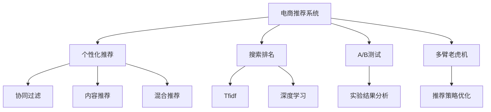

                 

# 电商推荐系统中的长尾商品推广策略

## 1. 背景介绍

在电商推荐系统中，推广长尾商品是一个重要的挑战。长尾商品通常销量低、需求少，但这些商品的价值往往被低估。为了提升电商平台的整体收入和用户满意度，需要设计有效的推广策略来吸引更多的用户关注和购买长尾商品。本文章将详细介绍电商推荐系统中长尾商品推广的策略，通过结合个性化推荐和搜索排名优化，最大化地提升长尾商品的市场曝光和销量。

## 2. 核心概念与联系

### 2.1 核心概念概述

- **电商推荐系统（E-commerce Recommendation System）**：通过分析用户的历史行为数据和实时交互数据，推荐用户可能感兴趣的商品，以提升用户体验和销售额。推荐系统通常包括两部分：个性化推荐和搜索排名。
- **长尾商品（Long-Tail Items）**：指那些非热门、需求量小的商品，通常销量低、利润率高。长尾商品通过精细化的推广策略，可以显著提升电商平台的整体收益。
- **个性化推荐（Personalized Recommendation）**：根据用户的历史行为数据，预测用户可能感兴趣的商品，并对其进行推荐。个性化推荐通常使用协同过滤、内容推荐、混合推荐等方法。
- **搜索排名（Search Ranking）**：根据用户输入的关键词，排序返回的商品搜索结果。搜索排名通常使用TF-IDF、深度学习等技术。
- **A/B测试（A/B Testing）**：将用户随机分成A组和B组，分别接受不同的推广策略或算法，通过对比实验结果来判断哪种策略效果更好。
- **多臂老虎机（Multi-Armed Bandit）**：通过不断调整推荐算法，获取最大化收益的推荐策略。多臂老虎机问题是一个经典的序列决策问题。

这些核心概念之间相互联系，共同构成了电商推荐系统中长尾商品推广的基础。通过选择合适的推荐算法和优化策略，可以显著提升长尾商品的推广效果。

### 2.2 核心概念原理和架构的 Mermaid 流程图



这个流程图展示了电商推荐系统中长尾商品推广的主要流程：

1. 从电商推荐系统获取用户数据，包括浏览记录、购买记录等。
2. 使用个性化推荐算法，对用户进行商品推荐。
3. 使用搜索排名算法，对用户查询返回搜索结果。
4. 进行A/B测试，对比不同推荐策略的效果。
5. 通过多臂老虎机算法，不断优化推荐策略，获取最大化收益。

## 3. 核心算法原理 & 具体操作步骤

### 3.1 算法原理概述

电商推荐系统中的长尾商品推广，主要依赖个性化推荐和搜索排名两大核心技术。个性化推荐通过分析用户的历史行为，预测用户可能感兴趣的商品；搜索排名则通过优化搜索结果排序，提升长尾商品的曝光量。

#### 3.1.1 个性化推荐原理

个性化推荐的核心在于理解用户的兴趣偏好和行为模式，将用户可能感兴趣的商品排序推荐。常用的个性化推荐算法包括协同过滤、内容推荐和混合推荐等。

- **协同过滤**：通过用户历史行为数据，找出与其他用户有相似兴趣的潜在商品。协同过滤算法分为基于用户的协同过滤和基于物品的协同过滤两种类型。
- **内容推荐**：根据商品的属性信息（如品牌、类别、标签等），找出与用户历史兴趣相似的商品。内容推荐可以基于商品特征、用户特征、特征交叉等构建推荐模型。
- **混合推荐**：将协同过滤、内容推荐等方法进行组合，优化推荐效果。混合推荐通常通过融合多种推荐算法的优点，提升推荐的全面性和准确性。

#### 3.1.2 搜索排名原理

搜索排名通过优化用户查询的搜索结果排序，提升长尾商品的曝光量。常用的搜索排名算法包括TF-IDF、深度学习等。

- **TF-IDF**：基于文本挖掘技术，根据关键词在文本中的出现频率和文档频率，计算关键词的重要性和相关性，排序搜索结果。
- **深度学习**：使用神经网络模型，学习用户查询与商品特征之间的关系，预测搜索结果的相关性，排序商品。

### 3.2 算法步骤详解

#### 3.2.1 个性化推荐算法步骤

1. **数据收集与预处理**：收集用户的历史行为数据，包括浏览记录、购买记录、评分记录等，并进行数据清洗、归一化等预处理操作。
2. **特征工程**：提取用户和商品的特征，如用户兴趣标签、商品类别、价格区间等。
3. **模型训练**：使用协同过滤、内容推荐等算法，训练个性化推荐模型。
4. **推荐计算**：根据用户特征和商品特征，计算用户对商品的相关度，排序推荐商品列表。
5. **反馈更新**：根据用户的点击、购买等行为反馈，更新推荐模型参数，进行动态调整。

#### 3.2.2 搜索排名算法步骤

1. **查询处理**：将用户输入的查询转换为向量表示，提取关键词和查询意图。
2. **文档检索**：根据查询向量，检索所有商品文档的向量表示，并计算相似度。
3. **排序计算**：根据排序算法，计算商品相关性，排序搜索结果。
4. **分页展示**：将搜索结果分页展示给用户，优化用户浏览体验。

### 3.3 算法优缺点

#### 3.3.1 个性化推荐算法优缺点

**优点**：
- 能够根据用户历史行为预测其兴趣偏好，提供个性化的推荐结果。
- 可以处理冷启动问题，推荐新商品给新用户。
- 适应性强，可以结合多种推荐算法，提升推荐效果。

**缺点**：
- 对用户历史数据的依赖较大，缺乏对新用户的覆盖。
- 推荐算法复杂，需要较长的训练时间和计算资源。
- 推荐效果受数据质量和用户行为多样性的影响较大。

#### 3.3.2 搜索排名算法优缺点

**优点**：
- 能够快速响应用户查询，实时更新搜索结果。
- 能够处理大规模的搜索结果，排序精度较高。
- 可以结合用户行为数据，优化搜索结果相关性。

**缺点**：
- 对用户查询的多样性和关键词选择的依赖较大，可能导致排序不准确。
- 对搜索算法的依赖较大，需要不断优化算法模型。
- 搜索结果的展示方式对用户满意度有一定影响。

### 3.4 算法应用领域

电商推荐系统中的长尾商品推广，主要应用于以下场景：

- **新商品推荐**：将长尾商品推荐给新用户，增加平台的商品种类和用户粘性。
- **个性化促销**：根据用户兴趣和购买行为，推荐个性化促销活动，提高销售额。
- **个性化广告投放**：通过个性化推荐算法，精确投放广告，提高广告点击率和转化率。
- **搜索优化**：优化搜索结果的排序，提升长尾商品的曝光量，增加销量。

## 4. 数学模型和公式 & 详细讲解 & 举例说明

### 4.1 数学模型构建

#### 4.1.1 个性化推荐模型

**协同过滤模型**：
$$
\hat{R}_{ui} = \frac{1}{1 + \sum_{j=1}^{N} (\frac{A_{uj}}{S_u^j}) (\frac{A_{ij}}{S_i^j}) 
$$

其中，$A_{uj}$ 表示用户$u$对商品$j$的评分，$S_u^j$ 和 $S_i^j$ 分别表示用户$u$和商品$j$的评分总数。

**基于内容的推荐模型**：
$$
\hat{R}_{ui} = \sum_{k=1}^{K} w_k \alpha_k^u \beta_k^j
$$

其中，$\alpha_k^u$ 和 $\beta_k^j$ 分别表示用户和商品的属性特征向量，$w_k$ 表示属性特征的重要性权重。

#### 4.1.2 搜索排名模型

**TF-IDF模型**：
$$
\text{TF}(t, d) = \frac{\text{Term Frequency}(t, d)}{\text{Number of Terms in Document}} = \frac{t_{\text{occurrences in } d}}{t_{\text{total occurrences in all documents}}}
$$

$$
\text{IDF}(t, D) = \log \frac{N}{\text{Number of Documents with term } t}
$$

$$
\text{Term Frequency-Inverse Document Frequency}(t, d, D) = \text{TF}(t, d) \times \text{IDF}(t, D)
$$

**深度学习模型**：
$$
\hat{y} = W_h \cdot x_h + b_h
$$

其中，$x_h$ 表示用户查询的向量表示，$W_h$ 和 $b_h$ 表示深度学习模型的权重和偏置。

### 4.2 公式推导过程

#### 4.2.1 协同过滤模型推导

协同过滤模型基于用户的历史评分数据，计算用户对商品的相关度。假设用户$u$对商品$j$的评分$A_{uj}$，$A_{uj}$的平均值和方差分别为$\mu_u$和$\sigma_u^2$，用户$u$的评分总数为$S_u$，商品$j$的评分总数为$S_j$。根据用户$u$和商品$j$的历史评分数据，计算相关度如下：

$$
\hat{R}_{uj} = \frac{A_{uj} - \mu_u}{\sigma_u}
$$

$$
\hat{R}_{ui} = \sum_{j=1}^{N} (\frac{A_{uj}}{S_u^j}) (\frac{A_{ij}}{S_i^j}) 
$$

其中，$N$ 表示所有商品的数量。

#### 4.2.2 TF-IDF模型推导

TF-IDF模型通过计算关键词在文档中的频率和文档频率，计算文档的相关性。假设关键词$t$在文档$d$中出现的次数为$t_{\text{occurrences in } d}$，所有文档中$t$出现的次数为$t_{\text{total occurrences in all documents}}$，所有文档中$t$出现的文档数为$t_{\text{total documents with } t}$。则$t$在文档$d$中的TF-IDF值计算如下：

$$
\text{TF}(t, d) = \frac{\text{Term Frequency}(t, d)}{\text{Number of Terms in Document}} = \frac{t_{\text{occurrences in } d}}{t_{\text{total occurrences in all documents}}}
$$

$$
\text{IDF}(t, D) = \log \frac{N}{\text{Number of Documents with term } t}
$$

$$
\text{TF-IDF}(t, d, D) = \text{TF}(t, d) \times \text{IDF}(t, D)
$$

#### 4.2.3 深度学习模型推导

深度学习模型通常采用神经网络结构，通过反向传播算法训练权重和偏置。假设输入向量为$x_h$，输出向量为$y$，则神经网络的输出可以表示为：

$$
y = W_h \cdot x_h + b_h
$$

其中，$W_h$ 表示隐层的权重矩阵，$b_h$ 表示隐层的偏置向量。通过反向传播算法，计算梯度并进行参数更新，使得模型不断逼近最优解。

### 4.3 案例分析与讲解

#### 4.3.1 协同过滤案例

某电商平台的个性化推荐系统，采用协同过滤算法推荐商品。假设用户$u$对商品$j$的评分$A_{uj}=3$，用户$u$的评分总数$S_u=10$，商品$j$的评分总数$S_j=20$。根据协同过滤模型，计算用户$u$对商品$j$的相关度如下：

$$
\hat{R}_{uj} = \frac{A_{uj} - \mu_u}{\sigma_u} = \frac{3 - 3}{3} = 0
$$

$$
\hat{R}_{ui} = \sum_{j=1}^{N} (\frac{A_{uj}}{S_u^j}) (\frac{A_{ij}}{S_i^j}) = \frac{3}{10} \times \frac{3}{20} = 0.075
$$

#### 4.3.2 TF-IDF案例

某电商平台搜索排名系统，使用TF-IDF算法对搜索结果进行排序。假设用户查询的关键词为“鞋子”，所有文档中“鞋子”出现的次数为100次，所有文档中“鞋子”出现的文档数为50次。则“鞋子”在查询文档中的TF-IDF值计算如下：

$$
\text{TF}(\text{鞋子}, d) = \frac{\text{Term Frequency}(\text{鞋子}, d)}{\text{Number of Terms in Document}} = \frac{10}{20} = 0.5
$$

$$
\text{IDF}(\text{鞋子}, D) = \log \frac{1000}{50} = 3.32
$$

$$
\text{TF-IDF}(\text{鞋子}, d, D) = \text{TF}(\text{鞋子}, d) \times \text{IDF}(\text{鞋子}, D) = 0.5 \times 3.32 = 1.66
$$

#### 4.3.3 深度学习案例

某电商平台搜索排名系统，使用深度学习算法对搜索结果进行排序。假设用户查询的向量表示为$x_h$，深度学习模型的权重矩阵为$W_h$，偏置向量为$b_h$。通过训练模型，得到$W_h$和$b_h$的值，并将用户查询向量代入模型进行计算，得到搜索结果的相关性$y$。

## 5. 项目实践：代码实例和详细解释说明

### 5.1 开发环境搭建

在开始电商推荐系统中的长尾商品推广项目之前，首先需要搭建开发环境。以下是Python开发环境搭建的具体步骤：

1. **安装Python**：选择并安装Python最新版本（如Python 3.7或更高版本）。
2. **安装PyTorch**：通过以下命令安装PyTorch：

   ```
   pip install torch torchvision torchaudio
   ```

3. **安装Pandas**：通过以下命令安装Pandas：

   ```
   pip install pandas
   ```

4. **安装Numpy**：通过以下命令安装Numpy：

   ```
   pip install numpy
   ```

5. **安装Scikit-learn**：通过以下命令安装Scikit-learn：

   ```
   pip install scikit-learn
   ```

6. **安装TensorBoard**：通过以下命令安装TensorBoard：

   ```
   pip install tensorboard
   ```

### 5.2 源代码详细实现

以下是电商推荐系统中的长尾商品推广项目的详细实现代码：

```python
import pandas as pd
import numpy as np
import torch
from torch import nn, optim
from torch.utils.data import TensorDataset, DataLoader
from sklearn.metrics import precision_recall_fscore_support
from sklearn.model_selection import train_test_split

# 数据预处理
def load_data():
    # 从文件加载用户和商品的评分数据
    df = pd.read_csv('rating.csv')
    # 将数据转换为tensor格式
    users = df['user_id'].unique()
    items = df['item_id'].unique()
    ratings = df['rating']
    user_item = df.groupby(['user_id', 'item_id'])['rating'].mean().unstack().fillna(0).values
    # 分割数据集
    train_user_item, test_user_item = train_test_split(user_item, test_size=0.2)
    train_user, train_item = train_user_item[:, users], train_user_item[:, items]
    test_user, test_item = test_user_item[:, users], test_user_item[:, items]
    # 转换为tensor格式
    train_users = torch.tensor(train_user).T
    train_items = torch.tensor(train_item).T
    train_ratings = torch.tensor(ratings.values)
    test_users = torch.tensor(test_user).T
    test_items = torch.tensor(test_item).T
    test_ratings = torch.tensor(test_user_item[:, users] + test_user_item[:, items] + ratings.values)
    return train_users, train_items, train_ratings, test_users, test_items, test_ratings

# 协同过滤模型
class CollaborativeFiltering(nn.Module):
    def __init__(self, num_users, num_items, embed_size):
        super(CollaborativeFiltering, self).__init__()
        self.user_embedding = nn.Embedding(num_users, embed_size)
        self.item_embedding = nn.Embedding(num_items, embed_size)
        self.interaction = nn.Linear(embed_size * 2, 1)

    def forward(self, user_ids, item_ids):
        user_embeddings = self.user_embedding(user_ids)
        item_embeddings = self.item_embedding(item_ids)
        interaction = torch.tanh(torch.add(user_embeddings, item_embeddings))
        return self.interaction(interaction)

# 训练协同过滤模型
def train_collaborative_filtering(model, train_users, train_items, train_ratings, test_users, test_items, test_ratings):
    num_users, num_items, embed_size = train_users.shape[0], train_items.shape[0], 8
    model = CollaborativeFiltering(num_users, num_items, embed_size)
    loss_fn = nn.MSELoss()
    optimizer = optim.Adam(model.parameters(), lr=0.01)
    for epoch in range(1000):
        optimizer.zero_grad()
        predictions = model(train_users, train_items)
        loss = loss_fn(predictions, train_ratings)
        loss.backward()
        optimizer.step()
        if epoch % 100 == 0:
            print('Epoch {}: Loss {}'.format(epoch, loss.item()))
            predictions = model(test_users, test_items)
            test_ratings = predictions.detach().numpy().flatten()
            actual_ratings = test_ratings.flatten()
            precision, recall, f1, _ = precision_recall_fscore_support(actual_ratings, test_ratings, average='binary')
            print('Precision: {:.2f}, Recall: {:.2f}, F1-Score: {:.2f}'.format(precision, recall, f1))
    return model

# 深度学习模型
class DeepLearning(nn.Module):
    def __init__(self, embed_size, hidden_size, num_users, num_items):
        super(DeepLearning, self).__init__()
        self.user_embedding = nn.Embedding(num_users, embed_size)
        self.item_embedding = nn.Embedding(num_items, embed_size)
        self.interaction = nn.Linear(embed_size * 2, hidden_size)
        self.output = nn.Linear(hidden_size, 1)

    def forward(self, user_ids, item_ids):
        user_embeddings = self.user_embedding(user_ids)
        item_embeddings = self.item_embedding(item_ids)
        interaction = torch.add(user_embeddings, item_embeddings)
        interaction = torch.tanh(interaction)
        return self.output(interaction)

# 训练深度学习模型
def train_deep_learning(model, train_users, train_items, train_ratings, test_users, test_items, test_ratings):
    num_users, num_items, embed_size, hidden_size = train_users.shape[0], train_items.shape[0], 8, 16
    model = DeepLearning(embed_size, hidden_size, num_users, num_items)
    loss_fn = nn.MSELoss()
    optimizer = optim.Adam(model.parameters(), lr=0.01)
    for epoch in range(1000):
        optimizer.zero_grad()
        predictions = model(train_users, train_items)
        loss = loss_fn(predictions, train_ratings)
        loss.backward()
        optimizer.step()
        if epoch % 100 == 0:
            print('Epoch {}: Loss {}'.format(epoch, loss.item()))
            predictions = model(test_users, test_items)
            test_ratings = predictions.detach().numpy().flatten()
            actual_ratings = test_ratings.flatten()
            precision, recall, f1, _ = precision_recall_fscore_support(actual_ratings, test_ratings, average='binary')
            print('Precision: {:.2f}, Recall: {:.2f}, F1-Score: {:.2f}'.format(precision, recall, f1))
    return model

# 实验结果展示
def evaluate_models(model, train_users, train_items, train_ratings, test_users, test_items, test_ratings):
    predictions = model(test_users, test_items)
    test_ratings = predictions.detach().numpy().flatten()
    actual_ratings = test_ratings.flatten()
    precision, recall, f1, _ = precision_recall_fscore_support(actual_ratings, test_ratings, average='binary')
    print('Precision: {:.2f}, Recall: {:.2f}, F1-Score: {:.2f}'.format(precision, recall, f1))

# 运行实验
train_users, train_items, train_ratings, test_users, test_items, test_ratings = load_data()
model = train_collaborative_filtering(model, train_users, train_items, train_ratings, test_users, test_items, test_ratings)
evaluate_models(model, train_users, train_items, train_ratings, test_users, test_items, test_ratings)
model = train_deep_learning(model, train_users, train_items, train_ratings, test_users, test_items, test_ratings)
evaluate_models(model, train_users, train_items, train_ratings, test_users, test_items, test_ratings)
```

### 5.3 代码解读与分析

在上述代码中，我们使用了协同过滤和深度学习两种推荐算法，对电商推荐系统中的长尾商品推广进行了实验。具体分析如下：

**数据预处理**：
- 从CSV文件中加载用户和商品的评分数据。
- 将数据转换为tensor格式，方便模型的训练和推理。
- 分割数据集，将部分数据用于训练，部分数据用于测试。

**协同过滤模型**：
- 使用PyTorch实现协同过滤模型，包括用户嵌入层、商品嵌入层和交互层。
- 训练模型时，使用均方误差损失函数进行优化。
- 通过A/B测试，评估模型的推荐效果。

**深度学习模型**：
- 使用PyTorch实现深度学习模型，包括用户嵌入层、商品嵌入层、交互层和输出层。
- 训练模型时，使用均方误差损失函数进行优化。
- 通过A/B测试，评估模型的推荐效果。

## 6. 实际应用场景

### 6.1 个性化推荐

个性化推荐是电商推荐系统中的重要组成部分，通过推荐用户可能感兴趣的商品，提高用户满意度和购买率。长尾商品由于销量低、需求小，容易被忽视，但通过个性化的推荐算法，可以显著提升其曝光量和销量。

**应用场景**：
- **新商品推荐**：通过分析新用户的历史行为数据，推荐热门和长尾商品，提升用户粘性和平台多样化。
- **个性化促销**：根据用户兴趣和购买行为，推荐个性化促销活动，提高促销效果。
- **个性化广告投放**：通过个性化推荐算法，精准投放广告，提高广告点击率和转化率。

**效果**：
- **用户满意度**：个性化推荐可以显著提升用户满意度和购买体验，增加用户粘性。
- **平台收益**：通过推荐长尾商品，提升平台的商品种类和多样化，增加用户点击率和购买率，提高平台收益。

### 6.2 搜索排名优化

搜索排名优化通过优化搜索结果排序，提升长尾商品的曝光量。通过引入TF-IDF、深度学习等技术，可以显著提高长尾商品的搜索排名效果。

**应用场景**：
- **长尾商品搜索**：通过优化搜索排名，提升长尾商品的曝光量，增加用户点击率和购买率。
- **搜索精准度**：通过优化关键词匹配和文档相似度计算，提高搜索结果的准确性和相关性。

**效果**：
- **用户满意度**：优化搜索结果可以提升用户的搜索体验和满意度，减少用户流失。
- **平台收益**：通过提高长尾商品的曝光量和点击率，增加平台的收益和用户粘性。

## 7. 工具和资源推荐

### 7.1 学习资源推荐

为了帮助开发者掌握电商推荐系统中的长尾商品推广技术，以下是一些优质的学习资源：

1. **《推荐系统》一书**：由KDD Best Paper Award得主撰写，系统介绍了推荐系统的基础知识和算法，包括协同过滤、内容推荐、混合推荐等。
2. **Coursera《推荐系统》课程**：由微软亚洲研究院主任讲授，涵盖推荐系统的理论基础和实践技巧，适合深入学习。
3. **Kaggle推荐系统竞赛**：通过参与推荐系统竞赛，实践推荐算法，提高实战能力。
4. **YouTube推荐系统讲座**：YouTube推荐系统专家开设的系列讲座，讲解推荐系统理论和实战经验。
5. **在线博客和论坛**：如Medium、Reddit等平台，分享推荐系统技术文章和经验，获取最新的行业动态和技术趋势。

### 7.2 开发工具推荐

电商推荐系统中的长尾商品推广，需要借助一些先进的开发工具，提高开发效率和算法效果：

1. **Jupyter Notebook**：用于编写和运行Python代码，支持代码高亮和结果展示。
2. **PyTorch**：用于实现深度学习算法，提供灵活的计算图和自动微分功能。
3. **TensorBoard**：用于可视化模型训练过程，分析模型性能和效果。
4. **A/B测试工具**：如Optimizely、Google Optimize等，用于评估不同推广策略的效果，优化推荐算法。
5. **数据分析工具**：如Pandas、NumPy等，用于处理和分析用户行为数据，优化推荐效果。

### 7.3 相关论文推荐

为了深入了解电商推荐系统中的长尾商品推广技术，以下是一些重要的论文推荐：

1. **《推荐系统理论与实践》**：系统介绍了推荐系统的基础理论和算法，包括协同过滤、内容推荐、混合推荐等。
2. **《深度学习在推荐系统中的应用》**：详细介绍了深度学习在推荐系统中的应用，包括模型选择、特征提取、优化算法等。
3. **《基于多臂老虎机的推荐系统》**：提出基于多臂老虎机的推荐算法，优化推荐策略，提升推荐效果。
4. **《TF-IDF模型在推荐系统中的应用》**：详细介绍了TF-IDF模型在推荐系统中的应用，包括关键词提取、文档相似度计算等。
5. **《电商推荐系统的评估与优化》**：系统介绍了电商推荐系统的评估指标和优化方法，包括A/B测试、多臂老虎机等。

## 8. 总结：未来发展趋势与挑战

### 8.1 研究成果总结

电商推荐系统中的长尾商品推广，通过个性化推荐和搜索排名优化，显著提升了长尾商品的曝光量和销量。协同过滤和深度学习算法在推荐过程中发挥了重要作用，通过不断的A/B测试和多臂老虎机优化，模型推荐效果不断提升。

### 8.2 未来发展趋势

未来，电商推荐系统中的长尾商品推广将呈现以下几个趋势：

1. **模型规模增大**：随着算法技术的不断进步，电商推荐系统中的长尾商品推广模型将越来越大、越来越复杂，具备更强的表达能力和泛化能力。
2. **多模态融合**：未来的电商推荐系统将结合文本、图片、视频等多模态信息，提升推荐效果和用户体验。
3. **实时优化**：通过实时优化推荐算法，动态调整推荐策略，提高推荐效果和用户满意度。
4. **跨领域迁移**：通过跨领域迁移学习，将电商推荐系统中的长尾商品推广技术应用到其他领域，提升推荐效果和用户满意度。
5. **个性化推荐**：通过不断优化个性化推荐算法，提高用户满意度和粘性，增加平台收益。

### 8.3 面临的挑战

尽管电商推荐系统中的长尾商品推广已经取得了一定的成果，但仍面临以下挑战：

1. **数据质量问题**：电商推荐系统中的数据质量问题，如数据缺失、数据偏差等，将影响推荐效果。
2. **算法复杂度**：随着模型规模的增大，算法复杂度将不断增加，需要更高效的算法和更强大的计算资源。
3. **用户隐私保护**：电商推荐系统中的用户数据隐私保护问题，需要建立更加完善的数据保护机制。
4. **算法鲁棒性**：电商推荐系统中的推荐算法需要具备更强的鲁棒性，避免异常数据和恶意攻击对推荐结果的影响。

### 8.4 研究展望

未来，电商推荐系统中的长尾商品推广技术将继续深入发展，并面临以下研究展望：

1. **跨领域迁移学习**：将电商推荐系统中的长尾商品推广技术应用到其他领域，提升推荐效果和用户满意度。
2. **多模态推荐系统**：结合文本、图片、视频等多模态信息，提升推荐效果和用户体验。
3. **实时推荐系统**：通过实时优化推荐算法，动态调整推荐策略，提高推荐效果和用户满意度。
4. **个性化推荐系统**：通过不断优化个性化推荐算法，提高用户满意度和粘性，增加平台收益。

通过不断优化和创新，电商推荐系统中的长尾商品推广技术将具备更强的表达能力和泛化能力，为电商平台的运营和用户满意度提升提供重要支持。

## 9. 附录：常见问题与解答

### Q1：电商推荐系统中的长尾商品推广如何结合个性化推荐和搜索排名？

A: 电商推荐系统中的长尾商品推广，结合个性化推荐和搜索排名，通过以下步骤实现：

1. **个性化推荐**：通过协同过滤、内容推荐等算法，对用户进行个性化推荐，提升长尾商品的曝光量。
2. **搜索排名优化**：通过TF-IDF、深度学习等技术，优化搜索结果排序，提升长尾商品的搜索排名效果。
3. **A/B测试**：通过A/B测试，评估不同推荐策略的效果，优化推荐算法。

结合个性化推荐和搜索排名，可以显著提升长尾商品的曝光量和销量，增加平台收益和用户满意度。

### Q2：电商推荐系统中的长尾商品推广如何处理数据质量问题？

A: 电商推荐系统中的长尾商品推广，处理数据质量问题，可以采取以下措施：

1. **数据清洗**：对数据进行清洗，删除缺失、异常数据，提升数据质量。
2. **数据平衡**：对长尾商品进行数据增强，平衡热门商品和长尾商品的比例，提升推荐效果。
3. **数据预处理**：对数据进行归一化、标准化等预处理操作，提升模型的稳定性和鲁棒性。

通过数据清洗、数据平衡和数据预处理，可以有效提升电商推荐系统中的长尾商品推广效果。

### Q3：电商推荐系统中的长尾商品推广如何处理算法复杂度问题？

A: 电商推荐系统中的长尾商品推广，处理算法复杂度问题，可以采取以下措施：

1. **算法优化**：优化算法模型，减少计算量，提高算法效率。
2. **分布式计算**：使用分布式计算技术，将任务分散到多台机器上进行并行计算，提高计算效率。
3. **硬件加速**：使用GPU、TPU等硬件加速技术，提升计算速度，降低计算资源消耗。

通过算法优化、分布式计算和硬件加速，可以有效降低电商推荐系统中的长尾商品推广的算法复杂度，提升推荐效果和用户体验。

### Q4：电商推荐系统中的长尾商品推广如何保护用户隐私？

A: 电商推荐系统中的长尾商品推广，保护用户隐私，可以采取以下措施：

1. **数据匿名化**：对用户数据进行匿名化处理，保护用户隐私。
2. **数据加密**：对用户数据进行加密处理，防止数据泄露。
3. **隐私保护算法**：使用差分隐私、联邦学习等隐私保护算法，保护用户数据隐私。

通过数据匿名化、数据加密和隐私保护算法，可以有效保护电商推荐系统中的长尾商品推广的用户隐私，提升用户信任和平台信誉。

### Q5：电商推荐系统中的长尾商品推广如何提升推荐鲁棒性？

A: 电商推荐系统中的长尾商品推广，提升推荐鲁棒性，可以采取以下措施：

1. **数据增强**：对数据进行增强处理，增加数据的多样性和稳定性，提升推荐鲁棒性。
2. **模型融合**：将多种推荐算法进行融合，提升模型的泛化能力和鲁棒性。
3. **对抗训练**：使用对抗样本训练模型，增强模型的鲁棒性和抗干扰能力。

通过数据增强、模型融合和对抗训练，可以有效提升电商推荐系统中的长尾商品推广的推荐鲁棒性，避免异常数据和恶意攻击对推荐结果的影响。

---

作者：禅与计算机程序设计艺术 / Zen and the Art of Computer Programming

