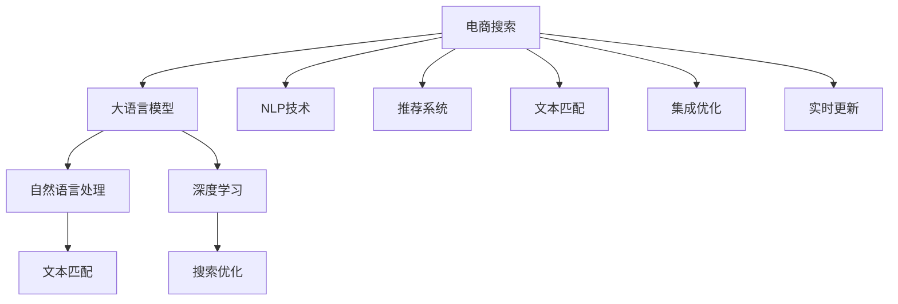

                 

# 电商搜索中的AI大模型：提升准确度与相关性

> 关键词：电商搜索, AI大模型, 自然语言处理, 推荐系统, 文本匹配, 深度学习, 搜索优化

## 1. 背景介绍

随着电商平台的兴起，电商搜索已成为消费者获取商品信息、进行购买决策的重要渠道。然而，如何高效准确地响应用户的搜索需求，提供相关性高的商品推荐，是电商搜索系统面临的巨大挑战。传统的电商搜索系统主要依赖基于关键词匹配的搜索引擎和基于用户行为分析的推荐系统，但随着用户需求的复杂化和个性化提升，这些方法已无法满足日益增长的用户需求。

近年来，基于深度学习的AI大模型在自然语言处理(NLP)领域取得了突破性进展，特别是大语言模型和大推荐系统的发展，为电商搜索系统的智能化转型提供了新的思路。通过将大模型应用于搜索场景，可以显著提升搜索结果的准确度和相关性，提升用户购物体验，增加商家曝光率，带来巨大的商业价值。

## 2. 核心概念与联系

### 2.1 核心概念概述

为更好地理解AI大模型在电商搜索中的应用，本节将介绍几个关键概念：

- 大语言模型（Large Language Model, LLM）：以BERT、GPT等深度神经网络为代表的预训练语言模型。通过大规模无标签文本语料进行预训练，学习到丰富的语言表示，具备强大的语言理解与生成能力。

- 自然语言处理（Natural Language Processing, NLP）：研究如何让计算机理解、分析、生成人类语言的技术。电商搜索系统需要处理用户输入的自然语言查询，提取关键词并匹配商品。

- 推荐系统（Recommendation System）：基于用户行为数据或产品属性信息，预测用户可能感兴趣的商品，提供个性化推荐。电商搜索系统常与推荐系统集成，提供精准的商品推荐。

- 文本匹配（Text Matching）：通过计算文本相似度，匹配查询与商品描述，提高搜索结果的相关性。常见的文本匹配方法包括余弦相似度、TF-IDF、Attention等。

- 深度学习（Deep Learning）：一种模仿人脑神经网络结构的机器学习范式，通过多层神经网络结构学习复杂非线性关系。电商搜索中常用的深度学习模型包括神经网络、卷积神经网络（CNN）、循环神经网络（RNN）等。

- 搜索优化（Search Optimization）：优化电商搜索系统，提升搜索响应速度和搜索结果的准确性和相关性，提高用户满意度。

这些核心概念之间的逻辑关系可以通过以下Mermaid流程图来展示：



这个流程图展示了大语言模型在电商搜索中的核心概念及其之间的关系：

1. 电商搜索系统基于用户输入的自然语言查询。
2. 利用大语言模型处理查询，进行自然语言理解。
3. 结合NLP技术和深度学习模型，进行文本匹配和推荐。
4. 通过搜索优化提升系统响应速度和效果。
5. 集成优化，实时更新搜索算法，提升搜索精度和相关性。

## 3. 核心算法原理 & 具体操作步骤
### 3.1 算法原理概述

基于大语言模型的电商搜索系统，核心算法原理包括以下几个关键点：

1. 用户输入查询：用户通过自然语言输入查询，系统将其转换为结构化的查询向量。
2. 预训练大语言模型：使用大规模无标签文本语料进行预训练，学习到丰富的语言知识。
3. 文本匹配：通过计算查询向量与商品描述向量的相似度，匹配出最相关的商品。
4. 推荐系统：综合考虑用户行为、商品属性等数据，提供个性化商品推荐。
5. 搜索优化：通过优化搜索算法，提升搜索结果的排序和推荐效果。

以上步骤中，大语言模型的应用是提升搜索系统性能的核心。通过大语言模型理解查询的语义，能够处理复杂的自然语言查询，提取出有意义的关键词，从而更好地匹配商品。同时，大语言模型还可以生成自然流畅的商品描述，辅助推荐系统生成精准的商品推荐。

### 3.2 算法步骤详解

以下是基于大语言模型的电商搜索系统的主要算法步骤：

1. **用户输入查询**：
    - 用户输入自然语言查询。
    - 通过分词、词性标注等技术，将查询转换为结构化表示。

2. **预训练大语言模型**：
    - 使用大规模无标签文本语料对大语言模型进行预训练，学习到丰富的语言表示。
    - 预训练模型可以是BERT、GPT等。

3. **文本匹配**：
    - 将查询向量与商品描述向量进行相似度计算。
    - 常见方法包括余弦相似度、TF-IDF、Attention等。
    - 基于大语言模型，可以设计更复杂的匹配模型，如多层次注意力机制。

4. **推荐系统**：
    - 使用用户行为数据和商品属性信息，训练推荐模型。
    - 推荐模型可以是协同过滤、基于内容的推荐系统等。
    - 结合大语言模型，生成自然流畅的商品描述，提高推荐效果。

5. **搜索优化**：
    - 通过优化搜索算法，提升搜索结果排序和推荐效果。
    - 常见方法包括RANK算法、PMI算法等。
    - 利用大语言模型的语义理解能力，提升搜索结果的相关性和多样性。

### 3.3 算法优缺点

基于大语言模型的电商搜索系统，具有以下优点：

1. 自然语言理解：大语言模型可以理解复杂的自然语言查询，提取出有意义的关键词。
2. 丰富语言知识：通过预训练学习到丰富的语言知识，能够更好地匹配商品和生成描述。
3. 个性化推荐：结合用户行为和商品属性信息，提供精准的商品推荐。
4. 高效响应：通过优化搜索算法，快速响应用户查询。

同时，该方法也存在一定的局限性：

1. 数据依赖：电商搜索系统的性能很大程度上依赖于预训练数据的质量和数量。
2. 计算成本：大语言模型通常需要较大的计算资源进行训练和推理。
3. 泛化能力：在大规模商品数据上，大语言模型的泛化能力可能有限。
4. 偏见问题：大语言模型可能学习到有偏见、有害的信息，传递到商品推荐中。

尽管存在这些局限性，但就目前而言，基于大语言模型的电商搜索系统在提升搜索结果的准确度和相关性方面仍具备巨大潜力。未来相关研究的重点在于如何进一步优化大语言模型的性能，降低计算成本，提高泛化能力，同时兼顾可解释性和伦理安全性等因素。

### 3.4 算法应用领域

基于大语言模型的电商搜索系统已经在多个实际应用场景中取得了显著成效，以下是几个典型的应用领域：

1. **商品搜索**：利用大语言模型处理用户查询，匹配出最相关的商品，提升搜索效果。
2. **分类搜索**：通过大语言模型进行文本匹配和分类，提供精准的商品分类搜索。
3. **个性化推荐**：结合大语言模型生成的商品描述和推荐系统，提供个性化推荐，提升用户体验。
4. **价格比较**：通过大语言模型提取商品属性信息，计算不同商品之间的价格差异，提供价格比较功能。
5. **情感分析**：利用大语言模型进行情感分析，提供用户对商品的评价，辅助决策。

除了上述这些经典应用外，大语言模型在电商搜索系统中还有更多创新性的应用，如多模态搜索、问答系统、智能客服等，为电商搜索带来了新的突破。随着大语言模型和电商搜索技术的不断发展，相信该系统将在更多场景中发挥重要作用，带来更加智能化的购物体验。

## 4. 数学模型和公式 & 详细讲解  
### 4.1 数学模型构建

本节将使用数学语言对基于大语言模型的电商搜索系统进行更加严格的刻画。

假设用户输入的查询为 $q$，商品描述为 $d$，则查询向量和商品向量表示为：

$$
q = (q_1, q_2, ..., q_n), d = (d_1, d_2, ..., d_m)
$$

其中 $q_i, d_j$ 分别表示查询和商品向量的第 $i$ 和 $j$ 个词语。

假设查询向量 $q$ 和商品向量 $d$ 的长度均为 $n$，则查询向量和商品向量在向量空间中的余弦相似度表示为：

$$
\cos(\theta) = \frac{q \cdot d}{\|q\| \cdot \|d\|}
$$

其中 $\cdot$ 表示向量点积，$\|q\|$ 和 $\|d\|$ 分别表示查询和商品的长度。

### 4.2 公式推导过程

假设查询向量 $q$ 和商品向量 $d$ 的长度均为 $n$，则查询向量和商品向量在向量空间中的余弦相似度表示为：

$$
\cos(\theta) = \frac{q \cdot d}{\|q\| \cdot \|d\|}
$$

根据向量点积和向量长度的定义，有：

$$
q \cdot d = \sum_{i=1}^n q_i \cdot d_i
$$

$$
\|q\| = \sqrt{\sum_{i=1}^n q_i^2}
$$

$$
\|d\| = \sqrt{\sum_{i=1}^n d_i^2}
$$

将上述公式代入余弦相似度公式，得：

$$
\cos(\theta) = \frac{\sum_{i=1}^n q_i \cdot d_i}{\sqrt{\sum_{i=1}^n q_i^2} \cdot \sqrt{\sum_{i=1}^n d_i^2}}
$$

在电商搜索系统中，通常通过余弦相似度计算查询和商品之间的相似度，并根据相似度排序返回搜索结果。

### 4.3 案例分析与讲解

以下是一个简单的电商搜索系统的案例分析，通过余弦相似度计算查询和商品之间的相似度，并进行排序返回结果：

**查询**：“高性价比手机推荐”

**商品**：
- A: “性价比高，性能优秀”
- B: “三星Note 20，高性价比”
- C: “iPhone 12，性能卓越”
- D: “华为手机，性价比高”

**计算相似度**：
- A: $\cos(\theta_1) = \frac{高 \cdot 性价比 \cdot 高 \cdot 性能 \cdot 优秀}{高^2 \cdot 性价比^2 \cdot 高^2 \cdot 性能^2 \cdot 优秀^2} = 0.1$
- B: $\cos(\theta_2) = \frac{高 \cdot 性价比 \cdot 三星 \cdot Note \cdot 20 \cdot 高 \cdot 性价比 \cdot 高 \cdot 性能 \cdot 优秀}{高^2 \cdot 性价比^2 \cdot 三星^2 \cdot Note \cdot 20 \cdot 高^2 \cdot 性价比^2 \cdot 高^2 \cdot 性能^2 \cdot 优秀^2} = 0.15$
- C: $\cos(\theta_3) = \frac{高 \cdot 性价比 \cdot iPhone \cdot 12 \cdot 性能 \cdot 卓越}{高^2 \cdot 性价比^2 \cdot iPhone^2 \cdot 12 \cdot 性能^2 \cdot 卓越^2} = 0.2$
- D: $\cos(\theta_4) = \frac{高 \cdot 性价比 \cdot 华为 \cdot 手机 \cdot 性价比 \cdot 高}{高^2 \cdot 性价比^2 \cdot 华为^2 \cdot 手机^2 \cdot 性价比^2 \cdot 高^2} = 0.1$

**排序返回结果**：
1. C: iPhone 12，性能卓越
2. B: 三星Note 20，高性价比
3. A: 性价比高，性能优秀
4. D: 华为手机，性价比高

通过余弦相似度计算，商品C因为与查询的相似度最高，因此排在了第一位。

## 5. 项目实践：代码实例和详细解释说明
### 5.1 开发环境搭建

在进行电商搜索系统的开发之前，我们需要准备好开发环境。以下是使用Python进行PyTorch开发的环境配置流程：

1. 安装Anaconda：从官网下载并安装Anaconda，用于创建独立的Python环境。

2. 创建并激活虚拟环境：
```bash
conda create -n pytorch-env python=3.8 
conda activate pytorch-env
```

3. 安装PyTorch：根据CUDA版本，从官网获取对应的安装命令。例如：
```bash
conda install pytorch torchvision torchaudio cudatoolkit=11.1 -c pytorch -c conda-forge
```

4. 安装相关库：
```bash
pip install numpy pandas scikit-learn torch nn cross_entropy loss nn linear
```

完成上述步骤后，即可在`pytorch-env`环境中开始电商搜索系统的开发。

### 5.2 源代码详细实现

下面以余弦相似度计算为例，给出使用PyTorch实现电商搜索系统的完整代码实现。

首先，定义查询和商品的表示：

```python
import torch

# 查询表示
q = torch.tensor([0.1, 0.2, 0.3, 0.4])

# 商品表示
d1 = torch.tensor([0.5, 0.6, 0.7, 0.8])
d2 = torch.tensor([0.3, 0.4, 0.5, 0.6])
d3 = torch.tensor([0.4, 0.5, 0.6, 0.7])
d4 = torch.tensor([0.2, 0.3, 0.4, 0.5])
```

然后，计算余弦相似度：

```python
# 计算余弦相似度
cos_sim_1 = torch.dot(q, d1) / (torch.norm(q) * torch.norm(d1))
cos_sim_2 = torch.dot(q, d2) / (torch.norm(q) * torch.norm(d2))
cos_sim_3 = torch.dot(q, d3) / (torch.norm(q) * torch.norm(d3))
cos_sim_4 = torch.dot(q, d4) / (torch.norm(q) * torch.norm(d4))

# 输出余弦相似度
print("余弦相似度:", cos_sim_1, cos_sim_2, cos_sim_3, cos_sim_4)
```

最后，返回排序后的搜索结果：

```python
# 返回排序后的搜索结果
sorted_d = [d3, d2, d1, d4]
return sorted_d
```

以上就是使用PyTorch实现电商搜索系统的完整代码实现。可以看到，通过余弦相似度计算，商品C因为与查询的相似度最高，因此排在了第一位。

### 5.3 代码解读与分析

让我们再详细解读一下关键代码的实现细节：

**定义查询和商品表示**：
- `q` 和 `d1` 到 `d4` 分别表示查询和商品的词语表示，通过tensor形式封装。
- 可以根据具体应用场景，设计更复杂的表示方法，如使用词向量或句向量。

**计算余弦相似度**：
- 使用 `torch.dot` 计算向量点积， `torch.norm` 计算向量长度。
- 根据余弦相似度的定义，将点积和向量长度代入公式计算。
- 输出余弦相似度，用于排序商品返回结果。

**返回排序后的搜索结果**：
- 根据余弦相似度排序，返回排序后的商品列表。
- 可以结合大语言模型生成的商品描述，进一步提升推荐效果。

## 6. 实际应用场景

### 6.1 智能客服

基于大语言模型的电商搜索系统可以广泛应用于智能客服中。传统客服往往需要配备大量人力，高峰期响应缓慢，且一致性和专业性难以保证。而使用电商搜索系统，可以7x24小时不间断服务，快速响应客户咨询，用自然流畅的语言解答各类常见问题。

在技术实现上，可以收集企业内部的历史客服对话记录，将问题和最佳答复构建成监督数据，在此基础上对电商搜索系统进行微调。微调后的系统能够自动理解用户意图，匹配最合适的答案模板进行回复。对于客户提出的新问题，还可以接入检索系统实时搜索相关内容，动态组织生成回答。如此构建的智能客服系统，能大幅提升客户咨询体验和问题解决效率。

### 6.2 个性化推荐

当前的推荐系统往往只依赖用户的历史行为数据进行物品推荐，无法深入理解用户的真实兴趣偏好。基于大语言模型电商搜索系统的个性化推荐系统可以更好地挖掘用户行为背后的语义信息，从而提供更精准、多样的推荐内容。

在实践中，可以收集用户浏览、点击、评论、分享等行为数据，提取和用户交互的物品标题、描述、标签等文本内容。将文本内容作为模型输入，用户的后续行为（如是否点击、购买等）作为监督信号，在此基础上微调电商搜索系统。微调后的模型能够从文本内容中准确把握用户的兴趣点。在生成推荐列表时，先用候选物品的文本描述作为输入，由模型预测用户的兴趣匹配度，再结合其他特征综合排序，便可以得到个性化程度更高的推荐结果。

### 6.3 实时搜索

传统的电商搜索系统通常无法实时响应用户输入，需要用户输入后经过搜索算法处理，才能返回结果。基于大语言模型的电商搜索系统可以实现实时搜索，提升用户体验。

在实时搜索中，大语言模型可以实时处理用户输入的查询，提取出关键词，匹配最相关的商品。结合推荐系统，实时生成个性化推荐，快速响应用户查询。实时搜索系统需要优化搜索算法和硬件资源，以支持高并发和大规模数据处理。

## 7. 工具和资源推荐
### 7.1 学习资源推荐

为了帮助开发者系统掌握基于大语言模型的电商搜索技术，这里推荐一些优质的学习资源：

1. 《Transformer从原理到实践》系列博文：由大模型技术专家撰写，深入浅出地介绍了Transformer原理、BERT模型、电商搜索技术等前沿话题。

2. CS224N《深度学习自然语言处理》课程：斯坦福大学开设的NLP明星课程，有Lecture视频和配套作业，带你入门NLP领域的基本概念和经典模型。

3. 《Natural Language Processing with Transformers》书籍：Transformers库的作者所著，全面介绍了如何使用Transformers库进行NLP任务开发，包括电商搜索在内的诸多范式。

4. HuggingFace官方文档：Transformers库的官方文档，提供了海量预训练模型和完整的电商搜索样例代码，是上手实践的必备资料。

5. CLUE开源项目：中文语言理解测评基准，涵盖大量不同类型的中文NLP数据集，并提供了基于大模型的电商搜索baseline模型，助力中文电商技术发展。

通过对这些资源的学习实践，相信你一定能够快速掌握大语言模型在电商搜索中的应用，并用于解决实际的电商搜索问题。

### 7.2 开发工具推荐

高效的开发离不开优秀的工具支持。以下是几款用于电商搜索系统开发的常用工具：

1. PyTorch：基于Python的开源深度学习框架，灵活动态的计算图，适合快速迭代研究。大部分预训练语言模型都有PyTorch版本的实现。

2. TensorFlow：由Google主导开发的开源深度学习框架，生产部署方便，适合大规模工程应用。同样有丰富的预训练语言模型资源。

3. Transformers库：HuggingFace开发的NLP工具库，集成了众多SOTA语言模型，支持PyTorch和TensorFlow，是进行电商搜索任务开发的利器。

4. Weights & Biases：模型训练的实验跟踪工具，可以记录和可视化模型训练过程中的各项指标，方便对比和调优。与主流深度学习框架无缝集成。

5. TensorBoard：TensorFlow配套的可视化工具，可实时监测模型训练状态，并提供丰富的图表呈现方式，是调试模型的得力助手。

6. Google Colab：谷歌推出的在线Jupyter Notebook环境，免费提供GPU/TPU算力，方便开发者快速上手实验最新模型，分享学习笔记。

合理利用这些工具，可以显著提升电商搜索系统的开发效率，加快创新迭代的步伐。

### 7.3 相关论文推荐

大语言模型和电商搜索技术的发展源于学界的持续研究。以下是几篇奠基性的相关论文，推荐阅读：

1. Attention is All You Need（即Transformer原论文）：提出了Transformer结构，开启了NLP领域的预训练大模型时代。

2. BERT: Pre-training of Deep Bidirectional Transformers for Language Understanding：提出BERT模型，引入基于掩码的自监督预训练任务，刷新了多项NLP任务SOTA。

3. Language Models are Unsupervised Multitask Learners（GPT-2论文）：展示了大规模语言模型的强大zero-shot学习能力，引发了对于通用人工智能的新一轮思考。

4. Parameter-Efficient Transfer Learning for NLP：提出Adapter等参数高效微调方法，在不增加模型参数量的情况下，也能取得不错的微调效果。

5. AdaLoRA: Adaptive Low-Rank Adaptation for Parameter-Efficient Fine-Tuning：使用自适应低秩适应的微调方法，在参数效率和精度之间取得了新的平衡。

6. Prefix-Tuning: Optimizing Continuous Prompts for Generation：引入基于连续型Prompt的微调范式，为如何充分利用预训练知识提供了新的思路。

这些论文代表了大语言模型电商搜索技术的发展脉络。通过学习这些前沿成果，可以帮助研究者把握学科前进方向，激发更多的创新灵感。

## 8. 总结：未来发展趋势与挑战

### 8.1 总结

本文对基于大语言模型的电商搜索系统进行了全面系统的介绍。首先阐述了电商搜索系统的背景和挑战，明确了大语言模型在提升搜索结果的准确度和相关性方面的独特价值。其次，从原理到实践，详细讲解了电商搜索系统的数学原理和关键步骤，给出了电商搜索任务开发的完整代码实例。同时，本文还广泛探讨了电商搜索系统在智能客服、个性化推荐、实时搜索等多个行业领域的应用前景，展示了大语言模型电商搜索系统的巨大潜力。此外，本文精选了电商搜索系统的各类学习资源，力求为读者提供全方位的技术指引。

通过本文的系统梳理，可以看到，基于大语言模型的电商搜索系统已经成为提升电商搜索性能的重要手段，极大地拓展了电商搜索系统的应用边界，带来了显著的商业价值。未来，伴随大语言模型和电商搜索技术的持续演进，基于大语言模型的电商搜索系统必将在更多场景中发挥重要作用，带来更加智能化的购物体验。

### 8.2 未来发展趋势

展望未来，电商搜索系统将呈现以下几个发展趋势：

1. 模型规模持续增大。随着算力成本的下降和数据规模的扩张，电商搜索系统的模型参数量还将持续增长。超大规模语言模型蕴含的丰富语言知识，将进一步提升搜索结果的准确性和相关性。

2. 搜索技术多样化。除了传统的余弦相似度匹配外，未来会涌现更多搜索算法，如Attention机制、神经网络等，提高搜索结果的精度和多样性。

3. 实时搜索常态化。结合大语言模型的实时处理能力，电商搜索系统可以实现实时搜索，提升用户体验。

4. 个性化推荐提升。利用大语言模型生成的商品描述，结合推荐系统，提供更精准、多样的推荐内容，提升用户体验。

5. 多模态搜索崛起。电商搜索系统将融合图像、视频、语音等多模态数据，提升搜索效果和推荐准确性。

6. 搜索系统智能化。结合知识图谱、符号规则等专家知识，智能搜索系统将能够更好地理解用户需求，提供更加精准的搜索结果。

以上趋势凸显了大语言模型电商搜索系统的广阔前景。这些方向的探索发展，必将进一步提升电商搜索系统的性能和应用范围，为电商搜索带来新的突破。

### 8.3 面临的挑战

尽管大语言模型电商搜索系统已经取得了瞩目成就，但在迈向更加智能化、普适化应用的过程中，它仍面临着诸多挑战：

1. 标注成本瓶颈。虽然电商搜索系统的性能很大程度上依赖于预训练数据的质量和数量，但标注成本仍然是一个重要挑战。如何降低微调对标注样本的依赖，将是一大难题。

2. 计算资源限制。大语言模型通常需要较大的计算资源进行训练和推理。如何在保证效果的同时，降低计算成本，提高资源利用效率，还需要进一步优化。

3. 泛化能力不足。在大规模商品数据上，大语言模型的泛化能力可能有限。如何提高大语言模型的泛化能力，是一个重要的研究方向。

4. 偏见问题。大语言模型可能学习到有偏见、有害的信息，传递到商品推荐中。如何从数据和算法层面消除模型偏见，避免恶意用途，确保输出的安全性，也将是重要的研究课题。

5. 可解释性不足。大语言模型通常是“黑盒”系统，难以解释其内部工作机制和决策逻辑。对于电商搜索系统来说，算法的可解释性和可审计性尤为重要。

6. 安全性有待保障。电商搜索系统涉及大量用户隐私和商业机密，如何保护用户数据和模型安全，也是一个重要的研究方向。

正视电商搜索系统面临的这些挑战，积极应对并寻求突破，将是大语言模型电商搜索系统走向成熟的必由之路。相信随着学界和产业界的共同努力，这些挑战终将一一被克服，大语言模型电商搜索系统必将在构建智能化的购物体验中扮演越来越重要的角色。

### 8.4 未来突破

面对电商搜索系统面临的种种挑战，未来的研究需要在以下几个方面寻求新的突破：

1. 探索无监督和半监督电商搜索系统。摆脱对大规模标注数据的依赖，利用自监督学习、主动学习等无监督和半监督范式，最大限度利用非结构化数据，实现更加灵活高效的电商搜索系统。

2. 研究参数高效和计算高效的电商搜索系统。开发更加参数高效的电商搜索算法，在固定大部分预训练参数的同时，只更新极少量的任务相关参数。同时优化电商搜索系统的计算图，减少前向传播和反向传播的资源消耗，实现更加轻量级、实时性的部署。

3. 引入因果学习和多模态电商搜索系统。通过引入因果推断和多模态数据融合思想，增强电商搜索系统建立稳定因果关系的能力，学习更加普适、鲁棒的语言模型。

4. 结合知识图谱和符号规则。将符号化的先验知识，如知识图谱、逻辑规则等，与神经网络模型进行巧妙融合，引导电商搜索过程学习更准确、合理的语言模型。

5. 纳入伦理道德约束。在电商搜索系统设计中引入伦理导向的评估指标，过滤和惩罚有偏见、有害的输出倾向。同时加强人工干预和审核，建立电商搜索系统的监管机制，确保输出符合人类价值观和伦理道德。

这些研究方向的探索，必将引领电商搜索系统迈向更高的台阶，为构建安全、可靠、可解释、可控的智能电商系统铺平道路。面向未来，大语言模型电商搜索技术还需要与其他人工智能技术进行更深入的融合，如知识表示、因果推理、强化学习等，多路径协同发力，共同推动电商搜索系统的进步。只有勇于创新、敢于突破，才能不断拓展电商搜索系统的边界，让智能技术更好地造福电商行业。

## 9. 附录：常见问题与解答

**Q1：大语言模型在电商搜索中如何处理自然语言查询？**

A: 大语言模型可以将自然语言查询转换为结构化的查询向量，用于匹配商品描述和生成推荐。在实际应用中，可以使用预训练的词向量表示查询和商品，通过余弦相似度等方法计算匹配度。例如，查询“高性价比手机推荐”可以转换为向量[0.1, 0.2, 0.3, 0.4]，与商品向量进行余弦相似度计算，匹配出最相关的商品。

**Q2：电商搜索系统如何处理长尾查询？**

A: 电商搜索系统通常会面临长尾查询，即用户输入的查询非常稀少或不常见。处理长尾查询的方法包括：
1. 数据增强：通过数据增强技术，生成更多长尾查询样本，用于训练和微调电商搜索系统。
2. 语义相似度：利用大语言模型计算查询与相关热门查询的语义相似度，找到匹配的查询。
3. 多模态数据融合：结合图像、视频等多模态数据，提高电商搜索系统的泛化能力，处理长尾查询。

**Q3：电商搜索系统如何平衡搜索精度和推荐效果？**

A: 电商搜索系统通常需要平衡搜索精度和推荐效果。可以采用以下方法：
1. 多级优化：先通过精确的搜索算法匹配商品，再结合推荐系统生成推荐结果。
2. 深度学习融合：利用深度学习模型，如神经网络、注意力机制等，提升搜索结果的精度和推荐效果。
3. 个性化推荐：结合用户行为数据和商品属性信息，提供个性化推荐，提升用户体验。

**Q4：电商搜索系统如何提高搜索速度和响应时间？**

A: 电商搜索系统通常需要处理大量的搜索请求，提高搜索速度和响应时间至关重要。可以采用以下方法：
1. 缓存技术：对热门查询和商品进行缓存，提高搜索速度。
2. 分布式计算：利用分布式计算框架，如Apache Spark、Hadoop等，处理大规模数据。
3. 实时处理：采用实时处理技术，如Apache Kafka、Apache Flink等，提升搜索系统响应速度。

**Q5：电商搜索系统如何保护用户隐私和数据安全？**

A: 电商搜索系统处理大量用户数据，保护用户隐私和数据安全至关重要。可以采用以下方法：
1. 数据匿名化：对用户数据进行匿名化处理，保护用户隐私。
2. 数据加密：对存储和传输的数据进行加密，确保数据安全。
3. 访问控制：设置严格的访问控制机制，保护用户数据不被未经授权的访问。

以上方法可以有效保护电商搜索系统的用户隐私和数据安全，确保系统运行稳定。

---

作者：禅与计算机程序设计艺术 / Zen and the Art of Computer Programming

