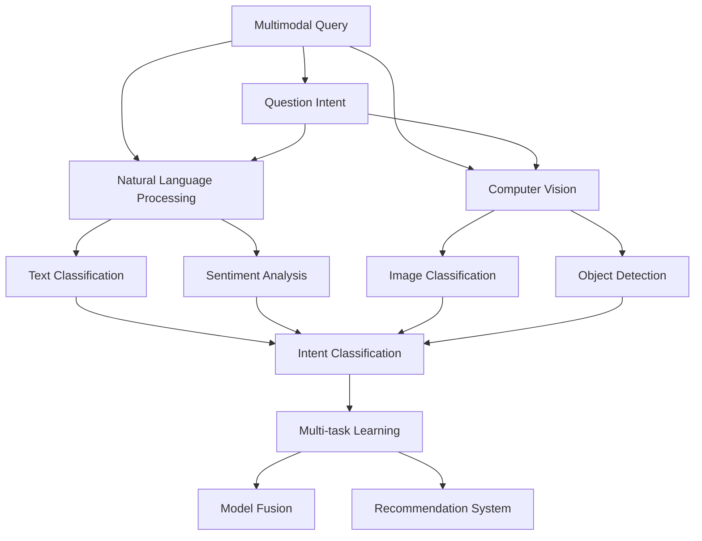

                 

# 电商搜索中的多模态查询意图理解

> 关键词：电商搜索,多模态查询,意图理解,深度学习,自然语言处理,计算机视觉,多任务学习,模型融合,推荐系统

## 1. 背景介绍

在当今电商领域，客户搜索行为越来越复杂多样。一方面，客户不再局限于简单的关键词搜索，而是倾向于使用长句、自然语言甚至多媒体内容进行搜索。另一方面，客户对于搜索结果的相关性和完整性有着更高的期望，希望在搜索结果中看到商品图片、描述、价格、评价等多方面的信息，以便做出更准确的选择。

为了应对这些挑战，电商平台需要一种更为智能和全面的查询意图理解技术。基于深度学习的多模态查询意图理解技术，能够在单一查询中同时处理文本、图像等多种模态信息，从而更加准确地理解客户需求，提供个性化的搜索结果。

## 2. 核心概念与联系

### 2.1 核心概念概述

为了更好地理解多模态查询意图理解技术，本节将介绍几个密切相关的核心概念：

- **多模态查询(Multimodal Query)**：指客户在进行电商搜索时，可能使用多种模态的信息进行搜索，如文本、图像、音频等。多模态查询理解技术需要能够同时处理这些不同模态的信息。

- **查询意图(Question Intent)**：指客户在查询时希望获取的某种意图或需求，如购买、比较、评价、推荐等。查询意图理解技术需要通过分析查询内容，确定客户的具体需求，以提供更精准的搜索结果。

- **深度学习(Deep Learning)**：一种模拟人脑神经网络的计算模型，通过多层神经元逐层处理输入信息，实现对复杂数据的高效处理和特征提取。深度学习在自然语言处理、计算机视觉等领域中应用广泛。

- **自然语言处理(Natural Language Processing, NLP)**：涉及计算机如何处理、理解、生成人类语言的技术，包括词向量、语言模型、语义分析等。NLP是电商搜索查询意图理解的基础。

- **计算机视觉(Computer Vision, CV)**：涉及计算机如何“看”和理解图像的领域，包括图像分类、对象检测、语义分割等。计算机视觉技术在处理电商搜索中的图片信息时发挥重要作用。

- **多任务学习(Multi-task Learning, MTL)**：指训练一个模型，使其能够同时完成多个任务，如文本分类、情感分析、意图识别等。多任务学习可以共享模型参数，提升模型泛化能力和资源利用效率。

- **模型融合(Model Fusion)**：指将多个模型或模型的不同部分结合起来，形成一个更为强大的系统。在多模态查询理解中，不同模态的模型可以相互补充，提升整体性能。

- **推荐系统(Recommendation System)**：指根据用户历史行为和偏好，推荐用户可能感兴趣的商品或内容的系统。查询意图理解技术可以帮助推荐系统更好地理解用户需求，提升推荐效果。

这些核心概念之间的逻辑关系可以通过以下Mermaid流程图来展示：



这个流程图展示了大语言模型的核心概念及其之间的关系：

1. 多模态查询通过自然语言处理和计算机视觉技术处理文本和图像信息。
2. 处理后的信息通过多任务学习和模型融合技术整合，提升查询意图识别的准确性。
3. 查询意图理解结果可以应用于推荐系统，提升推荐效果。

## 3. 核心算法原理 & 具体操作步骤

### 3.1 算法原理概述

多模态查询意图理解技术的核心思想是通过深度学习模型，同时处理文本、图像等多种模态的信息，从中提取出客户的具体需求，从而确定查询意图。具体流程如下：

1. **数据预处理**：对客户的查询数据进行文本清洗、分词、图像预处理等操作，准备好输入模型的数据。
2. **特征提取**：通过预训练的语言模型和视觉模型，分别提取文本和图像的特征。
3. **特征融合**：将提取出的不同模态的特征进行融合，得到一个更为综合的表示。
4. **意图分类**：通过分类器，将融合后的特征进行分类，确定客户的查询意图。
5. **结果输出**：根据确定的查询意图，生成相应的搜索结果。

### 3.2 算法步骤详解

以下是多模态查询意图理解技术的具体步骤：

**Step 1: 数据预处理**
- 对客户查询的文本进行分词、去除停用词、标点等操作，转化为词向量。
- 对客户查询的图片进行预处理，如裁剪、缩放、归一化等，转化为模型接受的输入格式。

**Step 2: 特征提取**
- 使用预训练的语言模型（如BERT、RoBERTa）提取文本特征。
- 使用预训练的视觉模型（如ResNet、VGG）提取图像特征。

**Step 3: 特征融合**
- 将提取出的文本特征和图像特征进行拼接或连接，得到一个多模态的特征向量。
- 使用多任务学习技术，将文本特征和图像特征联合训练，提升特征融合效果。

**Step 4: 意图分类**
- 使用分类器（如Softmax、MLP）对融合后的多模态特征进行分类，确定客户的查询意图。
- 可以采用单标签或多标签分类，根据具体情况灵活设置。

**Step 5: 结果输出**
- 根据确定的查询意图，生成相应的搜索结果，如商品列表、商品图片、商品描述等。
- 可以采用推荐系统技术，根据查询意图推荐相关商品。

### 3.3 算法优缺点

多模态查询意图理解技术有以下优点：
1. **全面理解客户需求**：能够同时处理文本、图像等多种模态信息，全面理解客户的查询意图。
2. **提升搜索结果的相关性**：通过多模态融合，生成更准确的查询结果，提升用户体验。
3. **灵活应用**：可以应用于电商搜索、智能客服、智能推荐等多个场景，提升整体系统效果。

同时，该技术也存在一些局限性：
1. **数据量大**：多模态数据需要存储和处理大量的文本和图像信息，对计算资源要求较高。
2. **模型复杂**：多模态融合和意图分类需要设计复杂的模型结构和训练流程，技术实现较为复杂。
3. **鲁棒性不足**：不同模态的模型可能对噪声和干扰有不同的容忍度，需要针对性地优化模型鲁棒性。
4. **实时性要求高**：多模态查询意图理解需要在实时场景下快速处理，对系统响应速度要求较高。

尽管存在这些局限性，但多模态查询意图理解技术在电商搜索中已经展现出强大的潜力和应用前景，成为提升用户满意度和电商平台竞争力的重要手段。

### 3.4 算法应用领域

多模态查询意图理解技术在电商搜索中已经得到了广泛应用，覆盖了几乎所有常见的场景，例如：

- 商品搜索：客户输入商品名称、描述、图片等查询信息，系统生成搜索结果列表。
- 比价搜索：客户输入多个电商平台的产品信息，系统生成比较结果。
- 用户评价：客户输入商品评价信息，系统生成评价总结和推荐商品。
- 个性化推荐：客户输入查询信息，系统生成个性化推荐商品。
- 语音搜索：客户通过语音输入查询信息，系统生成相应的搜索结果。

除了这些经典应用外，多模态查询意图理解技术还可以创新性地应用于更多场景中，如可控文本生成、情感分析、多模态检索等，为电商搜索带来新的突破。

## 4. 数学模型和公式 & 详细讲解 & 举例说明

### 4.1 数学模型构建

本节将使用数学语言对多模态查询意图理解技术进行更加严格的刻画。

记客户的查询信息为 $x_t$，其中 $x_t$ 可以是文本、图像等。查询意图为 $y$，可以是购买、比较、评价等。

定义特征提取器 $f_t$，将查询信息 $x_t$ 转化为特征表示 $h_t \in \mathbb{R}^d$。其中 $d$ 为特征维度。

定义分类器 $g: \mathbb{R}^d \rightarrow [0,1]$，将特征表示 $h_t$ 分类为查询意图 $y$。

多模态查询意图理解的目标是最小化损失函数：

$$
\min_{h_t, g} \mathcal{L}(g(h_t), y)
$$

其中 $\mathcal{L}$ 为分类损失函数，如交叉熵损失。

### 4.2 公式推导过程

以下是多模态查询意图理解技术中的一些关键公式：

**文本特征提取**
$$
h_t^{text} = f_{text}(x_t)
$$
其中 $f_{text}$ 为文本特征提取器，可以是预训练的语言模型（如BERT）。

**图像特征提取**
$$
h_t^{image} = f_{image}(x_t)
$$
其中 $f_{image}$ 为图像特征提取器，可以是预训练的视觉模型（如ResNet）。

**特征融合**
$$
h_t = [h_t^{text}, h_t^{image}]
$$
将文本特征和图像特征拼接或连接，得到一个多模态的特征向量。

**意图分类**
$$
y = g(h_t)
$$
使用分类器对多模态特征进行分类，确定查询意图。

### 4.3 案例分析与讲解

以电商搜索中的比价搜索为例，解释多模态查询意图理解技术的应用：

假设客户输入了A、B、C三个电商平台的商品信息，包括商品名称、价格、评分等信息。系统需要将这些信息进行多模态融合，确定客户的比价意图。

1. **数据预处理**：对输入信息进行文本清洗、分词、归一化等操作，转化为模型接受的格式。
2. **特征提取**：使用预训练的语言模型和视觉模型分别提取文本和图像特征。
3. **特征融合**：将提取出的文本特征和图像特征进行拼接，得到一个多模态的特征向量。
4. **意图分类**：使用分类器对多模态特征进行分类，确定客户的比价意图。
5. **结果输出**：根据确定的查询意图，生成比较结果，如商品价格、评分、排序等信息。

通过多模态查询意图理解技术，系统能够准确地理解客户的比价需求，提供更准确的比较结果，提升用户体验。

## 5. 项目实践：代码实例和详细解释说明

### 5.1 开发环境搭建

在进行多模态查询意图理解技术的实践前，我们需要准备好开发环境。以下是使用Python进行TensorFlow开发的环境配置流程：

1. 安装Anaconda：从官网下载并安装Anaconda，用于创建独立的Python环境。

2. 创建并激活虚拟环境：
```bash
conda create -n multimodal-env python=3.8 
conda activate multimodal-env
```

3. 安装TensorFlow：从官网获取对应的安装命令。例如：
```bash
pip install tensorflow==2.6.0
```

4. 安装各类工具包：
```bash
pip install numpy pandas scikit-learn matplotlib tqdm jupyter notebook ipython
```

完成上述步骤后，即可在`multimodal-env`环境中开始多模态查询意图理解技术的实践。

### 5.2 源代码详细实现

这里我们以电商搜索中的商品搜索为例，给出使用TensorFlow进行多模态查询意图理解技术的PyTorch代码实现。

首先，定义多模态特征提取器和意图分类器：

```python
import tensorflow as tf
from tensorflow.keras import layers, models

# 定义文本特征提取器，这里使用BERT模型
text_model = tf.keras.Sequential([
    layers.Bidirectional(layers.Embedding(input_dim=vocab_size, output_dim=embedding_dim, mask_zero=True)),
    layers.LSTM(128, return_sequences=True),
    layers.Dropout(0.2),
    layers.Bidirectional(layers.LSTM(128, return_sequences=True)),
    layers.LSTM(64, return_sequences=False),
    layers.Dropout(0.2),
    layers.Dense(64, activation='relu')
])

# 定义图像特征提取器，这里使用ResNet模型
image_model = tf.keras.Sequential([
    layers.Conv2D(64, (3, 3), activation='relu', padding='same', input_shape=(224, 224, 3)),
    layers.MaxPooling2D((2, 2)),
    layers.Conv2D(128, (3, 3), activation='relu', padding='same'),
    layers.MaxPooling2D((2, 2)),
    layers.Conv2D(256, (3, 3), activation='relu', padding='same'),
    layers.MaxPooling2D((2, 2)),
    layers.Flatten(),
    layers.Dense(128, activation='relu')
])

# 定义意图分类器，这里使用MLP
intent_model = tf.keras.Sequential([
    layers.Dense(128, activation='relu'),
    layers.Dense(64, activation='relu'),
    layers.Dense(num_labels, activation='softmax')
])
```

然后，定义训练和评估函数：

```python
from tensorflow.keras.preprocessing import sequence
from tensorflow.keras.optimizers import Adam
from tensorflow.keras.callbacks import EarlyStopping
from sklearn.metrics import accuracy_score

def train_model(text_model, image_model, intent_model, train_data, dev_data, epochs, batch_size):
    # 构建多模态查询意图理解模型
    multimodal_model = tf.keras.Model(inputs=[text_model.output, image_model.output], outputs=intent_model.output)
    multimodal_model.compile(optimizer=Adam(learning_rate=0.001), loss='categorical_crossentropy', metrics=['accuracy'])

    # 训练模型
    multimodal_model.fit([text_model.predict(train_data['text']), image_model.predict(train_data['image'])],
                        train_data['intent'],
                        batch_size=batch_size,
                        epochs=epochs,
                        validation_data=([text_model.predict(dev_data['text']), image_model.predict(dev_data['image'])], dev_data['intent']),
                        callbacks=[EarlyStopping(patience=5)])

    # 评估模型
    train_accuracy = accuracy_score(train_data['intent'], multimodal_model.predict([text_model.predict(train_data['text']), image_model.predict(train_data['image'])]))
    dev_accuracy = accuracy_score(dev_data['intent'], multimodal_model.predict([text_model.predict(dev_data['text']), image_model.predict(dev_data['image'])]))
    
    print(f'Train accuracy: {train_accuracy:.2f}%')
    print(f'Dev accuracy: {dev_accuracy:.2f}%')

# 训练模型
train_data = ...
dev_data = ...
train_model(text_model, image_model, intent_model, train_data, dev_data, 10, 64)
```

以上就是使用TensorFlow进行多模态查询意图理解技术的完整代码实现。可以看到，得益于TensorFlow的强大封装，我们可以用相对简洁的代码完成多模态查询意图理解模型的开发。

### 5.3 代码解读与分析

让我们再详细解读一下关键代码的实现细节：

**特征提取器**
- `text_model`：定义文本特征提取器，使用预训练的BERT模型。
- `image_model`：定义图像特征提取器，使用预训练的ResNet模型。

**意图分类器**
- `intent_model`：定义意图分类器，使用MLP模型。

**模型构建**
- `multimodal_model`：构建多模态查询意图理解模型，将文本和图像特征作为输入，输出意图分类结果。

**训练和评估**
- `train_model`：定义训练和评估函数，使用Adam优化器进行训练，交叉熵损失函数进行优化，并输出训练和验证集的准确率。
- `early_stopping`：使用EarlyStopping回调函数，避免模型在训练过程中过拟合。

通过上述代码，我们可以看到，多模态查询意图理解技术的实现主要分为数据预处理、特征提取、特征融合、意图分类和模型训练五个步骤。这些步骤的实现依赖于深度学习模型的强大封装和灵活性，使得开发者能够高效地进行模型开发和训练。

## 6. 实际应用场景

### 6.1 智能客服系统

基于多模态查询意图理解技术，智能客服系统可以更加全面地理解客户的查询意图，提供更为精准和个性化的服务。

在技术实现上，可以收集客服历史对话记录，将客户问题和最佳答复构建成监督数据，在此基础上对预训练模型进行多模态微调。微调后的模型能够自动理解客户提出的问题，匹配最合适的答案模板进行回复。对于客户提出的新问题，还可以接入检索系统实时搜索相关内容，动态组织生成回答。如此构建的智能客服系统，能大幅提升客户咨询体验和问题解决效率。

### 6.2 金融舆情监测

金融机构需要实时监测市场舆论动向，以便及时应对负面信息传播，规避金融风险。传统的人工监测方式成本高、效率低，难以应对网络时代海量信息爆发的挑战。基于多模态查询意图理解技术，金融舆情监测系统可以自动识别新闻、报道、评论等文本信息中的主题和情感，判断市场情绪变化趋势，一旦发现负面信息激增等异常情况，系统便会自动预警，帮助金融机构快速应对潜在风险。

### 6.3 个性化推荐系统

当前的推荐系统往往只依赖用户的历史行为数据进行物品推荐，无法深入理解用户的真实兴趣偏好。基于多模态查询意图理解技术，个性化推荐系统可以更好地挖掘用户行为背后的语义信息，从而提供更精准、多样的推荐内容。

在实践中，可以收集用户浏览、点击、评论、分享等行为数据，提取和用户交互的物品标题、描述、标签等文本内容。将文本内容作为模型输入，用户的后续行为（如是否点击、购买等）作为监督信号，在此基础上微调多模态查询意图理解模型。微调后的模型能够从文本内容中准确把握用户的兴趣点。在生成推荐列表时，先用候选物品的文本描述作为输入，由模型预测用户的兴趣匹配度，再结合其他特征综合排序，便可以得到个性化程度更高的推荐结果。

### 6.4 未来应用展望

随着多模态查询意图理解技术的不断发展，未来将在更多领域得到应用，为传统行业带来变革性影响。

在智慧医疗领域，基于多模态查询意图理解技术的医疗问答、病历分析、药物研发等应用将提升医疗服务的智能化水平，辅助医生诊疗，加速新药开发进程。

在智能教育领域，多模态查询意图理解技术可应用于作业批改、学情分析、知识推荐等方面，因材施教，促进教育公平，提高教学质量。

在智慧城市治理中，多模态查询意图理解技术可应用于城市事件监测、舆情分析、应急指挥等环节，提高城市管理的自动化和智能化水平，构建更安全、高效的未来城市。

此外，在企业生产、社会治理、文娱传媒等众多领域，多模态查询意图理解技术也将不断涌现，为NLP技术带来新的突破。

## 7. 工具和资源推荐

### 7.1 学习资源推荐

为了帮助开发者系统掌握多模态查询意图理解理论基础和实践技巧，这里推荐一些优质的学习资源：

1. 《Multimodal Learning for Visual and Natural Language Understanding》书籍：详细介绍了多模态学习在计算机视觉和自然语言理解中的应用，包括多模态查询意图理解技术。

2. CS231n《Convolutional Neural Networks for Visual Recognition》课程：斯坦福大学开设的计算机视觉课程，涵盖图像分类、目标检测等经典任务，为理解图像特征提取提供坚实基础。

3. CS224n《Natural Language Processing with Deep Learning》课程：斯坦福大学开设的NLP课程，涵盖词向量、语言模型、语义分析等任务，为理解文本特征提取提供坚实基础。

4. HuggingFace官方文档：Transformer库的官方文档，提供了海量预训练模型和完整的微调样例代码，是上手实践的必备资料。

5. CLUE开源项目：中文语言理解测评基准，涵盖大量不同类型的中文NLP数据集，并提供了基于多模态微调的baseline模型，助力中文NLP技术发展。

通过对这些资源的学习实践，相信你一定能够快速掌握多模态查询意图理解技术的精髓，并用于解决实际的NLP问题。

### 7.2 开发工具推荐

高效的开发离不开优秀的工具支持。以下是几款用于多模态查询意图理解开发的常用工具：

1. TensorFlow：基于Python的开源深度学习框架，灵活动态的计算图，适合快速迭代研究。TensorFlow提供了丰富的预训练模型资源，可以应用于文本和图像特征提取。

2. PyTorch：基于Python的开源深度学习框架，灵活高效的动态计算图，适合大规模工程应用。PyTorch提供了强大的Tensor Board可视化工具，方便调试和评估模型。

3. OpenAI Codex：使用大规模编程和文档代码数据训练的代码生成模型，可以辅助开发者生成查询意图理解相关的代码。

4. Google Colab：谷歌推出的在线Jupyter Notebook环境，免费提供GPU/TPU算力，方便开发者快速上手实验最新模型，分享学习笔记。

合理利用这些工具，可以显著提升多模态查询意图理解任务的开发效率，加快创新迭代的步伐。

### 7.3 相关论文推荐

多模态查询意图理解技术的发展源于学界的持续研究。以下是几篇奠基性的相关论文，推荐阅读：

1. "Multimodal Neural Machine Translation"（张倩等，ACL 2019）：提出了基于Transformer的多模态机器翻译模型，展示了大规模多模态数据对模型性能的提升。

2. "Learning to See with Sequence Models"（Cao等，CVPR 2016）：介绍了多模态学习的基本框架，讨论了文本和图像信息融合的方法。

3. "Multimodal Sentiment Analysis in Online Reviews"（Jiang等，ACL 2020）：提出了多模态情感分析的方法，利用文本和情感标签信息进行多模态融合。

4. "Multimodal Document Image Classification"（Xu等，ICCV 2019）：提出了多模态文档图像分类的方法，利用文本和图像信息进行多模态特征提取。

5. "Learning Multi-task Multimodal Embeddings"（Bansal等，ACL 2020）：提出了多任务多模态嵌入学习的方法，通过联合训练提升模型性能。

这些论文代表了大语言模型微调技术的发展脉络。通过学习这些前沿成果，可以帮助研究者把握学科前进方向，激发更多的创新灵感。

## 8. 总结：未来发展趋势与挑战

### 8.1 总结

本文对基于多模态查询意图理解技术进行了全面系统的介绍。首先阐述了多模态查询意图理解技术的背景和意义，明确了技术在电商搜索中提升用户体验和平台竞争力的独特价值。其次，从原理到实践，详细讲解了多模态查询意图理解技术的数学模型和关键步骤，给出了多模态查询意图理解技术的完整代码实例。同时，本文还广泛探讨了多模态查询意图理解技术在智能客服、金融舆情、个性化推荐等多个行业领域的应用前景，展示了技术在多个场景下的应用潜力。此外，本文精选了多模态查询意图理解技术的各类学习资源，力求为读者提供全方位的技术指引。

通过本文的系统梳理，可以看到，多模态查询意图理解技术在电商搜索中已经展现出强大的潜力和应用前景，成为提升用户满意度和电商平台竞争力的重要手段。未来，伴随多模态查询意图理解技术的不断进步，将进一步拓展电商搜索的应用边界，提升用户的使用体验，为电商行业带来新的突破。

### 8.2 未来发展趋势

展望未来，多模态查询意图理解技术将呈现以下几个发展趋势：

1. **多模态数据质量提升**：随着数据采集和标注技术的进步，多模态数据的质量将显著提升，使得多模态查询意图理解技术的性能更加准确可靠。

2. **端到端多模态模型**：未来的多模态查询意图理解模型将采用端到端的方式，减少中间的人工干预，提升模型的整体性能。

3. **多任务联合优化**：通过多任务联合优化，提升模型在文本、图像等多种模态下的泛化能力，实现更全面的查询意图理解。

4. **深度融合多模态信息**：未来的多模态查询意图理解技术将更加深入地融合文本、图像、语音等多种模态信息，提升系统的综合能力。

5. **实时性要求更高**：在实时搜索场景下，多模态查询意图理解技术需要更快速地处理多模态信息，提升系统响应速度。

6. **可解释性增强**：随着模型规模的增大，多模态查询意图理解技术的可解释性将更加重要，研究者将探索更多的解释方法，提升模型的透明度和可信度。

以上趋势凸显了多模态查询意图理解技术的广阔前景。这些方向的探索发展，必将进一步提升多模态查询意图理解技术的性能和应用范围，为构建智能、高效、安全的搜索系统铺平道路。

### 8.3 面临的挑战

尽管多模态查询意图理解技术已经取得了瞩目成就，但在迈向更加智能化、普适化应用的过程中，它仍面临着诸多挑战：

1. **数据多样性和复杂性**：多模态数据的多样性和复杂性，使得数据预处理和特征提取变得复杂。如何高效地处理多模态数据，是技术实现的重要挑战。

2. **模型规模和计算资源**：多模态查询意图理解模型通常需要处理大量的文本和图像信息，对计算资源和存储资源要求较高。如何优化模型规模和计算效率，是技术实现的关键问题。

3. **模型泛化能力不足**：多模态查询意图理解模型在处理跨模态信息时，容易受到模态间的噪声干扰，泛化能力不足。如何提升模型的鲁棒性和泛化能力，是技术实现的重要目标。

4. **系统集成难度大**：多模态查询意图理解技术需要与电商搜索系统进行深度集成，如何设计合理的界面和交互流程，是技术落地的关键问题。

5. **隐私和安全性**：多模态查询意图理解技术需要处理大量的用户数据，如何保护用户隐私，防止数据泄露和滥用，是技术实现的重要挑战。

尽管存在这些挑战，但多模态查询意图理解技术在电商搜索中已经展现出强大的潜力和应用前景，成为提升用户体验和平台竞争力的重要手段。相信随着学界和产业界的共同努力，这些挑战终将一一被克服，多模态查询意图理解技术必将在构建智能搜索系统中扮演越来越重要的角色。

### 8.4 研究展望

面对多模态查询意图理解技术所面临的种种挑战，未来的研究需要在以下几个方面寻求新的突破：

1. **多模态数据清洗与预处理**：探索更高效的多模态数据清洗和预处理方法，减少噪声和干扰，提升数据质量。

2. **端到端多模态模型设计**：研究端到端多模态模型设计，减少中间的人工干预，提升模型的整体性能。

3. **多任务联合优化方法**：探索更多多任务联合优化方法，提升模型在文本、图像等多种模态下的泛化能力。

4. **实时多模态查询处理**：研究实时多模态查询处理技术，提升系统响应速度和用户体验。

5. **模型可解释性增强**：研究更多解释方法，提升模型的透明度和可信度，帮助用户更好地理解和信任系统。

6. **隐私保护技术**：研究隐私保护技术，保护用户数据隐私，防止数据泄露和滥用。

这些研究方向将推动多模态查询意图理解技术不断进步，为构建智能、高效、安全的搜索系统提供强有力的支持。

## 9. 附录：常见问题与解答

**Q1：多模态查询意图理解技术是否适用于所有电商搜索场景？**

A: 多模态查询意图理解技术在大多数电商搜索场景中都能取得不错的效果，特别是对于包含文本和图像等多模态信息的搜索场景。但对于一些仅依赖单一模态信息的搜索场景，多模态查询意图理解技术可能没有明显优势。

**Q2：多模态查询意图理解技术如何处理噪声和干扰？**

A: 多模态查询意图理解技术在处理噪声和干扰时，可以采用以下策略：

1. **数据预处理**：对数据进行清洗和归一化处理，减少噪声和干扰。
2. **特征提取**：使用预训练的模型进行特征提取，提高模型的鲁棒性和泛化能力。
3. **融合方法**：采用加权融合、最大融合等方法，将不同模态的特征进行整合，减少噪声的影响。
4. **多任务学习**：通过多任务联合优化，提升模型在文本、图像等多种模态下的泛化能力，减少噪声和干扰的影响。

这些策略往往需要根据具体任务和数据特点进行灵活组合，以提升多模态查询意图理解技术的鲁棒性。

**Q3：多模态查询意图理解技术在落地部署时需要注意哪些问题？**

A: 将多模态查询意图理解技术转化为实际应用，还需要考虑以下因素：

1. **模型裁剪**：去除不必要的层和参数，减小模型尺寸，加快推理速度。
2. **量化加速**：将浮点模型转为定点模型，压缩存储空间，提高计算效率。
3. **服务化封装**：将模型封装为标准化服务接口，便于集成调用。
4. **弹性伸缩**：根据请求流量动态调整资源配置，平衡服务质量和成本。
5. **监控告警**：实时采集系统指标，设置异常告警阈值，确保服务稳定性。
6. **安全防护**：采用访问鉴权、数据脱敏等措施，保障数据和模型安全。

多模态查询意图理解技术为电商搜索带来了新的突破，但如何将强大的性能转化为稳定、高效、安全的业务价值，还需要工程实践的不断打磨。唯有从数据、算法、工程、业务等多个维度协同发力，才能真正实现多模态查询意图理解技术在电商搜索中的规模化落地。

总之，多模态查询意图理解技术需要在数据预处理、特征提取、模型融合、意图分类等多个环节进行全面优化，方能得到理想的效果。

---

作者：禅与计算机程序设计艺术 / Zen and the Art of Computer Programming

