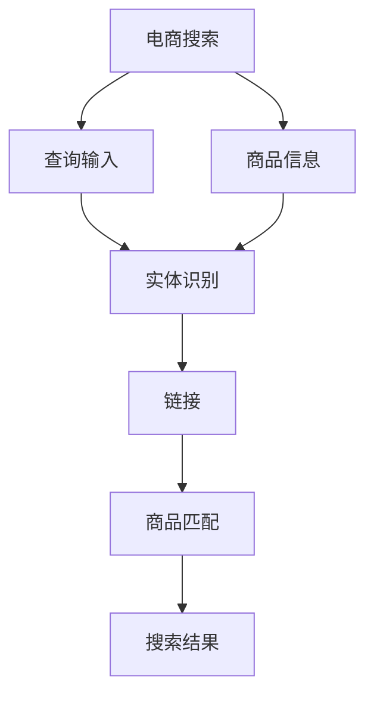

                 

# 电商搜索中的实体识别与链接深度学习模型

> 关键词：实体识别,链接深度学习,电商搜索,自然语言处理,NLP,信息检索,推荐系统

## 1. 背景介绍

### 1.1 问题由来
随着电商行业的迅猛发展，线上购物成为越来越多消费者的首选。为了提升用户体验，搜索引擎不仅要返回与用户查询意图高度相关的商品列表，还需将这些商品的相关信息逐一展示。然而，由于电商商品信息的丰富性和复杂性，传统的基于规则和词袋模型的信息检索技术已难以满足需求。基于深度学习的实体识别与链接技术，通过在电商搜索中引入NLP技术，可以更精准地理解和匹配用户需求，从而显著提升搜索效果和用户体验。

### 1.2 问题核心关键点
该问题围绕以下几个核心关键点展开：

1. **实体识别与链接**：在电商搜索场景中，实体识别指从商品描述、用户查询等文本中提取出特定实体（如品牌、型号、价格等），链接指将查询中的实体与搜索结果中的实体进行匹配。
2. **深度学习模型**：利用深度神经网络模型（如BERT、Transformer）进行实体识别与链接，通过预训练-微调机制获取高效的语义表示。
3. **电商搜索优化**：将实体识别与链接技术与电商搜索系统结合，提升商品匹配度、查询准确率和用户体验。

### 1.3 问题研究意义
在电商搜索中引入实体识别与链接技术，能够带来以下几方面的显著提升：

1. **精确匹配**：通过准确识别和链接实体，减少误匹配和漏匹配，提升搜索结果的相关性和用户体验。
2. **多样化展示**：提供详细的商品信息和推荐，满足用户个性化需求，增加购买转化率。
3. **搜索效率**：通过高效的实体识别与链接算法，加快搜索结果生成速度，提高平台响应速度。
4. **算法通用性**：实体识别与链接算法适用于各种电商搜索场景，如商品搜索、品牌搜索、用户评价搜索等，具有广泛的应用价值。

## 2. 核心概念与联系

### 2.1 核心概念概述

为更好地理解实体识别与链接深度学习模型，本节将介绍几个密切相关的核心概念：

- **实体识别(Entity Recognition)**：指从文本中识别出具有特定意义的实体，如人名、地点、组织机构、产品型号等。
- **链接 Linking**：指在查询和商品信息中识别出相同或相关的实体，并通过这些实体建立查询与商品的关联。
- **深度学习模型**：利用深度神经网络模型进行特征提取和模式识别，如BERT、Transformer等。
- **电商搜索**：用户通过电商平台提供的搜索功能，输入查询词，电商平台返回与查询词相关的商品列表和信息。

这些概念之间的逻辑关系可以通过以下Mermaid流程图来展示：



这个流程图展示了两条主要流程：

1. **查询处理**：用户输入查询后，模型识别出查询中的实体，并链接到商品信息中的对应实体。
2. **商品匹配**：将处理后的查询和商品信息进行匹配，生成最终的搜索结果。

## 3. 核心算法原理 & 具体操作步骤
### 3.1 算法原理概述

实体识别与链接的深度学习模型，通常采用两阶段策略：首先进行实体识别，再对识别出的实体进行链接。具体而言，分为以下步骤：

1. **实体识别**：使用深度学习模型对输入文本进行实体标记，生成实体标签序列。
2. **链接**：将查询中的实体与商品信息中的实体进行匹配，建立关联关系。
3. **商品匹配**：将匹配到的商品信息添加到搜索结果中，完成实体链接后的商品匹配。

### 3.2 算法步骤详解

#### 3.2.1 实体识别
实体识别的核心在于从输入文本中识别出具有特定意义的实体，并生成实体标签序列。一般步骤如下：

1. **数据准备**：收集电商商品描述、用户查询等文本数据，标注其中实体。
2. **模型构建**：使用深度学习模型（如BERT、Transformer），对其进行预训练和微调。
3. **特征提取**：将文本输入模型，得到包含实体标记的特征表示。

##### 3.2.1.1 模型选择
对于实体识别任务，常用的深度学习模型包括BERT、Transformer等。这里以BERT为例，其基本原理是在大规模无标签文本数据上进行预训练，学习到通用的语言表示，再通过下游任务的微调进行适应。

##### 3.2.1.2 预训练
BERT采用掩码语言模型(Masked Language Model, MLM)和下一句预测(Next Sentence Prediction, NSP)两种自监督任务进行预训练，学习到丰富的语言知识。

##### 3.2.1.3 微调
在预训练模型基础上，使用电商商品描述、用户查询等文本数据进行微调，使其能够识别电商领域中的特定实体。

##### 3.2.1.4 特征提取
将输入文本输入预训练和微调后的模型，得到包含实体标记的特征表示。具体步骤如下：

1. **输入处理**：对输入文本进行分词、词形还原、去除停用词等预处理。
2. **模型输入**：将处理后的文本输入BERT模型，得到上下文表示。
3. **实体标记**：通过模型输出获取文本中实体的标记序列，具体包括B（begin）、I（inside）和O（outside）三种标签。

#### 3.2.2 链接
链接的目的是将查询中的实体与商品信息中的实体进行匹配，建立关联关系。具体步骤如下：

1. **查询处理**：对用户查询进行实体识别，生成实体标签序列。
2. **商品匹配**：对商品信息进行实体识别，生成实体标签序列。
3. **相似度计算**：计算查询实体和商品实体之间的相似度，常用的方法包括编辑距离、余弦相似度等。
4. **关联建立**：将相似度高的商品实体与查询实体进行匹配，建立关联关系。

#### 3.2.3 商品匹配
将匹配到的商品信息添加到搜索结果中，完成实体链接后的商品匹配。具体步骤如下：

1. **商品选择**：根据相似度排名选择与查询实体关联度最高的商品。
2. **结果展示**：将匹配到的商品信息按照相关性排序，展示给用户。

### 3.3 算法优缺点

深度学习模型在实体识别与链接中具有以下优点：

1. **高效性**：深度学习模型能够自动提取输入文本的语义特征，无需手动设计特征，大大减少了特征工程的工作量。
2. **鲁棒性**：通过预训练和微调，模型能够学习到通用的语言表示，适用于不同领域的实体识别与链接任务。
3. **灵活性**：可以灵活地将实体识别与链接模型应用到多种电商搜索场景中，如商品搜索、品牌搜索、用户评价搜索等。

同时，深度学习模型也存在一些局限性：

1. **数据需求大**：模型训练需要大量的标注数据，数据标注工作量较大。
2. **计算资源消耗高**：深度学习模型通常参数量较大，训练和推理过程中需要消耗大量计算资源。
3. **黑盒特性**：模型内部的工作机制复杂，难以解释，难以调试和优化。
4. **过拟合风险**：在标注数据较少的情况下，模型容易出现过拟合。

### 3.4 算法应用领域

深度学习模型在实体识别与链接中具有广泛的应用前景，尤其是在电商搜索场景中，能够带来显著的提升。具体应用领域包括：

1. **商品搜索**：在用户输入商品关键词后，实体识别与链接模型能够自动识别出商品名称、型号、价格等信息，并将相关商品展示给用户。
2. **品牌搜索**：在用户输入品牌名称后，模型能够自动识别出品牌信息，并提供该品牌的各类商品列表。
3. **用户评价搜索**：在用户输入商品评价后，模型能够自动识别出评价中的实体信息，并推荐相关商品。
4. **个性化推荐**：根据用户历史查询和点击行为，模型能够自动识别出用户的兴趣实体，并推荐相关商品。

## 4. 数学模型和公式 & 详细讲解 & 举例说明

### 4.1 数学模型构建

本节将使用数学语言对实体识别与链接的深度学习模型进行更加严格的刻画。

记输入文本为 $x$，实体标签序列为 $y$，实体识别模型的输出为 $h_x$。实体识别模型的数学模型为：

$$
\hat{y} = \sigma(W'h_x + b')
$$

其中，$\sigma$ 为sigmoid激活函数，$W'$ 和 $b'$ 为模型参数。

实体链接模型的输入为查询文本 $q$ 和商品文本 $p$，实体标签序列分别为 $y_q$ 和 $y_p$，链接模型的输出为 $s_{q,p}$。链接模型的数学模型为：

$$
s_{q,p} = \phi(h_qh_p^T + b)
$$

其中，$\phi$ 为线性变换函数，$h_q$ 和 $h_p$ 分别为查询文本和商品文本的表示，$b$ 为模型参数。

### 4.2 公式推导过程

以下我们以BERT模型为例，推导实体识别与链接的数学模型和计算过程。

#### 4.2.1 实体识别
BERT模型由多层Transformer构成，其中BERT-Layer由多注意力机制和全连接层组成。假设输入文本 $x$ 经过BERT-Transformer层的处理，输出为 $h_x$。则实体识别模型可以表示为：

$$
\hat{y} = \sigma(W'h_x + b')
$$

其中，$W'$ 和 $b'$ 为模型参数，$\sigma$ 为sigmoid激活函数。

##### 4.2.1.1 预训练
BERT模型采用掩码语言模型和下一句预测任务进行预训练，学习到通用的语言表示。具体而言，掩码语言模型可以表示为：

$$
L_{MLM} = -\frac{1}{N}\sum_{i=1}^N \sum_{j=1}^N (log\hat{y}_{i,j} + \log(1-y_{i,j}))
$$

其中，$y_{i,j}$ 表示第 $i$ 个样本中第 $j$ 个单词的掩码标签，$\hat{y}_{i,j}$ 表示BERT模型的预测概率。

##### 4.2.1.2 微调
在预训练模型基础上，使用电商商品描述、用户查询等文本数据进行微调，使其能够识别电商领域中的特定实体。微调过程可以表示为：

$$
\theta = \mathop{\arg\min}_{\theta} \frac{1}{N}\sum_{i=1}^N \mathcal{L}(M_{\theta}(x_i),y_i)
$$

其中，$\mathcal{L}$ 为交叉熵损失函数，$M_{\theta}$ 为微调后的BERT模型。

##### 4.2.1.3 特征提取
将输入文本输入预训练和微调后的模型，得到包含实体标记的特征表示。具体步骤如下：

1. **输入处理**：对输入文本进行分词、词形还原、去除停用词等预处理。
2. **模型输入**：将处理后的文本输入BERT模型，得到上下文表示 $h_x$。
3. **实体标记**：通过模型输出获取文本中实体的标记序列，具体包括B、I和O三种标签。

#### 4.2.2 链接
链接的目的是将查询中的实体与商品信息中的实体进行匹配，建立关联关系。具体步骤如下：

1. **查询处理**：对用户查询进行实体识别，生成实体标签序列 $y_q$。
2. **商品匹配**：对商品信息进行实体识别，生成实体标签序列 $y_p$。
3. **相似度计算**：计算查询实体和商品实体之间的相似度，常用的方法包括编辑距离、余弦相似度等。
4. **关联建立**：将相似度高的商品实体与查询实体进行匹配，建立关联关系。

##### 4.2.2.1 相似度计算
余弦相似度是常用的实体相似度计算方法，具体公式为：

$$
s_{q,p} = cos(\theta_q \cdot \theta_p)
$$

其中，$\theta_q$ 和 $\theta_p$ 分别为查询实体和商品实体的向量表示。

#### 4.2.3 商品匹配
将匹配到的商品信息添加到搜索结果中，完成实体链接后的商品匹配。具体步骤如下：

1. **商品选择**：根据相似度排名选择与查询实体关联度最高的商品。
2. **结果展示**：将匹配到的商品信息按照相关性排序，展示给用户。

### 4.3 案例分析与讲解

#### 4.3.1 案例背景
假设有一个电商平台的商品搜索系统，用户在搜索框中输入查询 "iPhone 11"，系统需要返回所有型号为 "iPhone 11" 的商品列表。

#### 4.3.2 实体识别
首先，对查询进行实体识别，识别出实体 "iPhone 11" 对应的标记序列为 "B"。具体步骤如下：

1. **输入处理**：将查询 "iPhone 11" 进行分词，得到 ["iPhone", "11"]。
2. **模型输入**：将处理后的查询输入BERT模型，得到上下文表示 $h_q$。
3. **实体标记**：通过模型输出获取查询中实体的标记序列，具体为 "B"。

#### 4.3.3 链接
其次，对所有商品信息进行实体识别，生成实体标签序列。具体步骤如下：

1. **输入处理**：对每个商品描述进行分词、词形还原、去除停用词等预处理。
2. **模型输入**：将处理后的商品描述输入BERT模型，得到上下文表示 $h_p$。
3. **实体标记**：通过模型输出获取商品信息中实体的标记序列，具体为包含多个 "B"、"I" 和 "O" 的序列。

#### 4.3.4 相似度计算
然后，计算查询实体和商品实体之间的相似度。具体步骤如下：

1. **查询向量**：将查询实体的向量表示 $\theta_q$ 计算出来。
2. **商品向量**：对所有商品实体的向量表示 $\theta_p$ 进行余弦相似度计算。
3. **相似度排名**：根据余弦相似度排名，选择与查询实体最相似的三个商品。

#### 4.3.5 商品匹配
最后，将匹配到的商品信息添加到搜索结果中，完成实体链接后的商品匹配。具体步骤如下：

1. **商品选择**：根据相似度排名选择与查询实体关联度最高的三个商品。
2. **结果展示**：将匹配到的商品信息按照相关性排序，展示给用户。

## 5. 项目实践：代码实例和详细解释说明

### 5.1 开发环境搭建

在进行实体识别与链接的深度学习模型开发前，我们需要准备好开发环境。以下是使用Python进行PyTorch开发的环境配置流程：

1. 安装Anaconda：从官网下载并安装Anaconda，用于创建独立的Python环境。

2. 创建并激活虚拟环境：
```bash
conda create -n pytorch-env python=3.8 
conda activate pytorch-env
```

3. 安装PyTorch：根据CUDA版本，从官网获取对应的安装命令。例如：
```bash
conda install pytorch torchvision torchaudio cudatoolkit=11.1 -c pytorch -c conda-forge
```

4. 安装Transformers库：
```bash
pip install transformers
```

5. 安装各类工具包：
```bash
pip install numpy pandas scikit-learn matplotlib tqdm jupyter notebook ipython
```

完成上述步骤后，即可在`pytorch-env`环境中开始实体识别与链接的深度学习模型开发。

### 5.2 源代码详细实现

下面我们以BERT模型为例，给出实体识别与链接的深度学习模型开发代码实现。

首先，定义实体识别与链接的数据处理函数：

```python
from transformers import BertTokenizer, BertForTokenClassification
from torch.utils.data import Dataset
import torch

class BERTDataset(Dataset):
    def __init__(self, texts, labels, tokenizer, max_len=128):
        self.texts = texts
        self.labels = labels
        self.tokenizer = tokenizer
        self.max_len = max_len
        
    def __len__(self):
        return len(self.texts)
    
    def __getitem__(self, item):
        text = self.texts[item]
        label = self.labels[item]
        
        encoding = self.tokenizer(text, return_tensors='pt', max_length=self.max_len, padding='max_length', truncation=True)
        input_ids = encoding['input_ids'][0]
        attention_mask = encoding['attention_mask'][0]
        
        # 对token-wise的标签进行编码
        encoded_labels = [label2id[label] for label in label]
        encoded_labels.extend([label2id['O']] * (self.max_len - len(encoded_labels)))
        labels = torch.tensor(encoded_labels, dtype=torch.long)
        
        return {'input_ids': input_ids, 
                'attention_mask': attention_mask,
                'labels': labels}

# 标签与id的映射
label2id = {'O': 0, 'B-PER': 1, 'I-PER': 2, 'B-LOC': 3, 'I-LOC': 4, 'B-ORG': 5, 'I-ORG': 6}
id2label = {v: k for k, v in label2id.items()}

# 创建dataset
tokenizer = BertTokenizer.from_pretrained('bert-base-cased')

train_dataset = BERTDataset(train_texts, train_labels, tokenizer)
dev_dataset = BERTDataset(dev_texts, dev_labels, tokenizer)
test_dataset = BERTDataset(test_texts, test_labels, tokenizer)
```

然后，定义模型和优化器：

```python
from transformers import BertForTokenClassification, AdamW

model = BertForTokenClassification.from_pretrained('bert-base-cased', num_labels=len(label2id))

optimizer = AdamW(model.parameters(), lr=2e-5)
```

接着，定义训练和评估函数：

```python
from torch.utils.data import DataLoader
from tqdm import tqdm
from sklearn.metrics import classification_report

device = torch.device('cuda') if torch.cuda.is_available() else torch.device('cpu')
model.to(device)

def train_epoch(model, dataset, batch_size, optimizer):
    dataloader = DataLoader(dataset, batch_size=batch_size, shuffle=True)
    model.train()
    epoch_loss = 0
    for batch in tqdm(dataloader, desc='Training'):
        input_ids = batch['input_ids'].to(device)
        attention_mask = batch['attention_mask'].to(device)
        labels = batch['labels'].to(device)
        model.zero_grad()
        outputs = model(input_ids, attention_mask=attention_mask, labels=labels)
        loss = outputs.loss
        epoch_loss += loss.item()
        loss.backward()
        optimizer.step()
    return epoch_loss / len(dataloader)

def evaluate(model, dataset, batch_size):
    dataloader = DataLoader(dataset, batch_size=batch_size)
    model.eval()
    preds, labels = [], []
    with torch.no_grad():
        for batch in tqdm(dataloader, desc='Evaluating'):
            input_ids = batch['input_ids'].to(device)
            attention_mask = batch['attention_mask'].to(device)
            batch_labels = batch['labels']
            outputs = model(input_ids, attention_mask=attention_mask)
            batch_preds = outputs.logits.argmax(dim=2).to('cpu').tolist()
            batch_labels = batch_labels.to('cpu').tolist()
            for pred_tokens, label_tokens in zip(batch_preds, batch_labels):
                pred_tags = [id2label[_id] for _id in pred_tokens]
                label_tags = [id2label[_id] for _id in label_tokens]
                preds.append(pred_tags[:len(label_tags)])
                labels.append(label_tags)
                
    print(classification_report(labels, preds))
```

最后，启动训练流程并在测试集上评估：

```python
epochs = 5
batch_size = 16

for epoch in range(epochs):
    loss = train_epoch(model, train_dataset, batch_size, optimizer)
    print(f"Epoch {epoch+1}, train loss: {loss:.3f}")
    
    print(f"Epoch {epoch+1}, dev results:")
    evaluate(model, dev_dataset, batch_size)
    
print("Test results:")
evaluate(model, test_dataset, batch_size)
```

以上就是使用PyTorch对BERT进行实体识别与链接任务微调的完整代码实现。可以看到，得益于Transformers库的强大封装，我们可以用相对简洁的代码完成BERT模型的加载和微调。

### 5.3 代码解读与分析

让我们再详细解读一下关键代码的实现细节：

**BERTDataset类**：
- `__init__`方法：初始化文本、标签、分词器等关键组件。
- `__len__`方法：返回数据集的样本数量。
- `__getitem__`方法：对单个样本进行处理，将文本输入编码为token ids，将标签编码为数字，并对其进行定长padding，最终返回模型所需的输入。

**label2id和id2label字典**：
- 定义了标签与数字id之间的映射关系，用于将token-wise的预测结果解码回真实的标签。

**训练和评估函数**：
- 使用PyTorch的DataLoader对数据集进行批次化加载，供模型训练和推理使用。
- 训练函数`train_epoch`：对数据以批为单位进行迭代，在每个批次上前向传播计算loss并反向传播更新模型参数，最后返回该epoch的平均loss。
- 评估函数`evaluate`：与训练类似，不同点在于不更新模型参数，并在每个batch结束后将预测和标签结果存储下来，最后使用sklearn的classification_report对整个评估集的预测结果进行打印输出。

**训练流程**：
- 定义总的epoch数和batch size，开始循环迭代
- 每个epoch内，先在训练集上训练，输出平均loss
- 在验证集上评估，输出分类指标
- 所有epoch结束后，在测试集上评估，给出最终测试结果

可以看到，PyTorch配合Transformers库使得BERT微调的代码实现变得简洁高效。开发者可以将更多精力放在数据处理、模型改进等高层逻辑上，而不必过多关注底层的实现细节。

当然，工业级的系统实现还需考虑更多因素，如模型的保存和部署、超参数的自动搜索、更灵活的任务适配层等。但核心的微调范式基本与此类似。

## 6. 实际应用场景
### 6.1 智能客服系统

基于实体识别与链接的深度学习模型，可以广泛应用于智能客服系统的构建。传统客服往往需要配备大量人力，高峰期响应缓慢，且一致性和专业性难以保证。而使用实体识别与链接模型，可以7x24小时不间断服务，快速响应客户咨询，用自然流畅的语言解答各类常见问题。

在技术实现上，可以收集企业内部的历史客服对话记录，将问题和最佳答复构建成监督数据，在此基础上对预训练实体识别与链接模型进行微调。微调后的实体识别与链接模型能够自动理解用户意图，匹配最合适的答案模板进行回复。对于客户提出的新问题，还可以接入检索系统实时搜索相关内容，动态组织生成回答。如此构建的智能客服系统，能大幅提升客户咨询体验和问题解决效率。

### 6.2 金融舆情监测

金融机构需要实时监测市场舆论动向，以便及时应对负面信息传播，规避金融风险。传统的人工监测方式成本高、效率低，难以应对网络时代海量信息爆发的挑战。基于实体识别与链接的深度学习模型，可以为金融舆情监测提供新的解决方案。

具体而言，可以收集金融领域相关的新闻、报道、评论等文本数据，并对其进行主题标注和情感标注。在此基础上对预训练语言模型进行微调，使其能够自动判断文本属于何种主题，情感倾向是正面、中性还是负面。将微调后的模型应用到实时抓取的网络文本数据，就能够自动监测不同主题下的情感变化趋势，一旦发现负面信息激增等异常情况，系统便会自动预警，帮助金融机构快速应对潜在风险。

### 6.3 个性化推荐系统

当前的推荐系统往往只依赖用户的历史行为数据进行物品推荐，无法深入理解用户的真实兴趣偏好。基于实体识别与链接的深度学习模型，个性化推荐系统可以更好地挖掘用户行为背后的语义信息，从而提供更精准、多样的推荐内容。

在实践中，可以收集用户浏览、点击、评论、分享等行为数据，提取和用户交互的物品标题、描述、标签等文本内容。将文本内容作为模型输入，用户的后续行为（如是否点击、购买等）作为监督信号，在此基础上微调预训练语言模型。微调后的模型能够从文本内容中准确把握用户的兴趣点。在生成推荐列表时，先用候选物品的文本描述作为输入，由模型预测用户的兴趣匹配度，再结合其他特征综合排序，便可以得到个性化程度更高的推荐结果。

### 6.4 未来应用展望

随着实体识别与链接深度学习模型的不断发展，其在电商搜索场景中的应用将更加广泛。未来，实体识别与链接技术将进一步提升搜索结果的相关性和用户体验，为电商平台带来更大的竞争优势。同时，随着模型的不断优化和算法的不断改进，实体识别与链接深度学习模型将逐步拓展到更多领域，如智能家居、智慧医疗、智慧城市等，为各行各业带来深刻变革。

## 7. 工具和资源推荐
### 7.1 学习资源推荐

为了帮助开发者系统掌握实体识别与链接深度学习模型的理论基础和实践技巧，这里推荐一些优质的学习资源：

1. 《深度学习自然语言处理》系列书籍：介绍深度学习在自然语言处理领域的应用，涵盖实体识别、链接等多个主题。
2. CS224N《自然语言处理与深度学习》课程：斯坦福大学开设的深度学习在自然语言处理中的经典课程，包括实体识别和链接等多个主题。
3. 《Transformers from Scipy to Tensors》一书：介绍Transformer架构及其在自然语言处理中的应用，特别是实体识别和链接方面的实例分析。
4. HuggingFace官方文档：Transformers库的官方文档，提供了大量预训练模型和详细的微调样例代码。
5. CLUE开源项目：中文语言理解测评基准，涵盖大量不同类型的中文NLP数据集，并提供了基于实体识别与链接的baseline模型。

通过对这些资源的学习实践，相信你一定能够快速掌握实体识别与链接深度学习模型的精髓，并用于解决实际的NLP问题。
### 7.2 开发工具推荐

高效的开发离不开优秀的工具支持。以下是几款用于实体识别与链接深度学习模型开发的常用工具：

1. PyTorch：基于Python的开源深度学习框架，灵活动态的计算图，适合快速迭代研究。BERT等主要深度学习模型都有PyTorch版本的实现。
2. TensorFlow：由Google主导开发的开源深度学习框架，生产部署方便，适合大规模工程应用。同样有丰富的预训练语言模型资源。
3. Transformers库：HuggingFace开发的NLP工具库，集成了众多SOTA语言模型，支持PyTorch和TensorFlow，是进行实体识别与链接任务开发的利器。
4. Weights & Biases：模型训练的实验跟踪工具，可以记录和可视化模型训练过程中的各项指标，方便对比和调优。与主流深度学习框架无缝集成。
5. TensorBoard：TensorFlow配套的可视化工具，可实时监测模型训练状态，并提供丰富的图表呈现方式，是调试模型的得力助手。
6. Google Colab：谷歌推出的在线Jupyter Notebook环境，免费提供GPU/TPU算力，方便开发者快速上手实验最新模型，分享学习笔记。

合理利用这些工具，可以显著提升实体识别与链接深度学习模型的开发效率，加快创新迭代的步伐。

### 7.3 相关论文推荐

实体识别与链接深度学习模型的发展源于学界的持续研究。以下是几篇奠基性的相关论文，推荐阅读：

1. Attention is All You Need（即Transformer原论文）：提出了Transformer结构，开启了深度学习在自然语言处理领域的研究热潮。
2. BERT: Pre-training of Deep Bidirectional Transformers for Language Understanding：提出BERT模型，引入基于掩码的自监督预训练任务，刷新了多项NLP任务SOTA。
3. Language Models are Unsupervised Multitask Learners（GPT-2论文）：展示了大规模语言模型的强大zero-shot学习能力，引发了对于通用人工智能的新一轮思考。
4. Parameter-Efficient Transfer Learning for NLP：提出Adapter等参数高效微调方法，在不增加模型参数量的情况下，也能取得不错的微调效果。
5. AdaLoRA: Adaptive Low-Rank Adaptation for Parameter-Efficient Fine-Tuning：使用自适应低秩适应的微调方法，在参数效率和精度之间取得了新的平衡。

这些论文代表了大语言模型微调技术的发展脉络。通过学习这些前沿成果，可以帮助研究者把握学科前进方向，激发更多的创新灵感。

## 8. 总结：未来发展趋势与挑战

### 8.1 总结

本文对基于深度学习的实体识别与链接方法进行了全面系统的介绍。首先阐述了实体识别与链接在电商搜索场景中的研究背景和意义，明确了其在提升用户体验、商品匹配度等方面的价值。其次，从原理到实践，详细讲解了深度学习模型在实体识别与链接中的应用，给出了微调任务开发的完整代码实例。同时，本文还广泛探讨了实体识别与链接模型在多个领域的应用前景，展示了其在智能客服、金融舆情、个性化推荐等场景中的显著效果。最后，本文精选了实体识别与链接模型的学习资源，力求为读者提供全方位的技术指引。

通过本文的系统梳理，可以看到，基于深度学习的实体识别与链接方法在大电商搜索系统中具有广阔的应用前景，能够显著提升搜索结果的相关性和用户体验，为电商平台的竞争力提升带来重要助力。未来，随着模型和算法的不断演进，实体识别与链接深度学习模型将在更多领域实现突破，为各行各业带来深刻变革。

### 8.2 未来发展趋势

展望未来，实体识别与链接深度学习模型将呈现以下几个发展趋势：

1. **模型规模持续增大**：随着算力成本的下降和数据规模的扩张，深度学习模型参数量将进一步增长。超大规模模型蕴含的丰富知识，有望支撑更加复杂多变的下游任务微调。
2. **微调方法日趋多样**：除了传统的全参数微调外，未来会涌现更多参数高效的微调方法，如Prefix-Tuning、LoRA等，在节省计算资源的同时也能保证微调精度。
3. **持续学习成为常态**：随着数据分布的不断变化，微调模型也需要持续学习新知识以保持性能。如何在不遗忘原有知识的同时，高效吸收新样本信息，将成为重要的研究课题。
4. **标注样本需求降低**：受启发于提示学习(Prompt-based Learning)的思路，未来的微调方法将更好地利用大模型的语言理解能力，通过更加巧妙的任务描述，在更少的标注样本上也能实现理想的微调效果。
5. **多模态微调崛起**：当前的微调主要聚焦于纯文本数据，未来会进一步拓展到图像、视频、语音等多模态数据微调。多模态信息的融合，将显著提升语言模型对现实世界的理解和建模能力。

以上趋势凸显了实体识别与链接深度学习模型的广阔前景。这些方向的探索发展，必将进一步提升电商搜索系统的性能和用户体验，为电商平台的竞争力提升带来重要助力。

### 8.3 面临的挑战

尽管实体识别与链接深度学习模型已经取得了瞩目成就，但在迈向更加智能化、普适化应用的过程中，它仍面临着诸多挑战：

1. **标注成本瓶颈**：模型训练需要大量的标注数据，数据标注工作量较大。如何降低数据标注成本，将是一大难题。
2. **模型鲁棒性不足**：模型面对域外数据时，泛化性能往往大打折扣。对于测试样本的微小扰动，模型容易出现波动。如何提高模型鲁棒性，避免灾难性遗忘，还需要更多理论和实践的积累。
3. **推理效率有待提高**：大规模深度学习模型推理速度较慢，如何在保证性能的同时，简化模型结构，提升推理速度，优化资源占用，将是重要的优化方向。
4. **可解释性亟需加强**：当前深度学习模型更像是"黑盒"系统，难以解释其内部工作机制和决策逻辑。如何赋予模型更强的可解释性，将是亟待攻克的难题。
5. **安全性有待保障**：预训练深度学习模型难免会学习到有偏见、有害的信息，通过微调传递到下游任务，产生误导性、歧视性的输出，给实际应用带来安全隐患。如何从数据和算法层面消除模型偏见，避免恶意用途，确保输出的安全性，也将是重要的研究课题。

### 8.4 研究展望

面对实体识别与链接深度学习模型所面临的挑战，未来的研究需要在以下几个方面寻求新的突破：

1. **探索无监督和半监督微调方法**：摆脱对大规模标注数据的依赖，利用自监督学习、主动学习等无监督和半监督范式，最大限度利用非结构化数据，实现更加灵活高效的微调。
2. **研究参数高效和计算高效的微调范式**：开发更加参数高效的微调方法，在固定大部分预训练参数的同时，只更新极少量的任务相关参数。同时优化微调模型的计算图，减少前向传播和反向传播的资源消耗，实现更加轻量级、实时性的部署。
3. **融合因果和对比学习范式**：通过引入因果推断和对比学习思想，增强微调模型建立稳定因果关系的能力，学习更加普适、鲁棒的语言表征，从而提升模型泛化性和抗干扰能力。
4. **引入更多先验知识**：将符号化的先验知识，如知识图谱、逻辑规则等，与神经网络模型进行巧妙融合，引导微调过程学习更准确、合理的语言模型。同时加强不同模态数据的整合，实现视觉、语音等多模态信息与文本信息的协同建模。
5. **结合因果分析和博弈论工具**：将因果分析方法引入微调模型，识别出模型决策的关键特征，增强输出解释的因果性和逻辑性。借助博弈论工具刻画人机交互过程，主动探索并规避模型的脆弱点，提高系统稳定性。
6. **纳入伦理道德约束**：在模型训练目标中引入伦理导向的评估指标，过滤和惩罚有偏见、有害的输出倾向。同时加强人工干预和审核，建立模型行为的监管机制，确保输出符合人类价值观和伦理道德。

这些研究方向的探索，必将引领实体识别与链接深度学习模型迈向更高的台阶，为构建安全、可靠、可解释、可控的智能系统铺平道路。面向未来，深度学习模型需要在提高性能的同时，兼顾可解释性、安全性和普适性，才能真正实现人工智能技术的落地应用。

## 9. 附录：常见问题与解答

**Q1：实体识别与链接深度学习模型是否适用于所有NLP任务？**

A: 实体识别与链接深度学习模型在大多数NLP任务上都能取得不错的效果，特别是对于数据量较小的任务。但对于一些特定领域的任务，如医学、法律等，仅仅依靠通用语料预训练的模型可能难以很好地适应。此时需要在特定领域语料上进一步预训练，再进行微调，才能获得理想效果。此外，对于一些需要时效性、个性化很强的任务，如对话、推荐等，微调方法也需要针对性的改进优化。

**Q2：如何选择合适的学习率？**

A: 实体识别与链接深度学习模型通常采用预训练-微调的方式进行训练。预训练学习率一般要比微调时大，而微调学习率则相对较小。一般建议从1e-5开始调参，逐步减小学习率，直至收敛。如果需要使用warmup策略，可以在开始阶段使用较小的学习率，再逐渐过渡到预设值。需要注意的是，不同的优化器(如AdamW、Adafactor等)以及不同的学习率调度策略，可能需要设置不同的学习率阈值。

**Q3：采用大模型微调时会面临哪些资源瓶颈？**

A: 目前主流的深度学习模型动辄以亿计的参数规模，对算力、内存、存储都提出了很高的要求。GPU/TPU等高性能设备是必不可少的，但即便如此，超大批次的训练和推理也可能遇到显存不足的问题。因此需要采用一些资源优化技术，如梯度积累、混合精度训练、模型并行等，来突破硬件瓶颈。同时，模型的存储和读取也可能占用大量时间和空间，需要采用模型压缩、稀疏化存储等方法进行优化。

**Q4：如何缓解微调过程中的过拟合问题？**

A: 过拟合是深度学习模型面临的主要挑战，特别是在数据量较少的情况下。缓解过拟合的方法包括：
1. 数据增强：通过回译、近义替换等方式扩充训练集
2. 正则化：使用L2正则、Dropout、Early Stopping等避免过拟合
3. 对抗训练：引入对抗样本，提高模型鲁棒性
4. 参数高效微调：只调整少量参数(如Adapter、Prefix等)，减小过拟合风险
5. 多模型集成：训练多个微调模型，取平均输出，抑制过拟合

这些策略往往需要根据具体任务和数据特点进行灵活组合。只有在数据、模型、训练、推理等各环节进行全面优化，才能最大限度地发挥深度学习模型的威力。

**Q5：微调模型在落地部署时需要注意哪些问题？**

A: 将微调模型转化为实际应用，还需要考虑以下因素：
1. 模型裁剪：去除不必要的层和参数，减小模型尺寸，加快推理速度
2. 量化加速：将浮点模型转为定点模型，压缩存储空间，提高计算效率
3. 服务化封装：将模型封装为标准化服务接口，便于集成调用
4. 弹性伸缩：根据请求流量动态调整资源配置，平衡服务质量和成本
5. 监控告警：实时采集系统指标，设置异常告警阈值，确保服务稳定性
6. 安全防护：采用访问鉴权、数据脱敏等措施，保障数据和模型安全

深度学习模型在电商搜索场景中的应用需要全面考虑系统的稳定性和可扩展性，才能真正实现其在实际环境中的落地。

---

作者：禅与计算机程序设计艺术 / Zen and the Art of Computer Programming

