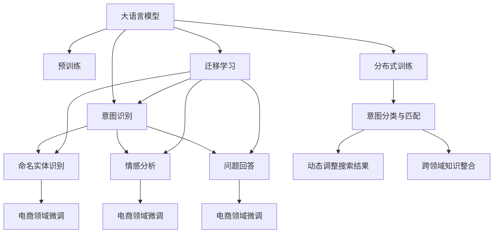

                 

# 电商搜索中的意图识别：大模型的创新应用

> 关键词：大语言模型, 意图识别, 电商搜索, 深度学习, 自然语言处理(NLP), 分布式训练, 自监督学习, 无监督学习, 迁移学习, 提示学习, 深度强化学习, 工业应用

## 1. 背景介绍

### 1.1 问题由来

在电商搜索场景中，用户输入的搜索查询往往并不是简单的关键词匹配，而是包含明确的意图和需求。如何准确理解和识别用户搜索意图，是提升电商搜索体验和效果的关键。传统的基于规则的意图识别方法往往难以应对海量多变的搜索场景，而大语言模型通过深度学习和自然语言处理技术，在理解和生成文本方面具备独特的优势，因此成为电商搜索意图识别的一个重要探索方向。

### 1.2 问题核心关键点

电商搜索中的意图识别问题可以归结为自然语言处理领域中的命名实体识别(NER)、情感分析(Sentiment Analysis)、问题回答(QA)等任务。其核心关键点包括：
1. 大规模语料预训练：构建高质量的电商领域语料，利用大语言模型进行预训练，学习通用的语言表示。
2. 意图分类与匹配：设计合适的意图分类模型，识别用户输入中的明确意图，并将其与搜索结果匹配。
3. 动态调整搜索结果：根据用户意图动态调整搜索结果，提升个性化推荐效果。
4. 跨领域知识整合：将电商领域的知识与用户意图结合起来，提高搜索结果的准确性和相关性。

### 1.3 问题研究意义

电商搜索中的意图识别，直接关系到用户的搜索体验和电商平台的销售转化率。通过准确的意图识别，可以提供更精准的搜索结果，增强用户满意度，促进交易达成。同时，电商平台可以利用意图识别技术，优化商品推荐、广告投放等策略，提升整体运营效率。

## 2. 核心概念与联系

### 2.1 核心概念概述

电商搜索中的意图识别涉及多个关键概念和技术，以下对其主要概念进行介绍：

- **大语言模型(Large Language Model, LLM)**：如BERT、GPT等，通过大规模语料预训练，学习通用语言表示，具备强大的文本理解和生成能力。
- **命名实体识别(Named Entity Recognition, NER)**：识别文本中的人名、地名、机构名等实体信息，是电商搜索中意图识别的一部分。
- **情感分析(Sentiment Analysis)**：判断文本中的情感倾向，如正向、负向或中性，用于了解用户对商品的评价。
- **问题回答(Question Answering, QA)**：回答用户提出的具体问题，如商品规格、价格、评价等，为用户提供直接的答案。
- **自监督学习(Self-supervised Learning)**：通过无标签数据进行预训练，学习语言表示，无需大量标注数据。
- **迁移学习(Transfer Learning)**：将预训练模型在电商领域进行微调，提高模型在该领域的泛化能力。
- **分布式训练(Distributed Training)**：利用多台计算机同时进行训练，加快模型收敛速度。
- **提示学习(Prompt Learning)**：通过精心设计的输入文本格式，引导大语言模型输出期望结果，减少微调参数。
- **深度强化学习(Deep Reinforcement Learning, DRL)**：通过奖励机制优化模型参数，提升模型在特定任务上的表现。

这些概念通过以下Mermaid流程图进行联系：



### 2.2 核心概念原理

- **大语言模型原理**：通过自监督学习任务，如掩码语言模型、下述预测等，预训练得到通用的语言表示。大模型通常基于Transformer结构，能够高效处理长序列数据。
- **意图识别原理**：通过命名实体识别、情感分析和问题回答等任务，获取用户输入中的具体意图和需求，如搜索产品、了解商品信息、评价商品等。
- **迁移学习原理**：将预训练模型在通用领域学习到的知识迁移到电商领域，通过少量标注数据进行微调，提高模型的电商领域泛化能力。
- **分布式训练原理**：将模型参数和训练数据分别存储在多个计算节点上，通过网络通信进行参数更新，提高训练效率。
- **提示学习原理**：通过设计合理的输入文本格式，如自然语言描述、代码模板等，引导大语言模型生成期望的输出结果。

## 3. 核心算法原理 & 具体操作步骤
### 3.1 算法原理概述

电商搜索中的意图识别，本质上是通过大语言模型对用户输入的自然语言文本进行理解和分析，从而准确识别用户的搜索意图。其核心算法包括以下几个步骤：

1. **预训练阶段**：利用电商领域的大量无标签文本数据，对大语言模型进行自监督预训练，学习通用的语言表示。
2. **微调阶段**：将预训练模型在电商领域进行微调，学习电商领域的特定知识，提升模型的电商领域泛化能力。
3. **意图分类**：设计合适的意图分类模型，将用户输入的文本分为不同的意图类别，如搜索产品、询问商品信息等。
4. **结果匹配**：根据识别出的意图，动态调整搜索结果，提升个性化推荐效果。
5. **动态调整**：结合用户历史行为数据，动态调整搜索结果，优化用户体验。
6. **知识整合**：将电商领域的知识与用户意图结合起来，提高搜索结果的准确性和相关性。

### 3.2 算法步骤详解

以下详细介绍电商搜索中意图识别的核心算法步骤：

**Step 1: 准备预训练模型和数据集**
- 收集电商领域的大量无标签文本数据，如商品描述、用户评论、广告语等。
- 使用自监督学习任务，如掩码语言模型、下述预测等，对大语言模型进行预训练。
- 选择合适的预训练语言模型，如BERT、GPT等，作为初始化参数。

**Step 2: 添加任务适配层**
- 设计意图分类模型，如基于 Transformer 结构的意图分类器。
- 添加命名实体识别模型，如基于 BiLSTM 的NER模型。
- 添加情感分析模型，如基于 LSTM 的情感分析模型。
- 添加问题回答模型，如基于 Transformer 结构的QA模型。

**Step 3: 设置微调超参数**
- 选择合适的优化算法及其参数，如 AdamW、SGD等，设置学习率、批大小、迭代轮数等。
- 设置正则化技术及强度，包括权重衰减、Dropout、Early Stopping等。
- 确定冻结预训练参数的策略，如仅微调顶层，或全部参数都参与微调。

**Step 4: 执行梯度训练**
- 将训练集数据分批次输入模型，前向传播计算损失函数。
- 反向传播计算参数梯度，根据设定的优化算法和学习率更新模型参数。
- 周期性在验证集上评估模型性能，根据性能指标决定是否触发 Early Stopping。
- 重复上述步骤直到满足预设的迭代轮数或 Early Stopping 条件。

**Step 5: 测试和部署**
- 在测试集上评估微调后模型在电商搜索场景中的表现，对比微调前后的精度提升。
- 使用微调后的模型对新样本进行推理预测，集成到实际的应用系统中。
- 持续收集新的数据，定期重新微调模型，以适应数据分布的变化。

### 3.3 算法优缺点

电商搜索中的意图识别方法具有以下优点：
1. 精准识别意图：通过大语言模型学习到丰富的语言表示，能够精准地识别用户搜索中的意图。
2. 动态调整结果：根据用户意图动态调整搜索结果，提升个性化推荐效果。
3. 泛化能力强：利用预训练-微调的方式，在大规模语料上进行学习，提升模型在特定领域的应用效果。
4. 模型灵活：模型可以灵活调整，适应不同电商平台和业务需求。

同时，该方法也存在一定的局限性：
1. 对数据依赖：微调效果依赖于标注数据的质量和数量，获取高质量标注数据的成本较高。
2. 处理复杂性：处理海量多变的电商搜索场景，模型设计较为复杂。
3. 计算资源需求高：预训练和微调过程中，需要大量计算资源和时间。
4. 鲁棒性问题：模型在处理噪声数据和异常情况时，鲁棒性可能不足。

尽管存在这些局限性，但就目前而言，基于大语言模型的意图识别方法在电商搜索场景中仍是最主流范式。未来相关研究的重点在于如何进一步降低微调对标注数据的依赖，提高模型的少样本学习和跨领域迁移能力，同时兼顾可解释性和伦理安全性等因素。

### 3.4 算法应用领域

电商搜索中的意图识别方法已经广泛应用于多个电商平台的搜索推荐系统。例如：

1. **京东**：利用BERT模型对用户搜索意图进行识别，并根据意图生成个性化搜索结果，提升用户满意度。
2. **亚马逊**：通过深度学习模型对用户评论进行情感分析，结合搜索意图提供更精准的商品推荐。
3. **拼多多**：采用大语言模型进行多轮对话生成，增强用户与机器的互动体验。
4. **淘宝**：使用预训练-微调方式对电商领域进行意图识别，提高搜索效果和用户体验。

除了上述这些电商巨头，许多中小型电商平台也正在引入大语言模型技术，提升自身搜索系统的智能化水平。随着大语言模型的不断演进，预计未来更多电商企业将深度应用意图识别技术，实现搜索系统的高效运转。

## 4. 数学模型和公式 & 详细讲解  
### 4.1 数学模型构建

假设预训练语言模型为 $M_{\theta}$，输入为电商领域文本 $x$，输出为意图标签 $y$。电商领域中的意图识别问题可以表示为分类任务：

$$
\mathcal{L}(\theta) = -\frac{1}{N}\sum_{i=1}^N \log P(y_i|x_i; \theta)
$$

其中 $P(y_i|x_i; \theta)$ 为模型在输入 $x_i$ 下输出 $y_i$ 的概率。$N$ 为样本数量。

### 4.2 公式推导过程

以下以二分类问题为例，推导基于大语言模型的意图分类公式。

假设模型 $M_{\theta}$ 在输入 $x$ 上的输出为 $\hat{y}=M_{\theta}(x) \in [0,1]$，表示样本属于正类的概率。真实标签 $y \in \{0,1\}$。则二分类交叉熵损失函数定义为：

$$
\ell(M_{\theta}(x),y) = -[y\log \hat{y} + (1-y)\log (1-\hat{y})]
$$

将其代入经验风险公式，得：

$$
\mathcal{L}(\theta) = -\frac{1}{N}\sum_{i=1}^N [y_i\log M_{\theta}(x_i)+(1-y_i)\log(1-M_{\theta}(x_i))]
$$

根据链式法则，损失函数对参数 $\theta$ 的梯度为：

$$
\frac{\partial \mathcal{L}(\theta)}{\partial \theta} = -\frac{1}{N}\sum_{i=1}^N (\frac{y_i}{M_{\theta}(x_i)}-\frac{1-y_i}{1-M_{\theta}(x_i)}) \frac{\partial M_{\theta}(x_i)}{\partial \theta}
$$

其中 $\frac{\partial M_{\theta}(x_i)}{\partial \theta}$ 可进一步递归展开，利用自动微分技术完成计算。

在得到损失函数的梯度后，即可带入参数更新公式，完成模型的迭代优化。重复上述过程直至收敛，最终得到适应电商领域意图识别任务的最优模型参数 $\theta^*$。

## 5. 项目实践：代码实例和详细解释说明
### 5.1 开发环境搭建

在进行电商搜索意图识别实践前，我们需要准备好开发环境。以下是使用Python进行PyTorch开发的环境配置流程：

1. 安装Anaconda：从官网下载并安装Anaconda，用于创建独立的Python环境。

2. 创建并激活虚拟环境：
```bash
conda create -n pytorch-env python=3.8 
conda activate pytorch-env
```

3. 安装PyTorch：根据CUDA版本，从官网获取对应的安装命令。例如：
```bash
conda install pytorch torchvision torchaudio cudatoolkit=11.1 -c pytorch -c conda-forge
```

4. 安装Transformers库：
```bash
pip install transformers
```

5. 安装各类工具包：
```bash
pip install numpy pandas scikit-learn matplotlib tqdm jupyter notebook ipython
```

完成上述步骤后，即可在`pytorch-env`环境中开始电商搜索意图识别的实践。

### 5.2 源代码详细实现

下面我们以电商搜索中的意图识别任务为例，给出使用Transformers库对BERT模型进行意图识别的PyTorch代码实现。

首先，定义意图识别任务的数据处理函数：

```python
from transformers import BertTokenizer
from torch.utils.data import Dataset
import torch

class SearchIntentDataset(Dataset):
    def __init__(self, texts, labels, tokenizer, max_len=128):
        self.texts = texts
        self.labels = labels
        self.tokenizer = tokenizer
        self.max_len = max_len
        
    def __len__(self):
        return len(self.texts)
    
    def __getitem__(self, item):
        text = self.texts[item]
        label = self.labels[item]
        
        encoding = self.tokenizer(text, return_tensors='pt', max_length=self.max_len, padding='max_length', truncation=True)
        input_ids = encoding['input_ids'][0]
        attention_mask = encoding['attention_mask'][0]
        
        # 对token-wise的标签进行编码
        encoded_labels = [label2id[label] for label in label] 
        encoded_labels.extend([label2id['O']] * (self.max_len - len(encoded_labels)))
        labels = torch.tensor(encoded_labels, dtype=torch.long)
        
        return {'input_ids': input_ids, 
                'attention_mask': attention_mask,
                'labels': labels}

# 标签与id的映射
label2id = {'search': 0, 'information': 1, 'rating': 2, 'return': 3, 'other': 4}
id2label = {v: k for k, v in label2id.items()}

# 创建dataset
tokenizer = BertTokenizer.from_pretrained('bert-base-cased')

train_dataset = SearchIntentDataset(train_texts, train_labels, tokenizer)
dev_dataset = SearchIntentDataset(dev_texts, dev_labels, tokenizer)
test_dataset = SearchIntentDataset(test_texts, test_labels, tokenizer)
```

然后，定义模型和优化器：

```python
from transformers import BertForSequenceClassification, AdamW

model = BertForSequenceClassification.from_pretrained('bert-base-cased', num_labels=len(label2id))

optimizer = AdamW(model.parameters(), lr=2e-5)
```

接着，定义训练和评估函数：

```python
from torch.utils.data import DataLoader
from tqdm import tqdm
from sklearn.metrics import classification_report

device = torch.device('cuda') if torch.cuda.is_available() else torch.device('cpu')
model.to(device)

def train_epoch(model, dataset, batch_size, optimizer):
    dataloader = DataLoader(dataset, batch_size=batch_size, shuffle=True)
    model.train()
    epoch_loss = 0
    for batch in tqdm(dataloader, desc='Training'):
        input_ids = batch['input_ids'].to(device)
        attention_mask = batch['attention_mask'].to(device)
        labels = batch['labels'].to(device)
        model.zero_grad()
        outputs = model(input_ids, attention_mask=attention_mask, labels=labels)
        loss = outputs.loss
        epoch_loss += loss.item()
        loss.backward()
        optimizer.step()
    return epoch_loss / len(dataloader)

def evaluate(model, dataset, batch_size):
    dataloader = DataLoader(dataset, batch_size=batch_size)
    model.eval()
    preds, labels = [], []
    with torch.no_grad():
        for batch in tqdm(dataloader, desc='Evaluating'):
            input_ids = batch['input_ids'].to(device)
            attention_mask = batch['attention_mask'].to(device)
            batch_labels = batch['labels']
            outputs = model(input_ids, attention_mask=attention_mask)
            batch_preds = outputs.logits.argmax(dim=2).to('cpu').tolist()
            batch_labels = batch_labels.to('cpu').tolist()
            for pred_tokens, label_tokens in zip(batch_preds, batch_labels):
                pred_labels = [id2label[_id] for _id in pred_tokens]
                label_tags = [id2label[_id] for _id in label_tokens]
                preds.append(pred_labels[:len(label_tags)])
                labels.append(label_tags)
                
    print(classification_report(labels, preds))
```

最后，启动训练流程并在测试集上评估：

```python
epochs = 5
batch_size = 16

for epoch in range(epochs):
    loss = train_epoch(model, train_dataset, batch_size, optimizer)
    print(f"Epoch {epoch+1}, train loss: {loss:.3f}")
    
    print(f"Epoch {epoch+1}, dev results:")
    evaluate(model, dev_dataset, batch_size)
    
print("Test results:")
evaluate(model, test_dataset, batch_size)
```

以上就是使用PyTorch对BERT进行电商搜索意图识别的完整代码实现。可以看到，得益于Transformers库的强大封装，我们可以用相对简洁的代码完成BERT模型的加载和意图识别。

### 5.3 代码解读与分析

让我们再详细解读一下关键代码的实现细节：

**SearchIntentDataset类**：
- `__init__`方法：初始化文本、标签、分词器等关键组件。
- `__len__`方法：返回数据集的样本数量。
- `__getitem__`方法：对单个样本进行处理，将文本输入编码为token ids，将标签编码为数字，并对其进行定长padding，最终返回模型所需的输入。

**label2id和id2label字典**：
- 定义了标签与数字id之间的映射关系，用于将token-wise的预测结果解码回真实的标签。

**训练和评估函数**：
- 使用PyTorch的DataLoader对数据集进行批次化加载，供模型训练和推理使用。
- 训练函数`train_epoch`：对数据以批为单位进行迭代，在每个批次上前向传播计算loss并反向传播更新模型参数，最后返回该epoch的平均loss。
- 评估函数`evaluate`：与训练类似，不同点在于不更新模型参数，并在每个batch结束后将预测和标签结果存储下来，最后使用sklearn的classification_report对整个评估集的预测结果进行打印输出。

**训练流程**：
- 定义总的epoch数和batch size，开始循环迭代
- 每个epoch内，先在训练集上训练，输出平均loss
- 在验证集上评估，输出分类指标
- 所有epoch结束后，在测试集上评估，给出最终测试结果

可以看到，PyTorch配合Transformers库使得BERT意图识别的代码实现变得简洁高效。开发者可以将更多精力放在数据处理、模型改进等高层逻辑上，而不必过多关注底层的实现细节。

当然，工业级的系统实现还需考虑更多因素，如模型的保存和部署、超参数的自动搜索、更灵活的任务适配层等。但核心的意图识别范式基本与此类似。

## 6. 实际应用场景
### 6.1 智能客服系统

基于大语言模型意图识别的智能客服系统，可以实时响应用户咨询，快速解决各类问题。系统通过分析用户输入的意图，自动匹配最合适的答案，提供高效、准确的服务。

在技术实现上，可以收集企业的历史客服对话记录，构建监督数据，对预训练语言模型进行微调。微调后的模型能够自动理解用户意图，匹配最合适的答案模板进行回复。对于复杂问题，还可以接入检索系统实时搜索相关内容，动态组织生成回答。如此构建的智能客服系统，能大幅提升客户咨询体验和问题解决效率。

### 6.2 个性化推荐系统

电商搜索中的意图识别，可以与个性化推荐系统结合，提升推荐效果。通过对用户搜索意图的精准识别，推荐系统可以更准确地理解用户需求，提供更精准的商品推荐。

在推荐过程中，系统首先利用意图识别模型获取用户意图，再结合用户历史行为数据，生成个性化推荐列表。意图识别模型可以帮助推荐系统更好地捕捉用户搜索意图，提升推荐的准确性和相关性。

### 6.3 实时广告投放

通过电商搜索中的意图识别，广告投放系统可以实时分析用户的搜索行为，匹配最合适的广告内容，提高广告投放的效果。

系统通过收集用户的搜索记录，利用意图识别模型获取用户意图，再结合广告库中的信息，动态调整广告内容。意图识别模型可以更好地理解用户需求，提升广告投放的精准度和转化率。

### 6.4 未来应用展望

随着大语言模型和意图识别技术的不断发展，电商搜索中的意图识别将迎来更多的应用场景，为电商平台带来新的价值。

在智慧医疗领域，通过意图识别技术，医疗平台可以更好地理解患者的健康咨询，提供更精准的医疗建议。

在智能家居领域，意图识别技术可以用于分析用户的命令和行为，提供更个性化和智能化的家居服务。

在智慧教育领域，意图识别技术可以用于理解学生的学习需求，提供个性化的学习推荐，提升学习效果。

此外，在更多行业领域，意图识别技术也将得到应用，为大语言模型技术的发展带来新的突破。相信随着技术的日益成熟，意图识别将会在更广泛的领域中发挥作用，推动人工智能技术的发展。

## 7. 工具和资源推荐
### 7.1 学习资源推荐

为了帮助开发者系统掌握电商搜索中的意图识别理论基础和实践技巧，这里推荐一些优质的学习资源：

1. 《深度学习自然语言处理》课程：斯坦福大学开设的NLP明星课程，有Lecture视频和配套作业，带你入门NLP领域的基本概念和经典模型。

2. 《Transformer从原理到实践》系列博文：由大模型技术专家撰写，深入浅出地介绍了Transformer原理、BERT模型、意图识别技术等前沿话题。

3. 《Natural Language Processing with Transformers》书籍：Transformers库的作者所著，全面介绍了如何使用Transformers库进行NLP任务开发，包括意图识别在内的诸多范式。

4. HuggingFace官方文档：Transformers库的官方文档，提供了海量预训练模型和完整的意图识别样例代码，是上手实践的必备资料。

5. CLUE开源项目：中文语言理解测评基准，涵盖大量不同类型的中文NLP数据集，并提供了基于意图识别的baseline模型，助力中文NLP技术发展。

通过对这些资源的学习实践，相信你一定能够快速掌握电商搜索中的意图识别精髓，并用于解决实际的NLP问题。
###  7.2 开发工具推荐

高效的开发离不开优秀的工具支持。以下是几款用于电商搜索意图识别开发的常用工具：

1. PyTorch：基于Python的开源深度学习框架，灵活动态的计算图，适合快速迭代研究。大部分预训练语言模型都有PyTorch版本的实现。

2. TensorFlow：由Google主导开发的开源深度学习框架，生产部署方便，适合大规模工程应用。同样有丰富的预训练语言模型资源。

3. Transformers库：HuggingFace开发的NLP工具库，集成了众多SOTA语言模型，支持PyTorch和TensorFlow，是进行意图识别任务开发的利器。

4. Weights & Biases：模型训练的实验跟踪工具，可以记录和可视化模型训练过程中的各项指标，方便对比和调优。与主流深度学习框架无缝集成。

5. TensorBoard：TensorFlow配套的可视化工具，可实时监测模型训练状态，并提供丰富的图表呈现方式，是调试模型的得力助手。

6. Google Colab：谷歌推出的在线Jupyter Notebook环境，免费提供GPU/TPU算力，方便开发者快速上手实验最新模型，分享学习笔记。

合理利用这些工具，可以显著提升电商搜索意图识别的开发效率，加快创新迭代的步伐。

### 7.3 相关论文推荐

电商搜索中的意图识别技术涉及多个前沿研究方向，以下是几篇奠基性的相关论文，推荐阅读：

1. Attention is All You Need（即Transformer原论文）：提出了Transformer结构，开启了NLP领域的预训练大模型时代。

2. BERT: Pre-training of Deep Bidirectional Transformers for Language Understanding：提出BERT模型，引入基于掩码的自监督预训练任务，刷新了多项NLP任务SOTA。

3. Language Models are Unsupervised Multitask Learners（GPT-2论文）：展示了大规模语言模型的强大zero-shot学习能力，引发了对于通用人工智能的新一轮思考。

4. Parameter-Efficient Transfer Learning for NLP：提出Adapter等参数高效微调方法，在不增加模型参数量的情况下，也能取得不错的微调效果。

5. Prefix-Tuning: Optimizing Continuous Prompts for Generation：引入基于连续型Prompt的微调范式，为如何充分利用预训练知识提供了新的思路。

6. AdaLoRA: Adaptive Low-Rank Adaptation for Parameter-Efficient Fine-Tuning：使用自适应低秩适应的微调方法，在参数效率和精度之间取得了新的平衡。

这些论文代表了大语言模型意图识别技术的发展脉络。通过学习这些前沿成果，可以帮助研究者把握学科前进方向，激发更多的创新灵感。

## 8. 总结：未来发展趋势与挑战
### 8.1 总结

本文对电商搜索中的意图识别问题进行了全面系统的介绍。首先阐述了电商搜索中意图识别问题的研究背景和意义，明确了意图识别在大语言模型和自然语言处理中的重要价值。其次，从原理到实践，详细讲解了意图识别的数学原理和关键步骤，给出了意图识别任务开发的完整代码实例。同时，本文还广泛探讨了意图识别方法在智能客服、个性化推荐、实时广告投放等多个电商场景中的应用前景，展示了意图识别技术的巨大潜力。此外，本文精选了意图识别技术的各类学习资源，力求为读者提供全方位的技术指引。

通过本文的系统梳理，可以看到，基于大语言模型的意图识别方法正在成为电商搜索中的重要范式，极大地提升了电商搜索的智能化水平，带来了新的用户体验和服务模式。得益于大语言模型的强大文本理解和生成能力，意图识别技术能够精准地理解用户输入，提供了个性化的搜索结果和推荐，增强了电商平台的竞争力和用户满意度。未来，随着大语言模型和意图识别技术的不断演进，电商搜索系统将实现更加智能、高效、个性化的运营，提升电商平台的整体运营效率。

### 8.2 未来发展趋势

展望未来，电商搜索中的意图识别技术将呈现以下几个发展趋势：

1. 模型规模持续增大。随着算力成本的下降和数据规模的扩张，预训练语言模型的参数量还将持续增长。超大规模语言模型蕴含的丰富语言知识，有望支撑更加复杂多变的电商搜索场景。

2. 意图识别方法日趋多样。除了传统的基于深度学习的意图识别方法外，未来会涌现更多基于语言模型和符号推理的意图识别方法，提升模型的可解释性和鲁棒性。

3. 跨领域知识整合能力增强。随着知识图谱、逻辑规则等专家知识的引入，意图识别模型将更好地整合跨领域知识，提升搜索结果的准确性和相关性。

4. 少样本学习和迁移学习能力提升。未来的意图识别模型将能够在更少的标注样本上取得更好的性能，并且具备更强的跨领域迁移能力。

5. 多模态意图识别崛起。传统的意图识别主要依赖文本数据，未来将拓展到图像、视频、语音等多模态数据，提升系统的综合感知能力。

6. 推理效率和计算资源需求降低。通过优化模型结构和推理算法，降低计算资源需求，提高推理效率，为意图识别技术在实际应用中的部署和落地创造条件。

以上趋势凸显了大语言模型意图识别技术的发展前景。这些方向的探索发展，必将进一步提升电商搜索系统的性能和应用范围，为电商平台的运营带来新的突破。

### 8.3 面临的挑战

尽管电商搜索中的意图识别技术已经取得了瞩目成就，但在迈向更加智能化、普适化应用的过程中，它仍面临着诸多挑战：

1. 标注成本瓶颈。虽然意图识别方法降低了对标注样本的依赖，但对于复杂多变的电商搜索场景，获取高质量标注数据仍然具有挑战性。如何进一步降低标注成本，提高意图识别的泛化能力，将是重要的研究课题。

2. 处理复杂性问题。电商搜索中的意图识别需要处理海量多变的用户输入，模型设计较为复杂。如何在保证模型性能的同时，提高模型的可解释性和鲁棒性，还需要更多理论和实践的积累。

3. 实时性和计算资源需求高。电商搜索系统需要快速响应用户输入，模型推理效率和计算资源需求较高。如何优化模型结构和推理算法，降低计算资源需求，提高系统实时性，将是重要的优化方向。

4. 可解释性亟需加强。当前意图识别模型缺乏可解释性，难以对其决策过程进行分析和调试。如何赋予模型更强的可解释性，将是亟待攻克的难题。

5. 安全性有待保障。意图识别模型可能学习到有害信息，产生误导性输出，对系统安全造成威胁。如何从数据和算法层面消除模型偏见，保障输出的安全性，也将是重要的研究课题。

6. 知识整合能力不足。现有的意图识别模型往往局限于文本数据，难以灵活吸收和运用更广泛的先验知识。如何让模型更好地与外部知识库、规则库等专家知识结合，形成更加全面、准确的信息整合能力，还有很大的想象空间。

正视意图识别面临的这些挑战，积极应对并寻求突破，将是大语言模型意图识别技术走向成熟的必由之路。相信随着学界和产业界的共同努力，这些挑战终将一一被克服，意图识别技术必将在电商搜索中发挥更大的作用。

### 8.4 未来突破

面对电商搜索中意图识别所面临的种种挑战，未来的研究需要在以下几个方面寻求新的突破：

1. 探索无监督和半监督意图识别方法。摆脱对大规模标注数据的依赖，利用自监督学习、主动学习等无监督和半监督范式，最大限度利用非结构化数据，实现更加灵活高效的意图识别。

2. 研究参数高效和计算高效的意图识别范式。开发更加参数高效的意图识别方法，在固定大部分预训练参数的同时，只更新极少量的任务相关参数。同时优化推理算法，降低计算资源需求，提高推理效率。

3. 融合因果和对比学习范式。通过引入因果推断和对比学习思想，增强意图识别模型建立稳定因果关系的能力，学习更加普适、鲁棒的语言表征，从而提升模型泛化性和抗干扰能力。

4. 引入更多先验知识。将符号化的先验知识，如知识图谱、逻辑规则等，与神经网络模型进行巧妙融合，引导意图识别过程学习更准确、合理的语言模型。同时加强不同模态数据的整合，实现视觉、语音等多模态信息与文本信息的协同建模。

5. 结合因果分析和博弈论工具。将因果分析方法引入意图识别模型，识别出模型决策的关键特征，增强输出解释的因果性和逻辑性。借助博弈论工具刻画人机交互过程，主动探索并规避模型的脆弱点，提高系统稳定性。

6. 纳入伦理道德约束。在模型训练目标中引入伦理导向的评估指标，过滤和惩罚有偏见、有害的输出倾向。同时加强人工干预和审核，建立模型行为的监管机制，确保输出符合人类价值观和伦理道德。

这些研究方向的探索，必将引领电商搜索中的意图识别技术迈向更高的台阶，为电商平台的运营带来新的突破。面向未来，意图识别技术还需要与其他人工智能技术进行更深入的融合，如知识表示、因果推理、强化学习等，多路径协同发力，共同推动自然语言理解和智能交互系统的进步。只有勇于创新、敢于突破，才能不断拓展意图识别模型的边界，让智能技术更好地造福人类社会。

## 9. 附录：常见问题与解答
**Q1：电商搜索中的意图识别是否适用于所有电商平台？**

A: 电商搜索中的意图识别方法一般适用于大型电商平台，因为这些平台有足够的用户数据和标注数据进行模型训练和微调。但对于小型电商或新成立平台，可能缺乏足够的标注数据和高质量的用户行为数据，因此在这些场景下，意图识别方法的实用性需要进一步验证。

**Q2：电商搜索中的意图识别如何与个性化推荐结合？**

A: 电商搜索中的意图识别可以与个性化推荐系统结合，通过分析用户搜索意图，结合用户历史行为数据，生成个性化推荐列表。意图识别模型可以更好地捕捉用户需求，提升推荐的准确性和相关性。

**Q3：电商搜索中的意图识别如何处理复杂的用户输入？**

A: 电商搜索中的意图识别需要处理海量多变的用户输入，模型设计较为复杂。为了提高模型对复杂输入的处理能力，可以采用多模态意图识别、注意力机制等技术，增强模型的表征能力和泛化能力。

**Q4：电商搜索中的意图识别如何提升实时性？**

A: 电商搜索中的意图识别需要快速响应用户输入，因此优化推理算法和模型结构，降低计算资源需求，提高推理效率，是提升实时性的关键。可以采用分布式推理、模型压缩等技术，提高系统响应速度。

**Q5：电商搜索中的意图识别如何保障用户隐私和数据安全？**

A: 电商搜索中的意图识别涉及用户隐私和数据安全问题，需要采取一系列措施保障数据隐私和模型安全。例如，使用差分隐私技术保护用户隐私，使用对抗样本生成技术提升模型鲁棒性，避免模型被攻击者利用。

**Q6：电商搜索中的意图识别如何处理多语言输入？**

A: 电商搜索中的意图识别可以扩展到多语言输入，通过多语言预训练和微调，提升模型对多种语言的理解能力。需要收集多语言的电商领域语料，并进行相应的模型训练和微调。

通过本文的系统梳理，可以看到，基于大语言模型的电商搜索中的意图识别技术正在成为电商搜索中的重要范式，极大地提升了电商搜索的智能化水平，带来了新的用户体验和服务模式。随着大语言模型和意图识别技术的不断演进，电商搜索系统将实现更加智能、高效、个性化的运营，提升电商平台的整体运营效率。相信随着技术的日益成熟，意图识别技术将在电商搜索中发挥更大的作用，推动电商平台的持续创新和发展。

