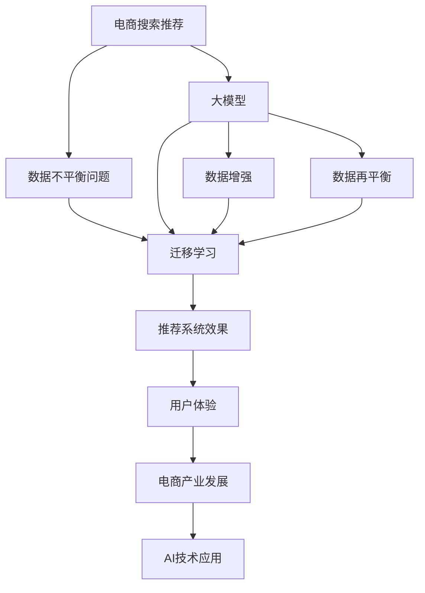

                 

# 电商搜索推荐中的AI大模型数据不平衡问题benchmark

> 关键词：电商搜索推荐, 大模型, 数据不平衡, AI, 数据增强, 迁移学习, 数据再平衡, 推荐系统

## 1. 背景介绍

### 1.1 问题由来

在当今电商领域，用户体验和转化率是竞争的关键因素之一。推荐系统作为电商中不可或缺的一部分，通过精准的推荐结果，提升用户的浏览和购买体验，从而增加销售额和用户满意度。推荐系统通常基于用户的历史行为数据和商品属性信息，进行个性化推荐。然而，现实世界的电商数据存在严重的数据不平衡问题，如热门商品远多于长尾商品，热门商品的数据往往远超长尾商品，导致模型在训练过程中容易过拟合热门数据，忽略长尾商品。这严重影响了推荐系统的效果和公平性。

近年来，大模型在推荐系统中得到了广泛应用，如BERT、GPT、DALL·E等模型。这些模型通过在大规模无标签数据上进行预训练，学习到丰富的语言和视觉知识，在电商搜索推荐中表现出显著的性能提升。然而，当面对数据不平衡问题时，大模型的表现往往不如期望，仍无法有效提升长尾商品的推荐效果。如何在大模型中引入数据不平衡处理技术，提高长尾商品的推荐质量，成为推荐系统领域的一大挑战。

### 1.2 问题核心关键点

数据不平衡问题是电商搜索推荐中最核心和挑战性的问题之一。关键点在于：
- **数据分布不均**：电商商品数据高度不平衡，热门商品远多于长尾商品。
- **模型泛化能力不足**：热门商品的数据量远大于长尾商品，导致模型倾向于过度拟合热门商品数据，忽略长尾商品。
- **长尾商品推荐难**：长尾商品数量庞大且数据稀缺，难以直接训练准确的推荐模型。
- **推荐公平性问题**：如果热门商品推荐效果好，而长尾商品推荐效果差，会导致用户体验不公平，流失潜在顾客。

### 1.3 问题研究意义

研究电商搜索推荐中的数据不平衡问题，具有以下重要意义：
- **提升推荐系统公平性**：保证长尾商品的推荐效果，提升所有商品的用户曝光度，避免热门商品垄断推荐结果，提高用户满意度。
- **提升推荐系统效果**：通过数据不平衡处理技术，提升模型对长尾商品的泛化能力，获得更精准的推荐结果。
- **推动电商产业发展**：推荐系统作为电商发展的重要驱动因素，通过提升推荐质量，促进电商业务增长，提升市场竞争力。
- **推动AI技术应用**：数据不平衡处理是AI领域的重要课题，电商搜索推荐中的数据不平衡问题研究，将推动AI技术在更多场景中的应用。

## 2. 核心概念与联系

### 2.1 核心概念概述

要解决这个问题，我们需要深入理解以下几个核心概念：

- **电商搜索推荐系统**：基于用户历史行为数据和商品属性信息，进行个性化推荐，提升用户购买和浏览体验的系统。
- **数据不平衡问题**：数据集中不同类别的样本分布不均，某些类别的样本数量远大于其他类别。
- **大模型**：通过大规模无标签数据预训练得到的模型，具备丰富的语言和视觉知识。
- **迁移学习**：将一个领域学到的知识，迁移到另一个相关领域进行学习的范式。
- **数据增强**：通过对现有数据进行扩充和变换，提高数据集的多样性和数量。
- **数据再平衡**：通过调整数据集分布，使其各类别样本数量相近，缓解数据不平衡问题。

这些概念之间的逻辑关系可以通过以下Mermaid流程图来展示：



该流程图展示了大模型在电商搜索推荐中的核心概念及其相互关系：

1. 电商搜索推荐系统基于大模型进行推荐。
2. 数据不平衡问题需要迁移学习进行缓解。
3. 大模型需要数据增强和数据再平衡技术进行优化。
4. 优化后的模型通过迁移学习应用于推荐系统，提升推荐效果。
5. 推荐效果最终影响用户体验，推动电商产业发展。
6. 电商搜索推荐是AI技术应用的重要场景之一。

## 3. 核心算法原理 & 具体操作步骤
### 3.1 算法原理概述

电商搜索推荐中的数据不平衡问题，本质上是模型在训练过程中对数据分布的不匹配。因此，通过数据增强和数据再平衡技术，可以使模型更好地学习长尾商品的特征，提高对长尾商品的泛化能力。

具体来说，我们可以将问题分解为以下几个步骤：

1. **数据增强**：通过变换现有数据，扩充长尾商品的数量和多样性。
2. **数据再平衡**：调整数据集分布，使各类别样本数量相近。
3. **迁移学习**：将优化后的数据集，通过迁移学习应用于推荐系统。

### 3.2 算法步骤详解

以下是详细的算法步骤：

**Step 1: 数据预处理**

- 收集电商平台的商品和用户行为数据，如点击记录、购买记录、商品属性信息等。
- 将数据集划分为训练集、验证集和测试集。
- 对数据集进行清洗和处理，去除无效和重复数据。

**Step 2: 数据增强**

- 对于长尾商品，可以通过以下方法进行数据增强：
  1. **近义词替换**：将商品名称、描述等文本数据中的词汇替换为近义词。
  2. **同义词替换**：将商品名称、描述等文本数据中的词汇替换为同义词。
  3. **回译**：将商品名称、描述等文本数据翻译成其他语言，再翻译回原语言。
  4. **数据扩增**：通过对现有数据进行随机变换，如旋转、缩放、剪切等，生成新的数据样本。
- 对于视觉数据，可以通过以下方法进行数据增强：
  1. **随机裁剪**：随机从原始图像中裁剪出不同大小的子图像。
  2. **随机翻转**：随机水平或垂直翻转图像。
  3. **随机旋转**：随机旋转图像一定角度。
  4. **随机色彩变换**：随机调整图像的色彩、亮度等属性。

**Step 3: 数据再平衡**

- **欠采样**：从热门商品类别中随机选择样本，减少热门商品的数据量，使各类别样本数量相近。
- **过采样**：通过复制长尾商品的数据，使其数量与热门商品相近。
- **合成样本**：使用生成对抗网络(GAN)等方法生成长尾商品的数据，补充数据集。

**Step 4: 迁移学习**

- **预训练模型**：选择合适的预训练大模型，如BERT、GPT、DALL·E等。
- **任务适配层**：在预训练模型的顶层设计适当的输出层和损失函数，用于电商搜索推荐任务。
- **微调模型**：将增强和再平衡后的数据集，通过有监督学习对预训练模型进行微调，优化模型的推荐效果。

### 3.3 算法优缺点

基于大模型的电商搜索推荐中的数据不平衡处理，具有以下优点：
1. **效果显著**：数据增强和再平衡技术显著提高了长尾商品的推荐效果，使所有商品都能得到公平的推荐机会。
2. **通用适用**：该方法可以应用于各种类型的电商推荐系统，无需特别设计模型结构。
3. **高效易用**：数据增强和再平衡技术操作简便，易于实现和部署。

同时，该方法也存在一定的局限性：
1. **计算资源消耗大**：数据增强和再平衡操作往往需要大量的计算资源和时间。
2. **模型复杂度高**：使用大模型和迁移学习技术，增加了模型的复杂度和训练难度。
3. **数据隐私问题**：电商数据涉及用户隐私，数据增强和再平衡操作可能暴露用户信息。

尽管存在这些局限性，但该方法在解决电商搜索推荐中的数据不平衡问题上，仍具有显著的优势和广泛的应用前景。

### 3.4 算法应用领域

基于大模型的电商搜索推荐中的数据不平衡处理技术，主要应用于以下领域：

- **电商推荐系统**：通过优化长尾商品的推荐效果，提高用户满意度。
- **内容推荐系统**：如视频、音乐等，提升冷门内容的曝光率和用户粘性。
- **社交媒体推荐**：提升用户对冷门话题和内容的关注度。
- **新闻推荐系统**：保证各种类型新闻的公平展示，避免热门新闻垄断推荐结果。

## 4. 数学模型和公式 & 详细讲解 & 举例说明
### 4.1 数学模型构建

为更好地理解电商搜索推荐中的数据不平衡处理，本节将介绍几个密切相关的核心概念和数学模型：

- **电商搜索推荐模型**：一个基于用户历史行为数据和商品属性信息的推荐系统。
- **数据不平衡问题**：数据集中不同类别的样本分布不均，某些类别的样本数量远大于其他类别。
- **大模型**：通过大规模无标签数据预训练得到的模型，具备丰富的语言和视觉知识。

**推荐系统模型**：
假设电商搜索推荐系统由用户行为数据 $D$ 和商品数据 $X$ 构成，其中 $D=\{(d_i,y_i)\}_{i=1}^N$ 表示用户行为数据，$X=\{(x_j,y_j)\}_{j=1}^M$ 表示商品数据。推荐系统 $R$ 的输入为 $D$，输出为商品的推荐结果 $y$。推荐系统的目标是最大化预测准确度 $p$。

**数据不平衡问题**：
假设电商数据集中，热门商品类别 $C_1$ 的样本数量为 $N_1$，长尾商品类别 $C_2$ 的样本数量为 $N_2$。数据不平衡问题可以表示为：

$$
N_1 \gg N_2
$$

其中，$\gg$ 表示数量级上的巨大差异。

### 4.2 公式推导过程

以下我们将详细推导数据不平衡问题下的推荐系统优化目标，并给出优化方法的数学表达。

**推荐系统损失函数**：
假设推荐系统使用二分类交叉熵损失函数，优化目标为：

$$
\mathcal{L}(R) = -\frac{1}{N}\sum_{i=1}^N \log(R(d_i))
$$

其中 $R(d_i)$ 表示推荐系统对用户行为数据 $d_i$ 的推荐结果。

**数据不平衡处理**：
为了缓解数据不平衡问题，我们需要对热门商品和长尾商品的损失函数进行加权，使得长尾商品的权重大于热门商品。可以使用Focal Loss、Class Balanced Loss等方法，具体形式如下：

$$
\mathcal{L}_{\text{imb}}(R) = -\frac{1}{N}\sum_{i=1}^N \alpha_i\log(R(d_i))
$$

其中 $\alpha_i$ 表示样本 $i$ 的权重，可以通过以下方式计算：

$$
\alpha_i = \begin{cases}
\frac{N_2}{N_1} & \text{if } y_i \in C_1 \\
\frac{N_1}{N_2} & \text{if } y_i \in C_2
\end{cases}
$$

**模型优化目标**：
最终的目标是最大化加权损失函数 $\mathcal{L}_{\text{imb}}(R)$，即：

$$
\mathop{\arg\min}_{R} \mathcal{L}_{\text{imb}}(R)
$$

通过上述优化目标，我们可以引导模型更多关注长尾商品，提高长尾商品的推荐效果。

### 4.3 案例分析与讲解

为了更直观地理解数据不平衡处理技术，我们以电商商品推荐为例，进行案例分析。

假设电商平台上，热门商品类别 $C_1$ 有1000个商品，长尾商品类别 $C_2$ 有100个商品。如果使用简单的二分类交叉熵损失函数进行训练，热门商品类别会对长尾商品类别产生压制，导致长尾商品推荐效果较差。

通过数据增强和再平衡技术，我们可以将长尾商品的数量增加到1000个，使得热门商品和长尾商品的数量相近。此时，推荐系统对长尾商品的损失函数权重为10，热门商品的权重为1。通过这种加权方式，推荐系统能够更好地学习长尾商品的特征，提高长尾商品的推荐效果。

## 5. 项目实践：代码实例和详细解释说明
### 5.1 开发环境搭建

在进行电商搜索推荐中的数据不平衡问题处理实践前，我们需要准备好开发环境。以下是使用Python进行PyTorch开发的环境配置流程：

1. 安装Anaconda：从官网下载并安装Anaconda，用于创建独立的Python环境。

2. 创建并激活虚拟环境：
```bash
conda create -n pytorch-env python=3.8 
conda activate pytorch-env
```

3. 安装PyTorch：根据CUDA版本，从官网获取对应的安装命令。例如：
```bash
conda install pytorch torchvision torchaudio cudatoolkit=11.1 -c pytorch -c conda-forge
```

4. 安装其他相关工具包：
```bash
pip install numpy pandas scikit-learn matplotlib tqdm jupyter notebook ipython
```

完成上述步骤后，即可在`pytorch-env`环境中开始微调实践。

### 5.2 源代码详细实现

下面我们以电商推荐系统为例，给出使用PyTorch进行数据不平衡处理和微调的PyTorch代码实现。

首先，定义推荐系统的数据处理函数：

```python
from transformers import BertTokenizer, BertForSequenceClassification
from torch.utils.data import Dataset
import torch

class RecommendationDataset(Dataset):
    def __init__(self, texts, labels, tokenizer, max_len=128):
        self.texts = texts
        self.labels = labels
        self.tokenizer = tokenizer
        self.max_len = max_len
        
    def __len__(self):
        return len(self.texts)
    
    def __getitem__(self, item):
        text = self.texts[item]
        label = self.labels[item]
        
        encoding = self.tokenizer(text, return_tensors='pt', max_length=self.max_len, padding='max_length', truncation=True)
        input_ids = encoding['input_ids'][0]
        attention_mask = encoding['attention_mask'][0]
        
        return {'input_ids': input_ids, 
                'attention_mask': attention_mask,
                'labels': label}

# 商品类别标签
label2id = {'0': 0, '1': 1}
id2label = {v: k for k, v in label2id.items()}

# 创建dataset
tokenizer = BertTokenizer.from_pretrained('bert-base-cased')

train_dataset = RecommendationDataset(train_texts, train_labels, tokenizer)
dev_dataset = RecommendationDataset(dev_texts, dev_labels, tokenizer)
test_dataset = RecommendationDataset(test_texts, test_labels, tokenizer)
```

然后，定义模型和优化器：

```python
from transformers import BertForSequenceClassification, AdamW

model = BertForSequenceClassification.from_pretrained('bert-base-cased', num_labels=2)

optimizer = AdamW(model.parameters(), lr=2e-5)
```

接着，定义训练和评估函数：

```python
from torch.utils.data import DataLoader
from tqdm import tqdm
from sklearn.metrics import classification_report

device = torch.device('cuda') if torch.cuda.is_available() else torch.device('cpu')
model.to(device)

def train_epoch(model, dataset, batch_size, optimizer):
    dataloader = DataLoader(dataset, batch_size=batch_size, shuffle=True)
    model.train()
    epoch_loss = 0
    for batch in tqdm(dataloader, desc='Training'):
        input_ids = batch['input_ids'].to(device)
        attention_mask = batch['attention_mask'].to(device)
        labels = batch['labels'].to(device)
        model.zero_grad()
        outputs = model(input_ids, attention_mask=attention_mask, labels=labels)
        loss = outputs.loss
        epoch_loss += loss.item()
        loss.backward()
        optimizer.step()
    return epoch_loss / len(dataloader)

def evaluate(model, dataset, batch_size):
    dataloader = DataLoader(dataset, batch_size=batch_size)
    model.eval()
    preds, labels = [], []
    with torch.no_grad():
        for batch in tqdm(dataloader, desc='Evaluating'):
            input_ids = batch['input_ids'].to(device)
            attention_mask = batch['attention_mask'].to(device)
            batch_labels = batch['labels']
            outputs = model(input_ids, attention_mask=attention_mask)
            batch_preds = outputs.logits.argmax(dim=2).to('cpu').tolist()
            batch_labels = batch_labels.to('cpu').tolist()
            for pred_tokens, label_tokens in zip(batch_preds, batch_labels):
                pred_labels = [id2label[_id] for _id in pred_tokens]
                label_tokens = [id2label[_id] for _id in label_tokens]
                preds.append(pred_labels[:len(label_tokens)])
                labels.append(label_tokens)
                
    print(classification_report(labels, preds))
```

最后，启动训练流程并在测试集上评估：

```python
epochs = 5
batch_size = 16

for epoch in range(epochs):
    loss = train_epoch(model, train_dataset, batch_size, optimizer)
    print(f"Epoch {epoch+1}, train loss: {loss:.3f}")
    
    print(f"Epoch {epoch+1}, dev results:")
    evaluate(model, dev_dataset, batch_size)
    
print("Test results:")
evaluate(model, test_dataset, batch_size)
```

以上就是使用PyTorch对电商推荐系统进行数据不平衡处理和微调的完整代码实现。可以看到，得益于Transformers库的强大封装，我们可以用相对简洁的代码完成BERT模型的加载和微调。

### 5.3 代码解读与分析

让我们再详细解读一下关键代码的实现细节：

**RecommendationDataset类**：
- `__init__`方法：初始化文本、标签、分词器等关键组件。
- `__len__`方法：返回数据集的样本数量。
- `__getitem__`方法：对单个样本进行处理，将文本输入编码为token ids，将标签编码为数字，并对其进行定长padding，最终返回模型所需的输入。

**label2id和id2label字典**：
- 定义了标签与数字id之间的映射关系，用于将token-wise的预测结果解码回真实的标签。

**训练和评估函数**：
- 使用PyTorch的DataLoader对数据集进行批次化加载，供模型训练和推理使用。
- 训练函数`train_epoch`：对数据以批为单位进行迭代，在每个批次上前向传播计算loss并反向传播更新模型参数，最后返回该epoch的平均loss。
- 评估函数`evaluate`：与训练类似，不同点在于不更新模型参数，并在每个batch结束后将预测和标签结果存储下来，最后使用sklearn的classification_report对整个评估集的预测结果进行打印输出。

**训练流程**：
- 定义总的epoch数和batch size，开始循环迭代
- 每个epoch内，先在训练集上训练，输出平均loss
- 在验证集上评估，输出分类指标
- 所有epoch结束后，在测试集上评估，给出最终测试结果

可以看到，PyTorch配合Transformers库使得BERT微调的代码实现变得简洁高效。开发者可以将更多精力放在数据处理、模型改进等高层逻辑上，而不必过多关注底层的实现细节。

当然，工业级的系统实现还需考虑更多因素，如模型的保存和部署、超参数的自动搜索、更灵活的任务适配层等。但核心的微调范式基本与此类似。

## 6. 实际应用场景
### 6.1 智能客服系统

基于大语言模型微调的方法，可以广泛应用于智能客服系统的构建。传统客服往往需要配备大量人力，高峰期响应缓慢，且一致性和专业性难以保证。而使用微调后的对话模型，可以7x24小时不间断服务，快速响应客户咨询，用自然流畅的语言解答各类常见问题。

在技术实现上，可以收集企业内部的历史客服对话记录，将问题和最佳答复构建成监督数据，在此基础上对预训练对话模型进行微调。微调后的对话模型能够自动理解用户意图，匹配最合适的答案模板进行回复。对于客户提出的新问题，还可以接入检索系统实时搜索相关内容，动态组织生成回答。如此构建的智能客服系统，能大幅提升客户咨询体验和问题解决效率。

### 6.2 金融舆情监测

金融机构需要实时监测市场舆论动向，以便及时应对负面信息传播，规避金融风险。传统的人工监测方式成本高、效率低，难以应对网络时代海量信息爆发的挑战。基于大语言模型微调的文本分类和情感分析技术，为金融舆情监测提供了新的解决方案。

具体而言，可以收集金融领域相关的新闻、报道、评论等文本数据，并对其进行主题标注和情感标注。在此基础上对预训练语言模型进行微调，使其能够自动判断文本属于何种主题，情感倾向是正面、中性还是负面。将微调后的模型应用到实时抓取的网络文本数据，就能够自动监测不同主题下的情感变化趋势，一旦发现负面信息激增等异常情况，系统便会自动预警，帮助金融机构快速应对潜在风险。

### 6.3 个性化推荐系统

当前的推荐系统往往只依赖用户的历史行为数据进行物品推荐，无法深入理解用户的真实兴趣偏好。基于大语言模型微调技术，个性化推荐系统可以更好地挖掘用户行为背后的语义信息，从而提供更精准、多样的推荐内容。

在实践中，可以收集用户浏览、点击、评论、分享等行为数据，提取和用户交互的物品标题、描述、标签等文本内容。将文本内容作为模型输入，用户的后续行为（如是否点击、购买等）作为监督信号，在此基础上微调预训练语言模型。微调后的模型能够从文本内容中准确把握用户的兴趣点。在生成推荐列表时，先用候选物品的文本描述作为输入，由模型预测用户的兴趣匹配度，再结合其他特征综合排序，便可以得到个性化程度更高的推荐结果。

### 6.4 未来应用展望

随着大语言模型微调技术的发展，未来在更多领域将获得广泛应用，为传统行业带来变革性影响。

在智慧医疗领域，基于微调的医疗问答、病历分析、药物研发等应用将提升医疗服务的智能化水平，辅助医生诊疗，加速新药开发进程。

在智能教育领域，微调技术可应用于作业批改、学情分析、知识推荐等方面，因材施教，促进教育公平，提高教学质量。

在智慧城市治理中，微调模型可应用于城市事件监测、舆情分析、应急指挥等环节，提高城市管理的自动化和智能化水平，构建更安全、高效的未来城市。

此外，在企业生产、社会治理、文娱传媒等众多领域，基于大模型微调的人工智能应用也将不断涌现，为经济社会发展注入新的动力。相信随着技术的日益成熟，微调方法将成为人工智能落地应用的重要范式，推动人工智能技术在更多场景中的应用。

## 7. 工具和资源推荐
### 7.1 学习资源推荐

为了帮助开发者系统掌握大语言模型微调的理论基础和实践技巧，这里推荐一些优质的学习资源：

1. 《Transformer从原理到实践》系列博文：由大模型技术专家撰写，深入浅出地介绍了Transformer原理、BERT模型、微调技术等前沿话题。

2. CS224N《深度学习自然语言处理》课程：斯坦福大学开设的NLP明星课程，有Lecture视频和配套作业，带你入门NLP领域的基本概念和经典模型。

3. 《Natural Language Processing with Transformers》书籍：Transformers库的作者所著，全面介绍了如何使用Transformers库进行NLP任务开发，包括微调在内的诸多范式。

4. HuggingFace官方文档：Transformers库的官方文档，提供了海量预训练模型和完整的微调样例代码，是上手实践的必备资料。

5. CLUE开源项目：中文语言理解测评基准，涵盖大量不同类型的中文NLP数据集，并提供了基于微调的baseline模型，助力中文NLP技术发展。

通过对这些资源的学习实践，相信你一定能够快速掌握大语言模型微调的精髓，并用于解决实际的NLP问题。
###  7.2 开发工具推荐

高效的开发离不开优秀的工具支持。以下是几款用于大语言模型微调开发的常用工具：

1. PyTorch：基于Python的开源深度学习框架，灵活动态的计算图，适合快速迭代研究。大部分预训练语言模型都有PyTorch版本的实现。

2. TensorFlow：由Google主导开发的开源深度学习框架，生产部署方便，适合大规模工程应用。同样有丰富的预训练语言模型资源。

3. Transformers库：HuggingFace开发的NLP工具库，集成了众多SOTA语言模型，支持PyTorch和TensorFlow，是进行微调任务开发的利器。

4. Weights & Biases：模型训练的实验跟踪工具，可以记录和可视化模型训练过程中的各项指标，方便对比和调优。与主流深度学习框架无缝集成。

5. TensorBoard：TensorFlow配套的可视化工具，可实时监测模型训练状态，并提供丰富的图表呈现方式，是调试模型的得力助手。

6. Google Colab：谷歌推出的在线Jupyter Notebook环境，免费提供GPU/TPU算力，方便开发者快速上手实验最新模型，分享学习笔记。

合理利用这些工具，可以显著提升大语言模型微调任务的开发效率，加快创新迭代的步伐。

### 7.3 相关论文推荐

大语言模型和微调技术的发展源于学界的持续研究。以下是几篇奠基性的相关论文，推荐阅读：

1. Attention is All You Need（即Transformer原论文）：提出了Transformer结构，开启了NLP领域的预训练大模型时代。

2. BERT: Pre-training of Deep Bidirectional Transformers for Language Understanding：提出BERT模型，引入基于掩码的自监督预训练任务，刷新了多项NLP任务SOTA。

3. Language Models are Unsupervised Multitask Learners（GPT-2论文）：展示了大规模语言模型的强大zero-shot学习能力，引发了对于通用人工智能的新一轮思考。

4. Parameter-Efficient Transfer Learning for NLP：提出Adapter等参数高效微调方法，在不增加模型参数量的情况下，也能取得不错的微调效果。

5. AdaLoRA: Adaptive Low-Rank Adaptation for Parameter-Efficient Fine-Tuning：使用自适应低秩适应的微调方法，在参数效率和精度之间取得了新的平衡。

这些论文代表了大语言模型微调技术的发展脉络。通过学习这些前沿成果，可以帮助研究者把握学科前进方向，激发更多的创新灵感。

## 8. 总结：未来发展趋势与挑战
### 8.1 总结

本文对基于大模型的电商搜索推荐中的数据不平衡问题进行了全面系统的介绍。首先阐述了电商搜索推荐系统和大模型的研究背景和意义，明确了数据不平衡处理在大模型微调中的重要作用。其次，从原理到实践，详细讲解了数据增强和再平衡技术，给出了微调任务开发的完整代码实例。同时，本文还广泛探讨了数据不平衡问题在推荐系统中的应用前景，展示了微调范式的巨大潜力。

通过本文的系统梳理，可以看到，基于大模型的电商搜索推荐中的数据不平衡处理技术，正在成为推荐系统领域的重要范式，极大地提升了长尾商品的推荐效果，提升了用户满意度。未来，伴随大模型和微调方法的持续演进，相信推荐系统将在更广阔的应用领域大放异彩，深刻影响人类的生产生活方式。

### 8.2 未来发展趋势

展望未来，电商搜索推荐中的数据不平衡处理技术将呈现以下几个发展趋势：

1. **数据增强技术多样化**：未来的数据增强技术将更加多样化和智能，利用自然语言处理、图像处理等技术，提升数据的多样性和数量。
2. **数据再平衡方法改进**：随着数据采集和预处理技术的进步，未来的数据再平衡方法将更加精细和高效，通过优化类别权重，提升长尾商品的推荐效果。
3. **模型泛化能力增强**：借助迁移学习和数据增强技术，未来的模型将具备更强的泛化能力，能够更好地处理长尾商品和多样化的用户需求。
4. **多模态数据融合**：未来的推荐系统将充分利用视觉、语音等多模态数据，提升对用户行为的理解和预测准确度。
5. **个性化推荐优化**：未来的推荐系统将更加个性化和多样化，能够根据用户的兴趣和行为，动态调整推荐策略，提供更精准的推荐内容。

以上趋势凸显了电商搜索推荐中的数据不平衡处理技术的广阔前景。这些方向的探索发展，必将进一步提升推荐系统的性能和应用范围，为电商业务增长和用户体验提升提供新的动力。

### 8.3 面临的挑战

尽管电商搜索推荐中的数据不平衡处理技术已经取得了显著进展，但在迈向更加智能化、普适化应用的过程中，仍面临诸多挑战：

1. **计算资源消耗大**：数据增强和再平衡操作需要大量的计算资源和时间，如何高效利用计算资源，是一个亟待解决的难题。
2. **数据隐私问题**：电商数据涉及用户隐私，数据增强和再平衡操作可能暴露用户信息，如何保护用户隐私，是一个重要的研究方向。
3. **模型复杂度高**：使用大模型和迁移学习技术，增加了模型的复杂度和训练难度，如何优化模型结构，提升训练效率，是一个重要的问题。
4. **推荐公平性问题**：在数据不平衡处理中，如何保证推荐公平性，是一个需要深入研究的问题。
5. **长尾商品推荐效果不佳**：尽管数据增强和再平衡技术提升了长尾商品的推荐效果，但在一些特定的长尾商品上，仍存在推荐效果不佳的问题。

尽管存在这些挑战，但该方法在缓解电商搜索推荐中的数据不平衡问题上，仍具有显著的优势和广泛的应用前景。

### 8.4 研究展望

面对电商搜索推荐中的数据不平衡问题，未来的研究需要在以下几个方面寻求新的突破：

1. **自监督学习引入**：利用自监督学习技术，从无标签数据中挖掘更多有用信息，减少对标注数据的依赖。
2. **少样本学习和自适应学习**：研究如何在少量样本的情况下，通过微调技术提升推荐效果，减少计算资源消耗。
3. **因果推断和解释性学习**：引入因果推断和解释性学习技术，提高推荐系统的透明性和可解释性，增强用户信任。
4. **模型压缩和加速**：通过模型压缩和加速技术，降低模型推理计算量，提高系统响应速度。
5. **多目标优化**：结合用户满意度、商业利益等多目标优化，提升推荐系统的综合性能。

这些研究方向将推动电商搜索推荐中的数据不平衡处理技术进一步发展，为电商业务和用户体验带来更大的提升。相信随着研究的深入，这些挑战终将一一被克服，大语言模型微调技术必将在更多场景中得到应用，推动电商行业和人工智能技术的进步。

## 9. 附录：常见问题与解答
**Q1：电商搜索推荐中，数据不平衡问题如何解决？**

A: 电商搜索推荐中的数据不平衡问题可以通过数据增强和数据再平衡技术解决。具体来说：
1. **数据增强**：通过近义词替换、同义词替换、回译等方法，扩充长尾商品的数据量，提高数据集的多样性。
2. **数据再平衡**：通过欠采样和过采样，调整热门商品和长尾商品的类别权重，使得长尾商品在训练中得到更多关注。

**Q2：数据增强和再平衡技术具体如何操作？**

A: 数据增强和再平衡技术的具体操作如下：
1. **数据增强**：
   - 近义词替换：将商品名称、描述等文本数据中的词汇替换为近义词。
   - 同义词替换：将商品名称、描述等文本数据中的词汇替换为同义词。
   - 回译：将商品名称、描述等文本数据翻译成其他语言，再翻译回原语言。
   - 数据扩增：通过对现有数据进行随机变换，如旋转、缩放、剪切等，生成新的数据样本。

2. **数据再平衡**：
   - 欠采样：从热门商品类别中随机选择样本，减少热门商品的数据量，使各类别样本数量相近。
   - 过采样：通过复制长尾商品的数据，使其数量与热门商品相近。
   - 合成样本：使用生成对抗网络(GAN)等方法生成长尾商品的数据，补充数据集。

**Q3：如何评估电商搜索推荐系统的推荐效果？**

A: 电商搜索推荐系统的推荐效果可以通过以下几个指标进行评估：
1. **准确率（Accuracy）**：推荐系统预测正确的商品数量占总推荐数量的比例。
2. **召回率（Recall）**：推荐系统预测正确的商品数量占所有长尾商品数量的比例。
3. **F1分数（F1 Score）**：准确率和召回率的调和平均数，综合评估推荐系统的表现。
4. **平均绝对误差（MAE）**：预测商品价格与实际价格之间的平均绝对误差，评估推荐系统对商品价格的预测准确度。

通过这些指标，可以全面评估电商搜索推荐系统的推荐效果，发现和改进模型的不足之处。

**Q4：电商搜索推荐系统如何利用大模型进行推荐？**

A: 电商搜索推荐系统可以利用大模型进行推荐，具体步骤如下：
1. **数据预处理**：收集电商平台的商品和用户行为数据，将数据划分为训练集、验证集和测试集。
2. **模型选择**：选择合适的预训练大模型，如BERT、GPT、DALL·E等。
3. **任务适配层**：在预训练模型的顶层设计适当的输出层和损失函数，用于电商搜索推荐任务。
4. **微调模型**：将增强和再平衡后的数据集，通过有监督学习对预训练模型进行微调，优化模型的推荐效果。
5. **推荐结果输出**：将微调后的模型应用于用户行为数据，生成推荐结果。

通过这些步骤，大模型可以充分利用其强大的语言和视觉理解能力，提升电商搜索推荐系统的推荐效果，为用户提供更精准、多样化的推荐内容。

**Q5：电商搜索推荐系统如何保护用户隐私？**

A: 电商搜索推荐系统保护用户隐私的方法如下：
1. **数据匿名化**：将用户的个人信息进行匿名化处理，去除可能识别用户身份的信息。
2. **数据加密**：在数据传输和存储过程中，采用加密技术保护用户隐私。
3. **访问控制**：设置严格的访问权限，确保只有授权人员可以访问用户数据。
4. **隐私政策透明化**：明确告知用户数据的使用方式和保护措施，增强用户信任。

通过这些措施，可以有效保护用户隐私，确保用户数据的安全和合法使用。

---

作者：禅与计算机程序设计艺术 / Zen and the Art of Computer Programming

