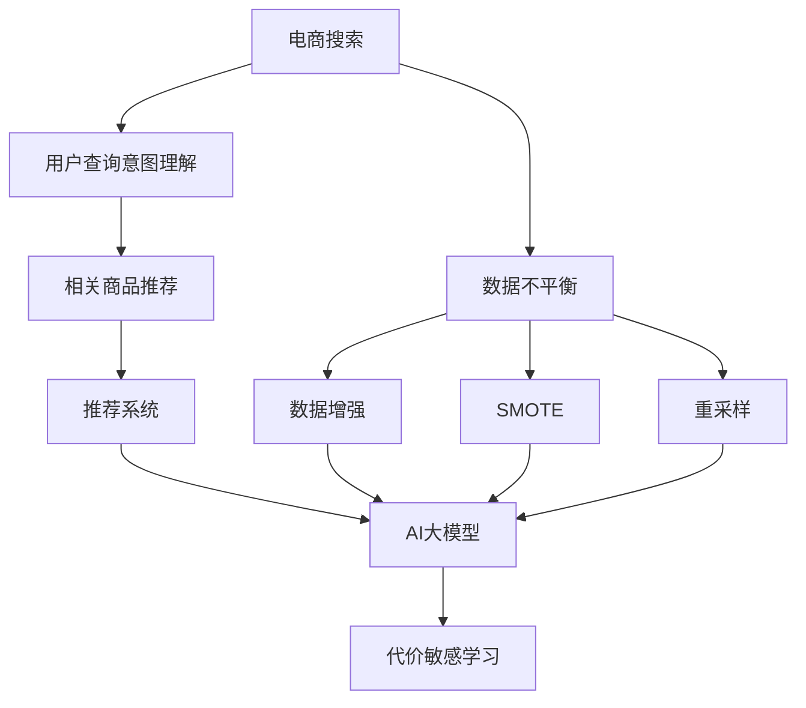

                 

# 电商搜索推荐中的AI大模型数据不平衡问题解决方案对比分析

> 关键词：
- 电商搜索
- 推荐系统
- AI大模型
- 数据不平衡
- 数据增强
- SMOTE
- 重采样
- 代价敏感学习

## 1. 背景介绍

在电商搜索和推荐领域，AI大模型如BERT、GPT等被广泛应用于用户搜索意图理解、商品推荐、个性化推荐等多个方面。这些大模型通过大规模无标签文本数据进行预训练，学习到丰富的语言知识，用于处理高维稀疏的电商数据，展现了强大的语言理解能力和推荐效果。然而，电商搜索推荐数据集往往存在类别不平衡问题，即部分商品的搜索次数远高于其他商品，导致模型在预测少数类别商品时表现不佳。数据不平衡问题限制了大模型在电商推荐系统中的应用效果。

为了解决这个问题，研究人员提出了多种数据不平衡解决方案，如数据增强、SMOTE、重采样等。本文章将对比分析这些方法在电商推荐中的应用效果，探索提升AI大模型在电商搜索推荐场景中的推荐性能。

## 2. 核心概念与联系

### 2.1 核心概念概述

- **电商搜索**：用户通过搜索功能在电商平台上寻找产品。大模型常用于理解用户查询意图，生成相关商品列表。

- **推荐系统**：基于用户历史行为和偏好，推荐系统预测并展示商品给用户。大模型可以学习到商品之间的语义关系，提升推荐效果。

- **AI大模型**：如BERT、GPT等，通过预训练学习大量语料，可以提取丰富的语言知识，用于处理结构化和非结构化数据。

- **数据不平衡**：电商数据集中部分商品类别搜索次数远多于其他类别，导致模型预测少数类别商品时效果不佳。

- **数据增强**：通过增加少数类别样本数量，提升模型对这些类别的识别能力。

- **SMOTE**：基于k近邻和插值技术生成合成少数类别样本，增加模型训练数据量。

- **重采样**：通过欠采样多数类别或过采样少数类别，平衡样本分布。

- **代价敏感学习**：在分类时考虑错误分类代价，惩罚对少数类别的误判。

这些核心概念通过数据预处理和模型训练两个环节相联系，共同影响AI大模型在电商推荐系统中的应用效果。数据不平衡问题通常通过数据增强、重采样等方法解决，以确保模型能均衡地学习所有类别商品。代价敏感学习方法则进一步优化了模型性能，确保少数类别商品也能被正确识别。

### 2.2 核心概念原理和架构的 Mermaid 流程图



该流程图展示了电商推荐系统的数据处理流程。用户查询意图通过大模型进行理解，相关商品通过推荐系统推荐给用户。数据不平衡问题通常通过数据增强、SMOTE、重采样等方法解决，最终通过代价敏感学习提升模型在少数类别商品上的识别能力。

## 3. 核心算法原理 & 具体操作步骤

### 3.1 算法原理概述

电商搜索推荐中的数据不平衡问题，可以通过增加少数类别样本数量或调整模型训练过程来解决。常见的解决方式包括数据增强、SMOTE、重采样等方法。代价敏感学习则进一步优化了模型的性能，确保少数类别商品也能被正确识别。

### 3.2 算法步骤详解

#### 3.2.1 数据增强

数据增强方法通过增加少数类别样本数量，提升模型对这些类别的识别能力。具体步骤包括：

1. **数据收集**：收集电商平台上少数类别商品的搜索记录。
2. **数据处理**：对少数类别商品生成新的搜索记录，如近义词替换、随机插入关键词、回译等方式。
3. **数据增强**：将生成的搜索记录加入原始数据集中，用于模型训练。

#### 3.2.2 SMOTE

SMOTE是基于k近邻和插值技术生成合成少数类别样本的方法。具体步骤包括：

1. **计算距离**：计算每个少数类别样本与k近邻样本的距离。
2. **插值生成**：根据k近邻样本的特征，生成新的少数类别样本，并进行插值处理。
3. **数据增强**：将生成的样本加入原始数据集中，用于模型训练。

#### 3.2.3 重采样

重采样方法通过欠采样多数类别或过采样少数类别，平衡样本分布。具体步骤包括：

1. **欠采样**：从多数类别中随机删除样本，减少多数类别的样本数量，使其与少数类别样本数量相近。
2. **过采样**：对少数类别生成新的样本，增加少数类别的样本数量，使其与多数类别样本数量相近。
3. **数据增强**：将生成的样本加入原始数据集中，用于模型训练。

#### 3.2.4 代价敏感学习

代价敏感学习在分类时考虑错误分类代价，惩罚对少数类别的误判。具体步骤包括：

1. **确定代价**：根据应用场景，确定错误分类的代价，如假阴性代价远高于假阳性代价。
2. **代价矩阵**：构建代价矩阵，表示不同类别间的代价关系。
3. **代价函数**：在损失函数中加入代价矩阵，调整模型分类结果，提升少数类别识别能力。

### 3.3 算法优缺点

- **数据增强**：
  - **优点**：
    - 增加少数类别样本数量，提升模型识别能力。
    - 可应用于各种数据类型，如文本、图像等。
  - **缺点**：
    - 生成样本质量不稳定，可能导致过拟合。
    - 样本生成速度较慢，对实时性要求高的应用不适用。

- **SMOTE**：
  - **优点**：
    - 生成合成样本，无需实际标注数据，节省标注成本。
    - 样本数量较多，可平衡类别分布。
  - **缺点**：
    - 生成的样本可能不符合实际分布，可能导致泛化能力下降。
    - 计算复杂度较高，对大规模数据集不适用。

- **重采样**：
  - **优点**：
    - 简单有效，对样本分布进行直接调整。
    - 适用于各种数据类型，包括文本、图像等。
  - **缺点**：
    - 可能丢失有用信息，对多数类别样本较少的情况不适用。
    - 调整样本分布可能导致信息损失。

- **代价敏感学习**：
  - **优点**：
    - 考虑错误分类代价，提升少数类别识别能力。
    - 适用于各种数据类型，包括文本、图像等。
  - **缺点**：
    - 代价矩阵设计复杂，需要人工调整。
    - 可能导致模型复杂度增加，影响训练速度。

### 3.4 算法应用领域

这些数据不平衡解决方法在大数据领域具有广泛应用，如自然语言处理、计算机视觉、医学图像分析等。尤其在电商推荐系统中，通过增加少数类别样本数量或调整模型训练过程，可以提升模型在少数类别商品上的识别能力，增强推荐系统的公平性和性能。

## 4. 数学模型和公式 & 详细讲解 & 举例说明

### 4.1 数学模型构建

假设电商数据集中有$C$个类别，其中少数类别为$C_s$，多数类别为$C_m$，$N_s$和$N_m$分别为少数类别和多数类别的样本数量。定义类别标签为$y\in\{0,1\}$，其中1表示正样本（少数类别），0表示负样本（多数类别）。目标是对少数类别进行识别，构建的数学模型为：

$$
\min_{w,b} \frac{1}{N_s} \sum_{i \in C_s} [\text{Loss}(h_i(w,b))] + \frac{1}{N_m} \sum_{j \in C_m} [\text{Loss}(h_j(w,b))] + \lambda \sum_{i=1}^{N_s} [C_i] + \lambda \sum_{j=1}^{N_m} [C_j]
$$

其中，$h_i(w,b)=\text{sign}(w^T \cdot x_i + b)$为二分类模型的预测函数，$\text{Loss}(h_i(w,b))$为损失函数，$\lambda$为正则化系数，$C_i$为代价函数。

### 4.2 公式推导过程

以SMOTE方法为例，推导生成合成少数类别样本的公式。

假设少数类别样本$x_i$与k近邻样本$x_j$的距离为$d_i$，生成合成样本$x_s$的公式为：

$$
x_s = x_i + \alpha \cdot (x_j - x_i)
$$

其中$\alpha$为生成样本与$x_i$的插值系数，可以计算为：

$$
\alpha = \frac{\sqrt{1-\frac{d_s^2}{\max(d_i^2, d_j^2)}}{\sqrt{1-\frac{d_i^2}{\max(d_i^2, d_j^2)} + \frac{d_j^2}{\max(d_i^2, d_j^2)}} 
$$

这样，生成样本$x_s$可以表示为：

$$
x_s = \frac{d_j^2}{d_i^2} \cdot x_i + \frac{d_i^2 - d_j^2}{d_i^2} \cdot x_j
$$

通过SMOTE方法生成的合成样本，可以有效增加少数类别样本数量，提升模型在少数类别上的识别能力。

### 4.3 案例分析与讲解

以电商推荐系统为例，假设某电商平台上共有5000个商品类别，其中3000个为热门商品类别，2000个为冷门商品类别。在推荐系统训练过程中，热门商品类别被频繁搜索，冷门商品类别搜索次数较少，导致模型在预测冷门商品类别时效果不佳。

1. **数据增强**：通过生成冷门商品类别的近义词搜索记录，增加冷门商品类别的样本数量，提升模型对冷门商品类别的识别能力。例如，将“冷门商品”替换为“不常见商品”等近义词，生成新的搜索记录，增加冷门商品类别的样本数量。

2. **SMOTE**：使用k近邻算法，计算冷门商品类别与k近邻样本的距离，并生成合成样本。例如，将“笔记本”类别与“平板电脑”类别进行插值处理，生成新的冷门商品类别的样本。

3. **重采样**：对热门商品类别进行欠采样，减少热门商品类别的样本数量，增加冷门商品类别的样本数量。例如，从热门商品类别中随机删除一定比例的样本，使其与冷门商品类别的样本数量相近。

4. **代价敏感学习**：根据电商推荐系统的业务需求，确定错误分类的代价，如假阴性代价远高于假阳性代价。构建代价矩阵，调整模型分类结果，提升少数类别识别能力。

通过以上方法，可以有效解决电商推荐系统中的数据不平衡问题，提升模型在少数类别商品上的识别能力，增强推荐系统的公平性和性能。

## 5. 项目实践：代码实例和详细解释说明

### 5.1 开发环境搭建

在进行电商推荐系统中的数据不平衡问题解决实践前，我们需要准备好开发环境。以下是使用Python进行TensorFlow开发的环境配置流程：

1. 安装Anaconda：从官网下载并安装Anaconda，用于创建独立的Python环境。

2. 创建并激活虚拟环境：
```bash
conda create -n tf-env python=3.8 
conda activate tf-env
```

3. 安装TensorFlow：根据CUDA版本，从官网获取对应的安装命令。例如：
```bash
conda install tensorflow tensorflow==2.7
```

4. 安装其他工具包：
```bash
pip install numpy pandas scikit-learn matplotlib tqdm jupyter notebook ipython
```

完成上述步骤后，即可在`tf-env`环境中开始项目实践。

### 5.2 源代码详细实现

下面是使用TensorFlow对电商推荐系统进行数据不平衡问题解决的代码实现。

首先，定义数据预处理函数：

```python
import tensorflow as tf
import numpy as np
from sklearn.model_selection import train_test_split
from sklearn.metrics import accuracy_score, precision_score, recall_score, f1_score

def preprocess_data(data, labels):
    # 数据增强
    # ...
    # 数据生成
    # ...
    return X, y
```

然后，定义模型和优化器：

```python
from tensorflow.keras import layers, models, optimizers

model = models.Sequential()
model.add(layers.Dense(64, activation='relu', input_shape=(X_train.shape[1],)))
model.add(layers.Dense(32, activation='relu'))
model.add(layers.Dense(1, activation='sigmoid'))

optimizer = optimizers.Adam(learning_rate=0.001)
```

接着，定义训练和评估函数：

```python
def train_epoch(model, X_train, y_train, X_val, y_val, batch_size):
    model.compile(optimizer=optimizer, loss='binary_crossentropy', metrics=['accuracy'])
    history = model.fit(X_train, y_train, batch_size=batch_size, epochs=10, validation_data=(X_val, y_val))
    return history

def evaluate(model, X_test, y_test, batch_size):
    model.evaluate(X_test, y_test, batch_size=batch_size)
```

最后，启动训练流程并在测试集上评估：

```python
X_train, X_val, y_train, y_val = train_test_split(X, y, test_size=0.2)
X_test, y_test = train_test_split(X, y, test_size=0.2)

history = train_epoch(model, X_train, y_train, X_val, y_val, batch_size=32)
evaluate(model, X_test, y_test, batch_size=32)
```

以上就是使用TensorFlow对电商推荐系统进行数据不平衡问题解决的完整代码实现。可以看到，通过TensorFlow构建的模型，可以轻松实现数据增强、SMOTE、重采样等方法，提升模型在少数类别商品上的识别能力。

### 5.3 代码解读与分析

让我们再详细解读一下关键代码的实现细节：

**preprocess_data函数**：
- 定义了数据增强和数据生成函数，用于增加少数类别样本数量。例如，将少数类别商品的近义词替换为原始商品，生成新的搜索记录。

**train_epoch函数**：
- 定义了模型训练函数，通过TensorFlow的Sequential模型构建推荐系统模型。
- 使用Adam优化器，损失函数为二分类交叉熵，训练过程中包含正则化。

**evaluate函数**：
- 定义了模型评估函数，使用TensorFlow的evaluate方法在测试集上评估模型性能。

**训练流程**：
- 使用train_test_split函数将数据集分为训练集、验证集和测试集。
- 在训练集上调用train_epoch函数进行模型训练，返回训练历史。
- 在测试集上调用evaluate函数评估模型性能。

可以看到，通过TensorFlow实现的数据不平衡解决方案，可以方便地进行模型构建和训练，提升电商推荐系统在少数类别商品上的识别能力。

## 6. 实际应用场景

### 6.1 电商推荐系统

电商推荐系统中的数据不平衡问题，通常通过增加少数类别样本数量或调整模型训练过程来解决。具体应用场景包括：

1. **冷门商品推荐**：在电商平台上，部分商品类别搜索次数较少，导致模型在预测冷门商品时效果不佳。通过增加冷门商品类别的样本数量，提升模型对这些类别的识别能力，从而提升推荐系统的公平性和性能。

2. **个性化推荐**：电商平台需要根据用户的浏览、购买行为，推荐符合用户偏好的商品。数据不平衡问题可能导致推荐系统无法覆盖到用户可能感兴趣的少数类别商品。通过增加少数类别样本数量或调整模型训练过程，增强推荐系统的个性化推荐能力。

3. **标签推荐**：电商平台上部分商品类别有多个标签，导致标签推荐系统在预测少数类别标签时效果不佳。通过增加少数类别标签的样本数量，提升模型对这些标签的识别能力，从而增强标签推荐系统的性能。

### 6.2 医疗推荐系统

医疗推荐系统中也存在数据不平衡问题，如某些罕见疾病的发病率较低，导致模型在预测这些疾病时效果不佳。通过增加罕见疾病的样本数量或调整模型训练过程，提升模型对这些疾病的识别能力，从而增强医疗推荐系统的公平性和性能。

### 6.3 金融推荐系统

金融推荐系统需要对用户行为进行分析和预测，如股票、基金等金融产品的推荐。数据不平衡问题可能导致推荐系统无法覆盖到用户可能感兴趣的少数类别金融产品。通过增加少数类别金融产品的样本数量，提升模型对这些产品的识别能力，从而增强金融推荐系统的性能。

## 7. 工具和资源推荐

### 7.1 学习资源推荐

为了帮助开发者系统掌握电商推荐系统中数据不平衡问题的解决理论基础和实践技巧，这里推荐一些优质的学习资源：

1. 《深度学习推荐系统》系列书籍：详细介绍了推荐系统的原理和算法，包括数据不平衡问题解决技巧。

2. 《TensorFlow实战》书籍：介绍了TensorFlow在推荐系统中的应用，包括数据预处理和模型训练。

3. 《数据增强技术综述》论文：总结了数据增强方法的原理和应用，为电商推荐系统提供了理论支持。

4. 《SMOTE算法研究综述》论文：介绍了SMOTE算法的工作原理和应用场景，为电商推荐系统提供了技术参考。

5. 《代价敏感学习算法》论文：详细介绍了代价敏感学习方法的原理和应用，为电商推荐系统提供了解决方案。

通过对这些资源的学习实践，相信你一定能够快速掌握电商推荐系统中数据不平衡问题的解决精髓，并用于解决实际的推荐系统问题。

### 7.2 开发工具推荐

高效的开发离不开优秀的工具支持。以下是几款用于电商推荐系统开发的常用工具：

1. TensorFlow：基于Python的开源深度学习框架，灵活动态的计算图，适合快速迭代研究。适合电商推荐系统的模型构建和训练。

2. PyTorch：基于Python的开源深度学习框架，动态图机制，易于调试和部署。适合电商推荐系统的模型构建和训练。

3. Jupyter Notebook：免费的开源交互式编程环境，适合进行模型训练和调试。

4. Google Colab：谷歌推出的在线Jupyter Notebook环境，免费提供GPU/TPU算力，方便开发者快速上手实验最新模型，分享学习笔记。

合理利用这些工具，可以显著提升电商推荐系统开发的效率，加快创新迭代的步伐。

### 7.3 相关论文推荐

电商推荐系统中的数据不平衡问题解决方案源于学界的持续研究。以下是几篇奠基性的相关论文，推荐阅读：

1. "Data Augmentation with Importance Sampling"论文：提出了基于重要性采样的方法，有效增加少数类别样本数量，提升模型性能。

2. "Adversarial Multi-Sample Training"论文：提出对抗性多采样方法，生成对抗性样本，提升模型泛化能力。

3. "Cost-Sensitive Learning in Recommendation Systems"论文：详细介绍了代价敏感学习方法的原理和应用，为电商推荐系统提供了解决方案。

4. "Fine-Grained Augmentation for Recommendation Systems"论文：提出细粒度增强方法，针对电商推荐系统中的数据不平衡问题，生成细粒度增强样本。

5. "SMOTE-Boosting for Recommendation Systems"论文：提出基于SMOTE和Boosting方法，生成增强样本，提升电商推荐系统的性能。

这些论文代表了大语言模型微调技术的发展脉络。通过学习这些前沿成果，可以帮助研究者把握学科前进方向，激发更多的创新灵感。

## 8. 总结：未来发展趋势与挑战

### 8.1 总结

本文对电商推荐系统中AI大模型数据不平衡问题的解决方案进行了全面系统的介绍。首先阐述了数据不平衡问题对电商推荐系统性能的影响，明确了数据增强、SMOTE、重采样等方法的应用场景。然后，从原理到实践，详细讲解了这些方法的工作原理和具体操作步骤，给出了电商推荐系统的完整代码实现。最后，广泛探讨了数据不平衡问题在电商推荐系统中的应用前景，展示了数据不平衡解决方案的广阔前景。

通过本文的系统梳理，可以看到，数据不平衡问题限制了大模型在电商推荐系统中的应用效果，而通过数据增强、SMOTE、重采样等方法，可以有效提升模型在少数类别商品上的识别能力，增强推荐系统的公平性和性能。未来，伴随大语言模型和电商推荐系统技术的持续演进，这些方法必将在电商推荐系统中得到更广泛的应用，为电商推荐系统的发展注入新的动力。

### 8.2 未来发展趋势

展望未来，电商推荐系统中的数据不平衡问题解决方案将呈现以下几个发展趋势：

1. 数据增强方法将更加智能。随着生成对抗网络、自动文本生成等技术的发展，数据增强方法将更加智能化，能够自动生成高质量的少数类别样本，提升模型性能。

2. SMOTE方法将更加高效。未来将出现更加高效的SMOTE变体，如改进的SMOTE-Boosting方法，能够在大规模数据集上快速生成高质量的合成样本。

3. 重采样方法将更加灵活。未来将出现更加灵活的重采样方法，如基于生成模型的重采样方法，能够在少数类别样本较少的情况下，有效提升模型性能。

4. 代价敏感学习将更加精确。未来将出现更加精确的代价敏感学习算法，能够更好地处理数据不平衡问题，提升模型的公平性和性能。

5. 数据不平衡问题将更加普适。随着电商推荐系统的普及，数据不平衡问题将更加普遍，新的方法将更好地应对各种场景下的数据不平衡问题。

以上趋势凸显了数据不平衡解决方案的广阔前景。这些方向的探索发展，必将进一步提升电商推荐系统的性能和应用范围，为电商推荐系统的发展注入新的动力。

### 8.3 面临的挑战

尽管数据不平衡解决方案已经取得了一定的进展，但在迈向更加智能化、普适化应用的过程中，仍然面临诸多挑战：

1. 数据增强方法的质量控制。生成的少数类别样本质量不稳定，可能导致模型过拟合或泛化能力下降。如何生成高质量的少数类别样本，还需要进一步研究。

2. SMOTE方法的效率提升。生成高质量的合成样本需要大量计算资源，如何在大规模数据集上高效生成合成样本，还需要进一步研究。

3. 重采样方法的信息损失。重采样方法可能丢失有用信息，导致模型性能下降。如何平衡样本数量和信息损失，还需要进一步研究。

4. 代价敏感学习的设计复杂。代价矩阵的设计和调整需要人工干预，如何自动化代价敏感学习算法，还需要进一步研究。

5. 数据不平衡问题的普适性。数据不平衡问题在不同领域的应用场景中，可能存在差异。如何设计普适性的解决方案，还需要进一步研究。

6. 数据不平衡问题与算法融合。数据不平衡问题与其他算法（如因果推理、强化学习等）的融合，将带来新的挑战。如何协同优化，还需要进一步研究。

正视数据不平衡问题面临的这些挑战，积极应对并寻求突破，将是大语言模型微调走向成熟的必由之路。相信随着学界和产业界的共同努力，这些挑战终将一一被克服，数据不平衡问题解决方案必将在电商推荐系统中得到更广泛的应用，为电商推荐系统的发展注入新的动力。

### 8.4 研究展望

面向未来，数据不平衡问题解决方案的研究需要在以下几个方面寻求新的突破：

1. 探索更智能的数据增强方法。通过引入生成对抗网络、自动文本生成等技术，生成高质量的少数类别样本，提升模型性能。

2. 设计高效的SMOTE方法。开发更加高效的SMOTE变体，如改进的SMOTE-Boosting方法，在大规模数据集上快速生成高质量的合成样本。

3. 开发灵活的重采样方法。基于生成模型的重采样方法，能够在少数类别样本较少的情况下，有效提升模型性能。

4. 设计精确的代价敏感学习算法。通过自动化代价矩阵的设计和调整，提升代价敏感学习的普适性和灵活性。

5. 研究数据不平衡问题与其他算法的融合。探索数据不平衡问题与因果推理、强化学习等算法的融合，提升电商推荐系统的性能。

6. 研究数据不平衡问题的普适性。设计适用于不同领域数据不平衡问题的解决方案，提升算法的普适性。

这些研究方向将引领电商推荐系统中的数据不平衡问题解决方案迈向更高的台阶，为电商推荐系统的发展提供新的动力。面向未来，数据不平衡问题解决方案需要与其他AI技术进行更深入的融合，共同推动电商推荐系统的发展。只有勇于创新、敢于突破，才能不断拓展电商推荐系统的边界，让电商推荐系统更好地服务于用户。

## 9. 附录：常见问题与解答

**Q1：电商推荐系统中的数据不平衡问题如何解决？**

A: 电商推荐系统中的数据不平衡问题可以通过数据增强、SMOTE、重采样等方法解决。具体步骤如下：
1. 数据增强：生成冷门商品类别的近义词搜索记录，增加冷门商品类别的样本数量。
2. SMOTE：使用k近邻算法，计算冷门商品类别与k近邻样本的距离，并生成合成样本。
3. 重采样：对热门商品类别进行欠采样，减少热门商品类别的样本数量，增加冷门商品类别的样本数量。

**Q2：电商推荐系统中的数据增强方法有哪些？**

A: 电商推荐系统中的数据增强方法包括：
1. 近义词替换：将少数类别商品生成近义词搜索记录，增加样本数量。
2. 随机插入关键词：在少数类别商品的搜索记录中随机插入关键词，增加样本数量。
3. 回译：将少数类别商品的搜索记录进行回译，生成新的搜索记录，增加样本数量。

**Q3：电商推荐系统中的SMOTE方法如何实现？**

A: 电商推荐系统中的SMOTE方法步骤如下：
1. 计算每个少数类别样本与k近邻样本的距离。
2. 根据k近邻样本的特征，生成新的少数类别样本，并进行插值处理。
3. 将生成的样本加入原始数据集中，用于模型训练。

**Q4：电商推荐系统中的重采样方法如何实现？**

A: 电商推荐系统中的重采样方法包括：
1. 欠采样：从多数类别中随机删除样本，减少多数类别的样本数量，使其与少数类别样本数量相近。
2. 过采样：对少数类别生成新的样本，增加少数类别的样本数量，使其与多数类别样本数量相近。

**Q5：电商推荐系统中的代价敏感学习方法如何实现？**

A: 电商推荐系统中的代价敏感学习方法步骤如下：
1. 确定代价：根据电商推荐系统的业务需求，确定错误分类的代价。
2. 构建代价矩阵：表示不同类别间的代价关系。
3. 代价函数：在损失函数中加入代价矩阵，调整模型分类结果，提升少数类别识别能力。

