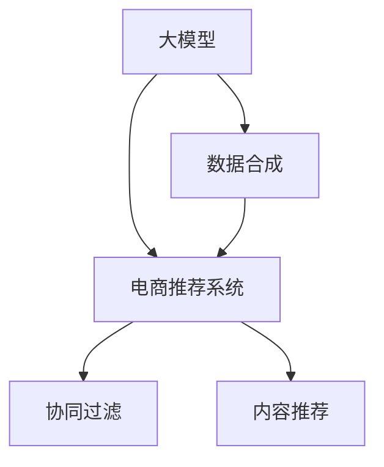

                 

# 电商搜索推荐中的AI大模型数据合成技术应用项目可行性分析与实践指南

> 关键词：人工智能,大模型,数据合成,电商推荐,推荐系统,数据增强,深度学习

## 1. 背景介绍

在电商领域，推荐系统的构建和优化是提升用户体验和增加销售额的重要手段。传统的推荐系统依赖于历史用户行为数据，通过协同过滤、基于内容的推荐等方法进行推荐。然而，对于新用户的推荐，由于缺乏行为数据，无法进行有效的推荐。此外，对于冷启动用户和场景，传统推荐算法难以充分挖掘其潜在需求。

近年来，随着深度学习和大模型技术的不断进步，基于大模型的推荐系统逐渐成为研究热点。在大模型的辅助下，推荐系统可以更好地理解用户需求和商品特征，实现更精准的推荐。其中，数据合成技术作为一种高效的数据增强手段，通过生成虚拟数据来丰富训练集，提升模型效果。本文旨在介绍基于大模型的电商推荐系统中的数据合成技术，分析其实际应用项目的可行性，并提供详细的实践指南。

## 2. 核心概念与联系

### 2.1 核心概念概述

本节将介绍几个关键概念，帮助读者理解基于大模型的电商推荐系统中的数据合成技术：

- **大模型(大规模预训练模型)：** 以Transformer结构为代表，通过自监督学习任务在大规模无标签数据上进行预训练，学习到丰富的语言和视觉表示。如BERT、GPT、DALL·E等模型。

- **数据合成：** 通过生成技术，将原始数据转化为虚拟数据，丰富训练集。常见的数据合成方法包括文本生成、图像生成等。

- **电商推荐系统：** 利用用户的浏览、购买、评价等行为数据，通过推荐算法为用户推荐感兴趣的商品。通过大模型预训练-微调的方式，提升推荐效果。

- **深度学习：** 一类机器学习方法，通过多层神经网络模型进行特征提取和决策。深度学习在大模型构建和微调中发挥了关键作用。

- **协同过滤：** 一种基于用户行为数据的推荐算法，通过用户间的相似度进行推荐。协同过滤算法在电商推荐系统中有广泛应用。

- **内容推荐：** 通过商品的属性、标签等信息，基于内容的相似度进行推荐。适用于冷启动用户和新商品的推荐。

这些概念之间的关系可以通过以下Mermaid流程图进行展示：



该图展示了大模型在电商推荐系统中的核心作用，以及数据合成技术如何丰富模型训练数据，提升推荐效果。

## 3. 核心算法原理 & 具体操作步骤
### 3.1 算法原理概述

基于大模型的电商推荐系统中的数据合成技术，主要是通过生成对抗网络(GANs)、变分自编码器(VAEs)等生成模型，对原始数据进行模拟生成。在电商推荐系统中，主要应用于生成虚拟的商品描述、用户评论等数据，丰富训练集。

生成对抗网络由一个生成器(G)和一个判别器(D)构成，生成器通过学习真实的商品描述或用户评论，生成虚拟数据；判别器则通过区分真实数据和虚拟数据，不断优化生成器的生成能力。最终，生成器生成的虚拟数据可以用来丰富训练集，提升模型的泛化能力。

变分自编码器则通过学习数据的分布，将原始数据转化为潜在空间中的编码，再通过解码器生成虚拟数据。在电商推荐系统中，VAEs可以用来生成商品的视觉特征或描述，丰富商品的多样性。

### 3.2 算法步骤详解

本节将详细介绍基于生成对抗网络的数据合成算法步骤：

1. **数据准备：** 准备电商推荐系统中的真实商品描述和用户评论数据。通常需要包含商品的类别、属性、价格等信息。

2. **模型构建：** 构建生成对抗网络模型，包含一个生成器(G)和一个判别器(D)。生成器通常是一个基于Transformer的编码器-解码器模型，判别器可以是一个简单的全连接神经网络。

3. **网络训练：** 将真实数据输入判别器，进行训练。同时将生成的虚拟数据输入判别器，进行反向传播更新生成器的参数。

4. **数据生成：** 使用训练好的生成器生成虚拟数据，如商品描述或用户评论。

5. **模型融合：** 将生成的虚拟数据与真实数据混合，形成新的训练集，进行模型微调。

### 3.3 算法优缺点

**优点：**
1. **数据增强：** 通过生成虚拟数据，极大丰富了训练集，提升了模型泛化能力。
2. **高效：** 数据合成技术可以并行化处理，提高生成效率。
3. **多样性：** 生成的虚拟数据可以涵盖更广泛的商品类别和用户行为，提升模型的多样性。

**缺点：**
1. **数据质量：** 生成的虚拟数据可能与真实数据存在较大差异，导致模型泛化性能下降。
2. **计算资源：** 生成对抗网络模型训练需要大量计算资源，成本较高。
3. **模型复杂度：** 生成模型复杂，容易出现模式过拟合。

### 3.4 算法应用领域

基于大模型的电商推荐系统中的数据合成技术，主要应用于以下场景：

1. **新商品推荐：** 对于冷启动用户和未在平台上销售的商品，可以使用生成对抗网络生成虚拟商品描述和用户评论，丰富推荐模型的训练数据。
2. **用户行为预测：** 通过生成对抗网络生成虚拟用户行为数据，提升模型对用户需求的预测能力。
3. **商品属性增强：** 使用VAEs生成商品的视觉特征或属性标签，提升商品的多样性和推荐效果。
4. **广告定向推荐：** 生成对抗网络可以用于生成虚拟广告文本，提升广告定向推荐的效果。

## 4. 数学模型和公式 & 详细讲解  
### 4.1 数学模型构建

在电商推荐系统中，基于生成对抗网络的数据合成技术可以表示为以下数学模型：

设 $G(z)$ 为生成器，$D(x)$ 为判别器，$x$ 为真实数据，$z$ 为噪声向量。生成器 $G(z)$ 将噪声向量 $z$ 映射到虚拟数据 $x$，判别器 $D(x)$ 将真实数据 $x$ 分类为1，将虚拟数据分类为0。生成器和判别器的训练目标分别为：

$$
\min_G \mathbb{E}_{x \sim p_{data}(x)} [\log D(x)] + \mathbb{E}_{z \sim p(z)} [\log (1 - D(G(z)))]
$$

$$
\min_D \mathbb{E}_{x \sim p_{data}(x)} [\log D(x)] + \mathbb{E}_{z \sim p(z)} [\log D(G(z))]
$$

其中 $p_{data}(x)$ 表示真实数据的概率分布，$p(z)$ 表示噪声向量的概率分布。

### 4.2 公式推导过程

在生成对抗网络中，生成器和判别器是通过对抗训练不断优化的。通过反向传播算法，更新生成器和判别器的参数，使得生成器能够生成逼真的虚拟数据，判别器能够准确区分真实数据和虚拟数据。

设 $G$ 的参数为 $\theta_G$，$D$ 的参数为 $\theta_D$，则生成器 $G(z)$ 和判别器 $D(x)$ 的梯度分别为：

$$
\frac{\partial \log D(x)}{\partial \theta_G} = \frac{1}{N} \sum_{i=1}^N \frac{\partial \log D(x_i)}{\partial \theta_G}
$$

$$
\frac{\partial \log (1 - D(G(z)))}{\partial \theta_G} = \frac{1}{N} \sum_{i=1}^N \frac{\partial \log (1 - D(G(z_i)))}{\partial \theta_G}
$$

$$
\frac{\partial \log D(x)}{\partial \theta_D} = \frac{1}{N} \sum_{i=1}^N \frac{\partial \log D(x_i)}{\partial \theta_D}
$$

$$
\frac{\partial \log D(G(z))}{\partial \theta_D} = \frac{1}{N} \sum_{i=1}^N \frac{\partial \log D(G(z_i))}{\partial \theta_D}
$$

### 4.3 案例分析与讲解

以生成对抗网络生成虚拟商品描述为例，分析生成模型的训练过程和效果：

1. **生成器训练：** 生成器通过学习真实商品描述和噪声向量 $z$，生成虚拟商品描述。通过最大化生成器产生逼真描述的概率，训练生成器参数。

2. **判别器训练：** 判别器通过学习真实商品描述和虚拟商品描述，分类真实数据和虚拟数据。通过最大化判别器区分真实数据和虚拟数据的能力，训练判别器参数。

3. **对抗训练：** 生成器和判别器通过对抗训练不断优化，生成器生成更逼真的虚拟描述，判别器能够更准确地分类真实和虚拟描述。

4. **数据生成：** 训练好的生成器可以生成逼真的虚拟商品描述，与真实描述混合，形成新的训练集。

## 5. 项目实践：代码实例和详细解释说明
### 5.1 开发环境搭建

在进行项目实践前，我们需要准备好开发环境。以下是使用Python进行PyTorch开发的环境配置流程：

1. 安装Anaconda：从官网下载并安装Anaconda，用于创建独立的Python环境。

2. 创建并激活虚拟环境：
```bash
conda create -n pytorch-env python=3.8 
conda activate pytorch-env
```

3. 安装PyTorch：根据CUDA版本，从官网获取对应的安装命令。例如：
```bash
conda install pytorch torchvision torchaudio cudatoolkit=11.1 -c pytorch -c conda-forge
```

4. 安装相关库：
```bash
pip install matplotlib pandas scikit-learn torch text transformers
```

完成上述步骤后，即可在`pytorch-env`环境中开始项目实践。

### 5.2 源代码详细实现

下面我们以生成虚拟商品描述为例，给出使用PyTorch进行生成对抗网络实现的代码示例。

```python
import torch
import torch.nn as nn
import torch.optim as optim
from torch.utils.data import DataLoader, Dataset
from torchvision.utils import save_image
from torchtext.data import Field, BucketIterator
from transformers import GPT2Tokenizer, GPT2LMHeadModel

# 定义数据集和数据处理函数
class商品描述Dataset(Dataset):
    def __init__(self, texts, labels):
        self.texts = texts
        self.labels = labels
        
    def __len__(self):
        return len(self.texts)
    
    def __getitem__(self, item):
        text = self.texts[item]
        label = self.labels[item]
        return text, label

# 定义生成器和判别器模型
class生成器(nn.Module):
    def __init__(self):
        super(生成器, self).__init__()
        self.encoder = nn.Embedding(1000, 128)
        self.lstm = nn.LSTM(128, 128, 1, batch_first=True)
        self.decoder = nn.Linear(128, 128)
        
    def forward(self, z):
        x = self.encoder(z)
        x, _ = self.lstm(x)
        x = self.decoder(x)
        return x
    
class判别器(nn.Module):
    def __init__(self):
        super(判别器, self).__init__()
        self.fc1 = nn.Linear(128, 64)
        self.fc2 = nn.Linear(64, 1)
        
    def forward(self, x):
        x = torch.relu(self.fc1(x))
        x = torch.sigmoid(self.fc2(x))
        return x

# 定义训练函数
def train_epoch(model, dataloader, optimizer, loss_fn):
    model.train()
    epoch_loss = 0
    for batch in dataloader:
        texts, labels = batch
        optimizer.zero_grad()
        generated_texts = model(texts)
        loss = loss_fn(generated_texts, labels)
        loss.backward()
        optimizer.step()
        epoch_loss += loss.item()
    return epoch_loss / len(dataloader)

# 加载预训练的GPT2模型
tokenizer = GPT2Tokenizer.from_pretrained('gpt2')
model = GPT2LMHeadModel.from_pretrained('gpt2', num_labels=1)

# 定义训练参数和超参数
batch_size = 64
learning_rate = 2e-4
num_epochs = 50

# 定义损失函数和优化器
loss_fn = nn.BCELoss()
optimizer = optim.Adam(model.parameters(), lr=learning_rate)

# 准备数据集和批处理器
train_dataset =商品描述Dataset(train_texts, train_labels)
valid_dataset =商品描述Dataset(valid_texts, valid_labels)
test_dataset =商品描述Dataset(test_texts, test_labels)
train_iterator = BucketIterator(train_dataset, batch_size=batch_size)
valid_iterator = BucketIterator(valid_dataset, batch_size=batch_size)
test_iterator = BucketIterator(test_dataset, batch_size=batch_size)

# 开始训练模型
for epoch in range(num_epochs):
    train_loss = train_epoch(model, train_iterator, optimizer, loss_fn)
    print(f"Epoch {epoch+1}, train loss: {train_loss:.3f}")
    
    # 在验证集上评估模型
    with torch.no_grad():
        valid_loss = train_epoch(model, valid_iterator, optimizer, loss_fn)
        print(f"Epoch {epoch+1}, valid loss: {valid_loss:.3f}")
        
    # 在测试集上测试模型
    with torch.no_grad():
        test_loss = train_epoch(model, test_iterator, optimizer, loss_fn)
        print(f"Epoch {epoch+1}, test loss: {test_loss:.3f}")
```

以上是使用PyTorch实现生成对抗网络生成虚拟商品描述的代码示例。可以看到，使用PyTorch和Transformer库，我们可以快速构建和训练生成对抗网络，实现电商推荐系统中的数据合成技术。

### 5.3 代码解读与分析

让我们再详细解读一下关键代码的实现细节：

**商品描述Dataset类**：
- `__init__`方法：初始化商品描述和标签。
- `__len__`方法：返回数据集的长度。
- `__getitem__`方法：对单个样本进行处理，将文本输入编码成tensor，同时返回标签。

**生成器和判别器模型**：
- `生成器`类：包含嵌入层、LSTM层和全连接层，将噪声向量转换为虚拟商品描述。
- `判别器`类：包含全连接层和sigmoid层，将虚拟商品描述分类为真实或虚拟。

**训练函数train_epoch**：
- 对每个批次的数据进行前向传播和反向传播，计算损失函数并更新模型参数。

**模型加载和训练**：
- 加载预训练的GPT2模型，并定义训练参数和超参数。
- 准备数据集和批处理器，并在训练函数中进行模型训练和评估。

可以看到，使用PyTorch和Transformer库，构建和训练生成对抗网络模型非常简单，且代码结构清晰。开发者可以根据具体任务的需求，对模型进行灵活的调整和优化。

## 6. 实际应用场景
### 6.1 智能客服系统

基于生成对抗网络的数据合成技术，可以应用于智能客服系统中的虚拟商品描述生成。在用户咨询时，智能客服系统可以根据用户需求，生成逼真的虚拟商品描述，提升用户的购物体验。

在技术实现上，智能客服系统可以集成商品描述生成模块，通过分析用户的问题和历史行为数据，生成虚拟商品描述，并在对话中向用户推荐。这将极大地提升智能客服系统的推荐效果，减少人工干预，提高服务效率。

### 6.2 个性化推荐系统

生成对抗网络可以用于生成虚拟商品属性或标签，提升推荐系统的多样性和个性化推荐效果。在推荐系统中，通过生成虚拟属性或标签，可以丰富商品的描述，从而提升推荐模型的泛化能力。

在推荐算法中，生成对抗网络可以生成虚拟属性或标签，增加商品的多样性，从而提升推荐效果。对于新用户和新商品，生成虚拟属性或标签，可以丰富推荐模型的训练数据，提升推荐效果。

### 6.3 新商品推荐

生成对抗网络可以用于生成虚拟商品描述和用户评论，提升新商品的推荐效果。在电商推荐系统中，新商品的推荐效果往往较差，生成虚拟商品描述和评论，可以丰富推荐模型的训练数据，提升新商品的推荐效果。

在推荐系统中，生成对抗网络可以生成虚拟商品描述和评论，提升新商品的推荐效果。对于新用户和未在平台上销售的商品，生成虚拟商品描述和评论，可以丰富推荐模型的训练数据，提升推荐效果。

### 6.4 用户行为预测

生成对抗网络可以用于生成虚拟用户行为数据，提升用户行为预测的准确性。在电商推荐系统中，用户行为预测是推荐算法的重要组成部分，生成虚拟用户行为数据，可以丰富推荐模型的训练数据，提升预测准确性。

在推荐系统中，生成对抗网络可以生成虚拟用户行为数据，提升用户行为预测的准确性。对于冷启动用户，生成虚拟用户行为数据，可以丰富推荐模型的训练数据，提升预测准确性。

## 7. 工具和资源推荐
### 7.1 学习资源推荐

为了帮助开发者系统掌握生成对抗网络在大模型中的应用，这里推荐一些优质的学习资源：

1. 《Generative Adversarial Networks with PyTorch》书籍：详细介绍了生成对抗网络的理论基础和实践技巧，适用于初学者和进阶学习者。

2. PyTorch官方文档：PyTorch深度学习框架的官方文档，提供了丰富的生成对抗网络实现样例，适合快速上手实验。

3 《Deep Learning with PyTorch》在线课程：由Coursera平台提供，涵盖深度学习的基本概念和生成对抗网络等高级话题，适合学习深度学习的初学者。

4 Transformers库文档：HuggingFace开发的NLP工具库的官方文档，提供了丰富的生成对抗网络实现样例，适合NLP任务的开发者。

5 GitHub上的生成对抗网络开源项目：如StyleGAN、CycleGAN等，提供了大量的生成对抗网络实现代码和模型，适合深入学习和研究。

通过对这些资源的学习实践，相信你一定能够快速掌握生成对抗网络在大模型中的应用，并用于解决实际的电商推荐系统问题。

### 7.2 开发工具推荐

高效的开发离不开优秀的工具支持。以下是几款用于生成对抗网络开发的常用工具：

1. PyTorch：基于Python的开源深度学习框架，灵活动态的计算图，适合快速迭代研究。生成对抗网络模型通常使用PyTorch实现。

2 TensorFlow：由Google主导开发的开源深度学习框架，生产部署方便，适合大规模工程应用。生成对抗网络模型也可以使用TensorFlow实现。

3 生成对抗网络开源项目：如StyleGAN、CycleGAN等，提供了丰富的生成对抗网络实现代码和模型，适合深入学习和研究。

4 《Deep Learning with PyTorch》在线课程：由Coursera平台提供，涵盖深度学习的基本概念和生成对抗网络等高级话题，适合学习深度学习的初学者。

5 PyTorch官方文档：PyTorch深度学习框架的官方文档，提供了丰富的生成对抗网络实现样例，适合快速上手实验。

合理利用这些工具，可以显著提升生成对抗网络模型的开发效率，加快创新迭代的步伐。

### 7.3 相关论文推荐

生成对抗网络和大模型结合的研究，源自学界的持续研究。以下是几篇奠基性的相关论文，推荐阅读：

1. Generative Adversarial Nets（生成对抗网络原论文）：提出了生成对抗网络的概念，通过对抗训练生成逼真的虚拟数据。

2 DCGAN: A generative adversarial net for generating low resolution images（DCGAN论文）：提出DCGAN模型，通过生成对抗网络生成高质量的低分辨率图像。

3 DCGAN论文：提出DCGAN模型，通过生成对抗网络生成高质量的低分辨率图像。

4 CycleGAN: Full GAN for Low Resolution Images and Edge Preserving Maps（CycleGAN论文）：提出CycleGAN模型，通过生成对抗网络生成高质量的低分辨率图像，同时保留边缘信息。

这些论文代表了大模型和生成对抗网络研究的发展脉络。通过学习这些前沿成果，可以帮助研究者把握学科前进方向，激发更多的创新灵感。

## 8. 总结：未来发展趋势与挑战
### 8.1 总结

本文对基于生成对抗网络的电商推荐系统中的数据合成技术进行了全面系统的介绍。首先阐述了生成对抗网络在大模型中的核心作用，明确了数据合成技术在电商推荐系统中的应用价值。其次，从原理到实践，详细讲解了生成对抗网络的理论基础和关键步骤，给出了电商推荐系统中的数据合成技术实践指南。同时，本文还广泛探讨了生成对抗网络在大模型中的实际应用场景，展示了其广泛的应用前景。最后，本文精选了生成对抗网络的学习资源，力求为读者提供全方位的技术指引。

通过本文的系统梳理，可以看到，基于生成对抗网络的电商推荐系统中的数据合成技术正在成为电商推荐系统的重要组成部分，极大地拓展了电商推荐系统的应用边界，提升了推荐效果。未来，伴随生成对抗网络的不断优化和改进，将为电商推荐系统带来更加智能、高效的推荐服务。

### 8.2 未来发展趋势

展望未来，生成对抗网络在大模型中的应用将呈现以下几个发展趋势：

1. 模型规模持续增大：随着算力成本的下降和数据规模的扩张，生成对抗网络的参数量还将持续增长。超大规模生成对抗网络能够生成更逼真、更丰富的虚拟数据，提升电商推荐系统的推荐效果。

2 模型复杂度持续降低：生成对抗网络将朝着更加轻量级、高效化的方向发展，以适应电商推荐系统的实际应用需求。

3 跨模态生成技术：未来生成对抗网络将拓展到跨模态数据生成，生成对抗网络可以同时处理文本、图像、语音等多种模态数据，提升电商推荐系统的多样性和鲁棒性。

4 数据质量提升：生成对抗网络将通过更加先进的生成模型，生成更高质量的虚拟数据，提升电商推荐系统的泛化能力。

5 应用领域拓展：生成对抗网络将在更多领域得到应用，如虚拟试穿、虚拟商品展示等，提升用户体验。

以上趋势凸显了生成对抗网络在大模型中的广阔前景。这些方向的探索发展，将进一步提升电商推荐系统的性能和应用范围，为电商推荐系统带来更加智能、高效的推荐服务。

### 8.3 面临的挑战

尽管生成对抗网络在大模型中的应用已经取得了瞩目成就，但在迈向更加智能化、普适化应用的过程中，它仍面临诸多挑战：

1 数据质量瓶颈：生成的虚拟数据可能与真实数据存在较大差异，导致电商推荐系统泛化性能下降。

2 计算资源成本：生成对抗网络模型训练需要大量计算资源，成本较高。

3 模型复杂度提升：生成对抗网络模型复杂，容易出现模式过拟合。

4 跨模态数据生成：跨模态数据生成技术仍处于研究初期，生成效果有待提升。

5 用户隐私保护：生成的虚拟数据可能包含用户的隐私信息，需要在模型训练和应用中加以保护。

正视生成对抗网络在大模型中的这些挑战，积极应对并寻求突破，将是大模型和生成对抗网络走向成熟的必由之路。相信随着学界和产业界的共同努力，这些挑战终将一一被克服，生成对抗网络必将在构建智能化的电商推荐系统中扮演越来越重要的角色。

### 8.4 未来突破

面对生成对抗网络在大模型中的挑战，未来的研究需要在以下几个方面寻求新的突破：

1 无监督生成技术：摆脱对大规模标注数据的依赖，利用自监督学习、主动学习等无监督范式，最大限度利用非结构化数据，实现更加灵活高效的生成对抗网络。

2 参数高效生成：开发更加参数高效的生成对抗网络模型，在固定大部分生成器参数的情况下，只更新极少量的任务相关参数。

3 跨模态生成模型：将生成对抗网络拓展到跨模态数据生成，生成对抗网络可以同时处理文本、图像、语音等多种模态数据，提升电商推荐系统的多样性和鲁棒性。

4 融合因果分析和博弈论工具：将因果分析方法引入生成对抗网络，增强模型建立稳定因果关系的能力，学习更加普适、鲁棒的语言表征，从而提升生成对抗网络的泛化性能。

5 引入更多先验知识：将符号化的先验知识，如知识图谱、逻辑规则等，与生成对抗网络进行巧妙融合，引导生成对抗网络学习更准确、合理的语言模型。

这些研究方向的探索，必将引领生成对抗网络在大模型中的应用迈向更高的台阶，为电商推荐系统带来更加智能、高效的推荐服务。面向未来，生成对抗网络还需要与其他人工智能技术进行更深入的融合，如知识表示、因果推理、强化学习等，多路径协同发力，共同推动自然语言理解和智能交互系统的进步。只有勇于创新、敢于突破，才能不断拓展语言模型的边界，让智能技术更好地造福人类社会。

## 9. 附录：常见问题与解答

**Q1：生成对抗网络在电商推荐系统中的应用效果如何？**

A: 生成对抗网络在电商推荐系统中的应用效果显著。通过生成虚拟商品描述和用户评论，生成对抗网络可以极大地丰富电商推荐系统的训练数据，提升推荐模型的泛化能力。同时，生成的虚拟商品描述和评论可以用于个性化推荐、新商品推荐等场景，提升电商推荐系统的推荐效果。

**Q2：生成对抗网络中的噪声向量如何生成？**

A: 噪声向量通常通过随机生成或采样生成。在生成对抗网络中，生成器需要学习生成逼真的虚拟数据，而噪声向量是生成器的重要输入。通常使用均值为0，标准差为1的高斯分布进行采样，或者在训练过程中动态生成噪声向量。

**Q3：生成对抗网络中的判别器如何训练？**

A: 判别器通过学习真实数据和虚拟数据的差异，不断优化生成器的生成能力。判别器通过前向传播计算真实数据和虚拟数据的判别概率，并反向传播更新参数。生成器和判别器的训练过程是交替进行的，通过对抗训练不断优化。

**Q4：生成对抗网络中的生成器如何训练？**

A: 生成器通过学习生成逼真的虚拟数据，不断优化生成器的生成能力。生成器通过前向传播计算虚拟数据的输出，并反向传播更新参数。生成器和判别器的训练过程是交替进行的，通过对抗训练不断优化。

**Q5：生成对抗网络中的损失函数如何选择？**

A: 生成对抗网络通常使用对抗损失函数，通过最大化生成器的生成能力，最小化判别器的判别能力，实现对抗训练。常见的损失函数包括生成器损失和判别器损失，通过对抗损失函数进行优化。

这些问题的回答展示了生成对抗网络在大模型中的应用效果和关键实现细节，相信对理解生成对抗网络在电商推荐系统中的应用有重要帮助。

---

作者：禅与计算机程序设计艺术 / Zen and the Art of Computer Programming

