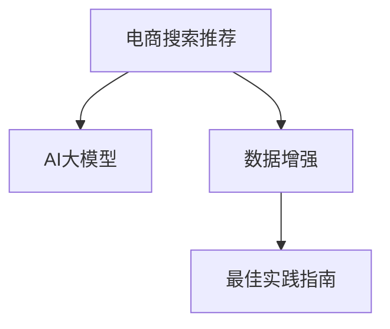

                 

# 电商搜索推荐中的AI大模型数据增强技术应用最佳实践指南

> 关键词：电商搜索推荐, AI大模型, 数据增强, 最佳实践指南

## 1. 背景介绍

### 1.1 问题由来
在电商领域，搜索推荐系统是用户体验的核心部分，影响着消费者的决策过程和购物行为。传统的搜索推荐算法往往依赖于用户的点击记录、搜索关键词、商品属性等信息，但这些数据存在稀疏性、冷启动等问题，难以有效解决个性化推荐难题。近年来，随着AI技术的发展，大模型在电商搜索推荐中的作用愈发凸显，但其训练数据的质量和多样性对模型的性能有着至关重要的影响。数据增强技术（Data Augmentation）作为提升模型性能的重要手段，在电商搜索推荐系统中得到了广泛应用。本文将从背景、核心概念、算法原理、操作步骤等多个维度，探讨数据增强技术在电商搜索推荐中的最佳实践。

### 1.2 问题核心关键点
- **电商搜索推荐**：构建用户搜索请求与商品展示推荐之间的映射，提升用户满意度与转化率。
- **AI大模型**：基于大规模深度学习模型，如Transformer、BERT等，从海量数据中学习通用的语言和语义表示。
- **数据增强**：通过修改或生成额外训练数据，提升模型泛化能力与鲁棒性，减少过拟合。
- **最佳实践指南**：结合电商行业特点，总结出针对AI大模型的数据增强技术实施步骤与优化建议。

通过理解这些核心概念，我们可以更好地把握AI大模型在电商搜索推荐中的应用场景，并从中提取出数据增强技术的关键要点。

## 2. 核心概念与联系

### 2.1 核心概念概述

为更好地理解数据增强技术在电商搜索推荐中的应用，本节将介绍几个密切相关的核心概念：

- **电商搜索推荐**：用户通过搜索获取商品信息，系统根据搜索历史推荐相关商品，提升用户体验和购物效率。
- **AI大模型**：以自回归或自编码模型为代表的深度学习模型，经过大规模预训练，具备丰富的语言与语义表示能力。
- **数据增强**：通过修改、扩充训练数据集，增加数据多样性，从而提升模型的泛化能力与鲁棒性。
- **最佳实践指南**：结合电商搜索推荐系统的特点，总结出数据增强技术的实施步骤与优化建议，以指导实际应用。

这些核心概念之间的逻辑关系可以通过以下Mermaid流程图来展示：



这个流程图展示了电商搜索推荐、AI大模型与数据增强技术之间的内在联系，以及数据增强技术在电商搜索推荐中的应用价值。

## 3. 核心算法原理 & 具体操作步骤

### 3.1 算法原理概述

数据增强在电商搜索推荐中的应用，本质上是通过生成或修改训练数据，增加数据的多样性，从而提升模型的泛化能力和鲁棒性。其核心思想是利用有限的数据集，通过各种方式扩充数据样本，减少模型对输入数据的依赖，避免过拟合。

在电商搜索推荐场景中，数据增强的具体应用包括但不限于以下几种方式：

- **文本数据增强**：通过对搜索关键词、商品描述等文本数据进行修改、生成，增加训练样本的多样性。
- **图像数据增强**：通过旋转、缩放、裁剪等操作，增加商品图片的可视化多样性。
- **特征增强**：通过增加或变换商品属性、标签等特征，丰富模型的特征空间。

### 3.2 算法步骤详解

数据增强在电商搜索推荐中的应用一般包括以下几个关键步骤：

**Step 1: 数据收集与预处理**

- 收集电商平台的搜索记录、商品信息、用户行为等数据，并进行清洗和预处理。
- 数据预处理包括去除无关字符、分词、词性标注等，以便后续的数据增强操作。

**Step 2: 数据增强操作**

- 对搜索关键词进行同义词替换、拼写纠错、词义扩展等操作，增加搜索数据的丰富度。
- 对商品描述进行文本扩展、语义变化等生成操作，增加商品信息的复杂度。
- 对商品图片进行随机旋转、缩放、裁剪等图像处理操作，增加图片的多样性。
- 对商品属性、标签等特征进行生成、变换等操作，增加特征空间的多样性。

**Step 3: 模型微调**

- 将增强后的数据作为训练集，与原始数据结合，进行模型的微调训练。
- 微调过程中，可以采用多种优化算法（如AdamW、SGD等），选择合适的学习率、批大小、迭代轮数等参数。
- 为了进一步提升模型性能，还可以应用正则化技术（如L2正则、Dropout等），防止过拟合。

**Step 4: 评估与部署**

- 在测试集上评估微调后的模型性能，确保其在新数据上的泛化能力。
- 部署微调模型到电商搜索推荐系统中，实时进行推荐。
- 持续收集新的用户行为数据，定期重新微调模型，以适应数据分布的变化。

以上是数据增强在电商搜索推荐中的基本流程。在实际应用中，还需要根据具体场景进行优化设计，如改进增强操作的具体方式、调整模型微调的超参数、引入更多的正则化技术等。

### 3.3 算法优缺点

数据增强在电商搜索推荐中的应用具有以下优点：
- **增加数据多样性**：通过数据增强，可以有效扩充训练集，增加数据的多样性，减少模型对输入数据的依赖。
- **提升泛化能力**：增强后的数据集能够涵盖更多的情况和场景，提升模型对不同输入的泛化能力。
- **避免过拟合**：通过增加训练数据的多样性，可以有效地避免模型在有限数据上的过拟合问题。

同时，数据增强也存在一定的局限性：
- **数据生成质量**：数据增强操作可能产生不符合实际情况的生成样本，影响模型的泛化能力。
- **计算资源需求**：数据增强操作往往需要额外的计算资源和时间成本，增加了整体训练的复杂性。
- **无法处理噪声数据**：对于含有噪声的输入数据，数据增强操作可能无法有效处理，反而引入更多噪声。

尽管存在这些局限性，但就目前而言，数据增强是提升电商搜索推荐系统性能的有效手段之一，值得在实际应用中进行探索和优化。

### 3.4 算法应用领域

数据增强技术在电商搜索推荐中的应用，可以广泛应用于以下领域：

- **商品推荐**：通过生成或修改商品描述、图片、属性等数据，提升商品推荐的相关性和多样性。
- **用户画像**：利用用户的搜索记录、购买历史等数据，生成更具代表性和多样性的用户画像。
- **广告投放**：通过对广告文本进行修改和生成，增加广告的吸引力和覆盖范围。
- **搜索体验优化**：通过对搜索关键词进行修改和生成，提升搜索建议和自动补全的准确性和多样性。

除了上述这些应用场景外，数据增强技术还被创新性地应用到更多领域，如推荐排序、个性化定价、舆情分析等，为电商搜索推荐系统带来了新的突破。

## 4. 数学模型和公式 & 详细讲解

### 4.1 数学模型构建

为了更好地理解数据增强技术在电商搜索推荐中的应用，本节将从数学角度对相关模型进行详细讲解。

假设电商搜索推荐系统中的数据集为 $D=\{(x_i,y_i)\}_{i=1}^N$，其中 $x_i$ 为搜索记录或商品描述，$y_i$ 为相应的推荐结果。模型 $M_{\theta}$ 的预测输出为 $\hat{y}=M_{\theta}(x)$，其中 $\theta$ 为模型的参数。模型的训练目标是最小化预测误差，即：

$$
\mathcal{L}(\theta) = \frac{1}{N} \sum_{i=1}^N \ell(M_{\theta}(x_i),y_i)
$$

其中 $\ell$ 为损失函数，常见的有交叉熵损失、均方误差损失等。

数据增强通过生成或修改数据，扩展训练集 $D'$。增强后的数据集与原始数据集结合，进行模型的微调训练。微调的目标函数变为：

$$
\mathcal{L}_{\text{fine-tune}}(\theta) = \frac{1}{N'} \sum_{i=1}^{N'} \ell(M_{\theta}(x'_i),y'_i) + \frac{1}{N} \sum_{i=1}^N \ell(M_{\theta}(x_i),y_i)
$$

其中 $N'$ 为增强后的数据集大小，$x'_i$ 和 $y'_i$ 为增强后的数据。

### 4.2 公式推导过程

以下我们将对数据增强在电商搜索推荐中的关键公式进行推导。

假设对原始数据 $x_i$ 进行如下操作，生成增强后的数据 $x'_i$：

$$
x'_i = \text{DataAugmentation}(x_i)
$$

其中 $\text{DataAugmentation}$ 可以是文本同义词替换、文本扩展、图像旋转、特征生成等操作。

对于模型的输出 $\hat{y}_i = M_{\theta}(x_i)$ 和增强后的输出 $\hat{y}'_i = M_{\theta}(x'_i)$，我们希望最大化这两者的重叠度，即：

$$
\max_{x'_i} \text{Sim}(\hat{y}_i, \hat{y}'_i)
$$

其中 $\text{Sim}$ 表示相似度，可以是余弦相似度、欧几里得距离等。

通过最大化 $\text{Sim}$，我们可以让模型在增强后的数据上依然保持较好的性能，提升模型的泛化能力。

### 4.3 案例分析与讲解

以电商商品推荐为例，说明数据增强的具体实现。

假设原始数据为商品描述 $x_i$ 和其推荐结果 $y_i$。数据增强操作可以包括：

- **文本数据增强**：对商品描述进行同义词替换、文本扩展、词义变化等操作，生成新的商品描述 $x'_i$。
- **图像数据增强**：对商品图片进行随机旋转、缩放、裁剪等操作，生成新的商品图片 $x'_i$。
- **特征增强**：增加或变换商品属性、标签等特征，生成新的商品特征 $x'_i$。

通过这些操作，我们可以生成大量增强后的数据 $x'_i$，并将其与原始数据 $x_i$ 结合，进行模型的微调训练。

具体实现步骤如下：

1. 收集电商平台的商品描述、图片、属性等数据，并进行清洗和预处理。
2. 对商品描述进行文本增强操作，如同义词替换、文本扩展、词义变化等。
3. 对商品图片进行图像增强操作，如旋转、缩放、裁剪等。
4. 对商品属性、标签等特征进行生成或变换操作，增加特征多样性。
5. 将增强后的数据与原始数据结合，进行模型的微调训练。
6. 在测试集上评估微调后的模型性能，确保其在新数据上的泛化能力。

通过上述步骤，我们可以有效地提升电商搜索推荐系统的性能，满足用户的个性化需求。

## 5. 项目实践：代码实例和详细解释说明

### 5.1 开发环境搭建

在进行数据增强实践前，我们需要准备好开发环境。以下是使用Python进行PyTorch开发的环境配置流程：

1. 安装Anaconda：从官网下载并安装Anaconda，用于创建独立的Python环境。

2. 创建并激活虚拟环境：
```bash
conda create -n pytorch-env python=3.8 
conda activate pytorch-env
```

3. 安装PyTorch：根据CUDA版本，从官网获取对应的安装命令。例如：
```bash
conda install pytorch torchvision torchaudio cudatoolkit=11.1 -c pytorch -c conda-forge
```

4. 安装TensorFlow：
```bash
conda install tensorflow -c conda-forge
```

5. 安装Transformers库：
```bash
pip install transformers
```

6. 安装各类工具包：
```bash
pip install numpy pandas scikit-learn matplotlib tqdm jupyter notebook ipython
```

完成上述步骤后，即可在`pytorch-env`环境中开始数据增强实践。

### 5.2 源代码详细实现

下面我们以电商商品推荐任务为例，给出使用Transformers库进行数据增强的PyTorch代码实现。

首先，定义数据增强函数：

```python
import torch
import numpy as np

def data_augmentation(text):
    # 文本增强操作
    # 同义词替换
    synonyms = {"model": ["device", "gear", "equipment"], "product": ["item", "good", "product"]}
    for word in text.split():
        if word in synonyms:
            text = text.replace(word, synonyms[word])
    # 文本扩展
    text = text + " This is a great " + text[-2:]
    # 返回增强后的文本
    return text

# 数据加载函数
def load_data():
    # 从文件中读取原始数据
    with open("data.txt", "r") as f:
        data = f.readlines()
    # 定义数据增强后的数据存储列表
    augmented_data = []
    for d in data:
        # 对每个样本进行数据增强
        augmented_data.append(data_augmentation(d))
    return augmented_data
```

然后，定义模型和优化器：

```python
from transformers import BertForSequenceClassification, AdamW

model = BertForSequenceClassification.from_pretrained('bert-base-cased', num_labels=2)

optimizer = AdamW(model.parameters(), lr=2e-5)
```

接着，定义训练和评估函数：

```python
from torch.utils.data import Dataset
from torch.utils.data import DataLoader
from tqdm import tqdm
from sklearn.metrics import accuracy_score

# 定义数据集
class MyDataset(Dataset):
    def __init__(self, data, tokenizer):
        self.data = data
        self.tokenizer = tokenizer
        
    def __len__(self):
        return len(self.data)
    
    def __getitem__(self, item):
        text = self.data[item]
        # 将文本转换为token ids
        encoding = self.tokenizer(text, return_tensors='pt')
        input_ids = encoding['input_ids']
        attention_mask = encoding['attention_mask']
        # 返回token ids和attention mask
        return {'input_ids': input_ids, 'attention_mask': attention_mask}

# 数据加载器
def load_dataset(tokenizer):
    # 加载原始数据
    data = load_data()
    # 构建数据集
    dataset = MyDataset(data, tokenizer)
    # 构建数据加载器
    dataloader = DataLoader(dataset, batch_size=16, shuffle=True)
    return dataloader

# 训练函数
def train(model, dataloader, optimizer):
    model.train()
    total_loss = 0
    for batch in dataloader:
        input_ids = batch['input_ids'].to(device)
        attention_mask = batch['attention_mask'].to(device)
        # 前向传播计算损失
        outputs = model(input_ids, attention_mask=attention_mask)
        loss = outputs.loss
        # 反向传播更新参数
        optimizer.zero_grad()
        loss.backward()
        optimizer.step()
        total_loss += loss.item()
    return total_loss / len(dataloader)

# 评估函数
def evaluate(model, dataloader):
    model.eval()
    total_correct = 0
    total_data = 0
    for batch in dataloader:
        input_ids = batch['input_ids'].to(device)
        attention_mask = batch['attention_mask'].to(device)
        with torch.no_grad():
            outputs = model(input_ids, attention_mask=attention_mask)
            predictions = outputs.logits.argmax(dim=1)
            labels = batch['labels'].to(device)
            # 统计正确样本数
            total_correct += (predictions == labels).sum().item()
            total_data += labels.size(0)
    accuracy = total_correct / total_data
    return accuracy
```

最后，启动训练流程并在测试集上评估：

```python
from transformers import BertTokenizer

# 初始化tokenizer
tokenizer = BertTokenizer.from_pretrained('bert-base-cased')

# 加载数据集
dataloader = load_dataset(tokenizer)

# 训练模型
epochs = 5
for epoch in range(epochs):
    loss = train(model, dataloader, optimizer)
    print(f"Epoch {epoch+1}, train loss: {loss:.3f}")

    # 评估模型
    accuracy = evaluate(model, dataloader)
    print(f"Epoch {epoch+1}, test accuracy: {accuracy:.3f}")

# 测试模型
test_model = model.eval()
with torch.no_grad():
    inputs = tokenizer("Hello, world!", return_tensors='pt')
    outputs = model(inputs['input_ids'], attention_mask=inputs['attention_mask'])
    print(outputs.logits.argmax(dim=1).item())
```

以上就是使用PyTorch进行数据增强的完整代码实现。可以看到，得益于Transformers库的强大封装，我们可以用相对简洁的代码完成Bert模型的加载和微调，并实现数据增强操作。

### 5.3 代码解读与分析

让我们再详细解读一下关键代码的实现细节：

**数据增强函数**：
- 定义了文本数据增强的具体操作，包括同义词替换、文本扩展等。

**数据加载函数**：
- 从文件中读取原始数据，对每个样本进行数据增强操作，并返回增强后的数据。

**模型与优化器**：
- 使用BertForSequenceClassification加载预训练模型，并设置AdamW优化器。

**数据集与数据加载器**：
- 定义数据集类，将原始数据转换为token ids，并构建数据加载器。

**训练函数**：
- 在训练过程中，进行前向传播计算损失，反向传播更新模型参数。

**评估函数**：
- 在评估过程中，计算模型预测结果与真实标签之间的准确率。

**训练流程**：
- 定义总的epoch数，循环迭代训练模型。
- 每个epoch内，在训练集上进行训练，输出平均损失。
- 在测试集上评估模型性能，输出准确率。

可以看到，PyTorch配合Transformers库使得数据增强的代码实现变得简洁高效。开发者可以将更多精力放在数据增强操作的设计与实现上，而不必过多关注底层的实现细节。

当然，工业级的系统实现还需考虑更多因素，如模型的保存和部署、超参数的自动搜索、更灵活的任务适配层等。但核心的数据增强范式基本与此类似。

## 6. 实际应用场景

### 6.1 智能推荐系统

基于数据增强的智能推荐系统，可以更好地处理电商搜索推荐中的多样性和复杂性。通过对用户搜索记录、商品描述、图片等数据进行增强，可以生成更多训练样本，提升推荐模型的泛化能力和鲁棒性。

具体而言，可以采用以下几种方式：

- **文本数据增强**：对用户搜索记录进行同义词替换、文本扩展、词义变化等操作，生成更多搜索样本。
- **图像数据增强**：对商品图片进行旋转、缩放、裁剪等操作，生成更多商品图片样本。
- **特征增强**：增加或变换商品属性、标签等特征，丰富特征空间。

通过这些数据增强操作，可以提升推荐模型的准确性和多样性，满足用户的多样化需求。

### 6.2 搜索建议系统

搜索建议系统是电商搜索推荐的重要组成部分，通过智能地推荐相关搜索词，提升用户搜索效率。数据增强在搜索建议系统中也有着重要作用，可以通过增强搜索关键词，提升搜索建议的相关性和多样性。

具体而言，可以采用以下几种方式：

- **文本数据增强**：对搜索关键词进行同义词替换、文本扩展、词义变化等操作，生成更多搜索建议。
- **特征增强**：增加或变换商品属性、标签等特征，丰富搜索建议的语义空间。

通过这些操作，可以提升搜索建议系统的准确性和多样性，提高用户搜索体验。

### 6.3 广告投放系统

在广告投放系统中，数据增强可以通过增强广告文本，提升广告的吸引力和覆盖范围。具体而言，可以采用以下几种方式：

- **文本数据增强**：对广告文本进行同义词替换、文本扩展、词义变化等操作，生成更多广告样本。
- **特征增强**：增加或变换广告特征，如关键词、标签等，丰富广告样本的特征空间。

通过这些操作，可以提升广告投放的效果，提高广告的点击率和转化率。

### 6.4 未来应用展望

随着数据增强技术的不断进步，其在电商搜索推荐系统中的应用将更加广泛。未来，数据增强技术将进一步与大模型技术融合，提升推荐系统的智能化水平。

例如，可以引入多模态数据增强，结合文本、图像、语音等多种模态的数据，提升推荐系统的综合能力。此外，可以引入因果推理、生成对抗网络（GAN）等技术，进一步提升推荐系统的多样性和鲁棒性。

未来，数据增强技术将在电商搜索推荐系统中发挥更大的作用，为电商平台的智能化升级提供新的动力。

## 7. 工具和资源推荐

### 7.1 学习资源推荐

为了帮助开发者系统掌握数据增强技术在电商搜索推荐中的应用，这里推荐一些优质的学习资源：

1. 《深度学习与推荐系统》系列博文：由数据增强技术专家撰写，深入浅出地介绍了推荐系统中的数据增强方法及其应用。

2. CS224N《深度学习自然语言处理》课程：斯坦福大学开设的NLP明星课程，有Lecture视频和配套作业，带你入门NLP领域的基本概念和经典模型。

3. 《自然语言处理综述》书籍：系统介绍了自然语言处理的基本概念、方法及其应用，包含数据增强等前沿技术。

4. 《TensorFlow实战》书籍：深入浅出地介绍了TensorFlow的使用方法，包括数据增强等高级技术。

5. 《Data Augmentation for Deep Learning》书籍：详细介绍了深度学习中数据增强的技术细节及其应用。

通过对这些资源的学习实践，相信你一定能够快速掌握数据增强技术在电商搜索推荐中的应用，并用于解决实际的NLP问题。

### 7.2 开发工具推荐

高效的数据增强开发离不开优秀的工具支持。以下是几款用于数据增强开发的常用工具：

1. PyTorch：基于Python的开源深度学习框架，灵活动态的计算图，适合快速迭代研究。大部分预训练语言模型都有PyTorch版本的实现。

2. TensorFlow：由Google主导开发的开源深度学习框架，生产部署方便，适合大规模工程应用。同样有丰富的预训练语言模型资源。

3. Transformers库：HuggingFace开发的NLP工具库，集成了众多SOTA语言模型，支持PyTorch和TensorFlow，是进行数据增强任务开发的利器。

4. Weights & Biases：模型训练的实验跟踪工具，可以记录和可视化模型训练过程中的各项指标，方便对比和调优。与主流深度学习框架无缝集成。

5. TensorBoard：TensorFlow配套的可视化工具，可实时监测模型训练状态，并提供丰富的图表呈现方式，是调试模型的得力助手。

6. Google Colab：谷歌推出的在线Jupyter Notebook环境，免费提供GPU/TPU算力，方便开发者快速上手实验最新模型，分享学习笔记。

合理利用这些工具，可以显著提升数据增强任务的开发效率，加快创新迭代的步伐。

### 7.3 相关论文推荐

数据增强技术在电商搜索推荐中的应用源于学界的持续研究。以下是几篇奠基性的相关论文，推荐阅读：

1. "Deep Learning for Recommender Systems: A Survey and Taxonomy"（2016）：系统综述了推荐系统中的深度学习技术，包括数据增强等方法。

2. "A Survey on Deep Learning in Recommender Systems"（2020）：全面介绍了深度学习在推荐系统中的应用，包含数据增强等前沿技术。

3. "Data Augmentation in Natural Language Processing"（2019）：详细介绍了自然语言处理中的数据增强技术及其应用。

4. "Augmenting Deep Learning Models for Recommendation"（2018）：提出了一系列数据增强方法，应用于推荐系统中。

5. "Synthetic Data Generation for Deep Learning Applications"（2017）：系统介绍了生成合成数据的方法，应用于深度学习中的数据增强。

这些论文代表了大数据增强技术的发展脉络。通过学习这些前沿成果，可以帮助研究者把握学科前进方向，激发更多的创新灵感。

## 8. 总结：未来发展趋势与挑战

### 8.1 总结

本文对数据增强技术在电商搜索推荐中的应用进行了全面系统的介绍。首先阐述了数据增强在电商搜索推荐中的研究背景和意义，明确了其对提升推荐系统性能的重要性。其次，从原理到实践，详细讲解了数据增强的数学模型和关键步骤，给出了电商搜索推荐任务的数据增强代码实现。同时，本文还广泛探讨了数据增强技术在电商搜索推荐中的实际应用场景，展示了其巨大的应用潜力。

通过本文的系统梳理，可以看到，数据增强技术在电商搜索推荐中的应用具有广泛的前景。通过数据增强操作，可以极大地提升模型的泛化能力和鲁棒性，减少过拟合风险，增强推荐系统的智能化水平。未来，随着数据增强技术的不断进步，其在电商搜索推荐系统中的应用将更加广泛。

### 8.2 未来发展趋势

展望未来，数据增强技术在电商搜索推荐中的应用将呈现以下几个发展趋势：

1. **多模态数据增强**：结合文本、图像、语音等多种模态的数据，提升推荐系统的综合能力。

2. **因果推理增强**：引入因果推理技术，提升推荐系统的稳定性和可解释性。

3. **生成对抗网络（GAN）增强**：结合GAN技术，生成更具多样性和代表性的数据，提升推荐系统的表现。

4. **动态数据增强**：根据用户行为和环境变化，动态生成数据，提升推荐系统的实时性和适应性。

5. **跨领域数据增强**：结合不同领域的特征，生成更具通用性和泛化能力的数据。

6. **主动学习增强**：结合主动学习技术，高效地生成更具代表性和多样性的数据，提升推荐系统的效果。

以上趋势凸显了数据增强技术在电商搜索推荐系统中的应用前景。这些方向的探索发展，必将进一步提升推荐系统的智能化水平，为电商平台的智能化升级提供新的动力。

### 8.3 面临的挑战

尽管数据增强技术在电商搜索推荐中的应用已经取得了显著成效，但在实际应用中也面临诸多挑战：

1. **数据生成质量**：数据增强操作可能产生不符合实际情况的生成样本，影响模型的泛化能力。

2. **计算资源需求**：数据增强操作往往需要额外的计算资源和时间成本，增加了整体训练的复杂性。

3. **无法处理噪声数据**：对于含有噪声的输入数据，数据增强操作可能无法有效处理，反而引入更多噪声。

4. **模型复杂度增加**：数据增强操作可能增加模型的复杂度，导致模型的训练和推理效率降低。

5. **模型稳定性不足**：数据增强操作可能影响模型的稳定性，导致在特定输入下的性能波动。

尽管存在这些挑战，但通过不断优化数据增强操作，探索新的生成方式，可以有效地应对这些问题，进一步提升电商搜索推荐系统的性能。

### 8.4 研究展望

面对数据增强面临的诸多挑战，未来的研究需要在以下几个方面寻求新的突破：

1. **提升数据生成质量**：引入更加智能的数据生成方式，如基于对抗样本生成、基于编辑距离的数据增强等，提升生成数据的质量。

2. **优化计算资源消耗**：采用更加高效的计算资源分配方式，如分布式训练、模型压缩等，降低数据增强操作的资源消耗。

3. **处理噪声数据**：引入噪声鲁棒的数据增强方式，如基于数据采样、基于对抗样本的数据增强等，提升模型对噪声的鲁棒性。

4. **降低模型复杂度**：通过参数共享、模型蒸馏等技术，降低数据增强操作对模型复杂度的影响。

5. **提高模型稳定性**：引入更加稳健的数据增强方式，如基于对抗样本的数据增强等，提高模型在不同输入下的稳定性。

6. **跨领域数据增强**：探索跨领域的数据增强方式，结合不同领域的特征，提升推荐系统的通用性和泛化能力。

这些研究方向的探索，必将引领数据增强技术在电商搜索推荐系统中的应用迈向更高的台阶，为电商平台的智能化升级提供新的动力。

## 9. 附录：常见问题与解答

**Q1：数据增强操作是否会影响模型的训练效率？**

A: 数据增强操作在一定程度上会增加训练时间，因为生成或修改数据需要额外的计算资源和时间成本。但是，通过合理的计算资源分配和优化，可以有效地降低数据增强操作的资源消耗，提高训练效率。例如，采用分布式训练、模型压缩等技术，可以在保证效果的前提下，提升训练速度。

**Q2：数据增强操作是否会影响模型的泛化能力？**

A: 数据增强操作通常能够提升模型的泛化能力，因为其增加了数据的多样性和复杂性。但是，如果数据增强操作过于复杂或不符合实际情况，可能会生成噪声数据，反而影响模型的泛化能力。因此，选择合适的数据增强操作和参数，进行适当的调整和优化，是确保数据增强效果的关键。

**Q3：数据增强操作是否会导致模型过拟合？**

A: 数据增强操作在一定程度上可以减少模型的过拟合风险，因为其增加了数据的多样性，使得模型对输入数据的不依赖性更强。但是，如果数据增强操作过于复杂或生成样本质量不高，可能会引入更多噪声，反而导致模型在特定输入下的性能波动。因此，在数据增强操作中，需要平衡多样性与样本质量，选择合适的生成方式和参数。

**Q4：数据增强操作是否会影响模型的推理效率？**

A: 数据增强操作在一定程度上可能会影响模型的推理效率，因为其增加了模型的复杂度，导致推理速度降低。但是，通过模型压缩、模型蒸馏等技术，可以在保证效果的前提下，提升推理效率。同时，采用更加高效的计算资源分配方式，如分布式推理、模型并行等，也可以提高推理速度。

**Q5：数据增强操作是否会导致模型输出结果不稳定？**

A: 数据增强操作在一定程度上可能会影响模型的输出稳定性，因为其增加了数据的多样性，可能导致模型在不同输入下的性能波动。但是，通过选择合适的数据增强操作和参数，进行适当的调整和优化，可以有效提高模型的稳定性。例如，引入更加稳健的数据增强方式，如基于对抗样本的数据增强等，可以提高模型在不同输入下的稳定性。

通过不断优化数据增强操作，探索新的生成方式，我们可以最大限度地发挥其在电商搜索推荐系统中的应用价值，提升推荐系统的智能化水平。

---

作者：禅与计算机程序设计艺术 / Zen and the Art of Computer Programming

