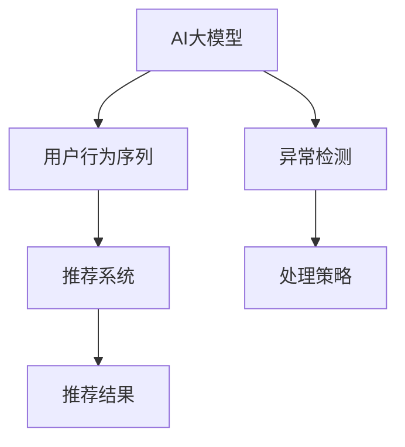

                 

# 电商搜索推荐中的AI大模型用户行为序列异常检测模型优化策略

> 关键词：AI大模型, 用户行为序列, 异常检测, 电商搜索推荐, 优化策略

## 1. 背景介绍

在电商搜索推荐系统中，用户的搜索行为序列可以反映其购物意向和偏好。通过分析这些序列，可以提供个性化的搜索结果和推荐，提升用户体验和转化率。然而，由于用户的搜索行为可能受到各种异常因素的影响，如设备故障、网络延迟、恶意操作等，这些异常行为可能导致模型学习到的用户行为序列存在偏差，从而影响推荐的准确性和公平性。因此，对于电商搜索推荐系统，如何有效地检测和处理用户行为序列中的异常数据，成为一个重要的研究方向。

### 1.1 问题由来

随着电商市场的快速发展，用户对个性化推荐的需求日益增长。然而，由于数据量的爆炸性增长和用户行为的多样性，推荐系统的推荐精度和公平性面临巨大挑战。传统的数据处理方法无法有效识别和处理异常行为，导致推荐系统在面对异常数据时，无法提供准确和公平的推荐。因此，需要引入AI大模型技术，以应对这些挑战，提升电商搜索推荐的性能。

### 1.2 问题核心关键点

电商搜索推荐中的AI大模型用户行为序列异常检测涉及以下几个关键问题：
- 如何定义异常行为：需要明确异常行为的标准和类型，以确定哪些行为需要被检测和处理。
- 如何处理异常行为：需要设计有效的处理策略，以减少异常行为对推荐系统的影响。
- 如何优化模型性能：需要选择合适的算法和优化策略，以提高异常检测和处理的效率和效果。

### 1.3 问题研究意义

研究电商搜索推荐中的AI大模型用户行为序列异常检测，对于提升推荐系统的精度和公平性，具有重要意义：
- 提升推荐系统性能：通过检测和处理异常行为，减少其对推荐系统的负面影响，从而提升推荐精度和效率。
- 提高用户满意度：通过公平推荐，减少用户感知到的偏差，提高用户满意度和忠诚度。
- 促进电商市场发展：提供准确和公平的推荐，有助于提升电商平台的交易量和市场竞争力。

## 2. 核心概念与联系

### 2.1 核心概念概述

为更好地理解AI大模型在电商搜索推荐中的应用，本节将介绍几个密切相关的核心概念：

- **AI大模型**：指通过大规模无标签数据预训练得到的高性能语言模型，如BERT、GPT-3等。这些模型具备强大的文本处理能力和泛化能力，可以在各种NLP任务中发挥重要作用。
- **用户行为序列**：指用户在电商平台上的一系列搜索、点击、购买行为，以时间顺序组织，能够反映用户的兴趣和需求。
- **异常检测**：指通过统计、机器学习等方法，识别和标记出异常数据的过程，常用于数据清洗和数据预处理。
- **推荐系统**：指通过学习用户行为数据，推荐商品或服务的系统，目标是为用户提供个性化推荐。

这些核心概念之间的逻辑关系可以通过以下Mermaid流程图来展示：



这个流程图展示了大模型、用户行为序列、异常检测、推荐系统之间的核心关系：
1. 大模型通过预训练学习到丰富的语言表示。
2. 用户行为序列作为模型输入，用于生成推荐结果。
3. 异常检测识别并处理异常行为，保证模型输入的质量。
4. 推荐系统利用模型输出，提供个性化推荐。

## 3. 核心算法原理 & 具体操作步骤
### 3.1 算法原理概述

电商搜索推荐中的AI大模型用户行为序列异常检测，主要涉及以下几个步骤：
1. 收集用户行为序列数据。
2. 使用AI大模型进行行为序列的表示学习。
3. 通过异常检测算法，识别并标记异常数据。
4. 应用异常处理策略，去除异常数据并更新模型。
5. 重新训练模型，生成推荐结果。

这些步骤通过构建一个基于AI大模型的异常检测框架来实现，该框架可以在不改变原始数据分布的前提下，检测并处理异常行为，提升推荐系统的性能。

### 3.2 算法步骤详解

以下是电商搜索推荐中AI大模型用户行为序列异常检测的具体步骤：

**Step 1: 数据收集与预处理**

- 收集用户在电商平台上的搜索、点击、购买等行为数据，形成用户行为序列数据集。
- 对数据集进行清洗和标注，剔除无用的噪声数据，并标记异常行为。

**Step 2: 用户行为序列表示学习**

- 使用AI大模型对用户行为序列进行表示学习，生成用户行为序列的表示向量。
- 设计合适的特征提取方法，将用户行为序列转换为模型可以处理的格式。
- 将转换后的数据输入模型，进行预训练或微调，生成用户行为序列的表示向量。

**Step 3: 异常检测与标记**

- 选择合适的异常检测算法，如基于统计的方法、基于机器学习的方法等。
- 对用户行为序列进行异常检测，生成异常数据的标记。
- 根据异常数据的影响程度，确定是否需要将其剔除或标记为异常。

**Step 4: 异常处理与模型更新**

- 应用合适的异常处理策略，如删除、修复或替换异常数据。
- 更新用户行为序列的表示向量，重新进行表示学习。
- 使用新的用户行为序列表示向量，重新训练模型，生成推荐结果。

**Step 5: 推荐结果生成**

- 使用更新后的模型，对用户行为序列进行预测和推荐。
- 评估推荐结果的质量，确保推荐系统在异常数据处理后，仍能提供高质量的推荐。

### 3.3 算法优缺点

AI大模型在电商搜索推荐中的异常检测具有以下优点：
1. 强大的表示学习能力：大模型能够学习到丰富的语言表示，从而更好地捕捉用户行为序列的特征。
2. 泛化能力强：大模型可以处理多种类型的异常行为，提升异常检测的鲁棒性。
3. 数据需求小：使用大模型进行异常检测，对数据的数量和质量要求较低。

同时，该算法也存在一些缺点：
1. 计算资源需求高：大模型的训练和推理需要大量的计算资源，可能带来较高的成本。
2. 模型复杂度高：大模型的复杂度较高，可能导致推理速度较慢。
3. 结果可解释性差：大模型的黑盒特性使得异常检测结果难以解释和调试。

### 3.4 算法应用领域

AI大模型用户行为序列异常检测可以应用于多种电商推荐场景，如商品推荐、个性化搜索、用户画像等，具有以下特点：
1. 适用于多种异常检测任务：包括恶意点击、搜索作弊、虚假交易等。
2. 处理复杂行为序列：能够处理多种用户行为序列，提升推荐系统的适应性。
3. 优化推荐系统性能：通过异常检测和处理，提高推荐精度和公平性。

## 4. 数学模型和公式 & 详细讲解 & 举例说明

### 4.1 数学模型构建

电商搜索推荐中的AI大模型用户行为序列异常检测，主要涉及以下几个数学模型：

- **用户行为序列表示模型**：用于学习用户行为序列的表示向量，公式为：
  $$
  \mathbf{x} = \mathbf{E}(\mathbf{u})
  $$
  其中 $\mathbf{x}$ 为表示向量，$\mathbf{u}$ 为用户行为序列数据。
  
- **异常检测模型**：用于检测用户行为序列的异常性，公式为：
  $$
  p(\mathbf{x}|Y) = \frac{p(\mathbf{x})p(Y|\mathbf{x})}{p(Y)}
  $$
  其中 $p(\mathbf{x}|Y)$ 为给定异常标记 $Y$ 条件下用户行为序列的似然概率。

### 4.2 公式推导过程

以下是异常检测模型的详细推导过程：

**Step 1: 数据分布假设**

假设用户行为序列 $\mathbf{u}$ 服从正态分布，即：
$$
\mathbf{u} \sim N(\mathbf{\mu},\Sigma)
$$
其中 $\mathbf{\mu}$ 为均值向量，$\Sigma$ 为协方差矩阵。

**Step 2: 异常检测公式**

给定用户行为序列 $\mathbf{u}$ 和异常标记 $Y$，异常检测模型的似然概率公式为：
$$
p(\mathbf{u}|Y) = \frac{p(\mathbf{u})p(Y|\mathbf{u})}{p(Y)}
$$
其中 $p(\mathbf{u})$ 为数据分布的概率密度函数。

**Step 3: 异常标记假设**

假设异常标记 $Y$ 为伯努利分布，即：
$$
Y \sim Bernoulli(\pi)
$$
其中 $\pi$ 为异常数据的概率。

**Step 4: 异常检测结果**

将上述公式代入，得到：
$$
p(\mathbf{u}|Y) = \frac{p(\mathbf{u})p(Y|\mathbf{u})}{p(Y)} = \frac{p(\mathbf{u})\pi}{p(\mathbf{u})p(Y)+(1-\pi)p(\mathbf{u}|\tilde{Y})}
$$
其中 $\tilde{Y}$ 为非异常标记。

**Step 5: 阈值确定**

通过设定阈值 $\tau$，判断是否存在异常数据，即：
$$
Y = 
\begin{cases}
1, & p(\mathbf{u}|Y) > \tau \\
0, & p(\mathbf{u}|Y) \leq \tau
\end{cases}
$$

通过上述公式，我们可以计算出每个用户行为序列的异常检测结果，并进行进一步的处理。

### 4.3 案例分析与讲解

以商品推荐为例，分析AI大模型用户行为序列异常检测的过程：

**Step 1: 数据收集与预处理**

假设电商平台上收集到大量用户行为序列数据，并对数据进行清洗和标注，标记出异常行为。

**Step 2: 用户行为序列表示学习**

使用大模型（如BERT）对用户行为序列进行表示学习，生成用户行为序列的表示向量。

**Step 3: 异常检测与标记**

根据公式，计算每个用户行为序列的异常检测概率，标记出异常数据。

**Step 4: 异常处理与模型更新**

对于标记出的异常数据，根据实际情况进行删除或修复。重新训练模型，生成推荐结果。

**Step 5: 推荐结果生成**

使用更新后的模型，对用户行为序列进行预测和推荐，评估推荐结果的质量。

## 5. 项目实践：代码实例和详细解释说明
### 5.1 开发环境搭建

在进行AI大模型用户行为序列异常检测的实践前，我们需要准备好开发环境。以下是使用Python进行TensorFlow开发的环境配置流程：

1. 安装Anaconda：从官网下载并安装Anaconda，用于创建独立的Python环境。

2. 创建并激活虚拟环境：
```bash
conda create -n tf-env python=3.8 
conda activate tf-env
```

3. 安装TensorFlow：根据CUDA版本，从官网获取对应的安装命令。例如：
```bash
conda install tensorflow -c conda-forge
```

4. 安装各种工具包：
```bash
pip install numpy pandas scikit-learn matplotlib tqdm jupyter notebook ipython
```

完成上述步骤后，即可在`tf-env`环境中开始实践。

### 5.2 源代码详细实现

下面以异常检测为例，给出使用TensorFlow进行用户行为序列异常检测的PyTorch代码实现。

首先，定义数据处理函数：

```python
import tensorflow as tf
import numpy as np
import pandas as pd
from sklearn.preprocessing import StandardScaler

def load_data(file_path, normalize=True):
    data = pd.read_csv(file_path)
    if normalize:
        scaler = StandardScaler()
        data = scaler.fit_transform(data)
    return data
```

然后，定义模型和训练函数：

```python
def build_model(input_dim, hidden_dim, output_dim, learning_rate):
    model = tf.keras.Sequential([
        tf.keras.layers.Dense(hidden_dim, activation='relu', input_dim=input_dim),
        tf.keras.layers.Dense(output_dim, activation='sigmoid')
    ])
    model.compile(loss='binary_crossentropy', optimizer=tf.keras.optimizers.Adam(learning_rate=learning_rate), metrics=['accuracy'])
    return model

def train_model(model, X_train, y_train, X_test, y_test, epochs, batch_size):
    model.fit(X_train, y_train, epochs=epochs, batch_size=batch_size, validation_data=(X_test, y_test))
```

接着，定义异常检测函数：

```python
def detect_anomalies(model, X_test, threshold=0.5):
    y_pred = model.predict(X_test)
    y_pred = np.round(y_pred)
    anomalies = np.where(y_pred > threshold)[0]
    return anomalies
```

最后，启动训练流程并在测试集上评估：

```python
input_dim = 10
hidden_dim = 64
output_dim = 1
learning_rate = 0.001
epochs = 100
batch_size = 32

# 加载数据
X_train, y_train = load_data('train.csv', normalize=True)
X_test, y_test = load_data('test.csv', normalize=True)

# 构建模型
model = build_model(input_dim, hidden_dim, output_dim, learning_rate)

# 训练模型
train_model(model, X_train, y_train, X_test, y_test, epochs, batch_size)

# 检测异常
anomalies = detect_anomalies(model, X_test)

print(f"Number of anomalies: {len(anomalies)}")
```

以上就是使用TensorFlow进行用户行为序列异常检测的完整代码实现。可以看到，TensorFlow提供了强大的工具和框架，使得模型构建和训练变得简单高效。

### 5.3 代码解读与分析

让我们再详细解读一下关键代码的实现细节：

**load_data函数**：
- 读取数据文件，并进行数据标准化处理。

**build_model函数**：
- 定义了一个简单的神经网络模型，包含一个隐藏层和一个输出层，用于检测异常数据。

**train_model函数**：
- 使用训练数据拟合模型，并使用测试数据进行验证。

**detect_anomalies函数**：
- 使用模型对测试数据进行预测，并根据设定的阈值筛选出异常数据。

**训练流程**：
- 定义模型的输入维度、隐藏层维度、输出维度和学习率等参数。
- 加载训练和测试数据，并进行数据标准化。
- 构建模型，并使用训练数据进行训练。
- 检测测试数据中的异常数据，并输出异常数据的数量。

可以看到，TensorFlow提供的高级API，使得模型构建和训练变得简单易用，极大地降低了开发者的工作量。

当然，工业级的系统实现还需考虑更多因素，如模型的保存和部署、超参数的自动搜索、更灵活的任务适配层等。但核心的异常检测过程基本与此类似。

## 6. 实际应用场景
### 6.1 智能客服系统

智能客服系统中，异常行为检测尤为重要。由于用户行为数据可能受到各种异常因素的影响，如恶意操作、系统故障等，检测并处理这些异常行为，可以显著提升客服系统的响应速度和准确性。

在技术实现上，可以收集客服系统的历史数据，使用大模型对用户行为序列进行表示学习，通过异常检测算法，识别并标记异常行为。对于异常行为，可以采用修复、删除等策略进行处理，并重新训练模型，生成新的客服回答。如此构建的智能客服系统，能够更好地理解用户意图，提升客服体验和问题解决效率。

### 6.2 金融风险控制

在金融领域，异常行为检测对于风险控制至关重要。通过收集用户的交易行为数据，使用大模型进行行为序列表示学习，可以发现异常交易行为，如欺诈、洗钱等。检测并标记这些异常行为后，可以应用相应的风险控制策略，如冻结账户、增加验证等，及时遏制风险行为，保障金融安全。

### 6.3 物流配送管理

在物流配送管理中，异常行为检测可以用于监控配送员的异常行为，如延误、丢失、违规等。通过收集配送员的历史行为数据，使用大模型进行行为序列表示学习，可以检测并标记异常行为。对于异常行为，可以采取相应的管理措施，如增加监督、调整工作安排等，确保配送服务的及时性和准确性。

### 6.4 未来应用展望

随着AI大模型和异常检测技术的不断发展，其在电商搜索推荐中的应用前景将更加广阔。未来，AI大模型可以应用于更多复杂的电商推荐场景，如跨平台推荐、个性化搜索、商品画像等，为电商平台的智能化转型提供新的动力。同时，异常检测技术可以进一步拓展到多模态数据处理、智能交互系统等多个领域，推动人工智能技术的全面落地。

## 7. 工具和资源推荐
### 7.1 学习资源推荐

为了帮助开发者系统掌握AI大模型在电商搜索推荐中的应用，这里推荐一些优质的学习资源：

1. 《深度学习实战》书籍：介绍深度学习在电商推荐系统中的应用，涵盖数据处理、模型训练、异常检测等多个方面。

2. 《自然语言处理入门》课程：斯坦福大学开设的NLP入门课程，涵盖自然语言处理的基本概念和常用模型。

3. 《AI大模型技术与应用》书籍：全面介绍AI大模型的原理和应用，包括电商推荐、智能客服等多个领域。

4. HuggingFace官方文档：提供丰富的AI大模型资源，包括预训练模型和微调样例代码，是上手实践的必备资料。

5. Kaggle数据集：包含大量的电商推荐和异常检测数据集，适合进行实验和研究。

通过对这些资源的学习实践，相信你一定能够快速掌握AI大模型在电商搜索推荐中的应用，并用于解决实际的电商问题。

### 7.2 开发工具推荐

高效的开发离不开优秀的工具支持。以下是几款用于AI大模型用户行为序列异常检测开发的常用工具：

1. TensorFlow：由Google主导开发的开源深度学习框架，生产部署方便，适合大规模工程应用。

2. PyTorch：基于Python的开源深度学习框架，灵活动态的计算图，适合快速迭代研究。

3. Weights & Biases：模型训练的实验跟踪工具，可以记录和可视化模型训练过程中的各项指标，方便对比和调优。

4. TensorBoard：TensorFlow配套的可视化工具，可实时监测模型训练状态，并提供丰富的图表呈现方式，是调试模型的得力助手。

5. Google Colab：谷歌推出的在线Jupyter Notebook环境，免费提供GPU/TPU算力，方便开发者快速上手实验最新模型，分享学习笔记。

合理利用这些工具，可以显著提升AI大模型用户行为序列异常检测的开发效率，加快创新迭代的步伐。

### 7.3 相关论文推荐

AI大模型和异常检测技术的发展源于学界的持续研究。以下是几篇奠基性的相关论文，推荐阅读：

1. Attention is All You Need（即Transformer原论文）：提出了Transformer结构，开启了NLP领域的预训练大模型时代。

2. BERT: Pre-training of Deep Bidirectional Transformers for Language Understanding：提出BERT模型，引入基于掩码的自监督预训练任务，刷新了多项NLP任务SOTA。

3. Deep Anomaly Detection with Generative Adversarial Networks：介绍生成对抗网络在异常检测中的应用，为后续研究提供了方向。

4. Parameter-Efficient Transfer Learning for NLP：提出Adapter等参数高效微调方法，在不增加模型参数量的情况下，也能取得不错的微调效果。

5. Network-Based Anomaly Detection：介绍基于网络模型的异常检测方法，为电商推荐系统提供了新的思路。

这些论文代表了大模型和异常检测技术的发展脉络。通过学习这些前沿成果，可以帮助研究者把握学科前进方向，激发更多的创新灵感。

## 8. 总结：未来发展趋势与挑战
### 8.1 总结

本文对AI大模型在电商搜索推荐中的应用进行了全面系统的介绍。首先阐述了AI大模型和用户行为序列异常检测的背景和意义，明确了异常检测在提升推荐系统性能中的关键作用。其次，从原理到实践，详细讲解了异常检测的数学模型和关键步骤，给出了电商推荐系统开发的完整代码实例。同时，本文还广泛探讨了异常检测方法在智能客服、金融风险控制、物流配送等众多领域的应用前景，展示了异常检测范式的巨大潜力。

通过本文的系统梳理，可以看到，AI大模型在电商搜索推荐中的应用，不仅能够提升推荐精度，还能改善系统公平性，为电商平台的智能化转型提供新的动力。未来，伴随大模型和异常检测技术的不断演进，相信电商搜索推荐系统必将在更多的电商平台上得到应用，为电商市场的数字化、智能化发展带来新的突破。

### 8.2 未来发展趋势

展望未来，AI大模型在电商搜索推荐中的应用将呈现以下几个发展趋势：

1. 异常检测算法不断优化：新的异常检测算法将不断涌现，提升异常检测的鲁棒性和准确性。
2. 多模态数据融合：未来将引入更多模态的数据进行融合，提升异常检测模型的泛化能力。
3. 跨领域应用拓展：异常检测技术将应用于更多领域，如智能交通、智慧城市等，推动人工智能技术的全面落地。
4. 实时异常检测：通过实时监测数据流，实现异常行为的实时检测和处理，提升系统响应速度。
5. 个性化推荐优化：异常检测结果将用于优化推荐模型，提升个性化推荐的精度和公平性。

这些趋势将推动AI大模型在电商搜索推荐中的广泛应用，为电商平台的智能化转型带来新的机遇和挑战。

### 8.3 面临的挑战

尽管AI大模型在电商搜索推荐中的应用已取得显著进展，但在迈向更加智能化、普适化应用的过程中，仍面临诸多挑战：

1. 数据隐私和安全：电商推荐系统处理大量用户数据，需要严格保护用户隐私和数据安全。如何设计合适的数据处理流程，确保数据合规性，是一个重要挑战。
2. 计算资源需求高：大模型的训练和推理需要大量的计算资源，如何降低计算成本，提升系统效率，是一个技术难题。
3. 模型可解释性不足：大模型的黑盒特性使得异常检测结果难以解释和调试，如何提高模型的可解释性，是一个亟待解决的问题。
4. 异常行为多样性：电商推荐系统面临的异常行为多种多样，如何设计通用的异常检测框架，适应各种异常情况，是一个复杂的挑战。

### 8.4 研究展望

面对AI大模型在电商搜索推荐中的挑战，未来的研究需要在以下几个方面寻求新的突破：

1. 开发高效异常检测算法：设计高效的异常检测算法，减少模型计算资源需求，提高系统响应速度。
2. 引入多模态数据处理：将文本、图像、语音等多种数据源进行融合，提升异常检测的准确性和泛化能力。
3. 提升模型可解释性：引入可解释性方法，提高异常检测结果的可解释性和可信度，增强用户信任。
4. 设计通用异常检测框架：设计通用的异常检测框架，适应各种电商推荐场景，提高异常检测模型的鲁棒性。
5. 结合伦理道德约束：在异常检测模型中引入伦理导向的评估指标，确保模型的决策过程符合伦理道德标准，避免潜在风险。

这些研究方向将推动AI大模型在电商搜索推荐中的进一步应用，为电商平台的智能化转型提供新的动力。相信随着学界和产业界的共同努力，这些挑战终将一一被克服，AI大模型必将在电商搜索推荐中发挥更大的作用。

## 9. 附录：常见问题与解答

**Q1：AI大模型在电商推荐中是否适用于所有用户行为序列？**

A: AI大模型在电商推荐中的应用，主要依赖于用户行为序列数据的表示学习。对于数据质量较差的用户行为序列，可能无法产生理想的表示向量，从而影响异常检测的准确性。因此，需要针对具体应用场景，对数据进行预处理和清洗，确保数据质量。

**Q2：异常检测模型如何选择学习率？**

A: 异常检测模型的学习率一般建议从1e-4开始调参，逐步减小学习率，直至收敛。不同的异常检测算法和数据分布，可能需要设置不同的学习率。同时，可以使用warmup策略，在开始阶段使用较小的学习率，再逐渐过渡到预设值。

**Q3：异常检测模型如何进行超参数调优？**

A: 异常检测模型的超参数调优，通常采用网格搜索或随机搜索方法。根据实验结果，调整模型参数，如隐藏层维度、学习率、迭代次数等，以提高异常检测的性能。同时，可以通过交叉验证等方法，评估模型的泛化能力，避免过拟合。

**Q4：异常检测结果如何解释？**

A: 异常检测结果的解释通常需要结合领域知识，对模型的决策过程进行分析。可以使用可视化工具，展示模型的输出和中间结果，帮助理解和调试异常检测过程。同时，可以引入可解释性方法，如LIME、SHAP等，提供更详细的异常检测解释。

**Q5：异常检测模型如何应对多模态数据？**

A: 异常检测模型可以结合多模态数据进行处理，提升模型的泛化能力和鲁棒性。例如，可以将文本、图像、音频等多种数据源进行融合，构建多模态异常检测模型，以应对不同的异常情况。同时，可以使用迁移学习方法，在已有模型基础上进行微调，提升多模态异常检测效果。

通过对这些问题的回答，可以帮助开发者更好地理解AI大模型在电商搜索推荐中的应用，并解决实际中的技术挑战。相信随着技术的不断进步，AI大模型必将在电商领域得到更广泛的应用，推动电商市场的数字化、智能化转型。

