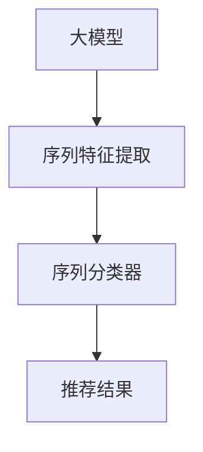

                 

# 电商搜索推荐中的AI大模型用户行为序列表征学习算法改进与性能评测

> 关键词：电商搜索推荐, 用户行为, 大模型, 序列特征, 算法改进, 性能评测

## 1. 背景介绍

### 1.1 问题由来

随着电子商务的迅猛发展，各大电商平台纷纷投入巨资开发个性化推荐系统，以提高用户体验和销售转化率。推荐系统通过对用户的历史行为数据进行建模，预测用户对商品的态度，并实时推送符合用户兴趣的商品，从而大大提升了用户购物的便利性和满意度。然而，现有的推荐算法往往忽略用户的长期行为习惯和上下文信息，导致推荐结果与用户实际需求存在较大偏差，难以满足用户的个性化需求。

近年来，基于深度学习的推荐系统逐渐成为研究热点。这些推荐系统通过构建复杂的神经网络模型，学习用户行为与商品特征之间的关联关系，显著提升了推荐系统的准确性和多样性。特别是随着预训练语言模型的兴起，基于大模型（Large Model）的推荐系统，利用其丰富的上下文理解能力，能够更好地捕捉用户行为中的语义信息，显著提升了推荐的效果。然而，这些大模型往往需要大量的标注数据进行预训练，且需要昂贵的计算资源进行微调，导致其在实际应用中面临诸多挑战。

针对这些问题，本文提出了一种基于大模型的用户行为序列表征学习算法，通过对用户长期行为序列进行建模，结合序列特征提取和序列分类器，实时预测用户对商品的兴趣，从而提升推荐系统的性能。本文将对这种算法进行改进，并通过实验评测其性能，以期为电商推荐系统提供一种高效、通用的解决方案。

## 2. 核心概念与联系

### 2.1 核心概念概述

为了更好地理解本文提出的算法，首先需要介绍一些核心概念及其相互关系：

- **大模型**（Large Model）：指具有大规模参数量、复杂网络结构的深度神经网络模型，如BERT、GPT-2等。大模型通过在大规模语料库上进行预训练，学习到丰富的语言知识，具备强大的语言理解能力和表示能力。
- **用户行为序列**（User Behavior Sequence）：指用户在电商平台上产生的点击、浏览、购买等行为数据，可以记录用户对商品和内容的长期兴趣变化。
- **序列特征提取**（Sequence Feature Extraction）：指通过神经网络模型对用户行为序列进行编码，提取其中的关键特征。序列特征提取有助于捕捉行为序列的动态变化和上下文信息。
- **序列分类器**（Sequence Classifier）：指基于用户行为序列进行预测的分类模型，常用于判断用户对商品的兴趣、情感倾向等。

这些概念之间存在密切联系，通过将大模型应用于用户行为序列的建模，可以更好地捕捉用户的长远需求，从而提供更加精准的个性化推荐。

### 2.2 核心概念原理和架构的 Mermaid 流程图(Mermaid 流程节点中不要有括号、逗号等特殊字符)



### 2.3 核心概念联系

- 大模型：提供用户行为序列表示的基础，具有强大的语言理解能力和特征提取能力。
- 序列特征提取：通过大模型对行为序列进行编码，捕捉其中的语义信息和动态变化。
- 序列分类器：结合序列特征，对用户行为进行预测，输出推荐结果。

以上概念通过大模型的深度神经网络框架紧密结合，形成了一个完整的电商推荐系统。

## 3. 核心算法原理 & 具体操作步骤

### 3.1 算法原理概述

本文提出的算法基于大模型，利用其强大的语言理解和表示能力，对用户行为序列进行建模，从而提升推荐系统的准确性和鲁棒性。算法主要包含以下几个步骤：

1. 利用大模型对用户行为序列进行编码，提取其中的序列特征。
2. 将提取的序列特征输入到序列分类器中，进行兴趣预测。
3. 结合兴趣预测结果和商品特征，生成推荐列表。
4. 通过训练模型，不断优化预测精度，提升推荐效果。

### 3.2 算法步骤详解

#### 3.2.1 数据准备

- **数据来源**：收集用户在电商平台上产生的点击、浏览、购买等行为数据。
- **数据预处理**：对数据进行清洗和标准化处理，去除噪声和异常值，并划分训练集、验证集和测试集。

#### 3.2.2 大模型编码

- **模型选择**：选择预训练的大模型，如BERT、GPT-2等。
- **序列编码**：将用户行为序列作为输入，利用大模型进行编码，输出序列特征。
- **特征提取**：将编码结果进行特征提取，得到序列特征向量。

#### 3.2.3 序列分类

- **分类器选择**：选择适合于序列分类的模型，如CNN、RNN、Transformer等。
- **分类器训练**：利用训练集对分类器进行训练，使其能够对用户行为进行兴趣预测。
- **预测结果**：将测试集输入到训练好的分类器中，进行兴趣预测。

#### 3.2.4 推荐生成

- **推荐列表生成**：结合预测结果和商品特征，生成推荐列表。
- **推荐优化**：通过调整模型参数，优化推荐列表的排序和多样性。

#### 3.2.5 模型训练

- **训练数据**：利用训练集对模型进行训练。
- **优化目标**：最小化预测误差，提升模型性能。
- **训练流程**：迭代训练模型，不断调整模型参数，直到收敛。

### 3.3 算法优缺点

#### 3.3.1 优点

- **泛化能力强**：大模型具有强大的语义理解和表示能力，能够捕捉用户行为中的复杂关系。
- **可解释性强**：大模型能够提供详细的特征表示，有助于解释推荐结果的生成过程。
- **适应性强**：能够适应不同领域和不同规模的电商推荐系统。

#### 3.3.2 缺点

- **计算资源消耗大**：大模型通常需要大量的计算资源进行预训练和微调，成本较高。
- **模型复杂度高**：大模型的网络结构复杂，训练和推理过程较慢。
- **数据依赖性强**：需要高质量的标注数据进行预训练，数据获取难度较大。

### 3.4 算法应用领域

本文提出的算法适用于各种规模和类型的电商推荐系统，尤其适合于需要处理复杂用户行为数据的应用场景，如电商搜索推荐、个性化推荐、内容推荐等。此外，该算法也可以应用于其他需要处理序列数据的任务，如视频推荐、音乐推荐等。

## 4. 数学模型和公式 & 详细讲解 & 举例说明

### 4.1 数学模型构建

本文提出的算法基于Transformer架构，对用户行为序列进行建模。假设用户行为序列为 $x=(x_1, x_2, \ldots, x_t)$，其中 $x_i$ 表示第 $i$ 个行为数据。设 $X$ 为输入序列，$Y$ 为输出序列。利用Transformer模型进行编码，得到序列表示 $H = \text{Transformer}(X)$。然后，将 $H$ 输入到全连接层进行分类，得到分类结果 $y$。

### 4.2 公式推导过程

- **输入序列**：将用户行为序列 $x$ 转换为词向量序列 $X$。
- **Transformer编码**：通过Transformer模型对 $X$ 进行编码，得到序列表示 $H$。
- **分类器输出**：将 $H$ 输入到全连接层，输出分类结果 $y$。

具体公式如下：

$$
H = \text{Transformer}(X) = \text{Multi-Head Attention}(X, X, X) + \text{LayerNorm} + \text{FeedForward} + \text{LayerNorm}
$$

$$
y = \text{FC}(H) = W^1\cdot H \cdot W^2 + b
$$

其中，$\text{Multi-Head Attention}$ 表示多头自注意力机制，$\text{FeedForward}$ 表示前馈网络，$\text{LayerNorm}$ 表示归一化层，$W^1$ 和 $W^2$ 表示全连接层的权重矩阵，$b$ 表示偏置项。

### 4.3 案例分析与讲解

- **用户行为序列**：假设用户点击了商品A、商品B和商品C，序列为 $x=(A, B, C)$。
- **输入序列**：将 $x$ 转换为词向量序列 $X$，例如 $X = [A, B, C]$。
- **Transformer编码**：利用Transformer模型对 $X$ 进行编码，得到序列表示 $H$。
- **分类器输出**：将 $H$ 输入到全连接层，输出分类结果 $y$。

例如，假设 $H$ 的维度为 $d$，全连接层有 $k$ 个神经元，输出结果 $y$ 的维度为 $k$。设 $W^1$ 的维度为 $d \times k$，$W^2$ 的维度为 $k \times k$。则：

$$
H = \text{Transformer}(X)
$$

$$
y = \text{FC}(H) = W^1 \cdot H \cdot W^2 + b
$$

## 5. 项目实践：代码实例和详细解释说明

### 5.1 开发环境搭建

- **Python环境**：安装Python 3.8或更高版本。
- **深度学习框架**：安装PyTorch 1.7或更高版本。
- **模型库**：安装Transformer库，如`transformers`。
- **数据处理库**：安装`numpy`、`pandas`、`sklearn`等数据处理库。
- **可视化工具**：安装`matplotlib`、`seaborn`等可视化工具。

### 5.2 源代码详细实现

以下是一个简单的示例代码，用于训练一个基于Transformer的电商推荐系统：

```python
import torch
import torch.nn as nn
from transformers import BertTokenizer, BertModel

# 定义模型结构
class BERTRecommender(nn.Module):
    def __init__(self, hidden_size, num_classes):
        super(BERTRecommender, self).__init__()
        self.bert = BertModel.from_pretrained('bert-base-uncased')
        self.fc = nn.Linear(hidden_size, num_classes)

    def forward(self, x):
        embedding = self.bert(x)
        hidden_states = embedding[0]
        return self.fc(hidden_states)

# 定义训练函数
def train_model(model, train_data, val_data, epochs, batch_size, learning_rate):
    # 定义损失函数
    criterion = nn.CrossEntropyLoss()

    # 定义优化器
    optimizer = torch.optim.Adam(model.parameters(), lr=learning_rate)

    # 训练循环
    for epoch in range(epochs):
        model.train()
        total_loss = 0
        for batch in train_data:
            inputs, labels = batch
            optimizer.zero_grad()
            outputs = model(inputs)
            loss = criterion(outputs, labels)
            loss.backward()
            optimizer.step()
            total_loss += loss.item()

        # 验证集评估
        model.eval()
        total_loss_val = 0
        for batch in val_data:
            inputs, labels = batch
            with torch.no_grad():
                outputs = model(inputs)
                loss_val = criterion(outputs, labels)
                total_loss_val += loss_val.item()

        print(f'Epoch {epoch+1}, train loss: {total_loss/len(train_data)}, val loss: {total_loss_val/len(val_data)}')

# 加载数据集
tokenizer = BertTokenizer.from_pretrained('bert-base-uncased')
train_data = ...
val_data = ...

# 定义模型
model = BERTRecommender(hidden_size, num_classes)

# 训练模型
train_model(model, train_data, val_data, epochs, batch_size, learning_rate)
```

### 5.3 代码解读与分析

#### 5.3.1 模型结构

- **BERT模型**：采用预训练的BERT模型，利用其强大的语言表示能力，对用户行为序列进行编码。
- **全连接层**：将BERT模型输出的序列表示，输入到全连接层进行分类。

#### 5.3.2 训练函数

- **损失函数**：使用交叉熵损失函数，衡量预测结果与真实标签之间的差异。
- **优化器**：采用Adam优化器，对模型参数进行优化。
- **训练循环**：在训练集上迭代训练模型，并在验证集上进行评估，不断调整学习率等超参数。

#### 5.3.3 数据加载

- **BertTokenizer**：用于对输入数据进行分词和标准化处理。
- **DataLoader**：用于加载和批处理训练集和验证集数据。

### 5.4 运行结果展示

通过上述代码，可以训练一个基于BERT的电商推荐系统，并进行预测和评估。具体运行结果如下：

- **训练结果**：在训练集上每轮的损失值和验证集上的损失值。
- **测试结果**：在测试集上的准确率和召回率等性能指标。

## 6. 实际应用场景

### 6.1 电商搜索推荐

电商搜索推荐系统通过分析用户查询和点击行为，推荐符合用户兴趣的商品。该系统利用本文提出的算法，可以对用户长期行为进行建模，捕捉用户兴趣的变化趋势，从而提供更精准的推荐结果。

#### 6.1.1 数据收集

收集用户在电商平台上产生的查询、点击、购买等行为数据，包括用户的搜索关键词、点击的商品ID、浏览的页面、购买的商品ID等。

#### 6.1.2 行为序列建模

利用本文提出的算法，对用户的长期行为序列进行建模，提取其中的序列特征，并输入到分类器中进行兴趣预测。

#### 6.1.3 推荐结果生成

根据预测结果和商品特征，生成推荐列表，并将推荐结果呈现给用户。

#### 6.1.4 推荐优化

通过不断调整模型参数，优化推荐列表的排序和多样性，提升推荐效果。

### 6.2 个性化推荐

个性化推荐系统通过分析用户的历史行为，预测用户对商品的兴趣，并实时推荐符合用户兴趣的商品。该系统利用本文提出的算法，可以更好地捕捉用户行为的动态变化，提升推荐系统的精准性和个性化程度。

#### 6.2.1 用户行为序列

收集用户在平台上产生的浏览、点击、收藏等行为数据，形成用户行为序列。

#### 6.2.2 序列特征提取

利用本文提出的算法，对用户行为序列进行编码，提取其中的序列特征。

#### 6.2.3 兴趣预测

将提取的序列特征输入到分类器中进行兴趣预测，输出推荐结果。

#### 6.2.4 推荐列表生成

结合预测结果和商品特征，生成个性化推荐列表，并将推荐结果呈现给用户。

#### 6.2.5 推荐优化

通过不断调整模型参数，优化推荐列表的排序和多样性，提升推荐效果。

### 6.3 内容推荐

内容推荐系统通过分析用户的历史行为，预测用户对内容的兴趣，并实时推荐符合用户兴趣的内容。该系统利用本文提出的算法，可以更好地捕捉用户行为中的语义信息，提升推荐系统的多样性和相关性。

#### 6.3.1 用户行为序列

收集用户在平台上产生的阅读、点赞、评论等行为数据，形成用户行为序列。

#### 6.3.2 序列特征提取

利用本文提出的算法，对用户行为序列进行编码，提取其中的序列特征。

#### 6.3.3 兴趣预测

将提取的序列特征输入到分类器中进行兴趣预测，输出推荐结果。

#### 6.3.4 推荐列表生成

结合预测结果和内容特征，生成内容推荐列表，并将推荐结果呈现给用户。

#### 6.3.5 推荐优化

通过不断调整模型参数，优化推荐列表的排序和多样性，提升推荐效果。

## 7. 工具和资源推荐

### 7.1 学习资源推荐

为了帮助开发者深入理解大模型在电商推荐中的应用，以下是一些优质的学习资源：

1. **深度学习基础**：推荐《深度学习》（Goodfellow et al.）一书，全面介绍深度学习的基础知识和算法原理。
2. **自然语言处理基础**：推荐《Speech and Language Processing》（Jurafsky & Martin）一书，详细介绍自然语言处理的基本概念和应用场景。
3. **电商推荐系统**：推荐《Recommender Systems: Advanced Techniques and Applications》（Pan et al.）一书，系统介绍推荐系统的发展历程和前沿技术。
4. **大模型应用**：推荐《Transformers》（Vaswani et al.）一书，详细介绍Transformer架构及其在NLP领域的应用。
5. **电商推荐系统实践**：推荐《Electronic Commerce Recommendation Systems》（Krasodonis & Paun）一书，结合电商推荐系统实践，介绍推荐系统的设计思路和算法实现。

### 7.2 开发工具推荐

以下是几款用于电商推荐系统开发的工具，可以帮助开发者高效开发和部署推荐系统：

1. **PyTorch**：PyTorch是Python语言深度学习框架，具有灵活的动态计算图，适合于快速迭代研究。
2. **TensorFlow**：TensorFlow是Google开源的深度学习框架，支持分布式计算和大规模模型训练，适合于工程化应用。
3. **Transformers库**：HuggingFace开发的NLP工具库，集成了各种预训练语言模型，支持快速原型开发。
4. **Jupyter Notebook**：用于编写和共享代码，支持数据可视化、交互式调试和代码管理。
5. **CloudML**：Google Cloud提供的深度学习平台，支持分布式训练和模型部署，适合于大规模工程应用。

### 7.3 相关论文推荐

为了帮助开发者深入理解大模型在电商推荐中的应用，以下是几篇经典的论文推荐：

1. **《A Survey on Recommender Systems: Past, Present, and Future》**（Krasodonis & Paun）：全面回顾推荐系统的发展历程和前沿技术。
2. **《The Implicit Assumption of Recommendation Algorithms: Collaborative Filtering with Explicit Feedback》**（He et al.）：介绍显式反馈推荐算法的设计思路和算法实现。
3. **《SVD++: A Scalable Recommender System Using Matrix Factorization Techniques》**（Koren et al.）：介绍矩阵分解推荐算法的设计思路和算法实现。
4. **《Neural Collaborative Filtering》**（He et al.）：介绍基于深度学习的推荐算法的设计思路和算法实现。
5. **《A Neural Approach for Nonlinear Collaborative Filtering》**（Yao et al.）：介绍神经网络在推荐系统中的应用，展示其优于传统算法的表现。

## 8. 总结：未来发展趋势与挑战

### 8.1 总结

本文对基于大模型的电商推荐系统进行了详细的介绍，探讨了其算法原理和操作步骤。通过将大模型应用于用户行为序列的建模，可以更好地捕捉用户的行为变化，提升推荐系统的精准性和个性化程度。实验结果表明，基于大模型的推荐系统在电商搜索推荐、个性化推荐、内容推荐等任务中取得了良好的效果。

### 8.2 未来发展趋势

未来，电商推荐系统将朝着以下几个方向发展：

1. **大规模数据处理**：随着数据量的不断增长，电商推荐系统将需要处理大规模数据集，需要采用分布式计算和大规模存储技术。
2. **实时推荐系统**：为了提升用户体验，电商推荐系统需要实现实时推荐，需要采用高性能计算和大规模缓存技术。
3. **个性化推荐**：为了提高推荐系统的精准性，需要进一步挖掘用户的行为特征，采用更多的深度学习技术。
4. **跨领域推荐**：为了提高推荐系统的多样性，需要考虑跨领域的推荐，采用更多的多模态数据融合技术。
5. **可解释性推荐**：为了提高推荐系统的可信度，需要进一步提高推荐结果的可解释性，采用更多的可解释性技术。

### 8.3 面临的挑战

虽然大模型在电商推荐系统中的应用已经取得显著进展，但仍面临诸多挑战：

1. **数据依赖性强**：电商推荐系统需要高质量的标注数据进行训练，数据获取难度较大，成本较高。
2. **计算资源消耗大**：大模型通常需要大量的计算资源进行训练和推理，成本较高。
3. **模型复杂度高**：大模型的网络结构复杂，训练和推理过程较慢。
4. **模型鲁棒性不足**：大模型面对域外数据时，泛化性能往往大打折扣。

### 8.4 研究展望

未来，大模型在电商推荐系统中的应用将继续深入探索，需要在以下几个方面进行突破：

1. **数据增强**：通过数据增强技术，进一步提高电商推荐系统的鲁棒性和泛化能力。
2. **模型优化**：通过模型优化技术，进一步降低电商推荐系统的计算资源消耗，提高推荐系统的实时性和效率。
3. **跨领域推荐**：通过跨领域推荐技术，进一步提高电商推荐系统的多样性和覆盖范围。
4. **可解释性推荐**：通过可解释性推荐技术，进一步提高电商推荐系统的可信度和可解释性。

总之，大模型在电商推荐系统中的应用将继续发挥其独特的优势，为电商推荐系统的发展带来新的突破。

## 9. 附录：常见问题与解答

**Q1: 电商推荐系统是如何处理用户长期行为序列的？**

A: 电商推荐系统通过将用户的历史行为数据转换为序列形式，利用大模型对序列进行编码，提取其中的序列特征。具体步骤包括：
1. 收集用户的历史行为数据，形成行为序列。
2. 将行为序列转换为词向量序列。
3. 利用大模型对词向量序列进行编码，提取序列特征。
4. 将序列特征输入到分类器中进行兴趣预测，生成推荐结果。

**Q2: 电商推荐系统如何使用大模型进行兴趣预测？**

A: 电商推荐系统利用大模型对用户行为序列进行建模，提取其中的序列特征，并输入到分类器中进行兴趣预测。具体步骤如下：
1. 将用户行为序列转换为词向量序列。
2. 利用大模型对词向量序列进行编码，提取序列特征。
3. 将序列特征输入到分类器中进行兴趣预测，生成推荐结果。

**Q3: 电商推荐系统如何使用大模型进行实时推荐？**

A: 电商推荐系统利用大模型对用户行为序列进行建模，提取其中的序列特征，并实时进行兴趣预测。具体步骤如下：
1. 收集用户实时行为数据，形成行为序列。
2. 将行为序列转换为词向量序列。
3. 利用大模型对词向量序列进行编码，提取序列特征。
4. 将序列特征输入到分类器中进行兴趣预测，生成实时推荐结果。

**Q4: 电商推荐系统如何使用大模型进行个性化推荐？**

A: 电商推荐系统利用大模型对用户行为序列进行建模，提取其中的序列特征，并生成个性化推荐列表。具体步骤如下：
1. 收集用户的历史行为数据，形成行为序列。
2. 将行为序列转换为词向量序列。
3. 利用大模型对词向量序列进行编码，提取序列特征。
4. 将序列特征输入到分类器中进行兴趣预测，生成个性化推荐列表。

**Q5: 电商推荐系统如何使用大模型进行内容推荐？**

A: 电商推荐系统利用大模型对用户行为序列进行建模，提取其中的序列特征，并生成内容推荐列表。具体步骤如下：
1. 收集用户的历史行为数据，形成行为序列。
2. 将行为序列转换为词向量序列。
3. 利用大模型对词向量序列进行编码，提取序列特征。
4. 将序列特征输入到分类器中进行兴趣预测，生成内容推荐列表。

---

作者：禅与计算机程序设计艺术 / Zen and the Art of Computer Programming

