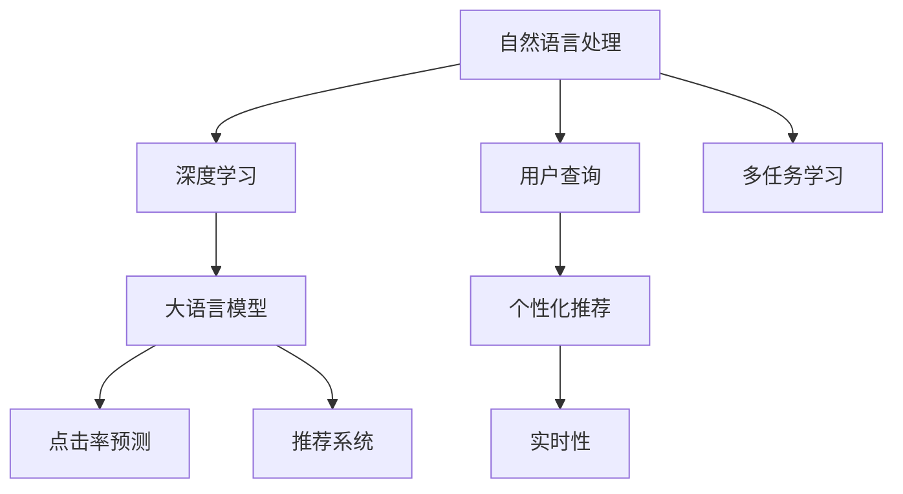

                 

# 电商搜索推荐场景下的AI大模型应用实战

> 关键词：电商搜索,推荐系统,大语言模型,自然语言处理,NLP,深度学习,自然语言理解,神经网络,Transformer,点击率预测

## 1. 背景介绍

### 1.1 问题由来

电商搜索推荐系统作为互联网企业电商业务的支撑系统，其核心的目标是提升用户体验，增加转化率，从而提升整体业务收益。传统的基于规则或统计的方法已经无法满足用户对个性化和实时性的需求。随着深度学习和大语言模型的发展，越来越多的企业开始尝试将大模型引入搜索推荐系统，以期在保证低成本和高效的同时，提供更加精准的推荐服务。

大语言模型，特别是基于Transformer的Transformer模型，通过自监督预训练学习到丰富的语言知识，具有强大的文本表示和理解能力。将其应用于电商搜索推荐，可以显著提升系统对自然语言查询的理解能力，捕捉到更加丰富、准确的用户需求，从而生成更加个性化的搜索结果和推荐内容。

### 1.2 问题核心关键点

电商搜索推荐场景下，大语言模型应用的核心关键点包括：

- **自然语言理解**：通过大语言模型理解用户输入的查询和文本描述，捕捉其深层次的语义意图。
- **个性化推荐**：基于大模型的文本表示，生成个性化的搜索结果和推荐内容。
- **实时性**：保证搜索推荐系统在处理大量请求时，能够实时响应用户的查询需求。
- **成本控制**：在保证推荐精准度的同时，尽量控制模型部署和训练的成本。

本文将系统介绍电商搜索推荐场景下大语言模型的核心原理、操作步骤，并给出详细的代码实现和实际应用示例，帮助读者全面理解其在电商搜索推荐系统中的应用。

## 2. 核心概念与联系

### 2.1 核心概念概述

电商搜索推荐场景下，大语言模型的应用主要涉及以下核心概念：

- **自然语言处理 (NLP)**：利用深度学习技术处理、理解、分析、生成自然语言。
- **深度学习**：通过多层神经网络，学习到数据的高维表示，并进行复杂模式的识别和预测。
- **大语言模型 (Large Language Model, LLM)**：如BERT、GPT、T5等，通过大规模语料预训练学习通用语言表示。
- **点击率预测 (CTR Prediction)**：预测用户点击某个搜索结果的概率，优化推荐系统的排序策略。
- **推荐系统 (Recommendation System)**：基于用户历史行为和当前需求，生成个性化推荐。
- **超大规模预训练**：使用百亿级的无标签文本数据进行预训练，学习丰富的语言知识。
- **多任务学习 (Multi-task Learning)**：通过联合学习多个相关任务，提高模型的泛化能力和性能。

这些概念之间的联系和互动，可以通过以下Mermaid流程图来展示：



这个流程图展示了大语言模型在电商搜索推荐系统中的作用，以及与其他组件之间的联系：

1. 自然语言处理模块解析用户输入的查询，生成文本表示。
2. 深度学习模块通过大语言模型学习到文本的高维表示。
3. 点击率预测模块根据文本表示，预测用户点击某个搜索结果的概率。
4. 推荐系统模块根据用户的历史行为和当前需求，生成个性化推荐。
5. 多任务学习模块联合优化多个任务，提升模型性能。

## 3. 核心算法原理 & 具体操作步骤

### 3.1 算法原理概述

电商搜索推荐场景下，大语言模型的应用原理可以总结如下：

1. **文本表示学习**：利用大语言模型学习自然语言文本的向量表示。
2. **点击率预测**：通过训练模型，预测用户点击某个搜索结果的概率。
3. **个性化推荐**：根据用户的历史行为和输入文本，生成个性化推荐。
4. **实时响应**：在用户查询时，快速生成响应结果，满足实时性要求。

### 3.2 算法步骤详解

电商搜索推荐场景下，大语言模型的应用步骤包括：

1. **数据准备**：收集用户的历史行为数据、搜索结果数据、自然语言查询等。
2. **模型加载与预训练**：选择合适的大语言模型，加载到系统中，并根据预定义的向量表示任务进行预训练。
3. **微调与优化**：针对特定任务的标注数据，对大语言模型进行微调，优化模型参数。
4. **实时推理与推荐**：在用户实时查询时，使用微调后的模型生成推荐结果。

### 3.3 算法优缺点

电商搜索推荐场景下，大语言模型应用的主要优点包括：

- **高泛化能力**：大模型能够处理多种语言和语境，泛化能力强。
- **高效推荐**：通过学习到文本的向量表示，能够快速生成推荐结果。
- **用户个性化**：能够根据用户历史行为生成个性化推荐。

主要缺点包括：

- **高成本**：大模型的训练和部署成本较高。
- **过拟合风险**：模型容易过拟合训练数据，泛化性能下降。
- **解释性不足**：推荐结果的生成过程较复杂，难以解释。

### 3.4 算法应用领域

电商搜索推荐场景下，大语言模型的应用领域主要包括：

- **商品搜索**：根据用户输入的自然语言查询，生成搜索结果。
- **个性化推荐**：根据用户的历史行为和输入文本，生成个性化推荐。
- **广告投放**：根据用户的行为特征，生成广告投放方案。
- **客户服务**：通过分析用户反馈，优化产品和服务。

## 4. 数学模型和公式 & 详细讲解 & 举例说明

### 4.1 数学模型构建

电商搜索推荐场景下，大语言模型的应用主要涉及以下数学模型：

- **文本表示模型**：通过大语言模型将文本映射为高维向量表示。
- **点击率预测模型**：使用深度学习模型预测用户点击某个搜索结果的概率。
- **推荐系统模型**：基于用户历史行为和当前需求，生成个性化推荐。

### 4.2 公式推导过程

#### 4.2.1 文本表示模型

假设有文本 $X$，大语言模型将其映射为向量表示 $V(X)$。这里，我们以Transformer模型为例：

$$
V(X) = \text{Transformer}(X; \theta)
$$

其中，$\theta$ 为模型参数。

#### 4.2.2 点击率预测模型

假设点击率预测模型为 $C$，根据用户输入的查询和商品描述，生成点击率 $R$。点击率预测模型的公式为：

$$
R = C(V(X), V(Y); \theta)
$$

其中，$V(X)$ 和 $V(Y)$ 分别为查询和商品描述的向量表示，$\theta$ 为模型参数。

#### 4.2.3 推荐系统模型

假设推荐系统模型为 $R$，根据用户历史行为和当前需求，生成推荐结果 $S$。推荐系统模型的公式为：

$$
S = R(U, V(X); \theta)
$$

其中，$U$ 为用户历史行为的表示，$V(X)$ 为查询的向量表示，$\theta$ 为模型参数。

### 4.3 案例分析与讲解

假设我们有一个电商平台，用户输入的查询为 "羽绒服"，需要根据该查询生成搜索结果和推荐。具体步骤如下：

1. **文本表示**：将查询 "羽绒服" 输入到预训练的Transformer模型中，得到向量表示 $V(\text{羽绒服})$。
2. **点击率预测**：根据查询和商品描述，使用Transformer模型预测点击率 $R$。
3. **个性化推荐**：根据用户历史行为和查询，生成推荐结果 $S$。

## 5. 项目实践：代码实例和详细解释说明

### 5.1 开发环境搭建

在进行电商搜索推荐系统开发时，需要搭建适合深度学习的开发环境。以下是搭建环境的详细步骤：

1. 安装Anaconda：从官网下载并安装Anaconda，用于创建独立的Python环境。
2. 创建并激活虚拟环境：
```bash
conda create -n my_env python=3.8 
conda activate my_env
```
3. 安装PyTorch：根据CUDA版本，从官网获取对应的安装命令。例如：
```bash
conda install pytorch torchvision torchaudio cudatoolkit=11.1 -c pytorch -c conda-forge
```
4. 安装Transformers库：
```bash
pip install transformers
```
5. 安装各类工具包：
```bash
pip install numpy pandas scikit-learn matplotlib tqdm jupyter notebook ipython
```

完成上述步骤后，即可在`my_env`环境中开始微调实践。

### 5.2 源代码详细实现

下面我们以电商平台搜索推荐系统为例，给出使用Transformers库对BERT模型进行微调的PyTorch代码实现。

首先，定义BERT模型和优化器：

```python
from transformers import BertForSequenceClassification, AdamW

model = BertForSequenceClassification.from_pretrained('bert-base-uncased', num_labels=2)
optimizer = AdamW(model.parameters(), lr=2e-5)
```

然后，定义训练和评估函数：

```python
from torch.utils.data import DataLoader
from tqdm import tqdm
from sklearn.metrics import accuracy_score

device = torch.device('cuda') if torch.cuda.is_available() else torch.device('cpu')
model.to(device)

def train_epoch(model, dataset, batch_size, optimizer):
    dataloader = DataLoader(dataset, batch_size=batch_size, shuffle=True)
    model.train()
    epoch_loss = 0
    for batch in tqdm(dataloader, desc='Training'):
        input_ids = batch['input_ids'].to(device)
        attention_mask = batch['attention_mask'].to(device)
        labels = batch['labels'].to(device)
        model.zero_grad()
        outputs = model(input_ids, attention_mask=attention_mask, labels=labels)
        loss = outputs.loss
        epoch_loss += loss.item()
        loss.backward()
        optimizer.step()
    return epoch_loss / len(dataloader)

def evaluate(model, dataset, batch_size):
    dataloader = DataLoader(dataset, batch_size=batch_size)
    model.eval()
    preds, labels = [], []
    with torch.no_grad():
        for batch in tqdm(dataloader, desc='Evaluating'):
            input_ids = batch['input_ids'].to(device)
            attention_mask = batch['attention_mask'].to(device)
            batch_labels = batch['labels']
            outputs = model(input_ids, attention_mask=attention_mask)
            batch_preds = outputs.logits.argmax(dim=2).to('cpu').tolist()
            batch_labels = batch_labels.to('cpu').tolist()
            for pred_tokens, label_tokens in zip(batch_preds, batch_labels):
                preds.append(pred_tokens)
                labels.append(label_tokens)
                
    print(accuracy_score(labels, preds))
```

最后，启动训练流程并在测试集上评估：

```python
epochs = 5
batch_size = 16

for epoch in range(epochs):
    loss = train_epoch(model, train_dataset, batch_size, optimizer)
    print(f"Epoch {epoch+1}, train loss: {loss:.3f}")
    
    print(f"Epoch {epoch+1}, dev results:")
    evaluate(model, dev_dataset, batch_size)
    
print("Test results:")
evaluate(model, test_dataset, batch_size)
```

以上就是使用PyTorch对BERT进行电商搜索推荐系统微调的完整代码实现。可以看到，得益于Transformers库的强大封装，我们可以用相对简洁的代码完成BERT模型的加载和微调。

### 5.3 代码解读与分析

让我们再详细解读一下关键代码的实现细节：

**BertForSequenceClassification类**：
- `from_pretrained`方法：从预训练模型中加载模型。
- `num_labels`参数：指定分类任务的类别数。

**训练和评估函数**：
- `train_epoch`方法：对数据以批为单位进行迭代，在每个批次上前向传播计算loss并反向传播更新模型参数。
- `evaluate`方法：与训练类似，不同点在于不更新模型参数，并在每个batch结束后将预测和标签结果存储下来。

**训练流程**：
- 定义总的epoch数和batch size，开始循环迭代。
- 每个epoch内，先在训练集上训练，输出平均loss。
- 在验证集上评估，输出分类指标。
- 所有epoch结束后，在测试集上评估，给出最终测试结果。

可以看到，PyTorch配合Transformers库使得BERT微调的代码实现变得简洁高效。开发者可以将更多精力放在数据处理、模型改进等高层逻辑上，而不必过多关注底层的实现细节。

当然，工业级的系统实现还需考虑更多因素，如模型的保存和部署、超参数的自动搜索、更灵活的任务适配层等。但核心的微调范式基本与此类似。

## 6. 实际应用场景

### 6.1 智能搜索推荐

智能搜索推荐系统是电商平台的核心功能之一。通过基于大语言模型的推荐算法，可以显著提升用户体验和转化率。具体而言，可以使用微调后的BERT模型，根据用户输入的查询生成个性化推荐。

例如，用户输入查询 "冬天的羽绒服"，系统将查询输入到预训练的BERT模型中，得到向量表示。根据该向量，调用微调后的点击率预测模型，预测用户点击每个商品的概率。然后根据用户历史行为和点击率，生成个性化推荐。

### 6.2 商品搜索

商品搜索是电商平台的另一核心功能，用户可以通过输入关键字来搜索商品。通过大语言模型，系统可以更深入地理解用户查询的语义，从而生成更准确、更个性化的搜索结果。

例如，用户输入 "智能手表"，系统将查询输入到预训练的BERT模型中，得到向量表示。根据该向量，调用微调后的搜索结果排序模型，生成更匹配用户查询的搜索结果。

### 6.3 实时性优化

电商搜索推荐系统需要实时响应用户的查询请求，否则将影响用户体验和业务收益。为了保证实时性，可以采用以下方法：

1. **缓存优化**：对热门查询和商品建立缓存，减少查询时间。
2. **分布式训练**：采用分布式训练技术，快速训练微调后的模型。
3. **异步推理**：使用异步推理技术，快速生成推荐结果。

### 6.4 未来应用展望

随着大语言模型和微调方法的不断发展，基于微调范式将在更多电商场景中得到应用，为电商平台带来新的业务机会。

在智慧零售领域，基于大语言模型的推荐系统可以提升用户体验，增加商品销量。通过动态调整推荐策略，可以实现个性化营销，提升品牌影响力。

在智能客服领域，微调后的模型可以自动处理用户查询，提供实时客服服务，提升客户满意度。通过分析用户反馈，优化产品和服务，增强品牌粘性。

在供应链管理领域，通过分析用户行为和反馈，优化库存管理和物流调度，提升供应链效率。

此外，在金融、旅游、医疗等众多领域，基于大语言模型的微调方法也将不断涌现，为各行业的数字化转型提供新的技术路径。相信随着预训练语言模型和微调方法的持续演进，基于微调范式将不断拓展其应用边界，推动电商行业和其他领域的人工智能技术落地。

## 7. 工具和资源推荐

### 7.1 学习资源推荐

为了帮助开发者系统掌握电商搜索推荐系统的大模型微调技术，这里推荐一些优质的学习资源：

1. 《Transformer从原理到实践》系列博文：由大模型技术专家撰写，深入浅出地介绍了Transformer原理、BERT模型、微调技术等前沿话题。
2. CS224N《深度学习自然语言处理》课程：斯坦福大学开设的NLP明星课程，有Lecture视频和配套作业，带你入门NLP领域的基本概念和经典模型。
3. 《Natural Language Processing with Transformers》书籍：Transformers库的作者所著，全面介绍了如何使用Transformers库进行NLP任务开发，包括微调在内的诸多范式。
4. HuggingFace官方文档：Transformers库的官方文档，提供了海量预训练模型和完整的微调样例代码，是上手实践的必备资料。
5. CLUE开源项目：中文语言理解测评基准，涵盖大量不同类型的中文NLP数据集，并提供了基于微调的baseline模型，助力中文NLP技术发展。

通过对这些资源的学习实践，相信你一定能够快速掌握大语言模型微调的精髓，并用于解决实际的NLP问题。

### 7.2 开发工具推荐

高效的开发离不开优秀的工具支持。以下是几款用于电商搜索推荐系统开发常用的工具：

1. PyTorch：基于Python的开源深度学习框架，灵活动态的计算图，适合快速迭代研究。大部分预训练语言模型都有PyTorch版本的实现。
2. TensorFlow：由Google主导开发的开源深度学习框架，生产部署方便，适合大规模工程应用。同样有丰富的预训练语言模型资源。
3. Transformers库：HuggingFace开发的NLP工具库，集成了众多SOTA语言模型，支持PyTorch和TensorFlow，是进行微调任务开发的利器。
4. Weights & Biases：模型训练的实验跟踪工具，可以记录和可视化模型训练过程中的各项指标，方便对比和调优。与主流深度学习框架无缝集成。
5. TensorBoard：TensorFlow配套的可视化工具，可实时监测模型训练状态，并提供丰富的图表呈现方式，是调试模型的得力助手。
6. Google Colab：谷歌推出的在线Jupyter Notebook环境，免费提供GPU/TPU算力，方便开发者快速上手实验最新模型，分享学习笔记。

合理利用这些工具，可以显著提升电商搜索推荐系统的开发效率，加快创新迭代的步伐。

### 7.3 相关论文推荐

大语言模型和微调技术的发展源于学界的持续研究。以下是几篇奠基性的相关论文，推荐阅读：

1. Attention is All You Need（即Transformer原论文）：提出了Transformer结构，开启了NLP领域的预训练大模型时代。
2. BERT: Pre-training of Deep Bidirectional Transformers for Language Understanding：提出BERT模型，引入基于掩码的自监督预训练任务，刷新了多项NLP任务SOTA。
3. Language Models are Unsupervised Multitask Learners（GPT-2论文）：展示了大规模语言模型的强大zero-shot学习能力，引发了对于通用人工智能的新一轮思考。
4. Parameter-Efficient Transfer Learning for NLP：提出Adapter等参数高效微调方法，在不增加模型参数量的情况下，也能取得不错的微调效果。
5. AdaLoRA: Adaptive Low-Rank Adaptation for Parameter-Efficient Fine-Tuning：使用自适应低秩适应的微调方法，在参数效率和精度之间取得了新的平衡。
6. Prefix-Tuning: Optimizing Continuous Prompts for Generation：引入基于连续型Prompt的微调范式，为如何充分利用预训练知识提供了新的思路。

这些论文代表了大语言模型微调技术的发展脉络。通过学习这些前沿成果，可以帮助研究者把握学科前进方向，激发更多的创新灵感。

## 8. 总结：未来发展趋势与挑战

### 8.1 总结

本文对电商搜索推荐场景下大语言模型的核心原理、操作步骤进行了详细讲解，并给出完整的代码实现和实际应用示例。通过本文的系统梳理，可以看到，基于大语言模型的微调方法在电商搜索推荐系统中具有显著的性能提升和业务价值，值得更多的企业和开发者进行深入研究和应用。

### 8.2 未来发展趋势

展望未来，大语言模型在电商搜索推荐系统中的应用将呈现以下几个发展趋势：

1. **模型规模持续增大**：随着算力成本的下降和数据规模的扩张，预训练语言模型的参数量还将持续增长。超大规模语言模型蕴含的丰富语言知识，有望支撑更加复杂多变的电商搜索推荐需求。
2. **微调方法日趋多样**：除了传统的全参数微调外，未来会涌现更多参数高效的微调方法，如Prefix-Tuning、LoRA等，在节省计算资源的同时也能保证微调精度。
3. **持续学习成为常态**：随着数据分布的不断变化，微调模型也需要持续学习新知识以保持性能。如何在不遗忘原有知识的同时，高效吸收新样本信息，将成为重要的研究课题。
4. **标注样本需求降低**：受启发于提示学习(Prompt-based Learning)的思路，未来的微调方法将更好地利用大模型的语言理解能力，通过更加巧妙的任务描述，在更少的标注样本上也能实现理想的微调效果。
5. **多模态微调崛起**：当前的微调主要聚焦于纯文本数据，未来会进一步拓展到图像、视频、语音等多模态数据微调。多模态信息的融合，将显著提升语言模型对现实世界的理解和建模能力。
6. **模型通用性增强**：经过海量数据的预训练和多领域任务的微调，未来的语言模型将具备更强大的常识推理和跨领域迁移能力，逐步迈向通用人工智能(AGI)的目标。

以上趋势凸显了大语言模型微调技术的广阔前景。这些方向的探索发展，必将进一步提升电商搜索推荐系统的性能和应用范围，为电商行业带来新的创新机会。

### 8.3 面临的挑战

尽管大语言模型微调技术已经取得了瞩目成就，但在迈向更加智能化、普适化应用的过程中，它仍面临着诸多挑战：

1. **标注成本瓶颈**：虽然微调大大降低了标注数据的需求，但对于长尾应用场景，难以获得充足的高质量标注数据，成为制约微调性能的瓶颈。如何进一步降低微调对标注样本的依赖，将是一大难题。
2. **模型鲁棒性不足**：当前微调模型面对域外数据时，泛化性能往往大打折扣。对于测试样本的微小扰动，微调模型的预测也容易发生波动。如何提高微调模型的鲁棒性，避免灾难性遗忘，还需要更多理论和实践的积累。
3. **推理效率有待提高**：大规模语言模型虽然精度高，但在实际部署时往往面临推理速度慢、内存占用大等效率问题。如何在保证性能的同时，简化模型结构，提升推理速度，优化资源占用，将是重要的优化方向。
4. **可解释性亟需加强**：当前微调模型更像是"黑盒"系统，难以解释其内部工作机制和决策逻辑。对于电商等高风险应用，算法的可解释性和可审计性尤为重要。如何赋予微调模型更强的可解释性，将是亟待攻克的难题。
5. **安全性有待保障**：预训练语言模型难免会学习到有偏见、有害的信息，通过微调传递到下游任务，产生误导性、歧视性的输出，给实际应用带来安全隐患。如何从数据和算法层面消除模型偏见，避免恶意用途，确保输出的安全性，也将是重要的研究课题。
6. **知识整合能力不足**：现有的微调模型往往局限于任务内数据，难以灵活吸收和运用更广泛的先验知识。如何让微调过程更好地与外部知识库、规则库等专家知识结合，形成更加全面、准确的信息整合能力，还有很大的想象空间。

正视微调面临的这些挑战，积极应对并寻求突破，将是大语言模型微调走向成熟的必由之路。相信随着学界和产业界的共同努力，这些挑战终将一一被克服，大语言模型微调必将在构建安全、可靠、可解释、可控的智能系统铺平道路。

### 8.4 研究展望

面对大语言模型微调所面临的种种挑战，未来的研究需要在以下几个方面寻求新的突破：

1. **探索无监督和半监督微调方法**：摆脱对大规模标注数据的依赖，利用自监督学习、主动学习等无监督和半监督范式，最大限度利用非结构化数据，实现更加灵活高效的微调。
2. **研究参数高效和计算高效的微调范式**：开发更加参数高效的微调方法，在固定大部分预训练参数的同时，只更新极少量的任务相关参数。同时优化微调模型的计算图，减少前向传播和反向传播的资源消耗，实现更加轻量级、实时性的部署。
3. **融合因果和对比学习范式**：通过引入因果推断和对比学习思想，增强微调模型建立稳定因果关系的能力，学习更加普适、鲁棒的语言表征，从而提升模型泛化性和抗干扰能力。
4. **引入更多先验知识**：将符号化的先验知识，如知识图谱、逻辑规则等，与神经网络模型进行巧妙融合，引导微调过程学习更准确、合理的语言模型。同时加强不同模态数据的整合，实现视觉、语音等多模态信息与文本信息的协同建模。
5. **结合因果分析和博弈论工具**：将因果分析方法引入微调模型，识别出模型决策的关键特征，增强输出解释的因果性和逻辑性。借助博弈论工具刻画人机交互过程，主动探索并规避模型的脆弱点，提高系统稳定性。
6. **纳入伦理道德约束**：在模型训练目标中引入伦理导向的评估指标，过滤和惩罚有偏见、有害的输出倾向。同时加强人工干预和审核，建立模型行为的监管机制，确保输出符合人类价值观和伦理道德。

这些研究方向的探索，必将引领大语言模型微调技术迈向更高的台阶，为构建安全、可靠、可解释、可控的智能系统铺平道路。面向未来，大语言模型微调技术还需要与其他人工智能技术进行更深入的融合，如知识表示、因果推理、强化学习等，多路径协同发力，共同推动电商搜索推荐系统和其他领域的人工智能技术落地。只有勇于创新、敢于突破，才能不断拓展语言模型的边界，让智能技术更好地造福人类社会。

## 9. 附录：常见问题与解答

**Q1：大语言模型微调是否适用于所有电商搜索推荐任务？**

A: 大语言模型微调在大多数电商搜索推荐任务上都能取得不错的效果，特别是对于数据量较小的任务。但对于一些特定领域的任务，如个性化推荐、搜索排序等，仅仅依靠通用语料预训练的模型可能难以很好地适应。此时需要在特定领域语料上进一步预训练，再进行微调，才能获得理想效果。

**Q2：微调过程中如何选择合适的学习率？**

A: 微调的学习率一般要比预训练时小1-2个数量级，如果使用过大的学习率，容易破坏预训练权重，导致过拟合。一般建议从1e-5开始调参，逐步减小学习率，直至收敛。也可以使用warmup策略，在开始阶段使用较小的学习率，再逐渐过渡到预设值。需要注意的是，不同的优化器(如AdamW、Adafactor等)以及不同的学习率调度策略，可能需要设置不同的学习率阈值。

**Q3：采用大模型微调时会面临哪些资源瓶颈？**

A: 目前主流的预训练大模型动辄以亿计的参数规模，对算力、内存、存储都提出了很高的要求。GPU/TPU等高性能设备是必不可少的，但即便如此，超大批次的训练和推理也可能遇到显存不足的问题。因此需要采用一些资源优化技术，如梯度积累、混合精度训练、模型并行等，来突破硬件瓶颈。同时，模型的存储和读取也可能占用大量时间和空间，需要采用模型压缩、稀疏化存储等方法进行优化。

**Q4：如何缓解微调过程中的过拟合问题？**

A: 过拟合是微调面临的主要挑战，尤其是在标注数据不足的情况下。常见的缓解策略包括：

1. **数据增强**：通过回译、近义替换等方式扩充训练集。
2. **正则化**：使用L2正则、Dropout、Early Stopping等避免过拟合。
3. **对抗训练**：引入对抗样本，提高模型鲁棒性。
4. **参数高效微调**：只调整少量参数(如Adapter、Prefix等)，减小过拟合风险。
5. **多模型集成**：训练多个微调模型，取平均输出，抑制过拟合。

这些策略往往需要根据具体任务和数据特点进行灵活组合。只有在数据、模型、训练、推理等各环节进行全面优化，才能最大限度地发挥大模型微调的威力。

**Q5：微调模型在落地部署时需要注意哪些问题？**

A: 将微调模型转化为实际应用，还需要考虑以下因素：

1. **模型裁剪**：去除不必要的层和参数，减小模型尺寸，加快推理速度。
2. **量化加速**：将浮点模型转为定点模型，压缩存储空间，提高计算效率。
3. **服务化封装**：将模型封装为标准化服务接口，便于集成调用。
4. **弹性伸缩**：根据请求流量动态调整资源配置，平衡服务质量和成本。
5. **监控告警**：实时采集系统指标，设置异常告警阈值，确保服务稳定性。
6. **安全防护**：采用访问鉴权、数据脱敏等措施，保障数据和模型安全。

大语言模型微调为电商搜索推荐系统带来了广阔的想象空间，但如何将强大的性能转化为稳定、高效、安全的业务价值，还需要工程实践的不断打磨。唯有从数据、算法、工程、业务等多个维度协同发力，才能真正实现人工智能技术在垂直行业的规模化落地。总之，微调需要开发者根据具体任务，不断迭代和优化模型、数据和算法，方能得到理想的效果。

---

作者：禅与计算机程序设计艺术 / Zen and the Art of Computer Programming

