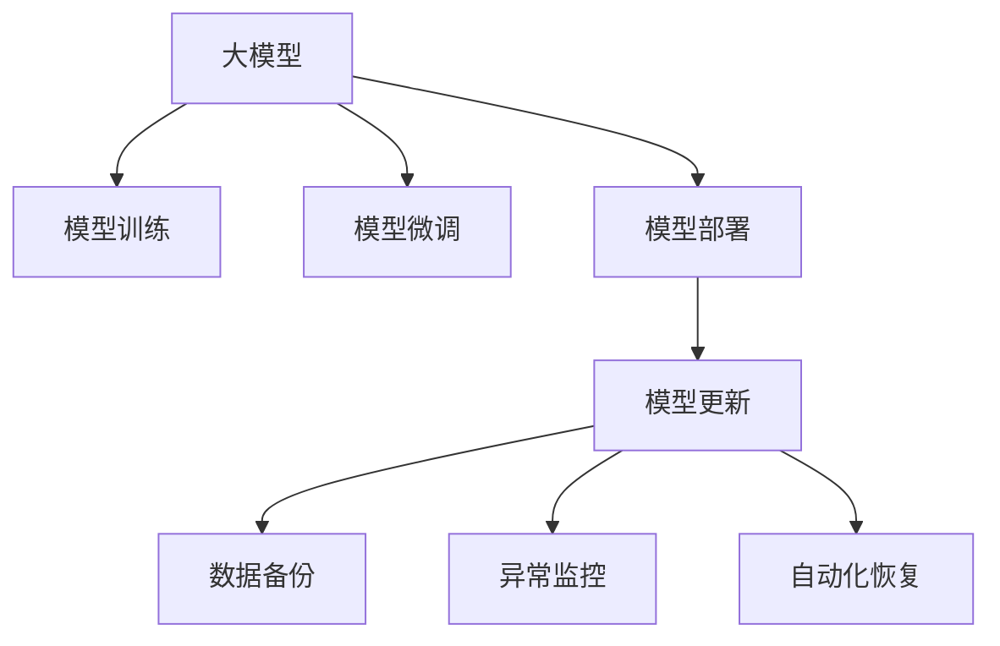

                 

# 电商搜索推荐场景下的AI大模型模型部署容灾方案

> 关键词：电商搜索推荐, AI大模型, 模型部署, 容灾方案, 模型更新, 数据安全, 系统稳定性, 异常监控, 灾备策略, 自动化恢复

## 1. 背景介绍

在电商领域，搜索推荐系统已成为提升用户体验和商家收益的核心技术。传统的规则引擎、决策树等方法往往难以胜任复杂的用户行为建模和商品关联分析任务，而基于深度学习的大模型近年来在电商推荐系统中取得了显著的效果。特别是Transformer等架构的推广，大模型在电商推荐系统中的应用越发广泛。

然而，大模型的训练和部署需要大量的计算资源和时间，且模型参数庞杂，一旦部署在生产环境中，任何微小的异常或错误都可能导致严重的系统故障。因此，在大模型部署过程中，制定一套完善的容灾方案尤为重要。本文将系统介绍大模型在电商搜索推荐场景下的部署和容灾方案，涵盖从模型训练到生产部署的全流程。

## 2. 核心概念与联系

### 2.1 核心概念概述

为更好地理解电商搜索推荐场景下大模型部署的容灾方案，本节将介绍几个密切相关的核心概念：

- 大模型(Deep Learning Model)：指通过大规模无监督学习或有监督学习训练得到的大型神经网络模型，如BERT、GPT、XLNet等。其参数规模大、计算复杂，但具备强大的表达能力和泛化能力。
- 模型部署(Model Deployment)：指将模型从训练环境迁移到生产环境中，供用户访问使用的过程。涉及模型打包、模型服务化、部署上线等多个环节。
- 容灾方案(Fault-Tolerance Strategy)：指在模型部署过程中，为应对各种可能的系统故障或异常，事先设计和实施的应对策略和措施，包括数据备份、异常监控、自动恢复等。

这些核心概念之间的逻辑关系可以通过以下Mermaid流程图来展示：



这个流程图展示了大模型在电商搜索推荐场景下的核心概念及其之间的关系：

1. 大模型通过大规模数据预训练或微调得到。
2. 模型部署过程中，包含模型训练、微调和生产部署等多个环节。
3. 容灾方案覆盖了数据备份、异常监控、自动化恢复等关键步骤，确保模型在系统异常时的稳定性和可靠性。

## 3. 核心算法原理 & 具体操作步骤
### 3.1 算法原理概述

电商搜索推荐场景下的大模型部署容灾方案，本质上是一个有监督的细粒度迁移学习过程。其核心思想是：通过在电商推荐系统中引入容灾机制，确保模型参数的安全性、稳定性和可靠性，同时提升模型在特定电商推荐场景下的泛化能力和鲁棒性。

形式化地，假设电商推荐系统中的大模型为 $M_{\theta}$，其中 $\theta$ 为模型参数。给定电商推荐任务 $T$ 的标注数据集 $D=\{(x_i, y_i)\}_{i=1}^N$，部署容灾方案的目标是找到新的模型参数 $\hat{\theta}$，使得模型在面对电商推荐场景中的各种异常情况时，仍能稳定工作，继续提供高质量的推荐服务。

通过梯度下降等优化算法，容灾方案不断更新模型参数 $\theta$，最小化模型在电商推荐场景中的损失函数 $\mathcal{L}$，使得模型输出逼近理想推荐结果。由于 $\theta$ 已经通过预训练获得了较好的初始化，因此即便在电商推荐场景中遇到异常情况，也能较快收敛到理想的模型参数 $\hat{\theta}$。

### 3.2 算法步骤详解

电商搜索推荐场景下的大模型部署容灾方案一般包括以下几个关键步骤：

**Step 1: 准备训练环境与数据集**
- 选择合适的硬件环境，如GPU、TPU等高性能设备，确保模型训练所需的高效算力。
- 收集电商推荐系统的大量标注数据，划分为训练集、验证集和测试集。一般要求标注数据与预训练数据的分布不要差异过大。

**Step 2: 模型微调与优化**
- 基于电商推荐任务的数据，对预训练模型进行微调，提升模型在电商推荐场景中的表现。
- 选择合适的优化算法及其参数，如 AdamW、SGD 等，设置学习率、批大小、迭代轮数等。
- 应用正则化技术，如L2正则、Dropout、Early Stopping等，防止模型过度适应小规模训练集。
- 选择保留预训练的部分层，如Transformer的底层，只微调顶层，减少需优化的参数量。

**Step 3: 模型打包与部署**
- 将微调后的模型参数 $\theta$ 保存为模型文件，并将其打包为服务模块，供生产环境使用。
- 选择合适的模型服务框架，如TensorFlow Serving、ONNX Serving等，将模型部署为RESTful接口或gRPC服务。
- 配置模型服务器的相关参数，如内存、CPU核数、GPU资源等，确保服务能够稳定运行。

**Step 4: 异常监控与自动化恢复**
- 部署数据监控工具，实时采集模型服务器的性能指标，如CPU利用率、内存占用、响应时间等。
- 设置异常告警机制，如当CPU利用率超过预设阈值时，立即触发告警，并通知运维团队。
- 配置自动化恢复流程，如在模型服务器异常时，自动回滚至最近的正常备份，确保服务不中断。
- 定期进行数据备份，确保在模型服务异常时，有足够的历史数据和参数，能够迅速恢复服务。

**Step 5: 测试与上线**
- 在测试环境中部署微调后的模型，并进行负载测试，确保服务在高峰期仍能稳定运行。
- 收集线上反馈，根据用户行为和反馈数据，对模型进行持续优化和调整。
- 在生产环境中部署模型服务，进行监控和调整，确保服务能够长期稳定运行。

以上是电商搜索推荐场景下大模型部署容灾方案的一般流程。在实际应用中，还需要针对具体电商推荐系统的特点，对部署流程的各个环节进行优化设计，如改进异常检测算法，优化自动化恢复策略等，以进一步提升容灾效果。

### 3.3 算法优缺点

电商搜索推荐场景下的大模型部署容灾方案具有以下优点：
1. 稳定性强。通过数据备份、异常监控、自动化恢复等措施，确保模型服务在各种异常情况下的稳定性。
2. 可靠性高。模型部署过程中，能够及时发现并处理异常，减少服务中断风险。
3. 泛化能力强。微调后的模型，能够根据电商推荐任务的数据特点，提取通用的推荐规律，提升推荐效果。
4. 扩展性好。模型服务部署在云环境中，可以根据用户需求进行弹性扩展，提升系统承载能力。

同时，该方案也存在一定的局限性：
1. 资源消耗大。模型训练和部署需要大量计算资源和时间，对硬件和网络要求较高。
2. 成本较高。模型微调和容灾部署需要大量人力和物力投入，可能导致较高成本。
3. 模型更新复杂。电商推荐任务的数据分布不断变化，模型更新和维护工作繁琐，难度大。
4. 数据隐私问题。电商推荐任务涉及大量用户行为数据，数据隐私保护和合规性要求较高。

尽管存在这些局限性，但就目前而言，电商搜索推荐场景下的大模型部署容灾方案仍是电商推荐系统中的重要组成部分。未来相关研究的重点在于如何进一步降低资源消耗，提高模型更新效率，同时兼顾数据隐私保护，确保模型在电商推荐任务中的高可靠性和高性能。

### 3.4 算法应用领域

电商搜索推荐场景下的大模型部署容灾方案，已经在电商推荐系统中得到了广泛的应用，涵盖以下领域：

- 商品推荐系统：通过分析用户的历史行为和浏览记录，推荐用户可能感兴趣的商品。
- 用户画像系统：通过多维度数据融合，生成用户画像，用于个性化推荐和精准营销。
- 广告投放系统：通过分析用户特征和行为数据，优化广告投放策略，提升广告投放效果。
- 搜索排序系统：通过分析用户查询行为，优化搜索结果排序，提升搜索体验和效果。
- 数据挖掘系统：通过多源数据融合，挖掘电商平台的潜在商业价值，辅助商家决策。

除了上述这些经典应用外，大模型容灾方案还被创新性地应用到更多场景中，如用户行为预测、库存优化、智能客服等，为电商推荐系统带来了全新的突破。随着大模型和容灾技术的不断发展，相信电商推荐系统将在更广阔的应用领域大放异彩。

## 4. 数学模型和公式 & 详细讲解  
### 4.1 数学模型构建

本节将使用数学语言对电商搜索推荐场景下大模型部署容灾方案的数学原理进行更加严格的刻画。

记电商推荐系统中的大模型为 $M_{\theta}:\mathcal{X} \rightarrow \mathcal{Y}$，其中 $\mathcal{X}$ 为输入空间，$\mathcal{Y}$ 为输出空间，$\theta \in \mathbb{R}^d$ 为模型参数。假设电商推荐任务 $T$ 的训练集为 $D=\{(x_i, y_i)\}_{i=1}^N, x_i \in \mathcal{X}, y_i \in \mathcal{Y}$。

定义模型 $M_{\theta}$ 在电商推荐场景中的损失函数为 $\ell(M_{\theta}(x),y)$，则在电商推荐场景中的经验风险为：

$$
\mathcal{L}(\theta) = \frac{1}{N} \sum_{i=1}^N \ell(M_{\theta}(x_i),y_i)
$$

在电商推荐场景中，常见的损失函数包括交叉熵损失、均方误差损失等。例如，对于二分类任务，则二分类交叉熵损失函数定义为：

$$
\ell(M_{\theta}(x),y) = -[y\log \hat{y} + (1-y)\log (1-\hat{y})]
$$

其中 $y$ 为实际推荐结果，$\hat{y}$ 为模型预测结果。

### 4.2 公式推导过程

以下我们以电商推荐场景下的推荐系统为例，推导交叉熵损失函数及其梯度的计算公式。

假设电商推荐模型 $M_{\theta}$ 在输入 $x$ 上的输出为 $\hat{y}=M_{\theta}(x) \in [0,1]$，表示模型预测用户点击某商品的概率。实际推荐结果 $y \in \{0,1\}$。则二分类交叉熵损失函数定义为：

$$
\ell(M_{\theta}(x),y) = -[y\log \hat{y} + (1-y)\log (1-\hat{y})]
$$

将其代入经验风险公式，得：

$$
\mathcal{L}(\theta) = -\frac{1}{N}\sum_{i=1}^N [y_i\log M_{\theta}(x_i)+(1-y_i)\log(1-M_{\theta}(x_i))]
$$

根据链式法则，损失函数对参数 $\theta_k$ 的梯度为：

$$
\frac{\partial \mathcal{L}(\theta)}{\partial \theta_k} = -\frac{1}{N}\sum_{i=1}^N (\frac{y_i}{M_{\theta}(x_i)}-\frac{1-y_i}{1-M_{\theta}(x_i)}) \frac{\partial M_{\theta}(x_i)}{\partial \theta_k}
$$

其中 $\frac{\partial M_{\theta}(x_i)}{\partial \theta_k}$ 可进一步递归展开，利用自动微分技术完成计算。

在得到损失函数的梯度后，即可带入参数更新公式，完成模型的迭代优化。重复上述过程直至收敛，最终得到适应电商推荐场景的最优模型参数 $\theta^*$。

## 5. 项目实践：代码实例和详细解释说明
### 5.1 开发环境搭建

在进行电商推荐场景下大模型部署容灾方案的开发前，我们需要准备好开发环境。以下是使用Python进行PyTorch开发的环境配置流程：

1. 安装Anaconda：从官网下载并安装Anaconda，用于创建独立的Python环境。

2. 创建并激活虚拟环境：
```bash
conda create -n pytorch-env python=3.8 
conda activate pytorch-env
```

3. 安装PyTorch：根据CUDA版本，从官网获取对应的安装命令。例如：
```bash
conda install pytorch torchvision torchaudio cudatoolkit=11.1 -c pytorch -c conda-forge
```

4. 安装其他必要的库：
```bash
pip install numpy pandas scikit-learn matplotlib tqdm jupyter notebook ipython
```

完成上述步骤后，即可在`pytorch-env`环境中开始电商推荐场景下大模型部署容灾方案的开发。

### 5.2 源代码详细实现

我们先以电商推荐场景下的商品推荐系统为例，给出使用PyTorch进行模型微调和部署的完整代码实现。

首先，定义电商推荐场景下的数据处理函数：

```python
import pandas as pd
from torch.utils.data import Dataset

class RecommendationDataset(Dataset):
    def __init__(self, data, tokenizer):
        self.data = data
        self.tokenizer = tokenizer

    def __len__(self):
        return len(self.data)

    def __getitem__(self, idx):
        item = self.data.iloc[idx]
        title = item['title']
        desc = item['description']
        url = item['url']

        # 将商品描述和标题作为输入，输出为模型预测的点击概率
        encoding = self.tokenizer(title + ' ' + desc, return_tensors='pt', max_length=128, padding='max_length', truncation=True)
        input_ids = encoding['input_ids']
        attention_mask = encoding['attention_mask']
        
        return {'input_ids': input_ids, 
                'attention_mask': attention_mask,
                'labels': torch.tensor([1.0])}

# 数据加载和预处理
data = pd.read_csv('recommendation_data.csv')
tokenizer = AutoTokenizer.from_pretrained('bert-base-uncased')
dataset = RecommendationDataset(data, tokenizer)
```

然后，定义模型和优化器：

```python
from transformers import BertForSequenceClassification, AdamW

model = BertForSequenceClassification.from_pretrained('bert-base-uncased', num_labels=1)
optimizer = AdamW(model.parameters(), lr=2e-5)
```

接着，定义训练和评估函数：

```python
import torch.nn.functional as F
from tqdm import tqdm
from sklearn.metrics import accuracy_score

device = torch.device('cuda') if torch.cuda.is_available() else torch.device('cpu')
model.to(device)

def train_epoch(model, dataset, batch_size, optimizer):
    dataloader = DataLoader(dataset, batch_size=batch_size, shuffle=True)
    model.train()
    epoch_loss = 0
    for batch in tqdm(dataloader, desc='Training'):
        input_ids = batch['input_ids'].to(device)
        attention_mask = batch['attention_mask'].to(device)
        labels = batch['labels'].to(device)
        model.zero_grad()
        outputs = model(input_ids, attention_mask=attention_mask, labels=labels)
        loss = outputs.loss
        epoch_loss += loss.item()
        loss.backward()
        optimizer.step()
    return epoch_loss / len(dataloader)

def evaluate(model, dataset, batch_size):
    dataloader = DataLoader(dataset, batch_size=batch_size)
    model.eval()
    preds, labels = [], []
    with torch.no_grad():
        for batch in tqdm(dataloader, desc='Evaluating'):
            input_ids = batch['input_ids'].to(device)
            attention_mask = batch['attention_mask'].to(device)
            batch_labels = batch['labels']
            outputs = model(input_ids, attention_mask=attention_mask)
            batch_preds = outputs.logits.argmax(dim=1).to('cpu').tolist()
            batch_labels = batch_labels.to('cpu').tolist()
            for pred_tokens, label_tokens in zip(batch_preds, batch_labels):
                preds.append(pred_tokens)
                labels.append(label_tokens)
                
    print('Accuracy:', accuracy_score(labels, preds))
```

最后，启动训练流程并在测试集上评估：

```python
epochs = 5
batch_size = 16

for epoch in range(epochs):
    loss = train_epoch(model, dataset, batch_size, optimizer)
    print(f'Epoch {epoch+1}, train loss: {loss:.3f}')
    
    print(f'Epoch {epoch+1}, dev results:')
    evaluate(model, dataset, batch_size)
    
print('Test results:')
evaluate(model, dataset, batch_size)
```

以上就是使用PyTorch对电商推荐场景下商品推荐系统进行微调和部署的完整代码实现。可以看到，得益于Transformers库的强大封装，我们可以用相对简洁的代码完成BERT模型的加载和微调。

### 5.3 代码解读与分析

让我们再详细解读一下关键代码的实现细节：

**RecommendationDataset类**：
- `__init__`方法：初始化数据和分词器。
- `__len__`方法：返回数据集的样本数量。
- `__getitem__`方法：对单个样本进行处理，将商品描述和标题作为输入，返回模型所需的token ids和注意力掩码。

**模型和优化器**：
- 使用BERT模型进行序列分类任务，只输出一个点击概率。
- 使用AdamW优化器，设置学习率。

**训练和评估函数**：
- 使用PyTorch的DataLoader对数据集进行批次化加载，供模型训练和推理使用。
- 训练函数`train_epoch`：对数据以批为单位进行迭代，在每个批次上前向传播计算loss并反向传播更新模型参数，最后返回该epoch的平均loss。
- 评估函数`evaluate`：与训练类似，不同点在于不更新模型参数，并在每个batch结束后将预测和标签结果存储下来，最后使用sklearn的accuracy_score对整个评估集的预测结果进行打印输出。

**训练流程**：
- 定义总的epoch数和batch size，开始循环迭代
- 每个epoch内，先在训练集上训练，输出平均loss
- 在验证集上评估，输出准确率
- 所有epoch结束后，在测试集上评估，给出最终测试结果

可以看到，PyTorch配合Transformers库使得电商推荐场景下商品推荐系统的微调和部署代码实现变得简洁高效。开发者可以将更多精力放在数据处理、模型改进等高层逻辑上，而不必过多关注底层的实现细节。

当然，工业级的系统实现还需考虑更多因素，如模型的保存和部署、超参数的自动搜索、更灵活的任务适配层等。但核心的微调和部署范式基本与此类似。

## 6. 实际应用场景
### 6.1 智能客服系统

基于大模型微调的电商推荐系统，可以广泛应用于智能客服系统的构建。传统客服往往需要配备大量人力，高峰期响应缓慢，且一致性和专业性难以保证。而使用微调后的推荐系统，可以7x24小时不间断服务，快速响应客户推荐，用个性化推荐提升客户满意度。

在技术实现上，可以收集企业内部的历史推荐数据和客户反馈，将推荐问题和最佳答复构建成监督数据，在此基础上对预训练推荐模型进行微调。微调后的推荐系统能够自动理解客户需求，匹配最合适的推荐结果。对于客户提出的新问题，还可以接入检索系统实时搜索相关内容，动态生成推荐。如此构建的智能客服系统，能大幅提升客户服务质量和体验。

### 6.2 金融风控系统

金融风控系统需要实时监测风险，识别潜在欺诈行为，保障金融安全。传统的规则引擎往往难以胜任复杂的用户行为建模任务，而大模型的泛化能力和表达能力能够更好地挖掘出用户行为背后的规律。

具体而言，可以收集金融领域的相关数据，如交易记录、信用评分、行为日志等，构建金融风控任务的数据集。在此基础上对预训练语言模型进行微调，使其能够自动分析交易行为、识别潜在风险。微调后的模型能够实时监控交易数据，及时发现异常行为，自动触发风险预警，帮助金融机构有效防范金融风险。

### 6.3 物流配送系统

物流配送系统需要高效地调度配送资源，优化配送路线，提升配送效率。传统的配送调度方法往往基于简单的规则和经验，无法应对复杂的配送场景。基于大模型的推荐系统，可以通过对配送任务和历史数据的分析，生成最优的配送方案。

在具体应用中，可以收集配送任务的相关信息，如商品信息、配送地址、历史配送数据等，构建物流配送任务的数据集。在此基础上对预训练模型进行微调，使其能够自动分析配送任务，优化配送路径和顺序，提升配送效率。微调后的推荐系统能够实时响应配送需求，动态调整配送方案，保障配送服务的高效稳定。

### 6.4 未来应用展望

随着大模型和微调方法的不断发展，基于电商推荐场景下的推荐系统将在更广泛的领域得到应用，为各行业带来变革性影响。

在智慧医疗领域，基于微调的医疗推荐系统能够更好地理解患者需求，推荐个性化的治疗方案，辅助医生决策，提升医疗服务的智能化水平。

在智能教育领域，微调技术可应用于课程推荐、作业批改、智能答疑等环节，因材施教，促进教育公平，提高教学质量。

在智慧城市治理中，微调模型可应用于交通导航、垃圾分类、公共资源调度等环节，提高城市管理的自动化和智能化水平，构建更安全、高效的未来城市。

此外，在企业生产、社会治理、文娱传媒等众多领域，基于大模型微调的人工智能应用也将不断涌现，为经济社会发展注入新的动力。相信随着技术的日益成熟，电商推荐系统必将在更广阔的应用领域大放异彩。

## 7. 工具和资源推荐
### 7.1 学习资源推荐

为了帮助开发者系统掌握电商推荐场景下大模型部署的容灾方案的理论基础和实践技巧，这里推荐一些优质的学习资源：

1. 《深度学习与推荐系统》系列博文：深入介绍推荐系统的基本原理、模型选择、算法优化等知识，是了解电商推荐系统的必读书籍。

2. 《推荐系统实战》书籍：详细讲解推荐系统在电商、金融、医疗等领域的实际应用，包含大量的项目实践案例和经验分享。

3. CS224N《深度学习自然语言处理》课程：斯坦福大学开设的NLP明星课程，涵盖自然语言处理的经典算法和前沿技术，是了解电商推荐系统基本概念的好资源。

4. 《自然语言处理与深度学习》书籍：全面介绍自然语言处理和深度学习的理论和实践，包含丰富的电商推荐系统案例和项目实战。

5. 《推荐系统理论与实践》书籍：系统讲解推荐系统的理论基础和工程实践，涵盖电商推荐系统的各个环节和关键技术。

通过对这些资源的学习实践，相信你一定能够快速掌握电商推荐场景下大模型部署的容灾方案，并用于解决实际的电商推荐问题。
###  7.2 开发工具推荐

高效的开发离不开优秀的工具支持。以下是几款用于电商推荐场景下大模型部署和容灾方案开发的常用工具：

1. PyTorch：基于Python的开源深度学习框架，灵活动态的计算图，适合快速迭代研究。特别适合电商推荐系统中大模型的微调和部署。

2. TensorFlow：由Google主导开发的开源深度学习框架，生产部署方便，适合大规模工程应用。包含丰富的推荐系统相关的工具和库，如TensorFlow Serving、TensorBoard等。

3. Transformers库：HuggingFace开发的NLP工具库，集成了众多SOTA语言模型，支持PyTorch和TensorFlow，是进行电商推荐系统微调任务开发的利器。

4. Weights & Biases：模型训练的实验跟踪工具，可以记录和可视化模型训练过程中的各项指标，方便对比和调优。与主流深度学习框架无缝集成。

5. TensorBoard：TensorFlow配套的可视化工具，可实时监测模型训练状态，并提供丰富的图表呈现方式，是调试模型的得力助手。

6. Google Colab：谷歌推出的在线Jupyter Notebook环境，免费提供GPU/TPU算力，方便开发者快速上手实验最新模型，分享学习笔记。

合理利用这些工具，可以显著提升电商推荐系统中的大模型部署和容灾方案的开发效率，加快创新迭代的步伐。

### 7.3 相关论文推荐

电商推荐场景下大模型部署和容灾方案的发展源于学界的持续研究。以下是几篇奠基性的相关论文，推荐阅读：

1. Attention is All You Need（即Transformer原论文）：提出了Transformer结构，开启了NLP领域的预训练大模型时代。

2. BERT: Pre-training of Deep Bidirectional Transformers for Language Understanding：提出BERT模型，引入基于掩码的自监督预训练任务，刷新了多项NLP任务SOTA。

3. Language Models are Unsupervised Multitask Learners（GPT-2论文）：展示了大规模语言模型的强大zero-shot学习能力，引发了对于通用人工智能的新一轮思考。

4. Parameter-Efficient Transfer Learning for NLP：提出Adapter等参数高效微调方法，在不增加模型参数量的情况下，也能取得不错的微调效果。

5. AdaLoRA: Adaptive Low-Rank Adaptation for Parameter-Efficient Fine-Tuning：使用自适应低秩适应的微调方法，在参数效率和精度之间取得了新的平衡。

这些论文代表了大模型部署和容灾技术的最新进展。通过学习这些前沿成果，可以帮助研究者把握学科前进方向，激发更多的创新灵感。

## 8. 总结：未来发展趋势与挑战

### 8.1 总结

本文对电商推荐场景下大模型部署和容灾方案进行了全面系统的介绍。首先阐述了电商推荐场景下大模型部署的重要性和容灾方案的关键性，明确了电商推荐系统中的大模型部署流程和容灾策略。其次，从原理到实践，详细讲解了电商推荐场景下大模型部署的数学原理和关键步骤，给出了电商推荐系统微调和部署的完整代码实例。同时，本文还广泛探讨了电商推荐系统在智能客服、金融风控、物流配送等领域的实际应用，展示了电商推荐系统的大规模应用前景。

通过本文的系统梳理，可以看到，电商推荐系统中的大模型部署和容灾方案在提升用户体验、降低运营成本、优化资源配置等方面发挥了重要作用。受益于大模型的强大表达能力和泛化能力，电商推荐系统能够在多种复杂场景下提供高质量的推荐服务。未来，伴随大模型和微调方法的持续演进，相信电商推荐系统必将在更广泛的领域大放异彩，深刻影响人类的生产生活方式。

### 8.2 未来发展趋势

展望未来，电商推荐场景下的大模型部署和容灾方案将呈现以下几个发展趋势：

1. 资源利用率进一步提升。随着模型压缩、剪枝等技术的不断优化，电商推荐系统中的大模型将能够以更低的计算和存储成本，实现高效部署和容灾。

2. 微调方法更加多样。未来的微调方法将更加注重参数效率和计算效率，开发出更多参数高效和计算高效的微调技术，如Prefix-Tuning、LoRA等，提升模型更新和部署的灵活性。

3. 数据管理更加严格。电商推荐系统中的大模型往往涉及大量用户数据，数据隐私和安全保护将成为重要的研究方向。如何确保数据的合规性和安全性，将是未来电商推荐系统的关键课题。

4. 容灾策略更加全面。未来的电商推荐系统将具备更强的异常监控和自动化恢复能力，能够在各种异常情况下快速响应和恢复，确保系统的高可用性和稳定性。

5. 推荐模型更加智能。未来的电商推荐系统将能够更好地融合多种数据来源，结合因果推断和对比学习等方法，提升推荐模型的泛化能力和鲁棒性。

6. 业务场景更加丰富。电商推荐系统中的大模型将能够更好地适配多种业务场景，如智能客服、金融风控、物流配送等，提供更全面、精准的服务。

以上趋势凸显了电商推荐场景下大模型部署和容灾方案的广阔前景。这些方向的探索发展，必将进一步提升电商推荐系统的性能和应用范围，为电商推荐系统带来新的突破。

### 8.3 面临的挑战

尽管电商推荐场景下的大模型部署和容灾方案已经取得了瞩目成就，但在迈向更加智能化、普适化应用的过程中，它仍面临着诸多挑战：

1. 资源消耗大。电商推荐系统中的大模型需要大量的计算资源和时间，对硬件和网络要求较高。如何高效利用计算资源，优化部署流程，将是大模型部署中的重要挑战。

2. 成本较高。电商推荐系统中的大模型微调和容灾部署需要大量人力和物力投入，可能导致较高成本。如何平衡成本和性能，将是电商推荐系统部署中的关键问题。

3. 模型更新复杂。电商推荐任务的数据分布不断变化，模型更新和维护工作繁琐，难度大。如何自动化优化模型，缩短更新周期，提高系统鲁棒性，将是电商推荐系统优化中的难点。

4. 数据隐私问题。电商推荐系统中的大模型涉及大量用户数据，数据隐私保护和合规性要求较高。如何确保数据的合规性和安全性，将是电商推荐系统部署中的重要课题。

5. 系统稳定性不足。电商推荐系统中的大模型面临异常情况时，如何确保系统的稳定性和可靠性，避免服务中断，将是电商推荐系统部署中的重大挑战。

6. 模型效果不足。电商推荐系统中的大模型在应对复杂电商推荐场景时，仍存在泛化能力不足、鲁棒性不高等问题。如何提高模型效果，增强模型泛化能力，将是电商推荐系统优化中的关键问题。

尽管存在这些挑战，但就目前而言，电商推荐场景下的大模型部署和容灾方案仍是电商推荐系统中的重要组成部分。未来相关研究的重点在于如何进一步降低资源消耗，提高模型更新效率，同时兼顾数据隐私保护，确保模型在电商推荐系统中的高可靠性和高性能。

### 8.4 研究展望

面对电商推荐系统中的大模型部署和容灾方案所面临的种种挑战，未来的研究需要在以下几个方面寻求新的突破：

1. 探索无监督和半监督微调方法。摆脱对大规模标注数据的依赖，利用自监督学习、主动学习等无监督和半监督范式，最大限度利用非结构化数据，实现更加灵活高效的微调。

2. 研究参数高效和计算高效的微调范式。开发更加参数高效的微调方法，在固定大部分预训练参数的同时，只更新极少量的任务相关参数。同时优化微调模型的计算图，减少前向传播和反向传播的资源消耗，实现更加轻量级、实时性的部署。

3. 融合因果和对比学习范式。通过引入因果推断和对比学习思想，增强电商推荐系统模型的建立稳定因果关系的能力，学习更加普适、鲁棒的语言表征，从而提升模型泛化性和抗干扰能力。

4. 引入更多先验知识。将符号化的先验知识，如知识图谱、逻辑规则等，与电商推荐系统中的神经网络模型进行巧妙融合，引导微调过程学习更准确、合理的语言模型。同时加强多源数据的整合，实现视觉、语音等多模态信息与电商推荐任务的协同建模。

5. 结合因果分析和博弈论工具。将因果分析方法引入电商推荐系统模型，识别出模型决策的关键特征，增强输出解释的因果性和逻辑性。借助博弈论工具刻画人机交互过程，主动探索并规避模型的脆弱点，提高系统稳定性。

6. 纳入伦理道德约束。在电商推荐系统中的大模型训练目标中引入伦理导向的评估指标，过滤和惩罚有偏见、有害的输出倾向。同时加强人工干预和审核，建立模型行为的监管机制，确保输出符合人类价值观和伦理道德。

这些研究方向的探索，必将引领电商推荐系统中的大模型部署和容灾方案走向成熟的高度，为电商推荐系统带来新的突破。面向未来，电商推荐系统中的大模型部署和容灾方案需要与其他人工智能技术进行更深入的融合，如知识表示、因果推理、强化学习等，多路径协同发力，共同推动电商推荐系统的进步。只有勇于创新、敢于突破，才能不断拓展电商推荐系统的边界，让智能技术更好地造福人类社会。

## 9. 附录：常见问题与解答

**Q1：电商推荐系统中的大模型部署是否需要高性能硬件支持？**

A: 是的，电商推荐系统中的大模型需要高计算能力和高性能硬件支持，如GPU、TPU等。这些高性能设备能够提供足够的计算资源，加速模型的训练和推理。然而，为了降低成本，也可以考虑在GPU云环境中进行模型部署，利用弹性计算资源，实现更高效的模型更新和维护。

**Q2：电商推荐系统中的大模型如何处理异常情况？**

A: 电商推荐系统中的大模型在面对异常情况时，可以采用多种容灾策略来确保系统稳定性和可靠性。例如，设置异常告警机制，及时发现系统异常并采取相应的处理措施，如自动回滚至最近的正常备份，确保系统不中断。同时，定期进行数据备份，确保在模型服务异常时，有足够的历史数据和参数，能够迅速恢复服务。

**Q3：电商推荐系统中的大模型如何进行参数更新？**

A: 电商推荐系统中的大模型参数更新通常使用优化算法（如AdamW、SGD等）进行，根据训练数据集的损失函数进行参数更新。在模型微调过程中，需要注意学习率的设定和调整，避免过拟合。此外，还可以应用一些正则化技术，如L2正则、Dropout、Early Stopping等，防止模型过度适应小规模训练集。

**Q4：电商推荐系统中的大模型如何保证数据隐私？**

A: 电商推荐系统中的大模型在处理用户数据时，需要严格遵守数据隐私保护的相关法规和标准。例如，使用差分隐私技术，对用户数据进行匿名化处理，避免直接使用原始数据。同时，在模型训练和推理过程中，只使用必要的数据，避免过度收集用户信息。此外，还需要加强数据存储和传输的安全性，防止数据泄露和攻击。

**Q5：电商推荐系统中的大模型如何提高鲁棒性？**

A: 电商推荐系统中的大模型提高鲁棒性，可以采用以下策略：
1. 数据增强：通过回译、近义替换等方式扩充训练集，增强模型的泛化能力。
2. 对抗训练：加入对抗样本，提高模型鲁棒性。
3. 参数高效微调：只更新少量的模型参数，固定大部分预训练参数，避免过拟合。
4. 知识蒸馏：利用预训练模型的知识蒸馏，提高模型的鲁棒性和泛化能力。

这些策略可以结合使用，提升电商推荐系统中的大模型的鲁棒性和泛化能力。

通过本文的系统梳理，可以看到，电商推荐场景下的大模型部署和容灾方案在提升用户体验、降低运营成本、优化资源配置等方面发挥了重要作用。受益于大模型的强大表达能力和泛化能力，电商推荐系统能够在多种复杂场景下提供高质量的推荐服务。未来，伴随大模型和微调方法的持续演进，相信电商推荐系统必将在更广泛的领域大放异彩，深刻影响人类的生产生活方式。

