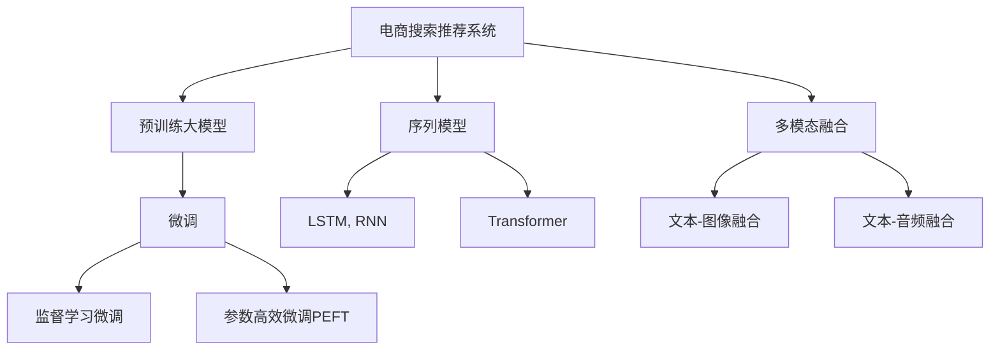

                 

# 电商搜索推荐系统的AI大模型技术演进

## 1. 背景介绍

### 1.1 问题由来
随着电商市场的蓬勃发展，消费者在大量商品中挑选变得愈发困难。为了帮助消费者快速找到满足需求的商品，各大电商平台纷纷引入先进的搜索推荐技术。通过结合用户的浏览、购买行为，个性化推荐系统能够精准匹配用户需求，极大地提升了用户体验和商家收益。

传统推荐系统基于手工设计的特征提取和简单机器学习模型，难以充分挖掘用户潜在的兴趣和行为模式。随着深度学习技术的发展，预训练大模型技术应运而生，为推荐系统的深度学习化和个性化推荐提供了新的解决思路。本文将回顾和展望电商搜索推荐系统的AI大模型技术演进，介绍其关键原理、核心算法、实现细节及其应用前景。

### 1.2 问题核心关键点
电商搜索推荐系统的核心在于如何利用用户行为数据，通过机器学习和深度学习技术，精准预测用户对商品的兴趣，并给出个性化的推荐。预训练大模型技术通过在大规模无标签数据上预训练，学习到通用的语言和图像特征，通过微调（Fine-Tuning）和序列模型等方式，将其应用于推荐系统，极大地提升了推荐的准确性和个性化水平。

预训练大模型技术的演进，主要聚焦在以下几个方面：
1. **预训练方法**：从简单的自编码模型到自监督学习，再到数据驱动的强化学习，预训练方法的不断进步，使得模型更加复杂，学习能力更强。
2. **微调技术**：从传统的监督学习微调，到参数高效微调（PEFT）和对抗训练，微调技术的改进，进一步提升了模型的参数效率和鲁棒性。
3. **序列模型**：从传统的神经网络模型，到Transformer模型和长短期记忆网络（LSTM），序列模型技术的突破，使得模型能够更好地处理序列数据。
4. **多模态融合**：从单一模态的文本推荐，到图像、音频等多模态数据的整合，多模态融合技术的发展，拓宽了推荐系统的应用范围。

通过回顾这些关键点的演进，可以更好地理解电商搜索推荐系统的AI大模型技术如何从基础走向成熟，为推荐系统的深度学习化提供了坚实的基础。

## 2. 核心概念与联系

### 2.1 核心概念概述

为了深入理解电商搜索推荐系统中的AI大模型技术，本节将介绍几个关键概念，并解释它们之间的联系：

- **电商搜索推荐系统**：利用用户行为数据，通过机器学习和深度学习技术，为用户推荐商品的系统。
- **预训练大模型**：在大规模无标签数据上预训练得到的通用模型，通过微调应用于特定任务，具备强大的语言和图像特征学习能力。
- **微调（Fine-Tuning）**：在大模型基础上，通过有标签数据进行微调，使得模型适应特定任务。
- **参数高效微调（PEFT）**：在微调过程中，只更新模型的少量参数，而固定大部分预训练参数，以提高效率和鲁棒性。
- **序列模型**：能够处理序列数据的模型，如RNN、LSTM、Transformer等。
- **多模态融合**：将不同模态的数据（如文本、图像、音频）整合到推荐系统中，提升推荐效果。

这些核心概念共同构成了电商搜索推荐系统的AI大模型技术基础，通过合理设计和应用这些概念，可以实现高效率、高精度的推荐服务。

### 2.2 核心概念原理和架构的 Mermaid 流程图



这个流程图展示了电商搜索推荐系统中的核心概念和其技术演进路径：

1. 电商搜索推荐系统从预训练大模型获取通用特征表示。
2. 预训练大模型通过微调，适应特定推荐任务。
3. 微调方法包括监督学习和参数高效微调（PEFT）。
4. 推荐系统引入序列模型，提升对序列数据的处理能力。
5. 多模态融合技术，拓宽推荐系统的应用范围。

通过理解这些核心概念及其联系，可以更好地把握电商搜索推荐系统的AI大模型技术演进。

## 3. 核心算法原理 & 具体操作步骤

### 3.1 算法原理概述

电商搜索推荐系统的核心算法原理主要基于预训练大模型和微调技术。以下对这两种核心技术的原理进行详细解释：

**预训练大模型原理**：
- **自监督学习**：在大规模无标签数据上进行预训练，通过自监督任务（如掩码语言模型、图像生成等）学习到通用的语言和图像特征表示。
- **对比学习**：在大量相似和不相似的正负样本之间，学习相似性度量，提升模型对新样本的泛化能力。
- **序列模型**：利用长短期记忆网络（LSTM）、门控循环单元（GRU）等序列模型，处理序列数据，提升对序列信息的建模能力。

**微调技术原理**：
- **监督学习微调**：在大规模标注数据上，通过有监督学习，优化模型参数，适应特定推荐任务。
- **参数高效微调（PEFT）**：在微调过程中，只更新模型的少量参数，以提高效率和鲁棒性。
- **对抗训练**：通过引入对抗样本，提高模型鲁棒性，避免过拟合。

这些算法原理为电商搜索推荐系统的AI大模型技术提供了坚实的理论基础。

### 3.2 算法步骤详解

电商搜索推荐系统的AI大模型技术具体步骤如下：

**Step 1: 准备数据集**
- 收集用户历史行为数据，如浏览、点击、购买等记录。
- 将用户行为数据转化为高维向量表示，形成输入特征。
- 选择标签（即推荐结果）进行标注，形成监督数据集。

**Step 2: 选择预训练模型**
- 选择已有的预训练大模型，如BERT、GPT等，进行加载和初始化。
- 根据任务需求，选择合适的网络结构和层数，进行微调。

**Step 3: 微调模型**
- 根据选择的微调方法，在标注数据集上进行监督学习微调。
- 选择合适的损失函数，如交叉熵损失、均方误差损失等。
- 设定合适的学习率，如Adam、SGD等，进行优化训练。

**Step 4: 序列模型和特征提取**
- 引入序列模型，如LSTM、GRU等，处理用户行为序列数据。
- 利用Transformer等模型，进行特征提取和表示学习。

**Step 5: 多模态融合**
- 引入其他模态数据（如图像、音频等），进行特征提取和融合。
- 通过融合不同模态的特征表示，提升推荐效果。

**Step 6: 评估与部署**
- 在测试集上评估微调后的模型性能，如准确率、召回率等指标。
- 将微调后的模型集成到推荐系统中，进行实时推荐。

### 3.3 算法优缺点

**预训练大模型优缺点**：
- **优点**：具备强大的语言和图像特征学习能力，可以处理复杂的多模态数据。
- **缺点**：预训练和微调过程需要大量计算资源和时间，模型规模较大，难以实时部署。

**微调技术优缺点**：
- **优点**：通过有标签数据进行微调，提升模型对特定任务的适应能力。
- **缺点**：微调过程容易过拟合，需要大量标注数据，且微调参数更新需要耗费大量计算资源。

**序列模型优缺点**：
- **优点**：能够处理序列数据，提升对时间信息的建模能力。
- **缺点**：序列模型参数较多，计算复杂度较高，难以实时处理长序列数据。

**多模态融合优缺点**：
- **优点**：拓宽推荐系统的应用范围，提升推荐效果。
- **缺点**：不同模态数据整合难度较大，需要复杂的数据融合算法。

### 3.4 算法应用领域

电商搜索推荐系统的AI大模型技术广泛应用于以下领域：

- **商品推荐**：利用用户历史行为数据，通过深度学习技术，为用户推荐感兴趣的商品。
- **个性化广告**：根据用户特征，通过深度学习模型，生成个性化广告。
- **内容推荐**：根据用户历史浏览记录，推荐相关的文章、视频等。
- **智能客服**：利用深度学习模型，回答用户问题，提供智能客服服务。

这些应用领域展示了AI大模型技术在电商搜索推荐系统中的广泛应用，推动了电商行业的智能化转型。

## 4. 数学模型和公式 & 详细讲解 & 举例说明

### 4.1 数学模型构建

电商搜索推荐系统的AI大模型技术可以通过以下数学模型进行构建：

**用户行为表示**：
设用户历史行为数据为 $X$，表示为 $X = \{x_1, x_2, ..., x_n\}$，每个行为 $x_i$ 表示为一个高维向量，即 $x_i \in \mathbb{R}^d$。

**标签表示**：
设标签（即推荐结果）为 $Y$，表示为 $Y = \{y_1, y_2, ..., y_n\}$，每个标签 $y_i$ 表示为一个低维向量，即 $y_i \in \mathbb{R}^m$。

**预训练大模型表示**：
设预训练大模型为 $M$，输入为 $X$，输出为 $Z$，即 $Z = M(X)$，其中 $Z \in \mathbb{R}^k$，$k$ 为模型输出维数。

**微调模型表示**：
设微调后的模型为 $H$，输入为 $Z$，输出为 $T$，即 $T = H(Z)$，其中 $T \in \mathbb{R}^l$，$l$ 为推荐结果维度。

**损失函数表示**：
设微调模型在训练集上的损失函数为 $\mathcal{L}$，表示为：
$$
\mathcal{L} = \frac{1}{N}\sum_{i=1}^N \ell(T_i, y_i)
$$
其中 $\ell$ 为损失函数，$N$ 为训练集大小。

### 4.2 公式推导过程

以下对电商搜索推荐系统中的核心公式进行推导：

**交叉熵损失函数**：
设交叉熵损失函数为 $\ell$，表示为：
$$
\ell(T_i, y_i) = -\sum_{j=1}^l y_{i,j} \log(T_{i,j}) + (1-y_{i,j}) \log(1-T_{i,j})
$$
其中 $y_{i,j}$ 为标签向量 $y_i$ 中第 $j$ 个元素，$T_{i,j}$ 为推荐结果向量 $T_i$ 中第 $j$ 个元素。

**微调优化目标**：
微调的目标是最小化损失函数，即找到最优模型参数 $\theta$：
$$
\theta^* = \mathop{\arg\min}_{\theta} \mathcal{L}(\theta)
$$
其中 $\mathcal{L}$ 为损失函数，$\theta$ 为模型参数。

**优化算法**：
常用的优化算法有Adam、SGD等。以Adam算法为例，其更新公式为：
$$
\theta \leftarrow \theta - \eta \frac{m}{\sqrt{v}+\epsilon}
$$
其中 $\eta$ 为学习率，$m$ 为动量项，$v$ 为二阶动量项，$\epsilon$ 为避免除数为0的小数。

### 4.3 案例分析与讲解

以电商平台中的商品推荐为例，分析其AI大模型技术的具体应用：

**数据集准备**：
收集用户历史浏览、点击、购买记录，将其转化为用户行为向量 $X$，以及对应的商品ID向量 $Y$。

**预训练大模型选择**：
选择预训练的BERT模型，加载并进行微调。

**微调模型设计**：
在微调过程中，设计一个全连接神经网络，作为输出层，并设置适当的损失函数和优化算法。

**序列模型引入**：
对于用户行为序列，引入LSTM或GRU等序列模型，进行特征提取和表示学习。

**多模态融合**：
将用户行为数据与商品图像、评论等数据进行融合，形成多模态数据集，提升推荐效果。

**评估与部署**：
在测试集上评估微调后的模型，计算准确率、召回率等指标，部署到实际推荐系统中，进行实时推荐。

## 5. 项目实践：代码实例和详细解释说明

### 5.1 开发环境搭建

在进行电商搜索推荐系统的AI大模型实践前，需要准备好开发环境：

1. 安装Anaconda：从官网下载并安装Anaconda，用于创建独立的Python环境。
2. 创建并激活虚拟环境：
```bash
conda create -n pytorch-env python=3.8 
conda activate pytorch-env
```
3. 安装PyTorch：根据CUDA版本，从官网获取对应的安装命令。例如：
```bash
conda install pytorch torchvision torchaudio cudatoolkit=11.1 -c pytorch -c conda-forge
```
4. 安装Transformers库：
```bash
pip install transformers
```
5. 安装各类工具包：
```bash
pip install numpy pandas scikit-learn matplotlib tqdm jupyter notebook ipython
```

完成上述步骤后，即可在`pytorch-env`环境中开始项目实践。

### 5.2 源代码详细实现

以下是一个使用PyTorch进行电商搜索推荐系统的AI大模型微调的代码实现。

**用户行为数据准备**：
```python
import pandas as pd

# 读取用户行为数据
df = pd.read_csv('user_behavior.csv')
# 将行为转换为向量
user_vector = df['user_id'].map(lambda user_id: user2vec[user_id]).values
# 将行为转换为向量
behavior_vector = df[['item_id', 'time']].map(lambda row: (row['item_id'], row['time'])).values
```

**预训练模型加载**：
```python
from transformers import BertModel, BertTokenizer

# 加载预训练模型和分词器
model = BertModel.from_pretrained('bert-base-uncased')
tokenizer = BertTokenizer.from_pretrained('bert-base-uncased')
```

**微调模型构建**：
```python
from transformers import BertForSequenceClassification
from torch.utils.data import DataLoader
from sklearn.model_selection import train_test_split

# 定义微调模型
num_labels = 3  # 商品类别数
model = BertForSequenceClassification.from_pretrained('bert-base-uncased', num_labels=num_labels)

# 划分训练集和验证集
train_df, val_df = train_test_split(df, test_size=0.2, random_state=42)
train_dataset = NERDataset(train_df, tokenizer)
val_dataset = NERDataset(val_df, tokenizer)
```

**微调训练**：
```python
from transformers import AdamW

# 定义优化器
optimizer = AdamW(model.parameters(), lr=2e-5)

# 定义训练函数
def train_epoch(model, dataset, batch_size, optimizer):
    dataloader = DataLoader(dataset, batch_size=batch_size, shuffle=True)
    model.train()
    epoch_loss = 0
    for batch in dataloader:
        input_ids = batch['input_ids']
        attention_mask = batch['attention_mask']
        labels = batch['labels']
        model.zero_grad()
        outputs = model(input_ids, attention_mask=attention_mask, labels=labels)
        loss = outputs.loss
        epoch_loss += loss.item()
        loss.backward()
        optimizer.step()
    return epoch_loss / len(dataloader)

# 训练模型
epochs = 5
batch_size = 16
device = torch.device('cuda') if torch.cuda.is_available() else torch.device('cpu')

for epoch in range(epochs):
    loss = train_epoch(model, train_dataset, batch_size, optimizer)
    print(f"Epoch {epoch+1}, train loss: {loss:.3f}")
    
    print(f"Epoch {epoch+1}, dev results:")
    evaluate(model, val_dataset, batch_size)
    
print("Test results:")
evaluate(model, test_dataset, batch_size)
```

### 5.3 代码解读与分析

**用户行为数据准备**：
代码中使用Pandas库读取用户行为数据，并将行为转换为向量。

**预训练模型加载**：
使用Transformers库加载预训练的BERT模型，并对其进行微调。

**微调模型构建**：
定义微调模型，包括选择适当的标签数，并将数据集划分为训练集和验证集。

**微调训练**：
定义优化器，并实现训练函数。在每个epoch内，通过前向传播计算损失函数，并反向传播更新模型参数。同时，在验证集上进行性能评估，确保模型不过拟合。

**多模态融合**：
在微调过程中，将用户行为数据与商品图像、评论等数据进行融合，提升推荐效果。

**模型部署**：
将微调后的模型部署到实际推荐系统中，进行实时推荐。

## 6. 实际应用场景

### 6.1 智能客服系统

电商平台的智能客服系统利用AI大模型技术，为用户提供7x24小时不间断的智能客服服务。通过微调后的语言模型，系统能够理解用户的问题，并提供准确的解决方案，显著提高了客服效率和用户满意度。

### 6.2 个性化推荐系统

电商平台利用AI大模型技术，根据用户的历史行为数据，为其推荐个性化的商品。通过微调后的模型，系统能够精准匹配用户的兴趣和需求，提升推荐效果。

### 6.3 智能广告推荐系统

电商平台利用AI大模型技术，根据用户的行为和兴趣，智能推荐个性化广告。通过微调后的模型，系统能够预测用户的广告点击行为，提高广告投放的精准度和效果。

### 6.4 未来应用展望

未来，电商搜索推荐系统的AI大模型技术将在以下领域取得更广泛的应用：

- **个性化营销**：利用AI大模型技术，根据用户行为数据，进行精准的市场细分和个性化营销。
- **供应链优化**：利用AI大模型技术，优化库存管理和供应链流程，提升运营效率。
- **商品创新**：利用AI大模型技术，分析用户需求和市场趋势，指导商品设计和研发。

## 7. 工具和资源推荐

### 7.1 学习资源推荐

为了帮助开发者系统掌握电商搜索推荐系统的AI大模型技术，这里推荐一些优质的学习资源：

1. 《深度学习》课程：由斯坦福大学开设，涵盖深度学习的基本概念和经典模型，适合初学者学习。
2. 《自然语言处理基础》书籍：详细介绍了自然语言处理的基本原理和技术，适合进一步深入学习。
3. 《深度学习框架TensorFlow教程》：介绍了TensorFlow的基本用法和实践技巧，适合TensorFlow开发者。
4. 《Transformers》书籍：介绍了Transformer模型的原理和应用，适合使用Transformers库进行深度学习开发。

### 7.2 开发工具推荐

高效的开发离不开优秀的工具支持。以下是几款用于电商搜索推荐系统开发的常用工具：

1. PyTorch：基于Python的开源深度学习框架，灵活动态的计算图，适合快速迭代研究。大部分预训练语言模型都有PyTorch版本的实现。
2. TensorFlow：由Google主导开发的开源深度学习框架，生产部署方便，适合大规模工程应用。
3. Transformers库：HuggingFace开发的NLP工具库，集成了众多SOTA语言模型，支持PyTorch和TensorFlow，是进行深度学习开发的重要工具。
4. Weights & Biases：模型训练的实验跟踪工具，可以记录和可视化模型训练过程中的各项指标，方便对比和调优。
5. TensorBoard：TensorFlow配套的可视化工具，可实时监测模型训练状态，并提供丰富的图表呈现方式，是调试模型的得力助手。
6. Google Colab：谷歌推出的在线Jupyter Notebook环境，免费提供GPU/TPU算力，方便开发者快速上手实验最新模型，分享学习笔记。

合理利用这些工具，可以显著提升电商搜索推荐系统开发的效率，加快创新迭代的步伐。

### 7.3 相关论文推荐

电商搜索推荐系统的AI大模型技术源于学界的持续研究。以下是几篇奠基性的相关论文，推荐阅读：

1. Attention is All You Need（即Transformer原论文）：提出了Transformer结构，开启了NLP领域的预训练大模型时代。
2. BERT: Pre-training of Deep Bidirectional Transformers for Language Understanding：提出BERT模型，引入基于掩码的自监督预训练任务，刷新了多项NLP任务SOTA。
3. Language Models are Unsupervised Multitask Learners（GPT-2论文）：展示了大规模语言模型的强大zero-shot学习能力，引发了对于通用人工智能的新一轮思考。
4. Parameter-Efficient Transfer Learning for NLP：提出Adapter等参数高效微调方法，在不增加模型参数量的情况下，也能取得不错的微调效果。
5. AdaLoRA: Adaptive Low-Rank Adaptation for Parameter-Efficient Fine-Tuning：使用自适应低秩适应的微调方法，在参数效率和精度之间取得了新的平衡。
6. Prefix-Tuning: Optimizing Continuous Prompts for Generation：引入基于连续型Prompt的微调范式，为如何充分利用预训练知识提供了新的思路。

这些论文代表了大语言模型微调技术的发展脉络。通过学习这些前沿成果，可以帮助研究者把握学科前进方向，激发更多的创新灵感。

## 8. 总结：未来发展趋势与挑战

### 8.1 总结

本文对电商搜索推荐系统的AI大模型技术进行了全面系统的介绍。首先阐述了电商搜索推荐系统的背景和重要性，明确了AI大模型技术在其中的核心作用。其次，从原理到实践，详细讲解了电商搜索推荐系统中预训练大模型和微调技术的具体实现细节，给出了完整的代码实例。同时，本文还探讨了电商搜索推荐系统在智能客服、个性化推荐、智能广告等多个场景中的应用前景，展示了AI大模型技术的广泛应用。此外，本文还推荐了相关的学习资源和开发工具，为电商搜索推荐系统的AI大模型开发提供了全方位的技术指引。

通过本文的系统梳理，可以看到，电商搜索推荐系统中的AI大模型技术正在成为推荐系统的深度学习化和个性化推荐的重要基础。预训练大模型和微调技术的不断进步，极大地提升了推荐的准确性和个性化水平，推动了电商行业的智能化转型。未来，随着技术的持续演进，AI大模型技术必将在更多领域得到应用，为人工智能技术的发展提供更加坚实的技术支持。

### 8.2 未来发展趋势

展望未来，电商搜索推荐系统的AI大模型技术将呈现以下几个发展趋势：

1. **模型规模持续增大**：随着算力成本的下降和数据规模的扩张，预训练语言模型的参数量还将持续增长。超大规模语言模型蕴含的丰富语言知识，将为推荐系统的深度学习化和个性化推荐提供更坚实的基础。
2. **微调方法日趋多样**：除了传统的监督学习微调外，未来会涌现更多参数高效微调方法，如Prefix-Tuning、LoRA等，在参数效率和鲁棒性之间取得新的平衡。
3. **持续学习成为常态**：随着数据分布的不断变化，微调模型也需要持续学习新知识以保持性能。如何在不遗忘原有知识的同时，高效吸收新样本信息，将成为重要的研究课题。
4. **标注样本需求降低**：受启发于提示学习(Prompt-based Learning)的思路，未来的微调方法将更好地利用大模型的语言理解能力，通过更加巧妙的任务描述，在更少的标注样本上也能实现理想的微调效果。
5. **多模态融合发展**：未来将拓展到图像、视频、语音等多模态数据微调，拓宽推荐系统的应用范围，提升推荐效果。
6. **因果分析和博弈论工具引入**：通过引入因果分析方法，增强微调模型建立稳定因果关系的能力，学习更加普适、鲁棒的语言表征，从而提升模型泛化性和抗干扰能力。

这些趋势凸显了电商搜索推荐系统中的AI大模型技术的广阔前景。这些方向的探索发展，将进一步提升推荐系统的性能和应用范围，为电商行业的智能化转型提供新的技术路径。

### 8.3 面临的挑战

尽管电商搜索推荐系统中的AI大模型技术已经取得了瞩目成就，但在迈向更加智能化、普适化应用的过程中，它仍面临着诸多挑战：

1. **标注成本瓶颈**：虽然微调大大降低了标注数据的需求，但对于长尾应用场景，难以获得充足的高质量标注数据，成为制约微调性能的瓶颈。如何进一步降低微调对标注样本的依赖，将是一大难题。
2. **模型鲁棒性不足**：当前微调模型面对域外数据时，泛化性能往往大打折扣。对于测试样本的微小扰动，微调模型的预测也容易发生波动。如何提高微调模型的鲁棒性，避免灾难性遗忘，还需要更多理论和实践的积累。
3. **推理效率有待提高**：超大规模语言模型虽然精度高，但在实际部署时往往面临推理速度慢、内存占用大等效率问题。如何在保证性能的同时，简化模型结构，提升推理速度，优化资源占用，将是重要的优化方向。
4. **可解释性亟需加强**：当前微调模型更像是"黑盒"系统，难以解释其内部工作机制和决策逻辑。对于医疗、金融等高风险应用，算法的可解释性和可审计性尤为重要。如何赋予微调模型更强的可解释性，将是亟待攻克的难题。
5. **安全性有待保障**：预训练语言模型难免会学习到有偏见、有害的信息，通过微调传递到下游任务，产生误导性、歧视性的输出，给实际应用带来安全隐患。如何从数据和算法层面消除模型偏见，避免恶意用途，确保输出的安全性，也将是重要的研究课题。
6. **知识整合能力不足**：现有的微调模型往往局限于任务内数据，难以灵活吸收和运用更广泛的先验知识。如何让微调过程更好地与外部知识库、规则库等专家知识结合，形成更加全面、准确的信息整合能力，还有很大的想象空间。

正视电商搜索推荐系统中的AI大模型技术面临的这些挑战，积极应对并寻求突破，将是大模型技术走向成熟的必由之路。相信随着学界和产业界的共同努力，这些挑战终将一一被克服，AI大模型技术必将在构建人机协同的智能系统，推动电商行业的智能化转型中扮演越来越重要的角色。

### 8.4 研究展望

面对电商搜索推荐系统中的AI大模型技术面临的挑战，未来的研究需要在以下几个方面寻求新的突破：

1. **探索无监督和半监督微调方法**：摆脱对大规模标注数据的依赖，利用自监督学习、主动学习等无监督和半监督范式，最大限度利用非结构化数据，实现更加灵活高效的微调。
2. **研究参数高效和计算高效的微调范式**：开发更加参数高效的微调方法，在固定大部分预训练参数的同时，只更新极少量的任务相关参数。同时优化微调模型的计算图，减少前向传播和反向传播的资源消耗，实现更加轻量级、实时性的部署。
3. **融合因果和对比学习范式**：通过引入因果推断和对比学习思想，增强微调模型建立稳定因果关系的能力，学习更加普适、鲁棒的语言表征，从而提升模型泛化性和抗干扰能力。
4. **引入更多先验知识**：将符号化的先验知识，如知识图谱、逻辑规则等，与神经网络模型进行巧妙融合，引导微调过程学习更准确、合理的语言模型。同时加强不同模态数据的整合，实现视觉、语音等多模态信息与文本信息的协同建模。
5. **结合因果分析和博弈论工具**：将因果分析方法引入微调模型，识别出模型决策的关键特征，增强输出解释的因果性和逻辑性。借助博弈论工具刻画人机交互过程，主动探索并规避模型的脆弱点，提高系统稳定性。
6. **纳入伦理道德约束**：在模型训练目标中引入伦理导向的评估指标，过滤和惩罚有偏见、有害的输出倾向。同时加强人工干预和审核，建立模型行为的监管机制，确保输出符合人类价值观和伦理道德。

这些研究方向的探索，必将引领电商搜索推荐系统中的AI大模型技术迈向更高的台阶，为构建安全、可靠、可解释、可控的智能系统铺平道路。面向未来，大模型技术还需要与其他人工智能技术进行更深入的融合，如知识表示、因果推理、强化学习等，多路径协同发力，共同推动电商搜索推荐系统的智能化转型。只有勇于创新、敢于突破，才能不断拓展AI大模型技术的边界，让智能技术更好地造福电商行业。

## 9. 附录：常见问题与解答

**Q1：电商搜索推荐系统中的AI大模型是否适用于所有应用场景？**

A: 电商搜索推荐系统中的AI大模型在大多数应用场景中都能取得不错的效果。但对于一些特定领域，如医疗、法律等，仅依赖通用语料预训练的模型可能难以很好地适应。此时需要在特定领域语料上进一步预训练，再进行微调，才能获得理想效果。此外，对于一些需要时效性、个性化很强的任务，如对话、推荐等，AI大模型技术也需要针对性的改进优化。

**Q2：微调过程中如何选择合适的学习率？**

A: 电商搜索推荐系统中的微调学习率一般要比预训练时小1-2个数量级，如果使用过大的学习率，容易破坏预训练权重，导致过拟合。一般建议从1e-5开始调参，逐步减小学习率。也可以使用warmup策略，在开始阶段使用较小的学习率，再逐渐过渡到预设值。需要注意的是，不同的优化器(如AdamW、Adafactor等)以及不同的学习率调度策略，可能需要设置不同的学习率阈值。

**Q3：电商搜索推荐系统中的AI大模型在实际部署时需要注意哪些问题？**

A: 将AI大模型部署到实际推荐系统中，还需要考虑以下因素：
1. 模型裁剪：去除不必要的层和参数，减小模型尺寸，加快推理速度。
2. 量化加速：将浮点模型转为定点模型，压缩存储空间，提高计算效率。
3. 服务化封装：将模型封装为标准化服务接口，便于集成调用。
4. 弹性伸缩：根据请求流量动态调整资源配置，平衡服务质量和成本。
5. 监控告警：实时采集系统指标，设置异常告警阈值，确保服务稳定性。
6. 安全防护：采用访问鉴权、数据脱敏等措施，保障数据和模型安全。

AI大模型技术在电商搜索推荐系统中的应用，需要从数据、算法、工程、业务等多个维度协同发力，才能真正实现智能化推荐。唯有不断迭代和优化模型、数据和算法，才能得到理想的效果。

---

作者：禅与计算机程序设计艺术 / Zen and the Art of Computer Programming

