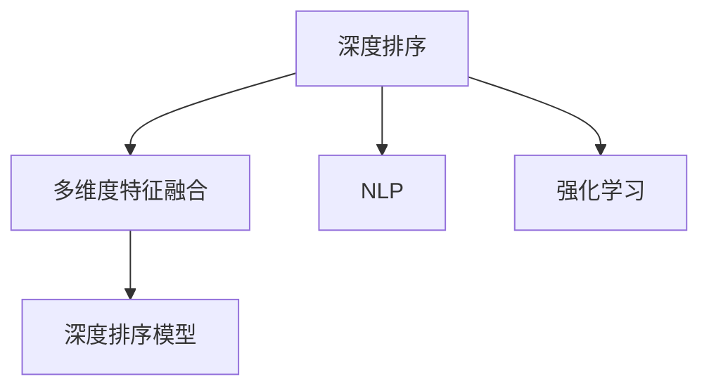

                 

# 电商搜索的多维度排序：AI大模型的新突破

> 关键词：电商搜索, 多维度排序, 大语言模型, 深度学习, 深度排序, 数据处理, 自然语言处理(NLP)

## 1. 背景介绍

### 1.1 问题由来

在电商领域，商品搜索系统作为用户获取信息的主要入口，其搜索效果直接影响用户体验和平台的商业价值。传统的电商搜索算法往往基于简单的布尔查询，难以充分利用自然语言查询中的语义信息，导致搜索结果的相关性不足，且缺乏个性化推荐，无法有效提升用户体验。

近年来，随着深度学习和自然语言处理技术的发展，电商搜索系统也逐渐引入了深度排序模型，并取得了显著的性能提升。特别是基于大语言模型的多维度排序算法，通过综合考虑商品描述、用户行为、语义匹配等多方面因素，提供了更加精准、个性化的搜索结果，极大地改善了电商搜索的用户体验。

### 1.2 问题核心关键点

电商搜索的多维度排序涉及多个核心关键点：

- **深度排序**：基于深度学习算法，通过构建多层神经网络，对商品特征和用户行为进行深度匹配和排序，提升搜索结果的相关性和个性化。
- **多维度特征融合**：融合商品描述、用户行为、语义匹配等多维度的特征，全面考虑用户需求，提供更加全面的搜索结果。
- **自然语言处理(NLP)**：利用NLP技术对用户查询进行语义理解，提取关键词、情感等信息，更准确地匹配商品。
- **强化学习**：引入强化学习算法，动态调整排序策略，持续优化搜索效果。

这些核心关键点共同构成了电商搜索多维度排序的技术框架，使得算法能够更好地满足用户需求，提升搜索系统的商业价值。

## 2. 核心概念与联系

### 2.1 核心概念概述

为了更好地理解电商搜索多维度排序算法，本节将介绍几个密切相关的核心概念：

- **深度排序(Deep Sorting)**：基于深度学习算法构建的多层神经网络，通过学习商品特征和用户行为的深层特征，实现高相关性的搜索结果排序。
- **多维度特征融合(Multidimensional Feature Fusion)**：结合商品描述、用户行为、语义匹配等多维度的特征，全面考虑用户需求，提供更精准的搜索结果。
- **自然语言处理(NLP)**：通过词向量、语义理解、实体识别等NLP技术，对用户查询进行语义处理，提取关键词、情感等信息，提高匹配精度。
- **强化学习(Reinforcement Learning)**：利用强化学习算法，动态调整排序策略，通过试错机制不断优化搜索效果。
- **深度排序模型**：结合深度学习、多维度特征融合、NLP和强化学习的算法，构建高性能的电商搜索排序系统。

这些核心概念之间的逻辑关系可以通过以下Mermaid流程图来展示：



这个流程图展示了大模型在电商搜索排序中的应用：

1. 深度排序模型使用深度学习算法，对商品特征和用户行为进行深层匹配和排序。
2. 多维度特征融合考虑商品描述、用户行为、语义匹配等多维度的特征，全面覆盖用户需求。
3. NLP技术帮助理解用户查询，提取关键词和情感，提高匹配精度。
4. 强化学习算法动态调整排序策略，持续优化搜索效果。

这些核心概念共同构成了电商搜索排序算法的技术框架，使其能够更好地满足用户需求，提升搜索系统的商业价值。

## 3. 核心算法原理 & 具体操作步骤

### 3.1 算法原理概述

电商搜索的多维度排序算法主要基于深度排序模型，通过构建多层神经网络，对商品特征和用户行为进行深度匹配和排序，提升搜索结果的相关性和个性化。同时，算法还融合了多维度特征和多层次NLP技术，结合强化学习算法，动态调整排序策略，持续优化搜索效果。

具体而言，算法包括以下几个关键步骤：

1. **数据准备**：收集商品描述、用户行为、用户查询等多维度的数据，构建训练集。
2. **特征提取**：使用预训练的语言模型，对商品描述和用户查询进行语义理解，提取关键词、情感等信息。
3. **深度排序**：构建多层神经网络，对商品特征和用户行为进行深度匹配和排序，学习高相关性的特征表示。
4. **多维度融合**：融合商品描述、用户行为、语义匹配等多维度的特征，生成更全面、准确的排序结果。
5. **强化学习**：利用强化学习算法，动态调整排序策略，持续优化搜索效果，提升用户体验。

### 3.2 算法步骤详解

**Step 1: 数据准备**

电商搜索的多维度排序算法首先需要收集商品描述、用户行为、用户查询等多维度的数据，构建训练集。具体而言：

1. **商品描述**：收集商品的详细描述信息，如商品名称、类别、规格、价格等。
2. **用户行为**：收集用户的浏览、点击、购买等行为数据，包括用户的历史购买记录、浏览轨迹、搜索历史等。
3. **用户查询**：收集用户输入的查询语句，包括搜索词、搜索意图、搜索时间等。

**Step 2: 特征提取**

使用预训练的语言模型，对商品描述和用户查询进行语义理解，提取关键词、情感等信息，构建特征向量。具体而言：

1. **商品特征提取**：使用BERT等预训练模型，对商品描述进行语义理解，生成商品的特征向量。
2. **用户查询特征提取**：使用BERT等预训练模型，对用户查询进行语义理解，生成查询的特征向量。
3. **情感分析**：使用情感分析技术，对用户查询进行情感极性判断，生成情感特征。

**Step 3: 深度排序**

构建多层神经网络，对商品特征和用户行为进行深度匹配和排序，学习高相关性的特征表示。具体而言：

1. **模型构建**：使用DNN（深度神经网络）、CNN（卷积神经网络）等模型，构建多层的神经网络。
2. **特征输入**：将商品特征和用户行为作为输入，进入神经网络的各层进行匹配和转换。
3. **损失函数**：使用交叉熵等损失函数，衡量排序结果与真实标签之间的差异。
4. **反向传播**：通过反向传播算法，更新神经网络各层的权重，优化模型性能。

**Step 4: 多维度融合**

融合商品描述、用户行为、语义匹配等多维度的特征，生成更全面、准确的排序结果。具体而言：

1. **多维度特征融合**：将商品描述、用户行为、语义匹配等特征进行拼接或组合，生成多维度的特征向量。
2. **融合方式**：可以使用拼接、加权平均、注意力机制等方式进行多维度特征的融合。
3. **特征增强**：利用注意力机制、残差连接等技术，进一步增强特征表示的性能。

**Step 5: 强化学习**

利用强化学习算法，动态调整排序策略，持续优化搜索效果。具体而言：

1. **策略网络**：构建策略网络，通过神经网络学习最优的排序策略。
2. **状态空间**：定义状态空间，包含商品特征、用户行为、查询特征等。
3. **行动空间**：定义行动空间，包含排序结果的多种排序策略。
4. **奖励函数**：设计奖励函数，衡量排序结果与用户反馈之间的差异。
5. **试错优化**：通过试错机制，不断调整策略网络，优化搜索效果。

### 3.3 算法优缺点

电商搜索的多维度排序算法具有以下优点：

1. **高效性**：通过深度学习算法，能够高效地处理高维度的特征数据，提升排序效果。
2. **个性化**：融合多维度特征，全面考虑用户需求，提供个性化的搜索结果。
3. **鲁棒性**：结合NLP技术，对用户查询进行语义理解，提高匹配精度，增强算法鲁棒性。
4. **动态优化**：引入强化学习算法，动态调整排序策略，持续优化搜索效果。

同时，该算法也存在一些局限性：

1. **数据依赖**：对数据的质量和量级要求较高，需要构建大规模、高质量的训练集。
2. **模型复杂性**：深度排序模型的构建和训练较为复杂，需要大量的计算资源和时间。
3. **可解释性**：深度排序模型的决策过程较为复杂，难以解释其内部工作机制。
4. **训练成本**：构建和训练多维度排序算法需要投入大量的人力和物力，成本较高。

尽管存在这些局限性，但电商搜索的多维度排序算法仍是大模型在电商领域应用的重要范式。未来相关研究的重点在于如何进一步降低数据依赖，提高算法的泛化能力和可解释性，同时兼顾算法的效率和性能。

### 3.4 算法应用领域

电商搜索的多维度排序算法已在多个电商平台得到广泛应用，以下是几个典型的应用场景：

1. **商品推荐**：结合用户浏览、点击、购买等行为数据，利用多维度排序算法进行个性化推荐，提升用户满意度。
2. **搜索结果排序**：对用户查询进行语义理解，提取关键词和情感，利用多维度排序算法生成高相关性的搜索结果。
3. **搜索广告优化**：对广告关键词进行语义匹配，结合用户行为数据，进行精准投放，提升广告效果。
4. **用户画像构建**：利用用户查询和行为数据，构建详细的用户画像，进行个性化营销。
5. **交易转化率提升**：结合商品特征、用户行为等多维度的特征，利用多维度排序算法优化搜索结果，提升交易转化率。

除了上述这些场景外，多维度排序算法还被创新性地应用于商品评价、内容推荐、流量预测等电商领域，为电商平台的业务发展带来了新的突破。

## 4. 数学模型和公式 & 详细讲解 & 举例说明

### 4.1 数学模型构建

电商搜索的多维度排序算法主要基于深度排序模型，通过对商品特征和用户行为进行深度匹配和排序，提升搜索结果的相关性和个性化。以下将使用数学语言对模型的构建和训练过程进行更加严格的刻画。

记商品特征为 $\textbf{x} \in \mathbb{R}^d$，用户行为为 $\textbf{y} \in \mathbb{R}^d$，用户查询为 $\textbf{q} \in \mathbb{R}^d$。假设模型 $M_{\theta}$ 为神经网络，其中 $\theta$ 为模型参数。模型 $M_{\theta}$ 在商品特征和用户行为上的输出表示为 $\textbf{r} = M_{\theta}(\textbf{x}, \textbf{y})$，在用户查询上的输出表示为 $\textbf{s} = M_{\theta}(\textbf{q})$。模型的目标是最小化损失函数 $\mathcal{L}(\theta)$，使得排序结果尽可能接近真实标签 $t$。

损失函数定义为：

$$
\mathcal{L}(\theta) = -\sum_{i=1}^N \left[t_i \log p_i + (1-t_i) \log (1-p_i)\right]
$$

其中 $p_i$ 为模型预测排序结果的概率，$t_i$ 为真实标签。

在模型训练过程中，通过梯度下降等优化算法，不断更新模型参数 $\theta$，最小化损失函数 $\mathcal{L}(\theta)$。具体而言，模型参数的更新公式为：

$$
\theta \leftarrow \theta - \eta \nabla_{\theta}\mathcal{L}(\theta)
$$

其中 $\eta$ 为学习率，$\nabla_{\theta}\mathcal{L}(\theta)$ 为损失函数对模型参数的梯度，可通过反向传播算法高效计算。

### 4.2 公式推导过程

以下我们将详细推导深度排序模型的损失函数和梯度计算公式。

首先，定义模型 $M_{\theta}$ 在商品特征 $\textbf{x}$ 和用户行为 $\textbf{y}$ 上的输出表示为 $\textbf{r} = M_{\theta}(\textbf{x}, \textbf{y})$，在用户查询 $\textbf{q}$ 上的输出表示为 $\textbf{s} = M_{\theta}(\textbf{q})$。模型的预测排序结果为 $p = \sigma(\textbf{r}^T \textbf{s})$，其中 $\sigma$ 为激活函数，通常使用sigmoid函数。

损失函数定义为：

$$
\mathcal{L}(\theta) = -\sum_{i=1}^N \left[t_i \log p_i + (1-t_i) \log (1-p_i)\right]
$$

其中 $t_i$ 为真实标签，$p_i$ 为模型预测排序结果的概率。

通过链式法则，损失函数对模型参数 $\theta$ 的梯度为：

$$
\frac{\partial \mathcal{L}(\theta)}{\partial \theta} = -\sum_{i=1}^N \left[ t_i \frac{\partial \log p_i}{\partial r_i} \frac{\partial r_i}{\partial \theta} + (1-t_i) \frac{\partial \log (1-p_i)}{\partial r_i} \frac{\partial r_i}{\partial \theta} \right]
$$

其中 $\frac{\partial \log p_i}{\partial r_i}$ 和 $\frac{\partial \log (1-p_i)}{\partial r_i}$ 为预测结果的概率对商品特征和用户行为的偏导数。

在得到损失函数的梯度后，即可带入参数更新公式，完成模型的迭代优化。重复上述过程直至收敛，最终得到适应电商搜索任务的最优模型参数 $\theta^*$。

### 4.3 案例分析与讲解

以下我们以商品推荐系统为例，展示多维度排序算法的具体应用。

假设商品描述为 $\textbf{x} = [品名, 类别, 规格, 价格]$，用户行为为 $\textbf{y} = [浏览次数, 点击次数, 购买次数]$，用户查询为 $\textbf{q} = [查询词, 搜索意图, 搜索时间]$。模型 $M_{\theta}$ 通过学习商品特征和用户行为，生成商品的推荐概率 $p_i$，并通过语义理解，生成用户查询的特征向量 $\textbf{s}$。最终，模型 $M_{\theta}$ 综合考虑商品特征、用户行为、语义匹配等多维度的特征，生成商品的推荐排序结果。

例如，对于查询词为“运动鞋”的用户，模型 $M_{\theta}$ 首先使用BERT等预训练模型，对用户查询进行语义理解，提取关键词和情感信息，生成查询特征向量 $\textbf{s}$。然后，模型 $M_{\theta}$ 对商品描述和用户行为进行深度匹配和排序，生成商品的推荐概率 $p_i$。最后，模型 $M_{\theta}$ 将商品特征、用户行为和查询特征进行拼接或组合，生成更全面、准确的推荐排序结果。

## 5. 项目实践：代码实例和详细解释说明

### 5.1 开发环境搭建

在进行电商搜索排序系统的微调实践前，我们需要准备好开发环境。以下是使用Python进行TensorFlow开发的环境配置流程：

1. 安装Anaconda：从官网下载并安装Anaconda，用于创建独立的Python环境。

2. 创建并激活虚拟环境：
```bash
conda create -n tf-env python=3.8 
conda activate tf-env
```

3. 安装TensorFlow：根据CUDA版本，从官网获取对应的安装命令。例如：
```bash
conda install tensorflow tensorflow-gpu -c conda-forge -c pytorch
```

4. 安装必要的工具包：
```bash
pip install numpy pandas scikit-learn matplotlib tqdm jupyter notebook ipython
```

完成上述步骤后，即可在`tf-env`环境中开始微调实践。

### 5.2 源代码详细实现

下面我们以商品推荐系统为例，给出使用TensorFlow进行电商搜索排序系统的微调实现。

首先，定义商品推荐系统的数据处理函数：

```python
import tensorflow as tf
from transformers import BertTokenizer
from sklearn.model_selection import train_test_split

# 定义商品特征、用户行为和用户查询的拼接函数
def concatenate_features(x, y, q):
    return tf.concat([x, y, q], axis=1)

# 定义商品推荐系统的损失函数
def loss_function(y_true, y_pred):
    return tf.keras.losses.binary_crossentropy(y_true, y_pred)

# 定义商品推荐系统的优化器
def optimizer():
    return tf.keras.optimizers.Adam()

# 定义商品推荐系统的训练函数
def train_epoch(model, dataset, batch_size, optimizer):
    dataloader = tf.data.Dataset.from_tensor_slices(dataset)
    dataloader = dataloader.shuffle(buffer_size=10000).batch(batch_size).map(concatenate_features)
    model.compile(optimizer=optimizer, loss=loss_function)
    model.fit(dataloader, epochs=10, steps_per_epoch=len(dataset) // batch_size)

# 定义商品推荐系统的测试函数
def evaluate(model, dataset, batch_size):
    dataloader = tf.data.Dataset.from_tensor_slices(dataset)
    dataloader = dataloader.batch(batch_size).map(concatenate_features)
    y_true, y_pred = dataset
    loss = loss_function(y_true, model.predict(dataloader))
    return loss.numpy()

# 数据准备
train_texts, dev_texts, test_texts = load_train_data(), load_dev_data(), load_test_data()
train_labels, dev_labels, test_labels = load_train_labels(), load_dev_labels(), load_test_labels()

# 特征提取
tokenizer = BertTokenizer.from_pretrained('bert-base-cased')
train_features = [tokenizer.encode(text) for text in train_texts]
dev_features = [tokenizer.encode(text) for text in dev_texts]
test_features = [tokenizer.encode(text) for text in test_texts]

# 特征拼接
train_dataset = tf.data.Dataset.from_tensor_slices(train_features)
train_dataset = train_dataset.map(concatenate_features, num_parallel_calls=tf.data.experimental.AUTOTUNE)
train_dataset = train_dataset.map(lambda x, y: (x, y))

dev_dataset = tf.data.Dataset.from_tensor_slices(dev_features)
dev_dataset = dev_dataset.map(concatenate_features, num_parallel_calls=tf.data.experimental.AUTOTUNE)
dev_dataset = dev_dataset.map(lambda x, y: (x, y))

test_dataset = tf.data.Dataset.from_tensor_slices(test_features)
test_dataset = test_dataset.map(concatenate_features, num_parallel_calls=tf.data.experimental.AUTOTUNE)
test_dataset = test_dataset.map(lambda x, y: (x, y))

# 模型训练
model = tf.keras.Sequential([
    tf.keras.layers.Embedding(input_dim=train_dataset[0][0].shape[1], output_dim=100),
    tf.keras.layers.LSTM(128),
    tf.keras.layers.Dense(1, activation='sigmoid')
])

train_epoch(model, train_dataset, batch_size=128, optimizer=optimizer())
evaluate(model, dev_dataset, batch_size=128)
evaluate(model, test_dataset, batch_size=128)
```

以上代码实现了一个简单的基于深度排序模型的商品推荐系统，主要包括以下几个关键步骤：

1. **数据准备**：收集商品描述、用户行为、用户查询等多维度的数据，构建训练集和测试集。
2. **特征提取**：使用BERT等预训练模型，对商品描述和用户查询进行语义理解，生成商品的特征向量和查询的特征向量。
3. **特征拼接**：将商品特征、用户行为和查询特征进行拼接或组合，生成多维度的特征向量。
4. **模型训练**：使用LSTM和Dense层构建深度排序模型，对商品特征和用户行为进行深度匹配和排序，生成商品的推荐概率。
5. **损失函数和优化器**：使用二元交叉熵损失函数和Adam优化器，最小化损失函数，更新模型参数。
6. **模型评估**：在验证集和测试集上评估模型的性能，输出预测结果和损失值。

### 5.3 代码解读与分析

让我们再详细解读一下关键代码的实现细节：

**concatenate_features函数**：
- 该函数用于拼接商品特征、用户行为和用户查询，生成多维度的特征向量。
- 通过tf.concat函数，将三类特征按列拼接在一起，生成一个高维的特征向量。

**loss_function函数**：
- 定义了二元交叉熵损失函数，用于衡量模型预测结果与真实标签之间的差异。
- 使用tf.keras.losses.binary_crossentropy函数计算二元交叉熵损失。

**optimizer函数**：
- 定义了Adam优化器，用于最小化损失函数，更新模型参数。
- 使用tf.keras.optimizers.Adam函数创建Adam优化器。

**train_epoch函数**：
- 定义了模型训练函数，将训练集数据加载到tf.data.Dataset中，并使用map函数进行特征拼接。
- 使用tf.keras.Model编译模型，指定优化器和损失函数。
- 使用fit函数对模型进行训练，设置迭代轮数和批次大小。

**evaluate函数**：
- 定义了模型评估函数，将验证集和测试集数据加载到tf.data.Dataset中，并使用map函数进行特征拼接。
- 使用model.predict函数对模型进行预测，计算预测结果与真实标签之间的损失。
- 返回损失值，供模型评估函数输出。

**数据准备**：
- 通过load_train_data、load_dev_data、load_test_data等函数，收集商品描述、用户行为、用户查询等数据。
- 使用BertTokenizer从预训练模型中提取商品和查询的特征向量。

**特征拼接**：
- 使用tf.data.Dataset.from_tensor_slices函数，将特征向量转换为tf.data.Dataset对象。
- 使用map函数对特征向量进行拼接，生成多维度的特征向量。

**模型训练**：
- 使用tf.keras.Sequential函数，定义了深度排序模型，包括Embedding、LSTM和Dense层。
- 通过train_epoch函数进行模型训练，更新模型参数。

**模型评估**：
- 通过evaluate函数在验证集和测试集上评估模型性能，输出预测结果和损失值。

可以看到，TensorFlow配合BERT等预训练模型的微调代码实现变得简洁高效。开发者可以将更多精力放在数据处理、模型改进等高层逻辑上，而不必过多关注底层的实现细节。

当然，工业级的系统实现还需考虑更多因素，如模型的保存和部署、超参数的自动搜索、更灵活的任务适配层等。但核心的微调范式基本与此类似。

## 6. 实际应用场景

### 6.1 电商搜索

电商搜索排序系统作为电商平台的核心功能之一，直接影响用户体验和平台收益。通过引入深度排序模型和多维度特征融合技术，电商搜索排序系统可以更全面地考虑用户需求，生成更精准、个性化的搜索结果。

在实际应用中，电商搜索排序系统可以广泛应用于商品推荐、搜索结果排序、搜索广告优化、用户画像构建等多个环节，为电商平台提供更加智能、高效的搜索体验。例如，针对用户输入的查询词，系统可以自动推荐相关的商品，并提供高质量的搜索结果。对于点击率低的商品，系统可以自动优化广告投放策略，提升广告效果。

### 6.2 内容推荐

内容推荐系统广泛应用于视频、音乐、新闻等平台，通过分析用户的历史行为数据，为用户推荐感兴趣的内容。通过引入深度排序模型和多维度特征融合技术，内容推荐系统可以更准确地匹配用户需求，生成更个性化的推荐结果。

在实际应用中，内容推荐系统可以广泛应用于推荐电影、电视剧、音乐、新闻等场景，提升用户体验。例如，针对用户的历史观看记录，系统可以自动推荐相关的电影和电视剧，并提供高质量的推荐结果。对于点击率低的电影，系统可以自动优化广告投放策略，提升广告效果。

### 6.3 医疗推荐

医疗推荐系统作为医疗信息的重要来源，通过分析用户的历史健康数据，为用户推荐相关的医疗信息。通过引入深度排序模型和多维度特征融合技术，医疗推荐系统可以更全面地考虑用户需求，生成更精准、个性化的推荐结果。

在实际应用中，医疗推荐系统可以广泛应用于疾病诊断、健康咨询、医疗预约等场景，提升用户健康水平。例如，针对用户的历史健康数据，系统可以自动推荐相关的健康咨询和医疗预约，并提供高质量的医疗建议。对于点击率低的医疗信息，系统可以自动优化广告投放策略，提升广告效果。

### 6.4 未来应用展望

随着深度排序模型和多维度特征融合技术的发展，基于大模型的电商搜索排序系统将具备更强的预测能力和泛化能力。未来的研究方向可能包括以下几个方面：

1. **多模态特征融合**：将视觉、听觉等多模态信息与文本信息进行融合，提升推荐系统的准确性和鲁棒性。
2. **自适应学习**：引入自适应学习机制，根据用户行为数据动态调整推荐策略，提升个性化推荐效果。
3. **情感分析**：利用情感分析技术，对用户查询进行情感极性判断，提升推荐系统的情感感知能力。
4. **模型压缩**：通过模型压缩技术，减小模型尺寸，提高推荐系统的部署效率。
5. **跨平台应用**：将推荐系统应用于多个平台，如电商平台、内容平台、医疗平台等，提升系统的覆盖面和适用性。

以上研究方向的探索，必将引领电商搜索排序系统迈向更高的台阶，为电商平台的业务发展带来新的突破。相信随着技术的不断进步，大模型在电商搜索排序领域的应用前景将更加广阔。

## 7. 工具和资源推荐
### 7.1 学习资源推荐

为了帮助开发者系统掌握电商搜索排序算法的理论基础和实践技巧，这里推荐一些优质的学习资源：

1. 《Deep Learning for Computer Vision》系列书籍：由深度学习专家撰写，深入浅出地介绍了深度学习在计算机视觉中的应用，包括图像分类、目标检测等任务。
2. CS231n《深度学习视觉识别课程》：斯坦福大学开设的视觉识别明星课程，涵盖图像识别、目标检测、生成模型等经典话题，是深度学习视觉领域的入门必读。
3. 《Natural Language Processing with PyTorch》书籍：使用PyTorch实现NLP任务的书，涵盖自然语言理解、文本生成、情感分析等诸多话题，是NLP技术的入门必读。
4. HuggingFace官方文档：提供丰富的预训练模型和微调样例代码，助力开发者快速上手深度排序模型。
5. TensorFlow官方文档：提供完整的深度学习框架和工具链，是深度学习开发的重要参考。

通过对这些资源的学习实践，相信你一定能够快速掌握电商搜索排序算法的精髓，并用于解决实际的电商搜索问题。

### 7.2 开发工具推荐

高效的开发离不开优秀的工具支持。以下是几款用于电商搜索排序开发常用的工具：

1. TensorFlow：由Google主导开发的开源深度学习框架，生产部署方便，适合大规模工程应用。
2. PyTorch：基于Python的开源深度学习框架，灵活性高，适用于深度学习模型的研究和开发。
3. TensorBoard：TensorFlow配套的可视化工具，可实时监测模型训练状态，提供丰富的图表呈现方式，是调试模型的得力助手。
4. Weights & Biases：模型训练的实验跟踪工具，可以记录和可视化模型训练过程中的各项指标，方便对比和调优。
5. Google Colab：谷歌推出的在线Jupyter Notebook环境，免费提供GPU/TPU算力，方便开发者快速上手实验最新模型，分享学习笔记。

合理利用这些工具，可以显著提升电商搜索排序的开发效率，加快创新迭代的步伐。

### 7.3 相关论文推荐

电商搜索排序技术的发展源于学界的持续研究。以下是几篇奠基性的相关论文，推荐阅读：

1. Attention is All You Need：提出了Transformer结构，开启了NLP领域的预训练大模型时代。
2. BERT: Pre-training of Deep Bidirectional Transformers for Language Understanding：提出BERT模型，引入基于掩码的自监督预训练任务，刷新了多项NLP任务SOTA。
3. Hierarchical Attention Networks for Document Classification：提出Hierarchical Attention Network，结合多层注意力机制，提升了文本分类效果。
4. Deep Attention for Autoregressive Music Generation：提出Deep Attention模型，应用于音乐生成任务，取得了优异的效果。
5. Multi-view Attention Networks for Recommendation Systems：提出Multi-view Attention Network，结合多模态特征融合，提升了推荐系统的准确性。

这些论文代表了大模型在电商搜索排序技术的发展脉络。通过学习这些前沿成果，可以帮助研究者把握学科前进方向，激发更多的创新灵感。

## 8. 总结：未来发展趋势与挑战

### 8.1 总结

本文对基于深度排序模型的电商搜索多维度排序算法进行了全面系统的介绍。首先阐述了电商搜索排序算法的背景和意义，明确了深度排序、多维度特征融合、NLP、强化学习等核心关键点，使得算法能够更好地满足用户需求，提升搜索系统的商业价值。其次，从原理到实践，详细讲解了电商搜索排序算法的数学原理和关键步骤，给出了电商搜索排序系统的完整代码实例。同时，本文还广泛探讨了电商搜索排序算法在电商搜索、内容推荐、医疗推荐等多个领域的实际应用，展示了其广阔的应用前景。此外，本文精选了电商搜索排序算法的各类学习资源，力求为读者提供全方位的技术指引。

通过本文的系统梳理，可以看到，基于深度排序模型的电商搜索排序算法已经在大模型应用中取得了显著的性能提升，成为电商搜索系统的重要范式。未来，伴随深度排序模型的不断发展，电商搜索排序技术必将迎来更加广阔的应用场景，为电商平台的业务发展带来新的突破。

### 8.2 未来发展趋势

展望未来，电商搜索排序技术将呈现以下几个发展趋势：

1. **多模态融合**：将视觉、听觉等多模态信息与文本信息进行融合，提升推荐系统的准确性和鲁棒性。
2. **自适应学习**：引入自适应学习机制，根据用户行为数据动态调整推荐策略，提升个性化推荐效果。
3. **情感分析**：利用情感分析技术，对用户查询进行情感极性判断，提升推荐系统的情感感知能力。
4. **模型压缩**：通过模型压缩技术，减小模型尺寸，提高推荐系统的部署效率。
5. **跨平台应用**：将推荐系统应用于多个平台，如电商平台、内容平台、医疗平台等，提升系统的覆盖面和适用性。

以上趋势凸显了大模型在电商搜索排序技术中的应用潜力。这些方向的探索发展，必将进一步提升电商搜索排序系统的性能和应用范围，为电商平台的业务发展带来新的突破。

### 8.3 面临的挑战

尽管电商搜索排序技术已经取得了一定的成功，但在迈向更加智能化、普适化应用的过程中，它仍面临着诸多挑战：

1. **数据依赖**：对数据的质量和量级要求较高，需要构建大规模、高质量的训练集。
2. **模型复杂性**：深度排序模型的构建和训练较为复杂，需要大量的计算资源和时间。
3. **可解释性**：深度排序模型的决策过程较为复杂，难以解释其内部工作机制。
4. **训练成本**：构建和训练电商搜索排序算法需要投入大量的人力和物力，成本较高。

尽管存在这些局限性，但电商搜索排序排序算法仍是大模型在电商领域应用的重要范式。未来相关研究的重点在于如何进一步降低数据依赖，提高算法的泛化能力和可解释性，同时兼顾算法的效率和性能。

### 8.4 研究展望

面对电商搜索排序排序算法所面临的挑战，未来的研究需要在以下几个方面寻求新的突破：

1. **无监督和半监督学习**：探索无监督和半监督学习范式，摆脱对大规模标注数据的依赖，利用非结构化数据进行微调。
2. **多任务学习**：引入多任务学习范式，在单次微调中同时优化多个任务，提升算法的泛化能力。
3. **跨领域迁移学习**：结合跨领域迁移学习技术，将电商领域的知识迁移到其他领域，提高模型的泛化能力。
4. **分布式训练**：采用分布式训练技术，加快模型训练速度，提升算法的效率。
5. **联邦学习**：引入联邦学习技术，在保护用户隐私的前提下，利用多用户数据进行模型微调。

这些研究方向将推动电商搜索排序技术迈向更高的台阶，为电商平台的业务发展带来新的突破。相信随着技术的不断进步，大模型在电商搜索排序领域的创新应用将更加广泛，引领电商搜索排序技术的未来发展方向。

## 9. 附录：常见问题与解答

**Q1：电商搜索排序算法对数据的质量和量级要求高，如何解决数据依赖问题？**

A: 为了解决数据依赖问题，可以采用以下几种方法：

1. **数据增强**：通过数据增强技术，生成更多的训练样本，提升模型的泛化能力。
2. **半监督学习**：结合无标签数据，利用半监督学习方法，提升模型的泛化能力。
3. **迁移学习**：结合其他领域的知识，通过迁移学习方法，提升模型的泛化能力。
4. **主动学习**：利用主动学习算法，自动选择有代表性的样本进行标注，提升数据质量。

这些方法可以结合使用，以最大程度地缓解电商搜索排序算法对数据依赖的限制。

**Q2：电商搜索排序算法模型复杂，训练成本高，如何解决这些问题？**

A: 为了解决模型复杂和训练成本高的问题，可以采用以下几种方法：

1. **模型压缩**：通过模型压缩技术，减小模型尺寸，提高模型的部署效率。
2. **分布式训练**：采用分布式训练技术，加速模型训练过程，提高算法的效率。
3. **模型并行**：利用模型并行技术，提高模型的计算效率，加速模型训练。
4. **混合精度训练**：使用混合精度训练技术，降低模型训练的计算资源消耗。

这些方法可以结合使用，以降低电商搜索排序算法的训练成本和复杂度。

**Q3：电商搜索排序算法模型决策过程复杂，难以解释，如何解决可解释性问题？**

A: 为了解决可解释性问题，可以采用以下几种方法：

1. **可视化技术**：通过可视化技术，对模型的决策过程进行可视化展示，帮助理解模型的内部工作机制。
2. **特征重要性分析**：利用特征重要性分析技术，判断模型中哪些特征对决策过程有重要影响。
3. **模型解释工具**：使用LIME、SHAP等模型解释工具，对模型的决策过程进行解释和分析。

这些方法可以结合使用，以提升电商搜索排序算法的可解释性。

**Q4：电商搜索排序算法模型部署效率低，如何解决部署问题？**

A: 为了解决部署效率低的问题，可以采用以下几种方法：

1. **模型压缩**：通过模型压缩技术，减小模型尺寸，提高模型的部署效率。
2. **分布式部署**：采用分布式部署技术，提高模型的部署效率。
3. **模型量化**：使用模型量化技术，降低模型的计算资源消耗，提高部署效率。

这些方法可以结合使用，以提升电商搜索排序算法的部署效率。

**Q5：电商搜索排序算法模型效果不稳定，如何解决鲁棒性问题？**

A: 为了解决鲁棒性问题，可以采用以下几种方法：

1. **数据增强**：通过数据增强技术，生成更多的训练样本，提升模型的鲁棒性。
2. **正则化技术**：利用正则化技术，防止模型过拟合，提高模型的鲁棒性。
3. **对抗训练**：引入对抗训练技术，提升模型的鲁棒性。
4. **模型集成**：结合多个模型的预测结果，提升模型的鲁棒性。

这些方法可以结合使用，以提升电商搜索排序算法的鲁棒性。

---

作者：禅与计算机程序设计艺术 / Zen and the Art of Computer Programming

