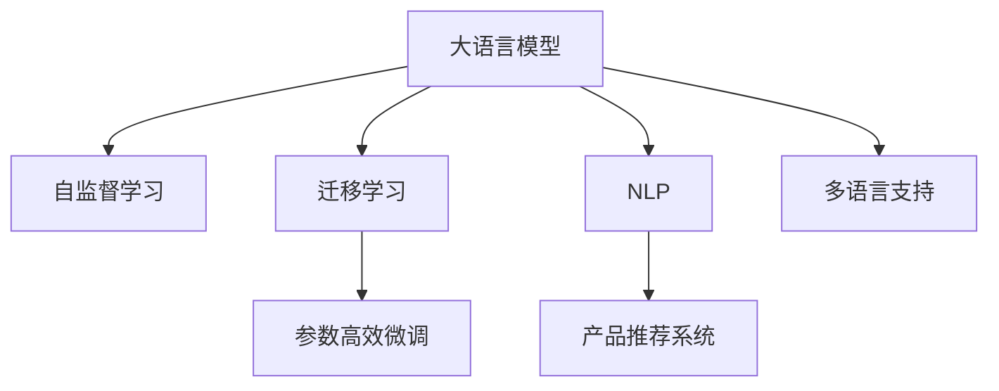

                 

# 电商搜索的多语言支持：AI大模型的新突破

> 关键词：多语言电商搜索,大语言模型,自监督学习,迁移学习,参数高效微调,自然语言处理(NLP),产品推荐系统

## 1. 背景介绍

在全球化背景下，电商平台必须支持多语言才能覆盖更广泛的消费者群体。传统的多语言搜索系统依赖于人工标注和特定领域专家构建，成本高、效率低，且随着语言和文化的多样性增加，扩展性较差。近年来，得益于深度学习技术的飞速进步，大语言模型为电商搜索的多语言支持提供了新的解决方案。本文聚焦于AI大模型在电商搜索中的应用，探讨如何利用大语言模型进行多语言搜索系统的构建，以及实现高效、准确的搜索结果。

## 2. 核心概念与联系

### 2.1 核心概念概述

为更好地理解大语言模型在电商搜索中的应用，本节将介绍几个关键概念：

- 大语言模型(Large Language Model, LLM)：以自回归(如GPT)或自编码(如BERT)模型为代表的大规模预训练语言模型。通过在大规模无标签文本语料上进行预训练，学习通用的语言表示，具备强大的语言理解和生成能力。

- 自监督学习(Self-Supervised Learning)：利用文本自身的结构信息(如掩码语言模型)进行无监督学习，不需要大量标注数据。自监督学习是大语言模型预训练的核心方法。

- 迁移学习(Transfer Learning)：指将一个领域学习到的知识，迁移应用到另一个不同但相关的领域的学习范式。大语言模型的预训练-微调过程即是一种典型的迁移学习方式。

- 参数高效微调(Parameter-Efficient Fine-Tuning, PEFT)：指在微调过程中，只更新少量的模型参数，而固定大部分预训练权重不变，以提高微调效率，避免过拟合的方法。

- 自然语言处理(Natural Language Processing, NLP)：旨在使计算机能够理解、处理和生成人类语言的技术。电商搜索系统基于NLP技术，实现文本输入和输出，对用户搜索行为进行分析和理解。

- 产品推荐系统(Product Recommendation System)：利用机器学习算法，根据用户行为数据推荐商品的技术。电商搜索系统与推荐系统紧密结合，以提升用户购物体验和平台转化率。

- 多语言支持：指能够支持多种语言输入和输出的系统。电商搜索系统在多语言场景下，需要能够理解不同语言用户的行为和需求，提供准确的搜索结果。

这些核心概念之间的逻辑关系可以通过以下Mermaid流程图来展示：



这个流程图展示了大语言模型的核心概念及其之间的关系：

1. 大语言模型通过自监督学习获得基础能力。
2. 通过迁移学习，将通用大模型适配到电商搜索等特定任务。
3. 利用参数高效微调技术，在不增加模型参数量的情况下，快速提升电商搜索效果。
4. NLP技术使得电商搜索系统能够理解自然语言输入，提取关键信息。
5. 结合推荐系统，实现精准商品推荐，提升用户体验。
6. 多语言支持使得电商搜索系统能够覆盖全球消费者，推动业务国际化发展。

## 3. 核心算法原理 & 具体操作步骤

### 3.1 算法原理概述

大语言模型在电商搜索中的应用，主要基于预训练-微调流程。假设一个通用语言模型 $M_{\theta}$ 在大规模无标签数据上进行了自监督学习。为了在电商搜索领域中应用，我们需要在少量有标签数据上进行微调。微调的目标是：在电商搜索任务上，找到最优的参数 $\hat{\theta}$，使得模型能够理解不同语言的查询，并返回最相关的商品信息。

具体而言，我们希望模型能够满足以下条件：
1. 理解多种语言：模型能够理解用户输入的不同语言，并将其映射为统一的内部表示。
2. 生成推荐结果：模型能够根据用户查询，输出最相关的商品推荐列表。
3. 跨语言迁移：模型在不同语言之间具备良好的迁移能力，即在新的语言数据上，仍能保持较好的性能。

### 3.2 算法步骤详解

基于大语言模型的电商搜索多语言支持，一般包括以下几个关键步骤：

**Step 1: 准备预训练模型和数据集**
- 选择合适的预训练语言模型 $M_{\theta}$ 作为初始化参数，如 BERT、GPT等。
- 准备电商搜索任务的多语言标注数据集 $D=\{(x_i, y_i)\}_{i=1}^N$，其中 $x_i$ 为多语言查询，$y_i$ 为商品ID或标题，$y$ 的数据标注可以基于电商平台已有的商品数据或人工标注。

**Step 2: 添加任务适配层**
- 根据电商搜索任务，设计合适的任务适配层。对于多语言搜索，通常需要在顶层添加一个多语言编码器和一个多语言解码器，用于编码输入文本和解码推荐结果。
- 对于分类任务，通常使用多分类交叉熵损失函数。
- 对于生成任务，通常使用负对数似然作为损失函数。

**Step 3: 设置微调超参数**
- 选择合适的优化算法及其参数，如 AdamW、SGD 等，设置学习率、批大小、迭代轮数等。
- 设置正则化技术及强度，包括权重衰减、Dropout、Early Stopping等。
- 确定冻结预训练参数的策略，如仅微调顶层，或全部参数都参与微调。

**Step 4: 执行梯度训练**
- 将多语言训练集数据分批次输入模型，前向传播计算损失函数。
- 反向传播计算参数梯度，根据设定的优化算法和学习率更新模型参数。
- 周期性在验证集上评估模型性能，根据性能指标决定是否触发 Early Stopping。
- 重复上述步骤直到满足预设的迭代轮数或 Early Stopping 条件。

**Step 5: 测试和部署**
- 在测试集上评估微调后模型 $M_{\hat{\theta}}$ 的性能，对比微调前后的精度提升。
- 使用微调后的模型对新样本进行推理预测，集成到实际的多语言搜索系统中。
- 持续收集新的多语言数据，定期重新微调模型，以适应数据分布的变化。

以上是基于大语言模型的电商搜索多语言支持的一般流程。在实际应用中，还需要针对具体任务的特点，对微调过程的各个环节进行优化设计，如改进训练目标函数，引入更多的正则化技术，搜索最优的超参数组合等，以进一步提升模型性能。

### 3.3 算法优缺点

基于大语言模型的电商搜索多语言支持方法具有以下优点：
1. 简单高效。只需准备少量标注数据，即可对预训练模型进行快速适配，获得较大的性能提升。
2. 通用适用。适用于多种电商搜索场景，设计简单的任务适配层即可实现多语言搜索。
3. 参数高效。利用参数高效微调技术，在固定大部分预训练参数的情况下，仍可取得不错的提升。
4. 效果显著。在学术界和工业界的电商搜索任务上，基于微调的方法已经刷新了最先进的性能指标。

同时，该方法也存在一定的局限性：
1. 依赖标注数据。微调的效果很大程度上取决于标注数据的质量和数量，获取高质量标注数据的成本较高。
2. 迁移能力有限。当目标语言与预训练数据的分布差异较大时，微调的性能提升有限。
3. 负面效果传递。预训练模型的固有偏见、有害信息等，可能通过微调传递到下游任务，造成负面影响。
4. 可解释性不足。微调模型的决策过程通常缺乏可解释性，难以对其推理逻辑进行分析和调试。

尽管存在这些局限性，但就目前而言，基于大语言模型的多语言搜索方法仍是大规模语言模型应用的重要范式。未来相关研究的重点在于如何进一步降低微调对标注数据的依赖，提高模型的少样本学习和跨语言迁移能力，同时兼顾可解释性和伦理安全性等因素。

### 3.4 算法应用领域

基于大语言模型的多语言电商搜索方法，在多个电商领域得到了广泛应用，包括：

- 多语言商品搜索：根据用户多语言输入，返回最相关的商品列表。
- 多语言商品描述匹配：自动匹配多语言商品描述与查询的相似度，提高搜索准确性。
- 多语言产品推荐：根据用户的多语言行为，推荐多语言商品。
- 多语言客服查询：自动理解用户的多语言问题，并提供多语言回复。
- 多语言用户评论分析：自动分析用户的多语言评论，提取商品质量和用户满意度。

除了上述这些经典任务外，大语言模型在多语言电商领域的应用也在不断拓展，如多语言广告投放、多语言内容推荐、多语言个性化推荐等，为电商搜索带来了全新的突破。随着预训练模型和微调方法的不断进步，相信基于大语言模型的多语言电商搜索技术将在更广阔的应用领域大放异彩。

## 4. 数学模型和公式 & 详细讲解

### 4.1 数学模型构建

本节将使用数学语言对基于大语言模型的电商搜索多语言支持过程进行更加严格的刻画。

假设预训练语言模型为 $M_{\theta}$，我们希望构建一个多语言电商搜索系统，使得模型能够对多语言输入进行编码，并输出商品ID或标题。假设多语言查询为 $x_i \in \mathcal{L}$，其中 $\mathcal{L}$ 为支持的多语言集合，商品ID或标题为 $y_i \in \mathcal{Y}$，其中 $\mathcal{Y}$ 为商品ID或标题的集合。

定义模型 $M_{\theta}$ 在输入 $x_i$ 上的输出为 $\hat{y}=M_{\theta}(x_i) \in \mathcal{Y}$，表示模型预测的商品ID或标题。定义损失函数 $\ell(M_{\theta}(x_i),y_i)$ 为模型预测结果与真实标签之间的差异。则在多语言训练集 $D=\{(x_i, y_i)\}_{i=1}^N$ 上的经验风险为：

$$
\mathcal{L}(\theta) = \frac{1}{N}\sum_{i=1}^N \ell(M_{\theta}(x_i),y_i)
$$

微调的优化目标是最小化经验风险，即找到最优参数：

$$
\theta^* = \mathop{\arg\min}_{\theta} \mathcal{L}(\theta)
$$

在实践中，我们通常使用基于梯度的优化算法（如SGD、Adam等）来近似求解上述最优化问题。设 $\eta$ 为学习率，$\lambda$ 为正则化系数，则参数的更新公式为：

$$
\theta \leftarrow \theta - \eta \nabla_{\theta}\mathcal{L}(\theta) - \eta\lambda\theta
$$

其中 $\nabla_{\theta}\mathcal{L}(\theta)$ 为损失函数对参数 $\theta$ 的梯度，可通过反向传播算法高效计算。

### 4.2 公式推导过程

以下我们以多语言分类任务为例，推导交叉熵损失函数及其梯度的计算公式。

假设模型 $M_{\theta}$ 在输入 $x_i$ 上的输出为 $\hat{y}=M_{\theta}(x_i) \in [0,1]$，表示商品ID或标题属于每个类别的概率。真实标签 $y_i \in \{0,1\}$。则多语言分类交叉熵损失函数定义为：

$$
\ell(M_{\theta}(x_i),y_i) = -[y_i\log \hat{y} + (1-y_i)\log (1-\hat{y})]
$$

将其代入经验风险公式，得：

$$
\mathcal{L}(\theta) = -\frac{1}{N}\sum_{i=1}^N [y_i\log M_{\theta}(x_i)+(1-y_i)\log(1-M_{\theta}(x_i))]
$$

根据链式法则，损失函数对参数 $\theta_k$ 的梯度为：

$$
\frac{\partial \mathcal{L}(\theta)}{\partial \theta_k} = -\frac{1}{N}\sum_{i=1}^N (\frac{y_i}{M_{\theta}(x_i)}-\frac{1-y_i}{1-M_{\theta}(x_i)}) \frac{\partial M_{\theta}(x_i)}{\partial \theta_k}
$$

其中 $\frac{\partial M_{\theta}(x_i)}{\partial \theta_k}$ 可进一步递归展开，利用自动微分技术完成计算。

在得到损失函数的梯度后，即可带入参数更新公式，完成模型的迭代优化。重复上述过程直至收敛，最终得到适应多语言电商搜索的最优模型参数 $\theta^*$。

## 5. 项目实践：代码实例和详细解释说明

### 5.1 开发环境搭建

在进行电商搜索多语言支持实践前，我们需要准备好开发环境。以下是使用Python进行PyTorch开发的环境配置流程：

1. 安装Anaconda：从官网下载并安装Anaconda，用于创建独立的Python环境。

2. 创建并激活虚拟环境：
```bash
conda create -n pytorch-env python=3.8 
conda activate pytorch-env
```

3. 安装PyTorch：根据CUDA版本，从官网获取对应的安装命令。例如：
```bash
conda install pytorch torchvision torchaudio cudatoolkit=11.1 -c pytorch -c conda-forge
```

4. 安装Transformers库：
```bash
pip install transformers
```

5. 安装各类工具包：
```bash
pip install numpy pandas scikit-learn matplotlib tqdm jupyter notebook ipython
```

完成上述步骤后，即可在`pytorch-env`环境中开始电商搜索多语言支持实践。

### 5.2 源代码详细实现

下面我们以电商搜索分类任务为例，给出使用Transformers库对BERT模型进行多语言电商搜索系统构建的PyTorch代码实现。

首先，定义多语言电商搜索任务的数据处理函数：

```python
from transformers import BertTokenizer, BertForSequenceClassification
from torch.utils.data import Dataset
import torch

class MultiLanguageSearchDataset(Dataset):
    def __init__(self, texts, labels, tokenizer, max_len=128):
        self.texts = texts
        self.labels = labels
        self.tokenizer = tokenizer
        self.max_len = max_len
        
    def __len__(self):
        return len(self.texts)
    
    def __getitem__(self, item):
        text = self.texts[item]
        label = self.labels[item]
        
        encoding = self.tokenizer(text, return_tensors='pt', max_length=self.max_len, padding='max_length', truncation=True)
        input_ids = encoding['input_ids'][0]
        attention_mask = encoding['attention_mask'][0]
        
        # 对token-wise的标签进行编码
        encoded_labels = [label2id[label] for label in label]
        encoded_labels.extend([label2id['O']] * (self.max_len - len(encoded_labels)))
        labels = torch.tensor(encoded_labels, dtype=torch.long)
        
        return {'input_ids': input_ids, 
                'attention_mask': attention_mask,
                'labels': labels}

# 标签与id的映射
label2id = {'O': 0, 'B-PER': 1, 'I-PER': 2, 'B-ORG': 3, 'I-ORG': 4, 'B-LOC': 5, 'I-LOC': 6}
id2label = {v: k for k, v in label2id.items()}

# 创建dataset
tokenizer = BertTokenizer.from_pretrained('bert-base-cased')

train_dataset = MultiLanguageSearchDataset(train_texts, train_labels, tokenizer)
dev_dataset = MultiLanguageSearchDataset(dev_texts, dev_labels, tokenizer)
test_dataset = MultiLanguageSearchDataset(test_texts, test_labels, tokenizer)
```

然后，定义模型和优化器：

```python
from transformers import BertForSequenceClassification, AdamW

model = BertForSequenceClassification.from_pretrained('bert-base-cased', num_labels=len(label2id))

optimizer = AdamW(model.parameters(), lr=2e-5)
```

接着，定义训练和评估函数：

```python
from torch.utils.data import DataLoader
from tqdm import tqdm
from sklearn.metrics import classification_report

device = torch.device('cuda') if torch.cuda.is_available() else torch.device('cpu')
model.to(device)

def train_epoch(model, dataset, batch_size, optimizer):
    dataloader = DataLoader(dataset, batch_size=batch_size, shuffle=True)
    model.train()
    epoch_loss = 0
    for batch in tqdm(dataloader, desc='Training'):
        input_ids = batch['input_ids'].to(device)
        attention_mask = batch['attention_mask'].to(device)
        labels = batch['labels'].to(device)
        model.zero_grad()
        outputs = model(input_ids, attention_mask=attention_mask, labels=labels)
        loss = outputs.loss
        epoch_loss += loss.item()
        loss.backward()
        optimizer.step()
    return epoch_loss / len(dataloader)

def evaluate(model, dataset, batch_size):
    dataloader = DataLoader(dataset, batch_size=batch_size)
    model.eval()
    preds, labels = [], []
    with torch.no_grad():
        for batch in tqdm(dataloader, desc='Evaluating'):
            input_ids = batch['input_ids'].to(device)
            attention_mask = batch['attention_mask'].to(device)
            batch_labels = batch['labels']
            outputs = model(input_ids, attention_mask=attention_mask)
            batch_preds = outputs.logits.argmax(dim=2).to('cpu').tolist()
            batch_labels = batch_labels.to('cpu').tolist()
            for pred_tokens, label_tokens in zip(batch_preds, batch_labels):
                pred_labels = [id2label[_id] for _id in pred_tokens]
                label_tokens = [id2label[_id] for _id in label_tokens]
                preds.append(pred_labels[:len(label_tokens)])
                labels.append(label_tokens)
                
    print(classification_report(labels, preds))
```

最后，启动训练流程并在测试集上评估：

```python
epochs = 5
batch_size = 16

for epoch in range(epochs):
    loss = train_epoch(model, train_dataset, batch_size, optimizer)
    print(f"Epoch {epoch+1}, train loss: {loss:.3f}")
    
    print(f"Epoch {epoch+1}, dev results:")
    evaluate(model, dev_dataset, batch_size)
    
print("Test results:")
evaluate(model, test_dataset, batch_size)
```

以上就是使用PyTorch对BERT模型进行电商搜索多语言支持系统的完整代码实现。可以看到，得益于Transformers库的强大封装，我们可以用相对简洁的代码完成BERT模型的加载和微调。

### 5.3 代码解读与分析

让我们再详细解读一下关键代码的实现细节：

**MultiLanguageSearchDataset类**：
- `__init__`方法：初始化文本、标签、分词器等关键组件。
- `__len__`方法：返回数据集的样本数量。
- `__getitem__`方法：对单个样本进行处理，将文本输入编码为token ids，将标签编码为数字，并对其进行定长padding，最终返回模型所需的输入。

**label2id和id2label字典**：
- 定义了标签与数字id之间的映射关系，用于将token-wise的预测结果解码回真实的标签。

**训练和评估函数**：
- 使用PyTorch的DataLoader对数据集进行批次化加载，供模型训练和推理使用。
- 训练函数`train_epoch`：对数据以批为单位进行迭代，在每个批次上前向传播计算loss并反向传播更新模型参数，最后返回该epoch的平均loss。
- 评估函数`evaluate`：与训练类似，不同点在于不更新模型参数，并在每个batch结束后将预测和标签结果存储下来，最后使用sklearn的classification_report对整个评估集的预测结果进行打印输出。

**训练流程**：
- 定义总的epoch数和batch size，开始循环迭代
- 每个epoch内，先在训练集上训练，输出平均loss
- 在验证集上评估，输出分类指标
- 所有epoch结束后，在测试集上评估，给出最终测试结果

可以看到，PyTorch配合Transformers库使得BERT微调的代码实现变得简洁高效。开发者可以将更多精力放在数据处理、模型改进等高层逻辑上，而不必过多关注底层的实现细节。

当然，工业级的系统实现还需考虑更多因素，如模型的保存和部署、超参数的自动搜索、更灵活的任务适配层等。但核心的微调范式基本与此类似。

## 6. 实际应用场景
### 6.1 多语言商品搜索

基于大语言模型微调的电商搜索系统，可以广泛应用于多语言商品搜索。用户可以在不同语言环境下进行搜索，获取商品列表。

在技术实现上，可以收集电商平台内部的多语言查询和商品数据，将查询和商品ID作为训练数据。在此基础上对预训练语言模型进行微调，使其能够理解不同语言的查询，并返回最相关的商品列表。微调后的模型可以嵌入电商平台，实时响应用户的查询请求，提供多语言商品搜索结果。

### 6.2 多语言商品描述匹配

电商搜索系统不仅需要理解用户查询，还需要匹配商品描述与查询的相似度。基于大语言模型微调，可以在多语言环境下实现商品描述与查询的自动匹配，提高搜索准确性。

具体而言，可以收集电商平台的多语言商品描述和查询数据，将描述和查询作为训练数据。在此基础上对预训练语言模型进行微调，使其能够自动匹配描述与查询的相似度。微调后的模型可以嵌入搜索系统，实时匹配用户查询与商品描述，提高搜索结果的相关性。

### 6.3 多语言产品推荐

电商平台在用户搜索后，通常会推荐相关的产品。基于大语言模型微调，可以实现多语言环境下产品推荐系统。

具体而言，可以收集用户的多语言行为数据，包括浏览、点击、购买等行为。在此基础上对预训练语言模型进行微调，使其能够理解用户的兴趣点。微调后的模型可以嵌入推荐系统，根据用户的多语言行为，推荐多语言商品。

### 6.4 多语言客服查询

电商平台的多语言客服系统，可以帮助用户解决购物中的问题。基于大语言模型微调，可以实现多语言客服查询系统。

具体而言，可以收集用户的多语言问题，将问题作为训练数据。在此基础上对预训练语言模型进行微调，使其能够自动理解用户的多语言问题。微调后的模型可以嵌入客服系统，实时响应用户的多语言查询，提供多语言回复。

### 6.5 多语言用户评论分析

电商平台需要对用户的多语言评论进行分析和理解。基于大语言模型微调，可以实现多语言评论分析系统。

具体而言，可以收集用户的多语言评论数据，将评论作为训练数据。在此基础上对预训练语言模型进行微调，使其能够自动分析评论的情感倾向和质量。微调后的模型可以嵌入评论分析系统，提取用户的多语言评论信息，帮助电商平台提升服务质量和用户满意度。

### 6.6 未来应用展望

随着大语言模型和微调方法的不断发展，基于大语言模型的多语言电商搜索技术将在更多领域得到应用，为电商搜索带来全新的突破。

在智慧零售领域，基于大语言模型的多语言电商搜索技术可以帮助零售商更精准地理解不同语言市场的需求，提升用户体验和购物转化率。

在智能家居领域，多语言电商搜索系统可以结合语音助手，实现语音查询和语音控制，进一步提升用户使用体验。

在跨境电商领域，多语言电商搜索技术可以帮助企业在多语言市场环境下，更好地覆盖全球消费者，推动业务国际化发展。

此外，在旅游、金融、医疗等众多领域，基于大语言模型的多语言电商搜索技术也将不断涌现，为各行业数字化转型提供新的技术路径。相信随着技术的日益成熟，基于大语言模型的多语言电商搜索技术必将在更广阔的应用领域大放异彩，深刻影响人类的生产生活方式。

## 7. 工具和资源推荐
### 7.1 学习资源推荐

为了帮助开发者系统掌握大语言模型在电商搜索中的应用，这里推荐一些优质的学习资源：

1. 《Transformer from Principles to Practice》系列博文：由大模型技术专家撰写，深入浅出地介绍了Transformer原理、BERT模型、多语言电商搜索等前沿话题。

2. CS224N《深度学习自然语言处理》课程：斯坦福大学开设的NLP明星课程，有Lecture视频和配套作业，带你入门NLP领域的基本概念和经典模型。

3. 《Natural Language Processing with Transformers》书籍：Transformers库的作者所著，全面介绍了如何使用Transformers库进行NLP任务开发，包括多语言电商搜索在内的诸多范式。

4. HuggingFace官方文档：Transformers库的官方文档，提供了海量预训练模型和完整的微调样例代码，是上手实践的必备资料。

5. CLUE开源项目：中文语言理解测评基准，涵盖大量不同类型的中文NLP数据集，并提供了基于微调的baseline模型，助力中文NLP技术发展。

通过对这些资源的学习实践，相信你一定能够快速掌握大语言模型在电商搜索中的应用，并用于解决实际的电商搜索问题。
###  7.2 开发工具推荐

高效的开发离不开优秀的工具支持。以下是几款用于电商搜索多语言支持开发的常用工具：

1. PyTorch：基于Python的开源深度学习框架，灵活动态的计算图，适合快速迭代研究。大部分预训练语言模型都有PyTorch版本的实现。

2. TensorFlow：由Google主导开发的开源深度学习框架，生产部署方便，适合大规模工程应用。同样有丰富的预训练语言模型资源。

3. Transformers库：HuggingFace开发的NLP工具库，集成了众多SOTA语言模型，支持PyTorch和TensorFlow，是进行多语言电商搜索开发的利器。

4. Weights & Biases：模型训练的实验跟踪工具，可以记录和可视化模型训练过程中的各项指标，方便对比和调优。与主流深度学习框架无缝集成。

5. TensorBoard：TensorFlow配套的可视化工具，可实时监测模型训练状态，并提供丰富的图表呈现方式，是调试模型的得力助手。

6. Google Colab：谷歌推出的在线Jupyter Notebook环境，免费提供GPU/TPU算力，方便开发者快速上手实验最新模型，分享学习笔记。

合理利用这些工具，可以显著提升电商搜索多语言支持任务的开发效率，加快创新迭代的步伐。

### 7.3 相关论文推荐

大语言模型和电商搜索多语言支持的发展源于学界的持续研究。以下是几篇奠基性的相关论文，推荐阅读：

1. Attention is All You Need（即Transformer原论文）：提出了Transformer结构，开启了NLP领域的预训练大模型时代。

2. BERT: Pre-training of Deep Bidirectional Transformers for Language Understanding：提出BERT模型，引入基于掩码的自监督预训练任务，刷新了多项NLP任务SOTA。

3. Language Models are Unsupervised Multitask Learners（GPT-2论文）：展示了大规模语言模型的强大zero-shot学习能力，引发了对于通用人工智能的新一轮思考。

4. Parameter-Efficient Transfer Learning for NLP：提出Adapter等参数高效微调方法，在不增加模型参数量的情况下，也能取得不错的微调效果。

5. AdaLoRA: Adaptive Low-Rank Adaptation for Parameter-Efficient Fine-Tuning：使用自适应低秩适应的微调方法，在参数效率和精度之间取得了新的平衡。

6. Transfer Learning with No Natural Language Training Data：提出使用大规模无标签语言数据进行迁移学习，以提升多语言任务性能。

这些论文代表了大语言模型在电商搜索多语言支持技术的发展脉络。通过学习这些前沿成果，可以帮助研究者把握学科前进方向，激发更多的创新灵感。

## 8. 总结：未来发展趋势与挑战

### 8.1 总结

本文对基于大语言模型的电商搜索多语言支持方法进行了全面系统的介绍。首先阐述了电商搜索多语言支持的背景和意义，明确了基于大语言模型进行微调的基本范式。其次，从原理到实践，详细讲解了基于大语言模型的电商搜索多语言支持的数学原理和关键步骤，给出了电商搜索多语言支持系统的完整代码实例。同时，本文还探讨了电商搜索多语言支持技术在多个电商领域的应用前景，展示了其广阔的发展潜力。

通过本文的系统梳理，可以看到，基于大语言模型的电商搜索多语言支持技术正在成为电商搜索领域的重要范式，极大地拓展了电商搜索系统的应用边界，催生了更多的落地场景。受益于大规模语料的预训练，电商搜索系统以更低的时间和标注成本，在小样本条件下也能取得理想的性能提升，为电商搜索系统带来了全新的突破。未来，伴随大语言模型和微调方法的不断进步，基于大语言模型的电商搜索多语言支持技术必将在更广阔的应用领域大放异彩，深刻影响人类的生产生活方式。

### 8.2 未来发展趋势

展望未来，基于大语言模型的电商搜索多语言支持技术将呈现以下几个发展趋势：

1. 模型规模持续增大。随着算力成本的下降和数据规模的扩张，预训练语言模型的参数量还将持续增长。超大规模语言模型蕴含的丰富语言知识，有望支撑更加复杂多变的电商搜索任务。

2. 微调方法日趋多样。除了传统的全参数微调外，未来会涌现更多参数高效的微调方法，如Prefix-Tuning、LoRA等，在节省计算资源的同时也能保证电商搜索性能。

3. 持续学习成为常态。随着数据分布的不断变化，电商搜索模型也需要持续学习新知识以保持性能。如何在不遗忘原有知识的同时，高效吸收新样本信息，将成为重要的研究课题。

4. 标注样本需求降低。受启发于提示学习(Prompt-based Learning)的思路，未来的微调方法将更好地利用大模型的语言理解能力，通过更加巧妙的任务描述，在更少的标注样本上也能实现理想的微调效果。

5. 模型通用性增强。经过海量数据的预训练和多领域任务的微调，未来的电商搜索模型将具备更强大的常识推理和跨领域迁移能力，逐步迈向通用人工智能(AGI)的目标。

6. 多模态电商搜索崛起。当前的电商搜索主要聚焦于文本数据，未来会进一步拓展到图像、视频、语音等多模态数据微调。多模态信息的融合，将显著提升电商搜索系统对现实世界的理解和建模能力。

以上趋势凸显了大语言模型在电商搜索多语言支持技术的应用前景。这些方向的探索发展，必将进一步提升电商搜索系统的性能和应用范围，为电商搜索系统带来新的业务价值。

### 8.3 面临的挑战

尽管基于大语言模型的电商搜索多语言支持技术已经取得了瞩目成就，但在迈向更加智能化、普适化应用的过程中，它仍面临着诸多挑战：

1. 标注成本瓶颈。尽管电商搜索多语言支持的微调方法可以大幅度降低对标注数据的依赖，但对于长尾语言，标注数据仍然难以获取，成为制约微调性能的瓶颈。如何进一步降低微调对标注样本的依赖，将是一大难题。

2. 模型鲁棒性不足。电商搜索多语言支持的模型面对未知语言时，泛化性能往往大打折扣。如何提高模型在不同语言环境下的鲁棒性，避免在少样本情况下表现不佳，还需要更多理论和实践的积累。

3. 推理效率有待提高。大规模语言模型虽然精度高，但在实际部署时往往面临推理速度慢、内存占用大等效率问题。如何在保证性能的同时，简化模型结构，提升推理速度，优化资源占用，将是重要的优化方向。

4. 可解释性亟需加强。电商搜索多语言支持的微调模型通常缺乏可解释性，难以解释其内部工作机制和决策逻辑。如何赋予微调模型更强的可解释性，将是亟待攻克的难题。

5. 安全性有待保障。电商搜索多语言支持的模型面临被恶意利用进行假冒交易等安全威胁。如何从数据和算法层面消除模型偏见，避免恶意用途，确保输出的安全性，也将是重要的研究课题。

6. 知识整合能力不足。现有的电商搜索多语言支持模型往往局限于任务内数据，难以灵活吸收和运用更广泛的先验知识。如何让微调过程更好地与外部知识库、规则库等专家知识结合，形成更加全面、准确的信息整合能力，还有很大的想象空间。

正视电商搜索多语言支持所面临的这些挑战，积极应对并寻求突破，将是大语言模型在电商搜索领域的应用突破的关键。相信随着学界和产业界的共同努力，这些挑战终将一一被克服，大语言模型在电商搜索多语言支持技术必将在构建人机协同的智能电商时代中扮演越来越重要的角色。

### 8.4 研究展望

面对电商搜索多语言支持所面临的种种挑战，未来的研究需要在以下几个方面寻求新的突破：

1. 探索无监督和半监督电商搜索多语言支持方法。摆脱对大规模标注数据的依赖，利用自监督学习、主动学习等无监督和半监督范式，最大限度利用非结构化数据，实现更加灵活高效的电商搜索多语言支持。

2. 研究参数高效和计算高效的电商搜索多语言支持范式。开发更加参数高效的微调方法，在固定大部分预训练参数的同时，只更新极少量的任务相关参数。同时优化电商搜索模型的计算图，减少前向传播和反向传播的资源消耗，实现更加轻量级、实时性的部署。

3. 引入更多先验知识。将符号化的先验知识，如知识图谱、逻辑规则等，与神经网络模型进行巧妙融合，引导电商搜索多语言支持过程学习更准确、合理的语言模型。同时加强不同模态数据的整合，实现视觉、语音等多模态信息与文本信息的协同建模。

4. 结合因果分析和博弈论工具。将因果分析方法引入电商搜索多语言支持模型，识别出模型决策的关键特征，增强输出解释的因果性和逻辑性。借助博弈论工具刻画人机交互过程，主动探索并规避模型的脆弱点，提高系统稳定性。

5. 纳入伦理道德约束。在电商搜索多语言支持模型的训练目标中引入伦理导向的评估指标，过滤和惩罚有偏见、有害的输出倾向。同时加强人工干预和审核，建立模型行为的监管机制，确保输出符合人类价值观和伦理道德。

这些研究方向的探索，必将引领电商搜索多语言支持技术迈向更高的台阶，为构建安全、可靠、可解释、可控的智能电商系统铺平道路。面向未来，基于大语言模型的电商搜索多语言支持技术还需要与其他人工智能技术进行更深入的融合，如知识表示、因果推理、强化学习等，多路径协同发力，共同推动自然语言理解和智能交互系统的进步。只有勇于创新、敢于突破，才能不断拓展电商搜索多语言支持的边界，让智能技术更好地造福人类社会。

## 9. 附录：常见问题与解答

**Q1：大语言模型在电商搜索中应用的优势是什么？**

A: 大语言模型在电商搜索中的应用，主要优势体现在以下几个方面：
1. 快速适应多语言：通过预训练和微调，大语言模型可以迅速理解和处理不同语言的查询和商品描述，支持多语言搜索和推荐。
2. 提高搜索准确性：大语言模型能够理解自然语言语义，自动匹配查询与商品描述的相似度，提高搜索结果的相关性。
3. 支持个性化推荐：大语言模型可以分析用户的多语言行为，推荐个性化的商品，提升用户体验和转化率。
4. 降低标注成本：通过自动标注和少样本学习，大语言模型可以大幅度降低标注数据的需求，提升训练效率和效果。
5. 跨领域迁移能力：大语言模型在不同领域和任务上具备良好的迁移能力，可以灵活应用到电商搜索、客服、广告等不同场景。

**Q2：大语言模型在电商搜索中可能面临的挑战有哪些？**

A: 尽管大语言模型在电商搜索中表现出色，但仍面临以下挑战：
1. 标注数据获取困难：电商平台需获取大量高质量的多语言标注数据，但标注成本较高，且标注工作量巨大。
2. 模型鲁棒性不足：大语言模型在不同语言环境下可能表现不稳定，对少样本和未知语言的泛化能力不足。
3. 推理效率不高：大规模语言模型在推理时面临计算资源消耗大、速度慢等问题，影响实时搜索响应。
4. 可解释性缺乏：大语言模型的决策过程缺乏透明度，难以解释其内部工作机制和推理逻辑。
5. 安全性问题：大语言模型可能被恶意利用，进行假冒交易等行为，导致平台安全风险。
6. 知识整合能力不足：现有大语言模型往往局限于任务内数据，缺乏对外部知识库的灵活整合，难以全面理解复杂问题。

**Q3：如何提升电商搜索多语言支持的模型性能？**

A: 要提升电商搜索多语言支持的模型性能，可以从以下几个方面入手：
1. 数据增强：通过多语言翻译、回译、近义替换等方式，扩充训练数据，提高模型泛化能力。
2. 模型优化：采用自适应低秩适应、Adapter等参数高效微调方法，减少过拟合风险。
3. 正则化技术：使用L2正则、Dropout、Early Stopping等技术，防止模型过拟合。
4. 多语言模型架构：设计多语言编码器、解码器，提高模型的多语言适应能力。
5. 跨领域迁移学习：在大规模无标签数据上进行预训练，提高模型的跨领域迁移能力。

**Q4：电商搜索多语言支持系统如何实现？**

A: 电商搜索多语言支持系统的实现主要包括以下几个步骤：
1. 数据准备：收集电商平台的查询和商品数据，将其标注为多语言数据集。
2. 模型选择：选择合适的预训练语言模型，如BERT、GPT等，作为初始化参数。
3. 任务适配：设计任务适配层，将查询和商品ID转换为模型输入，并输出商品推荐结果。
4. 微调优化：使用AdamW等优化器，进行全参数微调或参数高效微调，更新模型参数。
5. 性能评估：在验证集和测试集上评估模型性能，调整超参数，优化模型。
6. 系统部署：将微调后的模型集成到电商搜索系统中，实时响应用户的多语言查询，提供商品推荐。

**Q5：未来电商搜索多语言支持技术的发展方向是什么？**

A: 未来电商搜索多语言支持技术的发展方向主要包括以下几个方面：
1. 模型规模化：随着计算资源的增加和数据规模的扩大，未来大语言模型的规模将进一步增大，模型参数量将大幅提升。
2. 微调方法多样化：除了传统的全参数微调，未来将涌现更多参数高效的微调方法，如LoRA、Prompt Tuning等，提升模型性能和效率。
3. 跨领域迁移能力增强：大语言模型在多个领域和任务上具备更强的迁移能力，能够适应更多应用场景。
4. 多模态支持：电商搜索系统将更多地融合图像、视频、语音等多模态信息，提升对现实世界的理解和建模能力。
5. 伦理和安全保障：在电商搜索多语言支持模型的训练目标中引入伦理导向的评估指标，建立模型行为监管机制，确保输出符合人类价值观和伦理道德。
6. 持续学习和在线优化：电商搜索多语言支持模型需要持续学习新知识，适应数据分布的变化，保持性能稳定。

通过这些方向的研究和实践，相信电商搜索多语言支持技术将不断提升，为电商搜索系统带来更多的创新和突破。

---

作者：禅与计算机程序设计艺术 / Zen and the Art of Computer Programming

