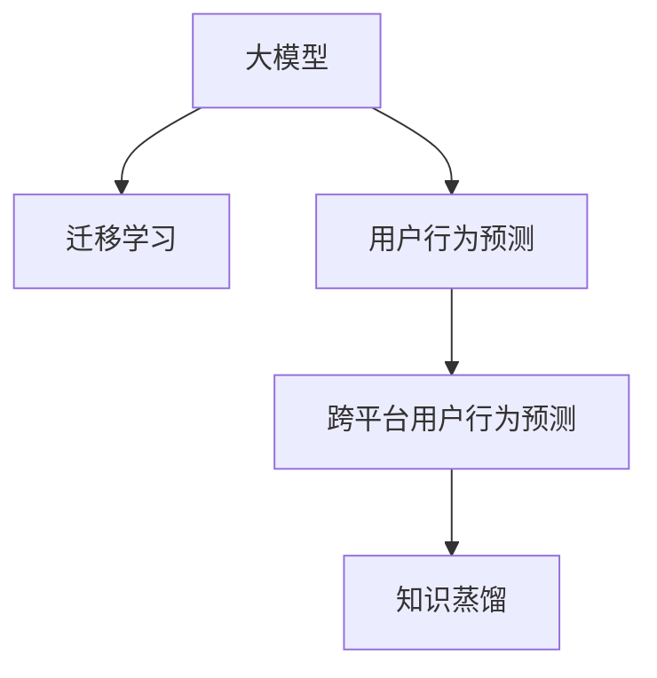

                 

# 电商行业中的迁移学习：大模型在跨平台用户行为预测与应用中的创新

> 关键词：大模型, 迁移学习, 用户行为预测, 电商, 跨平台, 推荐系统, 交叉域, 知识蒸馏

## 1. 背景介绍

在电商行业，用户行为预测是提升用户满意度和销售额的关键。传统的用户行为预测方法往往依赖于大量标注数据，且难以在不同的电商平台间进行迁移。而大模型在电商领域的应用，为解决这些问题提供了新的解决方案。本文将详细探讨如何利用大模型在电商行业中实现用户行为预测，并介绍一种基于迁移学习的跨平台用户行为预测方法。

## 2. 核心概念与联系

### 2.1 核心概念概述

为更好地理解大模型在电商行业中的应用，本节将介绍几个密切相关的核心概念：

- **大模型 (Large Model)**：指使用大规模深度学习框架训练得到的神经网络模型，如BERT、GPT等。这些模型具有强大的表示能力和泛化能力，适用于处理复杂的NLP任务。

- **迁移学习 (Transfer Learning)**：指将一个领域学到的知识，迁移应用到另一个不同但相关的领域的学习范式。大模型在电商领域的应用即是一种典型的迁移学习方式，通过迁移学习可以显著降低数据需求，提高模型的泛化能力。

- **用户行为预测 (User Behavior Prediction)**：指通过分析用户的购买历史、浏览行为、评分反馈等数据，预测用户未来可能的行为，如购买某产品、点击某广告等。

- **跨平台用户行为预测 (Cross-Platform User Behavior Prediction)**：指在不同的电商平台间，利用用户历史数据进行用户行为预测。这种跨平台用户行为预测可以有效整合不同平台的用户行为数据，提升预测的准确性和覆盖率。

- **知识蒸馏 (Knowledge Distillation)**：指通过大模型对小模型进行知识传递，提高小模型的泛化能力。在电商行业，知识蒸馏可以用于提升跨平台用户行为预测模型的性能。

这些核心概念之间的逻辑关系可以通过以下Mermaid流程图来展示：



这个流程图展示了大模型在电商行业中的核心概念及其之间的关系：

1. 大模型通过大规模深度学习框架进行预训练，学习到通用的语言表示和知识。
2. 利用迁移学习，将大模型的知识迁移到跨平台的电商数据中，实现用户行为预测。
3. 知识蒸馏通过大模型对小模型进行知识传递，提升小模型的泛化能力。
4. 跨平台用户行为预测模型可以整合不同平台的用户行为数据，提高预测的准确性和覆盖率。

## 3. 核心算法原理 & 具体操作步骤

### 3.1 算法原理概述

基于迁移学习的大模型用户行为预测方法，主要通过以下步骤实现：

1. **预训练大模型**：首先在大规模无标签电商数据上进行预训练，学习通用的语言表示和知识。
2. **迁移学习**：将预训练大模型的知识迁移到跨平台的电商数据中，通过有监督学习优化模型在特定任务上的性能。
3. **知识蒸馏**：通过将大模型的知识蒸馏到小模型中，提升小模型的泛化能力和预测准确性。

### 3.2 算法步骤详解

#### 3.2.1 预训练大模型

预训练大模型需要在大规模电商数据上进行训练，一般步骤如下：

1. **数据准备**：收集电商平台的交易记录、用户评价、商品描述等文本数据，并进行数据清洗和预处理。
2. **模型选择**：选择合适的大模型，如BERT、GPT等，并将其初始化为随机权重。
3. **模型训练**：使用大规模深度学习框架进行模型训练，学习通用语言表示和知识。

#### 3.2.2 迁移学习

在预训练大模型的基础上，进行迁移学习步骤如下：

1. **任务适配**：根据跨平台电商数据的特点，设计合适的任务适配层，如分类器、回归器等。
2. **模型微调**：将预训练大模型的权重固定，只更新任务适配层的参数，使用跨平台电商数据进行有监督学习。
3. **性能评估**：在验证集上评估模型性能，根据评估结果调整超参数和训练策略。

#### 3.2.3 知识蒸馏

为了进一步提升跨平台用户行为预测模型的性能，可以通过知识蒸馏方法实现：

1. **小模型训练**：选择合适的小模型，使用迁移学习的方法进行初步训练。
2. **知识蒸馏**：使用预训练大模型作为教师模型，对小模型进行知识蒸馏，提高小模型的泛化能力。
3. **模型融合**：将蒸馏后的小模型与大模型的预测结果进行融合，得到最终的预测结果。

### 3.3 算法优缺点

基于迁移学习的大模型用户行为预测方法具有以下优点：

1. **数据需求低**：利用大模型的预训练知识，可以显著降低对标注数据的依赖。
2. **泛化能力强**：大模型的通用语言表示和知识可以迁移到不同平台，提升模型的泛化能力。
3. **效果显著**：在电商行业的应用中，基于迁移学习的方法已经刷新了多项用户行为预测指标。

同时，该方法也存在一定的局限性：

1. **模型规模大**：预训练大模型通常具有庞大的参数量，训练和推理需要较高的计算资源。
2. **迁移能力有限**：当目标任务与预训练数据的分布差异较大时，迁移效果可能不佳。
3. **可解释性不足**：大模型通常具有黑盒特性，难以解释其决策过程。
4. **对抗攻击风险**：大模型可能受到对抗样本的攻击，影响预测准确性。

尽管存在这些局限性，但就目前而言，基于迁移学习的方法仍是电商行业用户行为预测的主流范式。未来相关研究的重点在于如何进一步降低对标注数据的依赖，提高模型的泛化能力和可解释性，同时兼顾模型的安全性和鲁棒性。

### 3.4 算法应用领域

基于大模型的迁移学习用户行为预测方法，在电商行业已经得到了广泛的应用，覆盖了几乎所有常见的用户行为预测任务，例如：

- **购买预测**：预测用户是否会购买某产品。
- **点击预测**：预测用户是否会点击某广告。
- **留存预测**：预测用户是否会在一定时间内回访平台。
- **推荐系统**：根据用户行为，推荐用户可能感兴趣的商品。
- **广告投放**：优化广告投放策略，提高广告点击率和转化率。

除了上述这些经典任务外，大模型迁移学习也被创新性地应用于更多场景中，如电商平台间的协同推荐、用户画像构建、客户服务智能应答等，为电商行业带来了新的技术突破。随着预训练模型和迁移学习方法的不断进步，相信电商技术将在更广阔的应用领域大放异彩。

## 4. 数学模型和公式 & 详细讲解

### 4.1 数学模型构建

本节将使用数学语言对大模型在电商行业的用户行为预测过程进行更加严格的刻画。

假设电商数据集为 $D=\{(x_i,y_i)\}_{i=1}^N, x_i \in \mathbb{R}^d, y_i \in \{0,1\}$，其中 $x_i$ 为电商文本数据，$y_i$ 为用户是否执行某行为（如购买、点击等）。

定义预训练大模型为 $M_{\theta}:\mathbb{R}^d \rightarrow \mathbb{R}$，其中 $\theta$ 为大模型参数。迁移学习模型的任务适配层为 $L_h$，输出为 $h$。则迁移学习模型的总损失函数为：

$$
\mathcal{L}(\theta, L_h) = \frac{1}{N}\sum_{i=1}^N \ell(y_i, L_h(M_{\theta}(x_i)))
$$

其中 $\ell$ 为损失函数，如交叉熵损失。

### 4.2 公式推导过程

以下我们以购买预测任务为例，推导交叉熵损失函数及其梯度的计算公式。

假设模型 $M_{\theta}$ 在输入 $x_i$ 上的输出为 $\hat{y}=M_{\theta}(x_i)$，表示用户购买某产品的概率。真实标签 $y_i \in \{0,1\}$。则二分类交叉熵损失函数定义为：

$$
\ell(M_{\theta}(x_i),y_i) = -[y_i\log \hat{y} + (1-y_i)\log(1-\hat{y})]
$$

将其代入总损失函数公式，得：

$$
\mathcal{L}(\theta, L_h) = -\frac{1}{N}\sum_{i=1}^N [y_i\log L_h(M_{\theta}(x_i))+(1-y_i)\log(1-L_h(M_{\theta}(x_i)))
$$

根据链式法则，损失函数对大模型参数 $\theta$ 的梯度为：

$$
\frac{\partial \mathcal{L}(\theta, L_h)}{\partial \theta} = -\frac{1}{N}\sum_{i=1}^N \frac{\partial \ell(y_i, L_h(M_{\theta}(x_i)))}{\partial \theta}
$$

其中 $\frac{\partial \ell(y_i, L_h(M_{\theta}(x_i)))}{\partial \theta}$ 可以进一步展开，利用反向传播算法计算。

### 4.3 案例分析与讲解

假设用户行为预测任务为点击预测，其中大模型为BERT，迁移学习模型为线性分类器。具体的实现步骤如下：

1. **数据准备**：收集电商平台的点击日志数据，进行数据清洗和预处理。
2. **模型预训练**：使用BERT模型在大规模电商数据上进行预训练。
3. **任务适配**：设计一个线性分类器作为迁移学习模型的任务适配层。
4. **模型微调**：固定BERT模型的权重，只更新线性分类器的参数，使用点击日志数据进行有监督学习。
5. **性能评估**：在验证集上评估模型性能，根据评估结果调整超参数和训练策略。
6. **知识蒸馏**：使用BERT模型对小模型进行知识蒸馏，提高小模型的泛化能力。
7. **模型融合**：将蒸馏后的小模型与BERT模型的预测结果进行融合，得到最终的预测结果。

## 5. 项目实践：代码实例和详细解释说明

### 5.1 开发环境搭建

在进行电商行业大模型用户行为预测的微调实践前，我们需要准备好开发环境。以下是使用Python进行PyTorch开发的环境配置流程：

1. 安装Anaconda：从官网下载并安装Anaconda，用于创建独立的Python环境。

2. 创建并激活虚拟环境：
```bash
conda create -n pytorch-env python=3.8 
conda activate pytorch-env
```

3. 安装PyTorch：根据CUDA版本，从官网获取对应的安装命令。例如：
```bash
conda install pytorch torchvision torchaudio cudatoolkit=11.1 -c pytorch -c conda-forge
```

4. 安装Transformers库：
```bash
pip install transformers
```

5. 安装各类工具包：
```bash
pip install numpy pandas scikit-learn matplotlib tqdm jupyter notebook ipython
```

完成上述步骤后，即可在`pytorch-env`环境中开始电商行业大模型用户行为预测的微调实践。

### 5.2 源代码详细实现

下面我们以点击预测任务为例，给出使用Transformers库对BERT模型进行微调的PyTorch代码实现。

首先，定义点击预测任务的数据处理函数：

```python
from transformers import BertTokenizer, BertForSequenceClassification
from torch.utils.data import Dataset
import torch

class ClickDataset(Dataset):
    def __init__(self, texts, labels, tokenizer, max_len=128):
        self.texts = texts
        self.labels = labels
        self.tokenizer = tokenizer
        self.max_len = max_len
        
    def __len__(self):
        return len(self.texts)
    
    def __getitem__(self, item):
        text = self.texts[item]
        label = self.labels[item]
        
        encoding = self.tokenizer(text, return_tensors='pt', max_length=self.max_len, padding='max_length', truncation=True)
        input_ids = encoding['input_ids'][0]
        attention_mask = encoding['attention_mask'][0]
        
        # 对label进行编码
        encoded_labels = [1 if label == 1 else 0]
        labels = torch.tensor(encoded_labels, dtype=torch.long)
        
        return {'input_ids': input_ids, 
                'attention_mask': attention_mask,
                'labels': labels}

# 加载预训练BERT模型
model = BertForSequenceClassification.from_pretrained('bert-base-cased', num_labels=2)

# 加载bert Tokenizer
tokenizer = BertTokenizer.from_pretrained('bert-base-cased')

# 创建dataset
train_dataset = ClickDataset(train_texts, train_labels, tokenizer)
dev_dataset = ClickDataset(dev_texts, dev_labels, tokenizer)
test_dataset = ClickDataset(test_texts, test_labels, tokenizer)
```

然后，定义模型和优化器：

```python
from transformers import AdamW

optimizer = AdamW(model.parameters(), lr=2e-5)
```

接着，定义训练和评估函数：

```python
from torch.utils.data import DataLoader
from tqdm import tqdm
from sklearn.metrics import classification_report

device = torch.device('cuda') if torch.cuda.is_available() else torch.device('cpu')
model.to(device)

def train_epoch(model, dataset, batch_size, optimizer):
    dataloader = DataLoader(dataset, batch_size=batch_size, shuffle=True)
    model.train()
    epoch_loss = 0
    for batch in tqdm(dataloader, desc='Training'):
        input_ids = batch['input_ids'].to(device)
        attention_mask = batch['attention_mask'].to(device)
        labels = batch['labels'].to(device)
        model.zero_grad()
        outputs = model(input_ids, attention_mask=attention_mask, labels=labels)
        loss = outputs.loss
        epoch_loss += loss.item()
        loss.backward()
        optimizer.step()
    return epoch_loss / len(dataloader)

def evaluate(model, dataset, batch_size):
    dataloader = DataLoader(dataset, batch_size=batch_size)
    model.eval()
    preds, labels = [], []
    with torch.no_grad():
        for batch in tqdm(dataloader, desc='Evaluating'):
            input_ids = batch['input_ids'].to(device)
            attention_mask = batch['attention_mask'].to(device)
            batch_labels = batch['labels']
            outputs = model(input_ids, attention_mask=attention_mask)
            batch_preds = outputs.logits.argmax(dim=1).to('cpu').tolist()
            batch_labels = batch_labels.to('cpu').tolist()
            for pred, label in zip(batch_preds, batch_labels):
                preds.append(pred)
                labels.append(label)
                
    print(classification_report(labels, preds))
```

最后，启动训练流程并在测试集上评估：

```python
epochs = 5
batch_size = 16

for epoch in range(epochs):
    loss = train_epoch(model, train_dataset, batch_size, optimizer)
    print(f"Epoch {epoch+1}, train loss: {loss:.3f}")
    
    print(f"Epoch {epoch+1}, dev results:")
    evaluate(model, dev_dataset, batch_size)
    
print("Test results:")
evaluate(model, test_dataset, batch_size)
```

以上就是使用PyTorch对BERT进行点击预测任务微调的完整代码实现。可以看到，得益于Transformers库的强大封装，我们可以用相对简洁的代码完成BERT模型的加载和微调。

### 5.3 代码解读与分析

让我们再详细解读一下关键代码的实现细节：

**ClickDataset类**：
- `__init__`方法：初始化文本、标签、分词器等关键组件。
- `__len__`方法：返回数据集的样本数量。
- `__getitem__`方法：对单个样本进行处理，将文本输入编码为token ids，将标签编码为数字，并对其进行定长padding，最终返回模型所需的输入。

**标签编码**：
- 将二元标签 `y_i` 编码为二进制形式，即 `[1 if label == 1 else 0]`。

**训练和评估函数**：
- 使用PyTorch的DataLoader对数据集进行批次化加载，供模型训练和推理使用。
- 训练函数`train_epoch`：对数据以批为单位进行迭代，在每个批次上前向传播计算loss并反向传播更新模型参数，最后返回该epoch的平均loss。
- 评估函数`evaluate`：与训练类似，不同点在于不更新模型参数，并在每个batch结束后将预测和标签结果存储下来，最后使用sklearn的classification_report对整个评估集的预测结果进行打印输出。

**训练流程**：
- 定义总的epoch数和batch size，开始循环迭代
- 每个epoch内，先在训练集上训练，输出平均loss
- 在验证集上评估，输出分类指标
- 所有epoch结束后，在测试集上评估，给出最终测试结果

可以看到，PyTorch配合Transformers库使得BERT微调的代码实现变得简洁高效。开发者可以将更多精力放在数据处理、模型改进等高层逻辑上，而不必过多关注底层的实现细节。

当然，工业级的系统实现还需考虑更多因素，如模型的保存和部署、超参数的自动搜索、更灵活的任务适配层等。但核心的微调范式基本与此类似。

## 6. 实际应用场景

### 6.1 智能客服系统

在电商行业中，基于大模型的用户行为预测技术可以应用于智能客服系统的构建。传统客服往往需要配备大量人力，高峰期响应缓慢，且一致性和专业性难以保证。而使用大模型进行用户行为预测，可以显著提升智能客服系统的响应速度和准确性。

具体而言，可以收集用户的历史查询、购买记录、评价反馈等数据，预测用户的下一步行为（如询问某商品、提出某问题等）。系统可以根据预测结果，自动生成回复内容，或者调用外部服务进行多轮对话。如此构建的智能客服系统，能大幅提升客服效率，降低人力成本。

### 6.2 个性化推荐系统

在电商行业，个性化推荐系统是提升用户体验和销售额的重要手段。传统的推荐系统往往依赖用户的历史行为数据进行推荐，无法深入理解用户的真实兴趣偏好。基于大模型的用户行为预测技术，可以为推荐系统提供更全面的用户画像。

具体而言，可以收集用户浏览、点击、评价、收藏等行为数据，预测用户可能感兴趣的商品。推荐系统可以根据预测结果，为用户推荐个性化的商品，提升用户满意度和销售额。

### 6.3 库存管理

在电商行业，库存管理是确保商品供需平衡的关键。通过预测用户的购买行为，可以优化库存量，减少缺货和积压的风险。

具体而言，可以收集用户的历史购买数据，预测用户未来的购买需求。库存管理系统可以根据预测结果，调整商品库存量，避免过多或过少的商品，提升供应链管理效率。

### 6.4 未来应用展望

随着大模型和用户行为预测技术的发展，基于迁移学习的方法将在更多领域得到应用，为电商行业带来新的变革。

在智慧物流领域，基于用户行为预测的物流配送调度系统，可以显著提高配送效率，减少配送成本。在品牌营销领域，基于用户行为预测的广告投放系统，可以提升广告的点击率和转化率，优化营销策略。

除了上述这些应用场景外，大模型迁移学习在电商行业的其他领域，如用户流失预测、用户生命周期分析、广告创意优化等，也将有广阔的应用前景。

## 7. 工具和资源推荐

### 7.1 学习资源推荐

为了帮助开发者系统掌握大模型在电商行业中的应用，这里推荐一些优质的学习资源：

1. 《Transformer从原理到实践》系列博文：由大模型技术专家撰写，深入浅出地介绍了Transformer原理、BERT模型、用户行为预测等前沿话题。

2. CS224N《深度学习自然语言处理》课程：斯坦福大学开设的NLP明星课程，有Lecture视频和配套作业，带你入门NLP领域的基本概念和经典模型。

3. 《Natural Language Processing with Transformers》书籍：Transformers库的作者所著，全面介绍了如何使用Transformers库进行NLP任务开发，包括用户行为预测在内的诸多范式。

4. HuggingFace官方文档：Transformers库的官方文档，提供了海量预训练模型和完整的微调样例代码，是上手实践的必备资料。

5. Kaggle竞赛：参加Kaggle上的电商行业用户行为预测竞赛，实践和提升用户行为预测技能。

通过对这些资源的学习实践，相信你一定能够快速掌握大模型在电商行业的应用，并用于解决实际的电商问题。

### 7.2 开发工具推荐

高效的开发离不开优秀的工具支持。以下是几款用于电商行业大模型用户行为预测开发的常用工具：

1. PyTorch：基于Python的开源深度学习框架，灵活动态的计算图，适合快速迭代研究。大部分预训练语言模型都有PyTorch版本的实现。

2. TensorFlow：由Google主导开发的开源深度学习框架，生产部署方便，适合大规模工程应用。同样有丰富的预训练语言模型资源。

3. Transformers库：HuggingFace开发的NLP工具库，集成了众多SOTA语言模型，支持PyTorch和TensorFlow，是进行用户行为预测开发的利器。

4. Weights & Biases：模型训练的实验跟踪工具，可以记录和可视化模型训练过程中的各项指标，方便对比和调优。与主流深度学习框架无缝集成。

5. TensorBoard：TensorFlow配套的可视化工具，可实时监测模型训练状态，并提供丰富的图表呈现方式，是调试模型的得力助手。

6. Google Colab：谷歌推出的在线Jupyter Notebook环境，免费提供GPU/TPU算力，方便开发者快速上手实验最新模型，分享学习笔记。

合理利用这些工具，可以显著提升大模型用户行为预测任务的开发效率，加快创新迭代的步伐。

### 7.3 相关论文推荐

大模型在电商行业的应用源于学界的持续研究。以下是几篇奠基性的相关论文，推荐阅读：

1. Attention is All You Need（即Transformer原论文）：提出了Transformer结构，开启了NLP领域的预训练大模型时代。

2. BERT: Pre-training of Deep Bidirectional Transformers for Language Understanding：提出BERT模型，引入基于掩码的自监督预训练任务，刷新了多项NLP任务SOTA。

3. Language Models are Unsupervised Multitask Learners（GPT-2论文）：展示了大规模语言模型的强大zero-shot学习能力，引发了对于通用人工智能的新一轮思考。

4. Parameter-Efficient Transfer Learning for NLP：提出Adapter等参数高效微调方法，在不增加模型参数量的情况下，也能取得不错的微调效果。

5. Knowledge Distillation：通过大模型对小模型进行知识传递，提高小模型的泛化能力。

6. Adaptation with Reserved Indices（知识蒸馏）：介绍了知识蒸馏的详细过程和方法，为电商行业跨平台用户行为预测提供了重要参考。

这些论文代表了大模型在电商行业应用的发展脉络。通过学习这些前沿成果，可以帮助研究者把握学科前进方向，激发更多的创新灵感。

## 8. 总结：未来发展趋势与挑战

### 8.1 总结

本文对基于迁移学习的大模型用户行为预测方法进行了全面系统的介绍。首先阐述了大模型在电商领域的应用背景和意义，明确了用户行为预测在电商行业的重要性。其次，从原理到实践，详细讲解了用户行为预测的数学模型和关键步骤，给出了微调任务开发的完整代码实例。同时，本文还广泛探讨了用户行为预测在电商行业中的实际应用场景，展示了迁移学习的巨大潜力。

通过本文的系统梳理，可以看到，基于大模型的迁移学习用户行为预测方法在电商行业中具有重要的应用价值。利用预训练大模型和迁移学习技术，可以显著降低数据需求，提高模型的泛化能力和预测准确性，从而提升电商系统的运营效率和用户体验。

### 8.2 未来发展趋势

展望未来，大模型用户行为预测技术将呈现以下几个发展趋势：

1. **数据需求降低**：随着模型的进步，迁移学习可以进一步减少对标注数据的依赖，通过更少的标注样本实现高性能的预测。

2. **泛化能力增强**：利用预训练大模型的知识，可以提升模型在不同电商平台的泛化能力，适应更广泛的业务场景。

3. **跨平台应用广泛**：大模型在电商行业的应用将从单一平台扩展到跨平台，进一步整合不同平台的数据和业务流程。

4. **个性化推荐优化**：基于用户行为预测的个性化推荐系统将进一步优化，提升用户的购物体验和满意度。

5. **智能客服普及**：智能客服系统将更广泛地应用到大模型的用户行为预测技术中，提升客户服务质量。

6. **库存管理优化**：通过预测用户购买行为，可以优化库存管理，减少缺货和积压的风险。

以上趋势凸显了大模型用户行为预测技术的广阔前景。这些方向的探索发展，必将进一步提升电商系统的性能和用户体验，推动电商行业向智能化、个性化、高效化的方向发展。

### 8.3 面临的挑战

尽管大模型用户行为预测技术已经取得了瞩目成就，但在迈向更加智能化、普适化应用的过程中，它仍面临着诸多挑战：

1. **数据隐私问题**：电商行业中涉及大量用户数据，如何保护用户隐私和数据安全，是一个亟待解决的问题。

2. **计算资源消耗**：预训练大模型和迁移学习技术需要大量的计算资源，如何降低计算成本，提高资源利用效率，是技术发展的关键。

3. **模型鲁棒性不足**：大模型可能会受到对抗样本的攻击，影响预测的准确性和稳定性。如何提高模型的鲁棒性，是一个重要的研究方向。

4. **可解释性不足**：大模型通常具有黑盒特性，难以解释其决策过程。如何提高模型的可解释性，是一个亟待解决的问题。

5. **公平性问题**：大模型可能会学习到有偏见的数据，导致预测结果的不公平性。如何减少模型偏见，是一个重要的研究方向。

6. **跨平台数据整合**：不同电商平台的数据格式和质量可能存在差异，如何整合不同平台的数据，是一个重要的技术难题。

正视大模型用户行为预测面临的这些挑战，积极应对并寻求突破，将是大模型在电商行业进一步应用的重要方向。相信随着学界和产业界的共同努力，这些挑战终将一一被克服，大模型用户行为预测技术必将带来更广泛的应用价值。

### 8.4 研究展望

面向未来，大模型用户行为预测技术需要在以下几个方面寻求新的突破：

1. **跨平台数据整合**：利用联邦学习等技术，整合不同电商平台的数据，提高预测的准确性和覆盖率。

2. **数据隐私保护**：采用差分隐私等技术，保护用户隐私和数据安全。

3. **计算资源优化**：利用分布式计算、模型压缩等技术，降低计算成本，提高资源利用效率。

4. **模型鲁棒性增强**：引入对抗训练、鲁棒优化等技术，提高模型的鲁棒性和稳定性。

5. **模型可解释性增强**：利用可解释性技术，提高模型的可解释性和透明性。

6. **公平性优化**：利用公平性学习等技术，减少模型偏见，提升预测结果的公平性。

这些研究方向的探索，必将引领大模型用户行为预测技术迈向更高的台阶，为电商行业带来更广泛的应用价值。

## 9. 附录：常见问题与解答

**Q1：大模型在电商行业中的主要应用场景是什么？**

A: 大模型在电商行业的主要应用场景包括：
1. 用户行为预测：预测用户是否会购买某产品、点击某广告等。
2. 个性化推荐：根据用户行为，推荐用户可能感兴趣的商品。
3. 智能客服：使用大模型进行用户行为预测，自动生成回复内容，提升客服效率。
4. 库存管理：预测用户未来的购买需求，优化库存量，减少缺货和积压的风险。
5. 广告投放：优化广告投放策略，提升广告的点击率和转化率。

**Q2：如何选择合适的预训练大模型？**

A: 选择合适的预训练大模型需要考虑以下几个因素：
1. 任务的复杂度：对于复杂的任务，如语义理解、多轮对话等，选择具有强大语言能力的模型，如BERT、GPT等。
2. 数据的规模：对于大规模数据集，选择具有大规模参数的模型，如BERT、XLNet等。
3. 计算资源：根据可用的计算资源，选择适合的模型，避免资源浪费。
4. 任务的性质：对于需要实时响应的任务，选择轻量级的模型，如DistilBERT、MobileBERT等。

**Q3：大模型在电商行业中的优势是什么？**

A: 大模型在电商行业中的优势包括：
1. 数据需求低：利用大模型的预训练知识，可以显著降低对标注数据的依赖。
2. 泛化能力强：大模型的通用语言表示和知识可以迁移到不同平台，提升模型的泛化能力。
3. 预测准确度高：在电商行业的应用中，基于大模型的预测方法已经刷新了多项SOTA。
4. 适用性强：大模型可以应用于多种电商任务，如用户行为预测、推荐系统、智能客服等。
5. 技术成熟度高：大模型的预训练和微调技术已经相对成熟，应用前景广阔。

**Q4：大模型在电商行业中的限制是什么？**

A: 大模型在电商行业中的限制包括：
1. 计算资源消耗高：大模型需要大量的计算资源，可能存在成本问题。
2. 数据隐私问题：电商行业中涉及大量用户数据，可能存在隐私和安全问题。
3. 模型可解释性不足：大模型通常具有黑盒特性，难以解释其决策过程。
4. 鲁棒性不足：大模型可能会受到对抗样本的攻击，影响预测的准确性和稳定性。
5. 跨平台数据整合难度大：不同电商平台的数据格式和质量可能存在差异，难以整合。

**Q5：如何进行大模型的迁移学习？**

A: 进行大模型的迁移学习需要以下步骤：
1. 准备数据：收集电商平台的交易记录、用户评价、商品描述等文本数据，并进行数据清洗和预处理。
2. 选择模型：选择合适的大模型，如BERT、GPT等。
3. 任务适配：根据电商数据的特点，设计合适的任务适配层，如分类器、回归器等。
4. 模型微调：将预训练大模型的权重固定，只更新任务适配层的参数，使用电商数据进行有监督学习。
5. 性能评估：在验证集上评估模型性能，根据评估结果调整超参数和训练策略。
6. 知识蒸馏：通过大模型对小模型进行知识传递，提高小模型的泛化能力。
7. 模型融合：将蒸馏后的小模型与大模型的预测结果进行融合，得到最终的预测结果。

通过这些步骤，可以利用大模型在电商行业进行迁移学习，提升预测的准确性和泛化能力。

---

作者：禅与计算机程序设计艺术 / Zen and the Art of Computer Programming

