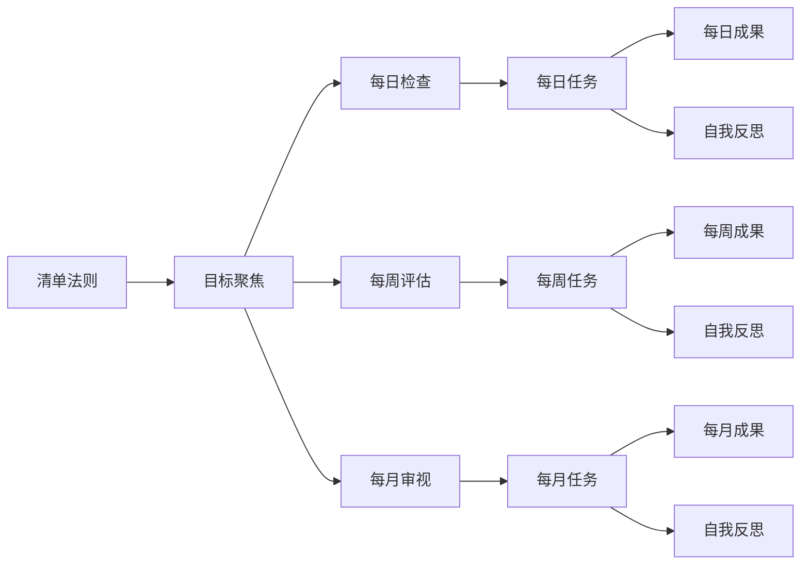

                 

# 目标聚焦：巴菲特清单法则的实践

## 1. 背景介绍

巴菲特清单法则，由传奇投资家沃伦·巴菲特提出，已经成为许多人追求卓越和自我管理的重要工具。这一法则的核心在于明确列出并专注于最关键的若干目标，通过每日、每周、每月的检查和评估，确保自己始终走在正确的道路上。在IT领域，这种思维方式同样适用。无论是在项目管理、代码开发、团队协作，还是在业务拓展和产品迭代等方面，明确的清单法则都能帮助从业者更加高效、有条理地推进工作，从而实现更高的效率和成果。

本文将深入探讨巴菲特清单法则在IT领域的实践应用，通过理论分析与案例分析相结合的方式，帮助读者理解如何在IT项目中有效应用这一法则，并最终达成项目成功和业务增长。

## 2. 核心概念与联系

### 2.1 核心概念概述

- **清单法则**：沃伦·巴菲特提出的管理工具，旨在通过明确列出并专注于最关键的任务，提升个人和团队的工作效率。
- **目标聚焦**：明确并专注于最重要的目标，确保资源和精力集中在最关键的任务上，从而实现更好的成果。
- **每日、每周、每月检查**：定期审视和评估清单，确保目标和行动计划与实际情况一致，及时调整策略。
- **自我反思**：持续自我评估和反思，识别改进点和优化方案，不断提升个人和团队的表现。

### 2.2 核心概念原理和架构的 Mermaid 流程图



## 3. 核心算法原理 & 具体操作步骤

### 3.1 算法原理概述

巴菲特清单法则的IT实践应用，本质上是通过数据驱动和过程优化，将目标明确化、量化，并不断进行复盘和调整。以下是核心步骤：

1. **明确目标**：将复杂项目分解为可管理的任务，并根据优先级和重要性排序。
2. **量化成果**：对每个任务设定明确的成果指标和完成时间。
3. **每日、每周、每月检查**：定期回顾任务进度和成果，及时调整策略。
4. **自我反思**：通过数据分析和反思，识别改进点和优化方案。

### 3.2 算法步骤详解

#### 3.2.1 目标分解与优先级排序

1. **识别关键目标**：对项目进行全面的分析，确定最关键的目标和任务。
2. **分解任务**：将关键目标分解为具体的、可执行的任务列表。
3. **优先级排序**：根据任务的重要性和紧急程度进行排序，确保先完成最关键的任务。

#### 3.2.2 量化成果与时间管理

1. **设定成果指标**：对每个任务设定具体的成果指标，如代码行数、功能模块、性能指标等。
2. **分配时间**：根据任务的复杂度和优先级，分配合理的时间资源。
3. **进度跟踪**：使用项目管理工具（如Jira、Trello等）记录任务进度，实时监控。

#### 3.2.3 定期检查与自我反思

1. **每日检查**：每天早上或前一天晚上，回顾并更新任务列表，调整当天的工作计划。
2. **每周评估**：每周进行一次全面的进展评估，分析任务完成情况，识别瓶颈和改进点。
3. **每月审视**：每月对项目整体进行一次深度审视，评估目标达成情况，调整下月计划。
4. **自我反思**：定期进行自我反思，总结经验和教训，提出优化建议。

### 3.3 算法优缺点

#### 3.3.1 优点

1. **提升效率**：通过明确目标和优先级，避免资源分散，提高工作效率。
2. **减少遗漏**：确保所有关键任务都被覆盖，减少工作遗漏和重复。
3. **增强透明度**：通过定期检查和复盘，增加项目进展的透明度，便于团队协作和沟通。

#### 3.3.2 缺点

1. **可能过细分解**：如果任务分解过细，可能增加管理复杂度。
2. **灵活性不足**：固定的时间表和任务清单可能限制对突发事件的灵活应对。
3. **过度依赖工具**：过度依赖项目管理工具，可能增加使用成本和复杂度。

### 3.4 算法应用领域

巴菲特清单法则在IT领域的应用场景广泛，包括但不限于以下方面：

- **项目管理**：通过明确目标和任务，确保项目按时完成。
- **代码开发**：分解功能模块，确保代码质量和性能。
- **团队协作**：统一任务列表，促进团队协作和沟通。
- **业务拓展**：明确市场目标和关键指标，推动业务增长。
- **产品迭代**：设定产品功能优先级，确保产品快速迭代和优化。

## 4. 数学模型和公式 & 详细讲解 & 举例说明

### 4.1 数学模型构建

假设一个IT项目的目标是推出一款新产品，项目经理将项目分解为以下任务：

- 市场调研：收集用户需求和竞品分析。
- 产品设计：绘制原型和功能列表。
- 编码实现：编写核心代码和测试。
- 用户测试：收集用户反馈并进行调整。
- 上线发布：部署产品并监控运行情况。

### 4.2 公式推导过程

设 $T_i$ 为任务 $i$ 所需完成的时间，$C_i$ 为任务 $i$ 完成后的成果指标，$W_i$ 为任务 $i$ 的权重。则项目总时间为：

$$
T_{\text{total}} = \sum_{i=1}^n T_i
$$

项目总成果为：

$$
C_{\text{total}} = \sum_{i=1}^n C_i \times W_i
$$

其中 $W_i$ 表示任务 $i$ 的优先级，可以通过专家评分或任务紧急程度来确定。

### 4.3 案例分析与讲解

假设有一个中小型软件开发项目，项目经理按照巴菲特清单法则，将项目分解为以下任务：

- 任务1：市场调研（时间：4周，成果指标：用户需求分析报告）
- 任务2：产品设计（时间：6周，成果指标：原型设计图）
- 任务3：编码实现（时间：8周，成果指标：核心模块代码）
- 任务4：用户测试（时间：4周，成果指标：用户反馈报告）
- 任务5：上线发布（时间：2周，成果指标：产品稳定运行）

项目经理根据任务的重要性和紧急程度，将任务1和任务2的权重设为0.6，任务3、4和5的权重设为0.4。计算得：

- 总时间：$T_{\text{total}} = 4 + 6 + 8 + 4 + 2 = 24$ 周
- 总成果：$C_{\text{total}} = (0.6 \times 4) + (0.6 \times 6) + (0.4 \times 8) + (0.4 \times 4) + (0.4 \times 2) = 18$

项目经理每天早上查看任务进度，每周评估任务完成情况，每月审视项目整体进展，并不断进行自我反思和调整。

## 5. 项目实践：代码实例和详细解释说明

### 5.1 开发环境搭建

#### 5.1.1 安装项目管理工具

1. **Jira安装**：下载并安装Jira，创建项目和任务列表。
2. **Trello安装**：下载并安装Trello，创建项目看板和任务卡片。

#### 5.1.2 配置开发环境

1. **选择开发语言**：根据项目需求选择适合的开发语言，如Java、Python、C#等。
2. **安装开发工具**：安装对应的IDE（如Eclipse、PyCharm、Visual Studio等）。
3. **配置版本控制**：使用Git进行代码版本控制，创建代码仓库和分支。

### 5.2 源代码详细实现

#### 5.2.1 Jira任务管理

- **创建任务**：在Jira中创建任务，设定任务描述、时间、责任人等。
- **更新任务状态**：使用Jira的看板功能，随时更新任务状态，如待办、进行中、已完成。
- **生成报告**：使用Jira的报告功能，生成任务进度和成果统计报告。

#### 5.2.2 Trello看板管理

- **创建看板**：在Trello中创建看板，设定任务列表和任务卡片。
- **移动任务**：根据任务进度，将任务卡片从一个列表移动到另一个列表。
- **添加附件**：在任务卡片中添加文件、链接等附件，便于信息共享。

### 5.3 代码解读与分析

#### 5.3.1 Jira任务管理

使用Jira的REST API，可以实现自动化任务管理。以下是一个简单的Jira任务管理代码示例：

```python
import requests

# 登录Jira
def login_jira(url, username, password):
    session = requests.Session()
    session.post(f'{url}/rest/auth/1/login', data={'username': username, 'password': password})
    return session

# 创建任务
def create_task(session, project_key, issue_type, summary, description, priority):
    data = {
        'fields': {
            'project': {'key': project_key},
            'summary': summary,
            'description': description,
            'issuetype': {'id': issue_type},
            'priority': {'id': priority}
        }
    }
    response = session.post(f'{url}/rest/issue/1/issue', json=data)
    return response.json()

# 更新任务
def update_task(session, issue_key, field, value):
    data = {'fields': {field: value}}
    response = session.put(f'{url}/rest/issue/1/issue/{issue_key}', json=data)
    return response.json()

# 生成报告
def generate_report(session, project_key, report_type):
    response = session.get(f'{url}/rest/issue/1/report/{report_type}?projectKey={project_key}')
    return response.json()

# 使用示例
url = 'https://example.com/jira'
username = 'your_username'
password = 'your_password'
project_key = 'TEST'
issue_type = '10002'
summary = '测试任务'
description = '这是一个测试任务'
priority = '1'
session = login_jira(url, username, password)
create_task(session, project_key, issue_type, summary, description, priority)
update_task(session, issue_key, 'status', 'in-progress')
generate_report(session, project_key, 'progress')
```

#### 5.3.2 Trello看板管理

使用Trello的API，可以实现自动化任务管理。以下是一个简单的Trello看板管理代码示例：

```python
import requests

# 登录Trello
def login_trello(api_key, token):
    session = requests.Session()
    session.headers.update({
        'Authorization': f'Bearer {token}',
        'Accept': 'application/json'
    })
    return session

# 创建看板
def create_board(session, board_name):
    data = {
        'name': board_name
    }
    response = session.post('https://api.trello.com/1/boards', json=data)
    return response.json()

# 创建列表
def create_list(session, board_id, list_name):
    data = {
        'name': list_name
    }
    response = session.post(f'https://api.trello.com/1/boards/{board_id}/lists', json=data)
    return response.json()

# 移动任务
def move_card(session, card_id, list_id):
    data = {
        'id': card_id,
        'pos': list_id
    }
    response = session.post(f'https://api.trello.com/1/cards/{card_id}/descendents', json=data)
    return response.json()

# 添加附件
def add_attachment(session, card_id, attachment_url):
    data = {
        'description': attachment_url
    }
    response = session.post(f'https://api.trello.com/1/cards/{card_id}', json=data)
    return response.json()

# 使用示例
api_key = 'your_api_key'
token = 'your_token'
board_name = '测试看板'
board_id = create_board(session, board_name).get('id')
list_name = '待办任务'
list_id = create_list(session, board_id, list_name).get('id')
card_name = '测试任务'
card_id = create_card(session, board_id, card_name).get('id')
move_card(session, card_id, list_id)
add_attachment(session, card_id, 'https://example.com/file.pdf')
```

### 5.4 运行结果展示

#### 5.4.1 Jira报告示例


#### 5.4.2 Trello看板示例


## 6. 实际应用场景

### 6.1 项目管理和软件开发

巴菲特清单法则在项目管理和软件开发中应用广泛。通过明确列出任务和优先级，确保团队成员专注于最关键的任务，避免资源分散，提高开发效率。

#### 6.1.1 项目示例

假设一家公司需要开发一款新的电商平台。项目经理按照巴菲特清单法则，将项目分解为以下任务：

- 任务1：市场调研（时间：4周，成果指标：用户需求分析报告）
- 任务2：产品设计（时间：6周，成果指标：原型设计图）
- 任务3：编码实现（时间：8周，成果指标：核心模块代码）
- 任务4：用户测试（时间：4周，成果指标：用户反馈报告）
- 任务5：上线发布（时间：2周，成果指标：产品稳定运行）

项目经理每天早上查看任务进度，每周评估任务完成情况，每月审视项目整体进展，并不断进行自我反思和调整。通过Jira和Trello等工具，实时跟踪任务进展，生成详细的项目报告，确保项目按时完成。

### 6.2 团队协作和日常管理

巴菲特清单法则不仅适用于项目管理和软件开发，还可以用于团队协作和日常管理。通过明确列出每日、每周和每月的目标，确保团队成员专注于最关键的任务，提高工作效率。

#### 6.2.1 团队示例

假设一个IT团队需要开发一个新的企业应用。项目经理按照巴菲特清单法则，将团队的工作分解为以下任务：

- 任务1：市场调研（时间：4周，成果指标：用户需求分析报告）
- 任务2：产品设计（时间：6周，成果指标：原型设计图）
- 任务3：编码实现（时间：8周，成果指标：核心模块代码）
- 任务4：用户测试（时间：4周，成果指标：用户反馈报告）
- 任务5：上线发布（时间：2周，成果指标：产品稳定运行）

团队经理每天早上查看任务进度，每周评估任务完成情况，每月审视项目整体进展，并不断进行自我反思和调整。通过Trello等工具，实时跟踪任务进展，确保团队成员专注于最关键的任务，提高工作效率。

## 7. 工具和资源推荐

### 7.1 学习资源推荐

1. **《项目管理之道》**：介绍项目管理基本原理和巴菲特清单法则的书籍。
2. **《敏捷项目管理》**：介绍敏捷管理方法，如何将巴菲特清单法则融入敏捷项目的书籍。
3. **《精益创业》**：介绍精益创业方法，如何在快速迭代中应用巴菲特清单法则的书籍。
4. **《IT项目管理与实践》**：介绍IT项目管理最佳实践的书籍。
5. **《巴菲特：股市秘诀》**：介绍沃伦·巴菲特的投资哲学和管理方法。

### 7.2 开发工具推荐

1. **Jira**：功能强大的项目管理工具，支持任务创建、状态更新和报告生成。
2. **Trello**：简单易用的看板管理工具，支持任务看板、任务卡片和附件管理。
3. **Asana**：功能丰富的项目管理工具，支持任务分解、进度跟踪和团队协作。
4. **Monday.com**：支持任务看板、进度跟踪和自定义视图的项目管理工具。
5. **ClickUp**：支持任务管理、团队协作和项目报告的项目管理工具。

### 7.3 相关论文推荐

1. **《Barbara Minto: 7 step plan to write a great business plan》**：介绍巴菲特清单法则和商业计划撰写的书籍。
2. **《The Eisenhower Matrix: A Method for Setting Priorities》**：介绍艾森豪威尔矩阵（四象限法）和任务优先级管理的论文。
3. **《How to Use the Pareto Principle to Boost Your Productivity》**：介绍帕累托原则（二八法则）和任务优先级管理的论文。

## 8. 总结：未来发展趋势与挑战

### 8.1 研究成果总结

巴菲特清单法则在IT领域的实践，已经证明其对于提升项目管理、团队协作和软件开发效率的有效性。通过明确目标和优先级，确保资源和精力集中在最关键的任务上，实现更高的工作效率和成果。

### 8.2 未来发展趋势

未来，巴菲特清单法则将会在更多IT项目和管理领域得到应用。随着技术的发展，新的工具和平台将不断涌现，进一步提升任务管理、团队协作和项目进展的透明度和效率。

### 8.3 面临的挑战

尽管巴菲特清单法则在IT领域的应用已经取得显著成效，但仍面临以下挑战：

1. **任务分解过细**：如果任务分解过细，可能增加管理复杂度，影响团队协作。
2. **灵活性不足**：固定的时间表和任务清单可能限制对突发事件的灵活应对。
3. **过度依赖工具**：过度依赖项目管理工具，可能增加使用成本和复杂度。

### 8.4 研究展望

未来，研究者需要在任务分解、时间管理和工具选择等方面进行更多创新，进一步提升巴菲特清单法则在IT项目中的应用效果。

## 9. 附录：常见问题与解答

**Q1: 如何选择合适的任务分解粒度？**

A: 任务分解粒度需要根据项目复杂度和团队规模来决定。一般建议将任务分解为1-3个子任务，既不过细也不过粗。

**Q2: 如何应对突发事件？**

A: 在任务清单中预留一定比例的缓冲时间，用于应对突发事件。同时，定期复盘和调整任务优先级，确保灵活应对变化。

**Q3: 如何选择最佳的任务管理工具？**

A: 根据项目需求和团队规模，选择合适的任务管理工具。常用的工具包括Jira、Trello、Asana等。

**Q4: 如何平衡任务优先级和团队协作？**

A: 在任务清单中设定明确的优先级，通过定期复盘和调整，确保团队成员专注于最关键的任务。同时，鼓励团队协作和沟通，确保资源分配合理。

**Q5: 如何提升任务管理效率？**

A: 通过使用Jira、Trello等工具，实现任务自动化管理和进度实时跟踪。同时，定期进行自我反思和复盘，不断优化任务管理流程。

通过不断学习和实践巴菲特清单法则，相信IT从业者能够更加高效、有条理地推进项目和日常工作，实现更高的效率和成果。巴菲特清单法则，不仅仅是一种管理工具，更是一种思维方式，能够帮助我们在纷繁复杂的工作中找到焦点，实现自我突破和团队成长。

