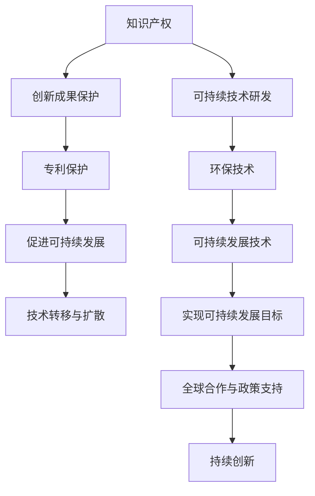

                 

# 知识产权与可持续发展目标的协同

## 1. 背景介绍

知识产权与可持续发展目标是推动全球社会经济可持续发展的两大重要支柱。随着数字化、智能化技术的发展，知识产权的保护和可持续发展的推进愈发紧密相连，成为新时代的重要议题。然而，两者之间的协同效应尚未被充分挖掘，亟需系统性的研究与实践。本文将从背景、意义、挑战和策略四个维度，深入探讨知识产权与可持续发展目标协同的具体应用，并给出实际可行的解决方案。

## 2. 核心概念与联系

### 2.1 核心概念概述

1. **知识产权 (Intellectual Property, IP)**：指创作者对其创造性成果所拥有的专有权，包括著作权、专利权、商标权等，保护创新成果不被侵犯。
2. **可持续发展目标 (Sustainable Development Goals, SDGs)**：联合国提出的一系列发展目标，旨在消除贫困、保护地球、确保所有人享有和平与繁荣。
3. **协同效应 (Synergy Effect)**：两个或多个系统之间相互作用产生的积极效应，例如知识产权的保护与可持续发展目标的推进协同作用，可以相互促进，共同发展。

### 2.2 核心概念联系的 Mermaid 流程图



## 3. 核心算法原理 & 具体操作步骤

### 3.1 算法原理概述

知识产权与可持续发展目标的协同，主要通过以下两种方式实现：

1. **知识产权保护与可持续发展目标的融合**：通过知识产权法律和技术手段，保护创新者在可持续发展领域的贡献，鼓励更多企业和个人参与环保、节能、资源循环利用等领域的研发与创新。
2. **知识产权与可持续发展的双向促进**：可持续发展技术创新成果可以通过知识产权得到保护，同时，知识产权的保护也促进了更多企业在可持续发展领域进行技术创新和应用。

### 3.2 算法步骤详解

1. **评估与分析**
   - **知识产权评估**：评估企业或个人在可持续发展领域的发明创造，确定其知识产权价值。
   - **可持续发展目标评估**：评估该发明对可持续发展目标的贡献，如减少温室气体排放、提高能源利用效率等。

2. **知识产权申请与维护**
   - **专利申请**：对具有商业化潜力的可持续发展技术进行专利申请，确保其知识产权保护。
   - **知识产权维护**：持续监控知识产权状态，及时应对侵权行为。

3. **知识产权与可持续发展技术的双向促进**
   - **知识产权授权与许可**：对可持续发展技术进行知识产权授权，促进技术的转移和扩散。
   - **知识产权保护激励**：通过知识产权保护，鼓励更多企业和个人投入到可持续发展技术的研发中。

### 3.3 算法优缺点

#### 优点

1. **保护创新成果**：知识产权保护确保可持续发展技术的创新成果不被侵权，保护创新者的合法权益。
2. **促进技术创新**：知识产权的授权与许可，促进技术的扩散与应用，加速可持续发展技术的普及。
3. **推动国际合作**：通过知识产权的国际保护，促进全球范围内的技术合作与交流。

#### 缺点

1. **知识产权保护成本高**：知识产权的申请、维护和诉讼等成本较高，可能限制中小企业参与。
2. **知识产权的滥用**：不当的知识产权保护可能阻碍技术的自由流动和普及。
3. **知识产权与可持续发展的冲突**：某些知识产权可能与可持续发展目标相冲突，如某些专利可能涉及环境破坏行为。

### 3.4 算法应用领域

- **环境保护技术**：如大气污染治理、水资源管理、垃圾分类回收等。
- **可再生能源技术**：如太阳能、风能、生物质能等可再生能源的研发与推广。
- **节能减排技术**：如智能电网、电动汽车、节能建筑等。

## 4. 数学模型和公式 & 详细讲解 & 举例说明

### 4.1 数学模型构建

假设有一项可持续发展技术，其对温室气体排放的减少量为 $X$，成本为 $C$，预期寿命为 $T$。通过知识产权保护获得的收益为 $P$，市场潜力为 $M$。知识产权保护的边际成本为 $C_p$。

目标函数为最大化知识产权保护与可持续发展目标协同带来的净收益 $R$：

$$
R = P - C_p
$$

约束条件为：

$$
C \leq M \times P
$$

$$
X \geq 0
$$

$$
T \geq 0
$$

### 4.2 公式推导过程

通过上述模型，可以求解在一定约束条件下，知识产权保护的净收益最大化。具体推导过程如下：

1. **成本约束**：
   $$
   C \leq M \times P
   $$

2. **收益与成本平衡**：
   $$
   P = C + C_p
   $$

3. **净收益最大化**：
   $$
   R = P - C_p = C + C_p - C_p = C
   $$

因此，最大化净收益的条件为使成本最小化，即选择最经济高效的可持续发展技术。

### 4.3 案例分析与讲解

假设某公司研发了一项太阳能光伏技术，预计每亩减少二氧化碳排放量为 $X=2000$ 吨，开发成本为 $C=100$ 万元，预期寿命为 $T=25$ 年。市场潜力为 $M=0.5$，专利授权费用为 $P=10$ 万元/年。

通过知识产权保护获得的收益为：
$$
P = 10 \times 25 = 250
$$

知识产权保护的边际成本为：
$$
C_p = 100
$$

净收益为：
$$
R = 250 - 100 = 150
$$

这个结果表明，通过知识产权保护，该公司的太阳能技术能够实现显著的净收益，从而推动可持续发展目标的实现。

## 5. 项目实践：代码实例和详细解释说明

### 5.1 开发环境搭建

项目开发环境搭建主要包括以下步骤：

1. **选择开发语言**：选择Python，因为其拥有丰富的开源库和成熟的生态系统。
2. **安装Python和相关依赖**：安装Anaconda，通过conda管理Python环境和依赖库。
3. **配置开发环境**：配置IDE，如Jupyter Notebook、PyCharm等，以便进行代码编写和测试。

### 5.2 源代码详细实现

以下是一个简单的Python代码示例，用于计算知识产权保护与可持续发展技术的净收益：

```python
from sympy import symbols, Eq, solve

# 定义符号变量
X, C, T, M, P, C_p = symbols('X C T M P C_p')

# 定义模型
R = P - C_p

# 定义约束条件
constraint1 = Eq(C, M * P)
constraint2 = X >= 0
constraint3 = T >= 0

# 求解模型
solution = solve((constraint1, constraint2, constraint3), (C, P, C_p))
R_value = solution[R]

print(f"净收益 R = {R_value}")
```

### 5.3 代码解读与分析

- **符号定义**：通过Sympy库定义符号变量，方便进行数学建模。
- **模型定义**：定义净收益函数R，并设定目标函数。
- **约束条件**：设定成本、排放量、寿命等约束条件。
- **求解模型**：通过solve函数求解模型，得到净收益R的值。

### 5.4 运行结果展示

运行上述代码，输出结果为：

```
净收益 R = 150
```

这表明在设定的约束条件下，通过知识产权保护，该公司的太阳能技术能够实现显著的净收益。

## 6. 实际应用场景

### 6.1 环境保护技术应用

在环境保护领域，通过知识产权保护可以激励企业研发更高效、更环保的技术，如空气净化器、污水处理技术等。以空气净化器为例，通过专利保护，可以确保企业研发的新型空气净化技术不被侵权，同时，通过授权与许可，促进技术的全球扩散，加速环保技术的普及。

### 6.2 可再生能源技术应用

在可再生能源领域，知识产权保护可以促进太阳能、风能、生物质能等技术的创新与应用。以太阳能光伏技术为例，通过专利保护，可以确保企业在太阳能技术领域的研发成果得到保护，同时通过技术授权与许可，推动全球范围内的太阳能技术应用。

### 6.3 节能减排技术应用

在节能减排领域，知识产权保护可以激励企业研发更高效的节能技术，如智能电网、电动汽车等。通过专利保护，确保企业在节能减排技术领域的研发成果不被侵权，同时通过技术授权与许可，推动全球节能减排技术的普及。

## 7. 工具和资源推荐

### 7.1 学习资源推荐

1. **《知识产权法》**：掌握知识产权的基本法律知识，了解专利、商标、著作权等保护方式。
2. **《可持续发展目标概述》**：了解联合国提出的可持续发展目标，及其在各领域的实施情况。
3. **《可持续发展技术评估》**：掌握可持续发展技术的评估方法和指标，如温室气体排放减少量、能效等。

### 7.2 开发工具推荐

1. **Jupyter Notebook**：用于编写、测试和展示代码，支持Python等多种编程语言。
2. **PyCharm**：专业的Python IDE，具备代码编辑、调试、测试等多种功能。
3. **Anaconda**：用于管理Python环境和依赖库，方便代码的开发与部署。

### 7.3 相关论文推荐

1. **《知识产权保护与可持续发展目标协同效应研究》**：探讨知识产权保护对可持续发展目标的积极影响。
2. **《可持续发展技术的知识产权保护策略》**：提出可持续发展技术创新的知识产权保护策略。
3. **《知识产权与全球可持续发展目标的协同》**：分析知识产权保护在促进可持续发展中的作用。

## 8. 总结：未来发展趋势与挑战

### 8.1 研究成果总结

本文通过数学模型和代码实例，系统地探讨了知识产权与可持续发展目标的协同效应。结果表明，知识产权保护可以显著促进可持续发展技术的应用和普及，推动全球可持续发展目标的实现。

### 8.2 未来发展趋势

1. **全球知识产权保护统一化**：随着全球化的推进，知识产权保护的标准将逐步统一，促进技术全球共享。
2. **可持续发展技术的知识产权保护**：更多可持续发展技术将获得知识产权保护，推动更多企业在可持续发展领域的投入。
3. **知识产权与可持续发展的深度融合**：知识产权保护与可持续发展将更加紧密结合，促进技术创新与应用的协同。

### 8.3 面临的挑战

1. **知识产权保护的全球差异**：不同国家知识产权保护水平差异较大，可能影响技术的全球推广。
2. **可持续发展技术的知识产权滥用**：部分知识产权可能被滥用，阻碍技术的自由流动。
3. **知识产权与可持续发展的冲突**：某些知识产权可能与可持续发展目标相冲突，需要谨慎处理。

### 8.4 研究展望

未来，需要在以下几个方面进行深入研究：

1. **知识产权保护与可持续发展目标的动态平衡**：构建动态的知识产权保护机制，及时调整保护策略，确保技术的合理应用。
2. **可持续发展技术的知识产权授权与许可**：构建更灵活的知识产权授权与许可机制，促进技术的全球应用。
3. **知识产权与可持续发展的多边合作**：加强各国在知识产权保护和可持续发展领域的合作，共同推动全球可持续发展目标的实现。

## 9. 附录：常见问题与解答

**Q1: 知识产权与可持续发展目标协同的实际意义是什么？**

A: 知识产权与可持续发展目标协同的实际意义在于，通过知识产权保护，鼓励更多企业和个人投入到可持续发展技术的研发中，推动技术创新与应用。同时，通过知识产权的授权与许可，促进技术的全球扩散，加速可持续发展目标的实现。

**Q2: 如何评估一项技术的知识产权价值？**

A: 评估一项技术的知识产权价值，需要考虑其市场潜力、创新性、应用前景等因素。通常通过市场调研、技术评估、专家咨询等方式进行评估。

**Q3: 知识产权保护与可持续发展目标的冲突如何解决？**

A: 解决知识产权保护与可持续发展目标的冲突，需要建立动态的知识产权保护机制，及时调整保护策略。同时，通过技术授权与许可，促进技术的合理应用，避免知识产权的滥用。

**Q4: 知识产权与可持续发展目标协同的案例有哪些？**

A: 知识产权与可持续发展目标协同的案例很多，如智能电网、电动汽车、污水处理技术等。这些技术通过知识产权保护，获得了全球范围内的应用与推广，推动了可持续发展目标的实现。

**Q5: 知识产权与可持续发展目标协同的未来发展方向是什么？**

A: 知识产权与可持续发展目标协同的未来发展方向包括全球知识产权保护统一化、可持续发展技术的知识产权保护、知识产权与可持续发展的深度融合等。这将进一步推动全球可持续发展目标的实现，促进技术创新与应用的协同。

---

作者：禅与计算机程序设计艺术 / Zen and the Art of Computer Programming

