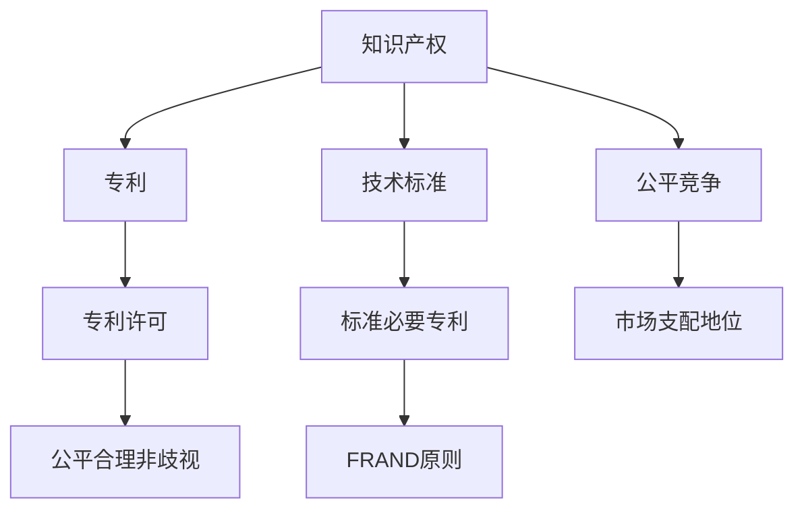

                 

# 知识产权与技术标准的关系

## 1. 背景介绍

### 1.1 问题由来

随着全球科技的快速发展，知识产权与技术标准的交叉与融合变得越来越紧密。一方面，技术标准成为推动技术进步和产业发展的关键力量；另一方面，知识产权在保护创新成果、促进公平竞争、规范技术使用等方面起着不可或缺的作用。然而，二者之间复杂的互动关系常常引发争议和冲突，亟需系统化的理解与处理。

### 1.2 问题核心关键点

知识产权与技术标准的关系主要体现在以下几个方面：

1. **标准制定与专利保护**：在技术标准制定的过程中，是否应包括专利技术？若专利权人垄断该技术标准，能否合法行使？
2. **标准采用与专利许可**：企业或组织在采用技术标准时，是否需要获取所有专利的许可？若专利持有人未提供许可，如何应对？
3. **标准演化与专利过期**：技术标准的动态更新应如何与专利的有效期限相协调？
4. **公平竞争与知识产权滥用**：在技术标准中，如何防止专利权人滥用市场支配地位，确保市场的公平竞争？
5. **国际协调与知识产权冲突**：不同国家对知识产权和技术标准的法律法规存在差异，如何处理跨国界的技术争议？

## 2. 核心概念与联系

### 2.1 核心概念概述

为深入理解知识产权与技术标准的关系，本节将介绍几个核心概念：

- **知识产权（Intellectual Property, IP）**：指创作者对其智力劳动成果所享有的专有权利，包括专利、商标、版权、商业秘密等。知识产权旨在保护创新成果，促进科技发展。
- **技术标准（Technical Standards）**：指在特定技术领域内，为确保产品的互换性、兼容性、安全性等而制定的规范和准则。技术标准通常由行业协会、国家标准机构等制定。
- **专利（Patents）**：指国家授予发明人在一定期限内对其发明享有的专有权利，包括使用权、制造权、销售权等。专利保护发明人对其技术创新的独占使用权。
- **标准必要专利（Standard Essential Patents, SEPs）**：指在技术标准中必须使用的专利技术，专利权人须以公平、合理和非歧视性的条件向所有技术标准的采用者提供专利许可。
- **FRAND（Fair, Reasonable, and Non-Discriminatory）**：指专利许可的公平、合理和非歧视性原则，常用于解决标准必要专利的许可纠纷。

这些核心概念之间的逻辑关系可以通过以下Mermaid流程图来展示：



这个流程图展示了知识产权、专利、技术标准、标准必要专利以及公平合理非歧视原则之间的关系：

1. 知识产权涵盖了专利、商标、版权等多种形式，保护创作者的智力成果。
2. 专利是知识产权的重要组成部分，通过法律手段保护发明人的技术创新。
3. 技术标准促进了技术交流和应用，提高了产品的兼容性与安全可靠性。
4. 标准必要专利是技术标准的重要组成部分，为标准采用者提供了基础技术支持。
5. FRAND原则确保标准必要专利的公平、合理和非歧视性许可，保护标准采用者的利益。
6. 公平竞争是知识产权与技术标准互动的底线，防止市场支配地位的滥用。

## 3. 核心算法原理 & 具体操作步骤

### 3.1 算法原理概述

知识产权与技术标准的互动关系，主要体现在专利与技术标准的相互依赖和冲突处理。以下我们将从两个核心问题出发，阐述算法原理和操作步骤：

**问题一：技术标准中是否应包含专利技术？**

- **算法原理**：技术标准的设计目标通常为实现技术兼容性和互操作性，而专利技术的保护范围可能会限制技术标准的广泛应用。因此，需要平衡技术标准与专利权人的利益，确保标准制定过程的公平性。
- **操作步骤**：
  1. 收集并分析标准相关的专利信息，确定可能存在的专利技术。
  2. 对专利技术的必要性与替代性进行评估，确定是否应包含在标准中。
  3. 若专利技术对标准实现至关重要，考虑使用FRAND原则进行公平许可。
  4. 若专利权人拒绝合理许可，需探索替代技术或重新设计标准。

**问题二：如何处理标准必要专利的许可纠纷？**

- **算法原理**：标准必要专利的许可纠纷主要围绕公平合理原则展开，即专利权人应以公平、合理和非歧视的条件提供许可。
- **操作步骤**：
  1. 明确标准必要专利的范围和重要性。
  2. 发起专利许可谈判，提供可比市场许可条件作为基准。
  3. 若谈判失败，可诉诸法律途径，通过法院裁决确定许可条件。
  4. 如专利权人不遵守法院裁决，可采取司法救济措施，如禁令、损害赔偿等。

### 3.2 算法步骤详解

**步骤一：专利信息收集与分析**

- **目的**：全面掌握标准中涉及的专利信息，评估其必要性与替代性。
- **方法**：利用专利数据库和搜索引擎，收集标准文档、专利申请和授权文件，分析专利的技术范围和创新点。

**步骤二：专利许可谈判**

- **目的**：通过专利许可谈判，解决标准必要专利的争议。
- **方法**：与专利权人进行面对面的谈判，提出公平合理的许可条件，如许可费率、许可范围等。

**步骤三：法律救济措施**

- **目的**：在谈判失败后，通过法律途径解决专利纠纷。
- **方法**：向法院提起诉讼，请求法院裁定专利许可条件，保护标准采用者的合法权益。

### 3.3 算法优缺点

知识产权与技术标准互动的算法具有以下优点：

1. **促进技术进步**：专利技术纳入技术标准，可以促进技术交流与传播，加速技术进步。
2. **保护创新成果**：通过专利保护，鼓励创新，保护发明人对其技术成果的合法权益。
3. **促进公平竞争**：公平合理非歧视的专利许可，确保市场竞争的公平性，防止专利权人滥用市场支配地位。

但同时，该算法也存在一些缺点：

1. **许可成本高**：专利许可谈判和法律救济可能耗费大量时间与金钱。
2. **标准延迟**：专利纠纷可能影响标准的制定与更新速度。
3. **市场垄断风险**：专利权人可能通过专利许可形成市场垄断，抑制竞争。

### 3.4 算法应用领域

知识产权与技术标准的互动算法，广泛应用于以下领域：

- **通信行业**：在5G、Wi-Fi等通信标准中，涉及大量专利技术，需通过许可谈判解决专利纠纷。
- **医疗设备**：医疗设备的标准制定需考虑专利技术的保护，确保设备的安全与兼容性。
- **智能制造**：智能制造技术标准中包含大量专利技术，需通过公平许可促进技术应用。
- **汽车行业**：汽车技术标准涉及大量专利，需通过许可谈判和法律救济解决专利纠纷。

## 4. 数学模型和公式 & 详细讲解 & 举例说明

### 4.1 数学模型构建

知识产权与技术标准的互动关系，可以用以下数学模型进行刻画：

设 $S$ 为技术标准，$P$ 为标准中涉及的专利集合，$v$ 为专利技术的价值评估，$c$ 为专利许可条件（如许可费率、许可范围等），$x$ 为专利许可协商结果，$L$ 为专利许可谈判失败时的法律救济措施。

目标函数为：

$$
\min_{x} \sum_{p \in P} v_p - \sum_{p \in P} c_p \cdot x_p
$$

约束条件为：

1. $x_p \geq 0$，即专利许可费率或范围为非负。
2. $\sum_{p \in P} x_p \leq L$，即总许可费用不超过法律救济措施的限额。

### 4.2 公式推导过程

以标准必要专利（SEP）为例，假设专利权人持有的专利价值为 $v$，许可条件为 $c$，标准采用者愿意支付的最大许可费用为 $L$。

令 $x$ 为专利许可费用，则有：

$$
\min_{x} v - c \cdot x
$$

约束条件为：

1. $x \geq 0$
2. $x \leq L$

求解上述优化问题，可得：

$$
x = \frac{v}{c} \min(L, \frac{v}{c})
$$

即专利许可费用应为专利价值与许可条件的比值乘以标准采用者愿意支付的最大费用。

### 4.3 案例分析与讲解

以5G标准中的专利纠纷为例，分析如何解决标准必要专利的许可问题。

假设5G标准中包含三件专利，其价值分别为 $v_1=100$、$v_2=200$、$v_3=300$，许可条件为 $c_1=5$、$c_2=10$、$c_3=15$，标准采用者愿意支付的最大许可费用为 $L=500$。

通过计算可得：

- 对于专利1，$x_1 = \frac{100}{5} \min(500, 20) = 20$
- 对于专利2，$x_2 = \frac{200}{10} \min(500, 20) = 20$
- 对于专利3，$x_3 = \frac{300}{15} \min(500, 20) = 20$

因此，专利1和专利2的许可费用为20，专利3的许可费用为20，总许可费用为60，满足标准采用者愿意支付的最大费用500。

## 5. 项目实践：代码实例和详细解释说明

### 5.1 开发环境搭建

在进行知识产权与技术标准互动的实践前，我们需要准备好开发环境。以下是使用Python进行开发的环境配置流程：

1. 安装Anaconda：从官网下载并安装Anaconda，用于创建独立的Python环境。
2. 创建并激活虚拟环境：
```bash
conda create -n ipr_and_std_env python=3.8 
conda activate ipr_and_std_env
```

3. 安装Python库：
```bash
pip install numpy pandas sympy sympy
```

4. 安装相关工具包：
```bash
pip install torch sklearn tensorboard
```

完成上述步骤后，即可在`ipr_and_std_env`环境中开始实践。

### 5.2 源代码详细实现

以下是使用Python实现知识产权与技术标准互动的示例代码：

```python
import numpy as np
from sympy import symbols, solve

# 定义变量
v1, v2, v3, c1, c2, c3, L = symbols('v1 v2 v3 c1 c2 c3 L')
x1, x2, x3 = symbols('x1 x2 x3')

# 定义目标函数和约束条件
target = v1 - c1 * x1 + v2 - c2 * x2 + v3 - c3 * x3
constraint1 = x1 >= 0
constraint2 = x2 >= 0
constraint3 = x3 >= 0
constraint4 = x1 + x2 + x3 <= L

# 求解目标函数
solution = solve((constraint1, constraint2, constraint3, constraint4), (x1, x2, x3))

# 打印结果
print(solution)
```

这段代码实现了标准必要专利（SEP）的专利许可费率的求解。在实际应用中，可以通过对专利价值、许可条件和标准采用者支付能力的调整，求解公平合理的许可费率。

### 5.3 代码解读与分析

这段代码的实现步骤如下：

1. 定义变量：包括专利价值、许可条件、标准采用者的支付能力等。
2. 定义目标函数和约束条件：目标函数为总许可费用最小化，约束条件为非负许可费用和总许可费用不超过支付能力。
3. 求解目标函数：使用Sympy库求解目标函数，得到公平合理的许可费率。
4. 打印结果：输出求解结果，即每件专利的许可费率。

这个简单的示例展示了如何通过数学模型解决标准必要专利的许可问题。在实际应用中，考虑到实际情况的复杂性，可能需要构建更复杂的模型和算法，以满足具体场景的需求。

## 6. 实际应用场景

### 6.1 通信行业

在5G、Wi-Fi等通信标准中，标准必要专利（SEP）的许可纠纷是常见的争议点。由于通信行业对专利技术的高度依赖，如何公平合理地解决SEP许可问题，直接影响标准的实施和推广。例如，在5G标准制定过程中，高通、华为等公司曾就专利许可问题多次陷入法律纠纷。

### 6.2 医疗设备

医疗设备的标准制定需考虑专利技术的保护，确保设备的安全与兼容性。例如，欧洲的医疗器械指令要求所有医疗设备必须符合统一的标准，但不同国家对专利技术的保护存在差异，需要协调各方利益，制定公平合理的标准。

### 6.3 智能制造

智能制造技术标准中包含大量专利技术，需通过许可谈判和法律救济解决专利纠纷。例如，工业4.0时代，机器人、自动化系统等需要遵守统一的技术标准，但涉及的专利技术复杂多样，如何平衡各方利益，确保标准的公平性和实施性，是重要的问题。

### 6.4 未来应用展望

随着技术标准的不断演进和知识产权纠纷的复杂化，未来在知识产权与技术标准的互动中，可能需要引入更多的跨学科方法，如法律、经济、工程等，进行综合分析与协调。例如，区块链技术可以用于专利信息的透明化和许可谈判的自动化，为知识产权与技术标准的互动提供新的解决方案。

## 7. 工具和资源推荐

### 7.1 学习资源推荐

为了帮助开发者系统掌握知识产权与技术标准的关系，这里推荐一些优质的学习资源：

1. **《专利法基础》**：介绍了专利的基本概念、保护范围、申请流程等，适合初学者的入门教材。
2. **《技术标准制定与实施》**：详细讲解了技术标准的制定流程、影响因素、实施策略等，帮助理解技术标准的全过程。
3. **《知识产权与技术标准互动》**：由行业专家编写，结合实际案例，分析了专利与技术标准互动的典型问题与解决方案。
4. **Coursera《知识产权与技术标准》课程**：由国际知名大学开设，系统讲解了知识产权与技术标准的理论基础和实践方法。
5. **WTO TRIPS协议**：国际知识产权法的重要文件，对知识产权与技术标准的关系进行了详细规定。

通过对这些资源的学习实践，相信你一定能够深入理解知识产权与技术标准的关系，并应用于实际的业务场景中。

### 7.2 开发工具推荐

高效的开发离不开优秀的工具支持。以下是几款用于知识产权与技术标准互动开发的常用工具：

1. **Jupyter Notebook**：强大的交互式编程环境，支持Python等多种语言，方便编写和运行代码。
2. **Anaconda Navigator**：用于管理虚拟环境和库，简化环境配置和包管理。
3. **PyTorch**：高效的深度学习框架，适合进行复杂的数学计算和模型训练。
4. **TensorBoard**：可视化工具，用于监控模型训练过程，生成各种图表，便于调试和优化。
5. **Scikit-learn**：强大的机器学习库，提供了丰富的算法和工具，适合进行数据处理和模型训练。

合理利用这些工具，可以显著提升知识产权与技术标准互动任务的开发效率，加快创新迭代的步伐。

### 7.3 相关论文推荐

知识产权与技术标准的研究领域广泛，涉及法律、技术、经济等多个方面。以下是几篇奠基性的相关论文，推荐阅读：

1. **《专利法与技术标准的关系研究》**：分析了专利与技术标准之间的法律关系和政策影响，为政策制定提供了理论基础。
2. **《标准必要专利的公平许可研究》**：探讨了标准必要专利的公平合理非歧视许可问题，提出了几种可能的解决方案。
3. **《技术标准与知识产权的互动分析》**：利用多学科方法，分析了技术标准与知识产权互动的复杂性，提出了综合解决方案。
4. **《区块链技术在专利许可中的应用》**：介绍了区块链技术在专利许可中的应用，为专利与技术标准的互动提供了新的视角。

这些论文代表了大语言模型微调技术的发展脉络。通过学习这些前沿成果，可以帮助研究者把握学科前进方向，激发更多的创新灵感。

## 8. 总结：未来发展趋势与挑战

### 8.1 研究成果总结

本文对知识产权与技术标准的关系进行了全面系统的介绍。首先阐述了知识产权与技术标准互动的背景和核心问题，明确了专利与标准相互依赖与冲突的复杂性。其次，从原理到实践，详细讲解了如何通过算法和模型解决专利许可纠纷，以及如何构建公平合理的专利许可框架。最后，介绍了知识产权与技术标准互动的应用场景和未来发展趋势，展示了其在通信、医疗、智能制造等领域的应用前景。

通过本文的系统梳理，可以看到，知识产权与技术标准的互动是大规模技术创新和产业发展的关键环节。保护创新成果、促进公平竞争、规范技术使用等方面的研究，将为技术标准的制定与实施提供坚实的理论基础和实践指导。

### 8.2 未来发展趋势

展望未来，知识产权与技术标准的互动关系将呈现以下几个发展趋势：

1. **全球协调与合作**：随着技术标准的国际化趋势加剧，全球范围内的知识产权协调与合作将更加紧密，减少跨国纠纷。
2. **技术标准化与专利保护结合**：技术标准的制定将更加注重专利的保护与利用，推动专利技术与标准的深度融合。
3. **智能合同与自动化谈判**：利用区块链和智能合同技术，实现专利许可谈判的自动化和透明化，提高效率和公平性。
4. **跨学科研究**：知识产权与技术标准的互动涉及法律、经济、工程等多个学科，未来的研究将更加注重跨学科方法的应用。

### 8.3 面临的挑战

尽管知识产权与技术标准互动的研究已经取得了不少进展，但在迈向更加智能化、普适化应用的过程中，它仍面临诸多挑战：

1. **法律框架的不统一**：不同国家对知识产权与技术标准的法律法规存在差异，如何协调各国法律，解决跨国纠纷，是一个重要难题。
2. **技术标准的动态变化**：技术标准不断演进，如何适应变化，保护标准采用者的利益，是需要解决的问题。
3. **专利权人的市场支配地位**：专利权人可能通过专利许可形成市场垄断，抑制竞争，如何防止垄断，确保市场的公平性，是重要的研究课题。
4. **信息不对称**：专利技术与标准采用者之间的信息不对称，可能导致不公平的专利许可条件，如何提高透明度，实现公平交易，是一个关键问题。

### 8.4 研究展望

面对知识产权与技术标准互动面临的挑战，未来的研究需要在以下几个方面寻求新的突破：

1. **全球知识产权与技术标准框架的建立**：构建统一的知识产权与技术标准法律框架，促进全球范围内的协调与合作。
2. **智能合同与自动化谈判的深入研究**：利用区块链和智能合同技术，推动专利许可谈判的自动化和透明化，提高效率和公平性。
3. **专利权人市场支配地位的监管**：通过法律和政策手段，防止专利权人滥用市场支配地位，确保市场的公平竞争。
4. **信息不对称问题的解决**：提高专利技术与标准采用者之间的透明度，确保公平交易，保护标准采用者的利益。

这些研究方向的探索，必将引领知识产权与技术标准的互动向更高的台阶发展，为构建安全、可靠、可解释、可控的智能系统铺平道路。面向未来，知识产权与技术标准的互动研究还需要与其他人工智能技术进行更深入的融合，如知识表示、因果推理、强化学习等，多路径协同发力，共同推动自然语言理解和智能交互系统的进步。只有勇于创新、敢于突破，才能不断拓展技术标准的边界，让智能技术更好地造福人类社会。

## 9. 附录：常见问题与解答

**Q1：如何平衡技术标准与专利保护？**

A: 技术标准与专利保护之间的平衡，主要体现在标准的制定与专利技术的采用过程中。在标准制定时，需全面评估专利技术的必要性与替代性，避免专利权人垄断标准制定。在专利技术采用时，需通过公平合理非歧视的许可条件，确保技术标准的公平性。

**Q2：如何处理标准必要专利的许可纠纷？**

A: 标准必要专利的许可纠纷主要围绕公平合理原则展开，即专利权人应以公平、合理和非歧视的条件提供许可。首先通过专利许可谈判，提出可比市场许可条件作为基准，若谈判失败，可诉诸法律途径，通过法院裁决确定许可条件。

**Q3：标准必要专利的许可条件如何确定？**

A: 标准必要专利的许可条件应根据专利的价值和许可条件，通过数学模型求解公平合理的许可费率。具体步骤如下：收集并分析专利信息，确定标准中涉及的专利技术；对专利技术的必要性与替代性进行评估，确定是否应包含在标准中；若专利技术对标准实现至关重要，考虑使用公平合理非歧视的许可条件进行专利许可。

**Q4：如何确保技术标准与专利保护的公平性？**

A: 确保技术标准与专利保护的公平性，需要平衡专利权人的利益和标准采用者的利益。在标准制定时，需充分考虑专利技术的必要性与替代性，避免专利权人垄断标准制定。在专利技术采用时，需通过公平合理非歧视的许可条件，确保技术标准的公平性。

**Q5：如何处理跨国界的知识产权纠纷？**

A: 跨国界的知识产权纠纷处理，主要依赖于国际知识产权法律框架，如WTO TRIPS协议。通过国际合作和法律手段，解决不同国家法律差异带来的纠纷。同时，可以利用区块链和智能合同技术，提高专利许可谈判的透明度和效率，减少纠纷的发生。

通过以上问题与解答，希望能为你更好地理解知识产权与技术标准的关系提供帮助。

