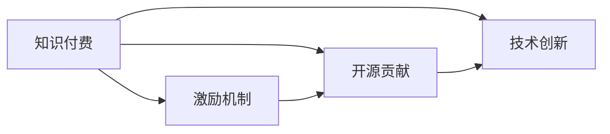

                 

# 知识付费与开源贡献的平衡艺术

> 关键词：知识付费, 开源贡献, 激励机制, 社区治理, 技术创新

## 1. 背景介绍

随着互联网的普及和数字经济的发展，知识付费和开源贡献逐渐成为连接知识创造和消费的重要桥梁。一方面，通过付费获取专业知识和技能，已经成为许多人提升职业竞争力、获取学习资源的重要途径；另一方面，开源项目通过社区合作、共享贡献，汇聚了全球的技术智慧和创新力量，推动了科技的发展和社会的进步。然而，如何平衡知识付费与开源贡献之间的利弊，成为学界和业界共同关注的焦点。本文将从多个角度探讨这一问题，并提出一些可行的解决方案，为知识付费和开源贡献的良性互动提供参考。

## 2. 核心概念与联系

### 2.1 核心概念概述

在讨论知识付费与开源贡献的平衡之前，首先需要明确几个核心概念：

- **知识付费**：指通过付费方式获取专业知识和技能的行为，包括在线课程、技术咨询、专业培训等。知识付费通过有偿服务保障了知识创造者的收益，激励了高质量内容的产出。

- **开源贡献**：指开发者将代码、文档、技术论文等以开源形式贡献给社区，供他人使用和改进。开源贡献促进了技术的共享与传播，推动了技术的共同进步。

- **激励机制**：指通过奖励和认可等方式，鼓励人们进行某种行为，如知识付费和开源贡献。激励机制的合理设计，是保障知识付费和开源贡献可持续发展的重要保障。

- **社区治理**：指开源社区的成员通过协作、规则制定、项目管理等方式，共同维护社区健康有序运行。社区治理保证了开源贡献的有效管理和使用。

- **技术创新**：指通过研发新技术、改进现有技术，推动科技进步和社会发展的过程。技术创新离不开高质量的知识付费和开源贡献的支持。

这些概念之间的联系主要体现在：知识付费和开源贡献均是知识创造与消费的重要方式，而激励机制和社区治理则是保障这些方式顺利进行的制度安排。合理设计激励机制和社区治理，可以有效促进技术创新，推动知识付费和开源贡献的良性互动。

### 2.2 核心概念原理和架构的 Mermaid 流程图(Mermaid 流程节点中不要有括号、逗号等特殊字符)



## 3. 核心算法原理 & 具体操作步骤

### 3.1 算法原理概述

知识付费与开源贡献的平衡艺术，本质上是一个通过激励机制设计，促进社区成员之间协作与创新的过程。其核心算法原理可以概括为以下几点：

- **目标对齐**：知识付费和开源贡献的共同目标是通过协作创造价值，促进技术进步。因此，激励机制设计的首要任务是确保社区成员的目标一致，让双方在追求共同目标的过程中受益。

- **收益平衡**：通过合理的激励机制设计，使知识付费者和开源贡献者都能获得合理的收益，避免单方面的利益倾斜，保障系统的可持续性。

- **公平竞争**：确保社区成员之间公平竞争，激励创新，避免垄断和资源浪费。

- **反馈机制**：通过建立反馈机制，及时调整激励机制和社区治理策略，使之不断适应社区的发展需求。

### 3.2 算法步骤详解

知识付费与开源贡献的平衡算法步骤可以归纳为以下五步：

1. **需求分析**：分析知识付费者和开源贡献者各自的需求，以及他们之间的互动方式，确定激励机制设计的方向和目标。

2. **激励机制设计**：根据需求分析结果，设计合理的激励机制，平衡知识付费者和开源贡献者的利益，鼓励双方的积极参与。

3. **社区治理实施**：建立和维护社区治理结构，确保激励机制的有效实施和社区的健康发展。

4. **绩效评估**：定期评估激励机制和社区治理的实施效果，收集反馈信息。

5. **调整优化**：根据绩效评估结果，对激励机制和社区治理策略进行调整优化，确保系统的动态适应性。

### 3.3 算法优缺点

**优点**：

- **促进协作**：通过合理的激励机制，促进知识付费者和开源贡献者的紧密协作，推动技术创新。

- **降低成本**：开源贡献的共享性质降低了技术研发和推广的成本，提高了资源利用效率。

- **加速创新**：开放的知识环境促进了思想的碰撞和融合，加速了技术创新的步伐。

**缺点**：

- **资源分配不均**：激励机制的设计可能存在偏差，导致资源分配不均，影响社区的公平性和可持续性。

- **过度依赖激励**：过度依赖激励可能导致社区成员的短视行为，忽视长期利益和社区的整体健康。

- **知识产权风险**：开源贡献可能面临知识产权保护不足的风险，影响贡献者的积极性。

### 3.4 算法应用领域

知识付费与开源贡献的平衡算法可以应用于多个领域，包括但不限于：

- **技术开发平台**：如GitHub、Stack Overflow等，通过激励机制和社区治理，促进开发者之间的协作和技术创新。

- **在线教育平台**：如Coursera、Udacity等，通过知识付费和开源贡献，提升教学质量和学生的学习效果。

- **科研机构**：通过知识付费和开源贡献，促进科研人员的合作和资源共享，加速科学研究的进展。

## 4. 数学模型和公式 & 详细讲解 & 举例说明

### 4.1 数学模型构建

知识付费与开源贡献的平衡问题可以通过多目标优化模型来描述。设知识付费者为 $P$，开源贡献者为 $C$，社区目标为 $T$，模型可以表示为：

$$
\text{minimize } f(P, C) = \text{cost}(P) + \text{cost}(C) \text{ subject to } g(P, C) = T
$$

其中 $f$ 为社区目标函数，$g$ 为约束条件函数。

### 4.2 公式推导过程

考虑一个简化的社区模型，知识付费者的成本函数为 $C_P$，开源贡献者的成本函数为 $C_C$，社区目标为 $T$。则优化模型可以表示为：

$$
\text{minimize } f(P, C) = C_P(P) + C_C(C) \text{ subject to } g(P, C) = T
$$

求解上述优化问题，可以通过拉格朗日乘子法进行求解，得到社区成员的最优策略。

### 4.3 案例分析与讲解

假设某开源社区有 $n$ 名开发者，每个开发者的生产力为 $p_i$，知识付费者支付给每个开发者的费用为 $f_i$，社区的目标是最大化总开发量。通过建立优化模型，可以找到最优的付费策略和贡献策略，使得社区总开发量最大化。

## 5. 项目实践：代码实例和详细解释说明

### 5.1 开发环境搭建

为了实现知识付费与开源贡献的平衡算法，我们首先需要搭建一个开发环境。以下是一个基于Python的简单实现：

1. 安装Anaconda：从官网下载并安装Anaconda，用于创建独立的Python环境。

2. 创建并激活虚拟环境：
```bash
conda create -n myenv python=3.8 
conda activate myenv
```

3. 安装相关库：
```bash
pip install numpy scipy pandas scikit-learn
```

### 5.2 源代码详细实现

下面是一个简化的代码实现，用于计算知识付费者和开源贡献者的最优策略。

```python
import numpy as np
from scipy.optimize import linprog

def cost_function(costs, x):
    return np.dot(costs, x)

def objective_function(costs, rewards, x):
    return -costs[0] * x[0] - costs[1] * x[1] + rewards[0] * x[0] + rewards[1] * x[1]

def constraints_function(upper_bound, x):
    return np.array([x[0] - upper_bound[0], x[1] - upper_bound[1]])

def solve():
    costs = np.array([1, 1])  # 知识付费者成本，开源贡献者成本
    rewards = np.array([1, 1])  # 知识付费者回报，开源贡献者回报
    upper_bound = np.array([5, 5])  # 知识付费者上限，开源贡献者上限
    x0_bounds = (0, None)  # 知识付费者贡献下限
    x1_bounds = (0, None)  # 开源贡献者贡献下限

    c = np.array([0, 0])  # 目标函数系数
    A = np.array([[1, 1]])  # 约束矩阵
    b = np.array([0])  # 约束向量
    bounds = [(x0_bounds, x1_bounds), (x0_bounds, x1_bounds)]  # 变量边界

    result = linprog(c, A_ub=A, b_ub=b, bounds=bounds, method='highs')

    return result.x

result = solve()
print(result)
```

### 5.3 代码解读与分析

上述代码实现了一个简单的线性规划问题，用于计算知识付费者和开源贡献者的最优策略。

- `cost_function`：计算成本函数。
- `objective_function`：计算目标函数，即社区总目标。
- `constraints_function`：计算约束条件。
- `solve`：使用SciPy库的linprog函数求解线性规划问题，得到最优策略。

## 6. 实际应用场景

### 6.1 技术开发平台

在技术开发平台如GitHub上，知识付费与开源贡献的平衡艺术主要体现在以下几个方面：

- **平台激励机制**：GitHub通过GitHub Sponsors等机制，鼓励开发者接受知识付费，同时也通过GitHub Actions、GitHub Pages等工具，促进开源贡献。
- **社区治理**：GitHub通过建立issue、pull request等机制，管理社区贡献，确保贡献的有效性和可复用性。

### 6.2 在线教育平台

在线教育平台如Coursera、Udacity等，通过知识付费和开源贡献，提升了教学质量和学生的学习效果：

- **知识付费**：学生通过付费获得高质量的课程内容，激励了教育资源的投入和创新。
- **开源贡献**：教育平台通过开放课程内容，促进了知识的共享和传播，推动了教育公平。

### 6.3 科研机构

科研机构通过知识付费和开源贡献，促进了科研人员的合作和资源共享：

- **知识付费**：科研人员通过付费获取高质量的研究资源和技术支持，提升了研究效率。
- **开源贡献**：科研机构通过开放研究成果，促进了知识的共享和传播，推动了科学研究的进展。

## 7. 工具和资源推荐

### 7.1 学习资源推荐

为了帮助开发者系统掌握知识付费与开源贡献的平衡艺术，这里推荐一些优质的学习资源：

1. **《Open Source Organizations: Key Practices, Strategies, and Tools》**：该书详细介绍了开源社区的成功经验，提供了丰富的案例和实践指南。

2. **《Open Source Maintainability for Hackers》**：该书重点探讨了开源项目的维护和治理问题，提供了实用的管理和优化方法。

3. **《The Art of Product Development》**：该书介绍了知识付费和开源贡献在产品开发中的应用，提供了全面的案例分析。

4. **《Open Source Innovation and Sustainability》**：该书探讨了开源创新和可持续发展的关键问题，提供了深入的学术分析。

### 7.2 开发工具推荐

知识付费与开源贡献的平衡实践需要依赖高效的工具支持，以下是几款推荐的工具：

1. **GitHub**：全球最大的开源社区平台，提供了丰富的协作和贡献工具，支持版本控制、代码审查、项目管理等功能。

2. **Stack Overflow**：全球最大的技术问答社区，通过知识付费和开源贡献，促进了技术交流和问题解决。

3. **Zendesk**：优秀的开源社区管理工具，支持项目协作、知识管理、社区治理等功能。

4. **JIRA**：专业的项目管理工具，支持问题跟踪、任务分配、进度管理等功能。

### 7.3 相关论文推荐

知识付费与开源贡献的平衡艺术源于学界的持续研究，以下是几篇奠基性的相关论文，推荐阅读：

1. **《The Economics of Open Source》**：该文探讨了开源项目的经济模型，提供了丰富的实证分析。

2. **《Collaboration and Contribution in Open Source Software Development》**：该文分析了开源社区的贡献行为，提供了深入的理论解释。

3. **《The Impact of Knowledge Sharing on Innovation》**：该文探讨了知识分享对技术创新的影响，提供了实证数据和分析。

4. **《Knowledge Sharing in Open Source Software Development: A Study of Developers’ Perspectives》**：该文分析了开发者对知识分享的态度和行为，提供了实用的调研数据。

## 8. 总结：未来发展趋势与挑战

### 8.1 研究成果总结

本文对知识付费与开源贡献的平衡艺术进行了全面系统的介绍，主要从激励机制设计、社区治理、技术创新等多个角度探讨了平衡艺术的理论基础和实践技巧。通过数学模型和代码实例的详细讲解，帮助读者更好地理解这一问题的本质。

### 8.2 未来发展趋势

展望未来，知识付费与开源贡献的平衡艺术将继续演化，主要趋势包括：

- **数据驱动**：未来将更多依赖数据驱动的方法，优化激励机制和社区治理策略。
- **自动化工具**：随着AI技术的发展，将出现更多的自动化工具，帮助社区成员高效协作。
- **社区文化**：社区文化的形成将更加重要，促进知识付费和开源贡献的良性互动。

### 8.3 面临的挑战

尽管知识付费与开源贡献的平衡艺术已取得一定进展，但仍面临以下挑战：

- **激励机制设计**：如何设计公平合理的激励机制，平衡知识付费者和开源贡献者的利益，仍是重要难题。
- **社区治理**：如何建立高效的社区治理结构，确保贡献的有效管理和使用，仍需进一步探索。
- **知识共享**：如何建立知识共享的文化，促进知识付费和开源贡献的良性互动，仍有很大空间。

### 8.4 研究展望

未来，知识付费与开源贡献的平衡艺术需要在以下几个方面寻求新的突破：

- **多目标优化**：引入更多维度和目标，优化激励机制和社区治理策略。
- **混合激励**：结合市场激励和非市场激励，促进知识付费和开源贡献的良性互动。
- **社区文化**：建立以合作、共享、创新为核心价值观的社区文化，促进知识付费和开源贡献的持续发展。

## 9. 附录：常见问题与解答

**Q1：知识付费和开源贡献是否能够共存？**

A: 知识付费和开源贡献可以共存，它们是互补而非对立的关系。知识付费提供高质量的知识内容，激励了高质量内容的产出；开源贡献通过共享资源，降低了知识获取的门槛，促进了知识的传播和应用。

**Q2：如何设计激励机制，平衡知识付费者和开源贡献者的利益？**

A: 设计激励机制时，需要综合考虑知识付费者和开源贡献者的需求，确保双方的目标一致。可以设置不同的回报方式，如金钱、股权、荣誉等，激励机制设计应透明、公正、可持续。

**Q3：如何建立高效的社区治理结构，确保贡献的有效管理？**

A: 建立高效的社区治理结构需要明确角色和责任，制定清晰的规章制度，鼓励透明和开放的沟通。社区成员应积极参与，通过投票、评审等方式共同管理社区。

**Q4：如何保障开源贡献的知识产权保护？**

A: 通过制定清晰的项目贡献协议和知识产权声明，明确开源项目的许可方式，保障贡献者的知识产权。同时，社区成员应遵守相关法律法规，保护知识产权。

**Q5：知识付费和开源贡献如何共同促进技术创新？**

A: 知识付费和开源贡献的良性互动可以共同推动技术创新。知识付费提供了高质量的知识资源，激励了科研和开发的投入；开源贡献通过共享资源，促进了知识的传播和应用，为技术创新提供了肥沃的土壤。

---

作者：禅与计算机程序设计艺术 / Zen and the Art of Computer Programming

