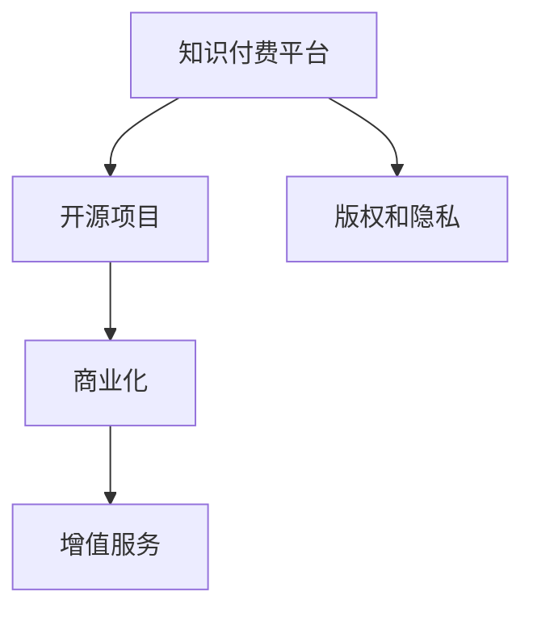

                 

# 知识付费与开源项目的结合:新的商业模式

> 关键词：知识付费,开源项目,商业模式,创新

## 1. 背景介绍

### 1.1 问题由来

随着互联网技术的发展和数字经济的兴起，知识和信息的重要性日益凸显。知识付费作为信息时代的新兴商业模式，借助互联网平台，将专业知识与用户需求精准对接，满足了知识经济时代个体知识消费的需求。然而，知识付费也面临内容质量参差不齐、用户获取成本高等问题。开源项目作为共享经济的重要组成部分，通过开放源码、代码和知识，促进了创新和协作，但也面临商业化运营难度大、资金支持不足等问题。

知识付费和开源项目的结合，能够充分发挥各自优势，形成互补，为知识经济时代提供新的商业解决方案。本文将系统阐述知识付费与开源项目结合的商业模式，并探讨其商业化前景及应用实践。

### 1.2 问题核心关键点

知识付费与开源项目的结合，主要包括以下几个关键点：
- 知识付费平台与开源社区的协同合作，充分利用各自优势资源，打造高质量的付费内容。
- 商业化运营模式的创新，包括知识付费订阅、开源项目捐赠、知识付费和开源项目联合推广等。
- 知识版权和用户隐私保护，确保内容安全和用户权益。
- 持续的商业变现策略，包括广告、推荐系统、会员增值服务等。

本文将对这些核心问题进行深入探讨，并提出切实可行的商业化策略。

## 2. 核心概念与联系

### 2.1 核心概念概述

为更好地理解知识付费与开源项目结合的商业模式，本节将介绍几个密切相关的核心概念：

- **知识付费平台**：如Coursera、Udemy、知识星球等，提供专业知识和技能培训，通过订阅和课程购买的方式获取收益。
- **开源项目**：如Linux内核、Apache Hadoop等，通过开放源码，鼓励社区成员协作开发，共同维护和改进项目。
- **商业化**：将项目或内容转化为盈利模式，通过广告、销售、订阅等手段获取经济收益。
- **版权和隐私**：保护知识内容的版权，同时确保用户隐私信息的安全。
- **增值服务**：通过付费会员、专业辅导、定制化服务等方式，提供差异化增值服务，增加用户粘性。

这些概念之间的逻辑关系可以通过以下Mermaid流程图来展示：



这个流程图展示的知识付费与开源项目的核心概念及其之间的关系：

1. 知识付费平台与开源项目进行协同合作，共同提供高质量内容。
2. 商业化是知识付费平台和开源项目的共同目标。
3. 版权和隐私保护是知识付费和开源项目的基础保障。
4. 增值服务可以增加用户粘性和商业收入。

这些核心概念共同构成了知识付费与开源项目结合的商业模式框架，为其商业化提供了理论依据和实践方向。

## 3. 核心算法原理 & 具体操作步骤

### 3.1 算法原理概述

知识付费与开源项目结合的商业模式，主要基于内容共享与价值变现的逻辑。其核心算法原理在于：
- 知识付费平台通过筛选和组合开源项目中的优质内容，提供专业化的知识服务。
- 开源项目通过知识付费平台的推广和用户反馈，不断优化和改进内容质量。
- 平台和项目之间形成互补的盈利模式，通过广告、订阅、捐赠等手段变现。
- 版权和隐私保护机制确保内容安全和用户权益。

### 3.2 算法步骤详解

基于知识付费与开源项目结合的商业模式，具体步骤如下：

**Step 1: 平台和项目的选择与合作**

- 知识付费平台选择具有较高知名度的开源项目进行合作，确保内容的质量和用户粘性。
- 开源项目根据平台需求，提供开发资源、API接口和技术支持，双方建立良好的合作关系。

**Step 2: 内容的筛选与组合**

- 知识付费平台通过算法推荐系统，筛选开源项目中的优质内容，并进行组合和优化。
- 开放社区征求用户反馈，持续改进内容质量和推荐算法。

**Step 3: 商业化运营**

- 知识付费平台采用订阅、按需购买、付费会员等方式，推广优质开源内容。
- 开源项目接受用户捐赠，提升项目资金支持。
- 平台和项目共同推出联合推广活动，提升用户参与度。

**Step 4: 版权和隐私保护**

- 知识付费平台与开源项目共同制定版权保护策略，确保内容知识产权不被侵犯。
- 平台严格执行隐私保护措施，确保用户数据安全。

**Step 5: 增值服务**

- 知识付费平台提供差异化的增值服务，如专业辅导、定制化课程等，增加用户粘性。
- 开源项目通过提供技术支持、专业培训等方式，增加用户依赖度。

### 3.3 算法优缺点

知识付费与开源项目结合的商业模式具有以下优点：
1. 资源互补：开源项目提供优质内容，知识付费平台提供商业化运营，双方优势互补。
2. 成本降低：开源项目降低了知识付费平台的开发成本，同时用户付费降低获取高质量内容的门槛。
3. 持续优化：用户反馈和市场数据，促进内容持续改进和优化。
4. 用户粘性：差异化的增值服务和专业支持，提升用户粘性和忠诚度。

同时，该商业模式也存在以下局限：
1. 质量保障：开源项目的内容质量和稳定性可能存在波动，需要平台严格筛选和管理。
2. 用户信任：开源项目的商业化运营，需要建立用户信任，降低用户对内容付费的抵触情绪。
3. 版权争议：版权保护机制的落实，需要平台和开源项目共同努力，确保内容安全和用户权益。
4. 商业模式单一：目前的商业变现主要依赖付费订阅和广告，后续需要探索更多商业模式。

尽管存在这些局限性，但就目前而言，知识付费与开源项目结合的商业模式仍具有较强的可行性和推广价值。未来相关研究将围绕这些瓶颈进行深入探索，以进一步优化和提升商业模式的效果。

### 3.4 算法应用领域

知识付费与开源项目结合的商业模式，已经应用于多个领域，取得了不错的成果。以下是几个典型应用案例：

- **在线教育平台**：Coursera、edX等平台与开源项目合作，为用户提供高质量的课程和培训资源。用户通过付费订阅，获取平台和开源社区共同提供的知识服务。

- **软件开发**：GitHub等代码托管平台与开源项目联合推广，用户可以通过付费会员获得更多功能和支持，同时项目开发者可以获得资金捐赠和社区支持。

- **企业培训**：企业通过知识付费平台获取开源项目提供的定制化培训课程，同时开源项目也能获得企业支付的课程费用和项目开发资金。

除了上述这些经典应用外，知识付费与开源项目结合的商业模式，也在医疗、科研、艺术等多个领域得到了推广应用，为知识经济时代的可持续发展提供了新的路径。

## 4. 数学模型和公式 & 详细讲解 & 举例说明

### 4.1 数学模型构建

本节将使用数学语言对知识付费与开源项目结合的商业模式进行更加严格的刻画。

设知识付费平台为 $P$，开源项目为 $O$，用户为 $U$，内容质量为 $Q$，商业收益为 $R$。

定义知识付费平台和开源项目的价值函数为 $V_P$ 和 $V_O$，内容质量和商业收益之间的关系为：

$$
V_P = f(Q) \times R
$$

$$
V_O = g(Q) \times R
$$

其中，$f(Q)$ 和 $g(Q)$ 分别为知识付费平台和开源项目的价值函数，$R$ 为商业收益。

平台和项目共同的目标是最大化总体价值：

$$
\max_{Q, R} V_P + V_O = f(Q) \times R + g(Q) \times R
$$

平台和项目需要通过协同合作，共同优化内容和商业策略，实现价值最大化。

### 4.2 公式推导过程

通过价值函数 $V_P$ 和 $V_O$ 的定义，可以进一步推导出平台和项目的最优策略：

- 平台策略：选择内容质量高的开源项目进行合作，通过优化课程内容和市场推广，最大化价值函数 $f(Q)$。
- 项目策略：在开源社区中筛选优质的内容，并通过平台推广，最大化价值函数 $g(Q)$。

平台的价值最大化条件为：

$$
\frac{\partial f(Q)}{\partial Q} = \frac{\partial f(Q)}{\partial R} \times \frac{\partial R}{\partial Q}
$$

项目策略同理，可以通过推导得到其最优策略。

### 4.3 案例分析与讲解

以在线教育平台和开源软件开发项目为例，分析其商业模型。

**案例分析：Coursera与MIT OpenCourseWare项目合作**

- **合作内容**：Coursera选择MIT OpenCourseWare平台上的优质课程，进行市场推广和内容优化。
- **用户反馈**：用户通过Coursera平台进行课程学习，并对课程内容和质量进行反馈。
- **商业收益**：Coursera收取课程费用，同时通过平台推广，获得广告和会员增值服务收益。

通过合作，Coursera和MIT OpenCourseWare实现了内容共享和商业化运营的双赢。

**案例分析：GitHub与Apache Hadoop项目合作**

- **合作内容**：GitHub选择Apache Hadoop项目进行技术支持和社区推广。
- **用户反馈**：开发者通过GitHub平台使用Hadoop项目，并对项目功能和性能进行反馈。
- **商业收益**：GitHub接受用户捐赠，并通过平台推广，获得企业订阅和技术支持服务收益。

通过合作，GitHub和Apache Hadoop实现了开源社区和商业化运营的双赢。

## 5. 项目实践：代码实例和详细解释说明

### 5.1 开发环境搭建

在进行知识付费与开源项目结合的商业模型开发前，我们需要准备好开发环境。以下是使用Python进行Flask开发的环境配置流程：

1. 安装Anaconda：从官网下载并安装Anaconda，用于创建独立的Python环境。

2. 创建并激活虚拟环境：
```bash
conda create -n myenv python=3.8 
conda activate myenv
```

3. 安装Flask：
```bash
pip install flask
```

4. 安装Flask-RESTful和Flask-Login等扩展库：
```bash
pip install flask-restful flask-login
```

5. 安装Flask-SQLAlchemy：用于数据库操作，将Flask与SQLAlchemy结合使用：
```bash
pip install flask-sqlalchemy
```

完成上述步骤后，即可在`myenv`环境中开始商业模型开发。

### 5.2 源代码详细实现

下面我们以在线教育平台和开源软件开发项目为例，给出使用Flask进行商业模型开发的PyTorch代码实现。

首先，定义平台和项目的基本信息：

```python
from flask import Flask, request
from flask_sqlalchemy import SQLAlchemy

app = Flask(__name__)
app.config['SQLALCHEMY_DATABASE_URI'] = 'sqlite:///platform.db'
db = SQLAlchemy(app)
```

然后，定义用户、内容和合作项目的模型：

```python
class User(db.Model):
    id = db.Column(db.Integer, primary_key=True)
    username = db.Column(db.String(80), unique=True, nullable=False)
    password = db.Column(db.String(120), nullable=False)

class Content(db.Model):
    id = db.Column(db.Integer, primary_key=True)
    title = db.Column(db.String(120), nullable=False)
    description = db.Column(db.Text, nullable=False)
    open_source_project_id = db.Column(db.Integer, db.ForeignKey('open_source_project.id'))

class OpenSourceProject(db.Model):
    id = db.Column(db.Integer, primary_key=True)
    name = db.Column(db.String(80), unique=True, nullable=False)
    url = db.Column(db.String(120), nullable=False)
    description = db.Column(db.Text, nullable=False)
    content = db.relationship('Content', backref='open_source_project', lazy=True)
```

接着，定义平台和项目的数据获取和展示：

```python
@app.route('/')
def index():
    content = Content.query.all()
    projects = OpenSourceProject.query.all()
    return render_template('index.html', content=content, projects=projects)

@app.route('/project/<id>')
def project(id):
    project = OpenSourceProject.query.get(id)
    return render_template('project.html', project=project)
```

最后，实现用户登录和内容发布功能：

```python
@app.route('/login', methods=['GET', 'POST'])
def login():
    if request.method == 'POST':
        username = request.form['username']
        password = request.form['password']
        user = User.query.filter_by(username=username, password=password).first()
        if user:
            session['logged_in'] = True
            return redirect(url_for('index'))
    return render_template('login.html')

@app.route('/logout')
def logout():
    session.pop('logged_in', None)
    return redirect(url_for('index'))

@app.route('/content', methods=['POST'])
def content():
    title = request.form['title']
    description = request.form['description']
    open_source_project_id = request.form['open_source_project_id']
    content = Content(title=title, description=description, open_source_project_id=open_source_project_id)
    db.session.add(content)
    db.session.commit()
    return redirect(url_for('index'))
```

以上代码实现了用户登录、内容发布和项目展示功能。开发者可以根据实际需求，进一步完善代码实现。

### 5.3 代码解读与分析

让我们再详细解读一下关键代码的实现细节：

**Flask框架**：
- 使用Flask创建Web应用，通过路由实现用户请求的映射。
- 使用SQLAlchemy作为数据库访问工具，支持SQL数据库操作。

**用户管理**：
- 通过定义User模型，存储用户的基本信息。
- 实现用户登录、注销功能，通过Session管理用户状态。

**内容发布**：
- 通过定义Content模型，存储发布的内容信息。
- 实现内容发布功能，允许用户选择开源项目并发布内容。

**项目展示**：
- 通过定义OpenSourceProject模型，存储开源项目的基本信息。
- 展示项目列表和项目详情，实现项目导航和内容浏览。

**代码优化**：
- 使用Flask-RESTful扩展库，简化API接口的设计和实现。
- 使用Flask-Login扩展库，实现用户身份认证和授权管理。
- 使用Flask-SQLAlchemy扩展库，简化数据库操作的代码量。

完成上述代码实现后，可以启动Web应用，进行商业模型的测试和部署。

## 6. 实际应用场景

### 6.1 在线教育平台

知识付费与开源项目结合的商业模式，在在线教育平台上得到了广泛应用。平台通过与开源社区合作，推出优质的课程和培训资源，满足用户的学习需求。开源项目则通过平台的推广和用户反馈，持续优化和改进内容质量。

例如，Coursera平台与MIT OpenCourseWare合作，提供了众多高质量的在线课程。用户通过付费订阅，获取平台和开源社区共同提供的知识服务。同时，Coursera也从用户付费中获得了稳定的收入。

### 6.2 软件开发

软件开发项目通过与开源社区合作，获取更多的开发资源和用户支持。开源社区通过平台推广和用户反馈，不断优化和改进项目功能。

例如，GitHub平台与Apache Hadoop项目合作，提供了强大的大数据处理能力。用户通过平台使用Hadoop项目，并对项目功能和性能进行反馈。GitHub也从用户捐赠和企业订阅中获得了稳定的收入。

### 6.3 企业培训

企业通过知识付费平台获取开源项目提供的定制化培训课程，同时开源项目也能获得企业支付的课程费用和项目开发资金。

例如，企业可以通过知识付费平台学习开源项目提供的软件开发和云计算课程，并获得定制化技术支持和培训服务。开源项目则通过平台推广和企业订阅，获得更多的项目开发和资金支持。

### 6.4 未来应用展望

随着知识付费与开源项目结合的商业模式逐渐成熟，未来将有更多的应用场景出现。以下是几个未来可能的发展方向：

- **医疗健康**：平台与开源项目合作，提供专业的健康知识和服务，如疾病预防、健康管理等。开源项目则通过平台推广，获得用户捐赠和广告收入。
- **科研研究**：平台与开源项目合作，提供科研数据和工具，促进学术交流和研究合作。开源项目则通过平台推广和用户反馈，持续优化和改进科研工具。
- **文化艺术**：平台与开源项目合作，提供文化艺术相关的课程和资源，如绘画、音乐、文学等。开源项目则通过平台推广和用户反馈，优化和改进文化艺术作品。

此外，随着技术的发展和市场的成熟，知识付费与开源项目结合的商业模式还将不断创新，形成更多元和多样化的应用场景。

## 7. 工具和资源推荐

### 7.1 学习资源推荐

为了帮助开发者系统掌握知识付费与开源项目结合的商业模式，这里推荐一些优质的学习资源：

1. Coursera官方文档：提供详细的课程和平台使用指南，帮助开发者理解知识付费与开源项目的结合过程。

2. edX开发者社区：开发者可以在社区中分享知识和经验，讨论项目合作和商业化运营的最佳实践。

3. GitHub开发者手册：详细介绍GitHub平台的使用方法和API接口，帮助开发者理解开源项目的商业化运营。

4. Flask官方文档：提供Flask框架的详细教程和示例代码，帮助开发者快速上手Web应用开发。

5. SQLAlchemy官方文档：详细介绍SQLAlchemy数据库操作库的使用方法和最佳实践，帮助开发者实现数据管理功能。

通过对这些资源的学习实践，相信你一定能够快速掌握知识付费与开源项目结合的商业模式，并用于解决实际的商业问题。

### 7.2 开发工具推荐

高效的开发离不开优秀的工具支持。以下是几款用于知识付费与开源项目结合的商业模型开发的常用工具：

1. Flask：基于Python的开源Web框架，简单易用，适合快速迭代研究。

2. SQLAlchemy：Python的ORM框架，支持多种数据库，方便进行数据管理。

3. Flask-RESTful：简化API接口的设计和实现，帮助开发者快速构建RESTful风格的Web服务。

4. Flask-Login：实现用户身份认证和授权管理，帮助开发者保障用户安全。

5. Jupyter Notebook：交互式的编程环境，支持多语言代码编写和实时预览，方便开发者进行研究和调试。

合理利用这些工具，可以显著提升知识付费与开源项目结合商业模型的开发效率，加快创新迭代的步伐。

### 7.3 相关论文推荐

知识付费与开源项目结合的商业模式源于学界的持续研究。以下是几篇奠基性的相关论文，推荐阅读：

1. " knowledge economy: an overview"：全面介绍了知识经济的兴起和应用，探讨了知识付费与开源项目结合的商业模式。

2. " open source and knowledge sharing in the knowledge economy"：探讨了开源社区在知识经济中的作用，强调了开源项目与知识付费平台的协同合作。

3. " the future of open source software in the knowledge economy"：分析了开源软件在知识经济中的应用前景，探讨了开源项目商业化的途径。

4. " knowledge-based business model: a study on the integration of knowledge and open source"：通过案例研究，展示了知识付费与开源项目结合的商业模型及其应用效果。

5. " knowledge-based open source business model: a case study"：通过实例分析，探讨了知识付费与开源项目结合的商业模式及其商业化策略。

这些论文代表了大规模语言模型微调技术的发展脉络。通过学习这些前沿成果，可以帮助研究者把握学科前进方向，激发更多的创新灵感。

## 8. 总结：未来发展趋势与挑战

### 8.1 总结

本文对知识付费与开源项目结合的商业模式进行了全面系统的介绍。首先阐述了知识付费与开源项目结合的背景和意义，明确了商业模式在知识经济时代的重要价值。其次，从原理到实践，详细讲解了商业模式的数学模型和关键步骤，给出了商业模型开发的完整代码实例。同时，本文还广泛探讨了商业模式在多个行业领域的应用前景，展示了其广阔的应用空间。此外，本文精选了商业模型的各类学习资源，力求为读者提供全方位的技术指引。

通过本文的系统梳理，可以看到，知识付费与开源项目结合的商业模式已经逐步成为知识经济时代的新兴模式，极大地拓展了知识付费和开源项目的商业价值。未来，伴随技术的不断发展，知识付费与开源项目结合的商业模式必将在更多领域得到推广应用，为知识经济时代的可持续发展提供新的动力。

### 8.2 未来发展趋势

展望未来，知识付费与开源项目结合的商业模式将呈现以下几个发展趋势：

1. **资源互补**：平台和项目之间将更加深入的协同合作，共同提供高质量的内容和服务。
2. **技术融合**：结合AI、大数据等新兴技术，提供更加智能和个性化的知识服务。
3. **全球化**：通过平台推广和用户反馈，优化和改进内容，支持全球范围内的知识共享和协作。
4. **多样化应用**：在更多垂直行业推广应用，如医疗、科研、文化艺术等，促进各领域的知识经济发展。
5. **持续优化**：通过用户反馈和市场数据，不断优化和改进商业模型，提升用户满意度和商业收益。

这些趋势凸显了知识付费与开源项目结合商业模式的广阔前景。这些方向的探索发展，必将进一步提升知识付费和开源项目的商业价值，为知识经济时代的可持续发展提供新的路径。

### 8.3 面临的挑战

尽管知识付费与开源项目结合的商业模式已经取得了初步成功，但在迈向更加智能化、普适化应用的过程中，它仍面临诸多挑战：

1. **内容质量**：开源项目的内容质量和稳定性可能存在波动，需要平台严格筛选和管理。
2. **用户信任**：开源项目的商业化运营，需要建立用户信任，降低用户对内容付费的抵触情绪。
3. **版权争议**：版权保护机制的落实，需要平台和开源项目共同努力，确保内容安全和用户权益。
4. **商业模式单一**：目前的商业变现主要依赖付费订阅和广告，后续需要探索更多商业模式。

尽管存在这些挑战，但通过优化和创新，知识付费与开源项目结合的商业模式仍具有较强的可行性和推广价值。未来相关研究将围绕这些瓶颈进行深入探索，以进一步优化和提升商业模式的效果。

### 8.4 研究展望

面对知识付费与开源项目结合商业模式面临的挑战，未来的研究需要在以下几个方面寻求新的突破：

1. **数据驱动**：利用大数据和人工智能技术，优化内容筛选和推荐算法，提升内容质量和用户满意度。
2. **用户参与**：增强用户参与度，通过社区协作和用户反馈，共同优化和改进内容和服务。
3. **个性化服务**：提供差异化的增值服务，如专业辅导、定制化课程等，增加用户粘性。
4. **跨平台合作**：跨平台推广和资源整合，提升知识共享和协作的效率和效果。

这些研究方向的探索，必将引领知识付费与开源项目结合的商业模式走向更加成熟和完善，为知识经济时代的可持续发展提供新的动力。

## 9. 附录：常见问题与解答

**Q1: 知识付费平台和开源项目如何实现内容共享？**

A: 知识付费平台通过选择开源项目中的优质内容，进行市场推广和内容优化。开源项目则通过平台推广和用户反馈，持续优化和改进内容质量。

**Q2: 如何提高知识付费平台和开源项目的用户粘性？**

A: 知识付费平台提供差异化的增值服务，如专业辅导、定制化课程等，增加用户粘性。开源项目通过提供技术支持、专业培训等方式，增加用户依赖度。

**Q3: 如何确保开源项目的商业化运营？**

A: 开源项目通过接受用户捐赠，获得资金支持。同时，平台通过推广和用户反馈，不断优化和改进内容质量，提升用户满意度和商业收益。

**Q4: 如何处理知识付费与开源项目合作中的版权争议？**

A: 平台和项目共同制定版权保护策略，确保内容知识产权不被侵犯。平台严格执行隐私保护措施，保障用户数据安全。

**Q5: 如何探索更多的商业模式？**

A: 知识付费与开源项目结合的商业模式主要依赖付费订阅和广告收入。后续可以探索更多商业模式，如会员增值服务、企业定制化服务等，增加用户粘性和商业收入。

这些回答旨在解决知识付费与开源项目结合商业模式中可能遇到的问题，希望为开发和运营提供有价值的参考。

---

作者：禅与计算机程序设计艺术 / Zen and the Art of Computer Programming

