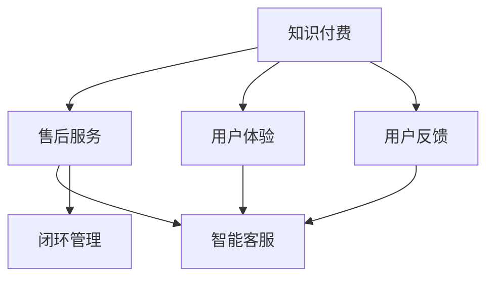

                 

# 知识付费产品的售后服务体系构建

> 关键词：知识付费、产品售后服务、用户体验、技术方案、客户反馈

## 1. 背景介绍

### 1.1 问题由来
随着互联网和移动互联网的快速发展，知识付费成为一种新兴的商业模式，通过在线平台提供各类知识产品，满足用户学习和提升自我的需求。然而，知识付费产品并不仅止于内容交付，还需要构建完善的售后服务体系，以保障用户权益，提升产品满意度，增强品牌忠诚度。

售后服务体系不仅关系到用户的实际体验，也是产品竞争力的重要体现。优秀的售后服务能够帮助企业在激烈的市场竞争中脱颖而出，建立良好的品牌口碑。因此，构建一套全面、高效、智能的售后服务体系，成为知识付费平台的重要课题。

### 1.2 问题核心关键点
构建知识付费产品售后服务体系的核心在于：
- 明确售后服务的内容和流程。
- 构建智能化的售后服务系统。
- 优化用户体验，提高用户满意度。
- 及时响应和处理用户反馈。
- 持续改进售后服务体系，实现闭环管理。

## 2. 核心概念与联系

### 2.1 核心概念概述

为更好地理解知识付费产品售后服务体系的构建，本节将介绍几个密切相关的核心概念：

- **知识付费**：指通过在线平台提供付费知识内容，满足用户学习和自我提升需求的一种商业模式。常见形式包括在线课程、电子书、音频讲座等。

- **售后服务**：指在产品销售后，针对用户的反馈和需求，提供一系列跟进和解决问题的服务。包括客服咨询、技术支持、内容更新、投诉处理等。

- **用户体验(UX)**：指用户在使用产品过程中，对产品的整体感受和满意度。优质的用户体验能够提升用户粘性，促进重复购买。

- **用户反馈**：指用户在使用产品过程中，对产品功能、内容、服务等方面的意见和建议。及时获取用户反馈，有助于产品改进和迭代。

- **闭环管理**：指通过售后服务流程的各个环节，实现信息的闭环流通，确保每个用户问题都能得到及时、有效的处理。

- **智能客服**：指通过人工智能技术实现自动化客服，提升响应速度和处理效率，降低人力成本。

这些核心概念之间的逻辑关系可以通过以下Mermaid流程图来展示：



这个流程图展示了几类核心概念及其之间的关系：

1. 知识付费提供基础产品，售后服务和用户体验进一步提升用户满意度和粘性。
2. 用户反馈是产品优化和改进的重要依据。
3. 智能客服通过自动化流程提高响应速度和效率。
4. 闭环管理确保售后服务流程的各个环节信息畅通，问题得到及时解决。

## 3. 核心算法原理 & 具体操作步骤
### 3.1 算法原理概述

知识付费产品售后服务体系的构建，本质上是一个服务流程优化和管理的问题。其核心思想是：通过构建智能化的售后服务系统，结合用户反馈和需求，不断优化售后服务流程，提升用户体验。

具体而言，售后服务体系的目标包括：
- 提升用户满意度：通过快速响应用户反馈，解决用户问题，提高用户对产品的信任和满意。
- 提高服务效率：通过自动化工具和技术，减少人工干预，提升服务处理速度和效率。
- 优化售后服务流程：通过数据分析和反馈，不断优化服务流程，提高服务质量和用户体验。
- 构建智能客服：通过自然语言处理和机器学习技术，实现自动化客服，提升用户体验。

### 3.2 算法步骤详解

知识付费产品售后服务体系的构建一般包括以下几个关键步骤：

**Step 1: 需求分析和流程设计**
- 调研目标用户群体，了解常见问题和痛点。
- 设计售后服务流程，明确每个环节的职责和操作流程。
- 制定服务标准和规范，确保服务质量。

**Step 2: 构建智能客服系统**
- 选择合适的智能客服技术，如NLP、RPA等。
- 构建知识库，存储常见问题及其解答。
- 训练机器学习模型，实现自动分流和问题识别。

**Step 3: 数据收集与分析**
- 收集用户反馈和投诉数据，分类整理。
- 分析用户反馈，提取常见问题和需求。
- 利用数据分析工具，定期生成服务质量报告。

**Step 4: 服务优化与改进**
- 根据用户反馈和数据分析结果，优化售后服务流程。
- 更新知识库，加入新问题和解决方案。
- 引入自动化工具，提升服务效率。

**Step 5: 用户反馈循环**
- 定期收集用户反馈，了解服务满意度。
- 分析用户反馈，识别改进点。
- 实施改进措施，形成闭环管理。

### 3.3 算法优缺点

构建知识付费产品售后服务体系的优势包括：
- 提升用户满意度：通过快速响应用户需求，提高用户对产品的信任和满意度。
- 提高服务效率：通过自动化工具和技术，减少人工干预，提升服务处理速度和效率。
- 优化售后服务流程：通过数据分析和反馈，不断优化服务流程，提高服务质量和用户体验。
- 构建智能客服：通过自然语言处理和机器学习技术，实现自动化客服，提升用户体验。

同时，该方法也存在一定的局限性：
- 初始投入较大：构建和维护智能客服系统需要较高的技术投入和数据准备。
- 对数据质量依赖高：智能客服和数据分析效果依赖于高质量的用户反馈数据。
- 可能存在误识别：自动化工具可能对用户问题的识别存在误差，需要人工干预和审核。
- 服务质量难以全面保证：尽管自动化技术可以提升效率，但人工服务的温暖和个性化难以完全替代。

尽管存在这些局限性，但就目前而言，构建智能化售后服务体系是大势所趋，必将对知识付费产品的用户体验和服务质量产生深远影响。

### 3.4 算法应用领域

构建知识付费产品售后服务体系，适用于多种业务场景，例如：

- 在线课程平台：为用户提供课程内容更新、问题解答、技术支持等服务。
- 电子书阅读平台：提供电子书下载、内容更新、技术支持等服务。
- 音频讲座平台：提供音频内容更新、问题解答、技术支持等服务。
- 技能培训平台：提供培训课程更新、问题解答、技术支持等服务。
- 学习社区平台：提供学习资源分享、问题解答、技术支持等服务。

除了上述这些主要应用场景外，售后服务体系还可以拓展到更多领域，如教育培训、企业培训、个人知识管理等，为各类知识付费产品提供通用的服务支持。

## 4. 数学模型和公式 & 详细讲解 & 举例说明

### 4.1 数学模型构建

在构建知识付费产品售后服务体系时，涉及到的数学模型主要包括：
- 用户反馈分析模型：用于对用户反馈进行分类、聚类、情感分析等。
- 服务效率优化模型：用于优化服务流程，减少处理时间。
- 用户满意度预测模型：用于预测用户满意度和忠诚度。

### 4.2 公式推导过程

以下我们将以用户反馈分析模型为例，推导其基本公式。

假设用户反馈数据集为 $D=\{(x_i, y_i)\}_{i=1}^N, x_i$ 表示用户反馈的文本，$y_i$ 表示用户反馈的情感分类标签。我们需要构建一个情感分类模型，将用户反馈分为正面、负面、中性三类。

设模型的输入为 $x_i$，输出为 $y_i$。定义损失函数为交叉熵损失，则模型训练的目标为最小化损失函数：

$$
\mathcal{L}(\theta) = -\frac{1}{N} \sum_{i=1}^N \sum_{j=1}^3 y_{ij}\log p_{ij}
$$

其中 $p_{ij}=\frac{e^{w_j^T x_i}}{\sum_{k=1}^K e^{w_k^T x_i}}$ 为模型的预测概率。$w_k$ 为模型参数，$K$ 为情感分类数目。

通过梯度下降算法，更新模型参数 $w_k$，使得损失函数最小化。公式为：

$$
w_k \leftarrow w_k - \eta \nabla_{w_k}\mathcal{L}(\theta)
$$

其中 $\eta$ 为学习率。

通过上述推导，我们可以看到，用户反馈分析模型实际上是一个二分类问题的多标签分类模型，目标是最小化交叉熵损失，通过梯度下降更新模型参数，使得预测概率与实际标签的差异最小化。

### 4.3 案例分析与讲解

假设某知识付费平台收集了大量用户反馈数据，每个反馈包含一个文本描述和情感标签。平台决定使用情感分类模型来自动处理这些反馈，以便及时响应和解决用户问题。

首先，平台对收集到的用户反馈进行预处理，包括去除停用词、词干提取、分词等。然后，将处理后的文本输入情感分类模型，模型根据训练得到的参数，计算每个情感标签的概率。

例如，用户反馈 "课程内容深度不够，建议增加更多实例讲解"，模型计算得到正面的概率为0.8，负面的概率为0.1，中性的概率为0.1。根据概率最高的标签，模型判断用户反馈为正面。

最终，平台根据情感分类结果，分配给相应部门的客服进行处理。如果反馈为负面，则触发进一步的用户满意度调查和改进措施。

## 5. 项目实践：代码实例和详细解释说明
### 5.1 开发环境搭建

在进行售后服务体系构建实践前，我们需要准备好开发环境。以下是使用Python进行Flask开发的环境配置流程：

1. 安装Anaconda：从官网下载并安装Anaconda，用于创建独立的Python环境。

2. 创建并激活虚拟环境：
```bash
conda create -n flask-env python=3.8 
conda activate flask-env
```

3. 安装Flask：
```bash
pip install flask
```

4. 安装相关依赖包：
```bash
pip install numpy pandas scikit-learn nltk
```

完成上述步骤后，即可在`flask-env`环境中开始售后服务体系构建的开发工作。

### 5.2 源代码详细实现

下面以构建智能客服系统为例，给出使用Flask和NLTK库进行情感分析的Python代码实现。

首先，定义情感分类模型：

```python
from sklearn.feature_extraction.text import CountVectorizer
from sklearn.svm import SVC
from sklearn.pipeline import Pipeline

# 定义文本分词器
tokenizer = CountVectorizer(stop_words='english', lowercase=True)

# 定义分类器
clf = Pipeline(steps=[('vect', CountVectorizer()), ('clf', SVC())])
clf.fit(X_train, y_train)
```

然后，定义Flask应用程序：

```python
from flask import Flask, request, jsonify

app = Flask(__name__)

# 定义预测接口
@app.route('/predict', methods=['POST'])
def predict():
    data = request.json
    feedback = data['feedback']
    label = clf.predict([feedback])[0]
    return jsonify({'label': label})

if __name__ == '__main__':
    app.run(debug=True)
```

最后，启动Flask应用程序：

```bash
flask run
```

以上就是使用Flask和NLTK库进行情感分析的完整代码实现。可以看到，借助Flask的轻量级和易用性，情感分析模型能够快速部署为在线服务，方便用户调用。

### 5.3 代码解读与分析

让我们再详细解读一下关键代码的实现细节：

**模型训练代码**：
- `CountVectorizer`：用于将文本转化为词袋模型，提取特征。
- `SVC`：用于构建支持向量机分类器，对情感进行分类。
- `Pipeline`：将多个组件组成管道，简化训练流程。

**Flask代码**：
- `@app.route`：定义Flask路由，接收用户反馈，调用模型进行情感分类。
- `request.json`：从请求中获取JSON格式的用户反馈数据。
- `jsonify`：将模型预测结果转换为JSON格式，返回给用户。

**启动代码**：
- `app.run(debug=True)`：启动Flask应用程序，并设置debug模式，方便调试。

通过上述代码，我们可以看到，Flask和NLTK库能够快速构建出一个简单的情感分类API，实现用户反馈的自动化处理。开发者可以在此基础上进一步扩展功能，如添加更多分类器、实现多情感分类、优化模型效果等。

## 6. 实际应用场景
### 6.1 在线课程平台

在线课程平台可以借助智能客服和售后服务体系，提升用户满意度和留存率。具体而言，平台可以构建以下服务体系：
- 课程更新提醒：自动根据用户反馈和数据，推送课程更新通知。
- 课程问题解答：提供24小时智能客服，解答用户课程相关问题。
- 课程满意度调查：定期通过邮件、问卷等方式，收集用户对课程的满意度反馈。
- 课程改进措施：根据用户反馈和满意度调查结果，不断优化课程内容和形式。

例如，某在线编程课程平台收集到大量用户反馈，内容普遍认为课程难度过高，建议增加更多实例讲解。平台根据情感分类模型分析用户反馈，判断为负面。随后，平台快速组织专家团队修改课程内容，并进行课程更新。

### 6.2 电子书阅读平台

电子书阅读平台可以借助智能客服和售后服务体系，提升用户阅读体验。具体而言，平台可以构建以下服务体系：
- 电子书推荐：根据用户阅读历史和反馈，推荐相关电子书。
- 电子书解析：提供电子书解析服务，帮助用户理解复杂内容。
- 电子书更新：根据用户反馈和需求，及时更新电子书内容。
- 电子书投诉处理：提供客服处理用户投诉，解决问题。

例如，某电子书阅读平台收集到用户反馈，认为某本医学电子书的部分章节翻译不准确，建议进行修正。平台根据情感分类模型分析用户反馈，判断为负面。随后，平台组织翻译团队修改翻译内容，并进行电子书更新。

### 6.3 技能培训平台

技能培训平台可以借助智能客服和售后服务体系，提升培训效果和用户满意度。具体而言，平台可以构建以下服务体系：
- 培训课程更新：根据用户反馈和数据，定期更新培训课程内容。
- 培训课程推荐：根据用户兴趣和反馈，推荐相关培训课程。
- 培训课程解答：提供24小时智能客服，解答用户培训相关问题。
- 培训课程满意度调查：定期通过邮件、问卷等方式，收集用户对培训课程的满意度反馈。

例如，某技能培训平台收集到用户反馈，认为某门编程课程的教学方法不够直观，建议改进。平台根据情感分类模型分析用户反馈，判断为负面。随后，平台组织培训团队改进教学方法，并进行课程更新。

### 6.4 未来应用展望

随着知识付费产品的普及和用户需求的多样化，智能客服和售后服务体系将发挥越来越重要的作用。未来，基于智能客服和售后服务体系的知识付费产品将呈现出以下几个发展趋势：

1. 更加个性化：通过用户行为分析，提供更个性化的推荐和服务。
2. 更加高效：借助自动化工具和技术，提高服务响应速度和效率。
3. 更加智能化：通过深度学习和自然语言处理技术，实现更智能化的服务。
4. 更加多模态：结合文本、图像、音频等多模态数据，提供更全面的服务。
5. 更加用户友好：提升用户界面和交互体验，让用户享受更舒适的使用体验。

相信在未来，知识付费产品的售后服务体系将不断完善，为用户带来更加智能、高效、个性化的服务体验，从而推动知识付费市场的健康发展。

## 7. 工具和资源推荐
### 7.1 学习资源推荐

为了帮助开发者系统掌握售后服务体系构建的理论基础和实践技巧，这里推荐一些优质的学习资源：

1. 《Python网络爬虫开发实战》系列博文：由知名IT博主撰写，涵盖网络爬虫、数据处理、Flask框架等基础知识，适合初学者入门。

2. 《自然语言处理入门》课程：Coursera平台上的自然语言处理课程，由斯坦福大学开设，涵盖NLP基本概念和经典模型，适合初学者和进阶者。

3. 《Flask Web Development with Python》书籍：Flask官方文档，详细介绍了Flask框架的使用方法和最佳实践，适合Flask开发入门和进阶。

4. 《Python机器学习实战》书籍：由知名机器学习专家撰写，涵盖机器学习基本概念和实用技巧，适合Python开发者入门和进阶。

5. 《智能客服系统建设指南》白皮书：由某知名AI公司发布，详细介绍了智能客服系统的设计思路和实现方法，适合开发者参考。

通过对这些资源的学习实践，相信你一定能够快速掌握售后服务体系的构建方法，并用于解决实际的NLP问题。

### 7.2 开发工具推荐

高效的开发离不开优秀的工具支持。以下是几款用于知识付费产品售后服务体系开发的常用工具：

1. Flask：轻量级的Web框架，适合快速构建API服务。

2. NLTK：自然语言处理工具库，提供了丰富的文本处理功能，适合文本分析。

3. Scikit-learn：机器学习工具库，提供了多种分类、回归、聚类等算法，适合构建情感分类模型。

4. TensorBoard：TensorFlow配套的可视化工具，可实时监测模型训练状态，提供丰富的图表呈现方式。

5. Weights & Biases：模型训练的实验跟踪工具，记录和可视化模型训练过程中的各项指标，方便对比和调优。

6. Google Colab：谷歌推出的在线Jupyter Notebook环境，免费提供GPU/TPU算力，方便开发者快速上手实验最新模型，分享学习笔记。

合理利用这些工具，可以显著提升知识付费产品售后服务体系的开发效率，加快创新迭代的步伐。

### 7.3 相关论文推荐

知识付费产品售后服务体系的构建，源于学界的持续研究。以下是几篇奠基性的相关论文，推荐阅读：

1. "Customer Service Systems: A Review and Future Directions"：综述了客户服务系统的现状和未来发展方向，强调了智能客服的重要性。

2. "Machine Learning for Customer Service"：探讨了机器学习在客户服务中的应用，包括情感分析、智能客服等。

3. "Building a Conversational AI with Python"：介绍了使用Python和自然语言处理技术构建智能客服系统的基本方法。

4. "Personalized Customer Service through Machine Learning"：探讨了通过机器学习实现个性化客户服务的方法，包括推荐系统和情感分析。

5. "An Introduction to Conversational AI"：介绍了对话系统和智能客服的基本概念和实现方法。

这些论文代表了大语言模型微调技术的发展脉络。通过学习这些前沿成果，可以帮助研究者把握学科前进方向，激发更多的创新灵感。

## 8. 总结：未来发展趋势与挑战

### 8.1 总结

本文对知识付费产品售后服务体系的构建进行了全面系统的介绍。首先阐述了售后服务体系的重要性，明确了构建体系的目标和内容。其次，从原理到实践，详细讲解了售后服务体系的数学模型和具体操作步骤，给出了构建售后服务体系的完整代码实例。同时，本文还广泛探讨了售后服务体系在各类知识付费平台的应用前景，展示了其巨大的市场潜力。最后，本文精选了售后服务体系的相关学习资源和开发工具，力求为读者提供全方位的技术指引。

通过本文的系统梳理，可以看到，构建知识付费产品售后服务体系对于提升用户满意度和留存率、推动知识付费市场发展具有重要意义。未来，随着知识付费市场的持续增长和用户需求的多样化，售后服务体系将在产品竞争中扮演越来越重要的角色。

### 8.2 未来发展趋势

展望未来，知识付费产品售后服务体系将呈现以下几个发展趋势：

1. 更加智能化：通过深度学习和自然语言处理技术，实现更智能化的服务。
2. 更加个性化：通过用户行为分析，提供更个性化的推荐和服务。
3. 更加高效：借助自动化工具和技术，提高服务响应速度和效率。
4. 更加多模态：结合文本、图像、音频等多模态数据，提供更全面的服务。
5. 更加用户友好：提升用户界面和交互体验，让用户享受更舒适的使用体验。

这些趋势凸显了售后服务体系的发展方向，必将为知识付费产品的用户体验和服务质量带来深远影响。

### 8.3 面临的挑战

尽管知识付费产品售后服务体系已经取得了一定的进展，但在迈向更加智能化、普适化应用的过程中，它仍面临着诸多挑战：

1. 数据隐私和安全：用户反馈和数据需要妥善处理，防止隐私泄露和数据滥用。
2. 系统复杂性：构建和维护售后服务体系需要较高技术水平，维护成本较高。
3. 模型鲁棒性：情感分类等模型的鲁棒性需要进一步提高，以应对数据变化和噪音。
4. 用户需求多样性：用户需求多样且动态变化，售后服务体系需要不断优化以适应。
5. 技术更新迭代：知识付费领域技术快速发展，售后服务体系需要持续升级。

尽管存在这些挑战，但随着技术的进步和行业的成熟，售后服务体系将不断完善，为用户提供更加智能、高效、个性化的服务体验。相信未来，知识付费产品的售后服务体系将迎来更多创新和突破，成为推动产品发展的关键力量。

### 8.4 研究展望

面向未来，知识付费产品售后服务体系的研究方向包括：

1. 探索智能客服系统的新方法：如强化学习、多模态融合、情感智能等。
2. 提高模型的鲁棒性和泛化能力：如对抗训练、迁移学习、知识增强等。
3. 构建多渠道服务体系：如电话客服、在线客服、社交媒体客服等。
4. 实现个性化推荐和服务：如基于用户行为数据的推荐系统、动态服务优化等。
5. 引入第三方服务：如聊天机器人、语音助手等，提升服务效率和质量。

这些研究方向将为知识付费产品售后服务体系带来更多创新和突破，推动知识付费市场的健康发展和用户满意度的提升。

## 9. 附录：常见问题与解答

**Q1：构建知识付费产品售后服务体系需要哪些技术支持？**

A: 构建知识付费产品售后服务体系需要以下技术支持：
- 自然语言处理(NLP)：用于文本分析和情感分类。
- 机器学习(ML)：用于分类、聚类、回归等任务。
- 深度学习(DL)：用于构建复杂的情感分类模型。
- 人工智能(AI)：用于智能客服和自动化服务。
- 数据分析和大数据处理：用于用户行为分析和反馈处理。

这些技术支持共同构成了知识付费产品售后服务体系的核心，能够帮助企业更好地理解和响应用户需求，提升产品竞争力和用户体验。

**Q2：用户反馈数据如何处理？**

A: 用户反馈数据通常需要进行预处理，包括去除停用词、词干提取、分词等。然后，可以使用文本分类、聚类、情感分析等方法对反馈进行分析和分类。根据反馈结果，分配给相应部门进行处理，制定改进措施。

例如，某知识付费平台收集到用户反馈，认为某门课程内容枯燥，建议增加互动环节。平台根据情感分类模型分析用户反馈，判断为负面。随后，平台组织课程团队增加互动环节，并进行课程更新。

**Q3：智能客服系统的优势是什么？**

A: 智能客服系统的优势包括：
- 24小时不间断服务：智能客服可以全年无休，随时响应用户需求。
- 快速响应和解决问题：智能客服能够快速识别用户问题，提供准确解答。
- 降低人力成本：智能客服可以替代部分人工客服，减少人力成本。
- 提高服务效率：智能客服能够同时处理多个用户请求，提高服务效率。
- 提升用户体验：智能客服能够提供一致、标准化的服务，提升用户满意度。

**Q4：售后服务体系如何实现闭环管理？**

A: 售后服务体系的闭环管理需要实现以下关键环节：
- 收集用户反馈：通过用户调查、客服记录等方式，收集用户反馈。
- 分析用户反馈：对用户反馈进行分类、聚类、情感分析等，提取关键信息。
- 制定改进措施：根据用户反馈，制定具体改进措施，如课程更新、功能优化等。
- 实施改进措施：执行改进措施，解决问题。
- 反馈用户处理结果：告知用户问题处理情况，收集用户满意度反馈。

例如，某知识付费平台收集到用户反馈，认为某门课程讲解不清楚，建议改进。平台根据情感分类模型分析用户反馈，判断为负面。随后，平台组织课程团队改进讲解方式，并进行课程更新。同时，平台通过邮件等方式告知用户问题处理结果，收集用户满意度反馈。

通过以上步骤，售后服务体系可以实现信息的闭环流通，确保每个用户问题都能得到及时、有效的处理。

**Q5：售后服务体系如何提升用户满意度？**

A: 售后服务体系可以通过以下方式提升用户满意度：
- 快速响应用户反馈：通过智能客服和自动化工具，快速识别和解决用户问题。
- 提供个性化服务：根据用户历史行为和反馈，提供个性化的推荐和服务。
- 定期收集用户反馈：通过问卷调查、用户访谈等方式，定期收集用户反馈，了解用户需求和满意度。
- 持续改进服务：根据用户反馈和数据分析结果，不断优化售后服务流程和产品功能。
- 构建用户信任：提供透明、及时的服务反馈和改进措施，增强用户信任感。

例如，某知识付费平台定期通过邮件和问卷收集用户反馈，发现用户普遍对课程推荐系统不满意。平台根据用户反馈，不断优化推荐算法，提升推荐准确性。同时，平台通过邮件告知用户推荐系统的改进措施，提升用户满意度。

通过以上措施，售后服务体系可以显著提升用户满意度，增强用户粘性和忠诚度，推动知识付费产品的健康发展。

---

作者：禅与计算机程序设计艺术 / Zen and the Art of Computer Programming

