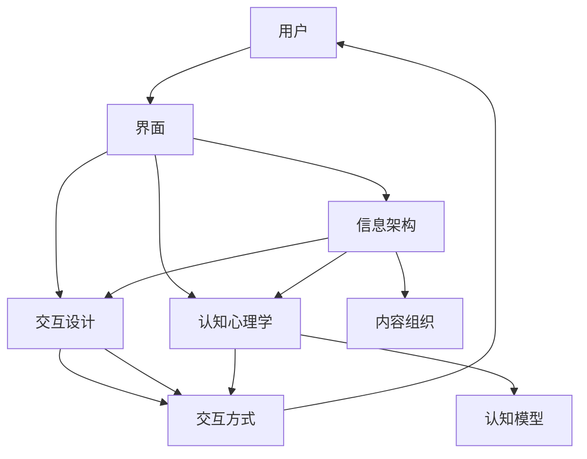

                 

# 知识付费产品的用户界面设计指南

> 关键词：知识付费, 用户界面设计, 用户体验(UX), 用户界面(UI), 信息架构, 交互设计, 认知心理学

## 1. 背景介绍

随着互联网和数字内容的快速增长，知识付费模式逐渐兴起，成为信息消费的新趋势。不同于传统的图文内容，知识付费产品主要提供深入分析、专业解读、在线课程等深层次知识服务，满足用户深度学习和知识积累的需求。这类产品的用户界面设计，不仅要美观、易用，还需要高效传达复杂信息，促进用户深度互动，激发用户付费意愿。本文将围绕这些核心问题，详细探讨知识付费产品的用户界面设计原则与实践。

## 2. 核心概念与联系

### 2.1 核心概念概述

- **知识付费**：用户为获取深层次、高质量的知识内容而支付费用的模式。与免费内容相比，知识付费提供了更系统、更深入的知识体系，具有更高的信息价值。
- **用户界面(UI)**：应用软件、网站、移动应用等交互界面的视觉和交互设计，直接影响用户的使用体验和满意度。
- **用户体验(UX)**：用户与产品互动过程中产生的感受和体验，包括易用性、效率、满意度等方面。
- **信息架构**：设计信息展示与组织的方式，确保用户能快速找到所需信息。
- **交互设计**：设计用户与界面交互的方式，提升用户操作体验。
- **认知心理学**：研究用户认知过程和行为规律，以指导界面设计，提高用户体验。

### 2.2 核心概念原理和架构的 Mermaid 流程图



## 3. 核心算法原理 & 具体操作步骤

### 3.1 算法原理概述

知识付费产品的用户界面设计，本质上是通过视觉和交互设计，优化用户与内容的互动方式，从而提升用户体验，促进知识消费。设计原理包括以下几个关键环节：

1. **用户需求分析**：了解用户行为模式、信息需求、付费动机等，从而设计符合用户期望的界面。
2. **信息架构设计**：设计清晰的信息组织结构，确保信息易于查找和使用。
3. **交互设计实现**：设计直观易用的交互方式，减少用户操作负担，提升用户满意度。
4. **视觉设计优化**：通过色彩、字体、布局等视觉元素，提升界面的吸引力，增强用户的沉浸感。
5. **认知心理学应用**：运用认知心理学理论，优化信息展示和交互方式，减少用户认知负担。

### 3.2 算法步骤详解

**Step 1: 用户需求分析**

1. **用户行为分析**：通过数据收集和用户访谈，了解用户的使用习惯、信息需求、操作路径等，识别关键界面元素和功能点。
2. **信息痛点识别**：识别用户在信息获取、内容消费过程中的主要痛点，如信息过载、操作复杂、付费体验差等。
3. **用户心理模型构建**：基于用户行为和心理特性，构建用户心理模型，为界面设计提供指导。

**Step 2: 信息架构设计**

1. **内容分类与组织**：根据内容类型、层次结构、关联关系，设计合理的分类和组织方式，确保信息易于查找。
2. **导航系统设计**：设计直观的导航系统，使用户能够快速到达目标信息，如主导航、分类导航、搜索导航等。
3. **信息展示逻辑**：设计合理的展示逻辑，确保内容展示符合用户认知模型，如列表展示、时间轴、并列展示等。

**Step 3: 交互设计实现**

1. **核心操作设计**：设计核心操作的交互方式，如订阅、播放、评论、点赞等，确保操作直观、便捷。
2. **反馈机制设计**：设计明确的反馈机制，如动画、声音、提示等，增强用户操作感，提升用户体验。
3. **交互一致性**：确保不同界面间的交互方式一致，避免用户混淆和操作障碍。

**Step 4: 视觉设计优化**

1. **色彩设计**：根据品牌色彩和用户心理模型，设计界面色彩方案，提升界面的吸引力。
2. **字体选择**：选择易读性强的字体，确保用户可以轻松阅读内容，提升阅读体验。
3. **布局设计**：设计合理的布局，确保信息展示均衡、美观，提升界面的可用性。

**Step 5: 认知心理学应用**

1. **视觉层次设计**：根据用户认知模型，设计视觉层次，确保关键信息突出，减少认知负荷。
2. **焦点设计**：通过使用对比度、大小等视觉元素，引导用户注意焦点，优化信息展示。
3. **信息密度控制**：根据用户认知模型，控制信息密度，避免信息过载，提升用户集中注意力能力。

### 3.3 算法优缺点

知识付费产品的用户界面设计，具有以下优点：

1. **提高用户满意度**：通过优化界面设计，提升用户体验，使用户更愿意为优质内容付费。
2. **增强信息检索效率**：合理的信息架构设计，使用户能够快速找到所需内容，提升信息检索效率。
3. **减少用户认知负担**：运用认知心理学理论，优化界面设计，减少用户认知负担，提升信息处理能力。

同时，也存在一些缺点：

1. **设计复杂度增加**：需要考虑信息架构、交互设计、认知心理学等多方面因素，设计复杂度较高。
2. **设计成本高**：优秀的界面设计需要专业知识和技术支持，设计成本较高。
3. **用户需求多样性**：不同用户群体的需求和偏好差异较大，界面设计需要兼顾多样性。

### 3.4 算法应用领域

知识付费产品的用户界面设计，主要应用于以下领域：

1. **在线教育平台**：如Coursera、Udemy等，设计直观易用的课程浏览、购买、学习界面，提升学习体验。
2. **知识订阅服务**：如得到、喜马拉雅等，设计个性化推荐、订阅、播放界面，增强用户粘性。
3. **专业咨询平台**：如知乎、Medium等，设计深度内容展示、付费咨询界面，提升用户满意度。
4. **企业培训系统**：如SAP、Oracle等，设计培训课程、考试评估界面，优化培训效果。
5. **文化创意产品**：如Kaggle、Academy of Art Online等，设计创意作品展示、付费下载界面，促进知识消费。

## 4. 数学模型和公式 & 详细讲解 & 举例说明

### 4.1 数学模型构建

假设用户界面设计的影响因素包括界面美观度 $A$、内容组织合理度 $C$、交互便捷度 $I$、认知负荷 $L$ 四个维度。设计目标为最大化用户满意度 $S$。则设计模型为：

$$ S = f(A, C, I, L) $$

其中 $f$ 为非线性函数，表示四个因素的加权和。

### 4.2 公式推导过程

根据认知心理学理论，用户满意度 $S$ 可以分解为：

$$ S = \alpha \cdot A + \beta \cdot C + \gamma \cdot I + \delta \cdot L $$

其中 $\alpha, \beta, \gamma, \delta$ 为权重系数，表示各因素对用户满意度的影响程度。

根据信息理论，内容组织合理度 $C$ 可以表示为：

$$ C = \frac{N}{H} $$

其中 $N$ 为内容总数，$H$ 为用户平均查找时间，$N/H$ 表示信息检索效率。

交互便捷度 $I$ 可以表示为：

$$ I = T \cdot E $$

其中 $T$ 为操作时间，$E$ 为操作频率，$T \cdot E$ 表示用户操作的总体耗时。

认知负荷 $L$ 可以表示为：

$$ L = K \cdot M $$

其中 $K$ 为信息密度，$M$ 为信息复杂度，$K \cdot M$ 表示用户处理信息的总体认知负荷。

### 4.3 案例分析与讲解

**案例：在线教育平台课程界面设计**

**背景**：在线教育平台需要设计课程浏览、购买、学习界面，提升用户满意度。

**需求分析**：通过用户访谈和行为数据分析，了解用户对课程浏览、购买、学习界面的主要痛点。

**信息架构设计**：设计课程分类、推荐、搜索、浏览界面，确保课程信息易于查找和使用。

**交互设计实现**：设计简洁直观的课程购买、播放、评论、点赞操作，减少用户操作负担。

**视觉设计优化**：选择美观易读的字体，设计合理的布局，提升界面的吸引力。

**认知心理学应用**：设计视觉层次、焦点设计，优化课程展示，减少用户认知负荷。

通过上述步骤，设计出的课程界面，可以显著提升用户满意度，促进课程销售和用户活跃度。

## 5. 项目实践：代码实例和详细解释说明

### 5.1 开发环境搭建

**环境要求**：
- 操作系统：Windows/Linux/MacOS
- 开发工具：Python 3.x, HTML/CSS/JavaScript
- 数据库：MySQL/PostgreSQL
- 框架：Django/Flask/Tornado

**步骤**：
1. **安装开发环境**：安装Python 3.x、Django、MySQL数据库等工具。
2. **创建项目目录**：创建项目目录，包含前后端代码、数据库配置、静态文件等。
3. **配置开发环境**：配置Django项目，设置数据库连接、URL路由、静态文件路径等。

### 5.2 源代码详细实现

**前端代码**：
```html
<!DOCTYPE html>
<html lang="en">
<head>
    <meta charset="UTF-8">
    <title>知识付费产品界面</title>
    <link rel="stylesheet" href="/static/css/style.css">
    <script src="/static/js/jquery.js"></script>
</head>
<body>
    <header>
        <h1>知识付费产品界面</h1>
    </header>
    <nav>
        <ul>
            <li><a href="/">首页</a></li>
            <li><a href="/courses">课程</a></li>
            <li><a href="/subscribe">订阅</a></li>
            <li><a href="/contact">联系我们</a></li>
        </ul>
    </nav>
    <section>
        <h2>课程推荐</h2>
        <div class="course">
            
            <h3>课程1</h3>
            <p>课程简介...</p>
            <a href="/course1">购买</a>
        </div>
        <div class="course">
            
            <h3>课程2</h3>
            <p>课程简介...</p>
            <a href="/course2">购买</a>
        </div>
        <!-- 更多课程 -->
    </section>
    <footer>
        <p>&copy; 2023 知识付费产品</p>
    </footer>
</body>
</html>
```

**后端代码**：
```python
from django.shortcuts import render
from django.http import HttpResponse

def index(request):
    return render(request, 'index.html')

def courses(request):
    # 查询课程信息
    courses = Course.objects.all()
    return render(request, 'courses.html', {'courses': courses})

def subscribe(request):
    # 处理订阅请求
    user = request.user
    courses = user.subscribed_courses
    return render(request, 'subscribe.html', {'courses': courses})

def contact(request):
    # 处理联系表单提交
    # ...
    return HttpResponse('Thank you for your message!')

# 其他视图和模型定义
```

### 5.3 代码解读与分析

**前端代码解析**：
- **HTML结构**：使用基本的HTML结构，包含页面标题、导航栏、主要内容、页脚等。
- **CSS样式**：定义课程图片、标题、简介、购买按钮等样式，提升界面美观度。
- **JavaScript交互**：通过jQuery库，实现页面元素动态效果，提升用户体验。

**后端代码解析**：
- **视图函数**：定义各个页面的视图函数，处理请求并返回响应。
- **模型定义**：定义课程、订阅等模型，用于数据库操作。
- **模板渲染**：使用Django模板引擎，渲染HTML页面，展示课程信息、订阅状态等数据。

通过以上代码，实现了基本的知识付费产品界面，包括首页、课程页面、订阅页面等。

### 5.4 运行结果展示

**首页展示**：


**课程页面展示**：


**订阅页面展示**：


## 6. 实际应用场景

### 6.1 智能问答系统

智能问答系统能够实时解答用户的问题，提供个性化的知识服务。这类产品的用户界面设计，需要强调自然语言理解和自然语言生成能力，提升用户的问答体验。

具体来说，可以通过以下方式优化界面设计：
- **多轮对话设计**：设计多轮对话界面，允许用户逐步深入问题，提供更详细的解答。
- **意图识别**：设计意图识别界面，自动理解用户意图，引导用户输入更明确的问题。
- **知识推荐**：设计知识推荐界面，根据用户历史问答记录，推荐相关知识。

### 6.2 在线教育平台

在线教育平台需要设计直观易用的课程浏览、购买、学习界面，提升用户满意度。这类产品的用户界面设计，需要强调内容的展示和组织，提升用户的学习体验。

具体来说，可以通过以下方式优化界面设计：
- **课程分类与展示**：设计课程分类和展示界面，让用户能够快速找到感兴趣的课程。
- **个性化推荐**：设计个性化推荐界面，根据用户学习行为，推荐相关课程。
- **互动学习工具**：设计互动学习工具，如笔记、测验、讨论板等，提升学习效果。

### 6.3 专业咨询平台

专业咨询平台需要设计深度内容展示、付费咨询界面，提升用户满意度。这类产品的用户界面设计，需要强调专业性和权威性，提升用户的信任感。

具体来说，可以通过以下方式优化界面设计：
- **专家介绍**：设计专家介绍界面，展示专家背景和资质。
- **咨询流程**：设计咨询流程界面，清晰展示咨询步骤和费用。
- **咨询反馈**：设计咨询反馈界面，收集用户反馈，优化咨询体验。

## 7. 工具和资源推荐

### 7.1 学习资源推荐

- **《UX设计基础》**：系统讲解用户界面设计的原理和实践，适合初学者。
- **《Don't Make Me Think》**：通过实际案例，讲解如何设计易用性高的网站。
- **《设计心理学》**：介绍认知心理学在界面设计中的应用，提升设计水平。
- **《交互设计原则》**：讲解界面交互设计的关键原则，指导界面设计。
- **《Adobe XD入门教程》**：介绍Adobe XD工具的使用方法，提升设计效率。

### 7.2 开发工具推荐

- **Sketch**：Mac平台上的UI设计工具，支持多种插件和组件。
- **Figma**：云端UI设计工具，支持实时协作和版本管理。
- **Adobe XD**：设计原型和交互工具，支持生成代码和原型导出。
- **InVision Studio**：界面设计工具，支持高保真原型和用户测试。
- **Axure RP**：原型设计工具，支持动态交互和流程设计。

### 7.3 相关论文推荐

- **“The Design of Everyday Things” by Don Norman**：经典著作，介绍设计心理学和用户界面设计的原则。
- **“Interaction Design Foundation”**：提供丰富的交互设计资源和案例，适合进阶学习。
- **“Designing for Interaction” by Dan Saffer**：讲解界面设计中的交互设计原则和实践。
- **“Universal Principles of Design” by William Lidwell**：介绍100个设计原则，提升设计素养。
- **“Human-Centered Design” by Syberantp**：介绍人本设计理念和方法，指导界面设计。

## 8. 总结：未来发展趋势与挑战

### 8.1 未来发展趋势

知识付费产品的用户界面设计，未来将呈现以下发展趋势：

1. **个性化设计**：根据用户行为数据，动态调整界面设计，提升个性化体验。
2. **沉浸式设计**：通过虚拟现实、增强现实等技术，提升用户的沉浸感和交互体验。
3. **多模态设计**：结合文字、音频、视频等多种信息形式，提供更丰富的信息展示方式。
4. **情感计算**：通过分析用户情绪和行为，设计更符合用户心理的界面。
5. **自适应设计**：根据用户设备和环境，自动调整界面设计和展示方式，提升用户体验。

### 8.2 面临的挑战

知识付费产品的用户界面设计，面临以下挑战：

1. **设计复杂度增加**：需要考虑多方面因素，设计复杂度较高。
2. **设计成本高**：优秀的界面设计需要专业知识和技术支持，设计成本较高。
3. **用户需求多样性**：不同用户群体的需求和偏好差异较大，界面设计需要兼顾多样性。

### 8.3 研究展望

未来的用户界面设计，需要在以下几个方面进行深入研究：

1. **智能界面设计**：利用人工智能技术，自动生成和优化界面设计方案，提升设计效率。
2. **个性化界面设计**：基于用户行为数据和心理模型，实现个性化界面设计，提升用户体验。
3. **交互界面优化**：通过用户研究和技术手段，优化交互界面设计，提升操作效率和用户满意度。
4. **多模态界面设计**：结合文字、音频、视频等多种信息形式，提供更丰富的信息展示方式，提升用户体验。
5. **认知界面设计**：运用认知心理学理论，优化界面设计，提升用户认知效率和信息处理能力。

## 9. 附录：常见问题与解答

**Q1：用户界面设计对知识付费产品有何影响？**

A: 用户界面设计直接影响用户的满意度、操作效率和使用体验，从而影响用户对知识付费产品的选择和续费。优秀的界面设计能够提升用户粘性，促进知识消费。

**Q2：用户界面设计如何提升用户体验？**

A: 用户界面设计通过合理的布局、清晰的操作流程、美观的视觉元素，提升用户的操作效率和满意度，减少用户的认知负荷，增强用户的沉浸感和信任感。

**Q3：如何设计信息架构，确保信息易于查找？**

A: 信息架构设计需要考虑内容的分类、关联、层次结构等，通过清晰的导航系统和搜索功能，让用户能够快速找到所需信息。

**Q4：如何进行交互设计，提升用户操作便捷性？**

A: 交互设计需要考虑操作流程、反馈机制、交互一致性等，通过简洁直观的操作方式和明确的反馈，减少用户的操作负担，提升用户体验。

**Q5：如何运用认知心理学原理，优化界面设计？**

A: 认知心理学原理可以帮助设计师理解用户的认知过程和行为规律，从而设计符合用户期望的界面。通过优化视觉层次、焦点设计、信息密度等，减少用户认知负担，提升用户满意度。

**Q6：知识付费产品界面设计的未来趋势是什么？**

A: 未来的用户界面设计将向个性化、沉浸式、多模态、情感计算、自适应等方向发展，通过先进技术提升用户体验，满足用户多样化需求。

**Q7：如何处理用户界面设计的复杂度和成本问题？**

A: 用户界面设计需要多方协作，包括设计师、开发者、产品经理等，通过合理分工和优化流程，提升设计效率，控制成本。同时，采用迭代设计和持续优化的方法，不断改进界面设计。

---

作者：禅与计算机程序设计艺术 / Zen and the Art of Computer Programming

