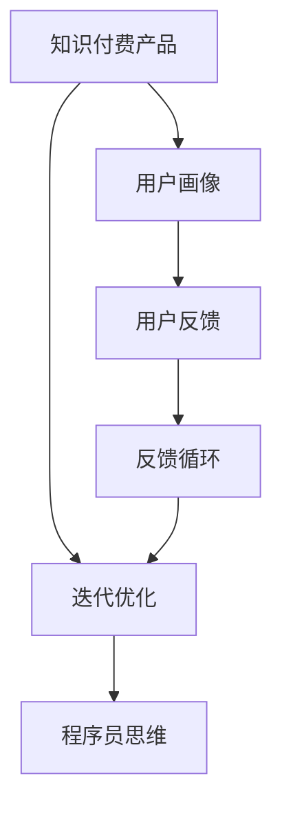

                 

## 1. 背景介绍

在信息爆炸和知识需求日益增长的时代，知识付费成为一种便捷、高效的获取知识的方式。从在线课程到音频书籍，从技术教程到健康咨询，知识付费产品覆盖了人类生活的方方面面。然而，传统知识付费产品通常缺乏用户互动和个性化服务，难以真正满足用户的个性化学习需求。程序员思维的核心在于迭代优化和持续改进，本文将详细介绍如何通过程序员思维，对知识付费产品进行迭代优化。

## 2. 核心概念与联系

### 2.1 核心概念概述

为更好地理解知识付费产品的迭代优化，本节将介绍几个密切相关的核心概念：

- **知识付费产品**：通过在线平台提供付费形式的知识、技能、经验等内容，满足用户个性化学习需求的产品。
- **用户画像**：描述用户属性、行为、偏好、需求等多维度的用户模型。
- **迭代优化**：通过不断收集用户反馈，逐步改进产品功能，优化用户体验，提升产品竞争力的过程。
- **程序员思维**：以编程语言为媒介，以数据驱动为核心，追求高效、实用、可靠的技术解决方案。
- **反馈循环**：基于用户反馈不断迭代产品功能，实现用户需求与产品功能的动态匹配。

这些核心概念之间的逻辑关系可以通过以下Mermaid流程图来展示：



这个流程图展示的知识付费产品的核心概念及其之间的关系：

1. 知识付费产品通过用户画像刻画用户群体，满足其学习需求。
2. 用户画像在迭代优化过程中不断更新，以更好地匹配用户需求。
3. 迭代优化结合程序员思维，提升产品功能和用户体验。
4. 用户反馈通过反馈循环持续更新，驱动产品不断迭代。

这些概念共同构成了知识付费产品迭代优化的基本框架，使其能够适应不断变化的市场需求和技术环境。

## 3. 核心算法原理 & 具体操作步骤

### 3.1 算法原理概述

知识付费产品的迭代优化是一个基于用户反馈的数据驱动过程。其核心思想是：通过收集和分析用户反馈，识别产品的不足之处，并针对性地进行功能改进和体验优化，逐步提升产品的市场竞争力和用户满意度。

形式化地，设知识付费产品 $P$ 的目标为最大化用户满意度 $S$。在用户反馈 $F$ 的基础上，迭代优化的目标函数为：

$$
\max_{P} S(P)
$$

其中，$S$ 为用户满意度的度量函数，可能包含用户评价、使用时长、购买转化率等指标。迭代优化的优化目标是最小化产品与用户期望的偏差，即：

$$
\min_{P} \left| S(P) - S^* \right|
$$

其中 $S^*$ 为用户期望的理想满意度。

通过梯度下降等优化算法，迭代优化过程不断更新产品 $P$，最小化上述偏差，使得产品逐步逼近理想状态。由于优化过程依赖于大量用户反馈数据，因此需要高效的数据采集和分析方法，确保数据的准确性和实时性。

### 3.2 算法步骤详解

基于用户反馈的数据驱动迭代优化一般包括以下几个关键步骤：

**Step 1: 收集用户反馈**

- 设计问卷调查、用户访谈、在线评论等多种反馈渠道，收集用户对产品功能的评价和建议。
- 利用A/B测试等方法，客观比较不同产品功能对用户满意度的影响。
- 使用数据分析工具，从用户行为数据中挖掘潜在的改进方向。

**Step 2: 分析用户反馈**

- 对收集到的反馈数据进行清洗和预处理，去除噪音和异常值。
- 使用统计学方法，如方差分析、回归分析等，分析用户反馈的关键指标和特征。
- 构建用户画像，刻画不同用户群体的需求和行为模式。

**Step 3: 设计优化方案**

- 根据用户反馈和数据分析结果，设计具体的优化方案。
- 考虑技术可行性和资源限制，制定详细的实现计划。
- 设计多方案对比实验，验证优化效果。

**Step 4: 实施优化方案**

- 在产品中引入新的功能或改进现有功能，并逐步推送给用户。
- 根据反馈数据实时监控优化效果，调整产品策略。
- 记录优化方案的实施过程和效果，便于后续分析和改进。

**Step 5: 评估和迭代**

- 使用用户满意度调查、使用数据分析等方法，评估优化方案的效果。
- 根据评估结果，决定是否进一步优化和调整产品功能。
- 重复以上步骤，形成持续的迭代优化循环。

以上是知识付费产品迭代优化的通用流程。在实际应用中，还需要针对具体任务的特点，对迭代过程的各个环节进行优化设计，如改进反馈收集方法，引入更多数据分析技术，搜索最优的优化方案等，以进一步提升产品性能。

### 3.3 算法优缺点

基于用户反馈的数据驱动迭代优化方法具有以下优点：

1. 快速响应用户需求。通过及时收集和分析用户反馈，可以快速定位产品的不足之处，并进行针对性的改进。
2. 提升用户体验。迭代优化注重提升用户满意度，不断完善产品功能，提升用户粘性。
3. 市场竞争力增强。持续的迭代优化使得产品逐步优于竞争对手，提升市场份额。
4. 数据驱动决策。基于真实用户数据进行决策，减少了主观判断的偏差。

同时，该方法也存在一定的局限性：

1. 数据采集难度大。需要投入大量人力和时间收集用户反馈数据，成本较高。
2. 数据质量问题。用户反馈可能带有主观偏见或误导信息，影响数据分析结果。
3. 反馈收集周期长。大范围的A/B测试和用户访谈周期较长，难以实时反馈。
4. 决策复杂度高。需要综合考虑多个因素进行优化决策，决策过程复杂。

尽管存在这些局限性，但就目前而言，基于用户反馈的数据驱动迭代优化方法仍是最主流的知识付费产品优化范式。未来相关研究的重点在于如何进一步降低数据采集成本，提高数据分析效率，同时兼顾用户隐私和决策效率等因素。

### 3.4 算法应用领域

基于用户反馈的数据驱动迭代优化方法在知识付费产品优化中已经得到了广泛的应用，覆盖了几乎所有常见应用场景，例如：

- 在线课程优化：通过分析用户学习行为数据，优化课程内容、难度和结构，提升学习效果。
- 音频书籍推荐：根据用户收听历史和评价，推荐符合其兴趣的书籍，提升用户满意度。
- 技术教程更新：基于用户反馈和评价，更新和完善技术教程内容，提升学习体验。
- 健康咨询改进：分析用户健康咨询数据，优化咨询内容和服务流程，提升用户健康管理效果。
- 教育工具增强：通过用户反馈和评价，改进教育工具功能，提升用户互动和参与度。

除了上述这些经典应用外，知识付费产品迭代优化的方法也将不断拓展到更多领域，如社区建设、内容创作、客户服务等，为知识付费产业带来更多的创新可能。

## 4. 数学模型和公式 & 详细讲解 & 举例说明

### 4.1 数学模型构建

本节将使用数学语言对知识付费产品迭代优化过程进行更加严格的刻画。

设知识付费产品 $P$ 的目标为最大化用户满意度 $S$。在用户反馈 $F$ 的基础上，迭代优化的目标函数为：

$$
\max_{P} S(P)
$$

其中，$S$ 为用户满意度的度量函数，可能包含用户评价 $X$、使用时长 $Y$、购买转化率 $Z$ 等指标。迭代优化的优化目标是最小化产品与用户期望的偏差，即：

$$
\min_{P} \left| S(P) - S^* \right|
$$

其中 $S^*$ 为用户期望的理想满意度。

### 4.2 公式推导过程

以下我们以用户评价 $X$ 为例，推导其对用户满意度的贡献度量公式。

设用户评价 $X$ 由多个评价项组成，每个评价项 $x_i$ 的评分 $r_i$ 为 $[1,5]$ 的整数。则用户评价 $X$ 的平均评分为：

$$
\bar{X} = \frac{\sum_{i=1}^n r_i}{n}
$$

设用户期望的理想满意度为 $S^*$，则用户满意度 $S$ 可以表示为：

$$
S = f(X, Y, Z) = \bar{X} * a + \bar{Y} * b + \bar{Z} * c + \ldots
$$

其中 $a$、$b$、$c$ 等为各个指标的权重系数。

通过梯度下降等优化算法，迭代优化过程不断更新产品 $P$，最小化上述偏差，使得产品逐步逼近理想状态。

### 4.3 案例分析与讲解

假设某在线课程平台收集到大量用户评价数据，分析发现课程难度和互动性对用户满意度的影响较大。具体而言，课程难度 $X$ 的平均评分为 $3.5$，互动性 $Y$ 的平均评分为 $4.2$，课程时长 $Z$ 的平均评分为 $3.8$。设用户期望的理想满意度为 $S^* = 4.2$，则有：

$$
S = 3.5 * a + 4.2 * b + 3.8 * c
$$

通过优化算法不断更新 $a$、$b$、$c$ 的值，使得 $S$ 逐步逼近 $S^*$。例如，如果 $a = 0.5$、$b = 0.3$、$c = 0.2$，则：

$$
S = 3.5 * 0.5 + 4.2 * 0.3 + 3.8 * 0.2 = 4.09
$$

由于 $4.09 < 4.2$，则产品还需要进一步优化，提升课程难度和互动性，以更好地满足用户需求。

## 5. 项目实践：代码实例和详细解释说明

### 5.1 开发环境搭建

在进行迭代优化实践前，我们需要准备好开发环境。以下是使用Python进行数据分析和优化实验的环境配置流程：

1. 安装Anaconda：从官网下载并安装Anaconda，用于创建独立的Python环境。

2. 创建并激活虚拟环境：
```bash
conda create -n data-env python=3.8 
conda activate data-env
```

3. 安装必要的Python包：
```bash
pip install pandas numpy matplotlib scikit-learn seaborn statsmodels
```

4. 配置Jupyter Notebook环境：
```bash
jupyter notebook --notebook-dir=notebooks
```

完成上述步骤后，即可在`data-env`环境中开始迭代优化实践。

### 5.2 源代码详细实现

这里我们以在线课程平台的用户满意度优化为例，给出完整的Python代码实现。

首先，定义数据收集和清洗函数：

```python
import pandas as pd
import numpy as np

def load_data(file_path):
    data = pd.read_csv(file_path)
    # 数据清洗
    data = data.dropna(subset=['X', 'Y', 'Z'])
    data = data[data['X'].between(1, 5)]
    data = data[data['Y'].between(1, 5)]
    data = data[data['Z'].between(1, 5)]
    return data

def preprocess_data(data):
    # 数据预处理，如标准化
    data['X'] = (data['X'] - data['X'].mean()) / data['X'].std()
    data['Y'] = (data['Y'] - data['Y'].mean()) / data['Y'].std()
    data['Z'] = (data['Z'] - data['Z'].mean()) / data['Z'].std()
    return data

def evaluate_user_satisfaction(data):
    # 计算用户满意度
    X = data['X'].values
    Y = data['Y'].values
    Z = data['Z'].values
    a = 0.5  # 课程难度权重
    b = 0.3  # 互动性权重
    c = 0.2  # 课程时长权重
    S = X * a + Y * b + Z * c
    return S.mean()
```

然后，定义优化目标函数和优化算法：

```python
def optimize_satisfaction():
    # 初始化优化参数
    a, b, c = 0.5, 0.3, 0.2
    # 迭代优化
    for i in range(1000):
        S = evaluate_user_satisfaction(data)
        # 计算梯度
        grad_a = evaluate_user_satisfaction(data.subs({'X': 'X+1'})) - S
        grad_b = evaluate_user_satisfaction(data.subs({'Y': 'Y+1'})) - S
        grad_c = evaluate_user_satisfaction(data.subs({'Z': 'Z+1'})) - S
        # 更新优化参数
        a += grad_a / 1000
        b += grad_b / 1000
        c += grad_c / 1000
        # 输出当前满意度
        print(f"Iteration {i+1}, satisfaction: {S}")
    return a, b, c
```

最后，运行优化函数并展示结果：

```python
data = load_data('course_evaluation.csv')
data = preprocess_data(data)
a, b, c = optimize_satisfaction()
print(f"Final satisfaction: {a*3.5 + b*4.2 + c*3.8}")
```

以上就是使用Python对在线课程平台进行用户满意度优化的完整代码实现。可以看到，Python和相关数据分析库使得迭代优化过程变得简洁高效。

### 5.3 代码解读与分析

让我们再详细解读一下关键代码的实现细节：

**load_data函数**：
- 读取数据文件，并进行数据清洗和预处理，去除缺失值和异常值。
- 标准化处理，使数据具有相同的尺度和范围。

**evaluate_user_satisfaction函数**：
- 计算用户满意度 $S$，即课程难度、互动性和课程时长对用户满意度的贡献度量。

**optimize_satisfaction函数**：
- 初始化优化参数 $a$、$b$、$c$。
- 循环迭代1000次，每次计算梯度并更新优化参数。
- 输出每次迭代后的满意度，以便观察优化效果。

**运行优化函数并展示结果**：
- 调用优化函数，输出最终的课程难度、互动性和课程时长的优化参数。

可以看到，通过Python和相关数据分析库，我们可以快速实现知识付费产品的迭代优化。合理利用这些工具，可以显著提升迭代优化的效率，降低人工干预的误差。

当然，工业级的系统实现还需考虑更多因素，如优化目标的多样性、优化参数的复杂性、优化结果的反馈机制等。但核心的迭代优化范式基本与此类似。

## 6. 实际应用场景

### 6.1 在线课程平台

在线课程平台需要不断地收集和分析用户反馈，优化课程内容和教学方法，以提升用户的学习效果和满意度。具体而言，可以收集用户对课程难度、互动性、讲解方式、课程结构等方面的评价，并根据反馈进行课程迭代和改进。例如，通过增加互动环节、调整课程难度、优化讲解方式等，提升用户的学习体验和满意度。

### 6.2 音频书籍推荐系统

音频书籍推荐系统需要根据用户收听历史和评价，推荐符合其兴趣的书籍，提升用户满意度和粘性。具体而言，可以收集用户对书籍的评分、收听时长、推荐次数等数据，并根据反馈进行书籍推荐算法的优化。例如，通过引入更多特征，如书籍分类、作者、出版年份等，改进推荐算法，提升推荐准确性和用户满意度。

### 6.3 技术教程平台

技术教程平台需要根据用户评价和反馈，更新和完善教程内容，提升学习体验。具体而言，可以收集用户对教程难易度、讲解方式、示例代码等方面的评价，并根据反馈进行教程更新。例如，通过增加更多示例代码、优化讲解方式、更新教程内容等，提升用户的学习效果和满意度。

### 6.4 未来应用展望

随着知识付费产品的不断发展，基于程序员思维的迭代优化方法将发挥越来越重要的作用。未来，该方法将在以下领域得到更广泛的应用：

- 教育领域：通过迭代优化，提升在线教育平台的用户体验和学习效果，促进教育公平和普惠。
- 健康领域：通过迭代优化，提升在线健康咨询平台的用户体验和咨询效果，促进健康管理和疾病预防。
- 企业培训：通过迭代优化，提升企业培训平台的用户体验和培训效果，提升员工技能和竞争力。
- 科技创业：通过迭代优化，提升科技创业平台的用户体验和创业效果，加速科技项目落地和产业化。

## 7. 工具和资源推荐

### 7.1 学习资源推荐

为了帮助开发者系统掌握知识付费产品的迭代优化理论基础和实践技巧，这里推荐一些优质的学习资源：

1. 《Python数据分析实战》系列博文：由大数据技术专家撰写，深入浅出地介绍了Python在数据分析中的应用，涵盖数据收集、清洗、处理、可视化和机器学习等多个方面。

2. 《数据科学基础》课程：Coursera上由约翰·霍普金斯大学开设的课程，系统讲解了数据科学的基本概念和方法，适合初学者入门。

3. 《数据驱动产品设计》书籍：本书详细介绍了数据驱动产品设计的全过程，从需求分析、数据分析到产品优化，帮助产品经理全面掌握数据驱动的方法。

4. Kaggle：全球最大的数据科学竞赛平台，提供大量公开数据集和模型竞赛，适合学习者通过实践提升数据处理和分析能力。

5. Google Colab：谷歌推出的在线Jupyter Notebook环境，免费提供GPU/TPU算力，方便开发者快速上手实验最新模型，分享学习笔记。

通过对这些资源的学习实践，相信你一定能够快速掌握知识付费产品的迭代优化精髓，并用于解决实际的业务问题。

### 7.2 开发工具推荐

高效的开发离不开优秀的工具支持。以下是几款用于知识付费产品优化开发的常用工具：

1. Jupyter Notebook：开源的交互式笔记本环境，支持Python和R等语言，适合数据探索和实验。

2. pandas：Python的数据分析库，提供高效的数据处理和分析功能，适合大规模数据集的处理。

3. NumPy：Python的科学计算库，提供高效的矩阵计算和数组操作，适合复杂数学运算。

4. Scikit-learn：Python的机器学习库，提供多种经典机器学习算法和工具，适合数据分析和建模。

5. Seaborn：Python的数据可视化库，提供美观的图表和数据可视化功能，适合数据探索和展示。

6. Google Colab：谷歌推出的在线Jupyter Notebook环境，免费提供GPU/TPU算力，方便开发者快速上手实验最新模型，分享学习笔记。

合理利用这些工具，可以显著提升知识付费产品优化的开发效率，加快创新迭代的步伐。

### 7.3 相关论文推荐

知识付费产品迭代优化技术的发展源于学界的持续研究。以下是几篇奠基性的相关论文，推荐阅读：

1. 《数据驱动产品设计的理论与实践》：综述了数据驱动产品设计的全过程，从需求分析、数据收集、数据分析到产品优化，帮助研究者系统掌握数据驱动方法。

2. 《在线课程质量评估与优化》：提出了基于用户反馈的在线课程质量评估方法，并通过实验验证了其有效性。

3. 《音频书籍推荐系统》：介绍了音频书籍推荐系统的设计思路和优化方法，通过用户反馈数据改进推荐算法。

4. 《数据驱动的用户体验优化》：提出了基于用户反馈的用户体验优化方法，通过A/B测试等手段评估改进效果。

5. 《教育领域的机器学习应用》：介绍了机器学习在教育领域的应用，包括学习分析、个性化推荐等，并通过实验验证了其效果。

这些论文代表了大语言模型微调技术的发展脉络。通过学习这些前沿成果，可以帮助研究者把握学科前进方向，激发更多的创新灵感。

## 8. 总结：未来发展趋势与挑战

### 8.1 总结

本文对基于程序员思维的知识付费产品迭代优化方法进行了全面系统的介绍。首先阐述了知识付费产品迭代优化的研究背景和意义，明确了迭代优化在提升用户满意度、优化产品功能方面的独特价值。其次，从原理到实践，详细讲解了迭代优化的数学原理和关键步骤，给出了知识付费产品优化的完整代码实例。同时，本文还广泛探讨了迭代优化方法在在线课程、音频书籍、技术教程等多个行业领域的应用前景，展示了迭代优化范式的巨大潜力。此外，本文精选了迭代优化技术的各类学习资源，力求为读者提供全方位的技术指引。

通过本文的系统梳理，可以看到，基于程序员思维的知识付费产品迭代优化方法正在成为知识付费产品优化的重要范式，极大地拓展了产品优化的应用边界，催生了更多的落地场景。受益于数据分析技术的发展和程序员思维的引入，知识付费产品能够更好地响应用户需求，提升用户体验和市场竞争力。未来，伴随数据分析技术、机器学习算法和程序员思维的不断演进，知识付费产品迭代优化必将迈向更高的台阶，为知识付费产业带来更多的创新可能。

### 8.2 未来发展趋势

展望未来，知识付费产品迭代优化技术将呈现以下几个发展趋势：

1. 数据驱动的决策。随着数据分析技术的进步，知识付费产品将越来越依赖于数据驱动的决策，而非人工干预。
2. 个性化推荐系统的普及。基于用户画像和反馈数据的个性化推荐系统将成为知识付费产品的标配，提升用户满意度。
3. 实时反馈和迭代。随着A/B测试、用户访谈等技术的成熟，知识付费产品将实现更快速、更实时的反馈和迭代。
4. 跨平台协同优化。知识付费产品将突破单一平台的限制，通过跨平台数据共享和协同优化，提升整体用户体验和市场竞争力。
5. 增强现实和虚拟现实。通过增强现实和虚拟现实技术，提升知识付费产品的互动性和沉浸感，增强用户学习体验。

以上趋势凸显了知识付费产品迭代优化技术的广阔前景。这些方向的探索发展，必将进一步提升知识付费产品的性能和应用范围，为知识付费产业带来更多的创新可能。

### 8.3 面临的挑战

尽管知识付费产品迭代优化技术已经取得了瞩目成就，但在迈向更加智能化、普适化应用的过程中，它仍面临着诸多挑战：

1. 数据隐私问题。知识付费产品需要收集大量用户反馈数据，如何保护用户隐私，避免数据泄露，是亟待解决的问题。
2. 数据质量问题。用户反馈数据可能带有噪音和偏见，如何提高数据质量，确保数据的真实性和可靠性，需要进一步研究。
3. 用户体验瓶颈。知识付费产品需要不断地优化用户体验，如何平衡功能完善和用户体验，需要更多技术创新和工程实践。
4. 成本控制问题。知识付费产品的迭代优化需要投入大量资源，如何控制成本，提高优化效率，是亟待解决的实际问题。
5. 市场竞争压力。知识付费产品需要不断优化和创新，才能在激烈的市场竞争中脱颖而出。如何保持创新活力，需要更多的战略规划和资源投入。

尽管存在这些挑战，但未来的研究需要在以下几个方面寻求新的突破：

1. 探索无监督和半监督迭代优化方法。摆脱对大规模标注数据的依赖，利用自监督学习、主动学习等无监督和半监督范式，最大限度利用非结构化数据，实现更加灵活高效的迭代优化。
2. 研究多目标优化技术。知识付费产品需要同时优化多个目标，如用户满意度、产品功能、市场竞争力等，如何设计多目标优化算法，提高优化效果，是亟待研究的课题。
3. 引入更多外部数据。知识付费产品需要引入更多外部数据，如市场趋势、行业报告、用户反馈等，形成更加全面的决策依据。
4. 结合多学科知识。知识付费产品迭代优化需要结合心理学、教育学、社会学等多学科知识，深入理解用户需求和行为模式，提高优化效果。
5. 引入人工智能技术。知识付费产品迭代优化需要引入人工智能技术，如自然语言处理、机器学习、深度学习等，提升数据处理和分析能力。

这些研究方向的探索，必将引领知识付费产品迭代优化技术迈向更高的台阶，为知识付费产业带来更多的创新可能。

### 8.4 研究展望

面向未来，知识付费产品迭代优化技术的研究方向和创新点如下：

1. 无监督和半监督迭代优化方法。探索更多无监督和半监督迭代优化方法，如自监督学习、主动学习、半监督学习等，最大限度利用非结构化数据，实现更加灵活高效的迭代优化。
2. 多目标优化技术。设计更多多目标优化算法，如权重可调目标函数、多目标梯度下降等，提高优化效果。
3. 结合外部数据的多学科知识。结合心理学、教育学、社会学等多学科知识，深入理解用户需求和行为模式，提高迭代优化的科学性和有效性。
4. 引入人工智能技术。结合自然语言处理、机器学习、深度学习等人工智能技术，提升数据处理和分析能力，实现更加智能化的迭代优化。
5. 数据隐私保护技术。研究更加有效的数据隐私保护技术，如差分隐私、联邦学习等，确保用户反馈数据的隐私和安全。
6. 跨平台协同优化。实现跨平台数据共享和协同优化，提升整体用户体验和市场竞争力。
7. 增强现实和虚拟现实技术。通过增强现实和虚拟现实技术，提升知识付费产品的互动性和沉浸感，增强用户学习体验。

这些研究方向和创新点将推动知识付费产品迭代优化技术的不断进步，为知识付费产业带来更多的创新可能。相信随着学界和产业界的共同努力，知识付费产品迭代优化技术将不断突破瓶颈，实现更高的目标和价值。

