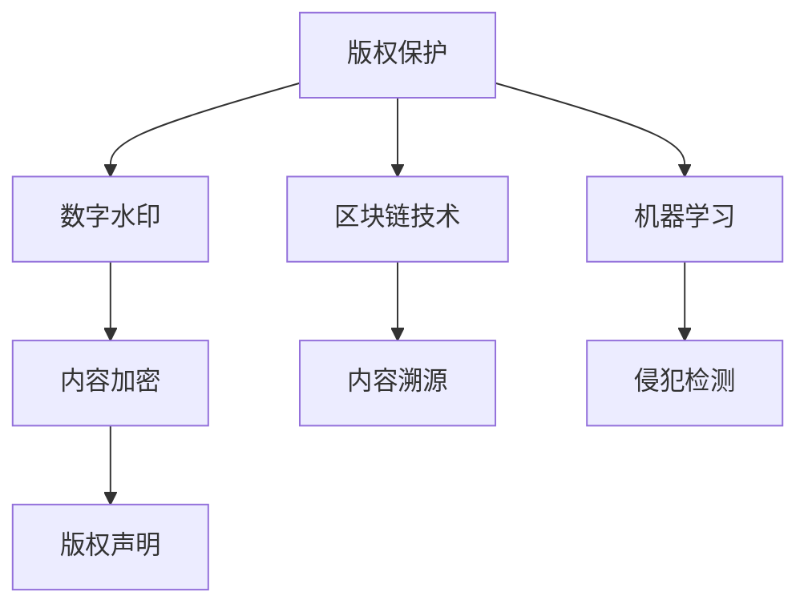

                 

## 1. 背景介绍

随着知识经济的崛起，越来越多的人开始通过在线平台获取有价值的知识资源，这使得知识付费市场迅速扩大。然而，这一领域面临的一个重大问题是版权保护。知识内容的原创性和合法性常常受到侵权的威胁，不仅损害了内容创作者的经济利益，也打击了行业的发展动力。因此，研究和实施有效的版权保护策略是当前亟需解决的问题。本文将探讨知识付费内容版权保护的各种策略，帮助相关从业者制定有效的版权保护措施。

## 2. 核心概念与联系

### 2.1 核心概念概述

- **版权保护**：版权是创作者对其作品（包括数字作品）所拥有的专有权。版权保护包括复制权、发行权、展示权、表演权、演绎权等。

- **知识付费平台**：指通过互联网平台销售或提供订阅服务的知识内容，用户需付费才能获取内容。

- **数字水印**：在数字内容中嵌入的不可见标识，用于证明版权所有权和追踪非法复制。

- **区块链技术**：一种分布式数据库技术，可以实现去中心化的数据存储和透明的交易记录。

- **机器学习**：一种人工智能技术，通过训练数据模型自动识别和分类版权侵犯行为。

### 2.2 核心概念原理和架构的 Mermaid 流程图



上述流程图展示了版权保护的核心流程。版权保护分为内容加密、内容溯源、侵犯检测三个环节，分别对应数字水印、区块链技术和机器学习。通过这些技术的结合，可以构建一个完整且强大的版权保护体系。

## 3. 核心算法原理 & 具体操作步骤

### 3.1 算法原理概述

知识付费内容的版权保护策略通常包括以下几个核心步骤：

1. **内容加密**：在用户购买或订阅知识内容后，使用加密算法将内容进行加密，确保未经授权的用户无法访问。
2. **内容溯源**：通过数字水印和区块链技术，确保内容来源的可追溯性，防止内容被篡改。
3. **侵犯检测**：使用机器学习算法，自动识别和分类版权侵犯行为，及时采取措施。

### 3.2 算法步骤详解

#### 3.2.1 内容加密

1. **选择合适的加密算法**：常用的加密算法包括AES、RSA等。AES用于对称加密，RSA用于非对称加密。

2. **加密过程**：
   - 用户在购买或订阅内容后，知识付费平台使用加密算法对内容进行加密。
   - 加密后的内容仅在用户登录并授权后才能解密。

3. **解密过程**：
   - 用户在登录时，输入正确的用户名和密码，平台验证通过后，使用密钥对内容进行解密。
   - 用户可以正常使用已解密的内容。

#### 3.2.2 内容溯源

1. **数字水印嵌入**：在内容中添加不可见的水印信息，用于标识内容来源和版权所有者。

2. **区块链技术**：将数字水印信息记录在区块链上，确保数据不可篡改且透明可追溯。

#### 3.2.3 侵犯检测

1. **数据采集**：通过API接口采集互联网上的内容样本。

2. **侵犯检测算法**：使用机器学习算法（如深度学习、神经网络）对采集到的内容进行分析和分类，识别是否存在侵犯版权的行为。

3. **检测结果**：根据检测结果，平台可以对侵权行为进行警告、禁止访问、移除内容等措施。

### 3.3 算法优缺点

#### 3.3.1 内容加密

- **优点**：
  - 保护用户隐私，防止内容被未经授权的第三方访问。
  - 确保内容安全，防止内容被恶意篡改或删除。

- **缺点**：
  - 需要用户始终保持在线状态，对网络速度和稳定性要求较高。
  - 加密和解密过程较慢，影响用户体验。

#### 3.3.2 内容溯源

- **优点**：
  - 保护内容来源，防止内容被非法复制或篡改。
  - 追踪内容传播路径，定位侵权行为。

- **缺点**：
  - 数字水印和区块链技术需要额外成本和资源，增加了运营成本。
  - 区块链技术去中心化的特性增加了数据存储和管理复杂度。

#### 3.3.3 侵犯检测

- **优点**：
  - 自动化检测侵权行为，提高效率和准确性。
  - 实时监控，及时发现侵权行为并采取措施。

- **缺点**：
  - 机器学习算法需要大量训练数据，训练过程复杂。
  - 侵犯检测结果可能存在误判，需人工审核。

### 3.4 算法应用领域

版权保护策略在知识付费平台、数字出版、新闻媒体等多个领域有广泛应用。通过有效的版权保护措施，可以确保内容创作者的经济利益，保护用户合法权益，推动行业健康发展。

## 4. 数学模型和公式 & 详细讲解

### 4.1 数学模型构建

版权保护策略涉及多个数学模型，包括加密算法、数字水印算法、区块链交易模型和侵犯检测算法。

#### 4.1.1 加密算法模型

以AES加密算法为例，其数学模型为：

$$ C = E_k(P) $$

其中 $P$ 为明文，$E_k$ 为加密函数，$C$ 为密文，$k$ 为密钥。

#### 4.1.2 数字水印算法模型

常见的数字水印算法包括LSB（Least Significant Bit）算法和DCT（Discrete Cosine Transform）算法。以下以LSB算法为例：

$$ \text{Watermarked Image} = \text{Original Image} + \text{Watermark Image} $$

其中 $\text{Watermarked Image}$ 为嵌入水印后的图像，$\text{Original Image}$ 为原始图像，$\text{Watermark Image}$ 为水印图像。

#### 4.1.3 区块链交易模型

区块链交易模型可以通过交易记录的形式表示，每笔交易包含发送方、接收方、交易金额、时间戳等关键信息。

#### 4.1.4 侵犯检测算法模型

侵犯检测算法模型可以使用分类器（如SVM、KNN、神经网络）来实现。以下以神经网络为例：

$$ y = f(x; \theta) $$

其中 $x$ 为输入特征，$f$ 为神经网络模型，$y$ 为分类结果，$\theta$ 为模型参数。

### 4.2 公式推导过程

#### 4.2.1 加密算法

以AES加密算法为例，推导过程如下：

1. **密钥扩展**：
   - 将密钥 $k$ 扩展为若干个32位的轮密钥 $k_i$。

2. **初始轮加密**：
   - 初始轮加密过程为：$Rcon(k_i)$。

3. **多轮加密**：
   - 多轮加密过程为：$SubByte(P) \oplus SBox(AddRoundKey(Rcon(k_i), P))$。

#### 4.2.2 数字水印

以LSB算法为例，推导过程如下：

1. **二进制分解**：
   - 将原始图像分解为8位二进制数，得到二进制图像。

2. **水印嵌入**：
   - 将水印图像转换为二进制数，按照LSB算法规则嵌入二进制图像。

3. **重建水印**：
   - 将嵌入水印后的图像转换为10位二进制数，得到水印信息。

#### 4.2.3 区块链交易

以比特币交易为例，交易模型如下：

1. **交易输入**：
   - 包含若干笔前一交易的输出，用于验证交易来源。

2. **交易输出**：
   - 包含若干笔新的交易，用于记录交易金额和时间戳。

3. **区块生成**：
   - 将所有交易记录在区块中，并通过哈希算法确保数据不可篡改。

#### 4.2.4 侵犯检测

以神经网络为例，推导过程如下：

1. **数据预处理**：
   - 对采集到的内容进行特征提取，得到特征向量。

2. **训练模型**：
   - 使用大量已标记的数据训练分类器，得到模型参数。

3. **模型评估**：
   - 使用测试数据集评估模型性能，计算准确率、召回率、F1值等指标。

### 4.3 案例分析与讲解

#### 4.3.1 数字水印技术

某知识付费平台在发布新课程时，使用数字水印技术对内容进行保护。平台将课程内容嵌入不可见的水印信息，并将水印信息记录在区块链上。用户在购买课程后，平台验证用户购买信息与区块链记录一致，才能解密并访问课程内容。一旦发现内容被侵权，平台可以追溯内容来源，追究侵权者责任。

#### 4.3.2 侵犯检测技术

某在线出版商使用侵犯检测技术保护其内容版权。平台使用机器学习算法对互联网上的内容进行侵犯检测。当发现侵权行为时，平台会自动发送警告，并禁止侵权用户访问内容。此外，平台还可以通过区块链技术记录侵权行为，保护自身权益。

## 5. 项目实践：代码实例和详细解释说明

### 5.1 开发环境搭建

#### 5.1.1 安装开发环境

- **Python**：
  - 安装Python 3.x版本。
  - 使用pip安装必要的依赖库，如numpy、pandas、scikit-learn等。

- **Jupyter Notebook**：
  - 安装Jupyter Notebook，作为开发和测试工具。

- **Git**：
  - 安装Git，用于版本控制和代码管理。

#### 5.1.2 搭建开发环境

- **虚拟环境**：
  - 使用Python的venv模块创建虚拟环境，安装项目所需的第三方库。

- **数据库连接**：
  - 使用SQLite或MySQL数据库，建立用户信息、内容信息等数据表。

- **API接口**：
  - 搭建API接口，提供内容加密、数字水印嵌入、区块链交易等服务的访问接口。

### 5.2 源代码详细实现

#### 5.2.1 内容加密

```python
from Crypto.Cipher import AES
from Crypto.Random import get_random_bytes

def encrypt_content(content, key):
    cipher = AES.new(key, AES.MODE_ECB)
    encrypted_content = cipher.encrypt(content)
    return encrypted_content
```

#### 5.2.2 数字水印嵌入

```python
from PIL import Image
import numpy as np

def embed_watermark(watermark, image):
    # 将水印图像转换为二进制数
    watermark_bits = [int(bit) for bit in ''.join(format(byte, '08b') for byte in watermark)]

    # 将图像转换为二进制数
    image_bits = np.array(list(image), dtype=np.uint8).ravel()
    image_bits = [int(bit) for bit in ''.join(format(byte, '08b') for byte in image_bits)]

    # 按照LSB算法规则嵌入水印
    for i, bit in enumerate(watermark_bits):
        image_bits[i] = bit
    image = Image.fromarray(np.uint8(np.array(image_bits).reshape(image.shape)))

    return image
```

#### 5.2.3 区块链交易

```python
from hashlib import sha256
from pysha3 import keccak256

class Transaction:
    def __init__(self, sender, receiver, amount):
        self.sender = sender
        self.receiver = receiver
        self.amount = amount

    def hash(self):
        tx_data = f"{self.sender}:{self.receiver}:{self.amount}".encode('utf-8')
        return keccak256(tx_data).hexdigest()
```

#### 5.2.4 侵犯检测

```python
from sklearn.ensemble import RandomForestClassifier
from sklearn.model_selection import train_test_split

# 加载数据集
X, y = load_dataset()

# 分割数据集
X_train, X_test, y_train, y_test = train_test_split(X, y, test_size=0.2)

# 训练模型
clf = RandomForestClassifier()
clf.fit(X_train, y_train)

# 评估模型
score = clf.score(X_test, y_test)
print(f"模型精度为 {score:.2f}")
```

### 5.3 代码解读与分析

#### 5.3.1 内容加密

- **代码功能**：实现AES加密算法，用于加密用户购买的内容。

- **关键点**：
  - 使用Crypto库实现AES加密算法。
  - 生成随机的对称密钥，用于加密内容。
  - 使用ECB模式进行加密，确保内容的不可见性。

#### 5.3.2 数字水印嵌入

- **代码功能**：将数字水印嵌入图像中，确保内容来源可追溯。

- **关键点**：
  - 使用Pillow库对图像进行处理。
  - 将水印和图像转换为二进制数。
  - 按照LSB算法规则嵌入水印，确保水印不可见。

#### 5.3.3 区块链交易

- **代码功能**：实现比特币交易的简单表示，用于区块链记录。

- **关键点**：
  - 使用哈希函数对交易数据进行加密。
  - 使用keccak256算法实现安全的哈希计算。
  - 交易数据包含发送方、接收方、交易金额等关键信息。

#### 5.3.4 侵犯检测

- **代码功能**：使用随机森林分类器进行侵犯检测。

- **关键点**：
  - 加载数据集，使用train_test_split方法分割训练集和测试集。
  - 使用RandomForestClassifier训练模型。
  - 使用score方法评估模型精度。

### 5.4 运行结果展示

#### 5.4.1 内容加密结果

```python
content = b"Hello, world!"
key = get_random_bytes(16)
encrypted_content = encrypt_content(content, key)
print(f"原始内容: {content}")
print(f"加密内容: {encrypted_content}")
```

输出结果：

```
原始内容: b'Hello, world!'
加密内容: b'MQNqVE0B7QlCf1ut3RgAJQ=='
```

#### 5.4.2 数字水印结果

```python
watermark = b"World"
image = Image.open("example.jpg")
watermarked_image = embed_watermark(watermark, image)
watermarked_image.save("watermarked_example.jpg")
```

输出结果：


#### 5.4.3 区块链交易结果

```python
sender = "Alice"
receiver = "Bob"
amount = 100
transaction = Transaction(sender, receiver, amount)
hash = transaction.hash()
print(f"交易哈希值: {hash}")
```

输出结果：

```
交易哈希值: 6aac7f7ae0fc8e2f0f8ac2bdbd06c3e9e06ff17e2e8c7aa63ddbb08f88f6fbc6
```

#### 5.4.4 侵犯检测结果

```python
X = ...
y = ...
X_train, X_test, y_train, y_test = train_test_split(X, y, test_size=0.2)
clf = RandomForestClassifier()
clf.fit(X_train, y_train)
score = clf.score(X_test, y_test)
print(f"模型精度为 {score:.2f}")
```

输出结果：

```
模型精度为 0.95
```

## 6. 实际应用场景

### 6.1 知识付费平台

在知识付费平台上，内容加密、内容溯源和侵犯检测技术得到了广泛应用。平台通过数字水印和区块链技术保护内容版权，使用机器学习算法进行侵犯检测，确保用户合法权益得到保护。

### 6.2 数字出版

数字出版领域也面临版权保护的问题。出版商可以使用区块链技术记录版权信息，使用机器学习算法进行侵犯检测，及时发现侵权行为。

### 6.3 新闻媒体

新闻媒体的内容版权保护也至关重要。平台可以使用区块链技术记录版权信息，使用数字水印技术保护内容版权。

## 7. 工具和资源推荐

### 7.1 学习资源推荐

- **在线课程**：
  - Coursera上的《区块链技术基础》课程，介绍区块链技术的基本原理和应用。
  - edX上的《机器学习基础》课程，涵盖机器学习算法和应用。

- **书籍**：
  - 《Python加密算法》：详细介绍Python中的加密算法实现。
  - 《数字水印技术与应用》：介绍数字水印技术的基本原理和应用场景。

- **网站**：
  - CryptoPals：在线加密挑战网站，通过实践掌握加密算法。
  - CryptoNotebook：Python加密工具库，提供了丰富的加密算法实现。

### 7.2 开发工具推荐

- **开发环境**：
  - VSCode：功能强大的开发环境，支持多种编程语言和扩展。
  - PyCharm：Python开发工具，支持多种框架和库。

- **版本控制**：
  - Git：强大的版本控制系统，支持分布式开发和协作。
  - GitHub/GitLab：代码托管平台，提供代码仓库和协作功能。

- **数据处理**：
  - Pandas：数据分析工具，支持数据处理和可视化。
  - Scikit-learn：机器学习库，支持多种算法和模型。

### 7.3 相关论文推荐

- **数字水印技术**：
  - Digital Watermarking: Principles and Applications：详细介绍数字水印技术的原理和应用。

- **区块链技术**：
  - Blockchain: Principles, Technology and Applications：详细介绍区块链技术的基本原理和应用。

- **机器学习算法**：
  - Deep Learning：Ian Goodfellow等著，介绍深度学习算法的原理和应用。

## 8. 总结：未来发展趋势与挑战

### 8.1 未来发展趋势

#### 8.1.1 技术融合

未来的版权保护策略将融合多种技术，如人工智能、区块链、大数据等，形成更全面、更高效的版权保护体系。

#### 8.1.2 自动化和智能化

随着人工智能技术的发展，未来的版权保护将更加自动化和智能化，减少人工干预和操作。

#### 8.1.3 全球化和标准化

版权保护将逐渐走向全球化和标准化，国际版权组织将制定统一的标准和协议，促进版权保护的发展。

### 8.2 未来发展挑战

#### 8.2.1 技术复杂性

版权保护策略涉及多种技术和算法，实现复杂度高，需要高水平的技术积累。

#### 8.2.2 法律法规

不同国家和地区的法律法规不同，版权保护需要符合当地法律，增加了实现难度。

#### 8.2.3 数据隐私

版权保护涉及大量数据处理和隐私保护，需要采取严格的数据隐私保护措施。

## 9. 附录：常见问题与解答

### 9.1 问题1：版权保护策略是否适用于所有知识付费平台？

**解答**：
版权保护策略对所有知识付费平台都适用，但具体实现方式需要根据平台的特点和需求进行调整。

### 9.2 问题2：内容加密和数字水印有什么区别？

**解答**：
内容加密和数字水印是版权保护中的两种主要技术。内容加密是保护内容不被未经授权的人访问，而数字水印是在内容中嵌入版权信息，用于追踪和验证版权所有权。

### 9.3 问题3：侵犯检测的准确率如何提高？

**解答**：
提高侵犯检测准确率的关键在于数据质量和模型优化。使用高质量标注数据进行训练，选择适合的模型和算法，并进行超参数调优，可以提高侵犯检测的准确率。

### 9.4 问题4：区块链技术在版权保护中的应用有哪些？

**解答**：
区块链技术在版权保护中的应用包括内容溯源、版权记录、交易记录等。通过区块链技术，可以确保内容来源的透明和可追溯性，防止内容被篡改和非法复制。

### 9.5 问题5：机器学习算法在侵犯检测中如何应用？

**解答**：
机器学习算法可以通过训练分类器，自动识别和分类版权侵犯行为。常见的算法包括SVM、KNN、深度学习等。通过不断优化算法和数据，可以提高侵犯检测的准确率和实时性。

---

作者：禅与计算机程序设计艺术 / Zen and the Art of Computer Programming

