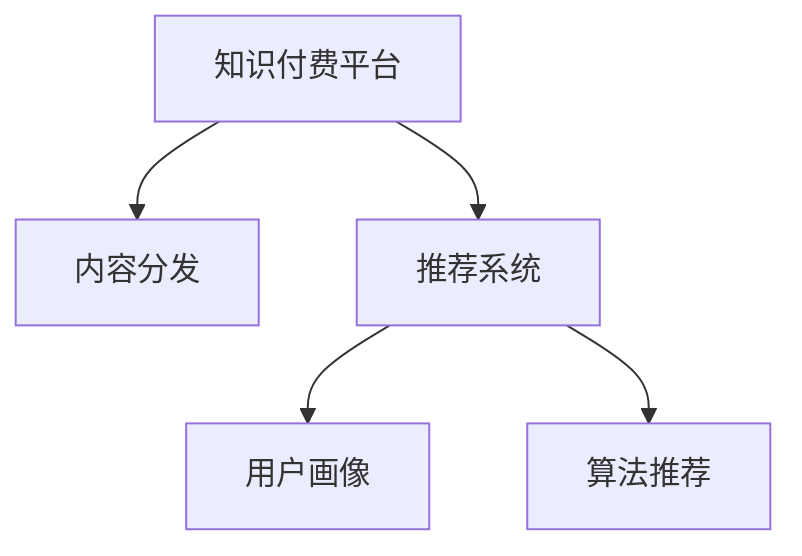

                 

# 知识付费创业中的内容分发策略

> 关键词：知识付费,内容分发,算法推荐,用户体验,流量优化

## 1. 背景介绍

### 1.1 问题由来

随着知识付费平台的兴起，内容分发策略已成为知识付费创业公司成功的关键因素之一。优秀的分发策略不仅能够提高用户留存率、增加订阅收入，还能提升内容平台的品牌影响力和市场竞争力。然而，面对海量用户和复杂的多样化需求，如何高效、精准地分发内容，成为了行业的一大难题。

### 1.2 问题核心关键点

面对上述挑战，本文聚焦于知识付费平台中的内容分发策略，提出了一套基于算法的推荐系统，旨在通过高效的内容分发，提升用户体验，优化流量结构，增强平台粘性，实现可持续发展。文章将详细探讨内容分发的算法原理、具体操作步骤、数学模型、项目实践，并分析其在实际应用场景中的效果和未来展望，为知识付费创业提供切实可行的策略建议。

## 2. 核心概念与联系

### 2.1 核心概念概述

为了更好地理解知识付费平台的内容分发策略，本节将介绍几个密切相关的核心概念：

- 知识付费平台(Knowledge-Pay-to-Use Platform)：指通过付费机制向用户提供特定知识服务，如在线课程、电子书、音频、视频等平台。
- 内容分发(Content Distribution)：指将优质内容精准推送到目标用户的过程。通过有效的分发策略，提升用户粘性和平台收益。
- 推荐系统(Recommendation System)：基于用户行为数据和内容特征，自动推荐个性化内容，提升用户体验。
- 用户画像(User Persona)：通过对用户行为的分析，构建用户兴趣模型，精准推荐相关内容。
- 算法推荐(Algorithm-Based Recommendation)：使用算法模型进行内容推荐，相较于人工编辑，能更快速响应市场变化。

这些核心概念之间的逻辑关系可以通过以下Mermaid流程图来展示：



这个流程图展示了几者之间的联系：

1. 知识付费平台通过推荐系统分发内容。
2. 推荐系统依赖用户画像构建推荐模型。
3. 算法推荐是推荐系统的核心。

## 3. 核心算法原理 & 具体操作步骤

### 3.1 算法原理概述

知识付费平台的内容分发策略核心是推荐系统。基于协同过滤、基于内容的推荐、混合推荐等算法，可以高效地将内容推荐给用户。推荐系统通过分析用户历史行为数据、用户画像、内容特征等，预测用户对不同内容的偏好，从而实现个性化推荐。

推荐系统的目标是为每个用户找到最优的内容组合，以最大化平台收益和用户满意度。常见的推荐算法包括：

- 协同过滤(Collaborative Filtering)：基于用户与内容之间的相似度进行推荐。
- 基于内容的推荐(Content-Based Recommendation)：根据内容的属性特征预测用户兴趣。
- 混合推荐(Mixed Recommendation)：结合多种推荐算法，综合考虑用户和内容多维度的信息。
- 深度学习推荐(Deep Learning Recommendation)：利用深度神经网络进行内容推荐。

### 3.2 算法步骤详解

基于协同过滤的推荐系统操作流程如下：

**Step 1: 数据收集与预处理**
- 收集用户历史行为数据，包括点击、浏览、购买、评分等。
- 对数据进行清洗、去重和缺失值处理。

**Step 2: 用户画像构建**
- 通过协同过滤算法，构建用户兴趣模型。
- 使用TF-IDF等文本挖掘技术，提取内容的关键词和主题。

**Step 3: 模型训练与评估**
- 利用SVD、ALS等协同过滤算法，训练用户兴趣和物品相似度矩阵。
- 在验证集上评估模型效果，选择最优模型。

**Step 4: 个性化推荐**
- 将用户兴趣和物品相似度矩阵应用于推荐模型。
- 根据模型预测，推荐最符合用户兴趣的内容。

### 3.3 算法优缺点

基于协同过滤的推荐系统具有以下优点：
- 无需用户显式反馈，自适应能力强。
- 能够处理冷启动问题，新用户或新内容也能快速得到推荐。
- 不需要领域知识，模型简单。

同时，也存在一些缺点：
- 忽略用户上下文信息，推荐结果可能不够个性化。
- 对数据稀疏性的容忍度较低，难以处理长尾内容。
- 推荐结果可能存在偏差，新用户或冷内容推荐效果较差。

## 4. 数学模型和公式 & 详细讲解 & 举例说明

### 4.1 数学模型构建

协同过滤的数学模型可以表示为：

$$
\hat{y}_{iu} = \sum_{j=1}^{N}\alpha_{ij}x_{ju} + \beta_{iu}
$$

其中，$y_{iu}$表示用户$u$对物品$i$的评分，$\alpha_{ij}$和$\beta_{iu}$为模型参数，$x_{ju}$为用户$u$对物品$j$的评分。通过最大化交叉验证误差，得到模型参数$\alpha_{ij}$和$\beta_{iu}$。

### 4.2 公式推导过程

协同过滤的推荐过程包括：

1. 用户$u$对物品$i$的评分预测
2. 物品$i$的评分计算
3. 物品$i$的排序

具体推导过程如下：

**Step 1: 用户评分预测**
- 利用用户-物品矩阵$R_{iu}$，求解用户$u$对物品$i$的评分预测$\hat{y}_{iu}$：

$$
\hat{y}_{iu} = \sum_{j=1}^{N}\alpha_{ij}x_{ju} + \beta_{iu}
$$

**Step 2: 物品评分计算**
- 利用物品-物品矩阵$P_{ij}$，计算物品$i$的平均评分：

$$
p_i = \frac{\sum_{j=1}^{N}x_{ij}}{N}
$$

**Step 3: 物品排序**
- 根据物品$i$的评分$p_i$，将其排序，推荐给用户$u$：

$$
sort_i = \text{sort}(p_i, \sigma)
$$

其中$\sigma$为排序方式。

### 4.3 案例分析与讲解

假设某知识付费平台收集了10万用户的点击和评分数据。通过协同过滤算法，可以得到用户的兴趣模型和物品的相似度矩阵。以用户A为例，模型预测其对物品1的评分$\hat{y}_{A1}$为4.5，根据物品1的平均评分$p_1$为3.9，推荐物品1给用户A。

## 5. 项目实践：代码实例和详细解释说明

### 5.1 开发环境搭建

在进行内容分发策略开发前，我们需要准备好开发环境。以下是使用Python进行Scikit-learn开发的环境配置流程：

1. 安装Anaconda：从官网下载并安装Anaconda，用于创建独立的Python环境。

2. 创建并激活虚拟环境：
```bash
conda create -n python-env python=3.8 
conda activate python-env
```

3. 安装Scikit-learn：
```bash
conda install scikit-learn
```

4. 安装各类工具包：
```bash
pip install numpy pandas scikit-learn matplotlib tqdm jupyter notebook ipython
```

完成上述步骤后，即可在`python-env`环境中开始内容分发策略的开发。

### 5.2 源代码详细实现

下面以协同过滤推荐系统为例，给出使用Scikit-learn库对用户行为数据进行分发的Python代码实现。

```python
from sklearn.metrics.pairwise import cosine_similarity
from sklearn.decomposition import TruncatedSVD
import pandas as pd
import numpy as np

# 读取用户行为数据
data = pd.read_csv('user_behavior_data.csv', sep='\t')

# 构建用户-物品评分矩阵
R = data.pivot_table(values='rating', index='user_id', columns='item_id', aggfunc='mean')

# 对评分矩阵进行归一化
R = (R - R.mean()) / R.std()

# 构建物品-物品相似度矩阵
P = cosine_similarity(R)

# 使用TruncatedSVD进行协同过滤
svd = TruncatedSVD(n_components=50, random_state=42)
P_svd = svd.fit_transform(P)

# 预测用户评分
def predict_ratings(user, item):
    return np.dot(P_svd[user], svd.components_[item].T)

# 获取用户评分
def get_user_ratings(user):
    return R.loc[user].values

# 排序推荐物品
def get_top_items(user, num_items=10):
    ratings = get_user_ratings(user)
    predictions = np.apply_along_axis(predict_ratings, 1, user, range(R.shape[1]))
    sorted_items = np.argsort(predictions)
    return sorted_items[sorted_items < num_items]

# 测试
user = 'user1'
item = 'item1'
print(f"User {user}'s rating of item {item}: {R[user][item]}")
top_items = get_top_items(user)
print(f"Top {len(top_items)} items for user {user}: {top_items}")
```

### 5.3 代码解读与分析

让我们再详细解读一下关键代码的实现细节：

**数据读取与处理**
- 通过`pd.read_csv`方法读取用户行为数据，并转换为Pandas DataFrame格式。
- 使用`pivot_table`方法构建用户-物品评分矩阵$R$。
- 对评分矩阵$R$进行归一化处理，使其均值为0，标准差为1。

**相似度矩阵构建**
- 使用`cosine_similarity`方法计算物品-物品相似度矩阵$P$。
- 使用`TruncatedSVD`方法对相似度矩阵$P$进行降维，得到降维后的矩阵$P_svd$。

**评分预测**
- 定义`predict_ratings`函数，使用降维后的相似度矩阵$P_svd$和用户-物品评分矩阵$R$，预测用户$u$对物品$i$的评分。
- 定义`get_user_ratings`函数，获取用户$u$的评分矩阵。
- 定义`get_top_items`函数，根据用户$u$的评分预测，排序推荐物品。

**测试代码**
- 测试代码展示了如何预测用户$u$对物品$i$的评分，并输出推荐的前$num_items$物品。

可以看到，Scikit-learn库的协同过滤算法实现简洁高效。开发者可以将更多精力放在数据处理、模型改进等高层逻辑上，而不必过多关注底层的实现细节。

当然，工业级的系统实现还需考虑更多因素，如推荐引擎的部署、超参数的自动搜索、更灵活的任务适配层等。但核心的推荐过程基本与此类似。

## 6. 实际应用场景

### 6.1 知识付费课程推荐

基于协同过滤的内容分发策略，可以广泛应用于知识付费课程的推荐。用户通过付费订阅，可以在平台上获取各类课程，但面对海量课程如何高效推荐，成为平台亟待解决的问题。

在技术实现上，可以收集用户的历史浏览和购买记录，将课程与用户行为数据作为协同过滤的输入。协同过滤算法通过分析用户行为和课程特征，预测用户对不同课程的评分，从而实现个性化课程推荐。用户打开推荐栏，就能看到最适合自己的课程，提高学习效率。

### 6.2 文章内容推荐

知识付费平台也提供大量高质量的文章内容。面对海量文章，如何高效推荐给用户，成为提升用户留存率的关键。

在技术实现上，可以收集用户的历史阅读记录，将文章与用户行为数据作为协同过滤的输入。协同过滤算法通过分析用户行为和文章特征，预测用户对不同文章的评分，从而实现个性化文章推荐。用户通过推荐栏，可以更快找到感兴趣的文章，提升阅读体验。

### 6.3 视频内容推荐

视频内容推荐同样可以应用协同过滤策略。视频平台面对大量视频内容，如何高效推荐给用户，是提升平台收益的关键。

在技术实现上，可以收集用户的历史观看记录，将视频与用户行为数据作为协同过滤的输入。协同过滤算法通过分析用户行为和视频特征，预测用户对不同视频的评分，从而实现个性化视频推荐。用户通过推荐栏，可以更快找到感兴趣的视频内容，提高观看体验。

### 6.4 未来应用展望

随着协同过滤等推荐算法的不断发展，内容分发策略将逐步普及到各类知识付费平台中。未来的内容分发策略将呈现以下几个发展趋势：

1. 推荐系统算法将更加多样。推荐算法将结合协同过滤、内容分析、社交网络等多种算法，综合考虑用户和内容多维度的信息。
2. 推荐系统将更加个性化。通过引入深度学习等技术，推荐系统将更加关注用户的个性化需求，提升用户满意度。
3. 推荐系统将更加注重内容的多样性。通过引入探索性算法，推荐系统将更加注重内容的多样性，避免信息茧房。
4. 推荐系统将更加注重实时性。通过引入流数据处理技术，推荐系统将能够实时响应用户需求，提升用户体验。
5. 推荐系统将更加注重安全性。通过引入对抗攻击检测等技术，推荐系统将能够抵御恶意内容推荐，保障用户安全。

以上趋势凸显了推荐系统在知识付费平台中的重要性。这些方向的探索发展，必将进一步提升知识付费平台的用户体验和市场竞争力，为平台带来更大的商业价值。

## 7. 工具和资源推荐

### 7.1 学习资源推荐

为了帮助开发者系统掌握推荐系统的理论基础和实践技巧，这里推荐一些优质的学习资源：

1. 《推荐系统实践》系列博文：由推荐系统专家撰写，深入浅出地介绍了推荐系统的基本概念和经典算法。

2. CS445《推荐系统》课程：斯坦福大学开设的推荐系统课程，有Lecture视频和配套作业，带你入门推荐系统领域的基本概念和经典模型。

3. 《推荐系统》书籍：李航著，全面介绍了推荐系统的理论基础和实践方法，是推荐系统学习的经典教材。

4. KDD Cup 2019推荐系统竞赛：通过实际数据集竞赛，可以更深入理解推荐系统的应用场景和技术细节。

5. KDD Cup 2020推荐系统竞赛：最新的推荐系统竞赛数据集，了解当前推荐系统的最新研究方向和应用前景。

通过对这些资源的学习实践，相信你一定能够快速掌握推荐系统的精髓，并用于解决实际的推荐问题。

### 7.2 开发工具推荐

高效的推荐系统开发离不开优秀的工具支持。以下是几款用于推荐系统开发的常用工具：

1. Scikit-learn：基于Python的开源机器学习库，提供了多种经典推荐算法实现。

2. TensorFlow：由Google主导开发的开源深度学习框架，适合大规模工程应用。

3. PyTorch：基于Python的开源深度学习框架，适合快速迭代研究。

4. Weights & Biases：模型训练的实验跟踪工具，可以记录和可视化模型训练过程中的各项指标，方便对比和调优。

5. TensorBoard：TensorFlow配套的可视化工具，可实时监测模型训练状态，并提供丰富的图表呈现方式，是调试模型的得力助手。

6. Jupyter Notebook：交互式编程环境，方便开发者进行代码调试和数据分析。

合理利用这些工具，可以显著提升推荐系统的开发效率，加快创新迭代的步伐。

### 7.3 相关论文推荐

推荐系统的研究源于学界的持续研究。以下是几篇奠基性的相关论文，推荐阅读：

1. The Bellkhop-Rank (BR) Algorithm for Recommender Systems（即协同过滤算法）：提出了协同过滤的基本原理和实现方法。

2. Topic Models for Recommendations：通过引入潜在语义分析，增强推荐系统的多样性。

3. Matrix Factorization Techniques for Recommender Systems：介绍了矩阵分解等推荐算法，为推荐系统提供了理论基础。

4. Hybrid Recommendation Systems: Survey and Experiments on Predictive Accuracy（即混合推荐算法）：分析了多种推荐算法的优缺点，提出了混合推荐系统的构建方法。

5. Neural Collaborative Filtering：提出深度神经网络模型，用于协同过滤推荐系统。

这些论文代表了大语言模型微调技术的发展脉络。通过学习这些前沿成果，可以帮助研究者把握学科前进方向，激发更多的创新灵感。

## 8. 总结：未来发展趋势与挑战

### 8.1 总结

本文对知识付费平台中的内容分发策略进行了全面系统的介绍。首先阐述了推荐系统在知识付费平台中的重要性，明确了协同过滤等推荐算法的核心作用。其次，从原理到实践，详细讲解了推荐系统的算法原理和具体操作步骤，给出了推荐系统任务开发的完整代码实例。同时，本文还广泛探讨了推荐系统在实际应用场景中的效果和未来展望，为知识付费创业提供切实可行的策略建议。

通过本文的系统梳理，可以看到，推荐系统在知识付费平台中的重要性和应用前景。协同过滤算法在实际应用中已经展现出巨大的价值，未来随着推荐算法的发展，内容分发策略必将进一步优化，为用户带来更加个性化、多样化的内容推荐，提升平台粘性和收益。

### 8.2 未来发展趋势

展望未来，知识付费平台中的推荐系统将呈现以下几个发展趋势：

1. 算法多样性将增加。推荐算法将结合协同过滤、内容分析、社交网络等多种算法，综合考虑用户和内容多维度的信息。

2. 个性化将更加精准。通过引入深度学习等技术，推荐系统将更加关注用户的个性化需求，提升用户满意度。

3. 内容多样性将更加重要。通过引入探索性算法，推荐系统将更加注重内容的多样性，避免信息茧房。

4. 实时性将更加显著。通过引入流数据处理技术，推荐系统将能够实时响应用户需求，提升用户体验。

5. 安全性将更加重要。通过引入对抗攻击检测等技术，推荐系统将能够抵御恶意内容推荐，保障用户安全。

以上趋势凸显了推荐系统在知识付费平台中的重要性。这些方向的探索发展，必将进一步提升知识付费平台的用户体验和市场竞争力，为平台带来更大的商业价值。

### 8.3 面临的挑战

尽管推荐系统已经取得了显著成果，但在迈向更加智能化、普适化应用的过程中，仍面临诸多挑战：

1. 数据量瓶颈。虽然推荐系统能够高效处理大规模数据，但对于极端长尾内容，仍然需要大量标注数据来提升推荐效果。如何高效利用用户行为数据，提升推荐效果，是重要的研究方向。

2. 冷启动问题。新用户或新内容往往缺乏足够的行为数据，难以进行精准推荐。如何利用用户画像和内容特征，进行冷启动推荐，是推荐系统亟需解决的问题。

3. 模型复杂性。深度学习等技术虽然能够提升推荐精度，但模型复杂度高，计算量大，难以高效部署。如何优化模型结构，降低计算复杂度，是推荐系统的重要研究方向。

4. 算法透明性。推荐系统的推荐结果往往难以解释，缺乏透明性。如何提高推荐系统的可解释性，让用户理解推荐过程，是推荐系统的重要挑战。

5. 安全性问题。推荐系统容易受到恶意攻击，如假数据注入、恶意内容推荐等。如何提升推荐系统的安全性，保障用户利益，是推荐系统的重要研究方向。

这些挑战需要研究者在算法、数据、工程等多个维度共同努力，才能使推荐系统更加高效、准确、可靠。

### 8.4 研究展望

面对推荐系统所面临的种种挑战，未来的研究需要在以下几个方面寻求新的突破：

1. 引入深度学习等技术，提升推荐精度。深度学习能够更好地捕捉用户行为和内容特征，提升推荐系统的多样性和个性化。

2. 开发高效低成本的协同过滤算法。高效低成本的协同过滤算法能够更好地处理大规模数据，提升推荐系统的效果和实时性。

3. 引入对抗攻击检测等技术，提升推荐系统的安全性。对抗攻击检测技术能够及时发现并抵御恶意攻击，保障用户安全。

4. 开发可解释性推荐系统。可解释性推荐系统能够帮助用户理解推荐过程，提升用户信任度和满意度。

5. 引入多模态推荐技术。多模态推荐系统能够结合不同模态的信息，提升推荐系统的多样性和个性化。

这些研究方向的发展，必将进一步提升推荐系统的效果和应用前景，为知识付费平台带来更大的商业价值。

## 9. 附录：常见问题与解答

**Q1：推荐系统中的协同过滤算法有哪些优缺点？**

A: 协同过滤算法的优缺点如下：
- 优点：无需用户显式反馈，自适应能力强；能够处理冷启动问题，新用户或新内容也能快速得到推荐；不需要领域知识，模型简单。
- 缺点：忽略用户上下文信息，推荐结果可能不够个性化；对数据稀疏性的容忍度较低，难以处理长尾内容；推荐结果可能存在偏差，新用户或冷内容推荐效果较差。

**Q2：推荐系统中的深度学习算法有哪些优缺点？**

A: 深度学习算法的优缺点如下：
- 优点：能够捕捉复杂非线性关系，提升推荐精度；模型能够自学习，不需要领域知识；能够处理大规模数据。
- 缺点：模型复杂度高，计算量大，难以高效部署；需要大量标注数据，数据标注成本高；模型黑盒化，可解释性差。

**Q3：推荐系统中的混合推荐算法有哪些优缺点？**

A: 混合推荐算法的优缺点如下：
- 优点：综合多种推荐算法，能够更全面地考虑用户和内容信息；能够处理冷启动问题，提升推荐效果。
- 缺点：算法复杂度高，计算量大；需要设计合理的算法组合策略；算法调参难度大，效果不稳定。

**Q4：推荐系统中的冷启动问题如何解决？**

A: 推荐系统中的冷启动问题可以通过以下方式解决：
- 利用用户画像和内容特征进行推荐，根据用户的兴趣和内容属性，进行推荐。
- 引入用户行为模拟技术，根据用户历史行为和相似用户行为，进行推荐。
- 利用聚类和关联规则等技术，发现相似用户或相似内容，进行推荐。

**Q5：推荐系统中的安全性问题如何解决？**

A: 推荐系统中的安全性问题可以通过以下方式解决：
- 引入对抗攻击检测技术，及时发现和抵御恶意攻击。
- 设计安全推荐算法，避免恶意内容推荐。
- 对推荐系统进行监控和审计，及时发现并修复漏洞。

这些研究方向的发展，必将进一步提升推荐系统的效果和应用前景，为知识付费平台带来更大的商业价值。

