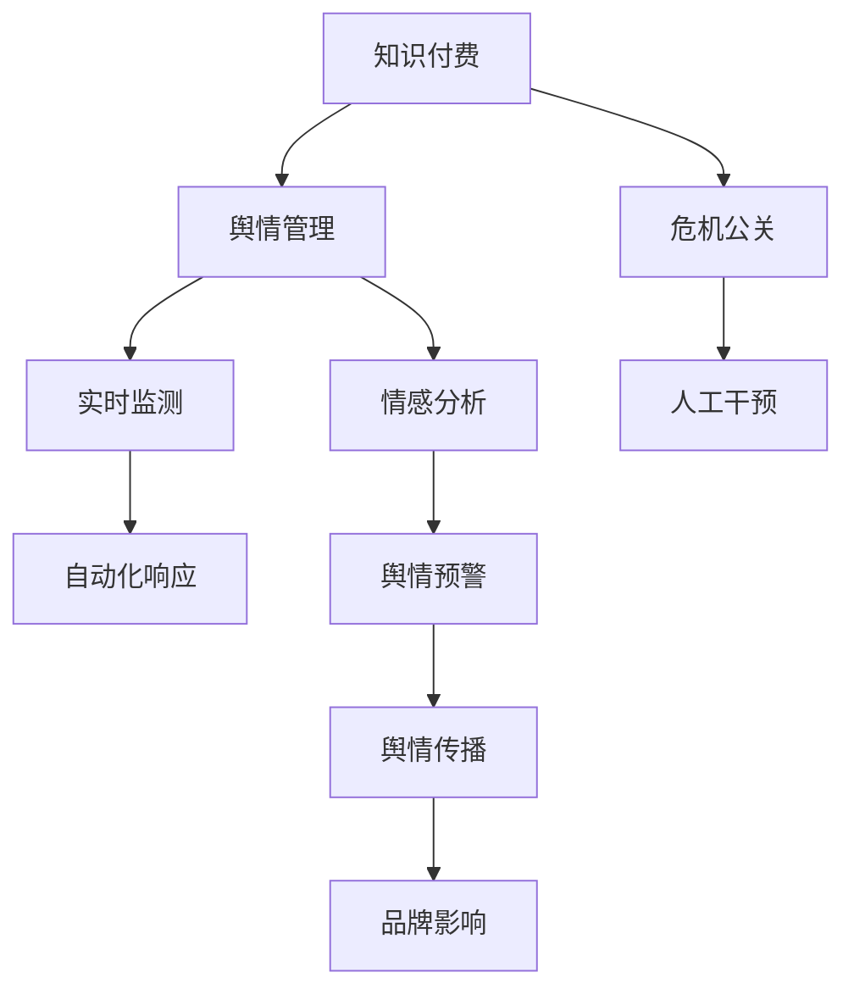

                 

# 知识付费创业中的危机公关与舆情管理

> 关键词：知识付费, 危机公关, 舆情管理, 人工智能, 自然语言处理, 情感分析, 实时监测, 自动化响应, 危机预警, 品牌保护, 用户满意度

## 1. 背景介绍

### 1.1 问题由来
随着知识付费的兴起，越来越多的知识服务提供商涌现。然而，行业竞争激烈，市场环境瞬息万变，任何一次危机事件都可能对企业造成不可逆的打击。如何有效地进行危机公关，及时应对舆情，成为知识付费创业成功的关键。

近年来，随着技术的进步，利用人工智能（AI）和自然语言处理（NLP）技术进行舆情监测和自动化响应，已经成为了企业应对危机的有效手段。但同时，这些技术的应用还面临着诸多挑战，需要进一步优化和创新。

### 1.2 问题核心关键点
- 危机公关：企业在面临危机时，通过及时的沟通和舆论引导，挽回声誉和客户信任。
- 舆情管理：利用技术手段实时监测和分析舆情，提前预警危机，提高响应速度。
- AI与NLP：借助AI和NLP技术，自动分析和理解海量文本数据，提供高效、精确的舆情分析和自动化响应。

## 2. 核心概念与联系

### 2.1 核心概念概述

为更好地理解知识付费创业中的危机公关与舆情管理，本节将介绍几个密切相关的核心概念：

- **知识付费（Knowledge-based Subscription Model）**：用户为获取有价值的知识内容而支付费用的服务模式，常见形式包括在线课程、音频播客、电子书等。

- **危机公关（Crisis Public Relations）**：企业或个人在面临危机事件时，通过有效沟通和公关活动，修复形象，恢复公众信任。

- **舆情管理（Public Opinion Management）**：通过技术手段监测和分析公众对企业或个人的态度和意见，进行科学决策和管理。

- **自然语言处理（Natural Language Processing, NLP）**：使用计算机技术理解和生成人类语言的技术，包括文本分类、情感分析、命名实体识别等。

- **情感分析（Sentiment Analysis）**：利用NLP技术分析文本中的情感倾向，判断公众情绪。

- **实时监测（Real-time Monitoring）**：通过AI技术实时监测网络信息流，及时发现舆情变化。

- **自动化响应（Automated Response）**：基于AI技术，自动生成和发布公关信息，提升响应速度。

这些核心概念之间的逻辑关系可以通过以下Mermaid流程图来展示：



这个流程图展示了几者的核心联系：

1. 知识付费与舆情管理、危机公关紧密关联，舆情管理是危机公关的前提和基础。
2. 实时监测和情感分析构成了舆情管理的主要手段。
3. 自动化响应是危机公关的有效工具，提高响应速度和效率。
4. 舆情预警能够提前识别潜在危机，及时采取应对措施。
5. 人工干预和舆情传播是危机公关的关键环节，需结合AI技术和人工智慧共同进行。

## 3. 核心算法原理 & 具体操作步骤
### 3.1 算法原理概述

基于人工智能和自然语言处理技术的企业危机公关与舆情管理，本质上是一个数据驱动的决策支持过程。其核心思想是：通过实时监测和分析社交媒体、新闻报道、评论等文本数据，判断企业当前所处舆情状态，基于情感分析等技术，评估舆情情绪，并根据预警阈值触发危机公关策略。

形式化地，假设企业当前面临的舆情状态为 $S$，舆情情绪为 $E$，危机公关策略为 $C$。则目标是通过以下公式，最小化舆情风险：

$$
\min_{S,E,C} \mathcal{L}(S,E,C)
$$

其中 $\mathcal{L}$ 为损失函数，用于衡量舆情状态 $S$、舆情情绪 $E$ 和危机公关策略 $C$ 的协同效果。

### 3.2 算法步骤详解

基于AI和NLP技术的企业危机公关与舆情管理一般包括以下几个关键步骤：

**Step 1: 数据收集与预处理**
- 使用API或爬虫工具，实时收集社交媒体、新闻、论坛等平台的文本数据。
- 对文本数据进行清洗，去除无关信息、噪音数据等。

**Step 2: 情感分析**
- 利用NLP技术对文本数据进行情感分析，判断情绪正负性。
- 可采用LSTM、BERT等模型进行情感分类，计算每个文本的情感得分。

**Step 3: 舆情监测与预警**
- 利用实时监测技术，对情感分析结果进行时间序列分析。
- 设定舆情预警阈值，当情感得分超过阈值时，触发舆情预警。

**Step 4: 自动化响应**
- 根据舆情预警结果，自动生成和发布公关信息。
- 可采用模板生成、文本摘要等技术，提升公关信息质量。

**Step 5: 人工干预**
- 对于重要的舆情事件，结合AI分析和人工经验，进行深入分析和判断。
- 人工干预可以调整自动化响应的策略，提高公关效果。

**Step 6: 效果评估与优化**
- 对危机公关效果进行评估，包括舆情变化趋势、用户满意度等。
- 根据评估结果，调整优化危机公关策略和NLP模型参数。

### 3.3 算法优缺点

基于AI和NLP技术的危机公关与舆情管理方法具有以下优点：
1. 实时监测：能够实时监测舆情变化，提前预警危机，提高响应速度。
2. 自动化响应：自动生成和发布公关信息，减少人工干预，提升效率。
3. 数据驱动：利用大量数据进行分析和决策，提高决策的科学性和准确性。
4. 灵活调整：可根据实际情况，灵活调整危机公关策略和模型参数。

同时，该方法也存在一定的局限性：
1. 数据质量：数据收集和预处理的质量直接影响舆情监测和分析结果。
2. 模型泛化：NLP模型对不同领域的适应性较弱，需要针对具体场景进行微调。
3. 情感识别：情感分析的准确度受文本内容、语言风格等因素影响较大。
4. 人工干预：自动化响应仍需人工监督和调整，存在一定的依赖性。
5. 安全性：自动化响应和数据收集可能带来隐私和安全风险。

尽管存在这些局限性，但就目前而言，基于AI和NLP技术的危机公关与舆情管理方法仍是最主流范式。未来相关研究的重点在于如何进一步降低对人工干预的依赖，提高模型的泛化能力和情感识别的准确度。

### 3.4 算法应用领域

基于AI和NLP技术的危机公关与舆情管理方法，已经在知识付费创业的多个场景中得到广泛应用，例如：

- **用户反馈管理**：利用情感分析技术，实时监测用户对知识产品的评价，及时处理用户反馈。
- **市场舆情监控**：对社交媒体、新闻报道等文本数据进行情感分析，监测市场对企业的态度变化。
- **品牌危机预警**：实时监测和分析舆情，提前预警品牌危机，及时采取应对措施。
- **自动化公关信息生成**：自动生成和发布公关信息，提高响应速度和效率。
- **危机事件分析**：结合人工和AI技术，深入分析危机事件原因和影响，提出改进建议。

除了上述这些经典应用外，AI和NLP技术还被创新性地应用到更多场景中，如舆情预测、品牌声誉管理、竞争对手分析等，为知识付费创业提供了全方位的技术支持。

## 4. 数学模型和公式 & 详细讲解 & 举例说明

### 4.1 数学模型构建

本节将使用数学语言对基于AI和NLP技术的危机公关与舆情管理过程进行更加严格的刻画。

假设舆情数据为 $D=\{(x_i, y_i)\}_{i=1}^N$，其中 $x_i$ 为文本数据，$y_i$ 为情感标签，表示文本 $x_i$ 的情感倾向。

定义舆情监测模型为 $M_{\theta}(x) \in \{0,1\}$，其中 $\theta$ 为模型参数。

情感分析模型为 $S_{\phi}(x) \in [-1,1]$，其中 $\phi$ 为情感分析模型参数。

舆情监测和预警的损失函数为：

$$
\mathcal{L}(\theta, \phi) = \frac{1}{N} \sum_{i=1}^N (y_i - M_{\theta}(x_i))^2 + \lambda (S_{\phi}(x_i) - y_i)^2
$$

其中 $y_i - M_{\theta}(x_i)$ 为舆情监测误差，$S_{\phi}(x_i) - y_i$ 为情感分析误差，$\lambda$ 为平衡系数。

### 4.2 公式推导过程

以下我们以情感分类为例，推导情感分析模型的损失函数及其梯度计算公式。

假设模型 $S_{\phi}$ 在输入 $x$ 上的输出为 $S_{\phi}(x) \in [0,1]$，表示文本 $x$ 的情感倾向。真实标签 $y \in \{0,1\}$。则二分类交叉熵损失函数定义为：

$$
\ell(S_{\phi}(x),y) = -[y\log S_{\phi}(x) + (1-y)\log(1-S_{\phi}(x))]
$$

将其代入损失函数公式，得：

$$
\mathcal{L}(\phi) = -\frac{1}{N}\sum_{i=1}^N [y_i\log S_{\phi}(x_i)+(1-y_i)\log(1-S_{\phi}(x_i))]
$$

根据链式法则，损失函数对参数 $\phi_k$ 的梯度为：

$$
\frac{\partial \mathcal{L}(\phi)}{\partial \phi_k} = -\frac{1}{N}\sum_{i=1}^N (\frac{y_i}{S_{\phi}(x_i)}-\frac{1-y_i}{1-S_{\phi}(x_i)}) \frac{\partial S_{\phi}(x_i)}{\partial \phi_k}
$$

其中 $\frac{\partial S_{\phi}(x_i)}{\partial \phi_k}$ 可进一步递归展开，利用自动微分技术完成计算。

在得到损失函数的梯度后，即可带入参数更新公式，完成模型的迭代优化。重复上述过程直至收敛，最终得到适应舆情监测的情感分析模型。

## 5. 项目实践：代码实例和详细解释说明
### 5.1 开发环境搭建

在进行舆情管理实践前，我们需要准备好开发环境。以下是使用Python进行PyTorch和NLTK库开发的环境配置流程：

1. 安装Anaconda：从官网下载并安装Anaconda，用于创建独立的Python环境。

2. 创建并激活虚拟环境：
```bash
conda create -n pytorch-env python=3.8 
conda activate pytorch-env
```

3. 安装PyTorch：根据CUDA版本，从官网获取对应的安装命令。例如：
```bash
conda install pytorch torchvision torchaudio cudatoolkit=11.1 -c pytorch -c conda-forge
```

4. 安装NLTK：
```bash
pip install nltk
```

5. 安装各类工具包：
```bash
pip install numpy pandas scikit-learn matplotlib tqdm jupyter notebook ipython
```

完成上述步骤后，即可在`pytorch-env`环境中开始舆情管理实践。

### 5.2 源代码详细实现

下面我以情感分析为例，给出使用PyTorch和NLTK库进行舆情监测的Python代码实现。

首先，定义情感分析模型：

```python
from transformers import BertTokenizer, BertForSequenceClassification
from transformers import AdamW
import torch
from nltk.sentiment.vader import SentimentIntensityAnalyzer

# 定义模型和优化器
model = BertForSequenceClassification.from_pretrained('bert-base-cased', num_labels=2)
optimizer = AdamW(model.parameters(), lr=2e-5)

# 定义VADER情感分析器
sia = SentimentIntensityAnalyzer()

# 定义数据预处理函数
def preprocess_text(text):
    tokenizer = BertTokenizer.from_pretrained('bert-base-cased')
    text = tokenizer.encode(text, add_special_tokens=True)
    return text

# 训练函数
def train_epoch(model, data_loader, optimizer):
    model.train()
    total_loss = 0
    for batch in data_loader:
        inputs = batch['input_ids'].to(device)
        attention_mask = batch['attention_mask'].to(device)
        labels = batch['labels'].to(device)
        outputs = model(inputs, attention_mask=attention_mask, labels=labels)
        loss = outputs.loss
        total_loss += loss.item()
        optimizer.zero_grad()
        loss.backward()
        optimizer.step()
    return total_loss / len(data_loader)

# 评估函数
def evaluate(model, data_loader):
    model.eval()
    total_correct = 0
    total_predict = 0
    for batch in data_loader:
        inputs = batch['input_ids'].to(device)
        attention_mask = batch['attention_mask'].to(device)
        labels = batch['labels'].to(device)
        outputs = model(inputs, attention_mask=attention_mask)
        predictions = torch.argmax(outputs.logits, dim=1)
        total_correct += (predictions == labels).sum().item()
        total_predict += len(batch)
    return total_correct / total_predict
```

然后，定义数据加载器：

```python
from torch.utils.data import DataLoader
import os

# 定义数据路径和标签
data_path = 'path/to/data/'
labels = ['negative', 'positive']

# 定义数据集
class Dataset(Dataset):
    def __init__(self, data_path, labels):
        self.data_path = data_path
        self.labels = labels
        self.data = []
        for label in labels:
            file_path = os.path.join(data_path, label)
            with open(file_path, 'r', encoding='utf-8') as f:
                data = f.readlines()
            self.data.append(data)
        
    def __len__(self):
        return sum(len(data) for data in self.data)
    
    def __getitem__(self, idx):
        label = self.labels[idx // len(self.data)]
        idx = idx % len(self.data)
        text = self.data[label][idx]
        text = preprocess_text(text)
        return {'text': text, 'labels': self.labels.index(label)}

# 定义数据集
train_dataset = Dataset(train_data_path, train_labels)
dev_dataset = Dataset(dev_data_path, dev_labels)
test_dataset = Dataset(test_data_path, test_labels)

# 定义数据加载器
train_loader = DataLoader(train_dataset, batch_size=16, shuffle=True)
dev_loader = DataLoader(dev_dataset, batch_size=16)
test_loader = DataLoader(test_dataset, batch_size=16)
```

最后，启动训练流程并在测试集上评估：

```python
epochs = 5
batch_size = 16
device = torch.device('cuda') if torch.cuda.is_available() else torch.device('cpu')

# 将模型和数据加载器移动到GPU
model.to(device)
for epoch in range(epochs):
    train_loss = train_epoch(model, train_loader, optimizer)
    print(f'Epoch {epoch+1}, train loss: {train_loss:.3f}')
    
    dev_acc = evaluate(model, dev_loader)
    print(f'Epoch {epoch+1}, dev accuracy: {dev_acc:.3f}')
    
print(f'Test accuracy: {evaluate(model, test_loader):.3f}')
```

以上就是使用PyTorch和NLTK库进行舆情监测的完整代码实现。可以看到，利用预训练的BERT模型和NLTK库，可以较为简洁地实现情感分析模型的训练和评估。

### 5.3 代码解读与分析

让我们再详细解读一下关键代码的实现细节：

**Dataset类**：
- `__init__`方法：初始化数据集，包括数据路径、标签列表等。
- `__len__`方法：返回数据集的总样本数。
- `__getitem__`方法：对单个样本进行处理，将文本输入转换为token ids，并返回标签和token ids。

**preprocess_text函数**：
- 定义了文本预处理函数，使用BertTokenizer将文本转换为token ids，并添加[CLS]和[SEP]标记。

**train_epoch函数**：
- 使用PyTorch的DataLoader对数据集进行批次化加载，供模型训练和推理使用。
- 在每个批次上前向传播计算loss并反向传播更新模型参数。
- 重复上述过程直至收敛。

**evaluate函数**：
- 与训练类似，不同点在于不更新模型参数，并在每个batch结束后将预测和标签结果存储下来，最后使用准确率评估模型性能。

**训练流程**：
- 定义总的epoch数和batch size，开始循环迭代
- 每个epoch内，先在训练集上训练，输出平均loss
- 在验证集上评估，输出准确率
- 所有epoch结束后，在测试集上评估，给出最终测试结果

可以看到，PyTorch配合NLTK库使得舆情监测的代码实现变得简洁高效。开发者可以将更多精力放在数据处理、模型改进等高层逻辑上，而不必过多关注底层的实现细节。

当然，工业级的系统实现还需考虑更多因素，如模型的保存和部署、超参数的自动搜索、更灵活的任务适配层等。但核心的舆情监测流程基本与此类似。

## 6. 实际应用场景
### 6.1 智能客服系统

基于大语言模型微调的方法，可以应用于智能客服系统的构建。传统客服往往需要配备大量人力，高峰期响应缓慢，且一致性和专业性难以保证。而使用微调后的模型，可以7x24小时不间断服务，快速响应客户咨询，用自然流畅的语言解答各类常见问题。

在技术实现上，可以收集企业内部的历史客服对话记录，将问题和最佳答复构建成监督数据，在此基础上对预训练模型进行微调。微调后的模型能够自动理解用户意图，匹配最合适的答案模板进行回复。对于客户提出的新问题，还可以接入检索系统实时搜索相关内容，动态组织生成回答。如此构建的智能客服系统，能大幅提升客户咨询体验和问题解决效率。

### 6.2 金融舆情监测

金融机构需要实时监测市场舆论动向，以便及时应对负面信息传播，规避金融风险。传统的人工监测方式成本高、效率低，难以应对网络时代海量信息爆发的挑战。基于大语言模型微调的文本分类和情感分析技术，为金融舆情监测提供了新的解决方案。

具体而言，可以收集金融领域相关的新闻、报道、评论等文本数据，并对其进行主题标注和情感标注。在此基础上对预训练语言模型进行微调，使其能够自动判断文本属于何种主题，情感倾向是正面、中性还是负面。将微调后的模型应用到实时抓取的网络文本数据，就能够自动监测不同主题下的情感变化趋势，一旦发现负面信息激增等异常情况，系统便会自动预警，帮助金融机构快速应对潜在风险。

### 6.3 个性化推荐系统

当前的推荐系统往往只依赖用户的历史行为数据进行物品推荐，无法深入理解用户的真实兴趣偏好。基于大语言模型微调技术，个性化推荐系统可以更好地挖掘用户行为背后的语义信息，从而提供更精准、多样的推荐内容。

在实践中，可以收集用户浏览、点击、评论、分享等行为数据，提取和用户交互的物品标题、描述、标签等文本内容。将文本内容作为模型输入，用户的后续行为（如是否点击、购买等）作为监督信号，在此基础上微调预训练语言模型。微调后的模型能够从文本内容中准确把握用户的兴趣点。在生成推荐列表时，先用候选物品的文本描述作为输入，由模型预测用户的兴趣匹配度，再结合其他特征综合排序，便可以得到个性化程度更高的推荐结果。

### 6.4 未来应用展望

随着大语言模型微调技术的发展，其在舆情监测、智能客服、个性化推荐等更多领域得到应用，为传统行业带来了变革性影响。

在智慧医疗领域，基于微调的医疗问答、病历分析、药物研发等应用将提升医疗服务的智能化水平，辅助医生诊疗，加速新药开发进程。

在智能教育领域，微调技术可应用于作业批改、学情分析、知识推荐等方面，因材施教，促进教育公平，提高教学质量。

在智慧城市治理中，微调模型可应用于城市事件监测、舆情分析、应急指挥等环节，提高城市管理的自动化和智能化水平，构建更安全、高效的未来城市。

此外，在企业生产、社会治理、文娱传媒等众多领域，基于大模型微调的人工智能应用也将不断涌现，为经济社会发展注入新的动力。相信随着技术的日益成熟，微调方法将成为人工智能落地应用的重要范式，推动人工智能技术向更广阔的领域加速渗透。

## 7. 工具和资源推荐
### 7.1 学习资源推荐

为了帮助开发者系统掌握大语言模型微调的理论基础和实践技巧，这里推荐一些优质的学习资源：

1. 《Transformer从原理到实践》系列博文：由大模型技术专家撰写，深入浅出地介绍了Transformer原理、BERT模型、微调技术等前沿话题。

2. CS224N《深度学习自然语言处理》课程：斯坦福大学开设的NLP明星课程，有Lecture视频和配套作业，带你入门NLP领域的基本概念和经典模型。

3. 《Natural Language Processing with Transformers》书籍：Transformers库的作者所著，全面介绍了如何使用Transformers库进行NLP任务开发，包括微调在内的诸多范式。

4. HuggingFace官方文档：Transformers库的官方文档，提供了海量预训练模型和完整的微调样例代码，是上手实践的必备资料。

5. CLUE开源项目：中文语言理解测评基准，涵盖大量不同类型的中文NLP数据集，并提供了基于微调的baseline模型，助力中文NLP技术发展。

通过对这些资源的学习实践，相信你一定能够快速掌握大语言模型微调的精髓，并用于解决实际的NLP问题。
###  7.2 开发工具推荐

高效的开发离不开优秀的工具支持。以下是几款用于大语言模型微调开发的常用工具：

1. PyTorch：基于Python的开源深度学习框架，灵活动态的计算图，适合快速迭代研究。大部分预训练语言模型都有PyTorch版本的实现。

2. TensorFlow：由Google主导开发的开源深度学习框架，生产部署方便，适合大规模工程应用。同样有丰富的预训练语言模型资源。

3. Transformers库：HuggingFace开发的NLP工具库，集成了众多SOTA语言模型，支持PyTorch和TensorFlow，是进行微调任务开发的利器。

4. Weights & Biases：模型训练的实验跟踪工具，可以记录和可视化模型训练过程中的各项指标，方便对比和调优。与主流深度学习框架无缝集成。

5. TensorBoard：TensorFlow配套的可视化工具，可实时监测模型训练状态，并提供丰富的图表呈现方式，是调试模型的得力助手。

6. Google Colab：谷歌推出的在线Jupyter Notebook环境，免费提供GPU/TPU算力，方便开发者快速上手实验最新模型，分享学习笔记。

合理利用这些工具，可以显著提升大语言模型微调任务的开发效率，加快创新迭代的步伐。

### 7.3 相关论文推荐

大语言模型和微调技术的发展源于学界的持续研究。以下是几篇奠基性的相关论文，推荐阅读：

1. Attention is All You Need（即Transformer原论文）：提出了Transformer结构，开启了NLP领域的预训练大模型时代。

2. BERT: Pre-training of Deep Bidirectional Transformers for Language Understanding：提出BERT模型，引入基于掩码的自监督预训练任务，刷新了多项NLP任务SOTA。

3. Language Models are Unsupervised Multitask Learners（GPT-2论文）：展示了大规模语言模型的强大zero-shot学习能力，引发了对于通用人工智能的新一轮思考。

4. Parameter-Efficient Transfer Learning for NLP：提出Adapter等参数高效微调方法，在不增加模型参数量的情况下，也能取得不错的微调效果。

5. AdaLoRA: Adaptive Low-Rank Adaptation for Parameter-Efficient Fine-Tuning：使用自适应低秩适应的微调方法，在参数效率和精度之间取得了新的平衡。

这些论文代表了大语言模型微调技术的发展脉络。通过学习这些前沿成果，可以帮助研究者把握学科前进方向，激发更多的创新灵感。

## 8. 总结：未来发展趋势与挑战
### 8.1 总结

本文对基于AI和NLP技术的危机公关与舆情管理方法进行了全面系统的介绍。首先阐述了知识付费创业面临的危机公关与舆情管理问题，明确了其核心关键点。其次，从原理到实践，详细讲解了基于AI和NLP的舆情监测和自动化响应流程，给出了代码实例。同时，本文还广泛探讨了该方法在智能客服、金融舆情、个性化推荐等多个行业领域的应用前景，展示了其巨大的潜力。此外，本文精选了相关学习资源和工具，力求为读者提供全方位的技术指引。

通过本文的系统梳理，可以看到，基于AI和NLP技术的危机公关与舆情管理方法正在成为知识付费创业成功的关键手段，极大地提升了企业的应对速度和效率。受益于技术进步，舆情管理已经不再是高门槛、高成本的业务，而是更多地成为了企业的常规操作。

### 8.2 未来发展趋势

展望未来，基于AI和NLP技术的危机公关与舆情管理技术将呈现以下几个发展趋势：

1. 实时性增强：随着技术进步，舆情监测和自动化响应将实现毫秒级的实时处理，极大提升危机应对速度。

2. 智能决策：引入因果分析和机器学习模型，实现更加精准和智能的舆情预测和决策支持。

3. 跨领域应用：AI和NLP技术将逐步应用于更多领域，如舆情预测、品牌管理、市场分析等，拓展其应用边界。

4. 多模态融合：结合语音、图像、视频等多模态数据，提升舆情监测和分析的准确度和全面性。

5. 自动生成：利用AI生成技术，自动生成公关声明、危机报告等文本内容，提升响应效率。

6. 数据驱动：更加依赖大数据驱动舆情分析，从海量数据中挖掘和发现新的舆情趋势。

7. 伦理规范：引入伦理审查机制，规范舆情分析的使用，确保数据隐私和安全。

以上趋势凸显了AI和NLP技术在危机公关与舆情管理领域的广阔前景。这些方向的探索发展，必将进一步提升危机应对和舆情管理的科学性和智能化水平，为知识付费创业提供更强的技术保障。

### 8.3 面临的挑战

尽管基于AI和NLP技术的危机公关与舆情管理技术已经取得了显著进展，但在迈向更加智能化、普适化应用的过程中，它仍面临着诸多挑战：

1. 数据隐私：舆情监测和分析涉及大量用户数据，如何保护用户隐私和数据安全，是一个重要问题。

2. 数据质量：数据采集和预处理的准确性直接影响舆情监测和分析结果，数据质量控制需持续改进。

3. 技术复杂：AI和NLP技术的应用需要较高的技术门槛，需要专业人员进行开发和维护。

4. 模型泛化：模型对不同领域和场景的适应性较弱，需要针对具体任务进行微调和优化。

5. 实时性限制：高实时性要求对硬件设备性能提出了高要求，现有技术在处理大规模数据时仍面临挑战。

6. 伦理问题：AI生成的内容可能引发版权、道德等伦理问题，需建立相应的规范和标准。

尽管存在这些挑战，但通过技术进步和跨学科协作，相信这些难题终将得到解决，AI和NLP技术将在危机公关与舆情管理领域发挥更大的作用。

### 8.4 研究展望

面对AI和NLP技术在危机公关与舆情管理中面临的挑战，未来的研究需要在以下几个方面寻求新的突破：

1. 提升数据隐私保护技术：开发更加安全和高效的数据存储和处理技术，保护用户隐私和数据安全。

2. 优化数据质量控制：引入自动化的数据清洗和标注技术，提高数据采集和处理的准确性。

3. 降低技术门槛：开发易用的AI和NLP工具库，降低技术应用的门槛，推动普适化应用。

4. 增强模型泛化能力：开发更加通用的AI和NLP模型，适应更多领域和场景的应用需求。

5. 提升实时性性能：优化硬件设备和算法，实现更高实时性的舆情监测和分析。

6. 建立伦理规范：制定AI和NLP技术应用的伦理规范，确保技术使用的合法性和道德性。

7. 促进跨学科协作：加强AI、NLP与心理学、伦理学等学科的融合，提升危机公关与舆情管理的科学性和人文性。

这些研究方向的探索，必将引领AI和NLP技术在危机公关与舆情管理领域迈向更高的台阶，为知识付费创业提供更全面、高效的技术支撑。

## 9. 附录：常见问题与解答

**Q1：知识付费创业中如何实现危机公关？**

A: 知识付费创业中的危机公关，可以通过以下步骤进行：
1. 实时监测舆情：使用AI和NLP技术，实时监测社交媒体、新闻报道、评论等文本数据，判断企业当前所处舆情状态。
2. 情感分析：利用NLP技术对舆情数据进行情感分析，评估舆情情绪，判断负面舆情趋势。
3. 自动化响应：根据舆情预警结果，自动生成和发布公关信息，及时回应公众关切。
4. 人工干预：对于重要的舆情事件，结合AI分析和人工经验，进行深入分析和判断，调整自动化响应的策略。
5. 效果评估与优化：对危机公关效果进行评估，包括舆情变化趋势、用户满意度等，根据评估结果，调整优化危机公关策略和NLP模型参数。

**Q2：知识付费创业中如何利用AI和NLP技术进行舆情管理？**

A: 知识付费创业中利用AI和NLP技术进行舆情管理，可以通过以下步骤进行：
1. 数据收集与预处理：使用API或爬虫工具，实时收集社交媒体、新闻、论坛等平台的文本数据，对文本数据进行清洗，去除无关信息、噪音数据等。
2. 情感分析：利用NLP技术对文本数据进行情感分析，判断情绪正负性。
3. 舆情监测与预警：利用实时监测技术，对情感分析结果进行时间序列分析，设定舆情预警阈值，当情感得分超过阈值时，触发舆情预警。
4. 自动化响应：根据舆情预警结果，自动生成和发布公关信息，提升响应速度和效率。
5. 人工干预：对于重要的舆情事件，结合AI分析和人工经验，进行深入分析和判断，调整自动化响应的策略，提高公关效果。
6. 效果评估与优化：对舆情管理效果进行评估，包括舆情变化趋势、用户满意度等，根据评估结果，调整优化舆情管理策略和NLP模型参数。

**Q3：知识付费创业中如何保障AI和NLP技术的隐私和安全？**

A: 知识付费创业中保障AI和NLP技术的隐私和安全，可以通过以下措施进行：
1. 数据匿名化：在数据收集和处理过程中，对个人信息进行匿名化处理，确保数据隐私。
2. 访问控制：对数据访问和使用进行严格控制，确保只有授权人员和系统才能访问敏感数据。
3. 数据加密：对存储和传输的数据进行加密，防止数据泄露和篡改。
4. 合规性审查：确保数据处理和使用符合相关法律法规和行业标准。
5. 安全审计：定期进行安全审计，检查和修复潜在的安全漏洞和风险。
6. 用户教育：对用户进行隐私和安全教育，提高其数据保护意识。

**Q4：知识付费创业中如何提升AI和NLP技术的实时性？**

A: 知识付费创业中提升AI和NLP技术的实时性，可以通过以下措施进行：
1. 硬件优化：使用高性能的GPU/TPU设备，提升计算速度和处理能力。
2. 算法优化：优化模型结构和算法，减少计算量和内存消耗。
3. 数据分布式处理：利用分布式计算框架，对大规模数据进行并行处理，提升处理速度。
4. 模型压缩：采用模型压缩技术，减小模型大小，降低计算资源消耗。
5. 异步处理：利用异步处理技术，提高数据处理的并发性，提升处理效率。
6. 预处理缓存：对高频访问的数据进行缓存，减少重复计算，提升响应速度。

**Q5：知识付费创业中如何构建智能客服系统？**

A: 知识付费创业中构建智能客服系统，可以通过以下步骤进行：
1. 数据收集：收集企业内部的历史客服对话记录，将问题和最佳答复构建成监督数据。
2. 模型训练：利用微调技术，在预训练语言模型基础上，对模型进行微调，使其能够自动理解用户意图，匹配最合适的答案模板进行回复。
3. 智能对话：将微调后的模型应用到智能客服系统中，结合NLP技术和知识图谱，进行多轮对话，回答用户问题。
4. 用户反馈：收集用户反馈，持续优化智能客服系统，提升用户体验和满意度。

**Q6：知识付费创业中如何利用AI和NLP技术进行个性化推荐？**

A: 知识付费创业中利用AI和NLP技术进行个性化推荐，可以通过以下步骤进行：
1. 数据收集：收集用户浏览、点击、评论、分享等行为数据，提取和用户交互的物品标题、描述、标签等文本内容。
2. 模型训练：利用微调技术，在预训练语言模型基础上，对模型进行微调，使其能够从文本内容中准确把握用户的兴趣点。
3. 推荐生成：结合候选物品的文本描述作为输入，由模型预测用户的兴趣匹配度，再结合其他特征综合排序，生成个性化推荐结果。
4. 效果评估：对推荐效果进行评估，包括用户满意度、点击率等，根据评估结果，调整优化推荐策略和模型参数。

通过这些措施，可以构建出更加智能化、个性化的智能客服系统和推荐系统，提升用户体验和满意度。

---

作者：禅与计算机程序设计艺术 / Zen and the Art of Computer Programming

