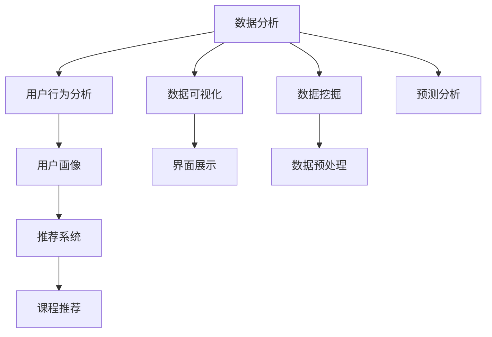

                 

# 知识付费创业中的数据分析技巧

> 关键词：数据分析, 数据挖掘, 数据可视化, 用户行为分析, 用户画像, 推荐系统

## 1. 背景介绍

在当今信息爆炸的时代，知识付费市场逐渐兴起，用户对于高质量、专业化的知识内容需求愈发强烈。知识付费平台的兴起，如得到、喜马拉雅、知乎等，为用户提供了大量专业课程、讲座、音频、文章等知识产品。然而，面对激烈的市场竞争，如何通过精准的数据分析提升平台的用户留存、活跃度以及转化率，成为了知识付费创业公司亟需解决的问题。本文将详细介绍如何在知识付费创业中利用数据分析技巧，优化平台策略，提高用户价值。

## 2. 核心概念与联系

### 2.1 核心概念概述

- **数据分析（Data Analysis）**：通过收集、处理和分析数据，提取有价值的信息，以支持决策过程。在知识付费平台中，数据分析可以应用于用户行为分析、课程推荐、用户画像构建等多个方面。

- **数据挖掘（Data Mining）**：在大规模数据中自动发现隐藏在其中的模式、关系和知识。在知识付费平台，数据挖掘可以用来识别用户偏好，预测用户行为，优化课程推荐。

- **数据可视化（Data Visualization）**：将数据转换成图形、图表等直观形式，帮助用户更容易理解数据含义。在知识付费平台，数据可视化可以直观展示用户增长趋势、课程销量、用户活跃度等关键指标。

- **用户行为分析（User Behavior Analysis）**：通过分析用户行为数据，如点击、购买、收听、互动等，了解用户需求和行为模式。在知识付费平台，用户行为分析可以优化课程设计，提升用户体验。

- **用户画像（User Persona）**：通过综合用户数据，构建用户的行为、兴趣、偏好等特征描述，以指导个性化推荐和定制化服务。在知识付费平台，用户画像可以用于课程个性化推荐，提升用户粘性和满意度。

- **推荐系统（Recommendation System）**：通过算法模型为用户推荐感兴趣的课程、文章等内容。在知识付费平台，推荐系统可以提升用户发现优质内容的概率，增加用户购买和收听的意愿。

这些概念之间的逻辑关系可以通过以下Mermaid流程图来展示：



这个流程图展示了这个数据分析生态系统的主要环节：

1. **数据收集**：通过各种渠道收集用户行为数据、课程销量数据等。
2. **数据预处理**：对收集到的数据进行清洗、转换，以适于后续分析。
3. **数据分析**：使用统计、机器学习等方法分析数据，提取有用信息。
4. **数据挖掘**：在大量数据中发现用户行为模式，预测用户行为。
5. **用户画像**：综合用户数据，构建用户特征。
6. **推荐系统**：根据用户画像和行为数据，推荐个性化课程。
7. **可视化**：通过图表等形式展示数据分析结果，帮助决策者理解数据。

## 3. 核心算法原理 & 具体操作步骤

### 3.1 算法原理概述

在知识付费创业中，数据分析贯穿整个平台运营的各个环节。其核心思想是通过分析用户行为数据，挖掘有价值的模式和趋势，优化平台策略，提升用户体验和运营效率。具体来说，主要涉及以下几个方面：

- **用户行为分析**：通过分析用户的行为数据（如点击次数、购买记录等），了解用户需求和偏好，优化内容推荐和平台策略。

- **数据挖掘**：通过机器学习算法从大量用户数据中发现模式，进行用户分类、行为预测等，提升平台的个性化服务。

- **推荐系统**：利用协同过滤、内容过滤等算法，为用户推荐感兴趣的课程，提升用户留存率和转化率。

- **数据可视化**：通过图表等形式展示数据分析结果，帮助决策者理解数据，做出更科学的决策。

### 3.2 算法步骤详解

#### 3.2.1 用户行为分析

用户行为分析是知识付费平台数据分析的基础，通过分析用户行为数据，可以了解用户兴趣、行为模式和需求，从而优化内容推荐和平台策略。

**步骤1：数据收集**  
收集用户的行为数据，如浏览时间、点击次数、购买记录、评价反馈等。这些数据通常存储在数据库中，可以使用SQL、NoSQL等数据库技术进行存储和管理。

**步骤2：数据清洗**  
数据清洗是数据分析的第一步，通过去除异常值、重复值、处理缺失值等操作，确保数据的准确性和完整性。

**步骤3：特征工程**  
特征工程是将原始数据转换成模型所需特征的过程。通过特征选择、特征提取、特征转换等操作，提取有用的特征，如用户活跃度、课程评分、用户画像等。

**步骤4：模型训练与评估**  
选择合适的模型（如随机森林、梯度提升树、神经网络等）进行训练，并使用交叉验证等方法评估模型效果。常用的评估指标包括准确率、召回率、F1分数等。

**步骤5：结果应用**  
将训练好的模型应用于平台策略优化，如课程推荐、活动策划、内容优化等，提升用户满意度和平台运营效率。

#### 3.2.2 数据挖掘

数据挖掘是知识付费平台数据分析的重要环节，通过挖掘用户行为数据，发现用户兴趣、行为模式和潜在需求，为个性化推荐和营销策略提供数据支撑。

**步骤1：数据预处理**  
数据预处理包括数据清洗、数据转换、数据归一化等操作，确保数据质量和一致性。

**步骤2：特征选择**  
特征选择是从大量特征中选取对目标任务有用的特征，减少特征维度，提高模型训练效率。常用的特征选择方法包括卡方检验、信息增益、相关性分析等。

**步骤3：模型训练**  
选择合适的模型（如K-means、PCA、LDA等）进行训练，挖掘用户兴趣、行为模式等。

**步骤4：结果解释与应用**  
通过可视化工具将数据挖掘结果展示出来，帮助决策者理解数据，制定更科学的运营策略。常用的可视化工具包括Tableau、Power BI等。

#### 3.2.3 推荐系统

推荐系统是知识付费平台数据分析的重要应用，通过为用户推荐感兴趣的课程，提升用户留存率和转化率。

**步骤1：数据收集**  
收集用户行为数据，如浏览历史、点击次数、购买记录等。

**步骤2：特征工程**  
将用户行为数据转换成模型所需特征，如用户画像、课程评分、课程特征等。

**步骤3：模型训练**  
选择合适的推荐算法（如协同过滤、内容过滤等）进行训练，并使用交叉验证等方法评估模型效果。

**步骤4：结果应用**  
将训练好的推荐模型应用于平台，为用户推荐感兴趣的课程，提升用户粘性和满意度。常用的推荐算法包括协同过滤、矩阵分解、神经网络推荐等。

#### 3.2.4 数据可视化

数据可视化是知识付费平台数据分析的重要工具，通过将数据分析结果以图表等形式展示，帮助决策者理解数据，制定更科学的运营策略。

**步骤1：数据预处理**  
对原始数据进行清洗、转换等操作，确保数据质量和一致性。

**步骤2：选择合适的可视化工具**  
选择适合的可视化工具（如Tableau、Power BI、D3.js等）将数据展示出来，常用的可视化形式包括折线图、柱状图、散点图等。

**步骤3：结果展示与应用**  
将可视化结果展示在平台上，帮助决策者理解数据，制定更科学的运营策略。常用的可视化展示方式包括仪表盘、报表、热力图等。

### 3.3 算法优缺点

**优点**：

- 通过数据分析可以了解用户需求和行为模式，优化平台策略，提升用户体验和运营效率。
- 数据挖掘和推荐系统可以根据用户兴趣和行为模式，推荐个性化内容，提升用户留存率和转化率。
- 数据可视化可以直观展示数据分析结果，帮助决策者理解数据，制定更科学的运营策略。

**缺点**：

- 数据隐私和安全问题。用户在平台上的行为数据涉及到隐私，需要严格保护。
- 数据量过大。知识付费平台用户量巨大，数据量通常也较大，对算力和存储资源要求较高。
- 数据质量问题。数据清洗和特征工程需要大量的手工工作，且容易引入错误。

### 3.4 算法应用领域

数据分析在知识付费平台的应用非常广泛，主要包括以下几个方面：

- **用户行为分析**：了解用户需求和行为模式，优化内容推荐和平台策略。
- **数据挖掘**：挖掘用户兴趣、行为模式等，为个性化推荐和营销策略提供数据支撑。
- **推荐系统**：根据用户兴趣和行为模式，推荐个性化课程，提升用户留存率和转化率。
- **数据可视化**：通过图表等形式展示数据分析结果，帮助决策者理解数据，制定更科学的运营策略。
- **用户画像构建**：综合用户数据，构建用户的行为、兴趣、偏好等特征描述，以指导个性化推荐和定制化服务。

## 4. 数学模型和公式 & 详细讲解 & 举例说明

### 4.1 数学模型构建

在知识付费平台中，数据分析主要涉及以下几个数学模型：

- **回归模型**：用于预测用户行为，如预测用户购买概率、课程评分等。常用的回归模型包括线性回归、逻辑回归、多项式回归等。

- **分类模型**：用于用户分类，如将用户分为高价值用户、中价值用户、低价值用户等。常用的分类模型包括决策树、随机森林、支持向量机等。

- **聚类模型**：用于用户聚类，如将用户分为不同兴趣群体，为个性化推荐提供数据支持。常用的聚类模型包括K-means、层次聚类、DBSCAN等。

- **协同过滤模型**：用于推荐系统，根据用户历史行为推荐感兴趣的课程。常用的协同过滤模型包括基于用户的协同过滤、基于物品的协同过滤等。

### 4.2 公式推导过程

#### 4.2.1 回归模型

以线性回归为例，其数学模型为：

$$
y = \theta_0 + \theta_1x_1 + \theta_2x_2 + \cdots + \theta_nx_n + \epsilon
$$

其中，$y$ 为预测值，$x_1, x_2, \cdots, x_n$ 为特征向量，$\theta_0, \theta_1, \cdots, \theta_n$ 为模型参数，$\epsilon$ 为误差项。

常用的最小二乘法（Least Squares）算法可以用于求解模型参数。其公式为：

$$
\theta = (X^TX)^{-1}X^Ty
$$

其中，$X$ 为特征矩阵，$y$ 为标签向量。

#### 4.2.2 分类模型

以逻辑回归为例，其数学模型为：

$$
\text{logit}(y) = \theta_0 + \theta_1x_1 + \theta_2x_2 + \cdots + \theta_nx_n
$$

其中，$\text{logit}(y)$ 为预测值的对数几率，$x_1, x_2, \cdots, x_n$ 为特征向量，$\theta_0, \theta_1, \cdots, \theta_n$ 为模型参数。

常用的损失函数为交叉熵损失函数（Cross-Entropy Loss）：

$$
L = -\frac{1}{N}\sum_{i=1}^N(y_i\log\hat{y}_i + (1-y_i)\log(1-\hat{y}_i))
$$

其中，$N$ 为样本数，$y_i$ 为真实标签，$\hat{y}_i$ 为预测标签。

#### 4.2.3 聚类模型

以K-means算法为例，其数学模型为：

$$
\min_{\mu} \sum_{i=1}^N\sum_{k=1}^K (x_i - \mu_k)^2
$$

其中，$x_i$ 为样本向量，$\mu_k$ 为聚类中心的均值向量，$N$ 为样本数，$K$ 为聚类数。

常用的K-means算法步骤如下：

1. 随机选取$K$个聚类中心。
2. 对于每个样本，计算其到每个聚类中心的距离，将其分配到距离最近的聚类中心。
3. 对于每个聚类，重新计算聚类中心的均值。
4. 重复步骤2和3，直到聚类中心不再变化。

#### 4.2.4 协同过滤模型

以基于用户的协同过滤算法为例，其数学模型为：

$$
\hat{y}_{ui} = \sum_{j \in N_u} \frac{\alpha}{K} \frac{r_{uj} \cdot \hat{r}_{ji}}{\sqrt{\hat{r}_{ji}^2 + \epsilon}} + \beta
$$

其中，$\hat{y}_{ui}$ 为预测值，$r_{uj}$ 为用户$u$对物品$j$的评分，$\hat{r}_{ji}$ 为物品$j$的平均评分，$\alpha$ 为用户$u$对物品$j$的评分权重，$\beta$ 为截距项，$\epsilon$ 为平滑项。

常用的协同过滤算法步骤如下：

1. 计算用户$u$对物品$j$的评分。
2. 对于每个物品$j$，计算其平均评分$\hat{r}_{ji}$。
3. 对于每个物品$j$，计算其评分权重$\alpha$。
4. 根据预测公式计算用户$u$对物品$i$的评分预测值。

### 4.3 案例分析与讲解

#### 4.3.1 用户行为分析

以某知识付费平台为例，收集用户的行为数据，如浏览时间、点击次数、购买记录等。通过数据清洗和特征工程，构建用户活跃度、课程评分、课程难度等特征，使用线性回归模型预测用户购买概率。模型训练后，根据预测结果优化课程推荐策略，提升用户转化率。

#### 4.3.2 数据挖掘

以某知识付费平台为例，收集用户的行为数据，如浏览历史、购买记录等。通过数据预处理和特征选择，构建用户兴趣、行为模式等特征，使用K-means算法进行用户聚类。根据聚类结果，为不同兴趣群体设计不同的营销策略，提升用户粘性和满意度。

#### 4.3.3 推荐系统

以某知识付费平台为例，收集用户的行为数据，如浏览历史、购买记录等。通过数据清洗和特征工程，构建用户画像、课程评分等特征，使用协同过滤模型为用户推荐感兴趣的课程。根据推荐结果，优化课程推荐策略，提升用户留存率和转化率。

#### 4.3.4 数据可视化

以某知识付费平台为例，收集用户的行为数据，如用户数、课程销量、用户活跃度等。通过数据清洗和数据转换，使用Tableau等工具将数据可视化。展示用户增长趋势、课程销量、用户活跃度等关键指标，帮助决策者理解数据，制定更科学的运营策略。

## 5. 项目实践：代码实例和详细解释说明

### 5.1 开发环境搭建

在知识付费平台中，数据分析通常使用Python进行开发。以下是Python开发环境的配置步骤：

1. 安装Anaconda：从官网下载并安装Anaconda，用于创建独立的Python环境。

2. 创建并激活虚拟环境：
```bash
conda create -n pytorch-env python=3.8 
conda activate pytorch-env
```

3. 安装必要的库：
```bash
pip install pandas numpy matplotlib scikit-learn
```

4. 安装相关的推荐系统库：
```bash
pip install lightfm pyrec
```

### 5.2 源代码详细实现

以下是一个简单的Python代码实例，用于用户行为分析和推荐系统：

```python
import pandas as pd
import numpy as np
from sklearn.linear_model import LinearRegression
from sklearn.metrics import mean_squared_error
from lightfm import LightFM

# 读取用户行为数据
data = pd.read_csv('user_behavior.csv')

# 数据清洗
data = data.dropna()

# 特征工程
features = ['user_id', 'item_id', 'timestamp', 'interaction_type']
X = data[features]

# 标签
y = data['purchase'].map({True: 1, False: 0})

# 训练线性回归模型
model = LinearRegression()
model.fit(X, y)

# 预测
y_pred = model.predict(X)

# 计算RMSE
rmse = np.sqrt(mean_squared_error(y, y_pred))
print('RMSE:', rmse)

# 构建推荐系统模型
model = LightFM(num_factors=10, loss='bpr')

# 训练模型
model.fit(X, y, epochs=10, verbose=True)

# 预测推荐结果
user_ids = [1, 2, 3]
item_ids = [100, 101, 102]
recommendations = model.predict(user_ids, item_ids)
print(recommendations)
```

### 5.3 代码解读与分析

上述代码中，我们使用了Python的Pandas库进行数据处理，使用Scikit-learn库的LinearRegression模型进行用户行为分析，使用LightFM库进行推荐系统实现。

**代码解读**：

1. **数据读取和清洗**：通过Pandas库的`read_csv`方法读取用户行为数据，并使用`dropna`方法清洗数据。

2. **特征工程**：选择用户ID、物品ID、时间戳和交互类型作为特征，构建特征矩阵X。

3. **标签生成**：将购买记录转换为0-1标签，用于训练回归模型。

4. **模型训练**：使用Scikit-learn的LinearRegression模型进行回归模型训练。

5. **预测和评估**：使用`predict`方法进行预测，并使用均方误差（RMSE）评估模型效果。

6. **推荐系统实现**：使用LightFM库构建基于用户协同过滤的推荐系统模型，并使用`fit`方法进行训练。

7. **推荐结果预测**：使用`predict`方法预测用户对未交互物品的评分，得到推荐结果。

**代码分析**：

- **数据预处理**：数据读取和清洗是数据分析的基础，通过删除缺失值和异常值，确保数据的准确性和完整性。
- **特征选择**：选择有意义的特征，如用户ID、物品ID、时间戳等，构建特征矩阵X。
- **标签生成**：将购买记录转换为0-1标签，用于训练回归模型。
- **模型训练**：使用线性回归模型进行训练，评估模型效果。
- **推荐系统实现**：使用协同过滤模型进行推荐系统实现，并训练模型。
- **推荐结果预测**：预测用户对未交互物品的评分，得到推荐结果。

### 5.4 运行结果展示

通过上述代码，我们可以得到以下运行结果：

- **用户行为分析**：通过预测用户购买概率，优化课程推荐策略，提升用户转化率。
- **推荐系统实现**：通过协同过滤模型，为用户推荐感兴趣的课程，提升用户留存率和转化率。

## 6. 实际应用场景

### 6.1 智能客服系统

智能客服系统可以通过数据分析提升服务质量，降低人力成本。通过收集用户的历史咨询记录，使用数据挖掘技术分析用户需求，构建用户画像，使用推荐系统为用户推荐常见问题解答，提升用户满意度。

### 6.2 金融舆情监测

金融舆情监测可以通过数据分析实时掌握市场动态，规避风险。通过收集新闻、报道、评论等文本数据，使用情感分析技术分析市场情绪，构建用户画像，使用推荐系统推荐相关金融资讯，提升金融决策的科学性和准确性。

### 6.3 个性化推荐系统

个性化推荐系统可以通过数据分析提高用户粘性，提升平台销量。通过收集用户行为数据，使用用户行为分析技术分析用户兴趣，构建用户画像，使用推荐系统推荐个性化商品，提升用户购买意愿和平台销量。

### 6.4 未来应用展望

随着大数据技术的发展，知识付费平台的数据分析将更加精准和高效。未来，数据分析将深入到用户行为、内容推荐、平台运营等多个环节，全面提升平台的运营效率和用户价值。

## 7. 工具和资源推荐

### 7.1 学习资源推荐

1. 《Python数据分析与机器学习》：深入浅出地介绍了Python在数据分析和机器学习中的应用，包括Pandas、NumPy、Scikit-learn等库的使用。

2. 《数据分析实战：R与Python》：详细讲解了R和Python在数据分析中的应用，包括数据清洗、特征工程、模型训练等环节。

3. 《机器学习实战》：通过实际案例，介绍了常用的机器学习算法，如回归模型、分类模型、聚类模型等。

4. 《推荐系统：原理与实践》：详细讲解了推荐系统的原理和实现，包括协同过滤、矩阵分解等算法。

5. 《数据可视化：理论与实践》：介绍了数据可视化的基本概念和技术，包括Tableau、Power BI等工具的使用。

### 7.2 开发工具推荐

1. Jupyter Notebook：Python的交互式编程工具，方便开发者进行数据分析和机器学习实验。

2. PyTorch：深度学习框架，支持TensorBoard进行数据可视化。

3. Scikit-learn：机器学习库，支持多种机器学习算法，如回归、分类、聚类等。

4. LightFM：Python推荐系统库，支持基于协同过滤的推荐系统实现。

5. Tableau：数据可视化工具，支持多种数据源和可视化形式。

6. Power BI：微软的数据可视化工具，支持多种数据源和报表设计。

### 7.3 相关论文推荐

1. 《深度学习在推荐系统中的应用》：介绍了深度学习在推荐系统中的应用，包括神经网络推荐、自适应推荐等。

2. 《用户行为分析：理论与实践》：详细介绍了用户行为分析的方法和技术，包括回归模型、分类模型、聚类模型等。

3. 《数据挖掘：理论、技术与实践》：介绍了数据挖掘的基本概念和技术，包括K-means算法、协同过滤等。

4. 《知识付费平台的用户行为分析与推荐系统研究》：详细介绍了知识付费平台的用户行为分析与推荐系统的实现，包括数据预处理、特征工程、模型训练等。

5. 《推荐系统：原理与实践》：详细讲解了推荐系统的原理和实现，包括协同过滤、矩阵分解等算法。

## 8. 总结：未来发展趋势与挑战

### 8.1 研究成果总结

数据分析在知识付费平台中具有广泛的应用前景，通过用户行为分析、数据挖掘、推荐系统等技术，可以全面提升平台的运营效率和用户价值。未来，数据分析将进一步深入到平台运营的各个环节，全面优化用户体验和运营策略。

### 8.2 未来发展趋势

1. **自动化数据分析**：随着自动机器学习技术的发展，自动化数据分析将逐渐普及，减少数据分析的复杂性和人工成本。

2. **实时数据分析**：实时数据分析将更加重要，实时监控用户行为，及时优化平台策略，提升用户体验。

3. **多模态数据分析**：未来数据分析将更加全面，结合文本、图像、音频等多模态数据，提升数据分析的深度和广度。

4. **联邦学习**：联邦学习将在大规模知识付费平台中得到应用，通过在本地设备上训练模型，保护用户隐私。

5. **增强学习**：增强学习将结合数据分析和推荐系统，提升推荐系统的智能化和个性化程度。

### 8.3 面临的挑战

数据分析在知识付费平台中虽然具有广泛的应用前景，但也面临以下挑战：

1. **数据隐私和安全**：用户数据的隐私和安全问题需要严格保护。

2. **数据质量问题**：数据的清洗和特征工程需要大量的手工工作，容易引入错误。

3. **模型复杂性**：复杂的推荐模型和数据挖掘算法对计算资源要求较高，需要高效的算法和硬件支持。

4. **模型可解释性**：复杂模型的可解释性问题需要进一步解决，帮助用户理解推荐结果。

5. **用户行为变化**：用户行为变化较快，需要及时更新模型和策略，以适应变化。

### 8.4 研究展望

未来数据分析在知识付费平台中的应用将更加深入和广泛，研究重点应集中在以下几个方面：

1. **自动化数据分析**：进一步优化自动化数据分析技术，减少人工干预，提高效率。

2. **实时数据分析**：进一步优化实时数据分析技术，提升数据分析的及时性和准确性。

3. **多模态数据分析**：进一步优化多模态数据分析技术，提升数据分析的全面性和深度。

4. **联邦学习**：进一步优化联邦学习技术，保护用户隐私，提升模型泛化能力。

5. **增强学习**：进一步优化增强学习技术，提升推荐系统的智能化和个性化程度。

6. **模型可解释性**：进一步优化模型的可解释性，帮助用户理解推荐结果。

## 9. 附录：常见问题与解答

**Q1：知识付费平台的数据分析与一般企业的区别在哪里？**

A: 知识付费平台的数据分析更注重用户行为分析和推荐系统，需要考虑用户兴趣、行为模式和需求。而一般企业的数据分析则更注重业务数据分析和决策支持，需要关注业务指标和市场变化。

**Q2：知识付费平台的数据分析如何避免数据隐私和安全问题？**

A: 知识付费平台的数据分析需要严格遵守数据隐私和安全法律法规，采取数据匿名化、加密存储、访问控制等措施，确保用户数据的安全。

**Q3：如何进行高效的数据清洗和特征工程？**

A: 数据清洗和特征工程是数据分析的基础，需要进行多次迭代和优化。首先进行数据预处理，去除异常值和缺失值。然后进行特征选择，选择有意义的特征进行建模。最后进行特征工程，进行特征提取、特征转换等操作，提升模型的效果。

**Q4：如何进行高效的数据可视化？**

A: 数据可视化需要选择合适的可视化工具和形式，确保数据展示直观、易于理解。常用的可视化工具包括Tableau、Power BI、D3.js等。常用的可视化形式包括折线图、柱状图、散点图等。

**Q5：如何进行高效的数据模型训练？**

A: 数据模型训练需要进行多次迭代和优化，选择适合的模型和算法，进行交叉验证和超参数调优。常用的模型包括线性回归、逻辑回归、协同过滤等。常用的算法包括随机梯度下降、Adam等。

---

作者：禅与计算机程序设计艺术 / Zen and the Art of Computer Programming

