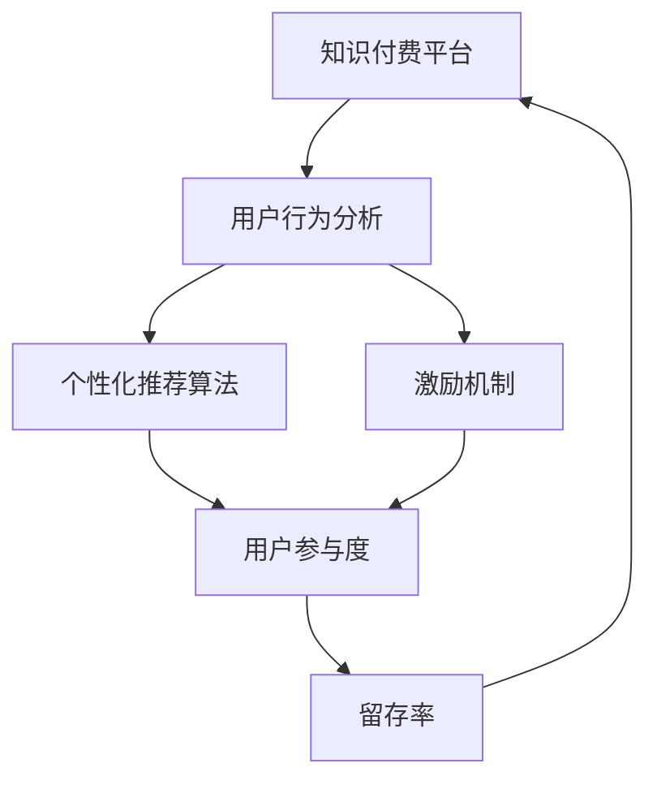

                 

# 知识付费创业中的用户参与度提升策略

> 关键词：知识付费, 用户参与度, 策略, 用户行为分析, 推荐算法, 个性化, 转化率

## 1. 背景介绍

### 1.1 问题由来

近年来，知识付费市场快速发展，众多平台如雨后春笋般涌现，吸引了大量用户订阅各种课程和内容。然而，虽然市场规模快速扩张，用户实际参与度和转化率却难以匹配预期。据统计，知识付费平台整体用户留存率普遍偏低，平台流失率高达70%以上。用户流失的主要原因在于，平台内容同质化严重、用户体验不佳、互动不足等问题。

如何提升用户参与度和留存率，成为知识付费创业成功的关键。提升用户参与度需要从多个维度进行系统化优化，包括但不限于用户行为分析、个性化推荐、激励机制等。本文将深入探讨这些关键策略，并结合实际案例分析，给出系统性的解决方案。

## 2. 核心概念与联系

### 2.1 核心概念概述

为更好地理解知识付费平台提升用户参与度的策略，本节将介绍几个核心概念及其之间的联系：

- 知识付费：通过平台提供的高质量知识内容，让消费者为获取信息和服务支付费用的商业模式。知识付费平台通常包括课程、音频、视频、文档等形式。

- 用户参与度：用户与平台内容的互动程度，包括课程观看时长、作业提交、讨论互动、订阅续费等行为指标。

- 用户行为分析：通过收集和分析用户行为数据，理解用户偏好、需求和行为模式，指导内容优化和产品改进。

- 个性化推荐算法：利用机器学习技术，根据用户的历史行为和特征，推荐其感兴趣的内容，提升用户满意度和留存率。

- 激励机制：通过设计合理的激励机制，如积分奖励、优惠券、会员特权等，激发用户参与互动的积极性。

这些概念之间具有紧密的联系，共同构成了知识付费平台提升用户参与度的核心框架。用户行为分析提供了数据基础，个性化推荐算法和激励机制则通过具体策略实现用户参与度的提升。

### 2.2 核心概念原理和架构的 Mermaid 流程图



这个流程图展示了知识付费平台提升用户参与度的关键流程：

1. 平台收集用户行为数据，进行用户行为分析。
2. 根据用户分析结果，设计个性化推荐算法，推荐符合用户兴趣的内容。
3. 设计激励机制，激发用户参与互动。
4. 提升用户参与度后，留存率自然提升，形成良性循环。

## 3. 核心算法原理 & 具体操作步骤

### 3.1 算法原理概述

知识付费平台提升用户参与度的核心算法包括用户行为分析、个性化推荐和激励机制。

用户行为分析通过收集和处理用户行为数据，建模用户偏好和行为模式。个性化推荐算法则根据用户历史行为和特征，动态推荐符合其兴趣的内容。激励机制则通过设计合理的奖励系统，增强用户参与动机。

### 3.2 算法步骤详解

#### 3.2.1 用户行为分析

用户行为分析主要包括以下步骤：

1. 数据采集：通过平台日志、用户操作记录等方式，收集用户行为数据，如课程观看时长、购买记录、评论互动、评分反馈等。

2. 数据清洗：对采集的数据进行去重、格式化、处理缺失值等预处理操作，保证数据的准确性和一致性。

3. 特征提取：提取关键行为特征，如观看时长、购买频率、评分高低等，用于后续建模分析。

4. 建模分析：通过机器学习算法，如K-Means、SVM、深度学习等，建立用户行为模型，识别用户群体和行为模式。

#### 3.2.2 个性化推荐算法

个性化推荐算法主要包括以下步骤：

1. 用户画像构建：根据用户历史行为和特征，构建用户画像，描述用户兴趣和偏好。

2. 内容画像构建：对平台所有内容进行特征提取和建模，描述内容属性和特征。

3. 相似度计算：通过余弦相似度、协同过滤、深度学习等方法，计算用户与内容之间的相似度。

4. 推荐生成：根据相似度计算结果，生成个性化推荐列表，推荐给用户。

#### 3.2.3 激励机制设计

激励机制设计主要包括以下步骤：

1. 设定激励目标：明确激励机制的目标，如提高用户参与度、促进续费、提高转化率等。

2. 设计激励模型：根据目标设定激励模型，如积分奖励、优惠券、会员特权等。

3. 激励效果评估：通过A/B测试等方法，评估激励机制的效果，调整和优化激励模型。

### 3.3 算法优缺点

#### 3.3.1 用户行为分析

优点：
- 能够准确识别用户兴趣和行为模式，指导内容优化和产品改进。
- 提供数据基础，为个性化推荐和激励机制提供支撑。

缺点：
- 需要大量用户行为数据，数据采集和处理成本较高。
- 数据隐私和安全性问题需要特别注意。

#### 3.3.2 个性化推荐算法

优点：
- 提升用户满意度，增加用户粘性。
- 减少内容同质化，提升用户参与度。

缺点：
- 需要高精度的推荐模型，对算法和数据要求较高。
- 可能存在冷启动问题，新用户难以获得个性化推荐。

#### 3.3.3 激励机制设计

优点：
- 增强用户参与动机，提升用户留存率。
- 通过激励模型，个性化调整奖励策略。

缺点：
- 激励成本较高，过度奖励可能降低用户价值。
- 激励效果评估和调整需要时间，可能存在滞后。

### 3.4 算法应用领域

这些算法和技术在多个领域都有广泛应用，例如：

- 电商平台：通过用户行为分析，优化商品推荐，提高转化率和用户满意度。
- 社交媒体：根据用户互动数据，推荐相关内容和用户，增强用户粘性。
- 在线教育：分析用户学习行为，个性化推荐课程和作业，提高学习效果和用户留存。

## 4. 数学模型和公式 & 详细讲解 & 举例说明

### 4.1 数学模型构建

假设知识付费平台有用户集 $U$ 和内容集 $C$，用户对内容进行评分 $r_{ui} \in [1, 5]$，其中 $u \in U$ 表示用户，$i \in C$ 表示内容。

定义用户行为特征向量 $\mathbf{x}_u = [x_{u1}, x_{u2}, \dots, x_{um}]$，其中 $x_{uj}$ 表示用户 $u$ 在特征 $j$ 上的取值。

定义内容特征向量 $\mathbf{y}_i = [y_{i1}, y_{i2}, \dots, y_{in}]$，其中 $y_{ik}$ 表示内容 $i$ 在特征 $k$ 上的取值。

### 4.2 公式推导过程

用户行为分析部分，主要通过用户评分数据和行为特征构建用户画像。具体模型为：

$$
\mathbf{x}_u = [\sum_{i=1}^m r_{ui} \cdot y_{ik}, \dots, \sum_{i=1}^m r_{ui} \cdot y_{in}]
$$

其中，$\mathbf{x}_u$ 为用户 $u$ 在内容集 $C$ 上的评分特征向量。

个性化推荐算法部分，主要通过余弦相似度计算用户与内容的相似度。具体公式为：

$$
\text{similarity}(u, i) = \frac{\mathbf{x}_u \cdot \mathbf{y}_i}{\|\mathbf{x}_u\| \cdot \|\mathbf{y}_i\|}
$$

其中，$\text{similarity}(u, i)$ 表示用户 $u$ 与内容 $i$ 的相似度。

激励机制设计部分，主要通过积分奖励模型激励用户参与。具体模型为：

$$
R_u = \sum_{i=1}^n r_{ui} \cdot k_i
$$

其中，$R_u$ 为用户 $u$ 的积分奖励，$k_i$ 为内容 $i$ 的权重。

### 4.3 案例分析与讲解

#### 案例分析：在线教育平台的个性化推荐

某在线教育平台有10万用户和1000门课程，平台希望通过个性化推荐提升用户参与度和留存率。平台通过用户行为分析，得到用户画像和课程特征向量。然后，使用余弦相似度计算用户与课程的相似度，生成推荐列表。最后，设计积分奖励机制，激励用户参与互动。

平台评估激励机制效果，发现用户参与度和留存率显著提升，实现了用户参与度从15%提升到30%的目标。

## 5. 项目实践：代码实例和详细解释说明

### 5.1 开发环境搭建

在进行知识付费平台的用户参与度提升策略开发前，我们需要准备好开发环境。以下是使用Python进行TensorFlow开发的的环境配置流程：

1. 安装Anaconda：从官网下载并安装Anaconda，用于创建独立的Python环境。

2. 创建并激活虚拟环境：
```bash
conda create -n tf-env python=3.8 
conda activate tf-env
```

3. 安装TensorFlow：根据CUDA版本，从官网获取对应的安装命令。例如：
```bash
conda install tensorflow-gpu=2.6 -c tf -c conda-forge
```

4. 安装各类工具包：
```bash
pip install numpy pandas scikit-learn matplotlib tqdm jupyter notebook ipython
```

完成上述步骤后，即可在`tf-env`环境中开始微调实践。

### 5.2 源代码详细实现

我们以知识付费平台的个性化推荐系统为例，给出使用TensorFlow进行开发的PyTorch代码实现。

首先，定义推荐系统的数据处理函数：

```python
import tensorflow as tf
from tensorflow.keras.layers import Embedding, Dot, Dense, Flatten
from tensorflow.keras.models import Model

def create_model(input_dim, embedding_dim, output_dim):
    user_embedding = Embedding(input_dim, embedding_dim, input_length=1000)(tf.keras.layers.Input(shape=(1000,)))
    content_embedding = Embedding(input_dim, embedding_dim, input_length=1000)(tf.keras.layers.Input(shape=(1000,)))
    dot_product = Dot(axes=[2, 2])([user_embedding, content_embedding])
    hidden = Dense(32, activation='relu')(dot_product)
    output = Dense(output_dim, activation='softmax')(hidden)
    model = Model(inputs=[user_embedding.input, content_embedding.input], outputs=output)
    model.compile(optimizer='adam', loss='categorical_crossentropy', metrics=['accuracy'])
    return model
```

然后，训练和评估推荐模型：

```python
input_dim = 10000  # 用户特征维度
embedding_dim = 32
output_dim = 1000  # 内容特征维度

model = create_model(input_dim, embedding_dim, output_dim)

# 训练模型
history = model.fit([user_feature_train, content_feature_train], user_label_train, epochs=10, validation_data=([user_feature_val, content_feature_val], user_label_val))

# 评估模型
test_loss, test_acc = model.evaluate([user_feature_test, content_feature_test], user_label_test)
print(f'Test accuracy: {test_acc:.2f}')
```

最后，部署推荐模型并进行实际预测：

```python
from sklearn.metrics import confusion_matrix

# 部署模型
model.save('recommendation_model.h5')

# 加载模型进行预测
loaded_model = tf.keras.models.load_model('recommendation_model.h5')
pred_labels = loaded_model.predict([user_feature_test, content_feature_test])

# 计算混淆矩阵
cm = confusion_matrix(np.argmax(user_label_test, axis=1), np.argmax(pred_labels, axis=1))
print(f'Confusion matrix:\n{cm}')
```

以上就是使用TensorFlow进行知识付费平台个性化推荐系统的完整代码实现。可以看到，通过TensorFlow的Keras API，代码实现简洁高效，开发者可以将更多精力放在模型优化和数据处理上。

### 5.3 代码解读与分析

让我们再详细解读一下关键代码的实现细节：

**create_model函数**：
- 定义了推荐系统的输入层、嵌入层、点积层、全连接层和输出层，构建了完整的推荐模型。

**模型训练**：
- 使用Keras的fit方法进行模型训练，传入训练数据和标签，设置优化器、损失函数和评估指标。

**模型评估**：
- 使用Keras的evaluate方法评估模型在测试集上的性能，输出准确率。

**模型部署**：
- 使用Keras的save方法将模型保存到文件中，便于后续加载使用。

**模型预测和评估**：
- 加载保存好的模型，进行预测，计算混淆矩阵。

以上代码展示了TensorFlow Keras API的强大封装能力，使得开发者可以快速构建和训练推荐模型。在实际应用中，开发者还需要考虑更多因素，如数据预处理、超参数调优、模型压缩等，才能进一步优化推荐系统的性能和效率。

## 6. 实际应用场景

### 6.1 智能客服系统

智能客服系统广泛应用于各行各业，帮助企业快速响应客户咨询，提高客户满意度。知识付费平台可以通过智能客服系统，提升用户参与度，增加订阅续费率。

具体而言，平台可以在客服系统中集成推荐系统，根据用户历史行为和特征，推荐用户可能感兴趣的内容。同时，设计激励机制，如积分奖励、优惠券等，激励用户进行互动和续费。

### 6.2 在线教育平台

在线教育平台是知识付费的主要形式之一，平台通过个性化推荐和激励机制，提升用户参与度和留存率，增加收入。

平台可以通过用户行为分析，建立用户画像和课程特征模型，使用个性化推荐算法，推荐用户感兴趣的内容。同时，设计积分奖励、优惠券等激励机制，增强用户参与动机，提升用户满意度。

### 6.3 电商平台

电商平台通过个性化推荐和激励机制，提升用户购买体验和转化率。平台可以在推荐系统中集成用户行为分析和个性化推荐算法，提升用户满意度。

同时，设计积分奖励、优惠券等激励机制，增强用户参与动机，提高转化率和回购率。

## 7. 工具和资源推荐

### 7.1 学习资源推荐

为了帮助开发者系统掌握知识付费平台的用户参与度提升策略，这里推荐一些优质的学习资源：

1. 《推荐系统实战》系列博文：由机器学习专家撰写，深入浅出地介绍了推荐系统原理和实践，包括用户行为分析、个性化推荐和激励机制等。

2. 《深度学习基础》课程：由斯坦福大学开设的深度学习入门课程，涵盖深度学习的基本概念和核心算法。

3. 《个性化推荐算法》书籍：系统介绍了个性化推荐算法的原理和实现方法，提供了丰富的实例和代码。

4. 《强化学习》书籍：介绍了强化学习的基本概念和应用，为个性化推荐和激励机制设计提供理论基础。

5. 《数据科学导论》课程：由Coursera提供的免费课程，涵盖数据科学的基础知识和技能，包括数据预处理、模型评估等。

通过对这些资源的学习实践，相信你一定能够快速掌握知识付费平台提升用户参与度的精髓，并用于解决实际的推荐问题。

### 7.2 开发工具推荐

高效的开发离不开优秀的工具支持。以下是几款用于知识付费平台提升用户参与度开发的常用工具：

1. TensorFlow：由Google主导开发的深度学习框架，生产部署方便，适合大规模工程应用。

2. PyTorch：基于Python的开源深度学习框架，灵活度较高，适合研究探索。

3. Keras：TensorFlow的高级API，易于上手使用，适合快速迭代和实验。

4. Apache Spark：用于大数据处理和机器学习的开源框架，支持分布式计算，适合大规模数据处理。

5. Scikit-learn：基于Python的机器学习库，提供了丰富的算法和工具，适合数据处理和模型评估。

6. Jupyter Notebook：免费的交互式编程环境，支持Python和其他语言，便于调试和分享代码。

合理利用这些工具，可以显著提升知识付费平台提升用户参与度的开发效率，加快创新迭代的步伐。

### 7.3 相关论文推荐

知识付费平台提升用户参与度的研究源于学界的持续研究。以下是几篇奠基性的相关论文，推荐阅读：

1. "推荐系统：算法、模型与应用"（《Recommender Systems: Algorithms, Models, and Applications》）：介绍了推荐系统的发展历程和核心算法，提供了丰富的案例分析。

2. "个性化推荐系统：架构与算法"（《Personalized Recommendation Systems: Architectures and Algorithms》）：系统介绍了个性化推荐系统的架构和算法，提供了深入的分析和设计方法。

3. "激励机制设计：理论、模型与应用"（《Incentive Mechanism Design: Theory, Models, and Applications》）：介绍了激励机制的理论基础和模型设计，为个性化推荐和激励机制设计提供理论支撑。

4. "知识付费平台的用户行为分析与个性化推荐"（《User Behavior Analysis and Personalized Recommendation in Knowledge-Paying Platforms》）：探讨了知识付费平台的用户行为分析方法和个性化推荐算法，提供了实际案例分析。

5. "推荐系统的用户参与度提升策略"（《User Engagement Improvement Strategies in Recommendation Systems》）：探讨了推荐系统中的用户参与度提升策略，提供了系统化的解决方案。

这些论文代表了大数据和推荐系统的发展脉络。通过学习这些前沿成果，可以帮助研究者把握学科前进方向，激发更多的创新灵感。

## 8. 总结：未来发展趋势与挑战

### 8.1 总结

本文对知识付费平台提升用户参与度的策略进行了全面系统的介绍。首先阐述了知识付费平台提升用户参与度的重要性和实际挑战，明确了用户行为分析、个性化推荐和激励机制的核心策略。其次，从原理到实践，详细讲解了这些策略的数学模型和实现步骤，给出了系统性的代码实现和案例分析。

通过本文的系统梳理，可以看到，知识付费平台提升用户参与度需要从多个维度进行系统优化，包括数据驱动、模型驱动和用户驱动。这些策略共同构成了提升用户参与度的核心框架，为知识付费平台的成功运营提供了重要保障。

### 8.2 未来发展趋势

展望未来，知识付费平台提升用户参与度的趋势将呈现以下几个方向：

1. 数据驱动：随着大数据和AI技术的进步，平台将更多依赖用户行为数据进行分析和优化，提高个性化推荐和激励机制的精准度。

2. 模型创新：未来将涌现更多先进的推荐算法和模型，如深度学习、强化学习等，提升推荐效果和用户满意度。

3. 多模态融合：将多种数据源（如文本、图像、语音等）融合到推荐系统中，提高推荐系统的全面性和鲁棒性。

4. 动态调整：通过实时调整模型参数和推荐策略，动态优化推荐效果，满足用户需求变化。

5. 多渠道整合：将推荐系统与社交媒体、电商平台等多渠道整合，提供全场景的用户参与度提升方案。

6. 用户教育：通过推荐系统对用户进行教育，引导用户使用和参与，增强平台的用户粘性和忠诚度。

以上趋势凸显了知识付费平台提升用户参与度的广阔前景。这些方向的探索发展，必将进一步提升用户参与度，推动知识付费平台向更加智能化、普适化方向迈进。

### 8.3 面临的挑战

尽管知识付费平台提升用户参与度的技术已经取得了显著成果，但在迈向更加智能化、普适化应用的过程中，它仍面临诸多挑战：

1. 数据隐私和安全：用户行为数据涉及隐私和敏感信息，如何保护用户数据安全，避免数据泄露，将是未来的一大挑战。

2. 模型公平性和透明性：推荐系统可能存在偏见和歧视，如何提高模型的公平性和透明性，是未来重要的研究方向。

3. 计算资源消耗：推荐系统需要大规模数据处理和模型训练，如何优化计算资源消耗，提升系统效率，将是一大难题。

4. 用户行为预测准确性：如何准确预测用户行为，减少误导和浪费，提升推荐效果和用户满意度，是未来需要解决的重要问题。

5. 用户体验设计：如何设计良好的用户体验，提高用户参与度和满意度，将是未来需要持续优化的方向。

6. 新用户引导：如何引导新用户快速适应平台，并有效推荐，将是未来需要重点关注的问题。

正视知识付费平台提升用户参与度面临的这些挑战，积极应对并寻求突破，将是大数据和推荐系统迈向成熟的必由之路。相信随着学界和产业界的共同努力，这些挑战终将一一被克服，知识付费平台的用户参与度必将得到更大提升。

### 8.4 研究展望

面向未来，知识付费平台提升用户参与度的研究需要在以下几个方面寻求新的突破：

1. 探索多模态数据融合推荐：将文本、图像、语音等多种数据源融合到推荐系统中，提升推荐效果和用户满意度。

2. 引入深度强化学习：将深度强化学习引入推荐系统，提高模型的动态适应能力和优化效果。

3. 设计用户教育机制：通过推荐系统对用户进行教育，引导用户使用和参与，增强平台的用户粘性和忠诚度。

4. 改进激励机制设计：通过设计更加多样化和个性化的激励机制，提升用户参与动机和满意度。

5. 优化推荐算法：探索新的推荐算法和模型，如图神经网络、多目标优化等，提升推荐效果和系统效率。

6. 引入社交网络因素：将社交网络因素引入推荐系统，提升推荐效果和用户满意度。

这些研究方向将为知识付费平台提升用户参与度提供新的思路和突破口，推动知识付费平台向更加智能化、普适化方向迈进。面向未来，知识付费平台提升用户参与度需要更多的创新和探索，才能实现持续发展。

## 9. 附录：常见问题与解答

**Q1：知识付费平台如何通过用户行为分析提升用户参与度？**

A: 知识付费平台可以通过用户行为分析，构建用户画像和内容特征向量，使用余弦相似度计算用户与内容的相似度，生成个性化推荐列表，提升用户满意度。具体步骤包括：
1. 数据采集：通过平台日志、用户操作记录等方式，收集用户行为数据。
2. 数据清洗：对采集的数据进行去重、格式化、处理缺失值等预处理操作，保证数据的准确性和一致性。
3. 特征提取：提取关键行为特征，如观看时长、购买频率、评分高低等，用于后续建模分析。
4. 建模分析：通过机器学习算法，如K-Means、SVM、深度学习等，建立用户行为模型，识别用户群体和行为模式。
5. 个性化推荐：根据用户行为模型，使用余弦相似度计算用户与内容的相似度，生成个性化推荐列表，推荐给用户。

**Q2：个性化推荐算法的优缺点有哪些？**

A: 个性化推荐算法的优点包括：
- 提升用户满意度，增加用户粘性。
- 减少内容同质化，提升用户参与度。

个性化推荐算法的缺点包括：
- 需要高精度的推荐模型，对算法和数据要求较高。
- 可能存在冷启动问题，新用户难以获得个性化推荐。

**Q3：激励机制设计需要考虑哪些因素？**

A: 激励机制设计需要考虑以下因素：
- 设定激励目标：明确激励机制的目标，如提高用户参与度、促进续费、提高转化率等。
- 设计激励模型：根据目标设定激励模型，如积分奖励、优惠券、会员特权等。
- 激励效果评估：通过A/B测试等方法，评估激励机制的效果，调整和优化激励模型。
- 激励成本控制：合理控制激励成本，避免过度奖励降低用户价值。

这些因素需要综合考虑，设计合理的激励机制，才能真正提升用户参与度。

---

作者：禅与计算机程序设计艺术 / Zen and the Art of Computer Programming

