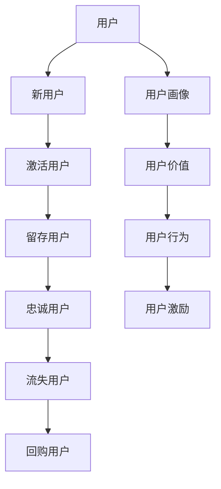

                 

## 1. 背景介绍

随着知识经济的兴起，知识付费成为一种新的增长模式。然而，用户生命周期的短促和流失率的高企，成为知识付费平台的核心挑战。如何设计一个系统化的用户成长体系，实现从新用户到忠实用户再到付费用户的全生命周期管理，成为知识付费创业的关键问题。

本文将从用户生命周期管理的视角出发，系统介绍如何通过构建完善的成长体系，提高用户黏性，延长用户生命周期，最终实现知识付费平台的持续增长。

## 2. 核心概念与联系

### 2.1 核心概念概述

要设计一个有效的用户成长体系，首先需要理解以下几个关键概念：

- **用户生命周期**：用户从初次接触到最终流失的全过程，包括新用户、激活用户、留存用户、忠诚用户、流失用户等不同阶段。
- **用户价值**：用户对平台的贡献度，包括活跃度、消费金额、社交影响力等。
- **用户画像**：用户的基本特征和行为特征，如年龄、职业、兴趣、学习偏好等。
- **用户行为**：用户在平台上的行为，如注册、登录、浏览、购买、分享等。
- **用户激励**：通过奖励机制，激发用户进行积极行为，如积分、优惠券、免费课程等。

这些概念之间的联系可以通过以下Mermaid流程图来展示：



### 2.2 核心概念原理和架构

**用户生命周期**：用户从首次接触平台到最终流失的全过程。一个完整的用户生命周期包括多个阶段，每个阶段都有不同的目标和策略。通过精细化管理用户生命周期，可以有效延长用户留存时间，提高用户转化率。

**用户价值**：用户对平台的价值体现在多个维度，如活跃度、消费金额、社交影响力等。通过量化用户价值，可以更准确地识别和挖掘高价值用户，为其提供个性化服务。

**用户画像**：用户画像是通过分析用户的行为数据和属性数据，构建用户的基本特征和行为特征模型。用户画像不仅帮助平台更好地理解用户，还能根据不同特征用户设计有针对性的策略。

**用户行为**：用户行为包括注册、登录、浏览、购买、分享等多种类型，反映了用户对平台的实际使用情况。通过分析用户行为，可以预测用户下一步行为，制定相应的运营策略。

**用户激励**：用户激励是通过奖励机制，激发用户进行积极行为，如积分、优惠券、免费课程等。通过设计合理的激励机制，可以有效提升用户活跃度和转化率。

这些概念通过用户生命周期管理架构进行了有机结合，形成了一个闭环的用户成长体系。

## 3. 核心算法原理 & 具体操作步骤

### 3.1 算法原理概述

用户成长体系的设计，本质上是基于用户行为数据分析和模型预测，结合运营策略和用户激励，实现用户价值最大化。这一过程涉及多个算法和模型，包括：

- **用户行为分析**：通过分析用户行为数据，识别用户不同阶段的行为特征和行为变化趋势，预测用户下一步行为。
- **用户价值评估**：通过量化用户价值，如日活跃用户数、消费金额、用户留存率等，评估用户对平台的贡献度。
- **用户画像构建**：通过构建用户画像，细分用户群体，针对不同群体设计有针对性的运营策略。
- **用户激励设计**：根据用户画像和用户行为分析结果，设计合理的用户激励机制，如积分系统、优惠券、免费课程等，激发用户进行积极行为。

### 3.2 算法步骤详解

用户成长体系的设计分为以下几个关键步骤：

**Step 1: 数据收集和预处理**

- 收集用户行为数据，如注册时间、登录时间、浏览记录、购买记录等。
- 收集用户属性数据，如年龄、职业、性别、地域等。
- 对数据进行清洗和预处理，去除异常值和噪声数据。

**Step 2: 用户行为分析和建模**

- 使用K-Means聚类算法，对用户进行细分，识别不同特征用户群体。
- 通过时间序列分析，预测用户行为变化趋势，如是否会流失、是否会购买等。
- 构建用户行为模型，如基于协同过滤的推荐模型、基于神经网络的预测模型等。

**Step 3: 用户价值评估和画像构建**

- 通过用户价值评估模型，量化用户对平台的贡献度，如消费金额、活跃度、留存率等。
- 构建用户画像模型，细化用户特征，如高价值用户、潜在流失用户、新用户等。

**Step 4: 用户激励设计和实施**

- 设计合理的用户激励机制，如积分系统、优惠券、免费课程等，激发用户积极行为。
- 根据用户画像和行为分析结果，制定个性化的激励策略，如针对高价值用户提供更多特权，针对新用户提供更多引导性激励。

**Step 5: 持续优化和迭代**

- 定期回顾用户成长体系的效果，通过A/B测试等方法进行优化。
- 根据用户反馈和新趋势，不断迭代和优化用户成长体系。

### 3.3 算法优缺点

用户成长体系的设计和实施，具有以下优点：

- 提高用户黏性：通过用户激励和个性化策略，提高用户活跃度和留存率。
- 延长用户生命周期：通过精准的用户画像和行为预测，延长用户生命周期。
- 提高用户转化率：通过个性化运营策略，提高用户付费转化率。

同时，用户成长体系的设计也存在一些缺点：

- 实施复杂：用户成长体系的设计和实施需要大量数据和复杂模型，实施成本较高。
- 数据隐私问题：用户行为和属性数据的收集和使用，需要严格遵守数据隐私保护法规。
- 用户激励过度：过度激励可能导致用户行为失真，影响数据分析和运营决策。

### 3.4 算法应用领域

用户成长体系的设计和实施，不仅适用于知识付费平台，还可广泛应用于其他类型的在线平台，如电商、社交媒体、金融科技等。通过系统化地管理用户生命周期，可以实现用户价值的最大化，提升平台的整体业务表现。

## 4. 数学模型和公式 & 详细讲解 & 举例说明

### 4.1 数学模型构建

用户成长体系的设计和实施，涉及多个数学模型和算法。以下是几个关键模型的构建：

- **用户行为聚类模型**：使用K-Means聚类算法，将用户分为不同特征群体，识别高价值用户和潜在流失用户。
- **用户行为预测模型**：使用时间序列分析，预测用户行为变化趋势，如是否会流失、是否会购买等。
- **用户价值评估模型**：使用回归分析，量化用户对平台的贡献度，如消费金额、活跃度、留存率等。
- **用户画像模型**：使用PCA算法，构建用户的基本特征和行为特征模型。

### 4.2 公式推导过程

**用户行为聚类模型**：

假设用户行为数据为 $X=\{x_1, x_2, \ldots, x_n\}$，其中 $x_i$ 表示第 $i$ 个用户的行为向量，包括浏览记录、购买记录、活跃度等。通过K-Means聚类算法，将用户分为 $k$ 个簇，其中第 $i$ 个用户的簇编号为 $c_i$。聚类中心的计算公式为：

$$
c_i = \arg\min_{c \in [1, k]} \sum_{x \in X_c} ||x_i - \mu_c||^2
$$

其中 $\mu_c$ 表示簇 $c$ 的聚类中心，$X_c$ 表示属于簇 $c$ 的用户集合。

**用户行为预测模型**：

假设用户行为数据为 $X=\{x_1, x_2, \ldots, x_n\}$，其中 $x_i$ 表示第 $i$ 个用户的行为向量，包括浏览记录、购买记录、活跃度等。通过时间序列分析，预测用户行为变化趋势 $y_i$，如是否会流失、是否会购买等。预测模型的计算公式为：

$$
y_i = f(x_i, \theta)
$$

其中 $f(\cdot)$ 为预测函数，$\theta$ 为模型参数。

**用户价值评估模型**：

假设用户价值数据为 $Y=\{y_1, y_2, \ldots, y_n\}$，其中 $y_i$ 表示第 $i$ 个用户对平台的贡献度，如消费金额、活跃度、留存率等。通过回归分析，量化用户价值 $V_i$，计算公式为：

$$
V_i = \beta_0 + \beta_1x_{i1} + \beta_2x_{i2} + \ldots + \beta_kx_{ik}
$$

其中 $\beta_0, \beta_1, \ldots, \beta_k$ 为回归系数，$x_{ij}$ 为第 $i$ 个用户第 $j$ 个行为特征。

**用户画像模型**：

假设用户属性数据为 $A=\{a_1, a_2, \ldots, a_n\}$，其中 $a_i$ 表示第 $i$ 个用户的基本属性向量，包括年龄、职业、性别、地域等。通过PCA算法，构建用户的基本特征和行为特征模型，计算公式为：

$$
Z = \Phi(X)
$$

其中 $\Phi(\cdot)$ 为PCA投影矩阵，$X$ 为输入的用户行为数据矩阵，$Z$ 为输出用户画像矩阵。

### 4.3 案例分析与讲解

以一家知识付费平台为例，通过用户成长体系的设计和实施，提高了用户黏性和转化率。具体步骤如下：

1. **数据收集和预处理**：
   - 收集用户行为数据，如注册时间、登录时间、浏览记录、购买记录等。
   - 收集用户属性数据，如年龄、职业、性别、地域等。
   - 对数据进行清洗和预处理，去除异常值和噪声数据。

2. **用户行为分析和建模**：
   - 使用K-Means聚类算法，将用户分为高价值用户、潜在流失用户和普通用户等不同特征群体。
   - 通过时间序列分析，预测用户行为变化趋势，如是否会流失、是否会购买等。
   - 构建用户行为模型，如基于协同过滤的推荐模型、基于神经网络的预测模型等。

3. **用户价值评估和画像构建**：
   - 通过用户价值评估模型，量化用户对平台的贡献度，如消费金额、活跃度、留存率等。
   - 构建用户画像模型，细化用户特征，如高价值用户、潜在流失用户、新用户等。

4. **用户激励设计和实施**：
   - 设计合理的用户激励机制，如积分系统、优惠券、免费课程等，激发用户积极行为。
   - 根据用户画像和行为分析结果，制定个性化的激励策略，如针对高价值用户提供更多特权，针对新用户提供更多引导性激励。

5. **持续优化和迭代**：
   - 定期回顾用户成长体系的效果，通过A/B测试等方法进行优化。
   - 根据用户反馈和新趋势，不断迭代和优化用户成长体系。

通过以上步骤，知识付费平台成功构建了一个闭环的用户成长体系，实现了用户价值的最大化，提高了用户黏性和转化率。

## 5. 项目实践：代码实例和详细解释说明

### 5.1 开发环境搭建

在进行用户成长体系设计和实施前，我们需要准备好开发环境。以下是使用Python进行Scikit-Learn开发的环境配置流程：

1. 安装Anaconda：从官网下载并安装Anaconda，用于创建独立的Python环境。

2. 创建并激活虚拟环境：
```bash
conda create -n user_growth_env python=3.8 
conda activate user_growth_env
```

3. 安装Scikit-Learn：
```bash
conda install scikit-learn pandas numpy
```

4. 安装各类工具包：
```bash
pip install matplotlib seaborn joblib sklearn-xgboost
```

完成上述步骤后，即可在`user_growth_env`环境中开始用户成长体系设计和实施。

### 5.2 源代码详细实现

我们以用户行为聚类和预测为例，给出使用Scikit-Learn进行用户成长体系设计的Python代码实现。

首先，定义用户行为数据：

```python
import pandas as pd

# 定义用户行为数据
user_data = pd.read_csv('user_behavior.csv', index_col='user_id')

# 用户行为特征
features = ['login_days', 'purchase_amount', 'read_hours', 'listen_hours']

# 用户行为数据
X = user_data[features].values
```

然后，使用K-Means聚类算法进行用户行为聚类：

```python
from sklearn.cluster import KMeans

# 定义聚类数
k = 3

# 使用K-Means聚类
kmeans = KMeans(n_clusters=k, random_state=42)
kmeans.fit(X)

# 预测用户簇编号
labels = kmeans.predict(X)

# 计算聚类中心
centers = kmeans.cluster_centers_

# 输出聚类结果
print('聚类中心:', centers)
print('用户簇编号:', labels)
```

接着，使用时间序列分析进行用户行为预测：

```python
import numpy as np
from sklearn.metrics import mean_squared_error

# 定义时间序列数据
y = user_data['purchase_amount'].values

# 定义时间窗口
window_size = 30

# 划分时间窗口
X_train = []
y_train = []
for i in range(window_size, len(y)):
    X_train.append(y[i-window_size:i])
    y_train.append(y[i])
X_train = np.array(X_train)
y_train = np.array(y_train)

# 训练预测模型
from sklearn.linear_model import LinearRegression
model = LinearRegression()
model.fit(X_train, y_train)

# 预测用户行为
y_pred = model.predict(X)

# 输出预测结果
print('预测结果:', y_pred)
```

最后，将用户行为聚类和预测的结果可视化：

```python
import matplotlib.pyplot as plt

# 绘制聚类中心
plt.scatter(centers[:, 0], centers[:, 1], c='blue', label='聚类中心')
plt.scatter(X[:, 0], X[:, 1], c=labels, s=10, cmap='viridis', label='用户')
plt.legend()
plt.title('用户行为聚类')
plt.xlabel('login_days')
plt.ylabel('purchase_amount')
plt.show()

# 绘制预测结果
plt.plot(y, label='实际数据')
plt.plot(y_pred, label='预测数据')
plt.legend()
plt.title('用户行为预测')
plt.xlabel('时间')
plt.ylabel('购买金额')
plt.show()
```

以上就是使用Scikit-Learn进行用户行为聚类和预测的完整代码实现。可以看到，Scikit-Learn提供了丰富的机器学习算法和模型，方便进行用户成长体系的设计和实施。

### 5.3 代码解读与分析

让我们再详细解读一下关键代码的实现细节：

**用户行为数据定义**：
- 使用Pandas库读取用户行为数据，将其转换为NumPy数组，方便后续操作。

**K-Means聚类算法**：
- 使用Scikit-Learn的K-Means算法，对用户行为数据进行聚类。
- 设置聚类数为3，使用随机种子42保证结果可复现。
- 预测用户簇编号，并计算聚类中心。

**时间序列数据划分**：
- 使用滑动窗口方式，将用户行为数据划分为训练集和预测集。
- 窗口大小为30天，训练集包含最后30天的数据，预测集包含当天的数据。
- 将训练集和预测集转换为NumPy数组。

**线性回归模型训练**：
- 使用Scikit-Learn的线性回归模型，对训练集进行拟合。
- 预测用户行为，得到预测结果。

**预测结果可视化**：
- 使用Matplotlib库绘制聚类中心和用户行为图。
- 使用Matplotlib库绘制实际数据和预测数据的对比图。

通过以上步骤，我们可以使用Scikit-Learn进行用户行为聚类和预测的实现。对于实际应用，需要进一步结合用户价值评估和激励设计，才能构建完整的用户成长体系。

## 6. 实际应用场景

### 6.1 智能客服系统

基于用户成长体系设计的智能客服系统，可以根据用户行为和属性数据，为用户提供个性化的服务。通过智能推荐系统，推荐合适的客服场景和专家，提升用户满意度和响应速度。

在技术实现上，可以收集用户的历史咨询记录、浏览记录、购买记录等，构建用户画像和行为模型。根据用户画像和行为模型，设计个性化的客服推荐策略，如针对高价值用户提供更多特权，针对新用户提供更多引导性激励。

### 6.2 金融理财平台

金融理财平台的用户成长体系，可以基于用户的行为数据和财务数据，提供个性化的理财方案和投资建议。通过用户画像和行为预测模型，识别高风险用户和潜在流失用户，及时进行风险提示和挽留。

在技术实现上，可以收集用户的交易记录、资产配置、投资偏好等数据，构建用户画像和行为模型。根据用户画像和行为模型，设计个性化的理财方案和投资建议，如针对高价值用户提供更多专属权益，针对潜在流失用户提供更多金融产品。

### 6.3 在线教育平台

在线教育平台的用户成长体系，可以基于用户的行为数据和学习数据，提供个性化的学习推荐和课程推荐。通过用户画像和行为预测模型，识别高价值用户和潜在流失用户，及时进行学习引导和课程推荐。

在技术实现上，可以收集用户的学习记录、考试成绩、课程偏好等数据，构建用户画像和行为模型。根据用户画像和行为模型，设计个性化的学习推荐和课程推荐策略，如针对高价值用户提供更多特权，针对新用户提供更多引导性激励。

### 6.4 未来应用展望

随着用户成长体系的不断优化和创新，未来在更多领域将得到广泛应用。

在智慧医疗领域，基于用户成长体系设计的医疗咨询系统，可以结合用户的行为数据和健康数据，提供个性化的医疗建议和健康管理方案。通过用户画像和行为预测模型，识别高风险用户和潜在流失用户，及时进行医疗提示和健康管理。

在智能制造领域，基于用户成长体系设计的智能制造系统，可以结合用户的行为数据和生产数据，提供个性化的生产建议和设备维护方案。通过用户画像和行为预测模型，识别高价值用户和潜在流失用户，及时进行生产提示和设备维护。

在智慧城市领域，基于用户成长体系设计的智慧城市管理系统，可以结合用户的行为数据和地理位置数据，提供个性化的城市服务和管理方案。通过用户画像和行为预测模型，识别高价值用户和潜在流失用户，及时进行城市服务和城市管理。

总之，用户成长体系的设计和实施，将为更多领域的数字化转型和智能化升级提供有力支持，促进经济社会发展。

## 7. 工具和资源推荐

### 7.1 学习资源推荐

为了帮助开发者系统掌握用户成长体系的理论基础和实践技巧，这里推荐一些优质的学习资源：

1. 《用户行为分析与挖掘》：详细介绍了用户行为数据的收集、分析和应用方法，提供大量实际案例和算法实现。
2. 《机器学习实战》：结合实际应用场景，介绍机器学习算法的实现方法和调优技巧，适合入门和进阶读者。
3. 《数据科学实战》：涵盖数据科学领域的各个方面，包括数据预处理、数据建模、模型评估等，适合全面了解用户成长体系的技术栈。
4. Kaggle用户行为数据集：提供大量用户行为数据集，供开发者进行数据分析和建模实践。
5. GitHub用户行为数据集：提供大量用户行为数据集，供开发者进行数据分析和建模实践。

通过对这些资源的学习实践，相信你一定能够快速掌握用户成长体系的理论基础和实践技巧，并用于解决实际的业务问题。

### 7.2 开发工具推荐

高效的开发离不开优秀的工具支持。以下是几款用于用户成长体系开发的常用工具：

1. Python：功能强大、生态丰富的编程语言，适合进行数据处理和算法实现。
2. Jupyter Notebook：交互式开发环境，适合进行数据探索和算法实验。
3. Scikit-Learn：简单易用的机器学习库，提供丰富的算法实现和模型评估工具。
4. Pandas：数据分析和处理库，支持多种数据格式和数据操作。
5. Matplotlib：数据可视化库，支持绘制各种图表和图形。
6. Numpy：科学计算库，支持高性能数值计算。

合理利用这些工具，可以显著提升用户成长体系开发的效率，加速创新迭代的步伐。

### 7.3 相关论文推荐

用户成长体系的研究源于学界的持续研究。以下是几篇奠基性的相关论文，推荐阅读：

1. K-Means聚类算法：经典聚类算法，用于用户行为聚类和用户画像构建。
2. 时间序列分析：经典时间序列分析方法，用于用户行为预测。
3. 用户行为模型：基于协同过滤和深度学习的用户行为推荐模型。
4. 用户画像构建：基于PCA和LDA的用户画像构建方法。

这些论文代表了大用户成长体系的研究方向。通过学习这些前沿成果，可以帮助研究者把握学科前进方向，激发更多的创新灵感。

## 8. 总结：未来发展趋势与挑战

### 8.1 总结

本文对用户成长体系的设计和实施进行了全面系统的介绍。首先阐述了用户生命周期管理的视角，明确了用户成长体系在知识付费创业中的关键作用。其次，从用户行为分析和建模、用户价值评估和画像构建、用户激励设计和实施等多个角度，详细讲解了用户成长体系的设计和实现过程。最后，通过实际应用场景和未来展望，展示了用户成长体系的广泛应用前景。

通过本文的系统梳理，可以看到，用户成长体系设计和实施的过程涉及多个算法和模型，需要结合业务实际进行灵活应用。用户成长体系的构建不仅需要数据和算法的支持，还需要运营和激励策略的配合，才能实现用户价值的最大化。

### 8.2 未来发展趋势

展望未来，用户成长体系的设计和实施将呈现以下几个发展趋势：

1. 数据实时处理：随着大数据技术的发展，用户成长体系将实现数据的实时处理和实时反馈，提高运营效率。
2. 数据隐私保护：用户数据隐私保护将成为重要研究方向，如何平衡用户隐私和数据应用是未来的重要课题。
3. 智能推荐算法：基于深度学习和大数据的智能推荐算法将进一步优化，提升用户行为预测的准确性。
4. 个性化运营策略：基于用户画像和行为预测，设计更加个性化和精准的运营策略，提升用户转化率和留存率。
5. 多渠道协同：结合线上线下渠道，实现多渠道协同运营，提升用户跨渠道行为预测和运营效果。
6. 社交网络分析：结合社交网络分析技术，提升用户行为分析和用户画像构建的准确性。

这些趋势将进一步推动用户成长体系向智能化、个性化、实时化方向发展，为用户价值最大化提供更强保障。

### 8.3 面临的挑战

尽管用户成长体系设计和实施取得了一定成果，但在实践中仍面临诸多挑战：

1. 数据隐私问题：用户行为和属性数据的收集和使用，需要严格遵守数据隐私保护法规。如何在保证数据隐私的同时，最大化用户价值，是重要的研究方向。
2. 数据质量和完整性：用户行为数据和属性数据的质量和完整性，直接影响到用户成长体系的效果。如何保证数据的质量和完整性，是重要的技术挑战。
3. 模型复杂度：用户成长体系的设计和实施涉及多个算法和模型，模型复杂度高，实施难度大。如何简化模型结构，降低实施难度，是重要的研究方向。
4. 用户激励机制设计：用户激励机制的设计，需要在用户价值和用户满意度之间找到平衡。如何设计合理的激励机制，避免过度激励和误导性激励，是重要的技术挑战。
5. 用户行为预测准确性：用户行为预测的准确性直接影响到运营策略的效果。如何提升预测模型的准确性，是重要的研究方向。

### 8.4 研究展望

面向未来，用户成长体系的研究需要在以下几个方面寻求新的突破：

1. 数据实时处理：利用大数据技术和流计算框架，实现数据的实时处理和实时反馈，提高运营效率。
2. 数据隐私保护：结合区块链和联邦学习技术，实现数据隐私保护，同时保证数据的应用效果。
3. 智能推荐算法：基于深度学习和大数据，进一步优化智能推荐算法，提升用户行为预测的准确性。
4. 个性化运营策略：基于用户画像和行为预测，设计更加个性化和精准的运营策略，提升用户转化率和留存率。
5. 多渠道协同：结合线上线下渠道，实现多渠道协同运营，提升用户跨渠道行为预测和运营效果。
6. 社交网络分析：结合社交网络分析技术，提升用户行为分析和用户画像构建的准确性。

这些研究方向的探索，必将引领用户成长体系向智能化、个性化、实时化方向发展，为用户价值最大化提供更强保障。面向未来，用户成长体系的研究还需要与其他人工智能技术进行更深入的融合，如知识表示、因果推理、强化学习等，多路径协同发力，共同推动用户成长体系的进步。

## 9. 附录：常见问题与解答

**Q1：用户成长体系的设计和实施需要哪些关键数据？**

A: 用户成长体系的设计和实施需要以下关键数据：

1. **行为数据**：如注册时间、登录时间、浏览记录、购买记录等，反映用户的行为习惯和互动情况。
2. **属性数据**：如年龄、职业、性别、地域等，反映用户的基本特征和背景信息。
3. **互动数据**：如点赞、评论、分享等，反映用户与内容之间的互动情况。
4. **反馈数据**：如用户评价、用户投诉等，反映用户对平台和产品的满意度。

这些数据通过合理收集和分析，可以构建用户画像和行为模型，实现用户成长体系的设计和实施。

**Q2：用户成长体系的设计和实施有哪些关键步骤？**

A: 用户成长体系的设计和实施关键步骤包括：

1. **数据收集和预处理**：收集用户行为数据和属性数据，对数据进行清洗和预处理。
2. **用户行为分析和建模**：使用聚类算法、时间序列分析等方法，对用户行为进行建模。
3. **用户价值评估和画像构建**：量化用户对平台的贡献度，构建用户画像模型。
4. **用户激励设计和实施**：设计合理的用户激励机制，激发用户积极行为。
5. **持续优化和迭代**：通过A/B测试等方法，不断优化和迭代用户成长体系。

这些步骤是实现用户成长体系设计的基础和核心。

**Q3：用户成长体系的设计和实施需要考虑哪些因素？**

A: 用户成长体系的设计和实施需要考虑以下因素：

1. **用户价值**：用户对平台的贡献度，如活跃度、消费金额、留存率等。
2. **用户画像**：用户的基本特征和行为特征，如年龄、职业、性别、地域等。
3. **用户行为**：用户在平台上的行为，如注册、登录、浏览、购买、分享等。
4. **用户激励**：通过奖励机制，激发用户进行积极行为，如积分、优惠券、免费课程等。
5. **用户隐私**：用户数据的收集和使用，需要严格遵守数据隐私保护法规。

这些因素在用户成长体系的设计和实施中都需要加以考虑，才能实现用户价值的最大化。

**Q4：用户成长体系的设计和实施有哪些工具和技术支持？**

A: 用户成长体系的设计和实施需要以下工具和技术支持：

1. **Python**：功能强大、生态丰富的编程语言，适合进行数据处理和算法实现。
2. **Scikit-Learn**：简单易用的机器学习库，提供丰富的算法实现和模型评估工具。
3. **Pandas**：数据分析和处理库，支持多种数据格式和数据操作。
4. **Matplotlib**：数据可视化库，支持绘制各种图表和图形。
5. **Jupyter Notebook**：交互式开发环境，适合进行数据探索和算法实验。
6. **Numpy**：科学计算库，支持高性能数值计算。

这些工具和技术为用户成长体系的设计和实施提供了强有力的支持。

**Q5：用户成长体系的设计和实施有哪些成功案例？**

A: 用户成长体系的设计和实施在多个领域取得了成功，以下是几个典型案例：

1. **知识付费平台**：如得到、喜马拉雅等，通过用户成长体系设计，实现了用户留存和付费转化率的显著提升。
2. **电商平台**：如京东、淘宝等，通过用户成长体系设计，提升了用户的购物体验和复购率。
3. **社交媒体平台**：如微信、微博等，通过用户成长体系设计，增强了用户粘性和互动。
4. **金融理财平台**：如支付宝、微众银行等，通过用户成长体系设计，实现了用户理财行为的优化和资产管理。
5. **在线教育平台**：如Coursera、Udacity等，通过用户成长体系设计，提升了用户的课程参与度和学习效果。

这些成功案例展示了用户成长体系在实际应用中的广泛应用和显著效果。

作者：禅与计算机程序设计艺术 / Zen and the Art of Computer Programming

