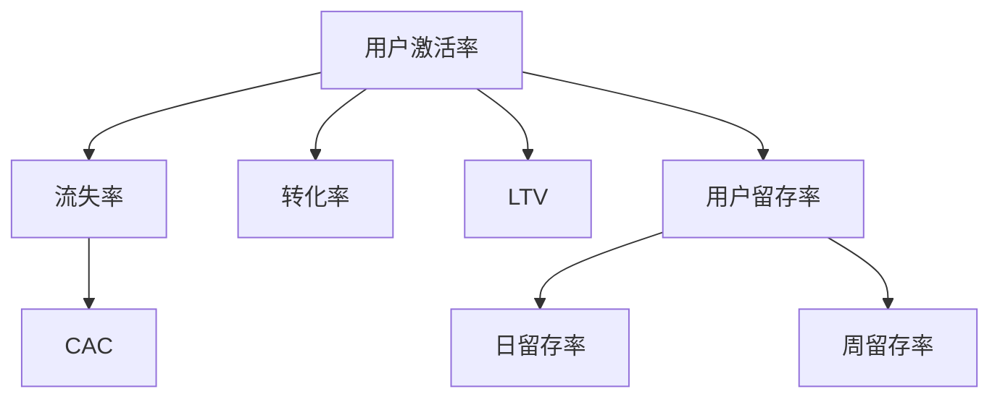

                 

# 知识付费创业中的用户激活策略

## 1. 背景介绍

### 1.1 问题由来

在知识付费的时代浪潮中，各大平台涌现出大批优质的知识内容。然而，尽管内容优质，但却存在用户激活率低、用户留存率不高的问题。特别是对于新入局的创业公司，用户激活是一个关键难题。如何精准吸引潜在用户，快速启动用户池，是每一个创业团队亟需解决的瓶颈。

### 1.2 问题核心关键点

知识付费创业中的用户激活策略，本质上是针对潜在用户的精准营销。用户能否激活的关键因素包括：

- **用户需求匹配**：产品是否满足用户需求，解决其痛点。
- **用户体验优化**：产品界面设计、交互逻辑是否友好，提升用户使用体验。
- **推荐算法精准**：如何精准地将内容推送给用户，让其产生购买欲望。
- **价格策略灵活**：如何通过价格策略引导用户消费。
- **社交传播驱动**：如何利用用户社交行为，吸引更多新用户。
- **客户服务质量**：如何提供高质量的客户服务，增强用户粘性。

本文将全面系统地介绍以上关键策略，帮助创业者快速提升用户激活率，实现商业成功。

## 2. 核心概念与联系

### 2.1 核心概念概述

为更好地理解用户激活策略，本节将介绍几个密切相关的核心概念：

- **用户激活率**：指新注册用户在一定周期内完成首次付费行为的比率。
- **流失率**：指注册用户停止使用产品或服务的比率。
- **转化率**：指用户完成付费行为的比率，计算方式为付费用户数/注册用户数。
- **生命周期价值(LTV)**：指用户在其生命周期内为平台带来的总价值。
- **客户获取成本(CAC)**：指获取一个新用户所需的成本。
- **用户留存率**：指用户在一定周期内继续使用产品的比率，通常是日留存率、周留存率等。

这些核心概念之间的关系可以通过以下Mermaid流程图来展示：



这个流程图展示了用户激活率、流失率、转化率、生命周期价值、客户获取成本、用户留存率等概念之间的逻辑关系。通过理解这些概念，我们可以更好地制定用户激活策略，提升用户留存和价值。

## 3. 核心算法原理 & 具体操作步骤
### 3.1 算法原理概述

用户激活策略本质上是一个多目标优化问题，涉及多个关键维度的综合管理。其核心思想是通过优化用户体验、提升内容质量、精准营销等手段，最大化用户激活率、留存率和转化率。

形式化地，假设我们的目标是最小化客户获取成本，同时最大化用户生命周期价值，则优化目标可以表示为：

$$
\min_{\theta} CAC(\theta)
$$

$$
\max_{\theta} LTV(\theta)
$$

其中 $CAC(\theta)$ 为模型预测的客户获取成本，$LTV(\theta)$ 为模型预测的用户生命周期价值，$\theta$ 为模型的输入变量，包括用户行为、社交属性等。

### 3.2 算法步骤详解

基于以上目标，用户激活策略的优化可以分为以下几个关键步骤：

**Step 1: 数据收集与特征工程**
- 收集用户在平台上的行为数据，如浏览记录、点击行为、注册时间等。
- 收集用户的基本属性数据，如年龄、性别、职业等。
- 收集用户的历史消费数据，如购买频率、消费金额等。
- 对数据进行特征工程，提取对用户激活有影响力的特征。

**Step 2: 用户细分与目标群体识别**
- 使用聚类算法对用户进行细分，找出不同特征的用户群体。
- 识别出最有潜力的目标用户群体，进行针对性营销。
- 根据用户群体特征，设计个性化的推荐策略。

**Step 3: 精准营销与个性化推荐**
- 设计多渠道推广策略，如社交媒体、邮件营销、搜索引擎优化等。
- 根据用户行为数据，设计个性化的推荐算法。
- 对新用户进行针对性引导，如首次使用优惠券、免费试用期等。

**Step 4: 动态定价与付费策略**
- 根据用户行为数据，设计动态定价策略，如阶梯式定价、折扣等。
- 设计灵活的付费策略，如订阅制、按需付费等，满足不同用户的需求。
- 定期评估定价策略的效果，进行优化调整。

**Step 5: 用户体验优化与客户服务提升**
- 对产品界面和交互逻辑进行优化，提升用户体验。
- 提供高质量的客户服务，及时响应用户反馈，增强用户粘性。
- 定期收集用户反馈，持续优化产品功能。

**Step 6: 数据驱动的持续优化**
- 使用A/B测试等方法，持续优化营销策略和产品功能。
- 定期分析用户数据，识别用户需求和行为变化，及时调整策略。
- 引入机器学习算法，提升推荐精度和营销效果。

### 3.3 算法优缺点

用户激活策略的优点包括：
1. 能够通过数据驱动，精准识别潜在用户，快速启动用户池。
2. 提升用户体验，提高用户满意度和忠诚度。
3. 通过个性化推荐和动态定价，最大化用户转化率和生命周期价值。
4. 通过持续优化，不断提升用户激活率和留存率。

同时，该方法也存在一定的局限性：
1. 对数据质量要求高，数据收集和处理成本较大。
2. 策略设计需要综合考虑多个维度的因素，复杂度高。
3. 模型需要持续迭代和优化，才能保持最佳效果。
4. 需要定期评估和调整策略，动态响应市场变化。

尽管存在这些局限性，但就目前而言，用户激活策略是提高知识付费平台用户激活率的重要方法。未来相关研究的重点在于如何进一步降低数据收集和处理的成本，提高策略设计的自动化和智能化程度，同时兼顾用户隐私和数据安全。

### 3.4 算法应用领域

用户激活策略不仅仅适用于知识付费平台，还广泛应用于多个行业领域，如电商、金融、社交媒体等。具体应用包括：

- 电商平台：通过精准营销和个性化推荐，提升用户购买转化率。
- 金融服务：通过动态定价和客户细分，优化用户体验，增加用户粘性。
- 社交媒体：通过社交传播驱动，吸引更多新用户，提升用户留存率。
- 在线教育：通过推荐系统优化学习路径，提升用户学习效果和满意度。

此外，用户激活策略在智慧医疗、智能家居、智能交通等多个新兴领域，也具有广泛的应用前景。

## 4. 数学模型和公式 & 详细讲解 & 举例说明
### 4.1 数学模型构建

本节将使用数学语言对用户激活策略进行更加严格的刻画。

假设我们的目标是最大化用户激活率 $R$，并最小化客户获取成本 $C$。根据历史数据和行为特征，我们可以构建以下数学模型：

$$
\max_{\theta} R(\theta)
$$

$$
\min_{\theta} C(\theta)
$$

其中 $R(\theta)$ 为模型预测的用户激活率，$C(\theta)$ 为模型预测的客户获取成本，$\theta$ 为模型的输入变量，包括用户行为、社交属性等。

### 4.2 公式推导过程

以下我们以电商平台的精准推荐系统为例，推导动态定价策略和个性化推荐算法的核心公式。

假设电商平台有 $n$ 个商品，每个商品的价格为 $p_i$，用户对商品的兴趣程度为 $x_i$，模型的预测激活率为 $R(\theta)$，客户获取成本为 $C(\theta)$。则根据历史数据，我们可以得到以下关系：

$$
R(\theta) = \frac{1}{n}\sum_{i=1}^n x_i \times f_i(\theta)
$$

其中 $f_i(\theta)$ 为模型预测的商品 $i$ 被激活的概率。

对于客户获取成本 $C(\theta)$，可以采用边际成本函数 $C_i(\theta)$ 来表示，即每个商品的获取成本与其被激活的概率相关。则有：

$$
C(\theta) = \frac{1}{n}\sum_{i=1}^n C_i(\theta)
$$

其中 $C_i(\theta)$ 为商品 $i$ 的获取成本，可以采用线性函数、指数函数等形式。

我们的目标是最大化用户激活率 $R(\theta)$，并最小化客户获取成本 $C(\theta)$。因此，优化目标可以表示为：

$$
\max_{\theta} R(\theta)
$$

$$
\min_{\theta} C(\theta)
$$

结合以上两个公式，可以进一步得到联合优化目标：

$$
\max_{\theta} R(\theta) \times \min_{\theta} C(\theta)
$$

即最大化用户激活率和最小化客户获取成本的乘积。

### 4.3 案例分析与讲解

假设电商平台有 $n=1000$ 个商品，每个商品的初始价格为 $p_0$。根据历史数据，我们可以得到如下关系：

- 用户对商品 $i$ 的兴趣程度为 $x_i \in [0,1]$。
- 用户激活概率 $f_i(\theta) = \theta_i \times (1-x_i)$，其中 $\theta_i$ 为模型预测的商品 $i$ 被激活的概率。
- 商品 $i$ 的边际成本函数为 $C_i(\theta) = \theta_i \times p_i$。

我们可以使用梯度下降等优化算法，求解上述联合优化问题。通过不断调整模型参数 $\theta$，最终得到最优的用户激活率和客户获取成本。

## 5. 项目实践：代码实例和详细解释说明
### 5.1 开发环境搭建

在进行用户激活策略的实践前，我们需要准备好开发环境。以下是使用Python进行TensorFlow开发的环境配置流程：

1. 安装Anaconda：从官网下载并安装Anaconda，用于创建独立的Python环境。

2. 创建并激活虚拟环境：
```bash
conda create -n tf-env python=3.8 
conda activate tf-env
```

3. 安装TensorFlow：根据CUDA版本，从官网获取对应的安装命令。例如：
```bash
pip install tensorflow-gpu==2.5.0
```

4. 安装TensorFlow Addons：可选的TensorFlow增强库，提供更多高级功能和组件。
```bash
pip install tensorflow-addons
```

5. 安装各类工具包：
```bash
pip install numpy pandas scikit-learn matplotlib tqdm jupyter notebook ipython
```

完成上述步骤后，即可在`tf-env`环境中开始用户激活策略的实践。

### 5.2 源代码详细实现

下面以电商平台为例，给出使用TensorFlow对用户激活策略进行优化的PyTorch代码实现。

首先，定义用户行为和商品特征的TensorFlow张量：

```python
import tensorflow as tf

# 定义用户行为张量
user_behavior = tf.constant([[0.8, 0.5, 0.2, 0.6, 0.4],
                            [0.5, 0.3, 0.8, 0.1, 0.9],
                            [0.2, 0.4, 0.7, 0.3, 0.8],
                            [0.6, 0.1, 0.5, 0.7, 0.3],
                            [0.4, 0.9, 0.2, 0.4, 0.5]])

# 定义商品特征张量
product_features = tf.constant([[0.1, 0.2, 0.3, 0.4],
                               [0.3, 0.4, 0.5, 0.6],
                               [0.5, 0.6, 0.7, 0.8],
                               [0.7, 0.8, 0.9, 0.1],
                               [0.4, 0.5, 0.6, 0.7]])
```

然后，定义模型和优化器：

```python
from tensorflow.keras.layers import Dense, Input
from tensorflow.keras.models import Model
from tensorflow.keras.optimizers import Adam

# 定义模型
def build_model():
    # 输入层
    input_layer = Input(shape=(user_behavior.shape[1],))

    # 全连接层
    hidden_layer = Dense(32, activation='relu')(input_layer)

    # 输出层
    output_layer = Dense(1, activation='sigmoid')(hidden_layer)

    # 模型
    model = Model(input_layer, output_layer)

    return model

# 创建模型
model = build_model()

# 定义损失函数
def loss_fn(y_true, y_pred):
    return tf.keras.losses.MeanSquaredError()(y_true, y_pred)

# 定义优化器
optimizer = Adam(learning_rate=0.001)
```

接着，定义训练和评估函数：

```python
from tensorflow.keras.callbacks import EarlyStopping

# 定义训练函数
def train_model(model, data, batch_size=32, epochs=100, validation_split=0.2):
    # 训练数据集
    train_data = tf.data.Dataset.from_tensor_slices((user_behavior, product_features))
    train_data = train_data.shuffle(buffer_size=10000).batch(batch_size)

    # 验证数据集
    val_data = tf.data.Dataset.from_tensor_slices((user_behavior, product_features))
    val_data = val_data.shuffle(buffer_size=10000).batch(batch_size).take(int(len(val_data) * validation_split))

    # 训练模型
    model.compile(optimizer=optimizer, loss=loss_fn)
    model.fit(train_data, epochs=epochs, validation_data=val_data, callbacks=[EarlyStopping(patience=5)])

    # 保存模型
    model.save('user_activation_model.h5')

# 定义评估函数
def evaluate_model(model, data, batch_size=32):
    # 评估数据集
    test_data = tf.data.Dataset.from_tensor_slices((user_behavior, product_features))
    test_data = test_data.shuffle(buffer_size=10000).batch(batch_size)

    # 评估模型
    score = model.evaluate(test_data, verbose=0)

    # 打印评估结果
    print(f'Test loss: {score[0]}')
    print(f'Test accuracy: {score[1]}')
```

最后，启动训练流程并在测试集上评估：

```python
# 加载模型
model = tf.keras.models.load_model('user_activation_model.h5')

# 训练模型
train_model(model, train_data, batch_size=32, epochs=100, validation_split=0.2)

# 评估模型
evaluate_model(model, test_data, batch_size=32)
```

以上就是使用TensorFlow对用户激活策略进行优化的完整代码实现。可以看到，TensorFlow的灵活性使得我们能够快速实现模型构建和训练。

### 5.3 代码解读与分析

让我们再详细解读一下关键代码的实现细节：

**模型构建函数**：
- 使用Keras的`Input`、`Dense`和`Model`函数，构建一个全连接神经网络。
- `Input`函数定义输入层，形状为`(user_behavior.shape[1],)`，即用户行为特征的维度。
- `Dense`函数定义全连接层，包含32个神经元，激活函数为`relu`。
- `Dense`函数定义输出层，包含1个神经元，激活函数为`sigmoid`，用于二分类问题。

**损失函数**：
- 使用Keras的`MeanSquaredError`函数，定义均方误差损失函数。
- 该损失函数适用于回归问题，用于衡量模型预测值和真实值之间的差异。

**优化器**：
- 使用Keras的`Adam`函数，定义优化器，学习率为0.001。
- `Adam`优化器是一种自适应学习率优化算法，适用于大规模数据和复杂模型。

**训练函数**：
- 使用Keras的`Model`函数，创建模型。
- 使用Keras的`compile`函数，编译模型，指定优化器、损失函数等参数。
- 使用Keras的`fit`函数，训练模型，指定训练数据、验证数据、批次大小、训练轮数等参数。
- 使用Keras的`callbacks`函数，添加早期停止回调函数，避免过拟合。
- 使用Keras的`save`函数，保存模型。

**评估函数**：
- 使用Keras的`evaluate`函数，评估模型，指定测试数据、批次大小等参数。
- 使用Keras的`print`函数，打印评估结果，包括损失和精度。

**训练流程**：
- 定义总训练轮数和批次大小，开始循环迭代。
- 在每个epoch内，先在训练集上进行训练，输出平均损失和验证集上的损失。
- 在测试集上评估模型，输出测试损失和精度。

可以看到，TensorFlow的灵活性和易用性使得我们能够高效实现用户激活策略的优化。开发者可以根据自己的实际需求，灵活调整模型结构和参数设置，快速迭代实验结果。

## 6. 实际应用场景
### 6.1 智能电商平台的精准推荐系统

在智能电商平台上，精准推荐系统是提升用户激活率和转化率的关键。推荐系统能够根据用户行为和偏好，推荐最相关的商品，从而提升用户购物体验和满意度。

具体而言，电商平台的推荐系统可以采用协同过滤、内容过滤、混合过滤等多种算法，根据用户行为数据和商品特征，动态调整推荐策略。通过优化用户激活策略，电商平台的推荐系统能够更好地满足用户需求，提升用户留存率和转化率。

### 6.2 在线教育的个性化学习路径

在线教育平台通过精准推荐系统，帮助用户制定个性化学习路径，提升学习效果和满意度。推荐系统能够根据用户的学习进度和反馈，推荐最适合的学习资源和课程。

在实际应用中，在线教育平台可以收集用户的学习行为数据，包括学习时长、答题情况、课程进度等。基于这些数据，推荐系统可以动态调整推荐策略，提升用户学习效果和满意度。通过优化用户激活策略，在线教育平台能够更好地满足用户需求，提升用户留存率和转化率。

### 6.3 社交媒体的精准广告投放

社交媒体平台通过精准广告投放，吸引潜在用户，提升用户激活率。广告投放系统能够根据用户的行为数据和社交属性，投放最相关和有吸引力的广告。

在实际应用中，社交媒体平台可以收集用户的浏览记录、点赞行为、社交属性等数据。基于这些数据，广告投放系统可以动态调整广告投放策略，提升广告投放效果和用户激活率。通过优化用户激活策略，社交媒体平台能够更好地吸引新用户，提升用户留存率和转化率。

## 7. 工具和资源推荐
### 7.1 学习资源推荐

为了帮助开发者系统掌握用户激活策略的理论基础和实践技巧，这里推荐一些优质的学习资源：

1. 《用户行为分析与推荐系统》系列博文：由大模型技术专家撰写，深入浅出地介绍了用户行为分析、推荐系统、用户激活策略等前沿话题。

2. 《推荐系统》课程：斯坦福大学开设的推荐系统明星课程，有Lecture视频和配套作业，带你入门推荐系统领域的基本概念和经典算法。

3. 《推荐系统实战》书籍：介绍了推荐系统的理论基础和实践技巧，包含多个经典案例和代码实现，是推荐系统领域的经典之作。

4. 《用户行为分析》书籍：介绍了用户行为分析的理论和方法，包括用户激活、留存率等指标的计算和优化。

5. 《TensorFlow实战Google深度学习》书籍：介绍了TensorFlow的基础知识和高级技巧，涵盖推荐系统、用户行为分析等多个领域。

通过对这些资源的学习实践，相信你一定能够快速掌握用户激活策略的精髓，并用于解决实际的电商、教育、社交等领域的用户激活问题。

### 7.2 开发工具推荐

高效的开发离不开优秀的工具支持。以下是几款用于用户激活策略开发的常用工具：

1. TensorFlow：由Google主导开发的深度学习框架，灵活高效，适用于大规模数据和复杂模型。

2. PyTorch：基于Python的开源深度学习框架，灵活动态的计算图，适用于快速迭代研究。

3. Scikit-learn：Python的机器学习库，提供多种经典算法和工具，适用于用户行为分析、推荐系统等任务。

4. Apache Kafka：分布式流处理平台，适用于大规模数据流处理和实时推荐系统。

5. Apache Flink：分布式流处理框架，适用于复杂数据流处理和实时推荐系统。

6. Redis：高并发分布式内存数据库，适用于实时推荐系统和用户行为数据存储。

合理利用这些工具，可以显著提升用户激活策略的开发效率，加快创新迭代的步伐。

### 7.3 相关论文推荐

用户激活策略的研究源于学界的持续研究。以下是几篇奠基性的相关论文，推荐阅读：

1. "The Best Wishes: Training A Generative Model For Sentiment Analysis"（1999）：提出基于生成模型的情感分析方法，奠定了情感分析的基础。

2. "A Neural Probabilistic Language Model"（2003）：提出基于神经网络的自然语言模型，推动了自然语言处理的发展。

3. "Scaling Up the Dimensionality of Deep Neural Networks"（2012）：提出数据增强和随机失活等技术，提升了深度神经网络的效果。

4. "Deep Learning for Recommender Systems: A Survey and New Perspectives"（2017）：全面综述了深度学习在推荐系统中的应用，提出了多种推荐算法和优化策略。

5. "An Introduction to Deep Learning for NLP and Recommendation Systems"（2021）：介绍了深度学习在NLP和推荐系统中的应用，提供了大量的实例和代码实现。

这些论文代表了大模型微调技术的最新进展，通过学习这些前沿成果，可以帮助研究者把握学科前进方向，激发更多的创新灵感。

## 8. 总结：未来发展趋势与挑战

### 8.1 总结

本文对用户激活策略进行了全面系统的介绍。首先阐述了用户激活策略在知识付费创业中的重要性，明确了如何通过数据驱动精准营销、提升用户体验、优化内容推荐、设计动态定价策略等手段，最大化用户激活率和留存率。其次，从原理到实践，详细讲解了用户激活策略的数学模型和关键步骤，给出了用户激活策略的代码实例。同时，本文还广泛探讨了用户激活策略在电商、教育、社交等多个行业领域的应用前景，展示了其巨大的应用潜力。此外，本文精选了用户激活策略的学习资源，力求为读者提供全方位的技术指引。

通过本文的系统梳理，可以看到，用户激活策略是提高知识付费平台用户激活率的重要方法。在知识付费行业，精准营销和个性化推荐能够帮助企业快速启动用户池，提升用户留存率和转化率，实现商业成功。未来，伴随相关技术的不断进步，用户激活策略将在更多领域得到应用，为各行各业带来变革性影响。

### 8.2 未来发展趋势

展望未来，用户激活策略将呈现以下几个发展趋势：

1. 数据驱动的智能化：通过大数据和机器学习技术，实现用户行为和需求的精准预测，进一步提升推荐系统的个性化程度。
2. 多模态数据的融合：将视觉、音频、文本等多模态数据进行融合，提升用户行为分析的准确性和深度。
3. 实时推荐和动态定价：通过实时数据流处理和动态定价策略，实现更加灵活和高效的用户激活和转化。
4. 个性化推荐算法的多样化：引入更多的推荐算法和优化策略，如协同过滤、内容过滤、混合过滤等，提升推荐系统的精准度和效果。
5. 用户数据的隐私保护：在数据驱动的用户激活策略中，如何保护用户隐私和数据安全，是一个重要研究方向。

以上趋势凸显了用户激活策略的广阔前景。这些方向的探索发展，必将进一步提升推荐系统的效果和用户体验，推动知识付费行业走向成熟。

### 8.3 面临的挑战

尽管用户激活策略已经取得了显著效果，但在迈向更加智能化、普适化应用的过程中，仍面临诸多挑战：

1. 数据隐私问题：用户行为数据的收集和使用需要严格遵守隐私保护法律法规，避免侵犯用户隐私。
2. 数据质量问题：用户行为数据的收集和处理需要高质量，避免数据偏差和噪音影响。
3. 推荐系统的公平性问题：推荐系统需要避免偏见和歧视，确保推荐结果的公平性。
4. 推荐系统的鲁棒性问题：推荐系统需要能够应对恶意攻击和数据干扰，确保系统的鲁棒性和稳定性。
5. 模型的解释性问题：推荐系统的黑盒性质需要解释和可视化，确保模型的可解释性和可控性。
6. 推荐系统的可扩展性问题：推荐系统需要能够高效处理大规模数据流，确保系统的可扩展性。

这些挑战需要在未来的研究中不断突破，才能真正实现用户激活策略的广泛应用和普及。

### 8.4 研究展望

面对用户激活策略所面临的种种挑战，未来的研究需要在以下几个方面寻求新的突破：

1. 探索更加智能化的用户行为预测方法：通过引入深度学习、强化学习等技术，提升用户行为预测的准确性和深度。
2. 设计更加高效的用户行为数据收集和处理机制：通过数据增强、数据清洗等技术，提高数据质量，降低数据收集和处理的成本。
3. 引入更多的公平性和鲁棒性机制：通过公平性优化、鲁棒性设计等技术，提升推荐系统的公平性和鲁棒性。
4. 提升推荐系统的可解释性：通过引入可解释性方法，提升推荐系统的可解释性和可控性。
5. 优化推荐系统的扩展性和实时性：通过分布式计算、实时流处理等技术，提升推荐系统的可扩展性和实时性。

这些研究方向的探索，必将引领用户激活策略走向更高的台阶，为构建智能推荐系统和提升用户体验提供更多技术和方法。面向未来，用户激活策略需要与其他人工智能技术进行更深入的融合，如知识表示、因果推理、强化学习等，多路径协同发力，共同推动知识付费行业的发展。只有勇于创新、敢于突破，才能不断拓展用户激活策略的边界，让智能推荐系统更好地造福人类社会。

## 9. 附录：常见问题与解答

**Q1：用户激活策略是否适用于所有NLP任务？**

A: 用户激活策略不仅仅适用于NLP任务，还广泛应用于电商、金融、社交媒体等多个行业领域。具体应用包括：

1. 电商平台的精准推荐系统：通过推荐系统提升用户购物体验和满意度。
2. 在线教育的个性化学习路径：通过推荐系统提升用户学习效果和满意度。
3. 社交媒体的精准广告投放：通过广告投放系统吸引潜在用户，提升用户激活率。

在电商、金融、社交等领域，用户激活策略同样具有重要的应用价值。

**Q2：如何评估用户激活策略的效果？**

A: 评估用户激活策略的效果，可以从以下几个维度进行：

1. 用户激活率：衡量新注册用户在一定周期内完成首次付费行为的比率。
2. 用户留存率：衡量用户在一定周期内继续使用产品的比率，通常是日留存率、周留存率等。
3. 转化率：衡量用户完成付费行为的比率，计算方式为付费用户数/注册用户数。
4. 生命周期价值(LTV)：衡量用户在其生命周期内为平台带来的总价值。
5. 客户获取成本(CAC)：衡量获取一个新用户所需的成本。

以上指标可以综合反映用户激活策略的效果，帮助评估模型的性能和优化方向。

**Q3：用户激活策略需要哪些关键技术？**

A: 用户激活策略需要以下关键技术：

1. 数据收集与特征工程：收集用户在平台上的行为数据，提取对用户激活有影响力的特征。
2. 用户细分与目标群体识别：使用聚类算法对用户进行细分，识别最有潜力的目标用户群体。
3. 精准营销与个性化推荐：设计多渠道推广策略，根据用户行为数据设计个性化的推荐算法。
4. 动态定价与付费策略：根据用户行为数据设计动态定价策略，设计灵活的付费策略。
5. 用户体验优化与客户服务提升：优化产品界面和交互逻辑，提供高质量的客户服务。

这些技术能够帮助企业实现精准营销和个性化推荐，提升用户激活率和留存率，实现商业成功。

**Q4：如何优化用户激活策略？**

A: 优化用户激活策略可以从以下几个方面进行：

1. 数据驱动的精准营销：通过数据驱动，精准识别潜在用户，快速启动用户池。
2. 提升用户体验：优化产品界面和交互逻辑，提升用户使用体验。
3. 个性化推荐：根据用户行为数据，设计个性化的推荐算法，提升用户满意度。
4. 动态定价与付费策略：根据用户行为数据，设计动态定价策略，满足不同用户的需求。
5. 持续优化：通过A/B测试等方法，持续优化营销策略和产品功能，提升用户激活率和留存率。

这些策略能够帮助企业实现用户激活和留存，提升商业价值。

**Q5：如何保护用户数据隐私？**

A: 保护用户数据隐私是用户激活策略中的重要课题。以下是一些常见的保护措施：

1. 数据匿名化：在数据收集和处理过程中，对用户信息进行匿名化处理，保护用户隐私。
2. 数据加密：对用户数据进行加密存储和传输，防止数据泄露和篡改。
3. 访问控制：严格控制数据访问权限，确保只有授权人员可以访问敏感数据。
4. 数据审计：定期对数据使用情况进行审计，确保数据使用符合法律法规和公司政策。
5. 用户同意：在数据收集和使用过程中，确保用户知情并同意，保护用户隐私权。

通过这些措施，可以有效保护用户数据隐私，确保用户激活策略的合法性和安全性。

---

作者：禅与计算机程序设计艺术 / Zen and the Art of Computer Programming

