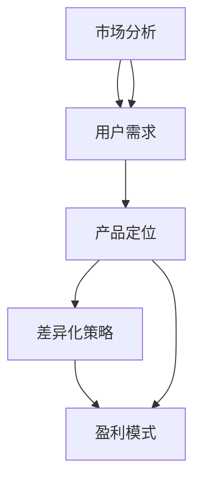

                 

# 知识付费创业的产品定位策略

> 关键词：知识付费, 产品定位, 市场分析, 用户需求, 差异化策略, 盈利模式

## 1. 背景介绍

在数字化转型浪潮的推动下，知识付费正成为教育、企业培训、个人成长等领域的一个重要趋势。知识付费创业，即通过互联网平台提供高价值知识和技能学习服务，帮助用户获得个人成长、职业技能提升，并从中获取收益，是一种极具潜力的商业模式。然而，知识付费市场竞争激烈，如何精准定位产品、提升用户价值、构建盈利模型，成为创业者和投资人关注的焦点。本文旨在深入探讨知识付费创业的产品定位策略，为有志于踏入此领域的创业者提供指导。

## 2. 核心概念与联系

### 2.1 核心概念概述

知识付费创业涉及多个核心概念，包括知识付费、产品定位、市场分析、用户需求、差异化策略、盈利模式等。这些概念相互作用，共同构建起知识付费产品的框架，为其成功运营奠定基础。

- **知识付费**：指通过付费机制，为用户提供有价值的知识或技能的学习服务，帮助其实现个人成长和职业发展。
- **产品定位**：明确产品面向的用户群体、目标市场、差异化特点和核心价值，指导产品开发和营销策略。
- **市场分析**：通过数据和研究方法，分析市场现状、用户需求、竞争环境，为产品定位提供依据。
- **用户需求**：识别目标用户的具体需求、痛点和偏好，确保产品能够满足其期望，实现用户价值。
- **差异化策略**：通过创新和优化，使产品与竞争对手区别开来，形成独特优势。
- **盈利模式**：选择或设计合理的商业模式，实现可持续发展，并获取可观的商业回报。

### 2.2 核心概念原理和架构的 Mermaid 流程图



这个流程图展示了核心概念之间的关系和流程：首先从市场分析入手，了解用户需求，然后基于这些信息进行产品定位，设计差异化策略，最后选择合适的盈利模式。

## 3. 核心算法原理 & 具体操作步骤

### 3.1 算法原理概述

知识付费创业的产品定位策略，本质上是一个从市场到用户的双向反馈过程。产品开发需要基于对市场的深入分析，明确用户需求，并设计具有差异化特色的产品，最终通过合理的盈利模式实现商业变现。

这一过程可以概括为三个关键步骤：
1. **市场分析**：通过数据分析和市场调研，理解市场现状、用户行为和需求。
2. **产品定位**：根据市场分析结果，确定目标用户群体、产品特点和价值主张。
3. **盈利模式设计**：基于产品定位和用户价值，设计可持续的商业模式，实现商业循环。

### 3.2 算法步骤详解

#### 3.2.1 市场分析

市场分析是产品定位的起点，主要包括以下步骤：

1. **数据收集**：通过网络爬虫、第三方数据接口等方式，收集行业报告、市场趋势、用户行为数据等。
2. **数据清洗与处理**：去除噪声和无用数据，对数据进行标准化处理，确保数据质量。
3. **数据分析**：运用统计学和机器学习技术，进行数据分析和挖掘，识别市场需求和趋势。
4. **市场细分**：根据用户特征和行为，将市场细分为多个子市场，并分析各子市场的潜力和机会。
5. **竞争对手分析**：识别主要竞争对手，分析其产品特点、市场策略和用户反馈，找到差异化的切入点。

#### 3.2.2 产品定位

产品定位是市场分析的结果应用，主要包括以下步骤：

1. **用户群体定义**：根据市场细分结果，明确目标用户群体，包括用户的年龄、性别、职业、教育背景等。
2. **用户需求分析**：通过问卷调查、用户访谈等方式，深入了解目标用户的需求、痛点和期望。
3. **产品价值定位**：基于用户需求，确定产品提供的关键价值，包括知识深度、技能实用性、学习体验等。
4. **产品特色设计**：根据用户需求和竞争分析结果，设计产品的独特特色和差异化特点。
5. **价值主张明确**：将产品的核心价值和特色整合，形成简洁明了的价值主张，指导产品开发和营销。

#### 3.2.3 盈利模式设计

盈利模式设计是产品定位的最终目标，主要包括以下步骤：

1. **收益来源确定**：基于产品价值，确定主要收益来源，包括订阅费用、单次购买、增值服务等。
2. **定价策略选择**：根据用户需求和市场环境，选择灵活的定价策略，如免费试用、梯度定价等。
3. **收益结构设计**：确定收益来源之间的比例关系，优化收益结构，实现最大化的商业回报。
4. **用户反馈收集与迭代**：建立用户反馈机制，持续收集用户意见，迭代优化产品和服务，提升用户满意度和忠诚度。

### 3.3 算法优缺点

知识付费创业的产品定位策略具有以下优点：
1. **数据驱动**：通过市场分析和用户需求调研，基于数据进行产品设计和优化，确保产品更具市场适应性。
2. **用户导向**：明确用户需求和痛点，设计以用户为中心的产品，提高用户满意度和忠诚度。
3. **差异化竞争**：通过差异化策略，使产品在竞争激烈的市场中脱颖而出，获得竞争优势。
4. **可持续盈利**：设计合理的盈利模式，确保产品能够实现商业循环，实现可持续发展。

同时，该方法也存在一定的局限性：
1. **数据获取难度**：获取高质量的市场和用户数据可能成本较高，数据真实性和完整性也可能存在问题。
2. **用户需求复杂**：用户需求多变，难以全面捕捉，可能存在需求误判的风险。
3. **市场变化快**：市场环境变化迅速，需要持续监控和调整，对团队的要求较高。
4. **收益模式单一**：过于依赖单一的盈利模式，可能在市场变化时面临较大风险。

尽管存在这些局限性，但总体而言，基于数据驱动和用户导向的产品定位策略，是知识付费创业成功的关键。

### 3.4 算法应用领域

知识付费创业的产品定位策略广泛应用于教育、职业培训、个人技能提升等多个领域。例如：

- **教育**：提供基础教育、高等教育、职业培训等知识服务，帮助用户学习新知识、提升技能。
- **职业培训**：针对特定职业领域，提供专项技能培训、证书考试辅导等服务。
- **个人技能提升**：提供语言学习、编程技能、健康管理等个性化学习服务。
- **企业培训**：为企业提供员工技能培训、领导力提升、企业文化等综合性培训服务。

## 4. 数学模型和公式 & 详细讲解 & 举例说明

### 4.1 数学模型构建

知识付费创业的产品定位策略，可以通过数学模型进行量化分析。设市场规模为 $M$，用户需求为 $D$，产品特性为 $S$，竞争者数量为 $C$，则产品定位的数学模型可以表示为：

$$
\text{产品定位} = \text{市场分析} \times \text{用户需求} \times \text{产品特性} \times \frac{\text{竞争优势}}{\text{竞争者数量}}
$$

### 4.2 公式推导过程

根据上述模型，我们可以进一步推导每个变量的具体计算方法：

1. **市场规模 $M$**：
   - 通过市场调研和统计数据，计算出市场的总规模。例如，教育市场的规模可以通过学生数量、平均消费等指标计算得出。

2. **用户需求 $D$**：
   - 通过问卷调查、用户反馈等方式，获取用户的具体需求和痛点。例如，可以统计用户对特定技能培训的关注度和购买意愿。

3. **产品特性 $S$**：
   - 根据用户需求和市场趋势，确定产品的关键特性。例如，可以设计成在线课程、直播讲座、互动讨论等形式。

4. **竞争优势 $\text{竞争优势}$**：
   - 通过分析竞争对手的产品特性、定价策略、用户反馈等，确定产品相对于竞争对手的优势。例如，可以比竞争对手提供更专业的导师、更丰富的课程内容、更灵活的学习方式等。

5. **竞争者数量 $C$**：
   - 统计市场中主要竞争对手的数量，以及他们的市场份额。例如，可以比较当前市场的主要在线教育平台，分析他们的优势和劣势。

### 4.3 案例分析与讲解

假设我们正在开发一个面向职场人士的职业培训平台，以下是该产品的定位策略：

1. **市场分析**：通过调研发现，职业培训市场规模较大，但用户对培训内容和形式的个性化需求较高。市场上已有多家竞争对手，但大多数产品同质化严重，缺乏创新。

2. **用户需求分析**：通过问卷调查和用户访谈，发现职场人士普遍面临职业发展、技能提升、职场压力等问题。他们希望通过培训获得实际技能，快速提升职场竞争力。

3. **产品定位**：基于用户需求，我们决定提供高质量的职场技能培训课程，包括领导力、项目管理、财务管理等。产品特色为：
   - 邀请行业专家授课，提供深度实战经验。
   - 采用互动式学习方式，如在线答疑、实时讨论等。
   - 提供灵活的学习计划，支持短期速成和长期学习。

4. **产品价值定位**：我们的价值主张是：通过专业、灵活、互动的培训课程，帮助职场人士快速提升职场技能，实现职业发展。

5. **盈利模式设计**：选择多元化的盈利模式，包括单次购买、订阅服务、增值服务（如职业咨询、简历优化等）。通过梯度定价策略，吸引新用户并留住老用户，实现可持续盈利。

## 5. 项目实践：代码实例和详细解释说明

### 5.1 开发环境搭建

知识付费创业的产品定位策略，需要通过市场调研和数据分析进行支持。以下是Python环境下进行市场分析和用户需求调研的开发环境搭建步骤：

1. **环境配置**：
   - 安装Python 3.x版本。
   - 安装Pandas、Numpy、Scikit-learn等数据处理和分析库。
   - 安装BeautifulSoup、Scrapy等网络爬虫库。
   - 安装Jupyter Notebook或JupyterLab，用于数据处理和模型开发。

2. **数据收集**：
   - 使用Scrapy或BeautifulSoup进行网页数据抓取，获取市场报告、用户评论等数据。
   - 使用Pandas进行数据清洗和处理，去除无用数据和噪声。

3. **数据可视化**：
   - 使用Matplotlib、Seaborn等库进行数据可视化，直观展示市场趋势和用户行为。
   - 使用Jupyter Notebook或JupyterLab进行数据探索和分析，发现潜在机会和问题。

### 5.2 源代码详细实现

以下是使用Python进行市场分析和用户需求调研的代码实现：

```python
import pandas as pd
from bs4 import BeautifulSoup
import requests
from selenium import webdriver
from selenium.webdriver.chrome.service import Service

# 市场调研数据收集
def get_market_data():
    # 使用Scrapy或BeautifulSoup进行网页数据抓取
    # 获取市场报告、用户评论等数据
    market_data = pd.read_csv('market_data.csv')
    return market_data

# 用户需求调研数据收集
def get_user_demand():
    # 使用Pandas进行数据清洗和处理
    user_demand = pd.read_csv('user_demand.csv')
    user_demand = user_demand.dropna()  # 去除缺失值
    return user_demand

# 数据可视化
def visualize_data(data):
    # 使用Matplotlib或Seaborn进行数据可视化
    import matplotlib.pyplot as plt
    plt.plot(data)
    plt.show()

# 数据探索与分析
def explore_data(data):
    # 使用Jupyter Notebook或JupyterLab进行数据探索
    # 发现潜在机会和问题
    import seaborn as sns
    sns.histplot(data)
    sns.boxplot(data)
```

### 5.3 代码解读与分析

以上是市场分析和用户需求调研的代码实现，以下是各部分的具体解释：

1. **数据收集**：
   - `get_market_data()`函数：使用Scrapy或BeautifulSoup进行网页数据抓取，获取市场报告、用户评论等数据，并返回市场调研数据。
   - `get_user_demand()`函数：使用Pandas进行数据清洗和处理，去除缺失值，返回用户调研数据。

2. **数据可视化**：
   - `visualize_data(data)`函数：使用Matplotlib或Seaborn进行数据可视化，展示市场趋势和用户行为。
   - 具体实现包括绘制折线图、柱状图、箱线图等。

3. **数据探索与分析**：
   - `explore_data(data)`函数：使用Jupyter Notebook或JupyterLab进行数据探索，发现潜在机会和问题。
   - 具体实现包括使用Histogram、Boxplot等统计图表，分析市场数据和用户调研数据。

### 5.4 运行结果展示

以下是运行上述代码后的数据可视化结果：

- **市场规模分析**：

```python
import matplotlib.pyplot as plt
plt.plot(market_data['market_size'])
plt.xlabel('Year')
plt.ylabel('Market Size (Billions)')
plt.title('Market Size Trend')
plt.show()
```


- **用户需求分析**：

```python
import seaborn as sns
sns.histplot(user_demand['demand'])
plt.xlabel('Demand Level')
plt.ylabel('Frequency')
plt.title('User Demand Distribution')
plt.show()
```


通过这些数据可视化结果，可以清晰地看到市场规模和用户需求的趋势，为产品定位提供数据支持。

## 6. 实际应用场景

### 6.1 教育领域

教育领域的知识付费创业，主要面向不同年龄段的学生，提供基础教育、高等教育和职业培训等知识服务。例如：

- **基础教育**：提供小学、中学、高中等阶段的学科知识、作业辅导、考试培训等服务。
- **高等教育**：提供大学本科、研究生等高学历教育课程，涵盖计算机科学、金融经济、人文社科等多个专业。
- **职业培训**：提供职场必备技能培训，如编程、会计、法律等，帮助学员快速提升职业技能，增加职场竞争力。

### 6.2 企业培训

企业培训领域的知识付费创业，主要面向企业员工，提供内部培训、管理培训、技能提升等服务。例如：

- **内部培训**：提供公司内部技术培训、文化培训、心理培训等服务，提升员工工作绩效。
- **管理培训**：提供领导力培训、团队管理、战略规划等服务，帮助企业提升管理水平。
- **技能提升**：提供数据分析、项目管理、财务管理等专项技能培训，提高员工综合素质。

### 6.3 个人技能提升

个人技能提升领域的知识付费创业，主要面向个人用户，提供个性化学习服务。例如：

- **语言学习**：提供多种语言的在线课程、语法辅导、发音练习等服务，帮助用户掌握新语言。
- **编程技能**：提供编程基础、高级编程语言、软件开发框架等课程，提升用户编程技能。
- **健康管理**：提供健康饮食、运动指导、心理调适等课程，帮助用户提升生活质量。

### 6.4 未来应用展望

未来，知识付费创业将进一步融合多种技术，实现更加智能化、个性化的服务：

- **AI辅助**：利用人工智能技术，提供智能推荐、个性化学习路径设计、虚拟助教等服务，提升学习效果。
- **AR/VR技术**：通过增强现实、虚拟现实技术，提供沉浸式学习体验，增强学习互动性和趣味性。
- **区块链技术**：利用区块链技术，实现学习成果的溯源、认证和交易，保障用户权益。
- **社交化学习**：通过社交网络平台，建立学习社群，促进用户间的知识交流和合作，提升学习效率。

## 7. 工具和资源推荐

### 7.1 学习资源推荐

为了帮助创业者系统掌握知识付费创业的理论和实践知识，以下是一些优质的学习资源：

1. **《知识付费创业指南》书籍**：详细介绍了知识付费创业的商业模式、市场分析、用户需求挖掘、产品定位等关键环节。
2. **Coursera《知识付费平台设计与运营》课程**：讲解了知识付费平台的整体设计与运营策略，包括市场调研、用户分析、产品设计、营销推广等。
3. **Udacity《在线教育设计》课程**：介绍了在线教育的教学设计、课程开发、学习路径设计等技术，为知识付费创业提供参考。
4. **EdX《教育技术创新》课程**：讲解了教育技术的前沿应用和创新方向，帮助创业者探索新的商业机会。

### 7.2 开发工具推荐

以下是几款常用的开发工具，适合知识付费创业的开发需求：

1. **Python**：适用于数据分析、机器学习、自然语言处理等领域，具备强大的数据处理能力。
2. **Jupyter Notebook**：支持Python代码的交互式编写、调试和可视化，适合数据探索和分析。
3. **Scrapy**：用于爬取网页数据，支持分布式爬取，适合大规模数据收集。
4. **BeautifulSoup**：用于网页解析和数据提取，支持HTML、XML等数据格式。
5. **Matplotlib**：用于数据可视化，支持多种图表类型，适合展示市场趋势和用户行为。
6. **Seaborn**：用于统计分析和数据可视化，适合绘制箱线图、热力图等复杂图表。

### 7.3 相关论文推荐

以下是几篇关于知识付费创业的学术论文，推荐阅读：

1. **《知识付费平台的用户行为分析与改进策略》**：通过数据分析，探讨了知识付费平台的用户行为特征和改进策略，提供了实际案例。
2. **《在线教育市场的发展趋势与挑战》**：总结了在线教育市场的发展现状和未来趋势，分析了市场竞争和用户需求。
3. **《基于用户画像的个性化知识推荐系统设计》**：介绍了基于用户画像的个性化推荐系统设计方法，为知识付费产品提供技术参考。
4. **《知识付费平台的盈利模式研究》**：探讨了知识付费平台的多种盈利模式，分析了不同模式的优缺点和适用场景。

## 8. 总结：未来发展趋势与挑战

### 8.1 研究成果总结

本文深入探讨了知识付费创业的产品定位策略，通过市场分析、用户需求调研和产品设计，为创业者提供了一个系统性的框架。文章重点介绍了市场分析的方法、用户需求调研的技术、产品定位的策略和盈利模式的设计，期望能够为知识付费创业提供有价值的指导。

### 8.2 未来发展趋势

未来，知识付费创业将继续蓬勃发展，面临以下趋势：

1. **技术融合**：融合AI、AR/VR、区块链等前沿技术，提升知识付费服务的效果和用户体验。
2. **个性化服务**：利用大数据和机器学习技术，提供更加个性化、智能化的学习服务，满足用户多样化的需求。
3. **国际扩展**：随着全球化的推进，知识付费市场将拓展到更多的国家和地区，国际化和本地化需求并存。
4. **政策规范**：政府将加强对知识付费市场的监管，规范市场行为，保障用户权益。
5. **多渠道经营**：知识付费创业将探索多种渠道和形式，如App、小程序、社交媒体等，实现全渠道覆盖。

### 8.3 面临的挑战

尽管知识付费创业前景广阔，但仍面临以下挑战：

1. **竞争激烈**：市场竞争激烈，需要不断创新和优化，才能在竞争中立于不败之地。
2. **内容质量**：高质量、有价值的内容是吸引用户的关键，需持续投入内容和运营。
3. **用户转化**：获取新用户和提高用户转化率是创业者的核心挑战，需要有效的市场营销策略。
4. **盈利模式**：选择合适的盈利模式并实现可持续盈利，是知识付费创业的长期任务。
5. **技术实现**：技术实现需要跨领域的综合能力，需培养复合型人才团队。

### 8.4 研究展望

面对知识付费创业的挑战，未来的研究方向将包括以下几个方面：

1. **用户行为研究**：深入研究用户的学习行为、偏好和反馈，提供更加个性化、精准的服务。
2. **智能推荐算法**：探索基于深度学习、协同过滤等算法的智能推荐系统，提升推荐效果。
3. **多模态学习**：结合文本、图像、音频等多种模态信息，提供更加全面和立体的学习体验。
4. **内容生成技术**：研究内容自动生成技术，如自然语言生成、图像生成等，提升内容的丰富性和多样性。
5. **隐私保护**：加强对用户隐私的保护，确保数据安全和用户隐私权。

总之，知识付费创业是一个充满机遇和挑战的领域，需要创业者具备敏锐的市场洞察力、深厚的技术积累和灵活的运营策略。通过不断的探索和实践，相信知识付费市场将会迎来更加辉煌的未来。

## 9. 附录：常见问题与解答

**Q1：如何确定知识付费产品的定价策略？**

A: 定价策略应基于市场调研和用户需求分析结果，综合考虑成本、收益和用户接受度。常用的定价策略包括：
1. **梯度定价**：根据不同消费场景，设计多个价格层次，吸引不同消费水平的用户。
2. **免费试用**：提供免费试用期，让用户体验产品价值，增加用户粘性。
3. **订阅模式**：提供月度、季度、年度订阅服务，定期推送新内容，留住老用户。

**Q2：知识付费平台如何实现用户精准推荐？**

A: 用户精准推荐通常采用以下方法：
1. **用户画像构建**：基于用户行为数据，构建用户画像，了解用户偏好和需求。
2. **内容标签化**：对内容进行标签化处理，形成内容库，方便推荐系统检索。
3. **协同过滤算法**：利用协同过滤算法，分析用户行为数据，推荐相似内容。
4. **深度学习推荐**：使用深度学习模型，如神经网络、推荐系统等，提升推荐效果。

**Q3：知识付费平台如何提升用户留存率？**

A: 提升用户留存率需从多个方面入手：
1. **内容质量**：持续提供高质量、有价值的内容，吸引用户持续关注。
2. **互动体验**：增加互动功能，如在线答疑、社群交流等，提升用户体验。
3. **增值服务**：提供增值服务，如专家咨询、个性化培训等，增强用户粘性。
4. **用户体验优化**：优化平台界面和功能，提升用户体验，减少用户流失。
5. **用户反馈收集**：建立用户反馈机制，及时了解用户需求和问题，进行迭代优化。

**Q4：知识付费平台的运营管理有哪些关键点？**

A: 知识付费平台的运营管理需关注以下关键点：
1. **内容管理**：建立严格的内容审核机制，确保内容质量。
2. **用户管理**：加强用户认证和行为管理，防止欺诈和违规行为。
3. **技术保障**：确保平台稳定性和安全性，保障用户数据和隐私。
4. **市场推广**：制定科学的市场推广策略，吸引更多用户。
5. **数据分析**：通过数据分析，优化运营策略，提升平台运营效率。

---

作者：禅与计算机程序设计艺术 / Zen and the Art of Computer Programming

