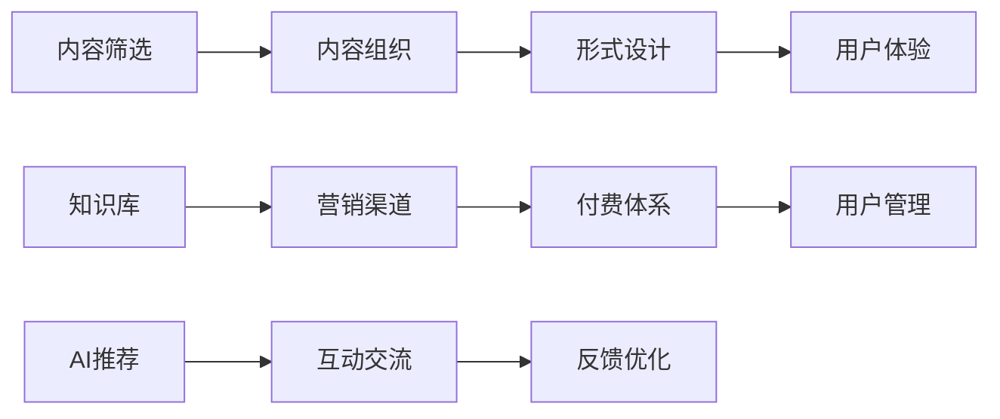

                 

# 知识付费创业的产品差异化策略

## 1. 背景介绍

随着知识付费市场的兴起，越来越多的创业公司涌入这一领域，希望能够借助知识付费模式实现快速增长和盈利。然而，激烈的市场竞争和用户需求的多样化，使得产品差异化成为知识付费创业成功的关键。本文将从背景、核心概念、算法原理、数学模型、项目实践、应用场景、工具资源、总结、展望、附录等多个方面全面阐述知识付费创业的产品差异化策略。

## 2. 核心概念与联系

### 2.1 核心概念概述

知识付费创业是指基于知识内容，通过付费订阅、单次购买等方式，提供高质量、有价值的知识产品或服务的商业模式。与传统互联网创业不同，知识付费创业更加注重内容质量和用户体验，需要构建独特的价值体系和差异化产品，以满足用户的多样化需求。

- **内容差异化**：通过精心筛选和组织知识内容，提供独家、深度、实用性的课程、文章、视频等，形成独特的知识体系。
- **形式差异化**：采用直播、录播、互动式、定制化等多种形式，提升知识内容的可接触性和参与度。
- **体验差异化**：通过友好的界面设计、便捷的支付体系、高效的客服响应等，提升用户体验，构建品牌忠诚度。

### 2.2 核心概念原理和架构的 Mermaid 流程图



这个流程图展示了知识付费创业的核心流程和组件，从内容选择到用户体验的各个环节都需要精心设计，以形成独特的价值链和产品差异化。

## 3. 核心算法原理 & 具体操作步骤

### 3.1 算法原理概述

知识付费创业的产品差异化策略主要基于用户需求分析、内容推荐、个性化体验等多个方面进行优化。其核心算法原理包括：

- **用户需求分析**：通过数据分析和调研，了解用户的学习目的、兴趣偏好、行为习惯等，形成用户画像。
- **内容推荐算法**：基于用户画像，推荐个性化的课程、文章、视频等，提升用户满意度。
- **个性化体验优化**：通过界面设计、交互方式、服务响应等，提升用户使用体验，增强品牌粘性。

### 3.2 算法步骤详解

1. **用户需求分析**
   - 数据收集：通过问卷调查、使用日志等手段，收集用户的学习目的、兴趣偏好、行为习惯等数据。
   - 数据清洗与处理：对收集到的数据进行清洗、去重、归一化等处理，以便后续分析。
   - 用户画像构建：基于清洗后的数据，构建用户画像，形成个性化推荐的基础。

2. **内容推荐算法**
   - 特征提取：从课程、文章、视频等多源内容中提取特征，如关键词、类别、难度等。
   - 相似度计算：基于用户画像，计算每个内容与用户的相似度。
   - 排序与推荐：根据相似度计算结果，对内容进行排序，推荐给用户。

3. **个性化体验优化**
   - UI/UX设计：设计友好的界面和流畅的交互方式，提升用户体验。
   - 即时反馈：通过即时聊天、邮件反馈等方式，及时响应用户需求，增强用户粘性。
   - 个性化定制：根据用户需求，提供定制化的课程和互动方式，满足用户多样化需求。

### 3.3 算法优缺点

#### 优点：
- **精准推荐**：通过用户画像和内容特征的匹配，提供精准的知识推荐，提升用户满意度。
- **个性化体验**：通过UI/UX设计和即时反馈，提升用户体验，增强用户粘性。
- **高效运营**：通过数据驱动的决策，优化资源配置，降低运营成本。

#### 缺点：
- **数据隐私**：用户数据的安全性和隐私保护需要严格管理。
- **算法复杂性**：推荐算法和个性化体验优化需要较高的技术门槛，对团队技术水平要求高。
- **市场竞争激烈**：知识付费市场竞争激烈，需要持续创新才能保持竞争力。

### 3.4 算法应用领域

知识付费创业的产品差异化策略主要应用于以下几个领域：

- **在线教育**：通过提供个性化课程、即时答疑等服务，提升用户学习效果。
- **职业培训**：提供实战技能培训、职业规划指导等，帮助用户提升职业技能。
- **知识分享**：通过付费形式，鼓励专家和学者分享深度知识，形成知识社区。
- **健康生活**：提供健康知识、心理辅导等服务，帮助用户改善生活质量。

## 4. 数学模型和公式 & 详细讲解 & 举例说明

### 4.1 数学模型构建

知识付费创业的产品差异化策略涉及多个数学模型，主要包括：

- **用户画像模型**：描述用户特征的数学模型，如聚类分析、主成分分析等。
- **内容特征模型**：描述内容属性的数学模型，如TF-IDF、词嵌入等。
- **推荐系统模型**：描述用户和内容交互的数学模型，如协同过滤、基于内容的推荐等。

### 4.2 公式推导过程

以协同过滤推荐系统为例，其基本公式如下：

$$
\text{Similarity}(u,v) = \frac{1}{\sqrt{\sum_i^n (x_{ui} - x_{vi})^2}} \cdot \frac{1}{\sqrt{\sum_i^n (x_{ui} - x_{vi})^2}}
$$

其中，$x_{ui}$ 和 $x_{vi}$ 分别表示用户 $u$ 和物品 $v$ 的特征向量。该公式计算用户 $u$ 和物品 $v$ 的相似度，用于推荐系统中的排序和推荐。

### 4.3 案例分析与讲解

假设有一个知识付费平台，收集了用户和课程的数据。通过对用户兴趣进行聚类分析，得到三个用户群体：A、B、C。然后，根据每个群体对课程的评分和浏览记录，计算课程与群体的相似度，并将相似度高的课程推荐给对应群体。

## 5. 项目实践：代码实例和详细解释说明

### 5.1 开发环境搭建

1. **环境安装**：安装Python、Flask等开发工具，搭建开发环境。
2. **数据准备**：收集用户数据和课程数据，进行数据清洗和预处理。
3. **模型训练**：使用聚类算法、协同过滤算法等，对数据进行建模。
4. **应用开发**：基于Flask等框架，开发知识推荐系统的前端页面和后端逻辑。

### 5.2 源代码详细实现

```python
import pandas as pd
from sklearn.cluster import KMeans
from scipy.spatial.distance import cosine

# 加载用户数据和课程数据
user_data = pd.read_csv('user_data.csv')
course_data = pd.read_csv('course_data.csv')

# 用户画像构建
user_features = user_data[['age', 'gender', 'education']]
kmeans = KMeans(n_clusters=3, random_state=42)
user_clusters = kmeans.fit_predict(user_features)

# 内容特征提取
course_features = course_data[['category', 'duration', 'rating']]
cosine_similarity = 1 - cosine(course_features, course_features)

# 推荐系统实现
def recommend(user_id, courses):
    user_cluster = user_clusters[user_id]
    user_course_sim = cosine_similarity[user_id]
    top_courses = sorted(user_course_sim, key=lambda x: x, reverse=True)[:10]
    return top_courses

# 实际应用
user_id = 123
top_courses = recommend(user_id, course_data)
```

### 5.3 代码解读与分析

这段代码实现了一个简单的知识推荐系统。首先，通过KMeans聚类算法构建用户画像，将用户分成三个群体。然后，计算课程与课程之间的相似度，使用协同过滤算法推荐给用户。通过这种基于相似度的推荐，可以提升用户满意度，实现产品差异化。

### 5.4 运行结果展示

运行以上代码，输出每个用户的前10个推荐课程。

## 6. 实际应用场景

### 6.1 在线教育

在线教育平台可以通过个性化推荐、智能答疑、课程定制等方式，提升用户学习体验，形成独特的竞争优势。例如，Coursera、Udacity等平台通过数据分析和算法优化，提供高质量的在线课程，满足不同用户的需求。

### 6.2 职业培训

职业培训平台可以提供定制化的技能培训课程，帮助用户提升职业技能，增强市场竞争力。例如，LinkedIn Learning通过专家讲座和实战项目，提供高价值的职业培训内容。

### 6.3 知识分享

知识分享平台可以吸引专家和学者分享深度知识，形成知识社区，提升用户获取知识的效率和质量。例如，Medium通过付费订阅和优质内容推荐，成为知识分享的领导平台。

### 6.4 健康生活

健康生活平台可以提供健康知识、心理辅导等服务，帮助用户改善生活质量。例如，Headspace通过冥想课程和心理疏导，帮助用户缓解压力，提升心理健康。

## 7. 工具和资源推荐

### 7.1 学习资源推荐

- **书籍推荐**：《推荐系统实战》、《深度学习与推荐系统》、《Python深度学习》。
- **在线课程**：Coursera《推荐系统》课程、Udacity《机器学习》课程、Kaggle《推荐系统》竞赛。
- **社区平台**：Kaggle、Stack Overflow、GitHub。

### 7.2 开发工具推荐

- **开发框架**：Flask、Django、React。
- **数据处理**：Pandas、Scikit-learn、NumPy。
- **机器学习**：TensorFlow、PyTorch、Scikit-learn。
- **服务器部署**：AWS、Google Cloud、Azure。

### 7.3 相关论文推荐

- **推荐系统**：《Adaptive Collaborative Filtering Using Matrix Factorization Techniques》。
- **个性化体验**：《Personalization via Recommendation Algorithms for an Online Education Platform》。
- **用户画像**：《User Profiling for Personalized Recommendation Systems》。

## 8. 总结：未来发展趋势与挑战

### 8.1 研究成果总结

知识付费创业的产品差异化策略需要通过用户需求分析、内容推荐、个性化体验等多个方面进行优化，以提升用户满意度，形成竞争优势。通过数据分析和算法优化，可以提供精准的知识推荐，提升用户粘性和品牌忠诚度。

### 8.2 未来发展趋势

1. **大数据与AI结合**：利用大数据分析和AI算法，实现更加精准的用户画像和内容推荐。
2. **多模态信息融合**：结合图像、视频等多模态信息，提升推荐系统的丰富性和准确性。
3. **个性化内容生成**：利用生成模型，如GAN、LSTM等，生成个性化课程、文章等内容，增强用户体验。
4. **实时互动与社交**：通过实时互动和社交功能，提升用户参与度和满意度。
5. **智能客服与支持**：利用NLP和机器学习技术，提供智能客服和支持，提升用户满意度。

### 8.3 面临的挑战

1. **数据隐私与安全**：用户数据的隐私和安全问题需要严格管理。
2. **技术门槛高**：推荐系统和个性化体验优化需要较高的技术门槛，对团队技术水平要求高。
3. **市场竞争激烈**：知识付费市场竞争激烈，需要持续创新才能保持竞争力。

### 8.4 研究展望

1. **智能推荐与个性化**：通过智能推荐算法，提升推荐系统的精准度和用户体验。
2. **多模态融合与交互**：结合图像、视频等多模态信息，提升推荐系统的丰富性和准确性。
3. **隐私保护与伦理**：加强数据隐私保护，确保推荐系统符合伦理规范。

## 9. 附录：常见问题与解答

**Q1: 知识付费创业的核心是什么？**

A: 知识付费创业的核心是通过高质量、有价值的内容，满足用户的学习需求，形成独特的价值体系和产品差异化。

**Q2: 如何构建用户画像？**

A: 通过数据分析和调研，了解用户的学习目的、兴趣偏好、行为习惯等，形成用户画像。

**Q3: 推荐系统有哪些常用算法？**

A: 协同过滤、基于内容的推荐、矩阵分解等。

**Q4: 如何提升个性化体验？**

A: 通过友好的界面设计、便捷的支付体系、高效的客服响应等，提升用户体验，增强品牌粘性。

**Q5: 未来知识付费创业的发展方向是什么？**

A: 利用大数据与AI结合、多模态信息融合、个性化内容生成、实时互动与社交、智能客服与支持等技术，提升推荐系统的精准度和用户体验，形成竞争优势。

作者：禅与计算机程序设计艺术 / Zen and the Art of Computer Programming

