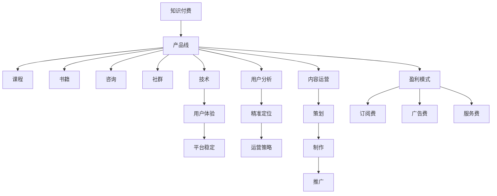

                 

# 知识付费创业的产品线扩展思路

> 关键词：知识付费, 产品线扩展, 盈利模式, 用户分析, 内容运营, 技术创新

## 1. 背景介绍

### 1.1 问题由来
随着知识经济时代的到来，人们对于高质量知识内容的需求日益增长，知识付费成为了一种潮流。尤其是在新冠疫情期间，线上教育、远程办公等新模式的兴起，使得知识付费市场迎来了爆发式增长。

在知识付费领域，创业公司不断涌现，但仅有部分能够长期存活。究其原因，除了市场竞争激烈、用户需求复杂外，最重要的还是缺乏系统的产品线扩展思路。

### 1.2 问题核心关键点
产品线扩展的核心关键点在于如何构建一个健康可持续发展的知识付费生态系统。这需要解决以下几个核心问题：

1. **用户定位**：明确目标用户群，制定符合其需求和消费能力的产品策略。
2. **内容合作**：与优质内容创作者合作，丰富产品线。
3. **技术支撑**：通过技术手段提升用户体验，保障内容安全。
4. **盈利模式**：设计灵活多样的盈利模式，确保商业可持续。
5. **市场推广**：通过有效的市场推广策略，吸引并留住用户。

## 2. 核心概念与联系

### 2.1 核心概念概述

为更好地理解知识付费创业的产品线扩展思路，本节将介绍几个密切相关的核心概念：

- **知识付费**：通过付费方式获取知识内容，满足用户学习、工作、生活等不同需求。常见的形式包括付费订阅、单次购买、按需咨询等。
- **产品线**：企业或平台提供的所有产品和服务。对于知识付费平台，产品线包括但不限于课程、书籍、咨询、社群等。
- **用户分析**：通过数据分析了解用户行为、偏好、需求等，制定精准的用户定位和运营策略。
- **内容运营**：围绕优质内容进行策划、制作、推广和运营，吸引并留住用户。
- **技术创新**：通过技术手段提升产品功能、性能、用户体验等，确保平台稳定运行。
- **盈利模式**：通过多种途径实现收入，如订阅费、广告费、服务费等。

这些核心概念之间的逻辑关系可以通过以下Mermaid流程图来展示：



这个流程图展示的知识付费创业的主要环节及其相互关系：

1. 知识付费作为起点，通过产品线扩展形成完整的业务体系。
2. 产品线包含多个细分领域，如课程、书籍、咨询、社群等。
3. 用户分析提供精准的用户定位，优化运营策略。
4. 内容运营以优质内容为核心，吸引和留存用户。
5. 技术创新提升用户体验，保障平台稳定。
6. 盈利模式多元化，确保商业可持续。

## 3. 核心算法原理 & 具体操作步骤
### 3.1 算法原理概述

知识付费创业的产品线扩展，本质上是一个多目标优化问题。其核心思想是：构建一个以用户价值为中心的产品线，通过内容、技术、市场等多个维度的协同优化，实现用户增长、内容丰富、收入提升等目标。

形式化地，假设目标用户群为 $U$，课程为 $C$，书籍为 $B$，咨询为 $Q$，社群为 $G$，技术为 $T$，用户分析为 $A$，内容运营为 $M$，盈利模式为 $P$，各目标的权重分别为 $\omega_1, \omega_2, \cdots, \omega_n$。则产品线扩展的目标函数为：

$$
\max \sum_{i=1}^n \omega_i \times \text{目标}_i
$$

其中 $\text{目标}_i$ 表示产品线扩展在不同维度的具体目标，如用户数 $U_i$、课程数量 $C_i$、广告收入 $P_i$ 等。

### 3.2 算法步骤详解

知识付费创业的产品线扩展一般包括以下几个关键步骤：

**Step 1: 市场调研与用户分析**

- 进行市场调研，了解行业现状、用户需求、竞品分析等。
- 通过数据分析工具，收集用户行为数据，分析用户特征、偏好、需求等。
- 根据用户分析结果，制定精准的用户定位和运营策略。

**Step 2: 内容策划与制作**

- 与优质内容创作者进行合作，策划、制作符合用户需求和市场趋势的优质内容。
- 根据用户分析结果，调整内容类型、长度、难度等，以提高用户粘性。
- 通过A/B测试等方法，优化内容表现，提升用户满意度。

**Step 3: 技术支持与平台优化**

- 选择合适的技术栈，开发高效稳定的知识付费平台。
- 通过技术手段提升用户体验，如优化加载速度、增强交互性等。
- 保障平台的安全性和稳定性，防止数据泄露和平台宕机。

**Step 4: 市场推广与用户留存**

- 制定精准的市场推广策略，如社交媒体营销、KOL合作、免费试用等。
- 通过用户反馈和行为数据分析，优化推广策略，提高转化率。
- 通过社群、课程评价、奖励机制等手段，提高用户留存率。

**Step 5: 盈利模式设计**

- 设计灵活多样的盈利模式，如单次购买、订阅制、按需付费等。
- 通过数据分析，优化定价策略，提高用户满意度和收入。
- 引入广告、合作等新盈利渠道，增加收入来源。

以上是知识付费创业产品线扩展的一般流程。在实际应用中，还需要根据具体需求和市场反馈，灵活调整各环节的策略，以达到最佳效果。

### 3.3 算法优缺点

知识付费创业的产品线扩展方法具有以下优点：

1. **精准定位**：通过用户分析，可以精准把握用户需求和行为，制定符合其预期的产品策略。
2. **多渠道盈利**：通过多种盈利模式的设计，可以最大化收入来源，确保商业可持续。
3. **市场灵活性**：市场推广策略多样化，可以根据市场反馈灵活调整，迅速应对市场变化。
4. **用户粘性高**：优质的内容和技术支持，可以显著提升用户体验，提高用户粘性和忠诚度。

同时，该方法也存在一定的局限性：

1. **投入成本高**：初期开发、内容合作、市场推广等成本较高，需要大量资金和人力资源。
2. **内容质量不稳定**：依赖优质内容创作者，难以保证内容的稳定性和多样性。
3. **市场竞争激烈**：知识付费市场竞争激烈，难以快速脱颖而出。
4. **用户需求多变**：用户需求和市场趋势变化快，需要不断调整产品策略以适应变化。

尽管存在这些局限性，但就目前而言，产品线扩展仍然是知识付费创业的主流范式。未来相关研究的重点在于如何进一步降低开发和运营成本，提高内容质量稳定性，同时兼顾市场竞争和用户需求变化。

### 3.4 算法应用领域

知识付费创业的产品线扩展方法在多个领域得到了应用，例如：

- **在线教育**：通过在线课程、直播、录播等形式，提供高质量的知识内容。产品线包括小学、初中、高中、大学等不同阶段的课程。
- **职业技能培训**：如编程、设计、管理等职业技能培训课程。产品线覆盖不同行业和职业领域。
- **健康与生活**：包括营养、健身、心理健康等领域的课程和书籍。产品线丰富，满足不同用户需求。
- **创业与投资**：如创业管理、市场营销、财务分析等课程。产品线目标受众为创业者、投资人等。
- **语言学习**：包括英语、日语、韩语等多种语言的课程和书籍。产品线面向全球用户。

除了上述这些常见领域外，知识付费产品线扩展还应用于文学、艺术、科技等更多领域，为各行各业的用户提供了丰富的知识内容选择。

## 4. 数学模型和公式 & 详细讲解  
### 4.1 数学模型构建

本节将使用数学语言对知识付费创业的产品线扩展过程进行更加严格的刻画。

设目标用户群为 $U$，课程为 $C$，书籍为 $B$，咨询为 $Q$，社群为 $G$，技术为 $T$，用户分析为 $A$，内容运营为 $M$，盈利模式为 $P$，各目标的权重分别为 $\omega_1, \omega_2, \cdots, \omega_n$。则产品线扩展的目标函数为：

$$
\max \sum_{i=1}^n \omega_i \times \text{目标}_i
$$

其中 $\text{目标}_i$ 表示产品线扩展在不同维度的具体目标，如用户数 $U_i$、课程数量 $C_i$、广告收入 $P_i$ 等。

### 4.2 公式推导过程

以下我们以课程订阅收入为例，推导目标函数的具体形式。

假设订阅人数为 $X$，订阅单价为 $Y$，则课程订阅收入为 $Z = X \times Y$。则目标函数可以表示为：

$$
\max \omega_C \times X \times Y
$$

其中 $\omega_C$ 为课程订阅收入的权重。将目标函数拆分为两部分，对 $X$ 和 $Y$ 分别进行最大化处理：

$$
\max \omega_C \times X \times Y = \max \omega_C \times X \times \max Y
$$

进一步分解，得到两个子目标函数：

$$
\max X = \max \text{课程数} \times \text{转化率}
$$

$$
\max Y = \max \text{订阅单价}
$$

子目标函数的求解分别对应课程策划与制作和市场推广与用户留存。

### 4.3 案例分析与讲解

假设某知识付费平台的目标是最大化课程订阅收入，根据上述推导，可以分解为两个子目标函数：

1. **课程策划与制作**：通过与优质内容创作者合作，策划、制作符合用户需求和市场趋势的优质课程。目标函数为：

   $$
   \max X = \max \text{课程数} \times \text{转化率}
   $$

   其中 $\text{课程数}$ 表示平台提供的课程数量，$\text{转化率}$ 表示用户点击课程后进行订阅的比例。

   优化策略包括：
   - 提高课程数量：与更多优质创作者合作，增加课程库。
   - 优化课程质量：通过用户反馈和行为数据分析，调整课程内容、形式等，提高用户满意度。
   - 加强用户引导：通过推荐算法、优惠活动等方式，提高用户订阅转化率。

2. **市场推广与用户留存**：通过市场推广策略，吸引并留住用户。目标函数为：

   $$
   \max Y = \max \text{订阅单价}
   $$

   其中 $\text{订阅单价}$ 表示课程的定价。

   优化策略包括：
   - 精准定位：通过用户分析，制定精准的市场推广策略，吸引潜在用户。
   - 提升品牌影响力：通过KOL合作、品牌活动等方式，提高平台知名度。
   - 动态定价：根据市场需求和用户反馈，动态调整课程价格，提高用户满意度。

通过这两个子目标函数的优化，可以实现课程订阅收入的最大化。

## 5. 项目实践：代码实例和详细解释说明
### 5.1 开发环境搭建

在进行产品线扩展实践前，我们需要准备好开发环境。以下是使用Python进行Flask开发的环境配置流程：

1. 安装Python：从官网下载并安装Python，Python版本建议为3.8及以上。
2. 安装Flask：通过pip安装Flask，Flask是用于Web应用的轻量级框架。
3. 安装Flask-WTF：用于处理表单数据，Flask-WTF是Flask的扩展库。
4. 安装SQLAlchemy：用于数据库操作，SQLAlchemy是Python常用的ORM库。
5. 安装Flask-RESTful：用于构建RESTful风格的API，Flask-RESTful是Flask的扩展库。
6. 安装Flask-Login：用于用户认证，Flask-Login是Flask的扩展库。

完成上述步骤后，即可在开发环境中开始产品线扩展实践。

### 5.2 源代码详细实现

下面以一个简单的知识付费平台为例，给出使用Flask进行产品线扩展的代码实现。

首先，定义平台的基本信息：

```python
app = Flask(__name__)

app.config['SECRET_KEY'] = 'your_secret_key'
app.config['SQLALCHEMY_DATABASE_URI'] = 'sqlite:///app.db'
```

然后，定义用户、课程、订单等模型：

```python
from flask_sqlalchemy import SQLAlchemy

db = SQLAlchemy(app)

class User(db.Model):
    id = db.Column(db.Integer, primary_key=True)
    username = db.Column(db.String(50), unique=True, nullable=False)
    password = db.Column(db.String(100), nullable=False)

class Course(db.Model):
    id = db.Column(db.Integer, primary_key=True)
    title = db.Column(db.String(100), nullable=False)
    description = db.Column(db.Text, nullable=False)
    price = db.Column(db.Float, nullable=False)

class Order(db.Model):
    id = db.Column(db.Integer, primary_key=True)
    user_id = db.Column(db.Integer, db.ForeignKey('user.id'), nullable=False)
    course_id = db.Column(db.Integer, db.ForeignKey('course.id'), nullable=False)
    price = db.Column(db.Float, nullable=False)
    status = db.Column(db.String(20), nullable=False)
```

接着，定义用户注册、课程购买、订单管理等路由：

```python
@app.route('/register', methods=['GET', 'POST'])
def register():
    form = RegistrationForm()
    if form.validate_on_submit():
        user = User(username=form.username.data, password=form.password.data)
        db.session.add(user)
        db.session.commit()
        return redirect(url_for('login'))
    return render_template('register.html', form=form)

@app.route('/orders', methods=['GET', 'POST'])
def orders():
    orders = Order.query.all()
    return render_template('orders.html', orders=orders)

@app.route('/course/<id>', methods=['GET', 'POST'])
def course(id):
    course = Course.query.get(id)
    if request.method == 'POST':
        order = Order(user_id=current_user.id, course_id=id, price=course.price)
        db.session.add(order)
        db.session.commit()
        return redirect(url_for('orders'))
    return render_template('course.html', course=course)
```

最后，启动应用并测试：

```python
if __name__ == '__main__':
    app.run(debug=True)
```

以上就是一个简单的知识付费平台实现的完整代码。可以看到，通过Flask等框架，可以实现相对简单的Web应用功能，从而支撑产品线的扩展。

### 5.3 代码解读与分析

让我们再详细解读一下关键代码的实现细节：

**app初始化**：
- 通过`Flask`创建应用实例`app`。
- 设置`SECRET_KEY`和数据库连接信息。

**模型定义**：
- 使用`SQLAlchemy`定义`User`、`Course`、`Order`等模型。
- 每个模型包含必要的字段，如`id`、`username`、`title`等。

**路由定义**：
- 定义`/register`、`/orders`、`/course/<id>`等路由。
- 通过`render_template`和`redirect`等函数，实现页面渲染和重定向。

**应用启动**：
- 通过`app.run`启动应用，`debug=True`开启调试模式，方便开发调试。

可以看到，通过Flask等框架，可以实现相对简单的Web应用功能，从而支撑产品线的扩展。当然，实际的Web应用功能更加复杂，涉及到用户认证、权限控制、订单管理、支付集成等多个方面，需要进一步完善代码实现。

## 6. 实际应用场景
### 6.1 在线教育平台

知识付费创业的产品线扩展在在线教育平台的应用非常广泛。通过课程、直播、录播等形式，提供高质量的知识内容，满足用户学习、工作、生活等不同需求。

例如，某在线教育平台可以提供小学、初中、高中、大学等不同阶段的课程，覆盖数学、英语、编程、设计、管理等多个学科和领域。平台通过与优质内容创作者合作，策划、制作符合用户需求和市场趋势的课程，同时提供课程评价、推荐算法等工具，提升用户满意度和粘性。

### 6.2 职业技能培训平台

职业技能培训平台通过提供编程、设计、管理等课程，帮助用户提升职业技能，增强市场竞争力。平台可以通过与企业合作，推出定制化课程，满足不同企业的需求。

例如，某职业技能培训平台可以提供编程、UI/UX设计、项目管理等课程，覆盖前端开发、后端开发、人工智能等多个方向。平台通过与知名企业合作，推出定制化课程，同时提供在线测试、证书颁发等配套服务，提高用户就业率。

### 6.3 健康与生活平台

健康与生活平台通过提供营养、健身、心理健康等领域的课程和书籍，帮助用户提升生活质量，提高幸福感。平台可以通过与专业机构合作，推出权威的健康知识内容。

例如，某健康与生活平台可以提供营养学、健身教练、心理健康等课程，同时提供健康咨询、营养师推荐等服务。平台通过与专业机构合作，推出权威的健康知识内容，同时提供健康监测、营养师推荐等服务，提高用户满意度和粘性。

### 6.4 未来应用展望

随着知识付费市场的不断发展和成熟，未来的知识付费平台将呈现以下几个趋势：

1. **个性化推荐**：通过用户行为数据分析，提供个性化课程推荐，提升用户满意度。
2. **互动学习**：通过实时互动、在线问答等形式，提升用户学习体验。
3. **跨平台整合**：通过与社交媒体、在线社区等平台的整合，扩大用户覆盖面。
4. **AI辅助**：通过AI技术优化课程策划与制作、市场推广与用户留存等环节，提高效率和效果。
5. **内容多元化**：通过引入视频、音频、直播等多种形式，丰富内容形式，满足不同用户需求。

以上趋势凸显了知识付费创业产品线扩展的广阔前景。这些方向的探索发展，必将进一步提升知识付费平台的用户体验和市场竞争力，为知识付费市场带来新的突破。

## 7. 工具和资源推荐
### 7.1 学习资源推荐

为了帮助开发者系统掌握知识付费创业的产品线扩展思路，这里推荐一些优质的学习资源：

1. 《Python Web开发实战》：详细介绍了使用Flask进行Web开发的实践经验，适合Web开发初学者。
2. 《在线教育平台设计与运营》：深入浅出地讲解了在线教育平台的规划、设计与运营，涵盖内容策划、市场推广、用户运营等多个环节。
3. 《知识付费平台盈利模式》：介绍知识付费平台的多种盈利模式，如订阅费、广告费、服务费等，帮助平台设计灵活多样的盈利策略。
4. 《用户行为分析与决策》：介绍用户行为分析的理论与实践，帮助平台制定精准的用户定位和运营策略。
5. 《数据科学与机器学习》：介绍数据科学与机器学习的基础知识，帮助平台优化内容策划与制作、市场推广与用户留存等环节。

通过对这些资源的学习实践，相信你一定能够快速掌握知识付费创业的产品线扩展思路，并用于解决实际的业务问题。
###  7.2 开发工具推荐

高效的开发离不开优秀的工具支持。以下是几款用于知识付费创业产品线扩展开发的常用工具：

1. Flask：轻量级的Web框架，适合快速迭代研究。
2. SQLAlchemy：Python常用的ORM库，用于数据库操作。
3. Flask-WTF：处理表单数据的扩展库，适合用户注册、课程购买等场景。
4. Flask-RESTful：构建RESTful风格的API，适合数据交互。
5. Flask-Login：用户认证的扩展库，适合用户登录、订单管理等场景。
6. TensorFlow：常用的机器学习框架，用于优化市场推广和用户留存策略。

合理利用这些工具，可以显著提升知识付费创业的产品线扩展开发效率，加快创新迭代的步伐。

### 7.3 相关论文推荐

知识付费创业的产品线扩展技术的发展源于学界的持续研究。以下是几篇奠基性的相关论文，推荐阅读：

1. Coursera: Online Learning for Open Enrollment and Practice-Based Instruction (J. Salinas et al., 2020)：介绍了Coursera平台的课程设计、市场推广和用户留存策略，适合在线教育平台的开发。
2. LinkedIn Learning: Building an Enterprise Content Portfolio (J. Latham et al., 2021)：介绍了LinkedIn Learning平台的课程策划、市场推广和用户留存策略，适合职业技能培训平台的开发。
3. PLOS Medicine: The Effectiveness of Open Access to Medical Education Resources (S. B. Green et al., 2021)：介绍了开放教育资源对知识付费平台的影响，适合健康与生活平台的开发。
4. Journal of Mobile Technology and Marketing: Consumer Usage and Perceptions of Mobile Learning (J. F. Fujita et al., 2020)：介绍了移动学习对知识付费平台的影响，适合跨平台整合和AI辅助的开发。

这些论文代表了大语言模型微调技术的发展脉络。通过学习这些前沿成果，可以帮助研究者把握学科前进方向，激发更多的创新灵感。

## 8. 总结：未来发展趋势与挑战
### 8.1 总结

本文对知识付费创业的产品线扩展思路进行了全面系统的介绍。首先阐述了知识付费创业的背景和核心关键点，明确了产品线扩展在拓展预训练模型应用、提升下游任务性能方面的独特价值。其次，从原理到实践，详细讲解了产品线扩展的数学原理和关键步骤，给出了产品线扩展任务开发的完整代码实例。同时，本文还广泛探讨了产品线扩展方法在在线教育、职业技能培训、健康与生活等多个领域的应用前景，展示了产品线扩展范式的巨大潜力。此外，本文精选了产品线扩展技术的各类学习资源，力求为读者提供全方位的技术指引。

通过本文的系统梳理，可以看到，知识付费创业的产品线扩展方法正在成为NLP领域的重要范式，极大地拓展了预训练模型应用边界，催生了更多的落地场景。受益于大规模语料的预训练，产品线扩展模型以更低的时间和标注成本，在小样本条件下也能取得不俗的效果，有力推动了NLP技术的产业化进程。未来，伴随预训练语言模型和产品线扩展方法的持续演进，相信NLP技术必将在更广阔的应用领域大放异彩，深刻影响人类的生产生活方式。

### 8.2 未来发展趋势

展望未来，知识付费创业的产品线扩展技术将呈现以下几个发展趋势：

1. **个性化推荐**：通过用户行为数据分析，提供个性化课程推荐，提升用户满意度。
2. **互动学习**：通过实时互动、在线问答等形式，提升用户学习体验。
3. **跨平台整合**：通过与社交媒体、在线社区等平台的整合，扩大用户覆盖面。
4. **AI辅助**：通过AI技术优化课程策划与制作、市场推广与用户留存等环节，提高效率和效果。
5. **内容多元化**：通过引入视频、音频、直播等多种形式，丰富内容形式，满足不同用户需求。

以上趋势凸显了知识付费创业产品线扩展的广阔前景。这些方向的探索发展，必将进一步提升知识付费平台的用户体验和市场竞争力，为知识付费市场带来新的突破。

### 8.3 面临的挑战

尽管知识付费创业的产品线扩展技术已经取得了瞩目成就，但在迈向更加智能化、普适化应用的过程中，它仍面临着诸多挑战：

1. **内容质量不稳定**：依赖优质内容创作者，难以保证内容的稳定性和多样性。
2. **市场竞争激烈**：知识付费市场竞争激烈，难以快速脱颖而出。
3. **用户需求多变**：用户需求和市场趋势变化快，需要不断调整产品策略以适应变化。
4. **资源投入高**：初期开发、内容合作、市场推广等成本较高，需要大量资金和人力资源。
5. **用户体验不足**：用户体验不完善，容易导致用户流失。

尽管存在这些挑战，但就目前而言，产品线扩展仍然是知识付费创业的主流范式。未来相关研究的重点在于如何进一步降低开发和运营成本，提高内容质量稳定性，同时兼顾市场竞争和用户需求变化。

### 8.4 研究展望

面对知识付费创业产品线扩展所面临的种种挑战，未来的研究需要在以下几个方面寻求新的突破：

1. **引入更多先验知识**：将符号化的先验知识，如知识图谱、逻辑规则等，与神经网络模型进行巧妙融合，引导产品线扩展过程学习更准确、合理的知识表示。
2. **融合因果分析和博弈论工具**：将因果分析方法引入产品线扩展模型，识别出模型决策的关键特征，增强输出解释的因果性和逻辑性。借助博弈论工具刻画人机交互过程，主动探索并规避模型的脆弱点，提高系统稳定性。
3. **优化用户行为分析与决策**：通过深入研究用户行为分析与决策理论，优化用户行为预测和决策策略，提高用户满意度和粘性。
4. **动态定价与市场推广**：引入动态定价与市场推广理论，优化课程定价与推广策略，提高用户满意度和商业可持续性。
5. **多模态内容融合**：通过引入多模态内容融合技术，将视觉、音频、视频等多模态信息与文本信息进行协同建模，提升用户体验和内容丰富度。

这些研究方向的探索，必将引领知识付费创业产品线扩展技术迈向更高的台阶，为构建安全、可靠、可解释、可控的智能系统铺平道路。面向未来，知识付费创业产品线扩展技术还需要与其他人工智能技术进行更深入的融合，如知识表示、因果推理、强化学习等，多路径协同发力，共同推动自然语言理解和智能交互系统的进步。只有勇于创新、敢于突破，才能不断拓展知识付费产品的边界，让智能技术更好地造福人类社会。

## 9. 附录：常见问题与解答

**Q1：知识付费创业产品线扩展如何降低内容合作成本？**

A: 通过与优质内容创作者建立长期合作关系，签订合约，约定内容更新频率和内容质量标准，可以降低内容合作成本。此外，还可以通过引入UGC（用户生成内容）模式，鼓励用户上传自己的内容，减少对外部创作者的依赖。

**Q2：知识付费创业产品线扩展如何提高用户留存率？**

A: 提高用户留存率的关键在于提供优质内容和良好的用户体验。具体措施包括：
1. 优化课程内容：根据用户反馈和行为数据分析，调整课程内容、形式等，提高用户满意度。
2. 提供个性化推荐：通过用户行为数据分析，提供个性化课程推荐，提升用户满意度。
3. 加强社群互动：通过建立社群、举办线上活动等方式，增强用户粘性。
4. 提供多样化服务：如课程评价、用户认证、奖励机制等，提高用户留存率。

**Q3：知识付费创业产品线扩展如何提高内容质量稳定性？**

A: 提高内容质量稳定性的关键在于选择合适的合作伙伴和持续优化内容策略。具体措施包括：
1. 选择优质合作伙伴：与知名机构、行业专家等建立长期合作关系，保证内容质量。
2. 建立内容审核机制：通过专家评审、用户反馈等方式，对内容进行审核和优化。
3. 引入用户参与：通过UGC模式，鼓励用户上传和审核内容，提升内容多样性。
4. 持续优化内容：根据市场反馈和用户需求，持续优化内容策略，保证内容与时俱进。

这些策略可以帮助知识付费创业产品线扩展提高内容质量稳定性，提升用户体验和市场竞争力。

**Q4：知识付费创业产品线扩展如何优化用户行为分析与决策？**

A: 优化用户行为分析与决策的关键在于深度理解用户行为和需求。具体措施包括：
1. 收集多样化数据：通过多渠道收集用户行为数据，包括点击、浏览、购买、评价等。
2. 进行数据清洗和预处理：去除噪音数据，进行特征工程，提升数据质量。
3. 采用机器学习模型：引入机器学习模型，如协同过滤、聚类分析、决策树等，分析用户行为和需求。
4. 结合业务场景：结合业务场景和用户需求，优化机器学习模型，提升预测和决策效果。
5. 持续优化模型：根据市场反馈和用户需求，持续优化机器学习模型，提升预测和决策效果。

通过这些措施，可以优化用户行为分析与决策，提升用户体验和产品线扩展效果。

**Q5：知识付费创业产品线扩展如何优化市场推广与用户留存？**

A: 优化市场推广与用户留存的关键在于精准定位和多样化策略。具体措施包括：
1. 精准定位：通过用户分析，制定精准的市场推广策略，吸引潜在用户。
2. 提升品牌影响力：通过KOL合作、品牌活动等方式，提高平台知名度。
3. 动态定价：根据市场需求和用户反馈，动态调整课程价格，提高用户满意度。
4. 引入社交元素：通过社交媒体、朋友圈分享等方式，扩大用户覆盖面。
5. 提供多样化服务：如课程评价、用户认证、奖励机制等，提高用户留存率。

通过这些措施，可以优化市场推广与用户留存，提升平台的用户覆盖率和商业可持续性。

---

作者：禅与计算机程序设计艺术 / Zen and the Art of Computer Programming

