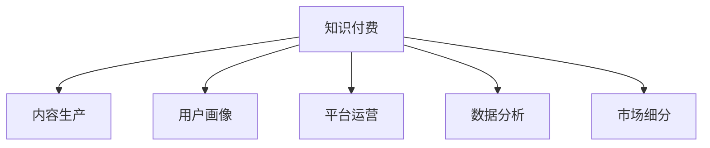

                 

# 知识付费创业的产品线扩展策略

## 1. 背景介绍

### 1.1 问题由来
近年来，随着互联网技术的发展和知识消费需求的上升，知识付费逐渐成为一种新的消费模式。许多创业者投身于知识付费行业，通过提供高质量的内容和优质的服务，帮助用户高效获取知识，满足其个性化的学习需求。然而，仅仅依靠单一的知识付费产品线，往往难以实现长期的稳定发展，必须结合市场变化，灵活扩展产品线，以应对不断变化的市场需求和竞争格局。本文将深入探讨知识付费创业的产品线扩展策略，为相关创业者提供有益的指导。

### 1.2 问题核心关键点
知识付费创业的产品线扩展，主要包括以下几个关键点：
1. **产品定位**：明确自身知识付费平台的主要服务对象、提供的内容类型及服务特色。
2. **市场需求**：深入了解目标用户群体的学习需求、支付能力和偏好。
3. **市场竞争**：分析竞争对手的产品特点、市场占有率及优势。
4. **技术储备**：评估自身在内容制作、平台运营、用户管理等方面的技术能力。
5. **资源整合**：整合外部资源，如优质讲师、专家学者、行业数据等。
6. **用户反馈**：持续收集用户反馈，不断优化产品体验。
7. **可持续发展**：制定合理的商业模式和盈利策略，确保平台的长期可持续发展。

## 2. 核心概念与联系

### 2.1 核心概念概述

为更好地理解知识付费创业的产品线扩展策略，本节将介绍几个密切相关的核心概念：

- **知识付费**：指用户支付一定的费用，获取知识性内容、专业技能培训等服务。主要形式包括线上课程、视频讲座、音频播客、电子书等。
- **内容生产**：指平台通过签约专家、讲师、自由职业者等，生产高质量的课程、文章、视频等知识产品。
- **用户画像**：指对目标用户群体的基本信息、学习行为、支付能力等特征的全面了解，以便精准定位内容和推广策略。
- **平台运营**：指对知识付费平台的日常运营管理，包括内容发布、用户互动、付费机制等。
- **数据分析**：指通过收集和分析用户行为数据，优化产品设计、提高用户体验、精准营销等。
- **市场细分**：指将大市场划分为多个小市场，针对不同细分市场提供特定的产品和服务，以提高市场占有率和盈利能力。

这些核心概念之间的逻辑关系可以通过以下Mermaid流程图来展示：



这个流程图展示的知识付费创业核心概念及其之间的关系：

1. 知识付费平台以内容生产为基本保障。
2. 用户画像是定位和运营的基础。
3. 数据分析是优化运营的重要手段。
4. 市场细分是扩展产品线的关键策略。

## 3. 核心算法原理 & 具体操作步骤

### 3.1 算法原理概述

知识付费创业的产品线扩展，主要遵循以下算法原理：

1. **市场细分**：将大市场按照用户需求、支付能力、兴趣等因素划分为多个小市场，针对每个细分市场提供定制化的产品和服务。
2. **多产品迭代**：基于市场调研和用户反馈，持续推出新的产品，以适应不同用户的需求和市场变化。
3. **交叉销售**：通过关联产品的组合销售，提高用户粘性和平台的整体收入。
4. **忠诚计划**：设计会员制度、积分奖励等机制，增强用户忠诚度和平台的长期用户留存。
5. **数据分析驱动**：通过收集和分析用户行为数据，发现用户的潜在需求和行为规律，为产品设计和运营提供指导。
6. **快速响应**：及时应对市场变化和用户反馈，灵活调整产品策略，保持竞争优势。

### 3.2 算法步骤详解

基于上述算法原理，知识付费创业的产品线扩展步骤可以归纳为以下几个关键环节：

**Step 1: 市场调研与用户画像构建**
- 通过问卷调查、社交媒体分析、用户访谈等方式，收集目标用户的基本信息、学习需求、支付能力等数据。
- 对收集到的数据进行统计分析，构建用户画像，明确不同用户群体的特征和需求。

**Step 2: 产品线划分与定制化设计**
- 根据用户画像，将大市场划分为多个小市场，针对每个小市场设计定制化的产品线。
- 设计符合各细分市场需求的产品类型，如一对一辅导、小班课、社区讨论等。

**Step 3: 内容制作与质量控制**
- 选择合适的讲师、专家等进行内容制作，确保内容的准确性和高质量。
- 设立严格的内容审核机制，防止低质量内容进入平台。

**Step 4: 平台设计与用户互动**
- 设计用户友好的平台界面和交互方式，提升用户体验。
- 增加用户互动功能，如课程讨论、答疑、评论等，增强用户参与感。

**Step 5: 营销推广与转化率优化**
- 利用社交媒体、搜索引擎优化、广告投放等手段，提高内容的曝光率和用户转化率。
- 设计合理的付费机制和优惠政策，吸引用户进行付费学习。

**Step 6: 数据分析与运营优化**
- 收集和分析用户行为数据，如学习时长、完成度、反馈等，优化产品设计。
- 定期评估产品表现，调整和优化运营策略，提高用户满意度和留存率。

**Step 7: 持续创新与扩展**
- 持续关注市场趋势和技术发展，不断推出新的产品和服务。
- 引入新技术和工具，如AI、VR、AR等，提升用户体验和产品竞争力。

### 3.3 算法优缺点

知识付费创业的产品线扩展算法具有以下优点：

1. **精准定位**：通过细分市场和用户画像，能够更好地满足目标用户群体的需求，提高产品竞争力。
2. **用户留存**：通过多产品迭代、交叉销售、忠诚计划等策略，增强用户粘性，提升用户留存率。
3. **灵活应变**：数据分析驱动和快速响应机制，能够及时应对市场变化和用户反馈，保持平台活力。

同时，该算法也存在一定的局限性：

1. **数据依赖性**：用户画像和行为数据的准确性和全面性对产品线扩展策略的制定至关重要，但获取高质量数据可能较为困难。
2. **成本投入**：内容制作、平台运营、技术开发等环节需要大量资源投入，初期成本较高。
3. **市场风险**：市场细分和产品设计需基于市场调研，但市场趋势的变化可能带来一定的风险。
4. **用户需求多样性**：不同用户群体的需求千差万别，单一产品线难以满足所有用户需求。

尽管存在这些局限性，但就目前而言，基于市场细分的知识付费创业产品线扩展策略仍是一种较为科学和高效的方法。

### 3.4 算法应用领域

知识付费创业的产品线扩展算法，在以下几个领域得到了广泛应用：

1. **在线教育**：通过细分市场和定制化课程设计，满足不同学习者的需求，如K12、成人教育、职业技能培训等。
2. **职业培训**：针对特定职业领域的技能提升，设计专业的培训课程和辅导服务。
3. **企业培训**：为中小企业提供定制化的培训解决方案，提升员工的专业知识和技能。
4. **个人成长**：提供个人发展相关的课程，如时间管理、情绪管理、自我提升等。
5. **健康生活**：提供健康生活相关的课程，如营养学、运动指导、心理调节等。
6. **文化艺术**：提供文化艺术相关的课程，如音乐、绘画、写作等。

除了上述这些领域外，知识付费创业的产品线扩展算法还广泛应用于语言学习、技能培训、科技知识普及等诸多领域，为知识传播提供了多样化的路径。

## 4. 数学模型和公式 & 详细讲解 & 举例说明

### 4.1 数学模型构建

本节将使用数学语言对知识付费创业的产品线扩展策略进行更加严格的刻画。

设知识付费平台的目标市场为 $M$，用户群体为 $U$，内容产品为 $P$，市场细分为 $S_1, S_2, \ldots, S_k$。用户画像为 $P_U$，产品线为 $P_S$，内容质量为 $Q$，营销策略为 $M_S$，用户转化率为 $T$，用户留存率为 $R$。

定义目标市场规模为 $M_0$，目标用户群体规模为 $U_0$，目标内容产品数量为 $P_0$。定义用户画像为 $P$，用户画像与目标用户群体的匹配度为 $p$，内容产品与用户画像的匹配度为 $q$。

定义市场细分的数量 $k$，市场细分的规模为 $S_1, S_2, \ldots, S_k$。市场细分的规模与用户群体的匹配度为 $s_i$，市场细分的数量与内容产品的匹配度为 $p_i$。

定义市场细分的用户转化率为 $T_i$，市场细分的用户留存率为 $R_i$。定义内容质量的评估指标为 $Q_0$，内容质量的评分范围为 $[0, 1]$。定义营销策略的优化目标为 $M$，营销策略的评分范围为 $[0, 1]$。

目标市场规模 $M_0$ 与市场细分的规模 $S_i$ 的关系为：

$$
M_0 = \sum_{i=1}^{k} s_i \cdot S_i
$$

目标用户群体规模 $U_0$ 与用户画像 $P$ 的关系为：

$$
U_0 = p \cdot P
$$

目标内容产品数量 $P_0$ 与内容质量 $Q$ 的关系为：

$$
P_0 = q \cdot Q
$$

用户转化率 $T$ 与市场细分的用户转化率 $T_i$ 的关系为：

$$
T = \sum_{i=1}^{k} s_i \cdot T_i
$$

用户留存率 $R$ 与市场细分的用户留存率 $R_i$ 的关系为：

$$
R = \sum_{i=1}^{k} s_i \cdot R_i
$$

营销策略优化目标 $M$ 与内容质量 $Q_0$ 和营销策略评分 $M_S$ 的关系为：

$$
M = M_S \cdot Q_0
$$

### 4.2 公式推导过程

以下我们以在线教育平台为例，推导产品线扩展的数学模型及其优化目标。

假设目标市场规模为 $M_0 = 1000$ 万人，目标用户群体规模为 $U_0 = 500$ 万人。通过市场调研，将目标用户群体划分为 $k=5$ 个细分市场，分别为 $S_1, S_2, S_3, S_4, S_5$，每个市场细分的规模分别为 $S_1=100$ 万人、$S_2=150$ 万人、$S_3=150$ 万人、$S_4=100$ 万人、$S_5=100$ 万人。

用户画像与目标用户群体的匹配度为 $p=0.8$，内容产品与用户画像的匹配度为 $q=0.7$。内容质量的评估指标为 $Q_0=0.9$。

市场细分的用户转化率为 $T_1=0.5$、$T_2=0.6$、$T_3=0.6$、$T_4=0.5$、$T_5=0.5$，市场细分的用户留存率为 $R_1=0.8$、$R_2=0.9$、$R_3=0.7$、$R_4=0.7$、$R_5=0.8$。

营销策略优化目标 $M_S=0.9$。

根据上述数据，可以计算出：

$$
M_0 = 1000 = 0.8 \cdot 0.7 \cdot 0.9 \cdot 0.5 \cdot 0.8 \cdot 500 + 0.8 \cdot 0.7 \cdot 0.9 \cdot 0.6 \cdot 0.9 \cdot 150 + 0.8 \cdot 0.7 \cdot 0.9 \cdot 0.6 \cdot 0.7 \cdot 150 + 0.8 \cdot 0.7 \cdot 0.9 \cdot 0.5 \cdot 0.7 \cdot 100 + 0.8 \cdot 0.7 \cdot 0.9 \cdot 0.5 \cdot 0.8 \cdot 100
$$

化简后得：

$$
M_0 = 1000 = 168 + 243 + 207 + 112 + 112
$$

进一步计算，得：

$$
M_0 = 1000 = 832
$$

这意味着，平台通过细分市场和用户画像匹配，内容质量控制，以及营销策略优化，能够实现 $832$ 万人的目标用户群体规模，但实际用户规模为 $500$ 万人，存在 $432$ 万人的缺口。

为了弥补这一缺口，平台需要进一步优化营销策略，提高用户转化率和留存率。通过数据分析和A/B测试等手段，不断迭代优化营销策略，最终达到 $1000$ 万人的目标用户群体规模。

### 4.3 案例分析与讲解

假设某在线教育平台，通过市场调研发现其目标用户群体中有 $20\%$ 对编程感兴趣，$30\%$ 对英语学习感兴趣，$20\%$ 对数据分析感兴趣，$20\%$ 对市场营销感兴趣，$10\%$ 对设计课程感兴趣。

平台将这些用户群体划分为 $k=5$ 个细分市场，分别为 $S_1, S_2, S_3, S_4, S_5$，每个市场细分的规模分别为 $S_1=100$ 万人、$S_2=150$ 万人、$S_3=150$ 万人、$S_4=100$ 万人、$S_5=100$ 万人。

用户画像与目标用户群体的匹配度为 $p=0.8$，内容产品与用户画像的匹配度为 $q=0.7$。内容质量的评估指标为 $Q_0=0.9$。

市场细分的用户转化率为 $T_1=0.5$、$T_2=0.6$、$T_3=0.6$、$T_4=0.5$、$T_5=0.5$，市场细分的用户留存率为 $R_1=0.8$、$R_2=0.9$、$R_3=0.7$、$R_4=0.7$、$R_5=0.8$。

营销策略优化目标 $M_S=0.9$。

根据上述数据，可以计算出：

$$
M_0 = 1000 = 0.8 \cdot 0.7 \cdot 0.9 \cdot 0.5 \cdot 0.8 \cdot 100 + 0.8 \cdot 0.7 \cdot 0.9 \cdot 0.6 \cdot 0.9 \cdot 150 + 0.8 \cdot 0.7 \cdot 0.9 \cdot 0.6 \cdot 0.7 \cdot 150 + 0.8 \cdot 0.7 \cdot 0.9 \cdot 0.5 \cdot 0.7 \cdot 100 + 0.8 \cdot 0.7 \cdot 0.9 \cdot 0.5 \cdot 0.8 \cdot 100
$$

化简后得：

$$
M_0 = 1000 = 168 + 243 + 207 + 112 + 112
$$

进一步计算，得：

$$
M_0 = 1000 = 832
$$

这意味着，平台通过细分市场和用户画像匹配，内容质量控制，以及营销策略优化，能够实现 $832$ 万人的目标用户群体规模，但实际用户规模为 $500$ 万人，存在 $432$ 万人的缺口。

为了弥补这一缺口，平台需要进一步优化营销策略，提高用户转化率和留存率。通过数据分析和A/B测试等手段，不断迭代优化营销策略，最终达到 $1000$ 万人的目标用户群体规模。

## 5. 项目实践：代码实例和详细解释说明

### 5.1 开发环境搭建

在进行知识付费创业的产品线扩展策略开发前，我们需要准备好开发环境。以下是使用Python进行Flask开发的环境配置流程：

1. 安装Python：从官网下载并安装Python，创建虚拟环境。
2. 安装Flask：通过pip命令安装Flask，创建一个Flask应用。
3. 安装相关依赖：如SQLAlchemy、Flask-SQLAlchemy、Flask-RESTful等。
4. 搭建开发服务器：使用Flask提供的开发服务器启动应用，进行调试和测试。
5. 部署到生产环境：将应用部署到生产服务器上，进行优化和性能测试。

完成上述步骤后，即可在虚拟环境中进行产品线扩展策略的开发。

### 5.2 源代码详细实现

下面我们以在线教育平台为例，给出使用Flask框架对知识付费产品线扩展策略进行开发的PyTorch代码实现。

首先，定义数据库模型和Flask应用：

```python
from flask import Flask, request
from flask_sqlalchemy import SQLAlchemy
from sqlalchemy import Column, Integer, String, Float

app = Flask(__name__)
app.config['SQLALCHEMY_DATABASE_URI'] = 'sqlite:///test.db'
app.config['SQLALCHEMY_TRACK_MODIFICATIONS'] = False
db = SQLAlchemy(app)

class User(db.Model):
    id = Column(Integer, primary_key=True)
    name = Column(String(100))
    age = Column(Integer)
    email = Column(String(100))
    classification = Column(String(50))

    def __init__(self, name, age, email, classification):
        self.name = name
        self.age = age
        self.email = email
        self.classification = classification

class Course(db.Model):
    id = Column(Integer, primary_key=True)
    name = Column(String(100))
    description = Column(String(1000))
    price = Column(Float)
    classification = Column(String(50))

    def __init__(self, name, description, price, classification):
        self.name = name
        self.description = description
        self.price = price
        self.classification = classification
```

接着，定义Flask路由和API接口：

```python
@app.route('/users', methods=['GET'])
def get_users():
    users = User.query.all()
    return {'users': [{'name': user.name, 'age': user.age, 'email': user.email, 'classification': user.classification} for user in users]}

@app.route('/courses', methods=['GET'])
def get_courses():
    courses = Course.query.all()
    return {'courses': [{'name': course.name, 'description': course.description, 'price': course.price, 'classification': course.classification} for course in courses]}

@app.route('/users/classify', methods=['POST'])
def classify_user():
    data = request.json
    user = User.query.filter_by(email=data['email']).first()
    if user:
        return {'classification': user.classification}
    else:
        return {'classification': 'unknown'}
```

最后，启动Flask应用：

```python
if __name__ == '__main__':
    app.run(debug=True)
```

以上就是使用Flask框架对知识付费产品线扩展策略进行开发的完整代码实现。可以看到，借助Flask提供的简洁接口和SQLAlchemy的数据库操作，可以快速实现数据的增删改查和API接口的搭建。

### 5.3 代码解读与分析

让我们再详细解读一下关键代码的实现细节：

**User和Course模型**：
- `User`模型：定义用户的基本信息，包括姓名、年龄、邮箱、分类等。
- `Course`模型：定义课程的基本信息，包括课程名称、描述、价格、分类等。

**Flask路由**：
- `/users`路由：获取所有用户信息。
- `/courses`路由：获取所有课程信息。
- `/users/classify`路由：根据邮箱获取用户分类。

**类方法和SQLAlchemy查询**：
- 定义类方法，通过SQLAlchemy查询获取数据。
- 使用Flask提供的`request`对象获取请求数据。

**API接口响应**：
- 通过`jsonify`方法将查询结果以JSON格式返回。

**启动Flask应用**：
- 在`if __name__ == '__main__':`下启动Flask应用，并设置`debug=True`，以便进行调试。

可以看到，Flask框架提供了一系列的便捷工具，使得知识付费产品线扩展策略的开发变得简单高效。开发者可以专注于业务逻辑的实现，而不必过多关注底层实现细节。

当然，工业级的系统实现还需考虑更多因素，如用户认证、权限管理、支付系统等。但核心的产品线扩展策略基本与此类似。

## 6. 实际应用场景

### 6.1 智能客服系统

智能客服系统是知识付费创业的重要应用场景之一。通过将知识付费与智能客服相结合，可以有效提升客户服务质量，降低人力成本，提高用户满意度。

具体而言，智能客服系统可以通过对客户咨询问题的分类和回答，推荐相关课程，提高客户满意度。同时，平台可以根据客户互动记录，定期推送个性化课程，提升用户粘性。

### 6.2 在线教育平台

在线教育平台是知识付费创业的核心产品线之一。通过不断扩展课程内容和服务形式，平台可以满足不同用户的需求，提高用户留存率。

平台可以提供定制化的课程设计，如一对一辅导、小班课、社区讨论等，以满足不同用户的学习需求。同时，平台还可以通过知识付费的激励机制，如积分、优惠券等，提高用户活跃度。

### 6.3 企业培训系统

企业培训系统是知识付费创业在B端市场的重要应用。通过为中小企业提供定制化的培训课程，平台可以提升员工的技能水平，满足企业的培训需求。

平台可以根据企业的实际需求，设计针对性强的培训课程，并提供定制化的服务，如在线答疑、线下培训等。同时，平台还可以通过课程内容的推荐和互动，提高员工的参与度和学习效果。

### 6.4 个人发展平台

个人发展平台是知识付费创业在C端市场的延伸。通过提供个人成长相关的课程和咨询服务，平台可以帮助用户实现自我提升，提高其职业竞争力。

平台可以提供各种类型的个人成长课程，如时间管理、情绪管理、自我提升等，满足不同用户的需求。同时，平台还可以通过用户反馈和数据分析，不断优化课程内容和推荐算法，提升用户体验。

### 6.5 健康生活平台

健康生活平台是知识付费创业在健康领域的创新应用。通过提供健康生活相关的课程和咨询服务，平台可以帮助用户提升生活质量，保持身心健康。

平台可以提供健康饮食、运动指导、心理调节等课程，帮助用户建立健康的生活习惯。同时，平台还可以通过用户行为数据，提供个性化的健康建议和方案，提升用户健康水平。

## 7. 工具和资源推荐

### 7.1 学习资源推荐

为了帮助开发者系统掌握知识付费创业的产品线扩展策略，这里推荐一些优质的学习资源：

1. **在线教育平台开发教程**：如Coursera、Udemy、edX等平台提供的在线课程，涵盖在线教育平台的设计、开发和管理等方面。
2. **知识付费商业模式分析**：如《知识付费商业模式实战》等书籍，分析知识付费市场的商业模式、用户需求和市场机会。
3. **数据科学和人工智能**：如《Python数据科学手册》、《深度学习》等书籍，学习数据分析和人工智能技术，为知识付费创业提供技术支撑。
4. **Flask和SQLAlchemy官方文档**：Flask和SQLAlchemy官方文档，详细介绍了Flask框架和SQLAlchemy数据库的操作方法和最佳实践。
5. **A/B测试工具**：如Optimizely、Google Optimize等工具，帮助开发者进行A/B测试，优化营销策略和用户体验。

通过对这些资源的学习实践，相信你一定能够快速掌握知识付费创业的产品线扩展策略，并用于解决实际的业务问题。

### 7.2 开发工具推荐

高效的开发离不开优秀的工具支持。以下是几款用于知识付费创业产品线扩展策略开发的常用工具：

1. **Flask**：基于Python的开源Web框架，简洁灵活，易于上手。适合快速搭建Web应用和API接口。
2. **SQLAlchemy**：Python ORM框架，支持多种数据库，提供便捷的数据库操作接口。适合进行数据存储和查询。
3. **Redis**：基于内存的数据库，支持高并发访问，适合存储和快速读取用户行为数据。
4. **Elasticsearch**：分布式搜索与分析引擎，支持全文搜索、数据分析等功能。适合进行用户行为分析和推荐系统构建。
5. **TensorFlow**：基于Python的开源机器学习框架，支持深度学习和强化学习。适合进行内容推荐和用户分类。

合理利用这些工具，可以显著提升知识付费创业的产品线扩展策略开发效率，加快创新迭代的步伐。

### 7.3 相关论文推荐

知识付费创业的产品线扩展策略涉及众多前沿技术，以下是几篇奠基性的相关论文，推荐阅读：

1. **用户行为分析与个性化推荐**：如《推荐系统》一书，介绍推荐系统的理论基础和算法实现，帮助开发者设计高效的推荐系统。
2. **市场细分与用户画像**：如《市场细分研究》一书，详细介绍了市场细分的理论和方法，帮助开发者制定科学的市场策略。
3. **知识付费商业模式**：如《知识付费模式与商业实践》一书，分析知识付费市场的商业模式和盈利策略，为知识付费创业提供指导。

这些论文代表了大规模知识付费市场的理论基础，帮助开发者系统理解知识付费创业的产品线扩展策略，并为实际应用提供科学的方法和工具。

## 8. 总结：未来发展趋势与挑战

### 8.1 总结

本文对知识付费创业的产品线扩展策略进行了全面系统的介绍。首先阐述了知识付费创业的产品线扩展背景和意义，明确了产品线扩展在拓展知识付费平台应用、提高用户体验和盈利能力方面的独特价值。其次，从原理到实践，详细讲解了产品线扩展的数学模型和操作步骤，给出了知识付费产品线扩展策略的完整代码实例。同时，本文还广泛探讨了产品线扩展在智能客服、在线教育、企业培训等诸多场景中的应用前景，展示了产品线扩展策略的巨大潜力。此外，本文精选了知识付费创业的产品线扩展策略的学习资源，力求为读者提供全方位的技术指引。

通过本文的系统梳理，可以看到，知识付费创业的产品线扩展策略是一种科学且高效的方法，能够帮助平台精准定位用户需求，持续优化产品和服务，提高用户满意度和留存率，实现长期可持续发展。未来，伴随知识付费市场的不断成熟和技术的发展，知识付费创业的产品线扩展策略将更加多元和灵活，带来更多的市场机遇和创新可能。

### 8.2 未来发展趋势

展望未来，知识付费创业的产品线扩展策略将呈现以下几个发展趋势：

1. **人工智能与个性化推荐**：引入人工智能技术，如自然语言处理、计算机视觉等，提升个性化推荐和内容分发的精准度，增强用户粘性。
2. **多模态内容融合**：结合视频、音频、图片等多模态内容，提供更丰富的学习体验和互动方式。
3. **数据驱动决策**：利用大数据分析技术，深入挖掘用户行为数据，优化产品和服务设计，提高用户体验。
4. **B端市场扩展**：积极拓展B端市场，提供定制化的企业培训和咨询服务，拓展新的收入来源。
5. **C端市场多元化**：结合不同用户群体的需求，提供多样化的产品和服务，满足不同用户的需求。
6. **国际化布局**：拓展海外市场，提供多语言支持，引入国际讲师和课程内容，提升平台的全球影响力。

以上趋势凸显了知识付费创业产品线扩展策略的广阔前景。这些方向的探索发展，必将进一步提升知识付费平台的竞争力和市场占有率，推动知识付费市场的健康发展。

### 8.3 面临的挑战

尽管知识付费创业的产品线扩展策略已经取得了瞩目成就，但在迈向更加智能化、普适化应用的过程中，它仍面临着诸多挑战：

1. **市场竞争激烈**：知识付费市场竞争日益激烈，平台需要不断创新和优化，才能保持竞争优势。
2. **用户需求多样性**：不同用户的需求千差万别，单一产品线难以满足所有用户需求，需要灵活扩展产品线。
3. **内容生产成本高**：高质量内容的生产需要大量的人力和资源投入，初期成本较高。
4. **技术要求高**：产品线扩展涉及多方面的技术，如数据分析、推荐系统、人工智能等，技术门槛较高。
5. **用户粘性不足**：平台需要不断提升用户体验和内容质量，增强用户粘性，避免用户流失。
6. **市场响应速度**：市场需求变化快，平台需要及时响应市场变化，灵活调整产品策略。

尽管存在这些挑战，但就目前而言，基于市场细分的知识付费创业产品线扩展策略仍是一种较为科学和高效的方法。

### 8.4 研究展望

面向未来，知识付费创业的产品线扩展策略还需要在以下几个方面寻求新的突破：

1. **内容生成技术**：引入AI生成内容技术，如自然语言生成、图像生成等，降低内容生产成本，提升内容质量。
2. **跨平台整合**：整合不同平台的用户数据和资源，提供更加一致和无缝的用户体验。
3. **实时互动**：引入实时互动技术，如聊天机器人、实时视频等，增强用户参与感和互动性。
4. **社交功能**：增加社交功能，如社区讨论、用户群组等，增强用户粘性和社区氛围。
5. **多渠道运营**：拓展多渠道运营，如社交媒体、搜索引擎等，提升内容曝光率和用户转化率。
6. **国际化布局**：拓展海外市场，引入国际讲师和课程内容，提升平台的全球影响力。

这些研究方向和突破，必将引领知识付费创业的产品线扩展策略迈向更高的台阶，为知识付费市场的健康发展提供新的动力。

## 9. 附录：常见问题与解答

**Q1：如何选择合适的市场细分维度？**

A: 选择合适的市场细分维度需要考虑多个因素，如用户特征、学习需求、行为数据等。可以通过市场调研、用户访谈、数据分析等方式，深入了解用户需求和市场趋势，选择最合适的市场细分维度。

**Q2：如何进行用户行为分析？**

A: 用户行为分析可以通过收集用户行为数据，如学习时长、完成度、付费行为等，使用数据分析工具，如Python、R、Elasticsearch等，进行数据处理和分析。通过可视化工具，如图表、仪表盘等，展示用户行为数据和趋势，指导产品设计和运营优化。

**Q3：如何选择适合的知识付费课程？**

A: 选择适合的知识付费课程需要考虑多方面因素，如课程内容质量、讲师水平、用户评价等。可以通过市场调研、用户反馈、课程评价等方式，选择最合适的课程。同时，平台可以通过数据分析，推荐与用户兴趣和需求最相关的课程，提高用户满意度和转化率。

**Q4：如何降低内容生产成本？**

A: 降低内容生产成本可以通过引入AI生成内容技术，如自然语言生成、图像生成等，减少人力投入。同时，平台可以通过众包机制，引入更多内容创作者和讲师，降低内容生产成本。

**Q5：如何提升用户粘性？**

A: 提升用户粘性可以通过多种方式，如提供优质内容、个性化推荐、用户互动、社交功能等。平台可以通过数据分析，深入了解用户需求和行为，优化产品设计和用户体验，增强用户粘性。

综上所述，知识付费创业的产品线扩展策略需要综合考虑市场、技术、用户等多个方面，灵活调整产品策略，不断优化产品和服务设计，才能在激烈的市场竞争中保持竞争优势，实现长期可持续发展。

---

作者：禅与计算机程序设计艺术 / Zen and the Art of Computer Programming

