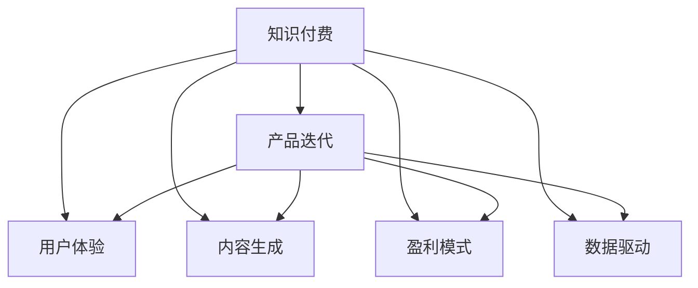

                 

# 知识付费创业的产品迭代策略

> 关键词：知识付费, 创业, 产品迭代, 用户体验, 内容生成, 盈利模式, 数据驱动

## 1. 背景介绍

### 1.1 问题由来
随着互联网的快速发展，内容付费市场迎来了前所未有的机遇。知识付费作为在线教育的重要分支，正逐步成为用户获取优质内容的新方式。据统计，全球知识付费市场规模已经突破百亿，预计将持续增长。知识付费创业项目纷纷涌现，但如何从众多产品中脱颖而出，成为亟待解决的问题。

### 1.2 问题核心关键点
知识付费创业的核心在于内容的优质性和用户体验的极致性。内容是知识付费的灵魂，优质的内容能够吸引用户订阅和付费。而良好的用户体验，则是用户持续留存的关键。此外，盈利模式的多样化以及数据的驱动优化，也是成功的关键因素。

### 1.3 问题研究意义
通过研究知识付费创业的产品迭代策略，可以更好地指导创业者从产品定位、内容策略、技术架构、盈利模式、用户体验等多方面进行全面优化，实现产品和业务的快速迭代升级，提升市场竞争力，实现商业价值。

## 2. 核心概念与联系

### 2.1 核心概念概述

为更好地理解知识付费创业的产品迭代策略，本节将介绍几个密切相关的核心概念：

- **知识付费 (Knowledge Paywall)**：用户为获取高质量知识内容而支付费用的模式。
- **产品迭代 (Product Iteration)**：通过不断优化产品功能、用户体验、技术架构等，提高产品竞争力，满足用户需求的过程。
- **用户体验 (User Experience, UX)**：用户在接触产品时的感受和反应，包括易用性、互动性、满意度等。
- **内容生成 (Content Creation)**：制作和发布知识内容的过程，包括内容策划、制作、分发等环节。
- **盈利模式 (Revenue Model)**：知识付费产品如何实现商业变现的策略，包括单次购买、订阅、课程组合销售、广告等。
- **数据驱动 (Data-Driven)**：利用数据分析和优化算法，持续改进产品和服务的策略。

这些概念之间的逻辑关系可以通过以下Mermaid流程图来展示：



这个流程图展示的知识付费产品的各个关键组成及其相互关系：

1. 知识付费的核心是内容，是吸引用户的关键。
2. 产品迭代是提升用户体验和优化内容的途径。
3. 用户体验是用户满意度和留存的关键。
4. 内容生成是内容产品的根基。
5. 盈利模式是知识付费的收入来源。
6. 数据驱动是优化产品和技术的关键策略。

这些核心概念共同构成了知识付费创业的产品迭代策略框架，帮助我们全面理解产品开发的各个环节。

## 3. 核心算法原理 & 具体操作步骤
### 3.1 算法原理概述

知识付费创业的产品迭代策略主要围绕提升用户体验、优化内容生成、调整盈利模式、驱动数据优化四大方面展开。其核心思想是：通过不断的技术创新和市场调研，结合数据分析和算法优化，持续改进产品，满足用户需求，实现商业价值。

### 3.2 算法步骤详解

**Step 1: 用户需求分析**

- 开展市场调研，收集用户反馈，分析用户行为和心理，了解用户痛点和需求。
- 通过问卷调查、用户访谈、A/B测试等手段，收集不同用户群体的意见，找到产品改进的方向。
- 分析用户数据，如访问路径、停留时间、付费行为等，挖掘用户行为规律和偏好。

**Step 2: 产品功能优化**

- 根据用户需求和数据驱动的结果，确定需要改进或新增的功能模块。
- 设计用户界面(UI)和用户交互(UI)，确保产品易用性和用户体验。
- 采用敏捷开发方法，进行小步快跑，快速迭代产品功能。
- 持续收集用户反馈，根据反馈调整产品功能，优化用户体验。

**Step 3: 内容生成与优化**

- 策划和制作高质量的原创内容，涵盖视频、音频、文章、电子书等多种形式。
- 引入专业内容创作者，提升内容的权威性和吸引力。
- 利用数据和算法分析用户偏好，推荐个性化内容，提高用户粘性。
- 定期更新内容，保持产品的新鲜感和活跃度。

**Step 4: 盈利模式调整**

- 根据市场环境和用户需求，调整单次购买、订阅、课程组合销售等不同盈利模式。
- 推出优惠活动和会员计划，吸引更多用户订阅。
- 分析数据，优化课程组合和定价策略，提升收入。

**Step 5: 数据驱动优化**

- 收集和分析用户数据，如访问路径、用户行为、交易数据等。
- 利用机器学习算法，如聚类、分类、预测等，挖掘数据中的规律和模式。
- 根据数据分析结果，指导产品功能和内容的优化。
- 使用A/B测试等手段，评估新功能的效果，持续优化产品。

### 3.3 算法优缺点

知识付费创业的产品迭代策略具有以下优点：

1. **数据驱动**：通过数据分析指导产品优化，提高决策的科学性和准确性。
2. **用户导向**：关注用户需求和行为，提供个性化服务，提升用户满意度。
3. **灵活迭代**：采用敏捷开发方法，快速迭代产品功能，缩短市场响应时间。
4. **多模式盈利**：通过多种盈利模式，降低对单一模式的依赖，提升收入。

同时，该策略也存在一定的局限性：

1. **依赖数据**：数据驱动策略需要大量的用户数据支持，收集和处理数据的工作量较大。
2. **投入成本**：需要投入大量的人力和财力进行市场调研和产品开发，短期内成本较高。
3. **技术复杂**：需要结合数据分析和机器学习技术，技术门槛较高。
4. **市场变化**：市场环境和技术趋势变化较快，需要持续跟进，保持竞争力。

尽管存在这些局限性，但就目前而言，数据驱动的产品迭代策略仍是知识付费创业的主流范式。未来相关研究的重点在于如何进一步降低数据驱动的成本，提高模型精度和速度，同时兼顾可解释性和伦理安全性等因素。

### 3.4 算法应用领域

知识付费创业的产品迭代策略已经广泛应用于各种知识付费平台，包括在线教育、医疗咨询、职业技能培训等。这些平台通过持续的产品迭代，不断提升用户体验和内容质量，实现了较高的用户粘性和商业价值。

## 4. 数学模型和公式 & 详细讲解 & 举例说明

### 4.1 数学模型构建

知识付费创业的产品迭代策略可以通过以下数学模型进行刻画：

$$
R = f(C,X,U,V)
$$

其中，$R$表示盈利，$C$表示内容质量，$X$表示用户需求，$U$表示用户体验，$V$表示盈利模式。

### 4.2 公式推导过程

通过分析上述模型的各个组成部分，我们可以得出以下公式：

$$
R = C \times U \times V
$$

其中，内容质量$C$、用户体验$U$、盈利模式$V$是影响盈利$R$的关键因素。根据这一公式，我们可以通过优化$C$、$U$、$V$来提升产品盈利。

### 4.3 案例分析与讲解

以在线教育平台为例，分析其产品迭代策略：

- 内容质量$C$：平台通过引入名师授课、制作高质量课程视频、更新学习资料等方式提升内容质量。
- 用户体验$U$：通过优化用户界面、提高课程推荐精度、增加互动性等方式提升用户体验。
- 盈利模式$V$：平台采用订阅制和单次购买相结合的模式，推出优惠活动和会员计划，同时提供内容下载、课程导读等增值服务。

通过这些策略，平台不断优化产品，提升用户满意度和留存率，实现了较高的收入。

## 5. 项目实践：代码实例和详细解释说明
### 5.1 开发环境搭建

在进行知识付费创业的产品迭代实践前，我们需要准备好开发环境。以下是使用Python进行Flask开发的环境配置流程：

1. 安装Python：从官网下载并安装Python 3.8。
2. 安装Flask：使用pip安装Flask框架。
3. 创建Flask应用：编写Flask应用代码，并运行应用。

### 5.2 源代码详细实现

以下是一个简单的知识付费平台产品迭代功能的Flask应用示例：

```python
from flask import Flask, request, render_template

app = Flask(__name__)

@app.route('/')
def index():
    return render_template('index.html')

@app.route('/submit', methods=['POST'])
def submit():
    name = request.form['name']
    email = request.form['email']
    message = request.form['message']
    # 将用户反馈数据存储到数据库或进行分析
    return render_template('submit.html', feedback=f'您的反馈已提交，请稍后处理。')

if __name__ == '__main__':
    app.run(debug=True)
```

在这个Flask应用中，我们定义了两个路由：`/`用于展示首页，`/submit`用于用户提交反馈。通过收集用户反馈数据，可以进行市场调研和用户行为分析，进而指导产品优化。

### 5.3 代码解读与分析

让我们再详细解读一下关键代码的实现细节：

**Flask应用类**：
- `Flask(__name__)`：创建Flask应用实例，`__name__`表示当前文件路径。
- `@app.route('/')`：定义路由`/`，对应首页。
- `@app.route('/submit', methods=['POST'])`：定义路由`/submit`，对应提交反馈。

**路由函数**：
- `index()`函数：展示首页，渲染`index.html`模板。
- `submit()`函数：收集用户反馈数据，渲染`submit.html`模板，显示提交成功信息。

**Flask应用启动**：
- `if __name__ == '__main__':`：在Python脚本中，判断是否为直接运行，如果是则启动Flask应用。
- `app.run(debug=True)`：启动Flask应用，`debug=True`表示开启调试模式，方便查看日志和调试。

通过Flask应用，可以构建一个简单的知识付费平台，收集用户反馈，进行市场调研和用户行为分析，进而指导产品优化。

## 6. 实际应用场景
### 6.1 在线教育

在线教育平台通过持续的产品迭代，不断提升用户体验和内容质量，实现了较高的用户粘性和商业价值。以下是一个典型的在线教育平台迭代流程：

- **需求分析**：通过问卷调查和用户访谈，了解用户对课程内容、学习工具、互动性等方面的需求。
- **产品优化**：引入名师授课、制作高质量课程视频、更新学习资料，优化用户界面和课程推荐系统。
- **内容更新**：定期更新课程内容和资源，保持产品的新鲜感和活跃度。
- **数据驱动**：利用用户行为数据，优化课程组合和定价策略，提升收入。

### 6.2 医疗咨询

医疗咨询平台通过持续的产品迭代，实现了较高的用户满意度和市场竞争力。以下是一个典型的医疗咨询平台迭代流程：

- **需求分析**：通过用户反馈和医生调查，了解用户对在线问诊、预约、付费等方面的需求。
- **产品优化**：优化医生在线问诊系统、提高预约便捷性、优化支付方式，提升用户体验。
- **内容生成**：提供高质量的医学知识内容，涵盖常见病、疑难病、预防保健等。
- **数据驱动**：利用用户访问数据和反馈数据，优化推荐算法，提高用户粘性。

### 6.3 职业技能培训

职业技能培训平台通过持续的产品迭代，实现了较高的用户满意度和市场竞争力。以下是一个典型的职业技能培训平台迭代流程：

- **需求分析**：通过用户反馈和行业调研，了解用户对技能培训、课程学习、技能认证等方面的需求。
- **产品优化**：优化课程学习系统、提高技能评估系统、增加互动性，提升用户体验。
- **内容更新**：定期更新课程内容和技能培训资料，保持产品的新鲜感和活跃度。
- **数据驱动**：利用用户学习数据和反馈数据，优化课程推荐和定价策略，提升收入。

## 7. 工具和资源推荐
### 7.1 学习资源推荐

为了帮助开发者系统掌握知识付费创业的产品迭代策略，这里推荐一些优质的学习资源：

1. **《Web应用开发与Flask实战》**：深入浅出地介绍了Flask框架的使用和实践技巧，适合初学者和进阶开发者。
2. **《Python数据分析实战》**：通过大量案例，讲解了数据分析在产品优化中的应用，适合数据分析和产品管理岗开发者。
3. **《用户体验设计（UX）》**：介绍了用户体验设计的核心概念和实践方法，适合产品经理和UI设计师。
4. **《数据驱动的产品创新》**：通过大量案例，讲解了数据驱动在产品迭代中的应用，适合产品管理和数据科学岗开发者。

通过对这些资源的学习实践，相信你一定能够快速掌握知识付费创业的产品迭代策略，并用于解决实际的创业问题。

### 7.2 开发工具推荐

高效的开发离不开优秀的工具支持。以下是几款用于知识付费创业的产品迭代开发的常用工具：

1. **Flask**：轻量级Web框架，易于上手，适合快速构建和迭代Web应用。
2. **MySQL/PostgreSQL**：流行的关系型数据库，适合存储和管理用户数据和产品信息。
3. **Apache Kafka**：分布式消息系统，适合处理大规模数据流和实时数据。
4. **Prometheus/Grafana**：开源监控系统，适合监控应用性能和用户行为数据。
5. **Kibana/ElasticSearch**：开源日志和数据分析工具，适合存储和管理用户行为数据。

合理利用这些工具，可以显著提升知识付费创业的产品迭代效率，加快创新迭代的步伐。

### 7.3 相关论文推荐

知识付费创业的产品迭代策略源于学界的持续研究。以下是几篇奠基性的相关论文，推荐阅读：

1. **《Web应用开发与Flask实战》**：介绍了Flask框架的使用和实践技巧，适合初学者和进阶开发者。
2. **《Python数据分析实战》**：通过大量案例，讲解了数据分析在产品优化中的应用，适合数据分析和产品管理岗开发者。
3. **《用户体验设计（UX）》**：介绍了用户体验设计的核心概念和实践方法，适合产品经理和UI设计师。
4. **《数据驱动的产品创新》**：通过大量案例，讲解了数据驱动在产品迭代中的应用，适合产品管理和数据科学岗开发者。

这些论文代表了大语言模型微调技术的发展脉络。通过学习这些前沿成果，可以帮助研究者把握学科前进方向，激发更多的创新灵感。

## 8. 总结：未来发展趋势与挑战

### 8.1 总结

本文对知识付费创业的产品迭代策略进行了全面系统的介绍。首先阐述了知识付费创业的背景和意义，明确了产品迭代在提升用户体验和优化内容方面的重要性。其次，从原理到实践，详细讲解了产品迭代的技术实现和关键步骤，给出了知识付费创业的完整代码实例。同时，本文还探讨了产品迭代在在线教育、医疗咨询、职业技能培训等不同行业领域的应用，展示了产品迭代策略的广泛适用性。最后，本文精选了产品迭代技术的各类学习资源，力求为读者提供全方位的技术指引。

通过本文的系统梳理，可以看到，产品迭代策略在大规模知识付费产品中起到了至关重要的作用。通过不断优化产品功能、用户体验、内容质量，结合数据分析和算法优化，可以实现产品的快速迭代和升级，满足用户需求，提升商业价值。

### 8.2 未来发展趋势

展望未来，知识付费创业的产品迭代策略将呈现以下几个发展趋势：

1. **人工智能和大数据应用**：结合人工智能和大数据技术，进行用户行为预测和内容推荐，提高用户粘性和满意度。
2. **实时数据处理**：通过实时数据处理技术，提升用户反馈和行为数据的实时性和准确性，指导产品优化。
3. **用户体验设计（UX）**：引入用户体验设计（UX）方法，提升用户界面和交互设计，增强用户满意度和留存率。
4. **多元化盈利模式**：探索更多元化的盈利模式，如内容订阅、广告、增值服务等，提升收入。
5. **数据安全和隐私保护**：加强数据安全和隐私保护措施，确保用户数据安全，避免数据泄露和滥用。

以上趋势凸显了产品迭代策略在大规模知识付费产品中的重要作用。这些方向的探索发展，必将进一步提升产品的市场竞争力和用户满意度，实现商业价值最大化。

### 8.3 面临的挑战

尽管知识付费创业的产品迭代策略已经取得了一定的成效，但在迈向更加智能化、普适化应用的过程中，它仍面临着诸多挑战：

1. **数据隐私和安全**：用户数据隐私和安全问题始终是知识付费创业的重要挑战，需要加强数据保护和隐私保护措施。
2. **用户体验设计（UX）**：如何设计更加人性化的用户界面和交互，提升用户体验，仍然是一个难题。
3. **盈利模式单一**：虽然订阅制是目前主流的盈利模式，但单一的盈利模式难以支撑长期发展，需要探索更多元化的盈利渠道。
4. **用户流失率高**：用户流失率高是知识付费创业的常见问题，需要通过多种手段提高用户粘性。
5. **内容质量控制**：如何保证内容的高质量和权威性，提升用户信任度，仍需进一步探索。

这些挑战需要知识付费创业企业不断优化产品和服务，提升用户满意度和市场竞争力，方能实现长期的商业成功。

### 8.4 研究展望

面向未来，知识付费创业的产品迭代策略需要在以下几个方面进行更深入的研究和探索：

1. **用户行为预测**：通过机器学习和深度学习技术，进行用户行为预测和个性化推荐，提高用户粘性。
2. **内容生成自动化**：利用自然语言生成（NLG）技术和知识图谱，自动生成高质量内容，提高内容生产效率。
3. **用户体验设计（UX）**：结合心理学和用户行为学，进行更加人性化的用户体验设计，提升用户满意度和留存率。
4. **多元化盈利模式**：探索更多元化的盈利模式，如内容订阅、广告、增值服务等，提升收入。
5. **数据安全和隐私保护**：加强数据安全和隐私保护措施，确保用户数据安全，避免数据泄露和滥用。

这些研究方向的探索，必将引领知识付费创业的产品迭代策略迈向更高的台阶，为构建安全、可靠、可解释、可控的智能系统铺平道路。面向未来，知识付费创业的产品迭代策略还需要与其他人工智能技术进行更深入的融合，如知识表示、因果推理、强化学习等，多路径协同发力，共同推动知识付费产品的发展。只有勇于创新、敢于突破，才能不断拓展产品边界，让智能技术更好地造福人类社会。

## 9. 附录：常见问题与解答

**Q1：如何平衡内容质量和用户体验？**

A: 平衡内容质量和用户体验需要从多个方面入手：

1. **数据驱动**：通过数据分析，了解用户对内容和功能的需求和偏好，指导内容制作和功能优化。
2. **迭代优化**：采用敏捷开发方法，进行小步快跑，快速迭代产品功能，不断优化用户体验。
3. **用户反馈**：持续收集用户反馈，根据反馈调整产品功能和内容，提升用户满意度。
4. **专业团队**：引入内容制作和用户体验设计的专业团队，提升内容质量和用户体验。

通过综合运用数据驱动、迭代优化、用户反馈和专业团队等多种手段，可以实现内容质量和用户体验的平衡。

**Q2：如何提高用户粘性？**

A: 提高用户粘性需要从多个方面入手：

1. **个性化推荐**：利用用户行为数据，进行个性化内容推荐，提升用户粘性。
2. **互动性设计**：增加互动性功能，如在线答疑、用户投票、社区讨论等，提升用户参与度。
3. **奖励机制**：设置奖励机制，如积分、优惠券、会员特权等，激励用户持续使用产品。
4. **高质量内容**：提供高质量、有价值的内容，满足用户需求，提升用户满意度。
5. **用户体验设计（UX）**：进行更加人性化的用户体验设计，提升用户满意度。

通过综合运用个性化推荐、互动性设计、奖励机制、高质量内容和用户体验设计等多种手段，可以显著提高用户粘性。

**Q3：如何处理用户反馈？**

A: 处理用户反馈需要从多个方面入手：

1. **收集反馈**：通过问卷调查、用户访谈、A/B测试等手段，收集不同用户群体的意见，找到产品改进的方向。
2. **分析反馈**：分析用户反馈数据，挖掘用户需求和痛点，指导产品优化。
3. **快速迭代**：采用敏捷开发方法，进行小步快跑，快速迭代产品功能，快速响应用户反馈。
4. **持续优化**：持续收集用户反馈，根据反馈调整产品功能，优化用户体验。

通过综合运用收集反馈、分析反馈、快速迭代和持续优化等多种手段，可以不断改进产品，提升用户满意度。

**Q4：如何选择盈利模式？**

A: 选择盈利模式需要综合考虑多个因素：

1. **市场环境**：根据市场环境，选择适合的盈利模式，如订阅制、单次购买、课程组合销售等。
2. **用户需求**：了解用户需求，选择能够满足用户需求的盈利模式。
3. **成本效益**：评估盈利模式的成本效益，选择能够最大化收益的模式。
4. **竞争分析**：分析竞争对手的盈利模式，选择具有竞争优势的模式。

通过综合考虑市场环境、用户需求、成本效益和竞争分析等多种因素，可以选择适合的盈利模式，提升收入。

**Q5：如何保证数据安全和隐私保护？**

A: 保证数据安全和隐私保护需要从多个方面入手：

1. **数据加密**：采用数据加密技术，保护数据传输和存储的安全。
2. **访问控制**：设置访问控制机制，限制数据访问权限，防止数据泄露。
3. **隐私保护**：遵守隐私保护法规，保护用户隐私，避免数据滥用。
4. **安全审计**：进行安全审计和风险评估，及时发现和修复安全漏洞。
5. **数据备份**：进行数据备份和恢复，确保数据安全。

通过综合运用数据加密、访问控制、隐私保护、安全审计和数据备份等多种手段，可以保证数据安全和隐私保护。

---

作者：禅与计算机程序设计艺术 / Zen and the Art of Computer Programming

