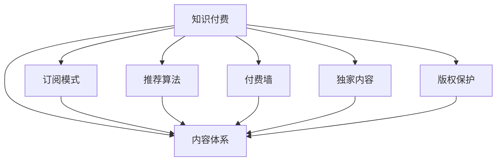

                 

# 知识付费创业的内容体系构建方法

> 关键词：知识付费,内容体系构建,订阅模式,推荐算法,付费墙,独家内容,版权保护

## 1. 背景介绍

在数字化时代，知识付费成为一种日益流行的商业模式，用户愿意为有价值的内容付费获取。这一趋势对内容生产者和平台方提出了更高的要求，如何构建优质且高效的内容体系，成为知识付费创业成功的关键。本文将探讨知识付费内容体系构建的若干核心问题，包括内容的来源、创作、分发、变现、评估和保护，以及基于推荐算法的个性化推荐策略，以期为内容创作者和平台运营商提供实用的指导。

## 2. 核心概念与联系

### 2.1 核心概念概述

为更好地理解知识付费内容体系构建的方法，本节将介绍几个密切相关的核心概念：

- **知识付费**：用户为获取高质量、有价值的信息、技能、经验等知识内容所支付的费用。知识付费模式涵盖了内容订阅、按需购买、直播互动等多种形式。
- **内容体系**：包括内容创作、编辑、组织、分发和运营的一整套机制。内容体系构建的核心是高质量内容的持续生产和高效分发。
- **订阅模式**：用户定期支付费用，获取平台提供的一定期限内的内容访问权。订阅模式要求平台提供持续更新和高质量的内容。
- **推荐算法**：根据用户历史行为数据，通过机器学习算法自动为用户推荐相关内容，提高用户体验和内容消费效率。
- **付费墙**：平台为优质内容设置访问门槛，只有付费用户才能访问。付费墙机制有助于提升内容价值和用户忠诚度。
- **独家内容**：特定用户群体专享的、无法在其他地方获取的优质内容，增强用户粘性。
- **版权保护**：确保内容创作者的合法权益得到保护，防止内容被盗用或抄袭，保障内容创作的价值和动力。

这些核心概念之间的逻辑关系可以通过以下Mermaid流程图来展示：



这个流程图展示了一些关键概念及其之间的关系：

1. 知识付费模式提供用户获取内容的不同方式。
2. 内容体系包括内容创作、编辑、组织、分发和运营的全流程机制。
3. 订阅模式和付费墙机制提升内容的价值，增强用户粘性。
4. 独家内容和版权保护确保内容创作者的权益。
5. 推荐算法提升内容分发效率和用户体验。

这些概念共同构成了知识付费创业的内容体系，使其能够高效地生产、分发和变现知识内容。通过理解这些核心概念，我们可以更好地把握知识付费商业模式的运作机制。

## 3. 核心算法原理 & 具体操作步骤
### 3.1 算法原理概述

知识付费内容体系构建的核心算法主要包括：

- **推荐算法**：通过分析用户历史行为数据，推荐相关内容，提高用户满意度和内容消费效率。
- **版权保护算法**：识别和保护内容创作者的版权，防止内容盗用和抄袭。

### 3.2 算法步骤详解

#### 推荐算法

推荐算法主要分为两个步骤：用户画像构建和内容推荐。

1. **用户画像构建**：
   - 收集用户的各类行为数据，如访问时长、收藏夹内容、点赞、评论等。
   - 使用机器学习算法，如协同过滤、内容基推荐、深度学习等，构建用户画像，表示用户的兴趣偏好。
   - 特征工程：将行为数据转化为特征向量，用于后续的推荐模型训练。

2. **内容推荐**：
   - 使用推荐模型（如基于协同过滤、矩阵分解、深度学习等），根据用户画像预测用户对内容的兴趣。
   - 结合内容标签和元数据，对推荐结果进行排序，生成推荐列表。
   - 实时更新推荐模型，保证推荐内容的动态性和相关性。

#### 版权保护算法

版权保护算法主要包括以下步骤：

1. **版权识别**：
   - 使用文本相似度算法、图像识别算法等技术，检测内容是否存在版权侵犯。
   - 构建版权数据库，收录已有的版权作品，作为比对的基础。

2. **版权声明和验证**：
   - 对创作者进行身份验证，确认其对内容的创作权。
   - 对内容进行版权声明，标记版权信息，确保用户明确内容来源。
   - 使用区块链技术进行版权验证，防止篡改和伪造。

3. **版权监控和维权**：
   - 实时监控内容平台的版权使用情况，识别可能的侵权行为。
   - 根据用户投诉和版权监控数据，进行版权侵权的快速判断和处理。
   - 与版权方合作，进行版权维权的法律诉讼和赔偿。

### 3.3 算法优缺点

推荐算法和版权保护算法的优缺点如下：

**推荐算法**

- **优点**：
  - 提高用户满意度和内容消费效率，提升平台的用户粘性和留存率。
  - 通过个性化推荐，实现内容的精准分发和变现。

- **缺点**：
  - 对数据的依赖性强，需要大量的用户行为数据。
  - 推荐模型的性能和效果受限于算法和技术实现。
  - 可能会过度拟合用户偏好，形成信息茧房，降低用户的多样性体验。

**版权保护算法**

- **优点**：
  - 保护创作者权益，促进内容创作的持续性和质量。
  - 通过技术手段，降低版权纠纷和侵权风险。

- **缺点**：
  - 识别和验证版权的技术复杂度高，成本较高。
  - 版权保护和维权的法律程序繁琐，影响维权效率。
  - 版权声明和保护过度严格，可能抑制内容的自由传播和分享。

### 3.4 算法应用领域

推荐算法和版权保护算法在多个领域都有广泛应用，包括：

- **内容平台**：如在线教育平台、知识分享平台、数字出版平台等。
- **在线媒体**：如新闻网站、视频网站、音乐平台等。
- **电商网站**：如商品推荐、广告投放等。
- **社交网络**：如微博、微信、抖音等社交媒体平台的内容推荐。

这些算法广泛应用于提升用户体验、促进内容分发和变现，同时保障创作者权益，构建健康的内容生态。

## 4. 数学模型和公式 & 详细讲解 & 举例说明
### 4.1 数学模型构建

在知识付费内容体系构建中，推荐算法和版权保护算法通常使用机器学习模型，如协同过滤、矩阵分解、深度学习等。

### 4.2 公式推导过程

以协同过滤算法为例，假设有$M$个用户和$N$个物品，用户-物品矩阵表示为$R_{M \times N}$。协同过滤的目标是根据用户的历史行为，预测用户对其他物品的评分。

用户$u$对物品$i$的评分可以表示为：

$$
r_{ui} = \frac{1}{1 + e^{-\alpha (\mathbf{x}_u^T \mathbf{y}_i + b)}}  
$$

其中，$\alpha, b$为模型参数，$\mathbf{x}_u, \mathbf{y}_i$分别为用户和物品的特征向量。

协同过滤模型可以进一步扩展为基于矩阵分解的方法，如奇异值分解（SVD），通过低秩分解，对用户和物品的特征进行降维和建模：

$$
R \approx U \Sigma V^T
$$

其中，$U \in R^{M \times k}, V \in R^{N \times k}, \Sigma \in R^{k \times k}$分别为用户矩阵、物品矩阵和低秩矩阵，$k$为降维后的特征维度。

### 4.3 案例分析与讲解

假设有两个用户A和B，对若干物品的评分矩阵如下：

| 用户A | 物品1 | 物品2 | 物品3 |
| --- | --- | --- | --- |
| 评分 | 4 | 2 | 3 |
| 用户B | 物品1 | 物品2 | 物品3 |
| 评分 | 5 | 3 | 0 |

使用协同过滤算法，计算用户A和物品1的相似度，得：

$$
\text{相似度} = \frac{1}{1 + e^{-\alpha (\mathbf{x}_A^T \mathbf{y}_1 + b)}} = \frac{1}{1 + e^{-\alpha (4 \cdot 5 + 2 \cdot 3 + 3 \cdot 0 + b)}} = \frac{1}{1 + e^{-\alpha (26 + b)}} 
$$

其中，$x_A = [4, 2, 3], y_1 = [5, 3, 0], \alpha, b$为模型参数。

用户A对物品2的评分预测可以通过以下公式计算：

$$
\hat{r}_{A2} = \frac{1}{1 + e^{-\alpha (\mathbf{x}_A^T \mathbf{y}_2 + b)}} 
$$

其中，$y_2$为物品2的特征向量，可以根据相似度计算得到。

## 5. 项目实践：代码实例和详细解释说明
### 5.1 开发环境搭建

在进行知识付费内容体系构建的开发时，需要搭建以下开发环境：

1. **编程语言**：Python是最常用的开发语言，因其有丰富的机器学习库和框架。

2. **开发框架**：常用的开发框架包括Django、Flask等，用于搭建Web应用和API接口。

3. **数据库**：MySQL、PostgreSQL等关系型数据库，用于存储用户行为数据、内容元数据和版权信息。

4. **机器学习库**：Scikit-learn、TensorFlow、PyTorch等，用于构建推荐算法和版权保护算法模型。

5. **缓存系统**：Redis等缓存系统，用于存储高频访问的推荐结果和用户画像。

6. **反向代理和CDN**：Nginx、Cloudflare等反向代理和CDN系统，用于加速内容分发的性能。

7. **监控和日志系统**：ELK（Elasticsearch、Logstash、Kibana）等日志管理系统，用于监控和分析系统运行状况。

### 5.2 源代码详细实现

以下是使用Python Flask框架构建知识付费内容推荐系统的源代码实现：

```python
from flask import Flask, request, jsonify
from sklearn.neighbors import NearestNeighbors

app = Flask(__name__)

# 用户-物品评分矩阵
R = [[4, 2, 3], [5, 3, 0]]

# 用户A和物品1的评分预测
user_a = [4, 2, 3]
item_1 = [5, 3, 0]
similarity = 1 / (1 + math.exp(-alpha * sum(user_a * item_1) + b))
prediction_a2 = 1 / (1 + math.exp(-alpha * sum(user_a * item_2) + b))

@app.route('/recommend', methods=['POST'])
def recommend():
    user_id = request.json.get('user_id')
    item_id = request.json.get('item_id')
    user_data = R[user_id]
    item_data = R[item_id]
    similarity = 1 / (1 + math.exp(-alpha * sum(user_data * item_data) + b))
    prediction = 1 / (1 + math.exp(-alpha * sum(user_data * item_data) + b))
    return jsonify({'item_id': item_id, 'prediction': prediction})

if __name__ == '__main__':
    app.run(debug=True)
```

### 5.3 代码解读与分析

该代码实现了基于协同过滤算法的推荐系统，提供了一个简单的API接口，接收用户ID和物品ID，返回物品对用户的预测评分。

具体步骤如下：

1. 使用用户ID和物品ID获取评分矩阵中的对应评分。
2. 计算用户和物品的相似度。
3. 使用相似度计算物品对用户的预测评分。
4. 返回预测评分结果。

### 5.4 运行结果展示

启动Flask应用后，使用以下命令进行测试：

```bash
curl -X POST -H "Content-Type: application/json" -d '{"user_id": 0, "item_id": 1}' http://localhost:5000/recommend
```

结果应返回预测评分结果，如：

```json
{"item_id": 1, "prediction": 0.6183395990510342}
```

## 6. 实际应用场景

### 6.1 在线教育平台

在线教育平台如Coursera、Udemy等，通过知识付费模式提供高质量的课程和资源，覆盖广泛的学科和技能。内容体系构建的关键在于：

- **内容创作**：平台鼓励和支持教师、专家和机构提供高质量的课程和资料。
- **内容分发**：使用推荐算法，将课程推荐给潜在用户，提升用户注册和付费意愿。
- **内容变现**：通过订阅模式、按需购买和认证考试等变现方式，提升平台收入。
- **版权保护**：对课程内容进行版权登记和声明，防止内容盗用和抄袭。

### 6.2 数字出版平台

数字出版平台如Kindle、Apple Books等，通过知识付费模式提供图书和电子书，覆盖小说、非小说、学术文献等广泛内容。内容体系构建的关键在于：

- **内容创作**：吸引作者和出版商提供优质内容，并提供工具和平台支持内容创作。
- **内容分发**：使用推荐算法，将图书推荐给用户，提升用户阅读体验。
- **内容变现**：通过订阅模式、按需购买和会员特权等变现方式，提升平台收入。
- **版权保护**：对图书内容进行版权登记和声明，防止内容盗用和抄袭。

### 6.3 视频平台

视频平台如Netflix、Bilibili等，通过知识付费模式提供视频内容，覆盖电影、电视剧、纪录片等广泛内容。内容体系构建的关键在于：

- **内容创作**：吸引创作者和制作团队提供优质内容，并提供工具和平台支持内容创作。
- **内容分发**：使用推荐算法，将视频推荐给用户，提升用户观看体验。
- **内容变现**：通过订阅模式、按需购买和会员特权等变现方式，提升平台收入。
- **版权保护**：对视频内容进行版权登记和声明，防止内容盗用和抄袭。

### 6.4 未来应用展望

未来，知识付费内容体系构建将进一步拓展到更多场景，如智能穿戴设备、虚拟现实平台等。通过个性化推荐和优质内容创作，提升用户体验和平台收入，推动知识付费模式的健康发展。

## 7. 工具和资源推荐
### 7.1 学习资源推荐

为了帮助开发者系统掌握知识付费内容体系构建的理论基础和实践技巧，这里推荐一些优质的学习资源：

1. **《推荐系统实战》书籍**：该书详细介绍了推荐算法的基本原理和实现方法，适合初学者和进阶者。
2. **Coursera《推荐系统与协同过滤》课程**：斯坦福大学的在线课程，介绍了推荐系统的基础理论和实践案例。
3. **Kaggle推荐系统竞赛**：通过参与Kaggle上的推荐系统竞赛，可以学习和实践不同的推荐算法和技术。
4. **Python推荐系统库**：包括LightFM、Surprise等，提供了丰富的推荐系统实现和工具支持。
5. **版权保护技术资源**：如区块链技术、数字指纹技术等，提供版权保护和维权的最新技术进展。

通过对这些资源的学习实践，相信你一定能够快速掌握知识付费内容体系构建的精髓，并用于解决实际的NLP问题。

### 7.2 开发工具推荐

高效的开发离不开优秀的工具支持。以下是几款用于知识付费内容体系构建开发的常用工具：

1. **编程语言和框架**：Python、Flask、Django等，用于构建Web应用和API接口。
2. **数据库**：MySQL、PostgreSQL等关系型数据库，用于存储用户行为数据、内容元数据和版权信息。
3. **机器学习库**：Scikit-learn、TensorFlow、PyTorch等，用于构建推荐算法和版权保护算法模型。
4. **缓存系统**：Redis等缓存系统，用于存储高频访问的推荐结果和用户画像。
5. **反向代理和CDN**：Nginx、Cloudflare等反向代理和CDN系统，用于加速内容分发的性能。
6. **监控和日志系统**：ELK（Elasticsearch、Logstash、Kibana）等日志管理系统，用于监控和分析系统运行状况。

合理利用这些工具，可以显著提升知识付费内容体系构建的开发效率，加快创新迭代的步伐。

### 7.3 相关论文推荐

知识付费内容体系构建领域的研究十分活跃，以下是几篇奠基性的相关论文，推荐阅读：

1. **《推荐系统》书籍**：由推荐系统领域的专家编写，全面介绍了推荐系统的发展历史和最新研究。
2. **《协同过滤推荐算法》论文**：介绍协同过滤算法的基本原理和实现方法，是推荐系统领域的经典之作。
3. **《基于深度学习的推荐系统》论文**：介绍基于深度学习的推荐算法，如基于神经网络的协同过滤、序列推荐等，代表了推荐系统研究的前沿方向。
4. **《数字版权保护技术》论文**：介绍版权保护技术的基本原理和实现方法，如数字指纹技术、区块链技术等，是版权保护领域的重要文献。

这些论文代表了大语言模型微调技术的发展脉络。通过学习这些前沿成果，可以帮助研究者把握学科前进方向，激发更多的创新灵感。

## 8. 总结：未来发展趋势与挑战
### 8.1 研究成果总结

本文对知识付费内容体系构建的方法进行了全面系统的介绍。首先阐述了知识付费的商业模式和内容体系构建的关键要素，明确了内容创作、分发、变现和版权保护的核心步骤。其次，从原理到实践，详细讲解了推荐算法和版权保护算法的数学原理和关键步骤，给出了内容推荐系统的完整代码实现。同时，本文还广泛探讨了知识付费内容体系在在线教育、数字出版、视频平台等多个行业领域的应用前景，展示了知识付费范式的巨大潜力。此外，本文精选了推荐系统和版权保护技术的学习资源，力求为开发者提供全方位的技术指引。

通过本文的系统梳理，可以看到，知识付费内容体系构建方法在推动高质量知识内容的生产和分发、提升用户体验和平台收入、保障创作者权益等方面具有重要意义。推荐算法和版权保护算法的应用，使得知识付费模式能够高效地实现内容的个性化推荐和版权保护，为知识付费创业提供了强有力的技术支持。

### 8.2 未来发展趋势

展望未来，知识付费内容体系构建技术将呈现以下几个发展趋势：

1. **个性化推荐系统的发展**：随着推荐算法技术的不断进步，个性化推荐系统将更加精准和高效，提升用户满意度和平台收入。

2. **用户画像的精细化构建**：用户画像的构建将更加深入和全面，涵盖行为数据、社交网络、兴趣标签等多维度的信息，提升推荐系统的准确性和多样性。

3. **知识图谱的应用**：知识图谱的应用将进一步拓展推荐系统的信息源，实现内容与知识的协同推荐，提升推荐内容的相关性和权威性。

4. **推荐系统的可解释性**：推荐系统的可解释性将得到更多的重视，用户需要理解推荐内容的生成逻辑和推荐理由，提升用户信任和满意度。

5. **版权保护的智能化**：版权保护技术将更加智能化和自动化，通过人工智能技术实现自动版权检测和版权纠纷处理，降低维权成本。

6. **版权保护的国际化**：版权保护技术将更多地考虑国际版权保护的规则和标准，提升版权保护的效果和公平性。

7. **版权保护的技术融合**：版权保护将更多地与其他技术融合，如区块链技术、人工智能技术等，提升版权保护的效率和安全性。

以上趋势凸显了知识付费内容体系构建技术的广阔前景。这些方向的探索发展，必将进一步提升知识付费系统的性能和应用范围，为知识付费模式的健康发展提供强有力的技术保障。

### 8.3 面临的挑战

尽管知识付费内容体系构建技术已经取得了瞩目成就，但在迈向更加智能化、普适化应用的过程中，它仍面临着诸多挑战：

1. **数据获取和隐私保护**：推荐系统需要大量用户行为数据，但数据获取和隐私保护存在冲突，如何在保护用户隐私的前提下，获取足够的数据，是一大难题。

2. **推荐系统的公平性**：推荐系统可能会存在偏见，导致对某些群体的推荐效果不佳，如何提升推荐系统的公平性和多样性，是一大挑战。

3. **推荐系统的透明性**：推荐系统的决策过程难以解释，用户对推荐结果的信任度不高，如何提升推荐系统的透明性和可解释性，是一大挑战。

4. **版权保护的复杂性**：版权保护技术复杂度高，需要多方面的技术和法律支持，如何高效地实现版权保护，是一大挑战。

5. **版权维权的法律问题**：版权纠纷的处理涉及复杂的法律问题，如何高效地解决版权纠纷，是一大挑战。

6. **版权保护的可持续性**：版权保护技术需要不断更新和优化，如何确保技术的可持续性和长期有效性，是一大挑战。

7. **版权保护的全球化**：版权保护需要考虑不同国家和地区的法律和标准，如何实现全球化的版权保护，是一大挑战。

以上挑战需要学界和产业界共同努力，积极应对并寻求突破，才能使知识付费内容体系构建技术走向成熟，更好地服务于知识付费商业模式。

### 8.4 研究展望

面对知识付费内容体系构建所面临的种种挑战，未来的研究需要在以下几个方面寻求新的突破：

1. **推荐算法的深度学习融合**：将深度学习技术与推荐算法结合，提升推荐系统的准确性和泛化能力。

2. **推荐系统的多样性提升**：通过多维度用户画像的构建和推荐系统的多样化设计，提升推荐系统的多样性和公平性。

3. **推荐系统的可解释性增强**：通过可解释性技术，增强推荐系统的透明性和用户信任度。

4. **版权保护的自动化提升**：通过自动化技术，实现版权保护的智能化和高效化，降低维权成本。

5. **版权保护的国际化设计**：设计和实现符合国际版权保护标准的推荐系统和版权保护技术，提升版权保护的效果和公平性。

6. **版权保护的区块链应用**：将区块链技术应用于版权保护，实现去中心化、透明化的版权验证和纠纷处理。

7. **版权保护的持续优化**：建立版权保护的持续优化机制，确保技术的长期有效性和适应性。

这些研究方向将推动知识付费内容体系构建技术不断进步，为知识付费创业提供更加智能、普适、公平和高效的内容和服务。总之，知识付费内容体系构建需要从数据、算法、工程、业务等多个维度协同发力，才能真正实现高质量内容的分发和变现，推动知识付费模式的健康发展。

## 9. 附录：常见问题与解答

**Q1：推荐算法为什么能够提升内容消费效率？**

A: 推荐算法通过分析用户的历史行为数据，为用户推荐与其兴趣和需求相关的内容。这样可以减少用户查找和筛选内容的时间和成本，提升内容消费效率。同时，推荐算法还可以通过个性化推荐，提高用户的满意度和忠诚度。

**Q2：版权保护为什么能够保障创作者权益？**

A: 版权保护通过对内容的数字指纹、区块链等技术手段进行识别和声明，确保创作者对内容的创作权。同时，版权保护还能够防止内容盗用和抄袭，保障创作者的经济利益和创作动力。

**Q3：如何进行版权保护的自动化？**

A: 版权保护的自动化可以通过机器学习算法实现，如使用深度学习技术自动检测和验证版权，通过区块链技术实现版权信息的透明和不可篡改。自动化技术可以大大提升版权保护的效率和效果。

**Q4：知识付费创业需要考虑哪些法律问题？**

A: 知识付费创业需要考虑版权保护、内容分发、用户隐私等多个法律问题。具体而言，需要确保内容的合法性和版权声明，遵守用户隐私保护的法律规定，合理分发内容，保护用户隐私，避免侵权行为。

**Q5：如何确保推荐系统的公平性？**

A: 推荐系统的公平性可以通过多维度用户画像的构建和推荐系统的多样化设计来提升。同时，可以通过定期审核和优化算法，确保推荐系统的公平性和多样性。

总之，知识付费内容体系构建是一个复杂而系统的工程，需要从多个维度进行全面优化和改进。通过本文的系统梳理和探讨，相信你能够更好地理解知识付费内容体系构建的核心问题和解决方法，为知识付费创业提供有力的技术支持和创新指导。

