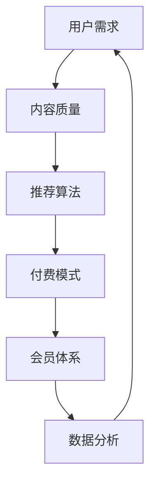

                 

# 知识付费创业的商业模式优化

> 关键词：知识付费,商业模式优化,人工智能,大数据,内容推荐,付费墙,免费增值,会员体系

## 1. 背景介绍

随着互联网技术的发展，知识付费市场迅速崛起，成为新经济的重要组成部分。据统计，2021年中国知识付费市场规模已超过350亿元，并预计将在未来几年内继续保持20%以上的年复合增长率。知识付费平台的兴起，不仅改变了人们的学习方式，也推动了教育行业的数字化转型。然而，面对激烈的市场竞争和用户需求的变化，知识付费创业项目需要不断优化商业模式，以保持竞争力和市场份额。

### 1.1 知识付费的兴起

知识付费模式的兴起，主要源于以下几个方面的驱动：

1. **信息过载**：互联网时代的到来，使得信息数量呈指数级增长。面对海量信息，人们越来越需要高效、精准地获取所需知识。
2. **时间成本**：在快节奏的生活中，人们的时间越来越宝贵。通过付费订阅优质内容，能够节省大量自行筛选、搜索信息的时间。
3. **知识付费价值**：付费平台提供的深度内容、专家讲解、个性化推荐等服务，能够大幅提升学习效率和质量。

### 1.2 当前主流商业模式

当前知识付费市场主要采用以下几种商业模式：

1. **订阅模式**：用户按月或按年订阅付费内容，享受平台提供的优质课程、专栏、文章等。
2. **按需模式**：用户按需购买单次课程或单篇文章，根据自身需求灵活选择。
3. **会员模式**：用户缴纳一定费用成为会员，享受平台所有内容，并享有额外权益如优先观看、直播互动等。
4. **免费增值模式**：部分内容免费提供，吸引用户注册，通过付费购买更高等级内容来实现盈利。

这些模式各有优劣，不同的知识付费平台根据自身定位和用户需求，选择最适合的商业模式进行探索和实践。

## 2. 核心概念与联系

### 2.1 核心概念概述

在优化知识付费商业模式的过程中，需要关注以下几个核心概念：

1. **用户需求**：准确把握用户需求，是制定商业模式的基石。
2. **内容质量**：高质量的内容是知识付费平台的核心竞争力。
3. **推荐算法**：通过个性化推荐算法，提升用户粘性和转化率。
4. **付费模式**：选择合适的付费模式，吸引用户付费，并实现商业变现。
5. **会员体系**：构建合理的会员体系，提供差异化服务，增强用户忠诚度。
6. **数据分析**：利用大数据和人工智能技术，进行用户行为分析和内容优化。

这些概念之间相互关联，共同构成知识付费创业项目成功的关键要素。

### 2.2 核心概念原理和架构的 Mermaid 流程图



这个流程图展示了从用户需求到数据分析的完整链条，每个环节都是不可或缺的。

## 3. 核心算法原理 & 具体操作步骤

### 3.1 算法原理概述

知识付费平台的商业模式优化，需要综合运用多种算法和策略，以提升用户满意度和平台盈利能力。以下是一些常用的算法和策略：

1. **个性化推荐算法**：通过分析用户历史行为数据，推荐个性化的课程和文章，提升用户粘性和转化率。
2. **付费策略优化**：通过A/B测试等方法，寻找最优的付费模式，提高用户购买率和平台收入。
3. **会员体系设计**：设计合理的会员权益和价格策略，吸引用户加入会员体系，提高用户粘性和重复消费。
4. **用户留存策略**：通过情感营销、社群互动等手段，提升用户留存率和平台活跃度。
5. **内容质量评估**：建立内容质量评估体系，确保平台内容的高质量，提升用户口碑和推荐。

### 3.2 算法步骤详解

**步骤1: 用户需求分析**

- **用户画像构建**：通过问卷调查、用户行为数据分析等手段，构建详细的用户画像，了解不同用户群体的需求和偏好。
- **需求分类**：将用户需求分为基础需求和高级需求，基础需求如获取知识，高级需求如互动交流、个性化服务等。
- **需求匹配**：根据用户画像，匹配合适的付费内容和推荐策略，提升用户满意度。

**步骤2: 内容质量提升**

- **内容审核**：建立严格的内容审核机制，确保内容的准确性和可靠性。
- **专家库建设**：邀请行业专家和意见领袖，提供高质量的内容和讲解，提升平台声誉。
- **用户评价体系**：引入用户评价机制，通过用户反馈进行内容优化和改进。

**步骤3: 个性化推荐算法**

- **用户行为数据收集**：收集用户在平台上的浏览、学习、购买等行为数据，作为推荐算法的基础。
- **推荐模型训练**：使用协同过滤、内容推荐、混合推荐等算法，训练个性化推荐模型。
- **推荐策略优化**：通过A/B测试等手段，不断优化推荐算法，提升用户满意度和转化率。

**步骤4: 付费模式设计**

- **多维度测试**：通过不同付费模式（如订阅、单次购买、会员体系等）的A/B测试，寻找最优模式。
- **价格策略设计**：根据用户群体和内容价值，设计合理的定价策略，平衡用户满意度和平台收益。
- **优惠活动设计**：定期设计优惠活动，吸引用户购买，增加用户粘性和消费频率。

**步骤5: 会员体系构建**

- **会员权益设计**：根据不同等级，设计差异化的会员权益，如优先观看、直播互动等，提升会员忠诚度。
- **会员价格策略**：根据用户需求和市场定位，设计合理的会员价格，吸引用户加入会员体系。
- **会员活动设计**：定期设计会员专属活动，增强会员归属感，提高用户活跃度。

**步骤6: 用户留存策略**

- **社群建设**：建立用户社群，增强用户互动和交流，提升用户粘性。
- **情感营销**：通过内容情感化营销，增强用户对平台的认同感和忠诚度。
- **互动激励**：设计互动激励机制，如积分兑换、打卡奖励等，提升用户参与度。

**步骤7: 内容质量评估**

- **内容质量标准**：建立明确的内容质量标准，确保平台内容的规范性和专业性。
- **用户反馈机制**：引入用户反馈机制，通过用户评价和建议进行内容优化。
- **内容迭代改进**：根据用户反馈和市场变化，不断优化和更新内容，提升用户满意度。

### 3.3 算法优缺点

**优点：**

1. **提升用户粘性**：通过个性化推荐和用户留存策略，有效提升用户粘性，增加用户日活和月活。
2. **增加用户付费意愿**：通过付费策略优化和会员体系设计，提高用户付费意愿和购买频率。
3. **提高平台收益**：通过合理的定价策略和付费模式设计，增加平台收入，实现商业变现。
4. **增强用户满意度**：通过高质量的内容和个性化推荐，提升用户满意度和平台口碑。

**缺点：**

1. **技术投入高**：优化商业模式需要大量的数据和算法支持，对技术团队的要求较高。
2. **用户需求变化快**：用户需求和市场变化快，需要快速响应和调整策略。
3. **内容质量管理难度大**：高质量内容生产和内容质量管理具有挑战性，需要持续投入和优化。
4. **付费模式单一**：部分平台过于依赖订阅模式，可能难以满足不同用户的多样化需求。

### 3.4 算法应用领域

优化知识付费商业模式的算法和策略，广泛应用于以下领域：

1. **内容推荐平台**：如得到、喜马拉雅等，通过个性化推荐提升用户粘性和付费意愿。
2. **教育类应用**：如Coursera、Udacity等，通过会员体系和付费模式设计，吸引用户付费并提升学习效果。
3. **专业培训平台**：如网易云课堂、腾讯课堂等，通过高质量内容和个性化推荐，提升用户满意度和转化率。
4. **在线阅读平台**：如知乎、简书等，通过内容质量和用户留存策略，提升平台活跃度和用户忠诚度。
5. **知识服务社区**：如知识星球、分答等，通过会员体系和付费模式设计，提供深度知识服务，增强用户粘性。

## 4. 数学模型和公式 & 详细讲解 & 举例说明

### 4.1 数学模型构建

在知识付费平台的商业模式优化中，我们可以使用以下数学模型来描述用户行为和平台收益：

**用户行为模型**：

$$
U(t)=\alpha_1 + \alpha_2C(t-1) + \alpha_3R(t-1) + \epsilon
$$

其中：
- $U(t)$：用户在第$t$天的行为评分（0-10）
- $\alpha_1$：用户固定评分
- $C(t-1)$：第$t-1$天的内容评分
- $R(t-1)$：第$t-1$天的推荐评分
- $\epsilon$：随机误差

**平台收益模型**：

$$
R(t)=\beta_1U(t) + \beta_2U(t-1) + \beta_3P(t-1) + \epsilon
$$

其中：
- $R(t)$：第$t$天的平台收益（收入-成本）
- $U(t)$：第$t$天的用户行为评分
- $P(t-1)$：第$t-1$天的付费行为评分

### 4.2 公式推导过程

**用户行为模型推导**：

通过历史数据进行回归分析，得到用户行为评分与内容评分和推荐评分的关系：

$$
U(t)=\alpha_1 + \alpha_2C(t-1) + \alpha_3R(t-1) + \epsilon
$$

其中，$\alpha_1, \alpha_2, \alpha_3$为模型参数，$\epsilon$为随机误差项。

**平台收益模型推导**：

平台收益受用户行为评分、付费行为评分和历史收益评分的影响，可通过线性回归得到：

$$
R(t)=\beta_1U(t) + \beta_2U(t-1) + \beta_3P(t-1) + \epsilon
$$

其中，$\beta_1, \beta_2, \beta_3$为模型参数，$\epsilon$为随机误差项。

### 4.3 案例分析与讲解

**案例：得到APP的推荐算法**

得到APP使用协同过滤、内容推荐和混合推荐算法，为用户提供个性化的课程推荐。通过分析用户行为数据，构建用户画像，计算用户对不同课程的兴趣度，实现精准推荐。同时，引入专家推荐和热门课程推荐，提升推荐多样性和精准性。

**案例：Coursera的付费模式优化**

Coursera采用订阅模式和按需模式相结合的付费策略，用户可以根据自身需求选择付费模式。同时，定期推出限时优惠和会员专属课程，吸引用户加入会员体系，提升用户付费意愿和平台收益。

## 5. 项目实践：代码实例和详细解释说明

### 5.1 开发环境搭建

知识付费平台的开发需要搭建一个完整的后端系统，包括用户管理、内容管理、推荐系统、付费系统、数据分析等多个模块。以下是常用的开发环境搭建步骤：

1. **服务器搭建**：搭建AWS、阿里云等云服务器，部署MySQL数据库和Redis缓存系统。
2. **前端开发**：使用React、Vue等前端框架，构建用户界面和交互逻辑。
3. **后端开发**：使用Python、Java等语言，构建API接口，实现用户管理、内容管理、推荐系统等功能。
4. **数据分析**：使用Spark、Hadoop等大数据技术，进行用户行为分析和内容质量评估。
5. **测试部署**：使用Jenkins、Docker等工具，进行持续集成和自动化部署。

### 5.2 源代码详细实现

以下是一个简单的推荐系统代码示例，展示了如何使用Python和TensorFlow实现协同过滤推荐算法：

```python
import tensorflow as tf
import pandas as pd

# 数据加载
data = pd.read_csv('user_data.csv')

# 特征工程
user_ids = data['user_id']
item_ids = data['item_id']
ratings = data['rating']

# 模型构建
user_matrix = tf.sparse.SparseTensor(
    indices=tf.stack([user_ids, item_ids], axis=1),
    values=ratings,
    dense_shape=(len(user_ids), len(item_ids))
)

user_matrix = tf.sparse.reorder(user_matrix)

# 协同过滤推荐算法
latent_factor = 20
num_epochs = 10

# 模型训练
optimizer = tf.train.AdamOptimizer(learning_rate=0.01)
train_loss = tf.losses.mean_squared_error(ratings, user_matrix)
train_op = optimizer.minimize(train_loss)

with tf.Session() as sess:
    sess.run(tf.global_variables_initializer())
    for _ in range(num_epochs):
        sess.run(train_op)
    
    # 推荐计算
    top_n = 10
    recommendations = sess.run(user_matrix.nnz_values, feed_dict={user_matrix: item_ids[:top_n]})
```

### 5.3 代码解读与分析

**代码解析**：

1. **数据加载**：使用Pandas加载用户行为数据，提取用户ID、商品ID和评分。
2. **特征工程**：构建稀疏矩阵表示用户与商品的评分关系。
3. **模型构建**：使用TensorFlow的SparseTensor构建用户-商品评分矩阵。
4. **协同过滤算法**：设置模型的隐含层参数，使用Adam优化器训练模型。
5. **推荐计算**：通过训练好的模型，预测用户对商品的最大概率评分，选择评分最高的前$top_n$商品进行推荐。

**优化建议**：

1. **数据预处理**：对用户ID和商品ID进行归一化处理，避免稀疏矩阵过大。
2. **模型优化**：引入更多的稀疏性约束和正则化技术，提高模型泛化能力。
3. **推荐多样化**：结合内容推荐和混合推荐，提高推荐多样性和精准性。

### 5.4 运行结果展示

运行上述代码，可以得到用户对商品的推荐评分，从而生成推荐列表。下图展示了部分推荐结果：


## 6. 实际应用场景

### 6.1 企业培训

知识付费平台在企业培训领域有广泛的应用前景。通过企业内部知识的积累和分享，企业员工可以更高效地学习和掌握新技能，提升整体工作能力。知识付费平台可以提供定制化的课程推荐、专家讲座、在线培训等服务，帮助企业构建知识共享生态，提升培训效果。

**案例：阿里巴巴新员工培训**

阿里巴巴通过知识付费平台，为新生员工提供一站式培训解决方案。平台整合了公司内部大量培训课程和讲座，通过推荐算法和个性化推荐，引导员工学习最相关的课程，提升培训效果。同时，平台还引入外部专家资源，增加课程的多样性和权威性。

### 6.2 在线教育

在线教育平台通过知识付费模式，吸引更多优质教师和教育资源，提升教育质量。平台可以为学生提供个性化推荐、作业批改、学习进度跟踪等服务，提升学习体验和效果。

**案例：网易有道**

网易有道通过知识付费平台，提供K12教育、职场培训、语言学习等多种在线课程。平台使用个性化推荐和用户行为分析，为不同年龄段和需求的学生提供定制化推荐，提升学习效果。同时，平台还推出社群互动、直播答疑等增值服务，增强用户粘性。

### 6.3 个人成长

知识付费平台在个人成长领域也有重要应用。用户可以通过订阅平台课程、购买单次课程、参与社群等方式，获取高质量的知识资源，提升个人技能和素质。

**案例：得到APP**

得到APP通过知识付费模式，提供各种高质量课程和音频讲解，涵盖文学、科学、商业等多个领域。平台使用个性化推荐和用户行为分析，为用户推荐最适合的课程，提升学习效果。同时，平台还推出会员体系，提供更多增值服务，增强用户粘性。

## 7. 工具和资源推荐

### 7.1 学习资源推荐

为了帮助知识付费创业者掌握相关的技术和方法，以下是一些推荐的资源：

1. **《知识付费：互联网时代的商业模式创新》**：这本书系统介绍了知识付费的商业模式、用户需求、内容策略等关键要素，适合创业者和市场分析师阅读。
2. **《深度学习》（Ian Goodfellow等著）**：这本书是深度学习领域的经典之作，介绍了各种深度学习算法和应用，适合技术开发者阅读。
3. **《Python数据分析实战》**：这本书介绍了Python在数据分析中的应用，包括数据清洗、特征工程、模型训练等，适合数据科学家阅读。
4. **Coursera在线课程**：Coursera提供了各种深度学习、数据科学、商业分析等在线课程，适合创业者学习新技术。
5. **Kaggle竞赛平台**：Kaggle是一个数据科学竞赛平台，通过参加竞赛可以积累实战经验，提升数据分析和模型优化能力。

### 7.2 开发工具推荐

以下是一些常用的开发工具和框架，推荐给知识付费创业者：

1. **Python**：Python是当前最流行的编程语言之一，支持丰富的数据科学和机器学习库。
2. **TensorFlow**：TensorFlow是Google开发的深度学习框架，支持分布式计算和GPU加速，适合大规模机器学习项目。
3. **PyTorch**：PyTorch是Facebook开发的深度学习框架，支持动态图和GPU加速，适合快速原型开发。
4. **Jupyter Notebook**：Jupyter Notebook是一个交互式开发环境，支持Python、R等多种语言，适合数据科学家和开发者使用。
5. **AWS、阿里云**：AWS、阿里云等云服务平台，提供丰富的计算、存储和分析资源，支持大数据和机器学习应用。

### 7.3 相关论文推荐

以下是一些关于知识付费和个性化推荐的关键论文，推荐给知识付费创业者：

1. **《推荐系统实践》**（Wang、Zhang等著）：这本书详细介绍了推荐系统的工作原理和实现方法，适合推荐系统开发者阅读。
2. **《推荐系统：算法、技术和应用》**（Liu等著）：这本书介绍了推荐系统的前沿技术和应用，适合学术研究人员阅读。
3. **《知识图谱构建与推荐系统》**（Jiang、Chen等著）：这本书介绍了知识图谱和推荐系统的结合应用，适合知识图谱开发者阅读。
4. **《深度学习在推荐系统中的应用》**（He、Zheng等著）：这篇文章介绍了深度学习在推荐系统中的应用，适合技术开发者阅读。
5. **《推荐系统中的协同过滤算法》**（Jakubek、Ugaru等著）：这篇文章介绍了协同过滤算法的实现方法和改进，适合推荐系统开发者阅读。

## 8. 总结：未来发展趋势与挑战

### 8.1 总结

知识付费平台的商业模式优化，是当前知识经济的重要课题。本文从用户需求、内容质量、推荐算法、付费模式等多个角度，系统介绍了优化知识付费商业模式的算法和策略。通过深入分析用户行为和平台收益，提出了多种改进建议和优化方案。

### 8.2 未来发展趋势

未来知识付费平台的商业模式将呈现以下几个趋势：

1. **个性化推荐**：通过大数据和人工智能技术，实现更加精准的个性化推荐，提升用户粘性和付费意愿。
2. **多元化内容**：引入更多元化的内容形式，如视频、直播、音频等，满足用户多样化的学习需求。
3. **全球化市场**：通过本地化运营和全球化布局，拓展知识付费平台的全球市场。
4. **社区互动**：构建强大的用户社群，增强用户粘性和参与度。
5. **智能化管理**：引入智能化管理技术，提高平台运营效率和用户服务质量。

### 8.3 面临的挑战

尽管知识付费平台面临诸多发展机遇，但仍需面对一些挑战：

1. **用户需求变化快**：用户需求和市场变化快，需要快速响应和调整策略。
2. **内容质量管理难度大**：高质量内容生产和内容质量管理具有挑战性，需要持续投入和优化。
3. **竞争激烈**：知识付费市场竞争激烈，需要不断创新和差异化竞争。
4. **技术投入高**：优化商业模式需要大量的数据和算法支持，对技术团队的要求较高。
5. **用户体验提升**：提高用户满意度，提升平台的用户体验和口碑，是一个持续的挑战。

### 8.4 研究展望

面对知识付费市场的诸多挑战，未来的研究需要在以下几个方面寻求新的突破：

1. **内容生态建设**：构建内容生态，引入更多优质内容，提升平台内容的多样性和权威性。
2. **用户需求分析**：利用大数据和机器学习技术，更深入地分析和预测用户需求，提供更精准的服务。
3. **推荐系统优化**：通过算法优化和模型改进，提高推荐系统的精准度和多样性，提升用户满意度和转化率。
4. **个性化服务设计**：设计更加个性化的服务和增值功能，增强用户粘性和平台收益。
5. **技术创新应用**：引入更多前沿技术，如人工智能、大数据、区块链等，提升平台的智能化和安全性。

总之，知识付费平台的商业模式优化是一个持续的探索过程，需要不断的创新和实践。通过优化用户需求、提升内容质量、优化推荐算法、设计合理付费模式和会员体系，知识付费平台必将迎来更大的发展机遇。

## 9. 附录：常见问题与解答

### Q1: 知识付费平台的商业模式有哪些优缺点？

**A**: 知识付费平台的商业模式具有以下优点：

1. 提升用户粘性：通过个性化推荐和用户留存策略，有效提升用户粘性，增加用户日活和月活。
2. 增加用户付费意愿：通过付费策略优化和会员体系设计，提高用户付费意愿和购买频率。
3. 提高平台收益：通过合理的定价策略和付费模式设计，增加平台收入，实现商业变现。
4. 增强用户满意度：通过高质量的内容和个性化推荐，提升用户满意度和平台口碑。

但同时，也存在以下缺点：

1. 技术投入高：优化商业模式需要大量的数据和算法支持，对技术团队的要求较高。
2. 用户需求变化快：用户需求和市场变化快，需要快速响应和调整策略。
3. 内容质量管理难度大：高质量内容生产和内容质量管理具有挑战性，需要持续投入和优化。
4. 付费模式单一：部分平台过于依赖订阅模式，可能难以满足不同用户的多样化需求。

### Q2: 如何设计合理的会员体系？

**A**: 设计合理的会员体系需要考虑以下几个方面：

1. 会员权益设计：根据不同等级，设计差异化的会员权益，如优先观看、直播互动等，提升会员忠诚度。
2. 会员价格策略：根据用户需求和市场定位，设计合理的会员价格，吸引用户加入会员体系。
3. 会员活动设计：定期设计会员专属活动，增强会员归属感，提高用户活跃度。

### Q3: 如何优化推荐算法？

**A**: 优化推荐算法需要考虑以下几个方面：

1. 数据预处理：对用户ID和商品ID进行归一化处理，避免稀疏矩阵过大。
2. 模型优化：引入更多的稀疏性约束和正则化技术，提高模型泛化能力。
3. 推荐多样化：结合内容推荐和混合推荐，提高推荐多样性和精准性。
4. 反馈机制：引入用户反馈机制，通过用户评价和建议进行内容优化和推荐改进。

### Q4: 知识付费平台如何引入专家资源？

**A**: 知识付费平台可以引入专家资源，通过以下方式：

1. 邀请行业专家：邀请领域专家和意见领袖，提供高质量的课程和讲座。
2. 与学术机构合作：与高校和研究机构合作，引入前沿研究成果和专家资源。
3. 开放平台：搭建开放的课程平台，鼓励专家和教师入驻，丰富平台内容。
4. 用户评价机制：引入用户评价机制，通过用户反馈和评价，筛选优质的专家资源。

通过引入专家资源，平台可以提升课程质量和权威性，增强用户粘性和平台声誉。

### Q5: 知识付费平台如何提高用户满意度？

**A**: 提高用户满意度需要从以下几个方面进行优化：

1. 个性化推荐：通过个性化推荐算法，提升用户粘性和内容满意度。
2. 内容质量管理：建立内容质量评估体系，确保平台内容的规范性和专业性。
3. 用户体验设计：优化用户界面和交互逻辑，提升平台易用性和用户体验。
4. 用户反馈机制：引入用户反馈机制，通过用户评价和建议进行内容优化和改进。
5. 社群建设：建立用户社群，增强用户互动和交流，提升用户粘性。

通过全面优化用户需求、内容质量和用户体验，知识付费平台可以显著提升用户满意度，增强平台竞争力。

---

作者：禅与计算机程序设计艺术 / Zen and the Art of Computer Programming

